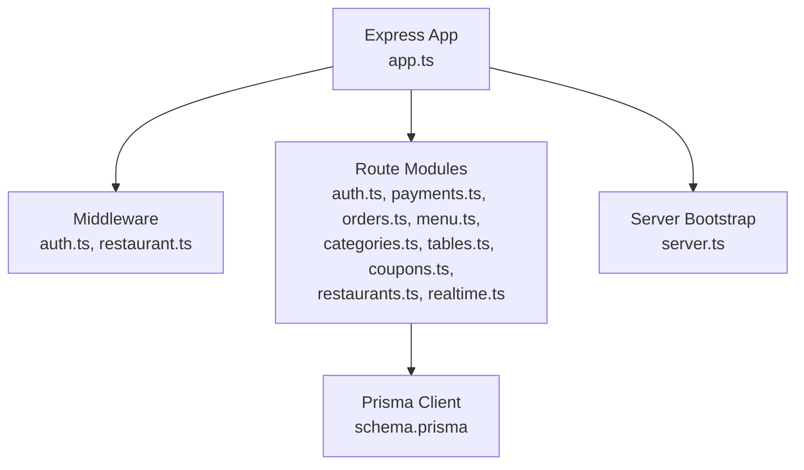
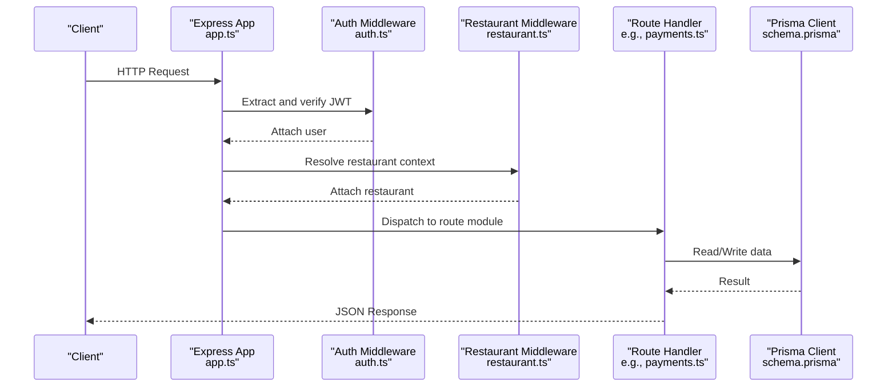
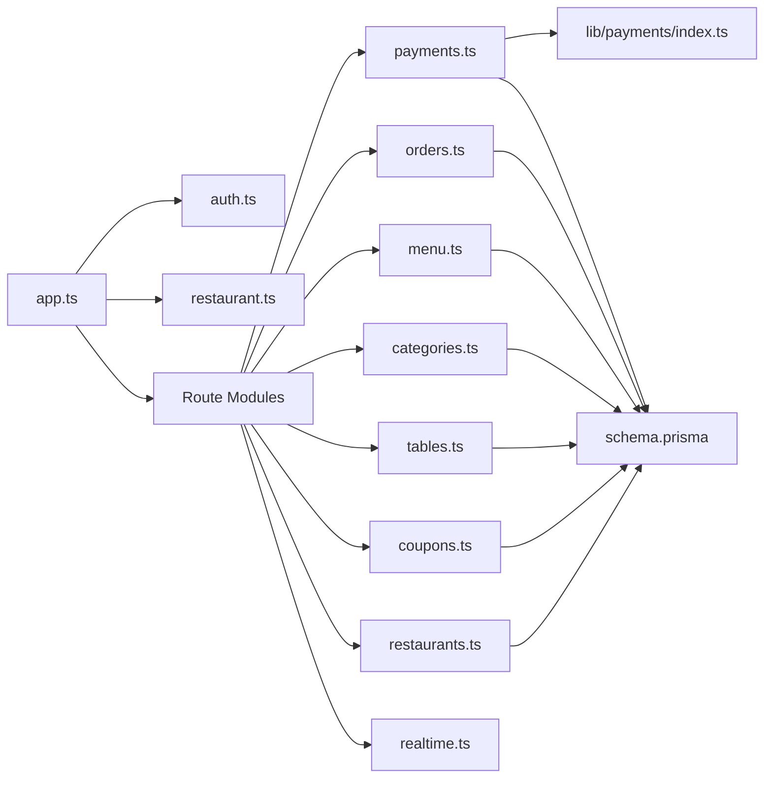
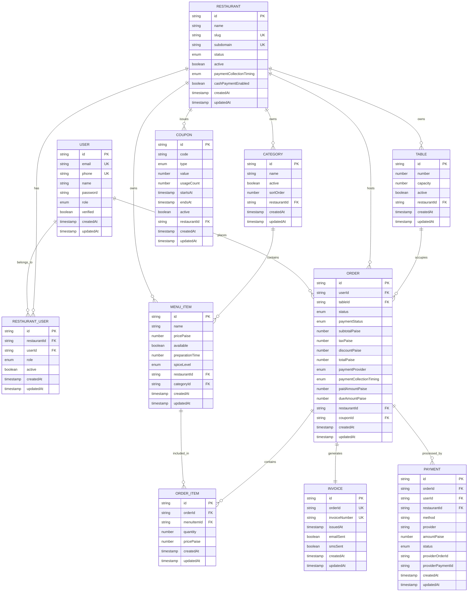

# API Documentation

<cite>
**Referenced Files in This Document**
- [app.ts](file://restaurant-backend/src/app.ts)
- [server.ts](file://restaurant-backend/src/server.ts)
- [auth.ts](file://restaurant-backend/src/middleware/auth.ts)
- [restaurant.ts](file://restaurant-backend/src/middleware/restaurant.ts)
- [auth.ts](file://restaurant-backend/src/routes/auth.ts)
- [payments.ts](file://restaurant-backend/src/routes/payments.ts)
- [orders.ts](file://restaurant-backend/src/routes/orders.ts)
- [menu.ts](file://restaurant-backend/src/routes/menu.ts)
- [categories.ts](file://restaurant-backend/src/routes/categories.ts)
- [tables.ts](file://restaurant-backend/src/routes/tables.ts)
- [coupons.ts](file://restaurant-backend/src/routes/coupons.ts)
- [restaurants.ts](file://restaurant-backend/src/routes/restaurants.ts)
- [realtime.ts](file://restaurant-backend/src/routes/realtime.ts)
- [index.ts](file://restaurant-backend/src/lib/payments/index.ts)
- [schema.prisma](file://restaurant-backend/prisma/schema.prisma)
- [api.ts](file://restaurant-backend/src/types/api.ts)
- [DeQ-Restaurants-API.postman_collection.json](file://restaurant-backend/postman/DeQ-Restaurants-API.postman_collection.json)
</cite>

## Table of Contents
1. [Introduction](#introduction)
2. [Project Structure](#project-structure)
3. [Core Components](#core-components)
4. [Architecture Overview](#architecture-overview)
5. [Detailed Component Analysis](#detailed-component-analysis)
6. [Dependency Analysis](#dependency-analysis)
7. [Performance Considerations](#performance-considerations)
8. [Troubleshooting Guide](#troubleshooting-guide)
9. [Conclusion](#conclusion)
10. [Appendices](#appendices)

## Introduction
This document provides comprehensive API documentation for DeQ-Bite’s Restaurant Management System backend. It covers authentication, payment processing, order management, menu and category administration, restaurant profiles and settings, table management, coupon and offer systems, invoice generation, and real-time communication. It includes endpoint specifications, request/response schemas, authentication requirements, rate limiting, CORS configuration, and security considerations. A Postman collection is integrated for interactive testing.

## Project Structure
The backend is an Express-based TypeScript application with modular routing and middleware. Key areas:
- Application bootstrap and middleware stack
- Tenant-aware routing under restaurant slugs
- Route groups for auth, payments, orders, menu, categories, tables, coupons, restaurants, offers, invoices, PDFs, and real-time events
- Prisma schema defining core domain models and enums
- Types for API responses and authenticated requests

**Diagram sources**
- [app.ts](file://restaurant-backend/src/app.ts#L34-L147)
- [server.ts](file://restaurant-backend/src/server.ts#L1-L33)
- [auth.ts](file://restaurant-backend/src/middleware/auth.ts#L1-L137)
- [restaurant.ts](file://restaurant-backend/src/middleware/restaurant.ts#L76-L200)
- [schema.prisma](file://restaurant-backend/prisma/schema.prisma#L11-L384)

**Section sources**
- [app.ts](file://restaurant-backend/src/app.ts#L1-L148)
- [server.ts](file://restaurant-backend/src/server.ts#L1-L33)

## Core Components
- Authentication middleware validates JWT and attaches user context.
- Restaurant context middleware resolves tenant context via slug/subdomain/host/path.
- Route modules encapsulate business logic per domain (auth, payments, orders, etc.).
- Payment provider abstraction supports multiple gateways.
- Real-time streaming via Server-Sent Events.

**Section sources**
- [auth.ts](file://restaurant-backend/src/middleware/auth.ts#L7-L75)
- [restaurant.ts](file://restaurant-backend/src/middleware/restaurant.ts#L76-L200)
- [index.ts](file://restaurant-backend/src/lib/payments/index.ts#L1-L124)

## Architecture Overview
High-level API architecture and request flow:

**Diagram sources**
- [app.ts](file://restaurant-backend/src/app.ts#L107-L126)
- [auth.ts](file://restaurant-backend/src/middleware/auth.ts#L7-L75)
- [restaurant.ts](file://restaurant-backend/src/middleware/restaurant.ts#L76-L200)
- [payments.ts](file://restaurant-backend/src/routes/payments.ts#L195-L292)
- [schema.prisma](file://restaurant-backend/prisma/schema.prisma#L144-L175)

## Detailed Component Analysis

### Authentication Endpoints
- Register
  - Method: POST
  - URL: /api/auth/register
  - Auth: None
  - Body: name, email, phone (optional), password
  - Response: user, token
  - Validation: Zod schema enforces length/email/format rules
  - Security: Password hashed, JWT generated with expiration
- Login
  - Method: POST
  - URL: /api/auth/login
  - Auth: None
  - Body: email, password
  - Response: user with recent orders, token
  - Security: Password comparison, JWT issuance
- Profile
  - Method: GET
  - URL: /api/auth/profile
  - Auth: Required (Bearer)
  - Response: user profile with order stats and recent orders
- Me
  - Method: GET
  - URL: /api/auth/me
  - Auth: Required (Bearer)
  - Response: user with restaurant role and recent orders
- Change Password
  - Method: PUT
  - URL: /api/auth/change-password
  - Auth: Required (Bearer)
  - Body: currentPassword, newPassword
  - Response: success message
- Refresh Token
  - Method: POST
  - URL: /api/auth/refresh
  - Auth: Required (Bearer)
  - Response: new token

Authentication headers:
- Authorization: Bearer <token>

Validation and error handling:
- Zod schemas enforce request payloads
- AppError thrown for invalid credentials, duplicates, not found, etc.

**Section sources**
- [auth.ts](file://restaurant-backend/src/routes/auth.ts#L47-L158)
- [auth.ts](file://restaurant-backend/src/routes/auth.ts#L160-L232)
- [auth.ts](file://restaurant-backend/src/routes/auth.ts#L234-L335)
- [auth.ts](file://restaurant-backend/src/routes/auth.ts#L337-L373)
- [auth.ts](file://restaurant-backend/src/routes/auth.ts#L375-L387)
- [auth.ts](file://restaurant-backend/src/middleware/auth.ts#L7-L75)

### Payment Processing Endpoints
Supported providers: RAZORPAY, PAYTM (placeholder), PHONEPE (placeholder), CASH.

- List Providers
  - Method: GET
  - URL: /api/restaurants/:restaurantId/payments/providers
  - Auth: Required (Bearer), Restaurant context, Owner/Admin/Staff
  - Response: providers array
- Create Payment Order
  - Method: POST
  - URL: /api/restaurants/:restaurantId/payments/create
  - Auth: Required (Bearer), Restaurant context, Owner/Admin/Staff
  - Body: orderId, paymentProvider (optional)
  - Response: paymentOrderId, amountPaise, currency, provider, publicKey, redirectUrl, customer details
- Verify Payment
  - Method: POST
  - URL: /api/restaurants/:restaurantId/payments/verify
  - Auth: Required (Bearer), Restaurant context, Owner/Admin/Staff
  - Body: razorpay_order_id, razorpay_payment_id, razorpay_signature
  - Response: order, paymentId
- Refund Payment
  - Method: POST
  - URL: /api/restaurants/:restaurantId/payments/refund
  - Auth: Required (Bearer), Restaurant context, Owner/Admin
  - Body: orderId, amount (optional), reason (optional)
  - Response: refundId, amount, status
- Cash Confirm
  - Method: POST
  - URL: /api/restaurants/:restaurantId/payments/cash/confirm
  - Auth: Required (Bearer), Restaurant context, Owner/Admin
  - Body: orderId, amountPaise (optional)
  - Response: order
- Update Payment Status
  - Method: PUT
  - URL: /api/restaurants/:restaurantId/payments/status
  - Auth: Required (Bearer), Restaurant context, Owner/Admin
  - Body: orderId, paymentStatus, paidAmountPaise (required for PARTIALLY_PAID)
  - Response: order
- Payment Status
  - Method: GET
  - URL: /api/restaurants/:restaurantId/payments/status/:orderId
  - Auth: Required (Bearer), Restaurant context
  - Response: order with payments history

Provider abstraction:
- Provider selection and capability checks
- Signature verification and refund support for enabled providers

Invoice and earning automation:
- Fully paid orders trigger invoice creation and earning record creation

**Section sources**
- [payments.ts](file://restaurant-backend/src/routes/payments.ts#L180-L193)
- [payments.ts](file://restaurant-backend/src/routes/payments.ts#L195-L292)
- [payments.ts](file://restaurant-backend/src/routes/payments.ts#L294-L407)
- [payments.ts](file://restaurant-backend/src/routes/payments.ts#L409-L516)
- [payments.ts](file://restaurant-backend/src/routes/payments.ts#L518-L568)
- [payments.ts](file://restaurant-backend/src/routes/payments.ts#L570-L646)
- [payments.ts](file://restaurant-backend/src/routes/payments.ts#L648-L728)
- [index.ts](file://restaurant-backend/src/lib/payments/index.ts#L40-L81)

### Order Management Endpoints
- Create Order
  - Method: POST
  - URL: /api/restaurants/:restaurantId/orders
  - Auth: Required (Bearer), Restaurant context
  - Body: tableId, items[], specialInstructions (optional), couponCode (optional), paymentProvider (RAZORPAY, PAYTM, PHONEPE, CASH)
  - Response: order
  - Behavior: Applies coupon, computes tax, sets initial status and paymentStatus based on provider and timing
- Add Items to Order
  - Method: POST
  - URL: /api/restaurants/:restaurantId/orders/:id/items
  - Auth: Required (Bearer), Restaurant context
  - Body: items[], specialInstructions (optional)
  - Response: updated order
- Apply Coupon
  - Method: POST
  - URL: /api/restaurants/:restaurantId/orders/:id/apply-coupon
  - Auth: Required (Bearer), Restaurant context
  - Body: couponCode
  - Response: updated order
- My Orders
  - Method: GET
  - URL: /api/restaurants/:restaurantId/orders
  - Auth: Required (Bearer), Restaurant context
  - Response: orders[]
- Restaurant All Orders
  - Method: GET
  - URL: /api/restaurants/:restaurantId/orders/restaurant/all
  - Auth: Required (Bearer), Restaurant context (Owner/Admin/Staff)
  - Response: orders[]
- Get Order by ID
  - Method: GET
  - URL: /api/restaurants/:restaurantId/orders/:id
  - Auth: Required (Bearer), Restaurant context
  - Response: order
- Update Order Status
  - Method: PUT
  - URL: /api/restaurants/:restaurantId/orders/:id/status
  - Auth: Required (Bearer), Restaurant context (Owner/Admin/Staff)
  - Body: status
  - Response: order
- Cancel Order
  - Method: PUT
  - URL: /api/restaurants/:restaurantId/orders/:id/cancel
  - Auth: Required (Bearer), Restaurant context
  - Response: cancelled order

Constraints and validations:
- Items must include menuItemId and quantity
- Menu items must be available
- Pay-before-meal orders cannot accept additional items
- Status transitions constrained by payment collection timing

**Section sources**
- [orders.ts](file://restaurant-backend/src/routes/orders.ts#L82-L267)
- [orders.ts](file://restaurant-backend/src/routes/orders.ts#L269-L394)
- [orders.ts](file://restaurant-backend/src/routes/orders.ts#L396-L497)
- [orders.ts](file://restaurant-backend/src/routes/orders.ts#L499-L524)
- [orders.ts](file://restaurant-backend/src/routes/orders.ts#L526-L546)
- [orders.ts](file://restaurant-backend/src/routes/orders.ts#L548-L579)
- [orders.ts](file://restaurant-backend/src/routes/orders.ts#L581-L629)
- [orders.ts](file://restaurant-backend/src/routes/orders.ts#L631-L691)

### Menu and Categories Endpoints
- List Menu Items
  - Method: GET
  - URL: /api/restaurants/:restaurantId/menu
  - Auth: Required (Bearer), Restaurant context
  - Query: categoryId (optional)
  - Response: menuItems[]
- Admin: List All Menu Items
  - Method: GET
  - URL: /api/restaurants/:restaurantId/menu/admin/all
  - Auth: Required (Bearer), Restaurant context (Owner/Admin/Staff)
  - Response: menuItems[]
- Get Menu Item
  - Method: GET
  - URL: /api/restaurants/:restaurantId/menu/:id
  - Auth: Required (Bearer), Restaurant context
  - Response: menuItem
- Create Menu Item
  - Method: POST
  - URL: /api/restaurants/:restaurantId/menu
  - Auth: Required (Bearer), Restaurant context (Owner/Admin)
  - Body: name, description, pricePaise, image, categoryId, available, preparationTime, ingredients, allergens, isVeg, isVegan, isGlutenFree, spiceLevel
  - Response: menuItem
- Update Menu Item
  - Method: PUT
  - URL: /api/restaurants/:restaurantId/menu/:id
  - Auth: Required (Bearer), Restaurant context (Owner/Admin)
  - Body: partial fields above
  - Response: menuItem
- Toggle Availability
  - Method: PATCH
  - URL: /api/restaurants/:restaurantId/menu/:id/availability
  - Auth: Required (Bearer), Restaurant context (Owner/Admin)
  - Body: available (boolean)
  - Response: menuItem
- Delete Menu Item
  - Method: DELETE
  - URL: /api/restaurants/:restaurantId/menu/:id
  - Auth: Required (Bearer), Restaurant context (Owner/Admin)
  - Response: success message

Categories:
- List Categories
  - Method: GET
  - URL: /api/restaurants/:restaurantId/categories
  - Auth: Required (Bearer), Restaurant context
  - Response: categories[]
- Get Category
  - Method: GET
  - URL: /api/restaurants/:restaurantId/categories/:id
  - Auth: Required (Bearer), Restaurant context
  - Response: category

**Section sources**
- [menu.ts](file://restaurant-backend/src/routes/menu.ts#L28-L60)
- [menu.ts](file://restaurant-backend/src/routes/menu.ts#L62-L89)
- [menu.ts](file://restaurant-backend/src/routes/menu.ts#L91-L135)
- [menu.ts](file://restaurant-backend/src/routes/menu.ts#L137-L192)
- [menu.ts](file://restaurant-backend/src/routes/menu.ts#L194-L268)
- [menu.ts](file://restaurant-backend/src/routes/menu.ts#L270-L316)
- [menu.ts](file://restaurant-backend/src/routes/menu.ts#L318-L353)
- [categories.ts](file://restaurant-backend/src/routes/categories.ts#L8-L34)
- [categories.ts](file://restaurant-backend/src/routes/categories.ts#L36-L84)

### Table Management Endpoints
- List Tables
  - Method: GET
  - URL: /api/restaurants/:restaurantId/tables
  - Auth: Required (Bearer), Restaurant context
  - Response: tables[]
- List Available Tables
  - Method: GET
  - URL: /api/restaurants/:restaurantId/tables/available
  - Auth: Required (Bearer), Restaurant context
  - Response: tables[]
- Get Table by ID
  - Method: GET
  - URL: /api/restaurants/:restaurantId/tables/:id
  - Auth: Required (Bearer), Restaurant context
  - Response: table

**Section sources**
- [tables.ts](file://restaurant-backend/src/routes/tables.ts#L8-L26)
- [tables.ts](file://restaurant-backend/src/routes/tables.ts#L28-L49)
- [tables.ts](file://restaurant-backend/src/routes/tables.ts#L51-L89)

### Coupon System Endpoints
- List Coupons
  - Method: GET
  - URL: /api/restaurants/:restaurantId/coupons
  - Auth: Required (Bearer), Restaurant context (Owner/Admin/Staff)
  - Response: coupons[]
- Create Coupon
  - Method: POST
  - URL: /api/restaurants/:restaurantId/coupons
  - Auth: Required (Bearer), Restaurant context (Owner/Admin)
  - Body: code, description, type (PERCENT/FIXED), value, maxDiscountPaise, minOrderPaise, usageLimit, startsAt, endsAt, active
  - Response: coupon
- Update Coupon
  - Method: PUT
  - URL: /api/restaurants/:restaurantId/coupons/:id
  - Auth: Required (Bearer), Restaurant context (Owner/Admin)
  - Body: partial fields above
  - Response: coupon
- Validate Coupon
  - Method: POST
  - URL: /api/restaurants/:restaurantId/coupons/validate
  - Auth: Required (Bearer), Restaurant context
  - Body: code, subtotalPaise
  - Response: coupon, discountPaise, taxPaise, totalPaise

Coupon rules:
- Active, valid time window, usage limit, and minimum order threshold enforced
- Discount computed with caps

**Section sources**
- [coupons.ts](file://restaurant-backend/src/routes/coupons.ts#L52-L64)
- [coupons.ts](file://restaurant-backend/src/routes/coupons.ts#L66-L97)
- [coupons.ts](file://restaurant-backend/src/routes/coupons.ts#L99-L139)
- [coupons.ts](file://restaurant-backend/src/routes/coupons.ts#L141-L193)

### Restaurant Administration Endpoints
- Public Search
  - Method: GET
  - URL: /api/restaurants/public/search?query=&cuisine=&location=
  - Auth: None
  - Response: restaurants[]
- Public Detail
  - Method: GET
  - URL: /api/restaurants/public/:identifier
  - Auth: None
  - Response: restaurant
- Current Restaurant
  - Method: GET
  - URL: /api/restaurants/current
  - Auth: Required (Bearer), Restaurant context
  - Response: restaurant
- Mine
  - Method: GET
  - URL: /api/restaurants/mine
  - Auth: Required (Bearer)
  - Response: restaurants[]
- Create Restaurant
  - Method: POST
  - URL: /api/restaurants
  - Auth: Required (Bearer)
  - Body: name, email, phone, address, city, state, country, cuisineTypes[]
  - Response: restaurant
- Payment Policy (GET/PUT)
  - Method: GET
  - URL: /api/restaurants/settings/payment-policy
  - Auth: Required (Bearer), Restaurant context (Owner/Admin)
  - Response: paymentPolicy
  - Method: PUT
  - URL: /api/restaurants/settings/payment-policy
  - Auth: Required (Bearer), Restaurant context (Owner/Admin)
  - Body: paymentCollectionTiming (BEFORE_MEAL/AFTER_MEAL), cashPaymentEnabled (boolean)
  - Response: paymentPolicy
- List Restaurant Users
  - Method: GET
  - URL: /api/restaurants/users
  - Auth: Required (Bearer), Restaurant context (Owner/Admin)
  - Response: users[]
- Add/Update Restaurant User
  - Method: POST
  - URL: /api/restaurants/users
  - Auth: Required (Bearer), Restaurant context (Owner/Admin)
  - Body: email, role (OWNER/ADMIN/STAFF)
  - Response: membership

**Section sources**
- [restaurants.ts](file://restaurant-backend/src/routes/restaurants.ts#L92-L164)
- [restaurants.ts](file://restaurant-backend/src/routes/restaurants.ts#L166-L250)
- [restaurants.ts](file://restaurant-backend/src/routes/restaurants.ts#L252-L260)
- [restaurants.ts](file://restaurant-backend/src/routes/restaurants.ts#L262-L305)
- [restaurants.ts](file://restaurant-backend/src/routes/restaurants.ts#L307-L375)
- [restaurants.ts](file://restaurant-backend/src/routes/restaurants.ts#L377-L394)
- [restaurants.ts](file://restaurant-backend/src/routes/restaurants.ts#L396-L429)
- [restaurants.ts](file://restaurant-backend/src/routes/restaurants.ts#L431-L480)
- [restaurants.ts](file://restaurant-backend/src/routes/restaurants.ts#L482-L551)

### Real-Time Communication
- Server-Sent Events
  - Method: GET
  - URL: /api/r/:restaurantSlug/events
  - Auth: Required (Bearer), Restaurant context
  - Headers: x-restaurant-slug or x-restaurant-subdomain
  - Response: SSE stream with order events (ping, order.created, order.updated)

**Section sources**
- [realtime.ts](file://restaurant-backend/src/routes/realtime.ts#L9-L37)

### Additional System Endpoints
- Health Check
  - Method: GET
  - URL: /health
  - Auth: None
  - Response: status, timestamp, uptime, environment
- Root
  - Method: GET
  - URL: /
  - Auth: None
  - Response: welcome message

**Section sources**
- [app.ts](file://restaurant-backend/src/app.ts#L92-L105)

## Dependency Analysis
Key dependencies and relationships:
- Express app composes middleware and routes
- Route handlers depend on Prisma client for persistence
- Payment provider abstraction decouples gateway specifics
- Real-time events integrate with order updates

**Diagram sources**
- [app.ts](file://restaurant-backend/src/app.ts#L107-L126)
- [auth.ts](file://restaurant-backend/src/middleware/auth.ts#L7-L75)
- [restaurant.ts](file://restaurant-backend/src/middleware/restaurant.ts#L76-L200)
- [payments.ts](file://restaurant-backend/src/routes/payments.ts#L1-L731)
- [orders.ts](file://restaurant-backend/src/routes/orders.ts#L1-L694)
- [menu.ts](file://restaurant-backend/src/routes/menu.ts#L1-L356)
- [categories.ts](file://restaurant-backend/src/routes/categories.ts#L1-L87)
- [tables.ts](file://restaurant-backend/src/routes/tables.ts#L1-L92)
- [coupons.ts](file://restaurant-backend/src/routes/coupons.ts#L1-L196)
- [restaurants.ts](file://restaurant-backend/src/routes/restaurants.ts#L1-L554)
- [realtime.ts](file://restaurant-backend/src/routes/realtime.ts#L1-L40)
- [index.ts](file://restaurant-backend/src/lib/payments/index.ts#L1-L124)
- [schema.prisma](file://restaurant-backend/prisma/schema.prisma#L11-L384)

**Section sources**
- [app.ts](file://restaurant-backend/src/app.ts#L107-L126)

## Performance Considerations
- Rate limiting: 200 requests per 15 minutes per IP
- Request body limits: JSON size up to 10MB
- Transactional writes: Payments and order updates use Prisma transactions to maintain consistency
- Streaming SSE: Efficient real-time updates without polling
- Optional fields and dynamic selects: Schema compatibility across deployments reduces downtime during migrations

[No sources needed since this section provides general guidance]

## Troubleshooting Guide
Common issues and resolutions:
- 401 Unauthorized: Missing or invalid Authorization header; ensure Bearer token is present and valid
- 403 Forbidden: Insufficient permissions; verify restaurant membership and role
- 400 Bad Request: Validation errors (missing fields, invalid types, coupon constraints)
- 404 Not Found: Entity not found (user, order, menu item, coupon)
- 429 Too Many Requests: Exceeded rate limit; wait before retrying
- CORS blocked: Origin not allowed; ensure frontend origin is whitelisted

**Section sources**
- [app.ts](file://restaurant-backend/src/app.ts#L42-L65)
- [auth.ts](file://restaurant-backend/src/middleware/auth.ts#L33-L75)
- [restaurant.ts](file://restaurant-backend/src/middleware/restaurant.ts#L202-L211)
- [payments.ts](file://restaurant-backend/src/routes/payments.ts#L225-L235)
- [orders.ts](file://restaurant-backend/src/routes/orders.ts#L91-L108)

## Conclusion
DeQ-Bite’s API provides a comprehensive, tenant-aware, and secure REST interface for restaurant operations. It emphasizes strong authentication, validated inputs, flexible payment providers, and real-time updates. The modular design and Prisma schema enable scalable growth and operational reliability.

[No sources needed since this section summarizes without analyzing specific files]

## Appendices

### Authentication and Security
- JWT-based session with configurable expiration
- Environment validation for secrets
- Role-based access control per restaurant
- CORS whitelist for development and production origins
- Rate limiting to prevent abuse

**Section sources**
- [app.ts](file://restaurant-backend/src/app.ts#L28-L32)
- [app.ts](file://restaurant-backend/src/app.ts#L42-L65)
- [app.ts](file://restaurant-backend/src/app.ts#L67-L75)
- [auth.ts](file://restaurant-backend/src/middleware/auth.ts#L40-L44)
- [restaurant.ts](file://restaurant-backend/src/middleware/restaurant.ts#L213-L245)

### Request/Response Examples and Schemas
- Example requests and responses are available in the Postman collection.
- Representative JSON schemas are defined in the types and route handlers.

**Section sources**
- [DeQ-Restaurants-API.postman_collection.json](file://restaurant-backend/postman/DeQ-Restaurants-API.postman_collection.json#L76-L196)
- [api.ts](file://restaurant-backend/src/types/api.ts#L107-L114)

### API Versioning and Base URL
- Base URL: http://localhost:5000 (adjust per deployment)
- Versioning: No explicit version path; use latest stable endpoints under /api and /api/restaurants/:restaurantId

**Section sources**
- [app.ts](file://restaurant-backend/src/app.ts#L101-L105)

### Client Implementation Guidelines
- Use Authorization: Bearer <token> for protected endpoints
- Set x-restaurant-slug or x-restaurant-subdomain for tenant-aware endpoints
- Respect rate limits and handle 429 responses
- Subscribe to SSE events for real-time updates

**Section sources**
- [auth.ts](file://restaurant-backend/src/middleware/auth.ts#L13-L38)
- [restaurant.ts](file://restaurant-backend/src/middleware/restaurant.ts#L85-L99)
- [realtime.ts](file://restaurant-backend/src/routes/realtime.ts#L9-L37)

### Data Model Overview
Core entities and relationships:

**Diagram sources**
- [schema.prisma](file://restaurant-backend/prisma/schema.prisma#L11-L384)