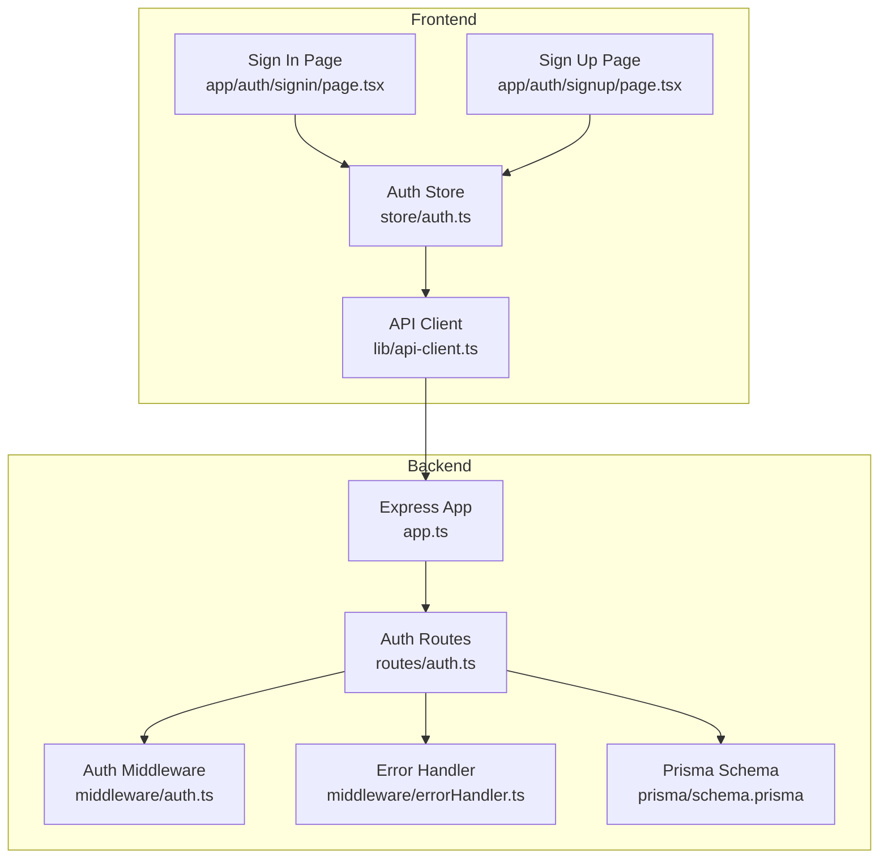
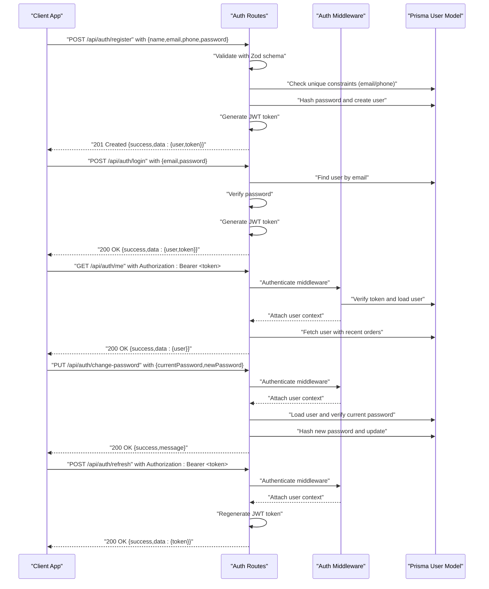
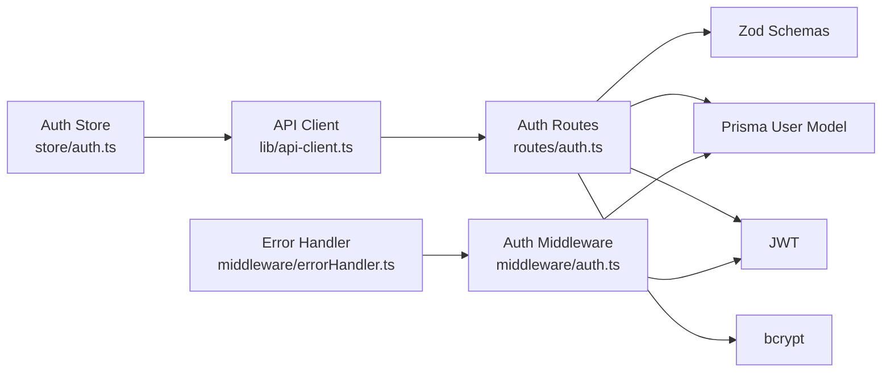
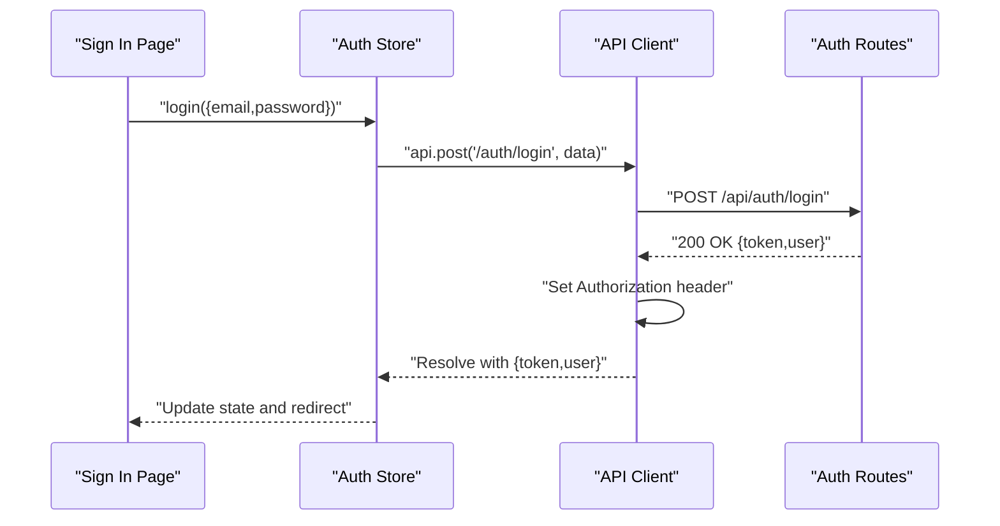

# Authentication Endpoints

<cite>
**Referenced Files in This Document**
- [auth.ts](file://restaurant-backend/src/routes/auth.ts)
- [auth-middleware.ts](file://restaurant-backend/src/middleware/auth.ts)
- [error-handler.ts](file://restaurant-backend/src/middleware/errorHandler.ts)
- [api-types.ts](file://restaurant-backend/src/types/api.ts)
- [app.ts](file://restaurant-backend/src/app.ts)
- [schema.prisma](file://restaurant-backend/prisma/schema.prisma)
- [api-client.ts](file://restaurant-frontend/src/lib/api-client.ts)
- [auth-store.ts](file://restaurant-frontend/src/store/auth.ts)
- [signin-page.tsx](file://restaurant-frontend/src/app/auth/signin/page.tsx)
- [signup-page.tsx](file://restaurant-frontend/src/app/auth/signup/page.tsx)
- [DeQ-Restaurants-API.postman_collection.json](file://restaurant-backend/postman/DeQ-Restaurants-API.postman_collection.json)
- [env.d.ts](file://restaurant-backend/src/types/env.d.ts)
- [render.yaml](file://restaurant-backend/render.yaml)
</cite>

## Table of Contents
1. [Introduction](#introduction)
2. [Project Structure](#project-structure)
3. [Core Components](#core-components)
4. [Architecture Overview](#architecture-overview)
5. [Detailed Component Analysis](#detailed-component-analysis)
6. [Dependency Analysis](#dependency-analysis)
7. [Performance Considerations](#performance-considerations)
8. [Troubleshooting Guide](#troubleshooting-guide)
9. [Conclusion](#conclusion)
10. [Appendices](#appendices)

## Introduction
This document provides comprehensive API documentation for DeQ-Bite's authentication endpoints. It covers all authentication-related HTTP endpoints, including user registration, login, profile retrieval, password modification, and token refresh. The documentation includes request/response schemas, validation rules, error codes, JWT token generation and expiration handling, security considerations, and practical client implementation examples for proper authentication flow, token storage, and error handling patterns.

## Project Structure
The authentication system spans the backend Express routes, middleware, and Prisma models, and integrates with the frontend API client and state management.

**Diagram sources**
- [app.ts](file://restaurant-backend/src/app.ts#L107-L107)
- [auth.ts](file://restaurant-backend/src/routes/auth.ts#L1-L10)
- [auth-middleware.ts](file://restaurant-backend/src/middleware/auth.ts#L1-L137)
- [error-handler.ts](file://restaurant-backend/src/middleware/errorHandler.ts#L1-L82)
- [schema.prisma](file://restaurant-backend/prisma/schema.prisma#L11-L25)
- [api-client.ts](file://restaurant-frontend/src/lib/api-client.ts#L194-L240)
- [auth-store.ts](file://restaurant-frontend/src/store/auth.ts#L24-L177)
- [signin-page.tsx](file://restaurant-frontend/src/app/auth/signin/page.tsx#L9-L163)
- [signup-page.tsx](file://restaurant-frontend/src/app/auth/signup/page.tsx#L9-L225)

**Section sources**
- [app.ts](file://restaurant-backend/src/app.ts#L107-L107)
- [auth.ts](file://restaurant-backend/src/routes/auth.ts#L1-L10)
- [auth-middleware.ts](file://restaurant-backend/src/middleware/auth.ts#L1-L137)
- [api-client.ts](file://restaurant-frontend/src/lib/api-client.ts#L194-L240)
- [auth-store.ts](file://restaurant-frontend/src/store/auth.ts#L24-L177)

## Core Components
- Authentication routes: Registration, login, profile retrieval, password change, and token refresh.
- JWT middleware: Extracts and validates Authorization headers, verifies tokens, and attaches user context.
- Zod validation schemas: Enforce request payload constraints for registration, login, and password change.
- Prisma models: Define the User entity and related relations used by authentication flows.
- Frontend API client: Manages token injection, interceptors, and error handling for authenticated requests.
- Auth store: Centralized state for user session, token persistence, and profile updates.

**Section sources**
- [auth.ts](file://restaurant-backend/src/routes/auth.ts#L12-L45)
- [auth-middleware.ts](file://restaurant-backend/src/middleware/auth.ts#L7-L75)
- [schema.prisma](file://restaurant-backend/prisma/schema.prisma#L11-L25)
- [api-client.ts](file://restaurant-frontend/src/lib/api-client.ts#L206-L239)
- [auth-store.ts](file://restaurant-frontend/src/store/auth.ts#L24-L177)

## Architecture Overview
The authentication flow follows a standard JWT-based pattern:
- Clients send credentials or tokens via Authorization headers.
- Backend middleware validates tokens and attaches user context.
- Routes enforce validation schemas and interact with Prisma for user data.
- Frontend stores tokens in local storage and injects them automatically for subsequent requests.

**Diagram sources**
- [auth.ts](file://restaurant-backend/src/routes/auth.ts#L47-L102)
- [auth.ts](file://restaurant-backend/src/routes/auth.ts#L104-L158)
- [auth.ts](file://restaurant-backend/src/routes/auth.ts#L160-L232)
- [auth.ts](file://restaurant-backend/src/routes/auth.ts#L337-L373)
- [auth.ts](file://restaurant-backend/src/routes/auth.ts#L375-L387)
- [auth-middleware.ts](file://restaurant-backend/src/middleware/auth.ts#L7-L75)
- [schema.prisma](file://restaurant-backend/prisma/schema.prisma#L11-L25)

## Detailed Component Analysis

### Endpoint: POST /api/auth/register
- Purpose: Register a new customer user.
- Authentication: Not required.
- Request headers: Content-Type: application/json.
- Request body (JSON):
  - name: string (min 2, max 50)
  - email: string (valid email)
  - phone: string (optional, min 10)
  - password: string (min 6)
- Response body (JSON):
  - success: boolean
  - message: string
  - data.user: object (id, name, email, phone, role, verified, createdAt)
  - data.token: string (JWT)
- Validation:
  - Zod schema enforces field lengths and formats.
  - Unique constraint checks on email and phone.
- Error codes:
  - 400: Validation errors.
  - 409: User with this email or phone already exists.
  - 500: JWT_SECRET not configured.
- Example request (Postman):
  - Method: POST
  - URL: {{baseUrl}}/api/auth/register
  - Headers: Content-Type: application/json
  - Body: {"name":"Test User","email":"test@example.com","phone":"9999999999","password":"Password123"}
- Example response:
  - Status: 201
  - Body: {"success":true,"message":"User registered successfully","data":{"user":{"id":"...","name":"Test User","email":"test@example.com","phone":"9999999999","role":"CUSTOMER","verified":false,"createdAt":"..."},"token":"<JWT>"}}

**Section sources**
- [auth.ts](file://restaurant-backend/src/routes/auth.ts#L12-L18)
- [auth.ts](file://restaurant-backend/src/routes/auth.ts#L47-L102)
- [schema.prisma](file://restaurant-backend/prisma/schema.prisma#L11-L25)
- [DeQ-Restaurants-API.postman_collection.json](file://restaurant-backend/postman/DeQ-Restaurants-API.postman_collection.json#L76-L104)

### Endpoint: POST /api/auth/login
- Purpose: Authenticate an existing user.
- Authentication: Not required.
- Request headers: Content-Type: application/json.
- Request body (JSON):
  - email: string (valid email)
  - password: string (min 1)
- Response body (JSON):
  - success: boolean
  - message: string
  - data.user: object (id, name, email, phone, role, verified, createdAt, recentOrders[])
  - data.token: string (JWT)
- Validation:
  - Zod schema enforces email and password presence.
  - Password comparison via bcrypt.
- Error codes:
  - 400: Validation errors.
  - 401: Invalid email or password.
  - 500: JWT_SECRET not configured.
- Example request (Postman):
  - Method: POST
  - URL: {{baseUrl}}/api/auth/login
  - Headers: Content-Type: application/json
  - Body: {"email":"test@example.com","password":"Password123"}
- Example response:
  - Status: 200
  - Body: {"success":true,"message":"Login successful","data":{"user":{"id":"...","name":"Test User","email":"test@example.com","phone":"9999999999","role":"CUSTOMER","verified":false,"createdAt":"...","recentOrders":[{"id":"...","status":"PENDING","totalPaise":0,"createdAt":"..."}]},"token":"<JWT>"}}

**Section sources**
- [auth.ts](file://restaurant-backend/src/routes/auth.ts#L20-L23)
- [auth.ts](file://restaurant-backend/src/routes/auth.ts#L104-L158)
- [auth.ts](file://restaurant-backend/src/routes/auth.ts#L112-L123)

### Endpoint: GET /api/auth/me
- Purpose: Retrieve authenticated user profile with recent orders and counts.
- Authentication: Required (Authorization: Bearer <token>).
- Request headers: Authorization: Bearer <token>.
- Response body (JSON):
  - success: boolean
  - data.user: object (id, name, email, phone, role, verified, createdAt, updatedAt, orders[], totalOrders, recentOrders[], restaurantRole)
- Validation:
  - Middleware extracts token from Authorization header and verifies it.
  - Optional restaurant membership lookup for restaurantRole.
- Error codes:
  - 401: Access denied, no token provided, invalid token, or token expired.
  - 404: User not found.
  - 500: JWT_SECRET not configured.
- Example request (Postman):
  - Method: GET
  - URL: {{baseUrl}}/api/auth/me
  - Headers: Authorization: Bearer {{token}}
- Example response:
  - Status: 200
  - Body: {"success":true,"data":{"user":{"id":"...","name":"Test User","email":"test@example.com","phone":"9999999999","role":"CUSTOMER","verified":false,"createdAt":"...","updatedAt":"...","orders":[],"totalOrders":0,"recentOrders":[],"restaurantRole":null}}}

**Section sources**
- [auth.ts](file://restaurant-backend/src/routes/auth.ts#L160-L232)
- [auth-middleware.ts](file://restaurant-backend/src/middleware/auth.ts#L7-L75)
- [api-types.ts](file://restaurant-backend/src/types/api.ts#L3-L18)

### Endpoint: GET /api/auth/profile
- Purpose: Retrieve enhanced user profile with order history, statistics, and restaurant role.
- Authentication: Required (Authorization: Bearer <token>).
- Request headers: Authorization: Bearer <token>.
- Response body (JSON):
  - success: boolean
  - data.user: object (id, name, email, phone, role, verified, createdAt, updatedAt, orders[], totalOrders, totalSpent, recentOrders[], restaurantRole)
- Validation:
  - Middleware extracts and verifies token.
  - Aggregates total spent from completed orders.
  - Includes detailed order items and table info.
- Error codes:
  - 401: Access denied, invalid token, or token expired.
  - 404: User profile not found.
- Example request (Postman):
  - Method: GET
  - URL: {{baseUrl}}/api/auth/profile
  - Headers: Authorization: Bearer {{token}}
- Example response:
  - Status: 200
  - Body: {"success":true,"data":{"user":{"id":"...","name":"Test User","email":"test@example.com","phone":"9999999999","role":"CUSTOMER","verified":false,"createdAt":"...","updatedAt":"...","orders":[],"totalOrders":0,"totalSpent":0,"recentOrders":[],"restaurantRole":null}}}

**Section sources**
- [auth.ts](file://restaurant-backend/src/routes/auth.ts#L234-L335)
- [auth-middleware.ts](file://restaurant-backend/src/middleware/auth.ts#L7-L75)

### Endpoint: PUT /api/auth/change-password
- Purpose: Change user password after verifying current password.
- Authentication: Required (Authorization: Bearer <token>).
- Request headers: Authorization: Bearer <token>, Content-Type: application/json.
- Request body (JSON):
  - currentPassword: string (min 1)
  - newPassword: string (min 6)
- Response body (JSON):
  - success: boolean
  - message: string
- Validation:
  - Zod schema enforces current and new passwords.
  - Current password verification via bcrypt.
- Error codes:
  - 400: Validation errors or current password incorrect.
  - 404: User not found.
  - 401: Invalid token.
- Example request (Postman):
  - Method: PUT
  - URL: {{baseUrl}}/api/auth/change-password
  - Headers: Authorization: Bearer {{token}}, Content-Type: application/json
  - Body: {"currentPassword":"Password123","newPassword":"Password1234"}
- Example response:
  - Status: 200
  - Body: {"success":true,"message":"Password changed successfully"}

**Section sources**
- [auth.ts](file://restaurant-backend/src/routes/auth.ts#L25-L28)
- [auth.ts](file://restaurant-backend/src/routes/auth.ts#L337-L373)

### Endpoint: POST /api/auth/refresh
- Purpose: Refresh JWT token for authenticated users.
- Authentication: Required (Authorization: Bearer <token>).
- Request headers: Authorization: Bearer <token>.
- Response body (JSON):
  - success: boolean
  - message: string
  - data.token: string (new JWT)
- Validation:
  - Middleware authenticates and reissues token.
- Error codes:
  - 401: Invalid or expired token.
- Example request (Postman):
  - Method: POST
  - URL: {{baseUrl}}/api/auth/refresh
  - Headers: Authorization: Bearer {{token}}
- Example response:
  - Status: 200
  - Body: {"success":true,"message":"Token refreshed successfully","data":{"token":"<JWT>"}}

**Section sources**
- [auth.ts](file://restaurant-backend/src/routes/auth.ts#L375-L387)
- [auth-middleware.ts](file://restaurant-backend/src/middleware/auth.ts#L7-L75)

## Dependency Analysis
- Route dependencies:
  - Routes depend on Zod schemas for validation.
  - Routes depend on Prisma for user queries and updates.
  - Routes depend on JWT for token generation and on bcrypt for password hashing.
- Middleware dependencies:
  - Auth middleware depends on JWT verification and Prisma user lookup.
  - Error handler centralizes error responses and logging.
- Frontend dependencies:
  - API client injects Authorization headers and handles 401 responses.
  - Auth store persists tokens and orchestrates login/logout flows.

**Diagram sources**
- [auth.ts](file://restaurant-backend/src/routes/auth.ts#L12-L45)
- [auth.ts](file://restaurant-backend/src/routes/auth.ts#L30-L45)
- [auth-middleware.ts](file://restaurant-backend/src/middleware/auth.ts#L1-L137)
- [error-handler.ts](file://restaurant-backend/src/middleware/errorHandler.ts#L1-L82)
- [api-client.ts](file://restaurant-frontend/src/lib/api-client.ts#L206-L239)
- [auth-store.ts](file://restaurant-frontend/src/store/auth.ts#L24-L177)

**Section sources**
- [auth.ts](file://restaurant-backend/src/routes/auth.ts#L12-L45)
- [auth-middleware.ts](file://restaurant-backend/src/middleware/auth.ts#L1-L137)
- [error-handler.ts](file://restaurant-backend/src/middleware/errorHandler.ts#L1-L82)
- [api-client.ts](file://restaurant-frontend/src/lib/api-client.ts#L206-L239)
- [auth-store.ts](file://restaurant-frontend/src/store/auth.ts#L24-L177)

## Performance Considerations
- Token expiration: JWT expiration is configurable via environment variable. Shorter expirations improve security but increase refresh frequency; longer expirations reduce network overhead but increase risk.
- Password hashing: Salt rounds are set to balance security and performance. Adjusting rounds impacts CPU usage during registration and login.
- Database queries: Profile endpoints include nested selections and aggregations. Indexes on email and phone improve lookup performance.
- Rate limiting: Global rate limiter reduces abuse and protects endpoints from excessive requests.

[No sources needed since this section provides general guidance]

## Troubleshooting Guide
Common issues and resolutions:
- 400 Bad Request:
  - Validation errors from Zod schemas. Ensure request body matches schema requirements.
- 401 Unauthorized:
  - Missing or invalid Authorization header. Ensure Bearer token is present and valid.
  - Token expired. Use the refresh endpoint to obtain a new token.
- 404 Not Found:
  - User not found during profile retrieval or password change.
- 409 Conflict:
  - Duplicate email or phone during registration.
- 500 Internal Server Error:
  - JWT_SECRET not configured. Set JWT_SECRET and restart the service.

**Section sources**
- [auth.ts](file://restaurant-backend/src/routes/auth.ts#L61-L63)
- [auth.ts](file://restaurant-backend/src/routes/auth.ts#L125-L134)
- [auth.ts](file://restaurant-backend/src/routes/auth.ts#L346-L354)
- [auth-middleware.ts](file://restaurant-backend/src/middleware/auth.ts#L40-L44)
- [error-handler.ts](file://restaurant-backend/src/middleware/errorHandler.ts#L48-L64)

## Conclusion
DeQ-Bite’s authentication system provides secure, validated, and user-friendly endpoints for registration, login, profile retrieval, password modification, and token refresh. The backend enforces strict validation and JWT-based security, while the frontend integrates seamlessly with token storage and automatic header injection. Proper configuration of JWT_SECRET and environment variables is essential for production deployments.

[No sources needed since this section summarizes without analyzing specific files]

## Appendices

### Authentication Header Requirements
- All authenticated endpoints require Authorization: Bearer <token> in the request header.

**Section sources**
- [auth-middleware.ts](file://restaurant-backend/src/middleware/auth.ts#L16-L22)
- [api-client.ts](file://restaurant-frontend/src/lib/api-client.ts#L206-L212)

### JWT Token Generation and Expiration
- Token payload: { id: userId }.
- Secret: JWT_SECRET environment variable.
- Expiration: JWT_EXPIRES_IN environment variable (default "7d").
- Production note: Render deployment requires JWT_SECRET to be set.

**Section sources**
- [auth.ts](file://restaurant-backend/src/routes/auth.ts#L30-L45)
- [render.yaml](file://restaurant-backend/render.yaml#L12-L12)
- [env.d.ts](file://restaurant-backend/src/types/env.d.ts#L8-L9)

### Client Implementation Examples
- Frontend API client:
  - Automatically adds Authorization header for authenticated requests.
  - Clears token and redirects on 401 responses.
- Auth store:
  - Persists token and user state.
  - Provides login, register, logout, and profile retrieval actions.
- Sign-in and sign-up pages:
  - Demonstrate form handling and credential submission.

**Diagram sources**
- [signin-page.tsx](file://restaurant-frontend/src/app/auth/signin/page.tsx#L17-L30)
- [auth-store.ts](file://restaurant-frontend/src/store/auth.ts#L33-L56)
- [api-client.ts](file://restaurant-frontend/src/lib/api-client.ts#L332-L348)

**Section sources**
- [api-client.ts](file://restaurant-frontend/src/lib/api-client.ts#L206-L239)
- [auth-store.ts](file://restaurant-frontend/src/store/auth.ts#L24-L177)
- [signin-page.tsx](file://restaurant-frontend/src/app/auth/signin/page.tsx#L9-L163)
- [signup-page.tsx](file://restaurant-frontend/src/app/auth/signup/page.tsx#L9-L225)

### Request/Response Schemas

- POST /api/auth/register
  - Request: { name, email, phone?, password }
  - Response: { success, message, data: { user, token } }

- POST /api/auth/login
  - Request: { email, password }
  - Response: { success, message, data: { user, token } }

- GET /api/auth/me
  - Response: { success, data: { user } }

- GET /api/auth/profile
  - Response: { success, data: { user } }

- PUT /api/auth/change-password
  - Request: { currentPassword, newPassword }
  - Response: { success, message }

- POST /api/auth/refresh
  - Response: { success, message, data: { token } }

**Section sources**
- [auth.ts](file://restaurant-backend/src/routes/auth.ts#L47-L102)
- [auth.ts](file://restaurant-backend/src/routes/auth.ts#L104-L158)
- [auth.ts](file://restaurant-backend/src/routes/auth.ts#L160-L232)
- [auth.ts](file://restaurant-backend/src/routes/auth.ts#L234-L335)
- [auth.ts](file://restaurant-backend/src/routes/auth.ts#L337-L373)
- [auth.ts](file://restaurant-backend/src/routes/auth.ts#L375-L387)

### Validation Rules
- Registration:
  - name: min 2, max 50
  - email: valid email
  - phone: optional, min 10
  - password: min 6
- Login:
  - email: valid email
  - password: min 1
- Change Password:
  - currentPassword: min 1
  - newPassword: min 6

**Section sources**
- [auth.ts](file://restaurant-backend/src/routes/auth.ts#L12-L18)
- [auth.ts](file://restaurant-backend/src/routes/auth.ts#L20-L23)
- [auth.ts](file://restaurant-backend/src/routes/auth.ts#L25-L28)

### Error Codes
- 400: Validation errors, current password incorrect
- 401: Invalid email/password, invalid/expired token
- 404: User not found
- 409: Duplicate email/phone
- 500: JWT_SECRET not configured

**Section sources**
- [auth.ts](file://restaurant-backend/src/routes/auth.ts#L61-L63)
- [auth.ts](file://restaurant-backend/src/routes/auth.ts#L125-L134)
- [auth.ts](file://restaurant-backend/src/routes/auth.ts#L346-L354)
- [auth.ts](file://restaurant-backend/src/routes/auth.ts#L375-L387)
- [auth-middleware.ts](file://restaurant-backend/src/middleware/auth.ts#L40-L44)
- [error-handler.ts](file://restaurant-backend/src/middleware/errorHandler.ts#L48-L64)

### Security Considerations
- Use HTTPS in production to protect tokens in transit.
- Store tokens securely (localStorage in browser; consider httpOnly cookies for server-side sessions).
- Configure JWT_SECRET and JWT_EXPIRES_IN appropriately for your environment.
- Implement rate limiting and consider adding refresh token rotation for enhanced security.

**Section sources**
- [app.ts](file://restaurant-backend/src/app.ts#L35-L40)
- [render.yaml](file://restaurant-backend/render.yaml#L12-L12)
- [env.d.ts](file://restaurant-backend/src/types/env.d.ts#L8-L9)