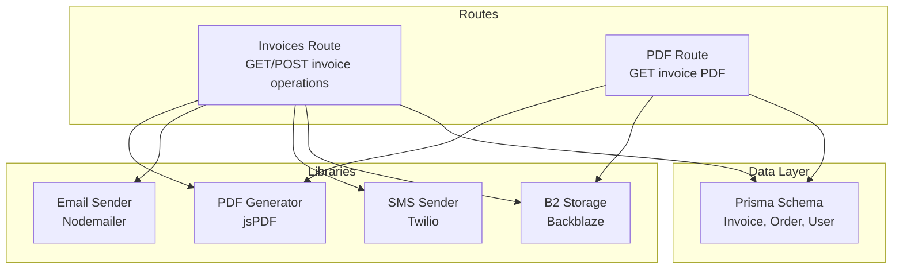
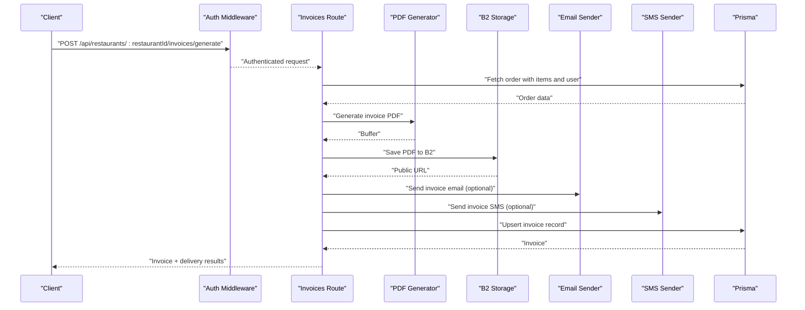
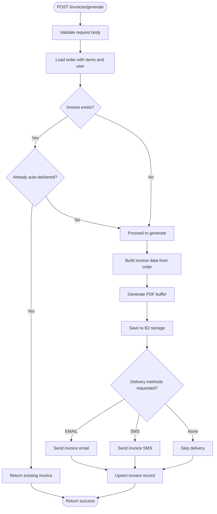
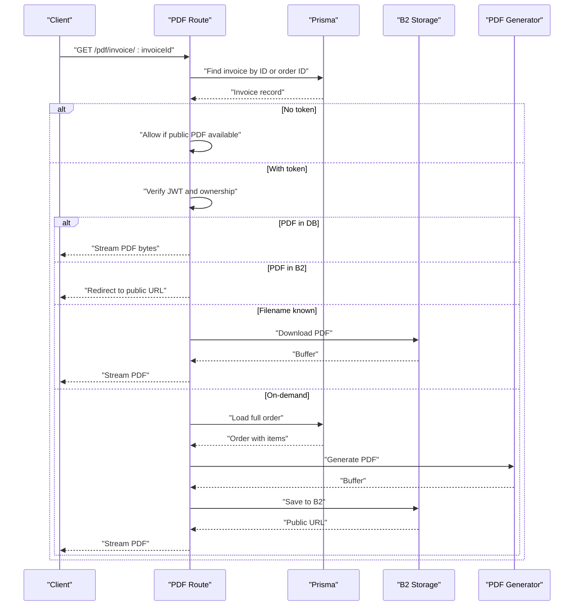
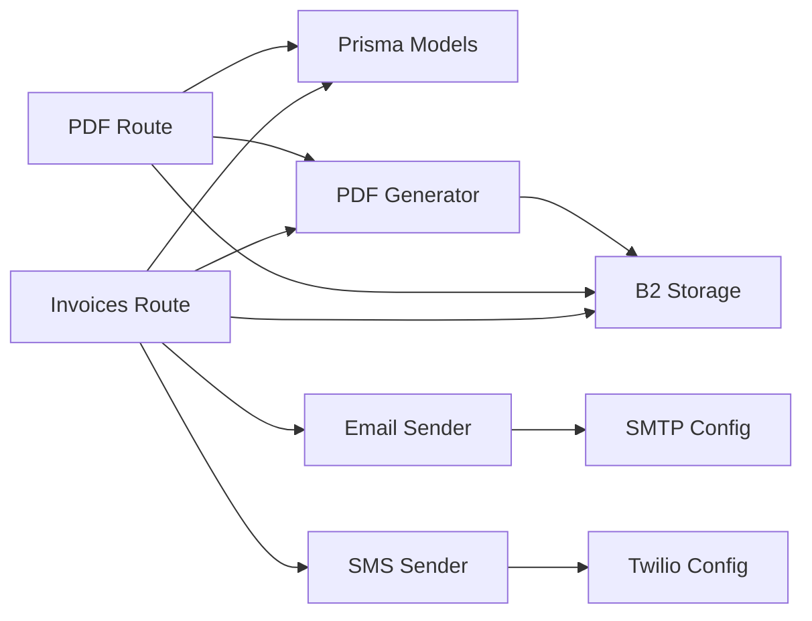

# Invoice & Documentation Endpoints

<cite>
**Referenced Files in This Document**
- [invoices.ts](file://restaurant-backend/src/routes/invoices.ts)
- [pdf.ts](file://restaurant-backend/src/routes/pdf.ts)
- [pdf.ts](file://restaurant-backend/src/lib/pdf.ts)
- [email.ts](file://restaurant-backend/src/lib/email.ts)
- [sms.ts](file://restaurant-backend/src/lib/sms.ts)
- [b2-storage.ts](file://restaurant-backend/src/lib/b2-storage.ts)
- [schema.prisma](file://restaurant-backend/prisma/schema.prisma)
- [api.ts](file://restaurant-backend/src/types/api.ts)
- [DeQ-Restaurants-API.postman_collection.json](file://restaurant-backend/postman/DeQ-Restaurants-API.postman_collection.json)
</cite>

## Table of Contents
1. [Introduction](#introduction)
2. [Project Structure](#project-structure)
3. [Core Components](#core-components)
4. [Architecture Overview](#architecture-overview)
5. [Detailed Component Analysis](#detailed-component-analysis)
6. [Dependency Analysis](#dependency-analysis)
7. [Performance Considerations](#performance-considerations)
8. [Troubleshooting Guide](#troubleshooting-guide)
9. [Conclusion](#conclusion)
10. [Appendices](#appendices)

## Introduction
This document provides comprehensive API documentation for DeQ-Bite’s invoice and document generation endpoints. It covers:
- Retrieving invoice lists and details
- Generating PDF invoices programmatically
- Email and SMS delivery integrations
- Data schemas for invoices and line items
- End-to-end workflows for invoice creation and delivery

Endpoints documented:
- GET /api/restaurants/{restaurantId}/invoices/user/list
- GET /api/restaurants/{restaurantId}/invoices/{orderId}
- POST /api/restaurants/{restaurantId}/invoices/generate
- POST /api/restaurants/{restaurantId}/invoices/{invoiceId}/resend
- POST /api/restaurants/{restaurantId}/invoices/{invoiceOrOrderId}/refresh-pdf
- GET /api/restaurants/{restaurantId}/pdf/invoice/{invoiceId}

## Project Structure
The invoice and PDF generation functionality is implemented across route handlers, utility libraries, and Prisma models. The primary components are:
- Route handlers for invoice operations and PDF retrieval
- PDF generation library using jsPDF
- Cloud storage integration via Backblaze B2
- Email delivery via Nodemailer
- SMS delivery via Twilio

**Diagram sources**
- [invoices.ts:1-599](file://restaurant-backend/src/routes/invoices.ts#L1-L599)
- [pdf.ts:1-189](file://restaurant-backend/src/routes/pdf.ts#L1-L189)
- [pdf.ts:1-293](file://restaurant-backend/src/lib/pdf.ts#L1-L293)
- [email.ts:1-227](file://restaurant-backend/src/lib/email.ts#L1-L227)
- [sms.ts:1-131](file://restaurant-backend/src/lib/sms.ts#L1-L131)
- [b2-storage.ts:1-285](file://restaurant-backend/src/lib/b2-storage.ts#L1-L285)
- [schema.prisma:208-222](file://restaurant-backend/prisma/schema.prisma#L208-L222)

**Section sources**
- [invoices.ts:1-599](file://restaurant-backend/src/routes/invoices.ts#L1-L599)
- [pdf.ts:1-189](file://restaurant-backend/src/routes/pdf.ts#L1-L189)
- [pdf.ts:1-293](file://restaurant-backend/src/lib/pdf.ts#L1-L293)
- [email.ts:1-227](file://restaurant-backend/src/lib/email.ts#L1-L227)
- [sms.ts:1-131](file://restaurant-backend/src/lib/sms.ts#L1-L131)
- [b2-storage.ts:1-285](file://restaurant-backend/src/lib/b2-storage.ts#L1-L285)
- [schema.prisma:208-222](file://restaurant-backend/prisma/schema.prisma#L208-L222)

## Core Components
- Invoice route handler: Implements invoice generation, retrieval, resend, and PDF refresh operations with validation, authorization, and delivery tracking.
- PDF generator: Creates compact 80mm-width receipts using jsPDF and stores them to Backblaze B2.
- Email sender: Generates HTML emails with invoice attachments using Nodemailer.
- SMS sender: Sends invoice notifications via Twilio with configurable messaging.
- B2 storage: Handles upload, download, listing, and cleanup of invoice PDFs.
- Prisma models: Define invoice, order, and user relationships and fields.

**Section sources**
- [invoices.ts:1-599](file://restaurant-backend/src/routes/invoices.ts#L1-L599)
- [pdf.ts:1-293](file://restaurant-backend/src/lib/pdf.ts#L1-L293)
- [email.ts:1-227](file://restaurant-backend/src/lib/email.ts#L1-L227)
- [sms.ts:1-131](file://restaurant-backend/src/lib/sms.ts#L1-L131)
- [b2-storage.ts:1-285](file://restaurant-backend/src/lib/b2-storage.ts#L1-L285)
- [schema.prisma:208-222](file://restaurant-backend/prisma/schema.prisma#L208-L222)

## Architecture Overview
The invoice workflow integrates route handlers, PDF generation, cloud storage, and delivery channels. Authorization is enforced via JWT and restaurant context middleware.

**Diagram sources**
- [invoices.ts:21-241](file://restaurant-backend/src/routes/invoices.ts#L21-L241)
- [pdf.ts:36-186](file://restaurant-backend/src/lib/pdf.ts#L36-L186)
- [b2-storage.ts:76-122](file://restaurant-backend/src/lib/b2-storage.ts#L76-L122)
- [email.ts:200-227](file://restaurant-backend/src/lib/email.ts#L200-L227)
- [sms.ts:89-104](file://restaurant-backend/src/lib/sms.ts#L89-L104)
- [schema.prisma:208-222](file://restaurant-backend/prisma/schema.prisma#L208-L222)

## Detailed Component Analysis

### Invoice Endpoints

#### GET /api/restaurants/{restaurantId}/invoices/user/list
- Purpose: Retrieve all invoices for the authenticated restaurant user.
- Authentication: Requires JWT and restaurant context.
- Response: Array of invoices with associated order details.
- Notes: Results ordered by issuance date descending.

**Section sources**
- [invoices.ts:289-325](file://restaurant-backend/src/routes/invoices.ts#L289-L325)

#### GET /api/restaurants/{restaurantId}/invoices/{orderId}
- Purpose: Retrieve a specific invoice by order ID.
- Authentication: Requires JWT and restaurant context.
- Response: Single invoice with embedded order details.
- Notes: Enforces ownership via user and restaurant filters.

**Section sources**
- [invoices.ts:243-287](file://restaurant-backend/src/routes/invoices.ts#L243-L287)

#### POST /api/restaurants/{restaurantId}/invoices/generate
- Purpose: Generate and optionally deliver an invoice for a completed order.
- Authentication: Requires JWT and restaurant context.
- Request body:
  - orderId: string (required)
  - methods: array of ['EMAIL','SMS'] (optional)
- Behavior:
  - Validates order ownership and completion.
  - Generates invoice number if missing.
  - Builds invoice data from order items and totals.
  - Generates PDF and saves to B2.
  - Optionally sends email and/or SMS.
  - Upserts invoice record with delivery tracking.
- Response includes:
  - invoice: invoice summary
  - deliveryResults: emailSent, smsSent, pdfGenerated, pdfPath
  - warnings: configuration or availability warnings

**Diagram sources**
- [invoices.ts:21-241](file://restaurant-backend/src/routes/invoices.ts#L21-L241)
- [pdf.ts:36-186](file://restaurant-backend/src/lib/pdf.ts#L36-L186)
- [b2-storage.ts:76-122](file://restaurant-backend/src/lib/b2-storage.ts#L76-L122)
- [email.ts:200-227](file://restaurant-backend/src/lib/email.ts#L200-L227)
- [sms.ts:89-104](file://restaurant-backend/src/lib/sms.ts#L89-L104)

**Section sources**
- [invoices.ts:21-241](file://restaurant-backend/src/routes/invoices.ts#L21-L241)

#### POST /api/restaurants/{restaurantId}/invoices/{invoiceId}/resend
- Purpose: Resend invoice via email/SMS using stored invoice data.
- Authentication: Requires JWT and restaurant context.
- Request body:
  - methods: array of ['EMAIL','SMS'] (optional)
- Behavior:
  - Loads invoice and order details.
  - Regenerates PDF if needed.
  - Sends email/SMS based on requested methods.
  - Updates delivery tracking.

**Section sources**
- [invoices.ts:327-454](file://restaurant-backend/src/routes/invoices.ts#L327-L454)

#### POST /api/restaurants/{restaurantId}/invoices/{invoiceOrOrderId}/refresh-pdf
- Purpose: Recreate and store PDF for an existing invoice or a completed order.
- Authentication: Requires JWT and restaurant context.
- Behavior:
  - Resolves invoice by ID or order ID.
  - If not found, creates invoice record for a completed order.
  - Rebuilds invoice data from order.
  - Generates and saves PDF to B2.
  - Updates invoice record with new PDF metadata.

**Section sources**
- [invoices.ts:455-566](file://restaurant-backend/src/routes/invoices.ts#L455-L566)

### PDF Retrieval Endpoint

#### GET /api/restaurants/{restaurantId}/pdf/invoice/{invoiceId}
- Purpose: Serve invoice PDF either from DB, B2, or on-demand generation.
- Authentication:
  - Without token: allows download if PDF is publicly accessible (DB bytes or B2 URL).
  - With token: verifies ownership and serves PDF; falls back to regeneration if needed.
- Behavior:
  - Attempts to resolve invoice by ID or order ID.
  - Serves PDF from DB if available.
  - Redirects to B2 public URL if configured.
  - Downloads from B2 if filename known.
  - Generates PDF on demand for authenticated owners.

**Diagram sources**
- [pdf.ts:11-186](file://restaurant-backend/src/routes/pdf.ts#L11-L186)
- [pdf.ts:36-186](file://restaurant-backend/src/lib/pdf.ts#L36-L186)
- [b2-storage.ts:146-180](file://restaurant-backend/src/lib/b2-storage.ts#L146-L180)

**Section sources**
- [pdf.ts:11-186](file://restaurant-backend/src/routes/pdf.ts#L11-L186)

### Data Schemas

#### Invoice Object
- Fields:
  - id: string
  - orderId: string
  - invoiceNumber: string
  - sentVia: array of ['EMAIL','SMS']
  - emailSent: boolean
  - smsSent: boolean
  - pdfPath: string?
  - issuedAt: datetime
  - order: embedded order details

**Section sources**
- [schema.prisma:208-222](file://restaurant-backend/prisma/schema.prisma#L208-L222)
- [api.ts:89-99](file://restaurant-backend/src/types/api.ts#L89-L99)

#### Order Object (embedded in invoice)
- Fields:
  - id: string
  - totalPaise: integer
  - paymentStatus: enum
  - status: enum
  - createdAt: datetime
  - table: embedded table number

**Section sources**
- [schema.prisma:162-193](file://restaurant-backend/prisma/schema.prisma#L162-L193)
- [api.ts:52-66](file://restaurant-backend/src/types/api.ts#L52-L66)

#### Line Items (from order items)
- Fields:
  - name: string
  - quantity: number
  - price: number
  - total: number

**Section sources**
- [invoices.ts:114-119](file://restaurant-backend/src/routes/invoices.ts#L114-L119)
- [pdf.ts:14-19](file://restaurant-backend/src/lib/pdf.ts#L14-L19)

#### Tax and Totals
- Subtotal, tax, and total are derived from order totals in paise and converted to rupees.

**Section sources**
- [invoices.ts:120-122](file://restaurant-backend/src/routes/invoices.ts#L120-L122)

### Delivery Integrations

#### Email Delivery
- Endpoint: POST /api/restaurants/{restaurantId}/invoices/{invoiceId}/resend (methods includes 'EMAIL')
- Implementation:
  - Generates HTML email with invoice details.
  - Attaches PDF buffer.
  - Uses Nodemailer transport configured via SMTP environment variables.

**Section sources**
- [email.ts:28-61](file://restaurant-backend/src/lib/email.ts#L28-L61)
- [email.ts:63-195](file://restaurant-backend/src/lib/email.ts#L63-L195)
- [email.ts:197-227](file://restaurant-backend/src/lib/email.ts#L197-L227)

#### SMS Delivery
- Endpoint: POST /api/restaurants/{restaurantId}/invoices/{invoiceId}/resend (methods includes 'SMS')
- Implementation:
  - Generates SMS message with invoice details.
  - Sends via Twilio using configured account credentials and sender number.

**Section sources**
- [sms.ts:28-66](file://restaurant-backend/src/lib/sms.ts#L28-L66)
- [sms.ts:68-84](file://restaurant-backend/src/lib/sms.ts#L68-L84)
- [sms.ts:86-104](file://restaurant-backend/src/lib/sms.ts#L86-L104)

### Programmatic PDF Generation
- Endpoint: GET /api/restaurants/{restaurantId}/pdf/invoice/{invoiceId}
- Behavior:
  - Supports token-based access for authenticated owners.
  - On-demand generation when PDF is not yet stored.
  - Stores generated PDF to B2 for future retrieval.

**Section sources**
- [pdf.ts:11-186](file://restaurant-backend/src/routes/pdf.ts#L11-L186)
- [pdf.ts:36-186](file://restaurant-backend/src/lib/pdf.ts#L36-L186)
- [b2-storage.ts:76-122](file://restaurant-backend/src/lib/b2-storage.ts#L76-L122)

## Dependency Analysis
- Route handlers depend on Prisma for data access and on libraries for PDF, email, SMS, and storage.
- PDF generation depends on jsPDF and B2 storage utilities.
- Email and SMS services depend on environment configuration.
- PDF retrieval route orchestrates multiple fallbacks (DB, B2, on-demand).

**Diagram sources**
- [invoices.ts:1-599](file://restaurant-backend/src/routes/invoices.ts#L1-L599)
- [pdf.ts:1-189](file://restaurant-backend/src/routes/pdf.ts#L1-L189)
- [pdf.ts:1-293](file://restaurant-backend/src/lib/pdf.ts#L1-L293)
- [email.ts:1-227](file://restaurant-backend/src/lib/email.ts#L1-L227)
- [sms.ts:1-131](file://restaurant-backend/src/lib/sms.ts#L1-L131)
- [b2-storage.ts:1-285](file://restaurant-backend/src/lib/b2-storage.ts#L1-L285)
- [schema.prisma:208-222](file://restaurant-backend/prisma/schema.prisma#L208-L222)

**Section sources**
- [invoices.ts:1-599](file://restaurant-backend/src/routes/invoices.ts#L1-L599)
- [pdf.ts:1-189](file://restaurant-backend/src/routes/pdf.ts#L1-L189)
- [pdf.ts:1-293](file://restaurant-backend/src/lib/pdf.ts#L1-L293)
- [email.ts:1-227](file://restaurant-backend/src/lib/email.ts#L1-L227)
- [sms.ts:1-131](file://restaurant-backend/src/lib/sms.ts#L1-L131)
- [b2-storage.ts:1-285](file://restaurant-backend/src/lib/b2-storage.ts#L1-L285)
- [schema.prisma:208-222](file://restaurant-backend/prisma/schema.prisma#L208-L222)

## Performance Considerations
- PDF generation occurs on demand for missing invoices; cache or pre-generate for high-volume scenarios.
- B2 uploads/downloads incur network latency; consider compression or CDN for public URLs.
- Email/SMS delivery adds external latency; implement retries and idempotent updates.
- Large order item lists increase PDF rendering time; paginate or limit item counts if needed.

[No sources needed since this section provides general guidance]

## Troubleshooting Guide
Common issues and resolutions:
- Missing or invalid JWT token:
  - Ensure Authorization header is present and valid.
  - Verify JWT_SECRET environment variable is configured.
- Access denied for PDF:
  - Token must match the invoice owner; otherwise, access is denied.
- Email delivery failures:
  - Confirm SMTP_HOST, SMTP_PORT, SMTP_USER, SMTP_PASS are set.
  - Check email availability in order user profile.
- SMS delivery failures:
  - Confirm TWILIO_ACCOUNT_SID, TWILIO_AUTH_TOKEN, TWILIO_PHONE_NUMBER are set.
  - Check phone availability in order user profile.
- B2 storage errors:
  - Verify B2_APPLICATION_KEY_ID, B2_APPLICATION_KEY, B2_BUCKET_ID or B2_BUCKET_NAME.
  - Ensure public URL generation and custom domain configuration if used.

**Section sources**
- [pdf.ts:53-91](file://restaurant-backend/src/routes/pdf.ts#L53-L91)
- [email.ts:5-15](file://restaurant-backend/src/lib/email.ts#L5-L15)
- [sms.ts:7-21](file://restaurant-backend/src/lib/sms.ts#L7-L21)
- [b2-storage.ts:11-26](file://restaurant-backend/src/lib/b2-storage.ts#L11-L26)

## Conclusion
DeQ-Bite’s invoice and document generation system provides robust, extensible APIs for generating, storing, and delivering invoices. It integrates seamlessly with cloud storage, email, and SMS services while maintaining strong authorization and error handling. The modular design enables easy customization of templates and delivery channels.

[No sources needed since this section summarizes without analyzing specific files]

## Appendices

### API Reference Summary

- GET /api/restaurants/{restaurantId}/invoices/user/list
  - Description: List invoices for the authenticated restaurant user.
  - Auth: JWT + restaurant context.
  - Response: Array of invoices.

- GET /api/restaurants/{restaurantId}/invoices/{orderId}
  - Description: Retrieve invoice by order ID.
  - Auth: JWT + restaurant context.
  - Response: Single invoice with order details.

- POST /api/restaurants/{restaurantId}/invoices/generate
  - Description: Generate invoice for a completed order and optionally deliver via email/SMS.
  - Auth: JWT + restaurant context.
  - Body: { orderId, methods: ['EMAIL'|'SMS'][] }.
  - Response: Invoice summary, delivery results, warnings.

- POST /api/restaurants/{restaurantId}/invoices/{invoiceId}/resend
  - Description: Resend invoice via email/SMS.
  - Auth: JWT + restaurant context.
  - Body: { methods: ['EMAIL'|'SMS'][] }.
  - Response: Delivery results and warnings.

- POST /api/restaurants/{restaurantId}/invoices/{invoiceOrOrderId}/refresh-pdf
  - Description: Recreate and store PDF for an invoice or completed order.
  - Auth: JWT + restaurant context.
  - Response: Updated invoice with PDF metadata.

- GET /api/restaurants/{restaurantId}/pdf/invoice/{invoiceId}
  - Description: Download invoice PDF; supports token-based access and on-demand generation.
  - Auth: Optional JWT; public access if PDF is available.
  - Response: PDF stream or redirect.

**Section sources**
- [DeQ-Restaurants-API.postman_collection.json:930-1079](file://restaurant-backend/postman/DeQ-Restaurants-API.postman_collection.json#L930-L1079)

### Example Workflows

- Invoice Creation Workflow
  - Create order and confirm payment.
  - Call POST /api/restaurants/{restaurantId}/invoices/generate with orderId and desired methods.
  - Receive invoice summary and delivery results; PDF stored in B2.

- PDF Customization
  - Modify invoice data structure in the PDF generator to include additional fields (e.g., GST number, cashier name).
  - Ensure B2 storage is configured for persistent PDFs.

- Automated Delivery
  - Configure SMTP for email and Twilio for SMS.
  - Include methods in the generate/resend requests to enable automatic delivery.

**Section sources**
- [invoices.ts:21-241](file://restaurant-backend/src/routes/invoices.ts#L21-L241)
- [pdf.ts:5-28](file://restaurant-backend/src/lib/pdf.ts#L5-L28)
- [email.ts:5-15](file://restaurant-backend/src/lib/email.ts#L5-L15)
- [sms.ts:7-21](file://restaurant-backend/src/lib/sms.ts#L7-L21)