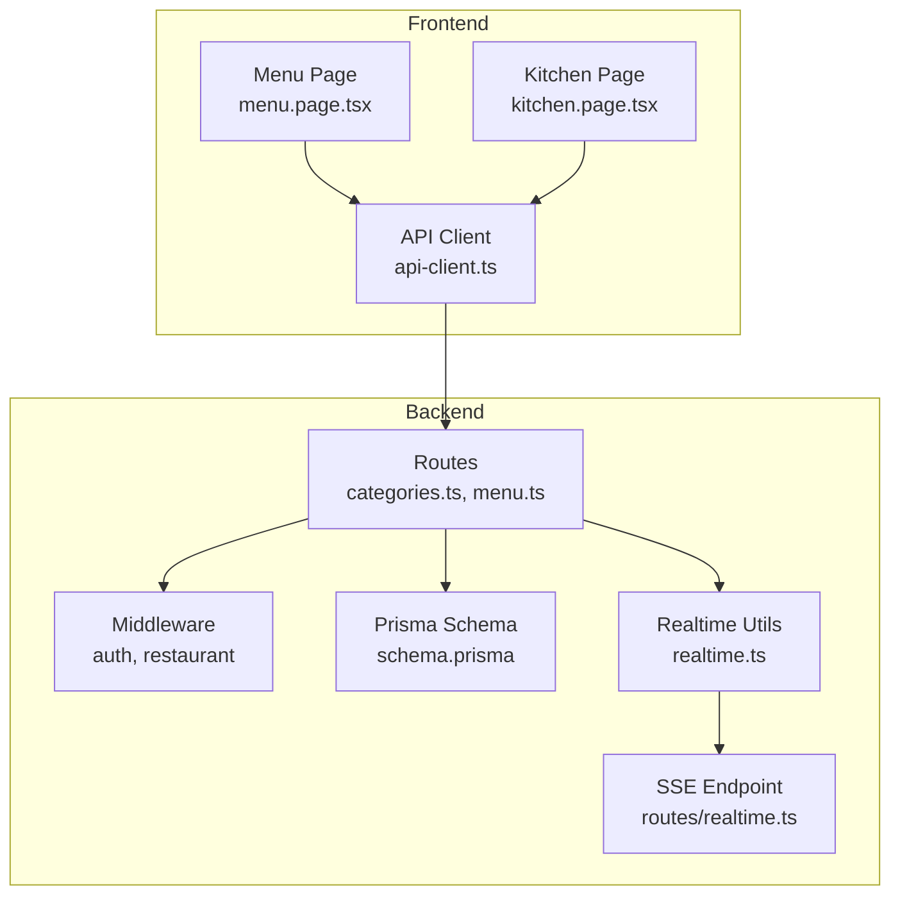
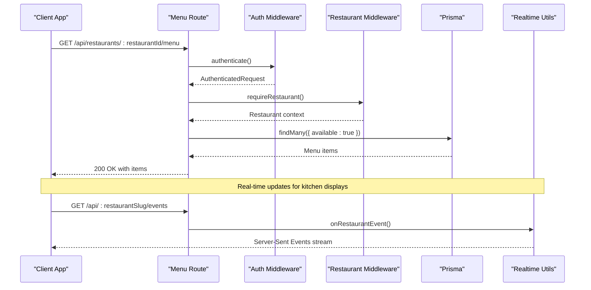
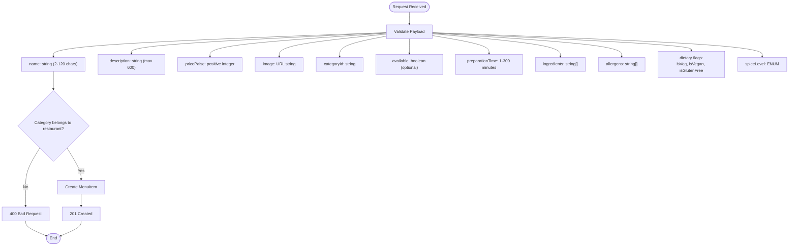
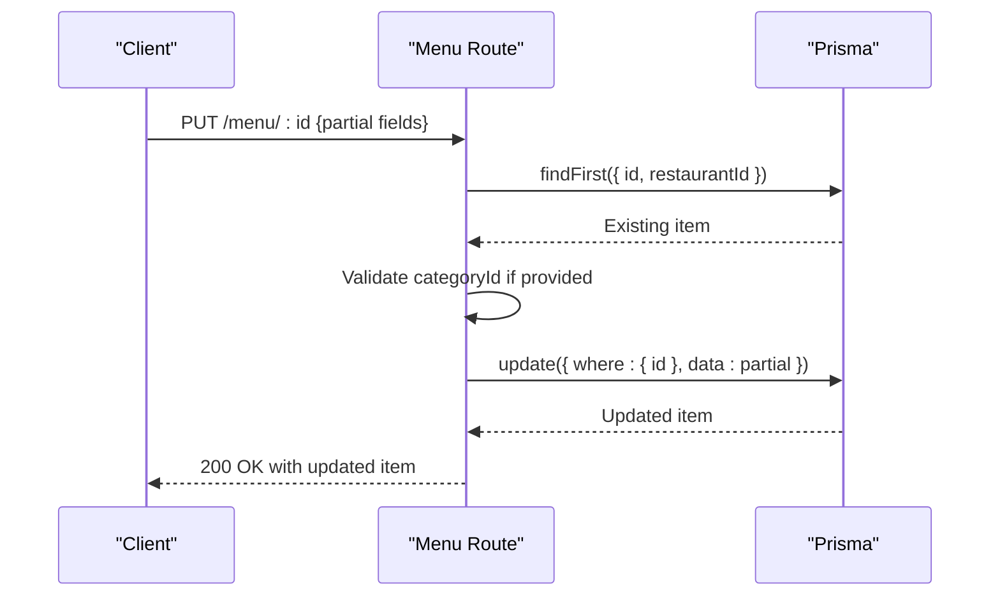
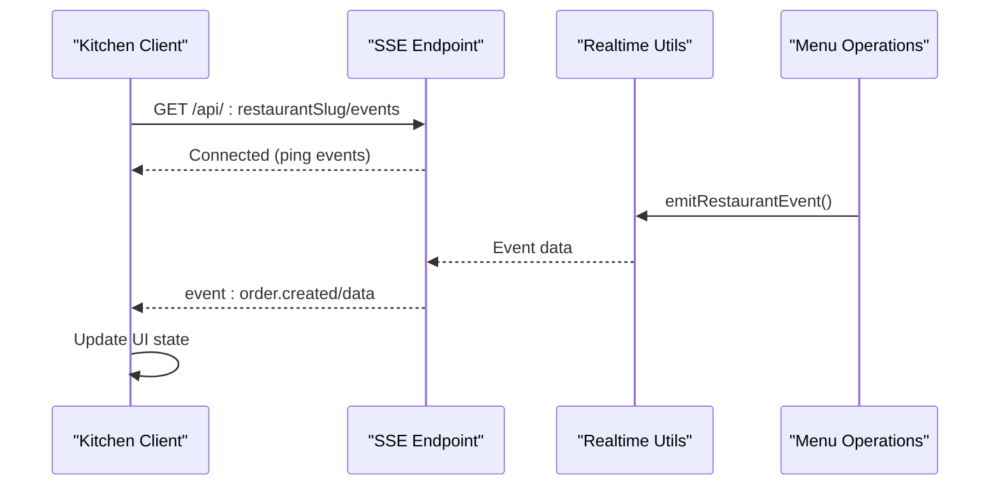
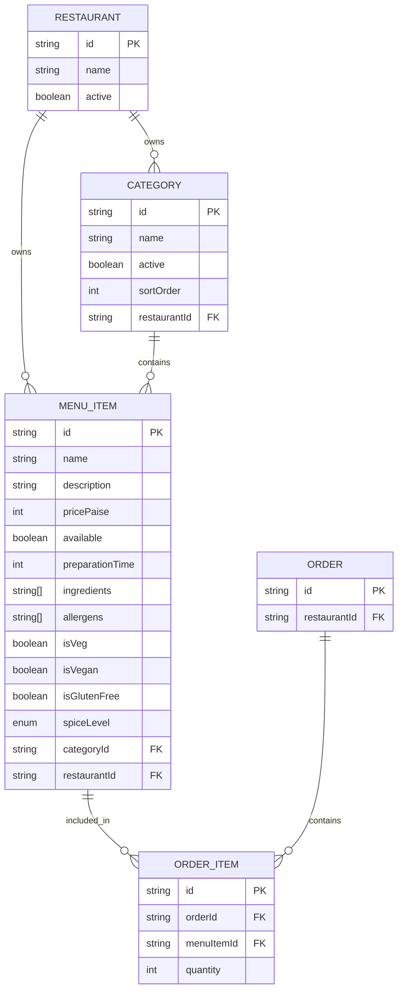

# Menu Management Endpoints

<cite>
**Referenced Files in This Document**
- [categories.ts](file://restaurant-backend/src/routes/categories.ts)
- [menu.ts](file://restaurant-backend/src/routes/menu.ts)
- [api.ts](file://restaurant-backend/src/types/api.ts)
- [schema.prisma](file://restaurant-backend/prisma/schema.prisma)
- [realtime.ts](file://restaurant-backend/src/utils/realtime.ts)
- [realtime.ts](file://restaurant-backend/src/routes/realtime.ts)
- [api-client.ts](file://restaurant-frontend/src/lib/api-client.ts)
- [menu.page.tsx](file://restaurant-frontend/src/app/menu/page.tsx)
- [kitchen.page.tsx](file://restaurant-frontend/src/app/kitchen/page.tsx)
- [postman_collection.json](file://restaurant-backend/postman/DeQ-Restaurants-API.postman_collection.json)
</cite>

## Table of Contents
1. [Introduction](#introduction)
2. [Project Structure](#project-structure)
3. [Core Components](#core-components)
4. [Architecture Overview](#architecture-overview)
5. [Detailed Component Analysis](#detailed-component-analysis)
6. [Dependency Analysis](#dependency-analysis)
7. [Performance Considerations](#performance-considerations)
8. [Troubleshooting Guide](#troubleshooting-guide)
9. [Conclusion](#conclusion)

## Introduction
This document provides comprehensive API documentation for DeQ-Bite's menu management system. It covers endpoints for managing menu categories and menu items, including creation, listing, updates, and deactivation. The documentation includes detailed request/response schemas, filtering capabilities, real-time updates for kitchen displays, and practical examples for menu organization and search functionality.

## Project Structure
The menu management system spans both backend and frontend components:
- Backend routes define REST endpoints for categories and menu items
- Prisma schema defines database models and relationships
- Frontend pages consume these APIs for customer and kitchen experiences
- Real-time streaming enables live updates for kitchen displays

**Diagram sources**
- [categories.ts:1-87](file://restaurant-backend/src/routes/categories.ts#L1-L87)
- [menu.ts:1-356](file://restaurant-backend/src/routes/menu.ts#L1-L356)
- [schema.prisma:90-131](file://restaurant-backend/prisma/schema.prisma#L90-L131)
- [realtime.ts:1-23](file://restaurant-backend/src/utils/realtime.ts#L1-L23)
- [realtime.ts:1-40](file://restaurant-backend/src/routes/realtime.ts#L1-L40)
- [api-client.ts:508-570](file://restaurant-frontend/src/lib/api-client.ts#L508-L570)
- [menu.page.tsx:46-86](file://restaurant-frontend/src/app/menu/page.tsx#L46-L86)
- [kitchen.page.tsx:36-64](file://restaurant-frontend/src/app/kitchen/page.tsx#L36-L64)

**Section sources**
- [categories.ts:1-87](file://restaurant-backend/src/routes/categories.ts#L1-L87)
- [menu.ts:1-356](file://restaurant-backend/src/routes/menu.ts#L1-L356)
- [schema.prisma:90-131](file://restaurant-backend/prisma/schema.prisma#L90-L131)

## Core Components
This section documents the primary API endpoints for menu management, including their HTTP methods, URLs, authentication requirements, and request/response schemas.

### Menu Categories Endpoints
These endpoints manage menu categories for organizing menu items.

- **GET /api/restaurants/:restaurantId/categories**
  - Purpose: Retrieve all active categories for a restaurant
  - Authentication: Restaurant context required
  - Response: Array of category objects ordered by sort order
  - Example: [Postman GET Categories:492-518](file://restaurant-backend/postman/DeQ-Restaurants-API.postman_collection.json#L492-L518)

- **GET /api/restaurants/:restaurantId/categories/:id**
  - Purpose: Retrieve a specific category by ID
  - Authentication: Restaurant context required
  - Response: Single category object if active
  - Example: [Postman GET Category By ID:513-518](file://restaurant-backend/postman/DeQ-Restaurants-API.postman_collection.json#L513-L518)

### Menu Items Endpoints
These endpoints manage individual menu items, including creation, updates, and availability toggling.

- **GET /api/restaurants/:restaurantId/menu**
  - Purpose: Browse available menu items with optional category filter
  - Authentication: Restaurant context required
  - Query Parameters:
    - categoryId: Filter items by category ID
  - Response: Array of menu items with category inclusion
  - Example: [Postman GET Menu:370-375](file://restaurant-backend/postman/DeQ-Restaurants-API.postman_collection.json#L370-L375)

- **GET /api/restaurants/:restaurantId/menu/admin/all**
  - Purpose: Admin/staff view of all menu items (including unavailable)
  - Authentication: Requires AUTHENTICATED, RESTAURANT, and ADMIN/OWNER/STAFF roles
  - Response: Array of menu items ordered by creation date
  - Example: [Postman GET Admin Menu:377-387](file://restaurant-backend/postman/DeQ-Restaurants-API.postman_collection.json#L377-L387)

- **GET /api/restaurants/:restaurantId/menu/:id**
  - Purpose: Retrieve a specific menu item by ID
  - Authentication: Restaurant context required
  - Response: Single menu item with category inclusion if available
  - Example: [Postman GET Menu Item:390-395](file://restaurant-backend/postman/DeQ-Restaurants-API.postman_collection.json#L390-L395)

- **POST /api/restaurants/:restaurantId/menu**
  - Purpose: Create a new menu item
  - Authentication: Requires AUTHENTICATED, RESTAURANT, and ADMIN/OWNER roles
  - Request Body: Menu item creation schema (see below)
  - Response: Created menu item with category inclusion
  - Example: [Postman Create Menu Item:397-415](file://restaurant-backend/postman/DeQ-Restaurants-API.postman_collection.json#L397-L415)

- **PUT /api/restaurants/:restaurantId/menu/:id**
  - Purpose: Update an existing menu item
  - Authentication: Requires AUTHENTICATED, RESTAURANT, and ADMIN/OWNER roles
  - Request Body: Partial menu item update schema (see below)
  - Response: Updated menu item with category inclusion
  - Example: [Postman Update Menu Item:432-451](file://restaurant-backend/postman/DeQ-Restaurants-API.postman_collection.json#L432-L451)

- **PATCH /api/restaurants/:restaurantId/menu/:id/availability**
  - Purpose: Toggle menu item availability
  - Authentication: Requires AUTHENTICATED, RESTAURANT, and ADMIN/OWNER roles
  - Request Body: { available: boolean }
  - Response: Updated menu item with category inclusion
  - Example: [Postman Toggle Menu Availability:453-472](file://restaurant-backend/postman/DeQ-Restaurants-API.postman_collection.json#L453-L472)

- **DELETE /api/restaurants/:restaurantId/menu/:id**
  - Purpose: Remove a menu item (soft deletion pattern implied)
  - Authentication: Requires AUTHENTICATED, RESTAURANT, and ADMIN/OWNER roles
  - Response: Success message
  - Example: [Postman Delete Menu Item:474-484](file://restaurant-backend/postman/DeQ-Restaurants-API.postman_collection.json#L474-L484)

**Section sources**
- [categories.ts:8-84](file://restaurant-backend/src/routes/categories.ts#L8-L84)
- [menu.ts:28-353](file://restaurant-backend/src/routes/menu.ts#L28-L353)
- [postman_collection.json:364-520](file://restaurant-backend/postman/DeQ-Restaurants-API.postman_collection.json#L364-L520)

## Architecture Overview
The menu management system follows a tenant-aware architecture where requests are routed through restaurant context middleware. The backend enforces role-based access control and uses Prisma for data persistence. Frontend applications consume these APIs for customer browsing and kitchen staff coordination.

**Diagram sources**
- [menu.ts:28-60](file://restaurant-backend/src/routes/menu.ts#L28-L60)
- [restaurant.ts:202-211](file://restaurant-backend/src/middleware/restaurant.ts#L202-L211)
- [realtime.ts:9-37](file://restaurant-backend/src/routes/realtime.ts#L9-L37)

## Detailed Component Analysis

### Menu Item Creation Schema
The POST /api/restaurants/:restaurantId/menu endpoint validates incoming data against a strict schema:

**Diagram sources**
- [menu.ts:10-24](file://restaurant-backend/src/routes/menu.ts#L10-L24)
- [menu.ts:138-192](file://restaurant-backend/src/routes/menu.ts#L138-L192)

### Menu Item Update Flow
The PUT /api/restaurants/:restaurantId/menu/:id endpoint supports partial updates:

**Diagram sources**
- [menu.ts:194-268](file://restaurant-backend/src/routes/menu.ts#L194-L268)

### Real-Time Kitchen Updates
The system provides real-time updates for kitchen displays via Server-Sent Events:

**Diagram sources**
- [realtime.ts:9-37](file://restaurant-backend/src/routes/realtime.ts#L9-L37)
- [realtime.ts:12-22](file://restaurant-backend/src/utils/realtime.ts#L12-L22)
- [kitchen.page.tsx:36-64](file://restaurant-frontend/src/app/kitchen/page.tsx#L36-L64)

**Section sources**
- [menu.ts:10-24](file://restaurant-backend/src/routes/menu.ts#L10-L24)
- [menu.ts:138-192](file://restaurant-backend/src/routes/menu.ts#L138-L192)
- [menu.ts:194-268](file://restaurant-backend/src/routes/menu.ts#L194-L268)
- [realtime.ts:9-37](file://restaurant-backend/src/routes/realtime.ts#L9-L37)
- [realtime.ts:12-22](file://restaurant-backend/src/utils/realtime.ts#L12-L22)
- [kitchen.page.tsx:36-64](file://restaurant-frontend/src/app/kitchen/page.tsx#L36-L64)

## Dependency Analysis
The menu management system relies on several key dependencies and relationships:

**Diagram sources**
- [schema.prisma:27-73](file://restaurant-backend/prisma/schema.prisma#L27-L73)
- [schema.prisma:90-131](file://restaurant-backend/prisma/schema.prisma#L90-L131)
- [schema.prisma:162-206](file://restaurant-backend/prisma/schema.prisma#L162-L206)

**Section sources**
- [schema.prisma:90-131](file://restaurant-backend/prisma/schema.prisma#L90-L131)

## Performance Considerations
- Database queries use selective field retrieval to minimize payload sizes
- Category listings are sorted by sortOrder for consistent ordering
- Menu item queries filter by availability by default for customer-facing endpoints
- Real-time updates use Server-Sent Events with periodic ping messages to maintain connections
- Frontend implements concurrent loading for menu and categories to reduce perceived latency

## Troubleshooting Guide
Common issues and their resolutions:

### Authentication and Authorization
- **401 Unauthorized**: Ensure proper authentication token is included in Authorization header
- **403 Forbidden**: Verify user has required restaurant membership and role (OWNER, ADMIN, STAFF)
- **400 Bad Request**: Restaurant context required; ensure x-restaurant-slug or subdomain headers are provided

### Data Validation Errors
- **400 Bad Request on creation**: Check that all required fields meet validation criteria
- **Invalid category**: Ensure categoryId belongs to the requesting restaurant and is active
- **Missing fields**: Some fields are optional; review the schema for defaults

### Real-Time Updates
- **Connection drops**: SSE maintains automatic reconnection; check network connectivity
- **No events received**: Verify restaurant context and authentication token are valid
- **Event filtering**: Kitchen clients receive order-related events; ensure proper event listeners are attached

**Section sources**
- [menu.ts:138-192](file://restaurant-backend/src/routes/menu.ts#L138-L192)
- [menu.ts:194-268](file://restaurant-backend/src/routes/menu.ts#L194-L268)
- [realtime.ts:9-37](file://restaurant-backend/src/routes/realtime.ts#L9-L37)

## Conclusion
DeQ-Bite's menu management system provides a robust, tenant-aware API for managing restaurant menus with comprehensive validation, role-based access control, and real-time updates for kitchen operations. The system supports flexible filtering, dietary information, and structured pricing while maintaining performance through optimized database queries and efficient frontend integration.