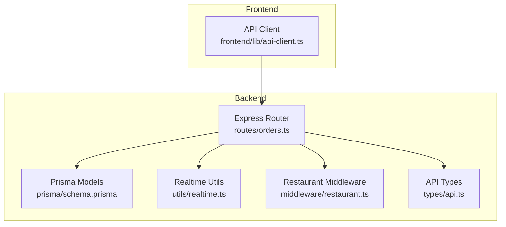
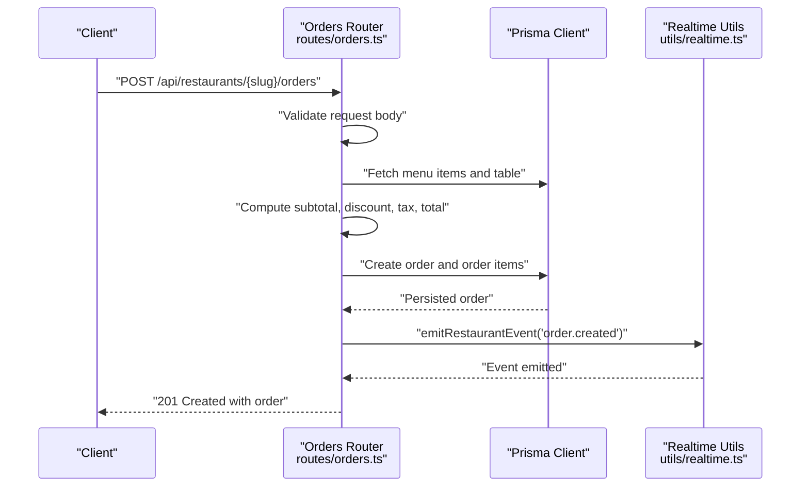
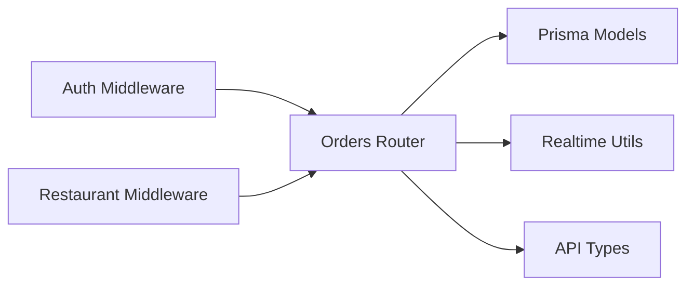

# Order Management Endpoints

<cite>
**Referenced Files in This Document**
- [orders.ts](file://restaurant-backend/src/routes/orders.ts)
- [api.ts](file://restaurant-backend/src/types/api.ts)
- [schema.prisma](file://restaurant-backend/prisma/schema.prisma)
- [realtime.ts](file://restaurant-backend/src/utils/realtime.ts)
- [restaurant.ts](file://restaurant-backend/src/middleware/restaurant.ts)
- [api-client.ts](file://restaurant-frontend/src/lib/api-client.ts)
- [DeQ-Restaurants-API.postman_collection.json](file://restaurant-backend/postman/DeQ-Restaurants-API.postman_collection.json)
</cite>

## Table of Contents
1. [Introduction](#introduction)
2. [Project Structure](#project-structure)
3. [Core Components](#core-components)
4. [Architecture Overview](#architecture-overview)
5. [Detailed Component Analysis](#detailed-component-analysis)
6. [Dependency Analysis](#dependency-analysis)
7. [Performance Considerations](#performance-considerations)
8. [Troubleshooting Guide](#troubleshooting-guide)
9. [Conclusion](#conclusion)
10. [Appendices](#appendices)

## Introduction
This document provides comprehensive API documentation for DeQ-Bite's order management endpoints. It covers the complete lifecycle of orders: creation, retrieval, updates, and cancellation. It also documents pricing calculations, tax breakdowns, coupon application, and real-time order tracking integration. The focus is on practical usage for developers building integrations or consuming the API.

## Project Structure
The order management functionality is implemented in the backend Express application under the routes module. The API types define the data contracts, while Prisma models define the database schema. Middleware enforces restaurant context and authorization. The frontend API client demonstrates how clients consume these endpoints.

**Diagram sources**
- [orders.ts:1-694](file://restaurant-backend/src/routes/orders.ts#L1-L694)
- [schema.prisma:162-193](file://restaurant-backend/prisma/schema.prisma#L162-L193)
- [realtime.ts:1-23](file://restaurant-backend/src/utils/realtime.ts#L1-L23)
- [restaurant.ts:76-246](file://restaurant-backend/src/middleware/restaurant.ts#L76-L246)
- [api.ts:52-66](file://restaurant-backend/src/types/api.ts#L52-L66)
- [api-client.ts:594-647](file://restaurant-frontend/src/lib/api-client.ts#L594-L647)

**Section sources**
- [orders.ts:1-694](file://restaurant-backend/src/routes/orders.ts#L1-L694)
- [schema.prisma:162-193](file://restaurant-backend/prisma/schema.prisma#L162-L193)
- [realtime.ts:1-23](file://restaurant-backend/src/utils/realtime.ts#L1-L23)
- [restaurant.ts:76-246](file://restaurant-backend/src/middleware/restaurant.ts#L76-L246)
- [api.ts:52-66](file://restaurant-backend/src/types/api.ts#L52-L66)
- [api-client.ts:594-647](file://restaurant-frontend/src/lib/api-client.ts#L594-L647)

## Core Components
- Order model and enums: The backend defines order status and payment status enums, along with pricing fields in paisa units.
- Pricing calculation: Subtotal, discount, tax (fixed rate), and totals are computed server-side.
- Coupon application: Coupons are validated against restaurant rules and applied transactionally.
- Real-time events: Order creation and updates emit restaurant-scoped events for live tracking.

Key data structures:
- Order: includes status, paymentStatus, pricing fields, and relations to items and table.
- OrderItem: includes quantity, pricePaise, and notes.

**Section sources**
- [api.ts:52-77](file://restaurant-backend/src/types/api.ts#L52-L77)
- [schema.prisma:162-193](file://restaurant-backend/prisma/schema.prisma#L162-L193)
- [orders.ts:16-36](file://restaurant-backend/src/routes/orders.ts#L16-L36)

## Architecture Overview
The order lifecycle spans request validation, business logic, database persistence, and real-time notifications. Authorization ensures only authorized restaurant users can manage orders, while middleware attaches restaurant context for tenant scoping.

**Diagram sources**
- [orders.ts:82-267](file://restaurant-backend/src/routes/orders.ts#L82-L267)
- [realtime.ts:12-17](file://restaurant-backend/src/utils/realtime.ts#L12-L17)

**Section sources**
- [orders.ts:82-267](file://restaurant-backend/src/routes/orders.ts#L82-L267)
- [realtime.ts:12-17](file://restaurant-backend/src/utils/realtime.ts#L12-L17)

## Detailed Component Analysis

### POST /api/restaurants/{slug}/orders
Purpose: Create a new order with menu items, quantities, optional coupon, special instructions, and table assignment.

Request body schema:
- tableId: string (required)
- items: array of objects (required, non-empty)
  - menuItemId: string (required)
  - quantity: number (positive integer)
  - notes: string (optional)
- specialInstructions: string (optional)
- couponCode: string (optional)
- paymentProvider: enum 'RAZORPAY' | 'PAYTM' | 'PHONEPE' | 'CASH' (default: 'RAZORPAY')

Validation rules:
- Requires authenticated user and restaurant context.
- Items array must be non-empty and each item must include menuItemId and quantity.
- Menu items must exist and be available.
- Table must belong to the restaurant and be active.
- Payment provider must be allowed; cash requires restaurant to enable cash payments.
- Coupon code is optional; if provided, it must be valid and active.

Pricing and tax computation:
- Subtotal = sum(menuItem.pricePaise × quantity) for all items.
- Discount = coupon discount (percent or fixed) with minOrderPaise checks and maxDiscountPaise cap.
- Tax = subtotal - discount, then rounded to nearest paisa at fixed rate.
- Total = taxable + tax.
- Paid and due amounts initialized based on payment collection timing and provider.

Order status and payment status:
- New orders start with status 'PENDING'.
- Payment status depends on provider and timing:
  - For cash with BEFORE_MEAL timing, initial paymentStatus is 'PROCESSING'.
  - Otherwise, initial paymentStatus is 'PENDING'.

Response:
- 201 Created with the created order object.
- Emits a 'order.created' event for real-time tracking.

Example usage:
- See Postman collection for request format and expected responses.

**Section sources**
- [orders.ts:82-267](file://restaurant-backend/src/routes/orders.ts#L82-L267)
- [restaurant.ts:202-211](file://restaurant-backend/src/middleware/restaurant.ts#L202-L211)
- [api-client.ts:595-609](file://restaurant-frontend/src/lib/api-client.ts#L595-L609)

### POST /api/restaurants/{slug}/orders/{id}/items
Purpose: Add dishes to an ongoing order.

Request body schema:
- items: array of objects (required, non-empty)
  - menuItemId: string (required)
  - quantity: number (positive integer)
  - notes: string (optional)
- specialInstructions: string (optional)

Validation rules:
- Order must belong to the authenticated user and restaurant.
- Cannot add items to orders with status 'COMPLETED' or 'CANCELLED'.
- Cannot add items to orders with paymentCollectionTiming 'BEFORE_MEAL'.

Processing:
- Validates items and availability.
- Recomputes subtotal, discount, tax, total, due, and paymentStatus.
- Updates order and inserts new order items.

Response:
- 200 OK with updated order.
- Emits a 'order.updated' event.

**Section sources**
- [orders.ts:269-394](file://restaurant-backend/src/routes/orders.ts#L269-L394)

### POST /api/restaurants/{slug}/orders/{id}/apply-coupon
Purpose: Apply or replace a coupon on an existing unpaid order.

Request body schema:
- couponCode: string (required)

Validation rules:
- Order must belong to the authenticated user and restaurant.
- Cannot apply coupon on paid orders.

Processing:
- Validates coupon and applies it transactionally.
- Recomputes discount, tax, total, due, and paymentStatus.

Response:
- 200 OK with updated order.
- Emits a 'order.updated' event.

**Section sources**
- [orders.ts:396-497](file://restaurant-backend/src/routes/orders.ts#L396-L497)

### GET /api/restaurants/{slug}/orders
Purpose: Retrieve the authenticated user's order history for the current restaurant.

Query parameters:
- None (filters by userId and restaurantId internally).

Response:
- 200 OK with array of orders ordered by newest first.

Notes:
- Includes order items and table details.

**Section sources**
- [orders.ts:499-524](file://restaurant-backend/src/routes/orders.ts#L499-L524)

### GET /api/restaurants/{slug}/orders/restaurant/all
Purpose: Retrieve all orders for the restaurant (requires OWNER, ADMIN, or STAFF roles).

Response:
- 200 OK with array of orders including user, items, and table details.

**Section sources**
- [orders.ts:526-546](file://restaurant-backend/src/routes/orders.ts#L526-L546)
- [restaurant.ts:213-245](file://restaurant-backend/src/middleware/restaurant.ts#L213-L245)

### GET /api/restaurants/{slug}/orders/{id}
Purpose: Retrieve a specific order by ID for the authenticated user.

Response:
- 200 OK with order details.
- 404 Not Found if order does not exist or does not belong to the user.

**Section sources**
- [orders.ts:548-579](file://restaurant-backend/src/routes/orders.ts#L548-L579)

### PUT /api/restaurants/{slug}/orders/{id}/status
Purpose: Update order status (requires OWNER, ADMIN, or STAFF roles).

Request body schema:
- status: enum 'PENDING' | 'CONFIRMED' | 'PREPARING' | 'READY' | 'SERVED' | 'COMPLETED' | 'CANCELLED'

Validation rules:
- Order must belong to the restaurant.
- For orders with paymentCollectionTiming 'BEFORE_MEAL', payment must be completed before advancing beyond PENDING/CONFIRMED.

Response:
- 200 OK with updated order.
- Emits a 'order.updated' event.

Status transitions:
- Kitchen workflow typically progresses: CONFIRMED → PREPARING → READY → SERVED → COMPLETED.
- CANCELLED can only be applied at specific stages and conditions.

**Section sources**
- [orders.ts:581-629](file://restaurant-backend/src/routes/orders.ts#L581-L629)

### PUT /api/restaurants/{slug}/orders/{id}/cancel
Purpose: Cancel an order (authenticated user can cancel their own orders).

Validation rules:
- Order must belong to the authenticated user and restaurant.
- Can only cancel if status is 'PENDING' or 'CONFIRMED'.
- Cannot cancel if paidAmountPaise > 0 (refund required first).

Response:
- 200 OK with cancelled order (status 'CANCELLED', paymentStatus 'FAILED').
- Emits a 'order.updated' event.

**Section sources**
- [orders.ts:631-691](file://restaurant-backend/src/routes/orders.ts#L631-L691)

### Real-time Order Tracking Integration
The backend emits restaurant-scoped events for order creation and updates. Clients can subscribe to these events via the API's event stream endpoint.

Event types:
- order.created
- order.updated

Event payload includes order identifiers, status, payment status, provider, amounts, and timestamps.

Frontend usage:
- The API client exposes an event stream URL builder that accepts a token and restaurant slug.

**Section sources**
- [orders.ts:254-257](file://restaurant-backend/src/routes/orders.ts#L254-L257)
- [orders.ts:381-384](file://restaurant-backend/src/routes/orders.ts#L381-L384)
- [orders.ts:620-623](file://restaurant-backend/src/routes/orders.ts#L620-L623)
- [orders.ts:682-685](file://restaurant-backend/src/routes/orders.ts#L682-L685)
- [realtime.ts:12-22](file://restaurant-backend/src/utils/realtime.ts#L12-L22)
- [api-client.ts:324-329](file://restaurant-frontend/src/lib/api-client.ts#L324-L329)

### Pricing Calculations and Tax Breakdown
All monetary values are stored and computed in paisa (Indian Rupee subunit) to avoid floating-point precision issues.

Computation steps:
1. Compute subtotalPaise from menu item prices and quantities.
2. Apply coupon discount (percent or fixed) with minOrderPaise and maxDiscountPaise caps.
3. Calculate taxablePaise = max(subtotalPaise - discountPaise, 0).
4. Compute taxPaise = round(taxablePaise × 0.08).
5. Compute totalPaise = taxablePaise + taxPaise.
6. Initialize paidAmountPaise = 0 and dueAmountPaise = totalPaise.
7. Set initial paymentStatus based on payment provider and timing.

Payment collection timing:
- BEFORE_MEAL: Payment expected before serving; affects initial paymentStatus and status progression rules.
- AFTER_MEAL: Payment collected after serving.

**Section sources**
- [orders.ts:16-36](file://restaurant-backend/src/routes/orders.ts#L16-L36)
- [orders.ts:170-172](file://restaurant-backend/src/routes/orders.ts#L170-L172)
- [orders.ts:174-181](file://restaurant-backend/src/routes/orders.ts#L174-L181)

### Order Lifecycle Management
End-to-end flow:
1. Create order with items and table assignment.
2. Optionally apply coupon and adjust items during the order.
3. Update status through CONFIRMED → PREPARING → READY → SERVED → COMPLETED.
4. Handle cancellations when allowed.
5. Receive real-time updates for staff and kitchen dashboards.

Status enums:
- OrderStatus: PENDING, CONFIRMED, PREPARING, READY, SERVED, COMPLETED, CANCELLED
- PaymentStatus: PENDING, PROCESSING, COMPLETED, FAILED, REFUNDED, PARTIALLY_PAID

**Section sources**
- [api.ts:56-57](file://restaurant-backend/src/types/api.ts#L56-L57)
- [schema.prisma:358-375](file://restaurant-backend/prisma/schema.prisma#L358-L375)

### Example Workflows

#### Creating an Order with Cart Data
- Client sends POST with tableId, items array, optional couponCode, and paymentProvider.
- Backend validates items, computes totals, and persists the order.
- Response includes the created order with pricing breakdown.

Reference example:
- Postman collection demonstrates the request format and expected response.

**Section sources**
- [DeQ-Restaurants-API.postman_collection.json:565-583](file://restaurant-backend/postman/DeQ-Restaurants-API.postman_collection.json#L565-L583)
- [api-client.ts:595-609](file://restaurant-frontend/src/lib/api-client.ts#L595-L609)

#### Updating Order Status for Kitchen Workflow
- Staff updates status from CONFIRMED to PREPARING to READY to SERVED to COMPLETED.
- Validation prevents advancement without payment completion for BEFORE_MEAL timing.

**Section sources**
- [orders.ts:581-629](file://restaurant-backend/src/routes/orders.ts#L581-L629)
- [DeQ-Restaurants-API.postman_collection.json:681-699](file://restaurant-backend/postman/DeQ-Restaurants-API.postman_collection.json#L681-L699)

#### Retrieving Order History
- Client retrieves all orders for the authenticated user filtered by restaurant context.

**Section sources**
- [orders.ts:499-524](file://restaurant-backend/src/routes/orders.ts#L499-L524)
- [DeQ-Restaurants-API.postman_collection.json:642-652](file://restaurant-backend/postman/DeQ-Restaurants-API.postman_collection.json#L642-L652)

## Dependency Analysis
The order endpoints depend on:
- Authentication middleware for user identity.
- Restaurant middleware for tenant scoping and payment policy.
- Prisma models for data persistence.
- Realtime utilities for event emission.

**Diagram sources**
- [orders.ts:1-12](file://restaurant-backend/src/routes/orders.ts#L1-L12)
- [restaurant.ts:76-246](file://restaurant-backend/src/middleware/restaurant.ts#L76-L246)
- [schema.prisma:162-193](file://restaurant-backend/prisma/schema.prisma#L162-L193)
- [realtime.ts:1-23](file://restaurant-backend/src/utils/realtime.ts#L1-L23)
- [api.ts:52-77](file://restaurant-backend/src/types/api.ts#L52-L77)

**Section sources**
- [orders.ts:1-12](file://restaurant-backend/src/routes/orders.ts#L1-L12)
- [restaurant.ts:76-246](file://restaurant-backend/src/middleware/restaurant.ts#L76-L246)
- [schema.prisma:162-193](file://restaurant-backend/prisma/schema.prisma#L162-L193)
- [realtime.ts:1-23](file://restaurant-backend/src/utils/realtime.ts#L1-L23)
- [api.ts:52-77](file://restaurant-backend/src/types/api.ts#L52-L77)

## Performance Considerations
- Use pagination for retrieving large order histories.
- Batch operations for applying coupons and adding items leverage transactions to minimize race conditions.
- Real-time event emission is scoped to restaurantId to reduce unnecessary broadcasts.
- Consider indexing frequently queried fields (userId, restaurantId, status) in the database.

## Troubleshooting Guide
Common issues and resolutions:
- Unauthorized or missing restaurant context: Ensure the x-restaurant-slug header is set and the user has restaurant membership.
- Invalid or inactive coupon: Verify coupon code, dates, usage limits, and minimum order requirements.
- Payment provider restrictions: Cash payments require the restaurant to enable cashPaymentEnabled.
- Status progression blocked: For BEFORE_MEAL timing, payment must be completed before advancing beyond PENDING/CONFIRMED.
- Cannot cancel order: Only orders with status 'PENDING' or 'CONFIRMED' and zero paidAmountPaise can be cancelled.

**Section sources**
- [orders.ts:82-108](file://restaurant-backend/src/routes/orders.ts#L82-L108)
- [orders.ts:581-609](file://restaurant-backend/src/routes/orders.ts#L581-L609)
- [orders.ts:631-660](file://restaurant-backend/src/routes/orders.ts#L631-L660)

## Conclusion
The order management endpoints provide a robust, secure, and extensible foundation for restaurant ordering workflows. They enforce tenant scoping, handle pricing and tax computations accurately, integrate with real-time notifications, and support comprehensive kitchen and administrative workflows.

## Appendices

### API Definitions

- Base URL: `{backend-base-url}/api/restaurants/{slug}`
- Headers:
  - Authorization: Bearer {token}
  - x-restaurant-slug: {restaurant-slug}
  - Content-Type: application/json

Endpoints:
- POST /orders
- POST /orders/{id}/items
- POST /orders/{id}/apply-coupon
- GET /orders
- GET /orders/restaurant/all
- GET /orders/{id}
- PUT /orders/{id}/status
- PUT /orders/{id}/cancel

Request/Response Schemas:
- Order: [Order type definition:52-66](file://restaurant-backend/src/types/api.ts#L52-L66)
- OrderItem: [OrderItem type definition:68-77](file://restaurant-backend/src/types/api.ts#L68-L77)
- Enums: [OrderStatus and PaymentStatus:358-375](file://restaurant-backend/prisma/schema.prisma#L358-L375)

**Section sources**
- [api.ts:52-77](file://restaurant-backend/src/types/api.ts#L52-L77)
- [schema.prisma:358-375](file://restaurant-backend/prisma/schema.prisma#L358-L375)
- [api-client.ts:594-647](file://restaurant-frontend/src/lib/api-client.ts#L594-L647)