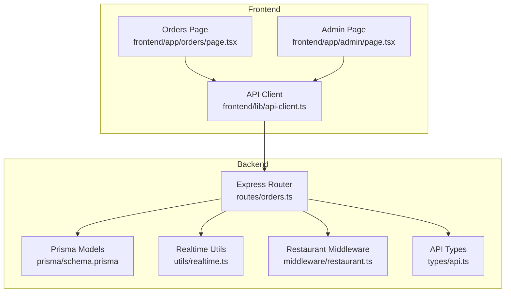
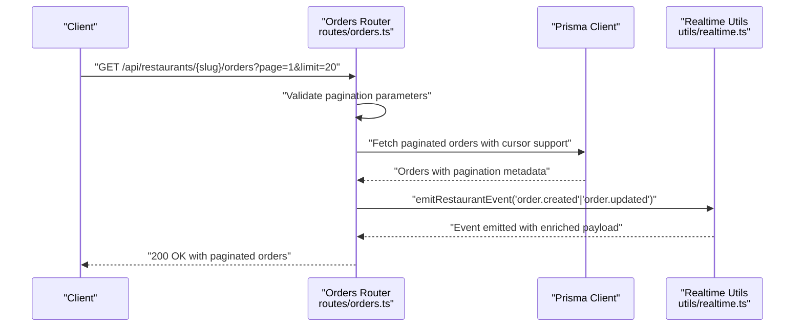
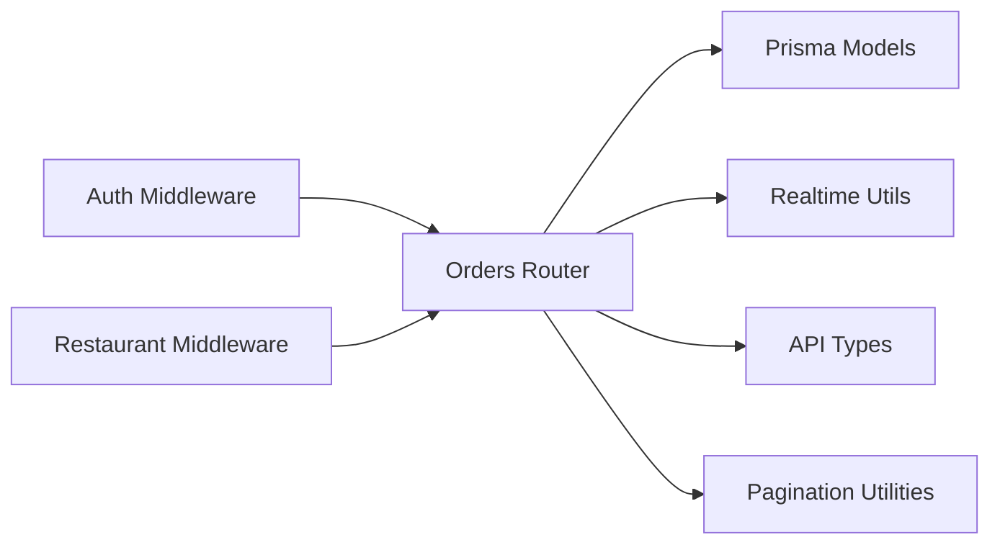

# Order Management Endpoints

<cite>
**Referenced Files in This Document**
- [orders.ts](file://restaurant-backend/src/routes/orders.ts)
- [api.ts](file://restaurant-backend/src/types/api.ts)
- [schema.prisma](file://restaurant-backend/prisma/schema.prisma)
- [realtime.ts](file://restaurant-backend/src/utils/realtime.ts)
- [restaurant.ts](file://restaurant-backend/src/middleware/restaurant.ts)
- [api-client.ts](file://restaurant-frontend/src/lib/api-client.ts)
- [orders page.tsx](file://restaurant-frontend/src/app/orders/page.tsx)
- [admin page.tsx](file://restaurant-frontend/src/app/admin/page.tsx)
- [DeQ-Restaurants-API.postman_collection.json](file://restaurant-backend/postman/DeQ-Restaurants-API.postman_collection.json)
</cite>

## Update Summary
**Changes Made**
- Enhanced GET /api/orders endpoint with cursor-based navigation alongside traditional pagination
- Added comprehensive pagination support for both customer and restaurant-admin order retrieval
- Improved real-time event payloads with enhanced user and table information
- Updated frontend integration to support both pagination modes
- Expanded restaurant-specific order filtering capabilities

## Table of Contents
1. [Introduction](#introduction)
2. [Project Structure](#project-structure)
3. [Core Components](#core-components)
4. [Architecture Overview](#architecture-overview)
5. [Detailed Component Analysis](#detailed-component-analysis)
6. [Enhanced Pagination and Navigation](#enhanced-pagination-and-navigation)
7. [Real-time Event Payload Enhancements](#real-time-event-payload-enhancements)
8. [Dependency Analysis](#dependency-analysis)
9. [Performance Considerations](#performance-considerations)
10. [Troubleshooting Guide](#troubleshooting-guide)
11. [Conclusion](#conclusion)
12. [Appendices](#appendices)

## Introduction
This document provides comprehensive API documentation for DeQ-Bite's order management endpoints. It covers the complete lifecycle of orders: creation, retrieval, updates, and cancellation. The system now features enhanced pagination capabilities with both traditional page-based navigation and modern cursor-based navigation, improved real-time order tracking with enriched event payloads, and comprehensive restaurant-specific filtering. The focus is on practical usage for developers building integrations or consuming the API.

## Project Structure
The order management functionality is implemented in the backend Express application under the routes module. The API types define the data contracts, while Prisma models define the database schema. Middleware enforces restaurant context and authorization. The frontend API client demonstrates how clients consume these endpoints with enhanced pagination features.


```mermaid
graph TB
subgraph "Backend"
A["Express Router<br/>routes/orders.ts"]
B["Prisma Models<br/>prisma/schema.prisma"]
C["Realtime Utils<br/>utils/realtime.ts"]
D["Restaurant Middleware<br/>middleware/restaurant.ts"]
E["API Types<br/>types/api.ts"]
end
subgraph "Frontend"
F["API Client<br/>frontend/lib/api-client.ts"]
G["Orders Page<br/>frontend/app/orders/page.tsx"]
H["Admin Page<br/>frontend/app/admin/page.tsx"]
end
F --> A
A --> B
A --> C
A --> D
A --> E
G --> F
H --> F
```

**Diagram sources**
- [orders.ts:1-820](file://restaurant-backend/src/routes/orders.ts#L1-L820)
- [schema.prisma:162-193](file://restaurant-backend/prisma/schema.prisma#L162-L193)
- [realtime.ts:1-42](file://restaurant-backend/src/utils/realtime.ts#L1-L42)
- [restaurant.ts:76-246](file://restaurant-backend/src/middleware/restaurant.ts#L76-L246)
- [api.ts:52-114](file://restaurant-backend/src/types/api.ts#L52-L114)
- [api-client.ts:590-789](file://restaurant-frontend/src/lib/api-client.ts#L590-L789)
- [orders page.tsx:200-399](file://restaurant-frontend/src/app/orders/page.tsx#L200-L399)
- [admin page.tsx:140-339](file://restaurant-frontend/src/app/admin/page.tsx#L140-L339)

**Section sources**
- [orders.ts:1-820](file://restaurant-backend/src/routes/orders.ts#L1-L820)
- [schema.prisma:162-193](file://restaurant-backend/prisma/schema.prisma#L162-L193)
- [realtime.ts:1-42](file://restaurant-backend/src/utils/realtime.ts#L1-L42)
- [restaurant.ts:76-246](file://restaurant-backend/src/middleware/restaurant.ts#L76-L246)
- [api.ts:52-114](file://restaurant-backend/src/types/api.ts#L52-L114)
- [api-client.ts:590-789](file://restaurant-frontend/src/lib/api-client.ts#L590-L789)
- [orders page.tsx:200-399](file://restaurant-frontend/src/app/orders/page.tsx#L200-L399)
- [admin page.tsx:140-339](file://restaurant-frontend/src/app/admin/page.tsx#L140-L339)

## Core Components
- Order model and enums: The backend defines order status and payment status enums, along with pricing fields in paisa units.
- Enhanced pagination: Both page-based and cursor-based navigation for efficient order retrieval.
- Pricing calculation: Subtotal, discount, tax (fixed rate), and totals are computed server-side.
- Coupon application: Coupons are validated against restaurant rules and applied transactionally.
- Real-time events: Order creation and updates emit restaurant-scoped events with enriched payloads for live tracking.

Key data structures:
- Order: includes status, paymentStatus, pricing fields, and relations to items and table.
- OrderItem: includes quantity, pricePaise, and notes.
- Pagination metadata: includes page, limit, total, and totalPages for page-based navigation.

**Section sources**
- [api.ts:52-114](file://restaurant-backend/src/types/api.ts#L52-L114)
- [schema.prisma:162-193](file://restaurant-backend/prisma/schema.prisma#L162-L193)
- [orders.ts:16-36](file://restaurant-backend/src/routes/orders.ts#L16-L36)
- [orders.ts:524-598](file://restaurant-backend/src/routes/orders.ts#L524-L598)
- [orders.ts:600-669](file://restaurant-backend/src/routes/orders.ts#L600-L669)

## Architecture Overview
The order lifecycle spans request validation, business logic, database persistence, and real-time notifications. Authorization ensures only authorized restaurant users can manage orders, while middleware attaches restaurant context for tenant scoping. The enhanced system now supports both pagination strategies for optimal performance.


```mermaid
sequenceDiagram
participant Client as "Client"
participant API as "Orders Router<br/>routes/orders.ts"
participant DB as "Prisma Client"
participant RT as "Realtime Utils<br/>utils/realtime.ts"
Client->>API : "GET /api/restaurants/{slug}/orders?page=1&limit=20"
API->>API : "Validate pagination parameters"
API->>DB : "Fetch paginated orders with cursor support"
DB-->>API : "Orders with pagination metadata"
API->>RT : "emitRestaurantEvent('order.created'|'order.updated')"
RT-->>API : "Event emitted with enriched payload"
API-->>Client : "200 OK with paginated orders"
```

**Diagram sources**
- [orders.ts:524-598](file://restaurant-backend/src/routes/orders.ts#L524-L598)
- [orders.ts:600-669](file://restaurant-backend/src/routes/orders.ts#L600-L669)
- [realtime.ts:20-36](file://restaurant-backend/src/utils/realtime.ts#L20-L36)

**Section sources**
- [orders.ts:524-598](file://restaurant-backend/src/routes/orders.ts#L524-L598)
- [orders.ts:600-669](file://restaurant-backend/src/routes/orders.ts#L600-L669)
- [realtime.ts:20-36](file://restaurant-backend/src/utils/realtime.ts#L20-L36)

## Detailed Component Analysis

### POST /api/restaurants/{slug}/orders
Purpose: Create a new order with menu items, quantities, optional coupon, special instructions, and table assignment.

Request body schema:
- tableId: string (required)
- items: array of objects (required, non-empty)
  - menuItemId: string (required)
  - quantity: number (positive integer)
  - notes: string (optional)
- specialInstructions: string (optional)
- couponCode: string (optional)
- paymentProvider: enum 'RAZORPAY' | 'PAYTM' | 'PHONEPE' | 'CASH' (default: 'RAZORPAY')

Validation rules:
- Requires authenticated user and restaurant context.
- Items array must be non-empty and each item must include menuItemId and quantity.
- Menu items must exist and be available.
- Table must belong to the restaurant and be active.
- Payment provider must be allowed; cash requires restaurant to enable cash payments.
- Coupon code is optional; if provided, it must be valid and active.

Pricing and tax computation:
- Subtotal = sum(menuItem.pricePaise × quantity) for all items.
- Discount = coupon discount (percent or fixed) with minOrderPaise checks and maxDiscountPaise cap.
- Tax = subtotal - discount, then rounded to nearest paisa at fixed rate.
- Total = taxable + tax.
- Paid and due amounts initialized based on payment collection timing and provider.

Order status and payment status:
- New orders start with status 'PENDING'.
- Payment status depends on provider and timing:
  - For cash with BEFORE_MEAL timing, initial paymentStatus is 'PROCESSING'.
  - Otherwise, initial paymentStatus is 'PENDING'.

Response:
- 201 Created with the created order object.
- Emits a 'order.created' event for real-time tracking.

Example usage:
- See Postman collection for request format and expected responses.

**Section sources**
- [orders.ts:96-286](file://restaurant-backend/src/routes/orders.ts#L96-L286)
- [restaurant.ts:202-211](file://restaurant-backend/src/middleware/restaurant.ts#L202-L211)
- [api-client.ts:641-655](file://restaurant-frontend/src/lib/api-client.ts#L641-L655)

### POST /api/restaurants/{slug}/orders/{id}/items
Purpose: Add dishes to an ongoing order.

Request body schema:
- items: array of objects (required, non-empty)
  - menuItemId: string (required)
  - quantity: number (positive integer)
  - notes: string (optional)
- specialInstructions: string (optional)

Validation rules:
- Order must belong to the authenticated user and restaurant.
- Cannot add items to orders with status 'COMPLETED' or 'CANCELLED'.
- Cannot add items to orders with paymentCollectionTiming 'BEFORE_MEAL'.

Processing:
- Validates items and availability.
- Recomputes subtotal, discount, tax, total, due, and paymentStatus.
- Updates order and inserts new order items.

Response:
- 200 OK with updated order.
- Emits a 'order.updated' event.

**Section sources**
- [orders.ts:288-418](file://restaurant-backend/src/routes/orders.ts#L288-L418)

### POST /api/restaurants/{slug}/orders/{id}/apply-coupon
Purpose: Apply or replace a coupon on an existing unpaid order.

Request body schema:
- couponCode: string (required)

Validation rules:
- Order must belong to the authenticated user and restaurant.
- Cannot apply coupon on paid orders.

Processing:
- Validates coupon and applies it transactionally.
- Recomputes discount, tax, total, due, and paymentStatus.

Response:
- 200 OK with updated order.
- Emits a 'order.updated' event.

**Section sources**
- [orders.ts:420-522](file://restaurant-backend/src/routes/orders.ts#L420-L522)

### GET /api/restaurants/{slug}/orders
Purpose: Retrieve the authenticated user's order history for the current restaurant with enhanced pagination support.

**Updated** Enhanced with dual pagination modes: page-based and cursor-based navigation.

Query parameters:
- Page-based navigation:
  - page: number (default: 1, must be > 0)
  - limit: number (default: 20, min: 1, max: 100)
- Cursor-based navigation (alternative):
  - take: number (default: none, max: 100)
  - cursor: string (order ID for cursor-based pagination)

Response:
- 200 OK with array of orders ordered by newest first.
- **New**: Pagination metadata when using page-based navigation:
  - page: current page number
  - limit: items per page
  - total: total matching records
  - totalPages: calculated total pages

Notes:
- Includes order items and table details.
- **New**: Supports both pagination strategies for optimal performance.

**Section sources**
- [orders.ts:524-598](file://restaurant-backend/src/routes/orders.ts#L524-L598)
- [orders page.tsx:209-256](file://restaurant-frontend/src/app/orders/page.tsx#L209-L256)
- [api-client.ts:657-683](file://restaurant-frontend/src/lib/api-client.ts#L657-L683)

### GET /api/restaurants/{slug}/orders/restaurant/all
Purpose: Retrieve all orders for the restaurant (requires OWNER, ADMIN, or STAFF roles) with enhanced pagination.

**Updated** Enhanced with dual pagination modes and improved filtering.

Query parameters:
- Page-based navigation:
  - page: number (default: 1, must be > 0)
  - limit: number (default: 20, min: 1, max: 200)
- Cursor-based navigation (alternative):
  - take: number (default: none, max: 200)
  - cursor: string (order ID for cursor-based pagination)

Response:
- 200 OK with array of orders including user, items, and table details.
- **New**: Pagination metadata when using page-based navigation:
  - page: current page number
  - limit: items per page
  - total: total matching records
  - totalPages: calculated total pages

**Section sources**
- [orders.ts:600-669](file://restaurant-backend/src/routes/orders.ts#L600-L669)
- [admin page.tsx:145-159](file://restaurant-frontend/src/app/admin/page.tsx#L145-L159)
- [api-client.ts:671-683](file://restaurant-frontend/src/lib/api-client.ts#L671-L683)

### GET /api/restaurants/{slug}/orders/{id}
Purpose: Retrieve a specific order by ID for the authenticated user.

Response:
- 200 OK with order details.
- 404 Not Found if order does not exist or does not belong to the user.

**Section sources**
- [orders.ts:671-702](file://restaurant-backend/src/routes/orders.ts#L671-L702)

### PUT /api/restaurants/{slug}/orders/{id}/status
Purpose: Update order status (requires OWNER, ADMIN, or STAFF roles).

Request body schema:
- status: enum 'PENDING' | 'CONFIRMED' | 'PREPARING' | 'READY' | 'SERVED' | 'COMPLETED' | 'CANCELLED'

Validation rules:
- Order must belong to the restaurant.
- For orders with paymentCollectionTiming 'BEFORE_MEAL', payment must be completed before advancing beyond PENDING/CONFIRMED.

Response:
- 200 OK with updated order.
- Emits a 'order.updated' event.

Status transitions:
- Kitchen workflow typically progresses: CONFIRMED → PREPARING → READY → SERVED → COMPLETED.
- CANCELLED can only be applied at specific stages and conditions.

**Section sources**
- [orders.ts:704-753](file://restaurant-backend/src/routes/orders.ts#L704-L753)

### PUT /api/restaurants/{slug}/orders/{id}/cancel
Purpose: Cancel an order (authenticated user can cancel their own orders).

Validation rules:
- Order must belong to the authenticated user and restaurant.
- Can only cancel if status is 'PENDING' or 'CONFIRMED'.
- Cannot cancel if paidAmountPaise > 0 (refund required first).

Response:
- 200 OK with cancelled order (status 'CANCELLED', paymentStatus 'FAILED').
- Emits a 'order.updated' event.

**Section sources**
- [orders.ts:755-817](file://restaurant-backend/src/routes/orders.ts#L755-L817)

## Enhanced Pagination and Navigation

### Dual Pagination Modes
The order management system now supports two complementary pagination strategies:

#### Page-Based Navigation
Ideal for simple pagination with clear page numbers and total counts.

Query parameters:
- page: number (default: 1, must be > 0)
- limit: number (default: 20, min: 1, max: 100 for user orders, max: 200 for restaurant orders)

Response includes pagination metadata:
```json
{
  "pagination": {
    "page": 1,
    "limit": 20,
    "total": 150,
    "totalPages": 8
  }
}
```

#### Cursor-Based Navigation
Optimized for infinite scrolling and real-time data feeds.

Query parameters:
- take: number (max: 100 for user orders, max: 200 for restaurant orders)
- cursor: string (order ID for pagination)

Benefits:
- Efficient for large datasets
- Reduces index scanning overhead
- Supports real-time infinite scrolling

**Section sources**
- [orders.ts:524-598](file://restaurant-backend/src/routes/orders.ts#L524-L598)
- [orders.ts:600-669](file://restaurant-backend/src/routes/orders.ts#L600-L669)
- [orders page.tsx:209-256](file://restaurant-frontend/src/app/orders/page.tsx#L209-L256)
- [admin page.tsx:145-159](file://restaurant-frontend/src/app/admin/page.tsx#L145-L159)

### Frontend Integration Examples

#### Customer Orders with Pagination
```typescript
// Fetch first page of orders
const response = await apiClient.getOrdersPage(1, 20);

// Infinite scroll with cursor
const loadMore = async () => {
  const lastOrder = orders[orders.length - 1];
  const response = await apiClient.getOrdersCursor(
    lastOrder.id,
    20
  );
};
```

#### Restaurant Admin Orders
```typescript
// Admin dashboard pagination
const loadOrdersPage = async (page: number) => {
  const response = await apiClient.getRestaurantOrdersPage(page, 50);
  setOrders(response.data);
  setPagination({
    total: response.pagination.total,
    totalPages: response.pagination.totalPages
  });
};
```

**Section sources**
- [api-client.ts:657-711](file://restaurant-frontend/src/lib/api-client.ts#L657-L711)
- [orders page.tsx:209-256](file://restaurant-frontend/src/app/orders/page.tsx#L209-L256)
- [admin page.tsx:145-159](file://restaurant-frontend/src/app/admin/page.tsx#L145-L159)

## Real-time Event Payload Enhancements

### Enhanced Event Payload Structure
The real-time event system now includes enriched payload information for better client-side handling.

Event payload includes:
- Basic order information: id, userId, tableId, status, paymentStatus
- Financial details: paidAmountPaise, dueAmountPaise, totalPaise
- Timing information: createdAt, updatedAt
- **New**: Optional enrichment: items, table, user details
- **New**: Additional pricing fields: subtotalPaise, taxPaise, discountPaise

### Event Emission Patterns
Events are emitted for:
- `order.created`: New order creation
- `order.updated`: Order status or payment updates

Client-side handling:
- Real-time order updates in admin dashboard
- Instant UI updates for order status changes
- Enhanced notifications with user and table information

**Section sources**
- [orders.ts:38-61](file://restaurant-backend/src/routes/orders.ts#L38-L61)
- [orders.ts:272-276](file://restaurant-backend/src/routes/orders.ts#L272-L276)
- [orders.ts:404-408](file://restaurant-backend/src/routes/orders.ts#L404-L408)
- [orders.ts:505-509](file://restaurant-backend/src/routes/orders.ts#L505-L509)
- [orders.ts:743-747](file://restaurant-backend/src/routes/orders.ts#L743-L747)
- [orders.ts:807-811](file://restaurant-backend/src/routes/orders.ts#L807-L811)
- [realtime.ts:20-36](file://restaurant-backend/src/utils/realtime.ts#L20-L36)

### Frontend Real-time Integration
```typescript
// Admin dashboard real-time updates
const handleRealtimeOrderUpdate = (incoming: Partial<Order>) => {
  // Enhanced payload processing
  const notifications = [];
  
  if (incoming.status && incoming.status !== existing.status) {
    notifications.push({
      id: `${incoming.id}-status-${Date.now()}`,
      message: `Order #${incoming.id.slice(0, 8).toUpperCase()} moved to ${incoming.status}`,
      time: new Date().toLocaleTimeString(),
      user: incoming.user, // New in enhanced payload
      table: incoming.table  // New in enhanced payload
    });
  }
};
```

**Section sources**
- [admin page.tsx:224-291](file://restaurant-frontend/src/app/admin/page.tsx#L224-L291)
- [orders page.tsx:209-256](file://restaurant-frontend/src/app/orders/page.tsx#L209-L256)

## Dependency Analysis
The order endpoints depend on:
- Authentication middleware for user identity.
- Restaurant middleware for tenant scoping and payment policy.
- Prisma models for data persistence.
- Realtime utilities for event emission.
- **New**: Enhanced pagination utilities for efficient data retrieval.


```mermaid
graph LR
Auth["Auth Middleware"] --> Orders["Orders Router"]
RestMW["Restaurant Middleware"] --> Orders
Orders --> Prisma["Prisma Models"]
Orders --> RT["Realtime Utils"]
Orders --> Types["API Types"]
Orders --> Paginate["Pagination Utilities"]
```

**Diagram sources**
- [orders.ts:1-12](file://restaurant-backend/src/routes/orders.ts#L1-L12)
- [restaurant.ts:76-246](file://restaurant-backend/src/middleware/restaurant.ts#L76-L246)
- [schema.prisma:162-193](file://restaurant-backend/prisma/schema.prisma#L162-L193)
- [realtime.ts:1-42](file://restaurant-backend/src/utils/realtime.ts#L1-L42)
- [api.ts:52-114](file://restaurant-backend/src/types/api.ts#L52-L114)

**Section sources**
- [orders.ts:1-12](file://restaurant-backend/src/routes/orders.ts#L1-L12)
- [restaurant.ts:76-246](file://restaurant-backend/src/middleware/restaurant.ts#L76-L246)
- [schema.prisma:162-193](file://restaurant-backend/prisma/schema.prisma#L162-L193)
- [realtime.ts:1-42](file://restaurant-backend/src/utils/realtime.ts#L1-L42)
- [api.ts:52-114](file://restaurant-backend/src/types/api.ts#L52-L114)

## Performance Considerations
- **Enhanced**: Use appropriate pagination strategy based on use case:
  - Page-based for admin dashboards with pagination controls
  - Cursor-based for infinite scrolling and real-time feeds
- **New**: Optimized query patterns for both pagination modes
- Batch operations for applying coupons and adding items leverage transactions to minimize race conditions.
- Real-time event emission is scoped to restaurantId to reduce unnecessary broadcasts.
- **New**: Cursor-based queries optimized for large datasets with minimal index scanning
- Consider indexing frequently queried fields (userId, restaurantId, status, createdAt) in the database.

## Troubleshooting Guide
Common issues and resolutions:
- **Enhanced**: Pagination parameter validation:
  - Page must be > 0 for page-based navigation
  - Limit must be within allowed range (1-100 for user orders, 1-200 for restaurant orders)
  - Cursor pagination uses take parameter instead of limit
- Unauthorized or missing restaurant context: Ensure the x-restaurant-slug header is set and the user has restaurant membership.
- Invalid or inactive coupon: Verify coupon code, dates, usage limits, and minimum order requirements.
- Payment provider restrictions: Cash payments require the restaurant to enable cashPaymentEnabled.
- Status progression blocked: For BEFORE_MEAL timing, payment must be completed before advancing beyond PENDING/CONFIRMED.
- Cannot cancel order: Only orders with status 'PENDING' or 'CONFIRMED' and zero paidAmountPaise can be cancelled.

**Section sources**
- [orders.ts:531-535](file://restaurant-backend/src/routes/orders.ts#L531-L535)
- [orders.ts:602-606](file://restaurant-backend/src/routes/orders.ts#L602-L606)
- [orders.ts:96-122](file://restaurant-backend/src/routes/orders.ts#L96-L122)
- [orders.ts:704-753](file://restaurant-backend/src/routes/orders.ts#L704-L753)
- [orders.ts:755-817](file://restaurant-backend/src/routes/orders.ts#L755-L817)

## Conclusion
The order management endpoints provide a robust, secure, and extensible foundation for restaurant ordering workflows. The enhanced system now features comprehensive pagination capabilities supporting both traditional page-based navigation and modern cursor-based approaches, improved real-time event payloads with enriched user and table information, and restaurant-specific filtering for administrative oversight. These improvements ensure optimal performance for both customer-facing applications and restaurant management interfaces.

## Appendices

### API Definitions

- Base URL: `{backend-base-url}/api/restaurants/{slug}`
- Headers:
  - Authorization: Bearer {token}
  - x-restaurant-slug: {restaurant-slug}
  - Content-Type: application/json

Endpoints:
- POST /orders
- POST /orders/{id}/items
- POST /orders/{id}/apply-coupon
- GET /orders
- GET /orders/restaurant/all
- GET /orders/{id}
- PUT /orders/{id}/status
- PUT /orders/{id}/cancel

**Updated** Enhanced pagination parameters:
- Page-based: `?page=&limit=`
- Cursor-based: `?take=&cursor=`

Request/Response Schemas:
- Order: [Order type definition:52-114](file://restaurant-backend/src/types/api.ts#L52-L114)
- OrderItem: [OrderItem type definition:68-77](file://restaurant-backend/src/types/api.ts#L68-L77)
- Enums: [OrderStatus and PaymentStatus:358-375](file://restaurant-backend/prisma/schema.prisma#L358-L375)

**Section sources**
- [api.ts:52-114](file://restaurant-backend/src/types/api.ts#L52-L114)
- [schema.prisma:358-375](file://restaurant-backend/prisma/schema.prisma#L358-L375)
- [api-client.ts:590-789](file://restaurant-frontend/src/lib/api-client.ts#L590-L789)