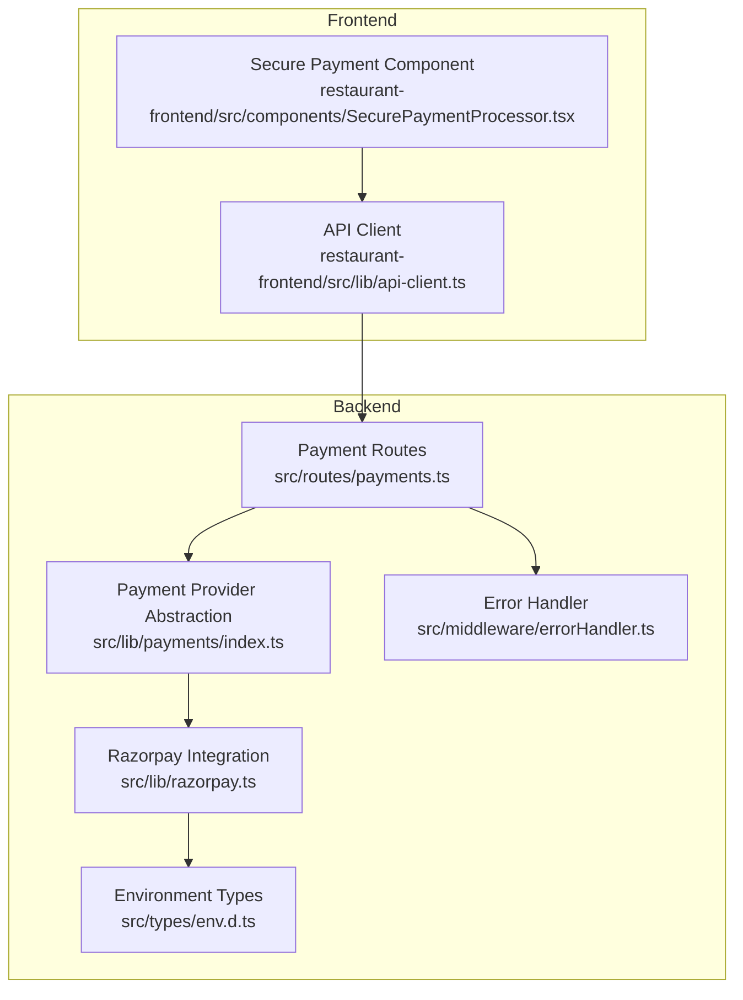
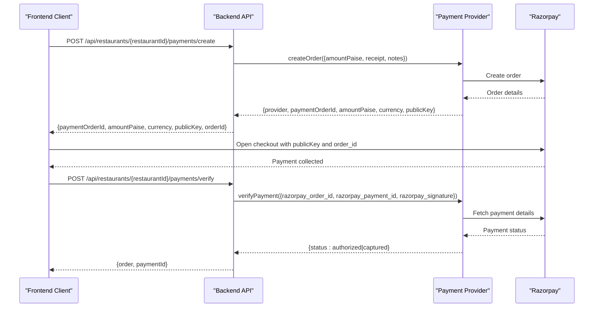
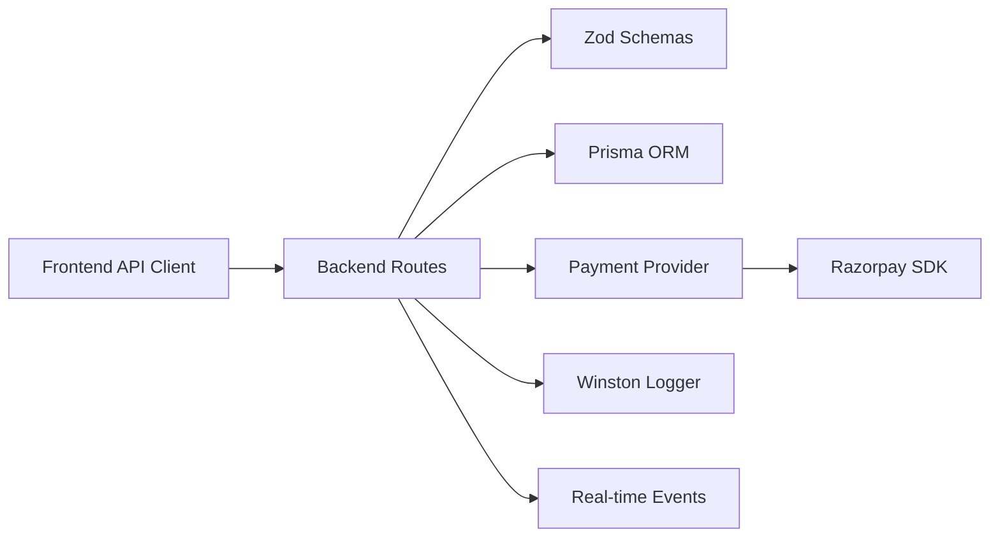

# Payment Processing Endpoints

<cite>
**Referenced Files in This Document**
- [payments.ts](file://restaurant-backend/src/routes/payments.ts)
- [razorpay.ts](file://restaurant-backend/src/lib/razorpay.ts)
- [payments/index.ts](file://restaurant-backend/src/lib/payments/index.ts)
- [env.d.ts](file://restaurant-backend/src/types/env.d.ts)
- [errorHandler.ts](file://restaurant-backend/src/middleware/errorHandler.ts)
- [api-client.ts](file://restaurant-frontend/src/lib/api-client.ts)
- [SecurePaymentProcessor.tsx](file://restaurant-frontend/src/components/SecurePaymentProcessor.tsx)
- [DeQ-Restaurants-API.postman_collection.json](file://restaurant-backend/postman/DeQ-Restaurants-API.postman_collection.json)
- [package.json](file://restaurant-backend/package.json)
</cite>

## Table of Contents
1. [Introduction](#introduction)
2. [Project Structure](#project-structure)
3. [Core Components](#core-components)
4. [Architecture Overview](#architecture-overview)
5. [Detailed Component Analysis](#detailed-component-analysis)
6. [Dependency Analysis](#dependency-analysis)
7. [Performance Considerations](#performance-considerations)
8. [Troubleshooting Guide](#troubleshooting-guide)
9. [Conclusion](#conclusion)

## Introduction
This document provides comprehensive API documentation for DeQ-Bite's payment processing endpoints. It covers the payment creation flow, verification process, and status retrieval, with a focus on Razorpay integration. The documentation includes request/response schemas, transaction identifiers, payment methods, status indicators, security validation, and practical examples for development and testing.

## Project Structure
The payment processing functionality spans the backend routes, payment provider abstraction, and Razorpay integration, along with frontend components that orchestrate the secure payment flow.

**Diagram sources**
- [payments.ts:1-731](file://restaurant-backend/src/routes/payments.ts#L1-L731)
- [payments/index.ts:1-124](file://restaurant-backend/src/lib/payments/index.ts#L1-L124)
- [razorpay.ts:1-219](file://restaurant-backend/src/lib/razorpay.ts#L1-L219)
- [errorHandler.ts:1-82](file://restaurant-backend/src/middleware/errorHandler.ts#L1-L82)
- [env.d.ts:1-32](file://restaurant-backend/src/types/env.d.ts#L1-L32)
- [api-client.ts:1-800](file://restaurant-frontend/src/lib/api-client.ts#L1-L800)
- [SecurePaymentProcessor.tsx:1-347](file://restaurant-frontend/src/components/SecurePaymentProcessor.tsx#L1-L347)

**Section sources**
- [payments.ts:1-731](file://restaurant-backend/src/routes/payments.ts#L1-L731)
- [payments/index.ts:1-124](file://restaurant-backend/src/lib/payments/index.ts#L1-L124)
- [razorpay.ts:1-219](file://restaurant-backend/src/lib/razorpay.ts#L1-L219)
- [env.d.ts:1-32](file://restaurant-backend/src/types/env.d.ts#L1-L32)
- [api-client.ts:1-800](file://restaurant-frontend/src/lib/api-client.ts#L1-L800)
- [SecurePaymentProcessor.tsx:1-347](file://restaurant-frontend/src/components/SecurePaymentProcessor.tsx#L1-L347)

## Core Components
- Payment Routes: Expose endpoints for creating payment orders, verifying payments, retrieving payment status, issuing refunds, and confirming cash payments.
- Payment Provider Abstraction: Defines a unified interface for payment providers (currently Razorpay is implemented; others are placeholders).
- Razorpay Integration: Handles order creation, signature verification, payment capture, refunds, and webhook signature validation.
- Frontend Payment Flow: Integrates with the backend APIs to securely collect payment via Razorpay checkout.

Key responsibilities:
- Validate requests and enforce tenant and user context.
- Manage payment lifecycle: processing, verification, partial/full completion, and refund.
- Enforce security: signature verification and webhook validation.
- Emit real-time events and maintain audit logs.

**Section sources**
- [payments.ts:195-407](file://restaurant-backend/src/routes/payments.ts#L195-L407)
- [payments/index.ts:32-81](file://restaurant-backend/src/lib/payments/index.ts#L32-L81)
- [razorpay.ts:33-195](file://restaurant-backend/src/lib/razorpay.ts#L33-L195)

## Architecture Overview
The payment flow integrates frontend, backend, and Razorpay services. The frontend initiates a payment order, receives checkout parameters, and verifies the payment with the backend. The backend validates signatures and updates order/payment records.

**Diagram sources**
- [payments.ts:195-407](file://restaurant-backend/src/routes/payments.ts#L195-L407)
- [payments/index.ts:40-81](file://restaurant-backend/src/lib/payments/index.ts#L40-L81)
- [razorpay.ts:33-105](file://restaurant-backend/src/lib/razorpay.ts#L33-L105)

## Detailed Component Analysis

### Endpoint: POST /api/restaurants/{restaurantId}/payments/create
Purpose: Initiate a payment order for a given order ID using the configured payment provider.

Request Schema
- orderId: string (required)
- paymentProvider: enum ['RAZORPAY', 'PAYTM', 'PHONEPE'], optional

Response Schema
- success: boolean
- message: string
- data: {
  - paymentOrderId: string
  - amountPaise: number
  - currency: 'INR'
  - provider: 'RAZORPAY' | 'PAYTM' | 'PHONEPE'
  - publicKey: string (only for Razorpay)
  - redirectUrl: string (provider-specific)
  - orderId: string
  - customerDetails: {
    - name: string
    - email: string
    - phone: string
  }
}

Behavior
- Validates order ownership and restaurant context.
- Supports partial payments and enforces due amounts.
- Creates a provider order and updates order payment fields.
- Logs payment creation and returns provider-specific parameters.

Security Notes
- Requires authenticated user and restaurant context.
- Uses provider abstraction to gate unsupported providers.

**Section sources**
- [payments.ts:195-292](file://restaurant-backend/src/routes/payments.ts#L195-L292)
- [payments/index.ts:40-59](file://restaurant-backend/src/lib/payments/index.ts#L40-L59)

### Endpoint: POST /api/restaurants/{restaurantId}/payments/verify
Purpose: Verify a payment using Razorpay signature and finalize the order.

Request Schema
- razorpay_order_id: string (required)
- razorpay_payment_id: string (required)
- razorpay_signature: string (required)

Response Schema
- success: boolean
- message: string
- data: {
  - order: {
    - id: string
    - status: string
    - paymentStatus: string
    - totalPaise: number
    - paidAmountPaise: number
    - dueAmountPaise: number
    - payments: array of payment records
  }
  - paymentId: string
}

Verification Logic
- Validates presence of required fields.
- Calls provider verification which:
  - Verifies signature using HMAC-SHA256 with shared secret.
  - Fetches payment details from Razorpay.
  - Ensures payment status is authorized or captured.
- Updates order payment status and paid/due amounts.
- Records payment and emits audit logs and real-time events.

Security Validation
- Signature verification uses the shared key secret.
- Payment status checked against authorized/captured states.

**Section sources**
- [payments.ts:294-407](file://restaurant-backend/src/routes/payments.ts#L294-L407)
- [payments/index.ts:60-77](file://restaurant-backend/src/lib/payments/index.ts#L60-L77)
- [razorpay.ts:65-105](file://restaurant-backend/src/lib/razorpay.ts#L65-L105)

### Endpoint: GET /api/restaurants/{restaurantId}/payments/status/{orderId}
Purpose: Retrieve the current payment and order status for a given order.

Request Parameters
- orderId: string (required)

Response Schema
- success: boolean
- data: {
  - order: {
    - id: string
    - status: string
    - paymentStatus: string
    - paymentId: string
    - totalPaise: number
    - paidAmountPaise: number
    - dueAmountPaise: number
    - payments: array of payment records with fields:
      - id: string
      - amountPaise: number
      - method: string
      - provider: string
      - status: string
      - createdAt: string
  }
}

Behavior
- Validates order ownership and restaurant context.
- Returns latest payment records ordered by creation time.

**Section sources**
- [payments.ts:518-568](file://restaurant-backend/src/routes/payments.ts#L518-L568)

### Payment Provider Abstraction
The provider abstraction defines a common interface for payment providers and currently implements Razorpay with placeholder implementations for PAYTM and PHONEPE.

Interfaces
- PaymentProviderType: union of supported providers
- CreatePaymentInput: amountPaise, receipt, notes
- CreatePaymentResult: provider, paymentOrderId, amountPaise, currency, publicKey, redirectUrl
- VerifyPaymentInput: razorpay_order_id, razorpay_payment_id, razorpay_signature

Implementation Highlights
- Razorpay provider checks for environment credentials and throws descriptive errors when missing.
- Verification validates signature and payment status before updating order records.
- Refund delegates to provider implementation.

**Section sources**
- [payments/index.ts:9-38](file://restaurant-backend/src/lib/payments/index.ts#L9-L38)
- [payments/index.ts:40-81](file://restaurant-backend/src/lib/payments/index.ts#L40-L81)

### Razorpay Integration Details
Core Functions
- createRazorpayOrder: Creates an order with amount, currency, receipt, and notes.
- verifyRazorpaySignature: Validates signature using HMAC-SHA256 with key secret.
- fetchPaymentDetails: Retrieves payment status and amount.
- validateWebhookSignature: Validates webhook signatures using webhook secret.

Security Validation
- Signature verification compares computed HMAC with provided signature.
- Webhook signature validation uses a dedicated webhook secret.

Error Handling
- Throws descriptive errors on missing credentials or API failures.
- Logs timing and error details for diagnostics.

**Section sources**
- [razorpay.ts:33-195](file://restaurant-backend/src/lib/razorpay.ts#L33-L195)
- [env.d.ts:10-11](file://restaurant-backend/src/types/env.d.ts#L10-L11)

### Frontend Payment Flow
Frontend Components
- SecurePaymentProcessor: Orchestrates payment creation, loads Razorpay checkout, and handles verification.
- ApiClient: Provides typed methods for payment endpoints.

Flow
- Initiates payment creation via backend API.
- Loads Razorpay script and opens checkout with returned parameters.
- Submits verification data to backend after successful payment.
- Handles verification status and transitions to success state.

Timeout and Error Handling
- Verification includes a timeout to avoid hanging requests.
- Provides user-friendly error messages for various failure scenarios.

**Section sources**
- [SecurePaymentProcessor.tsx:83-206](file://restaurant-frontend/src/components/SecurePaymentProcessor.tsx#L83-L206)
- [api-client.ts:380-440](file://restaurant-frontend/src/lib/api-client.ts#L380-L440)

## Dependency Analysis
Payment processing depends on:
- Express routes for HTTP handling and validation.
- Zod schemas for request validation.
- Prisma for order and payment persistence.
- Razorpay SDK for payment operations.
- Winston logger for audit trails.
- Real-time events for order updates.

**Diagram sources**
- [payments.ts:1-14](file://restaurant-backend/src/routes/payments.ts#L1-L14)
- [package.json:39-39](file://restaurant-backend/package.json#L39-L39)

**Section sources**
- [payments.ts:1-14](file://restaurant-backend/src/routes/payments.ts#L1-L14)
- [package.json:18-44](file://restaurant-backend/package.json#L18-L44)

## Performance Considerations
- Transaction batching: Backend uses Prisma transactions to ensure atomic updates for order and payment records.
- Logging overhead: Signature verification and payment fetch operations log timing metrics to aid performance monitoring.
- Timeout handling: Frontend verification includes a timeout to prevent long hangs during payment verification.
- Provider caching: Razorpay instance is lazily initialized and reused to minimize initialization overhead.

[No sources needed since this section provides general guidance]

## Troubleshooting Guide
Common Issues and Resolutions
- Missing Razorpay credentials: Ensure RAZORPAY_KEY_ID and RAZORPAY_KEY_SECRET are configured. The provider abstraction throws descriptive errors when missing.
- Invalid signature: Verify that the signature is computed using HMAC-SHA256 with the correct shared key and concatenated order and payment IDs.
- Payment not successful: The verification step checks payment status and rejects non-success statuses.
- Order not found: Ensure the order belongs to the authenticated user and restaurant context.
- Network timeouts: Frontend includes a timeout for verification; retry after checking connectivity.

Error Handling
- Backend error handler standardizes error responses and logs stack traces in development mode.
- Frontend API client maps backend errors to user-friendly messages and network-specific errors.

**Section sources**
- [payments/index.ts:42-46](file://restaurant-backend/src/lib/payments/index.ts#L42-L46)
- [razorpay.ts:69-104](file://restaurant-backend/src/lib/razorpay.ts#L69-L104)
- [errorHandler.ts:22-82](file://restaurant-backend/src/middleware/errorHandler.ts#L22-L82)
- [api-client.ts:402-432](file://restaurant-frontend/src/lib/api-client.ts#L402-L432)

## Conclusion
DeQ-Bite's payment processing endpoints provide a robust, secure, and extensible foundation for handling online payments. The backend enforces strict validation, security, and auditability, while the frontend delivers a seamless checkout experience. Razorpay integration is fully implemented with signature verification and webhook validation, ensuring secure and reliable payment processing.