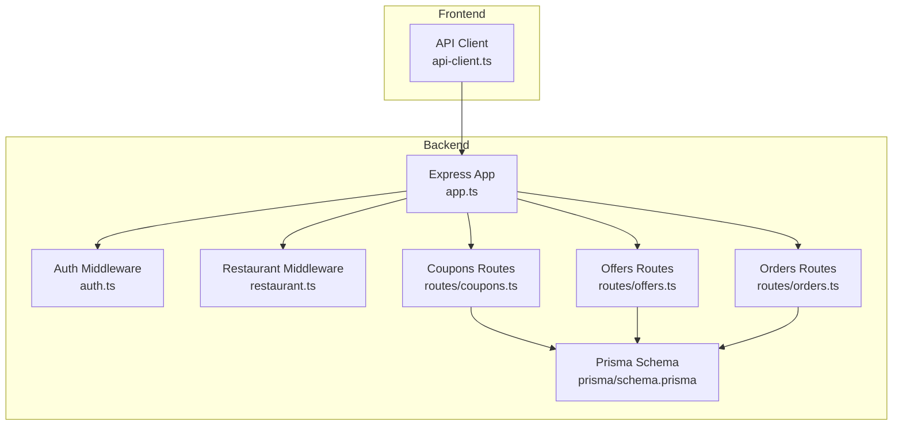
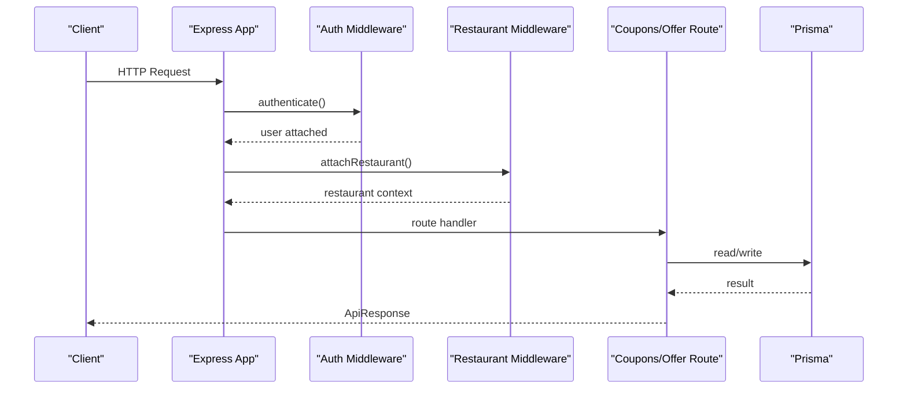
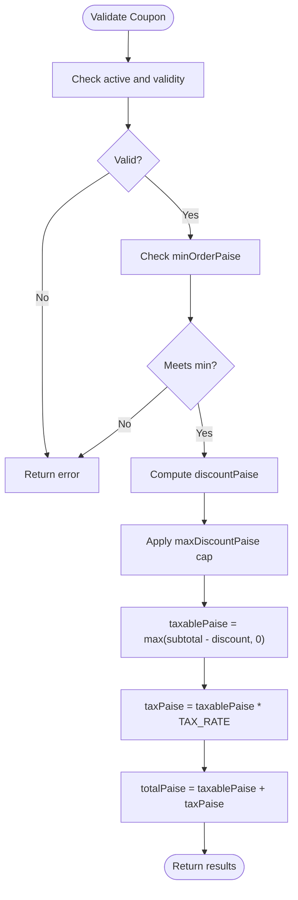
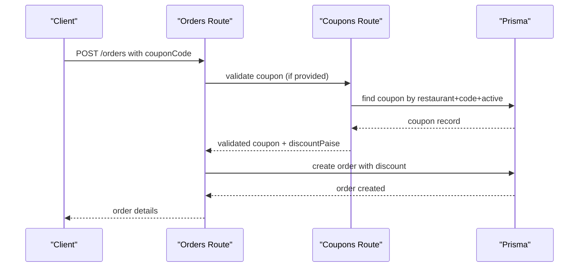
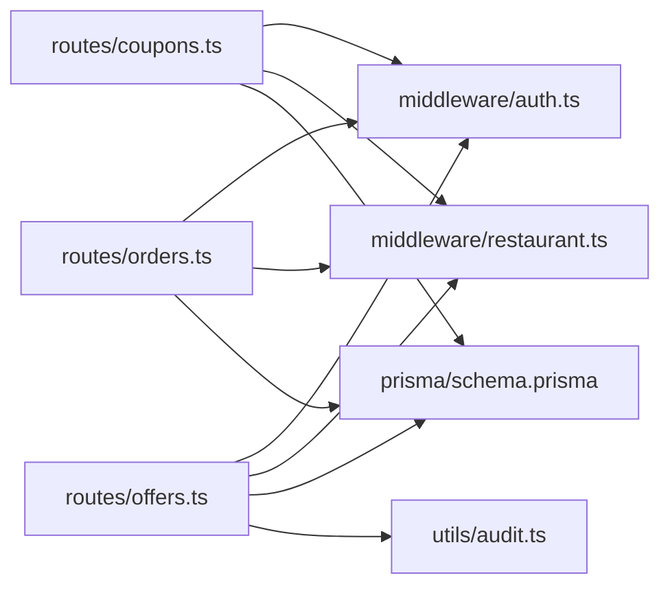

# Promotion & Coupon Endpoints

<cite>
**Referenced Files in This Document**
- [coupons.ts](file://restaurant-backend/src/routes/coupons.ts)
- [offers.ts](file://restaurant-backend/src/routes/offers.ts)
- [orders.ts](file://restaurant-backend/src/routes/orders.ts)
- [api.ts](file://restaurant-backend/src/types/api.ts)
- [schema.prisma](file://restaurant-backend/prisma/schema.prisma)
- [app.ts](file://restaurant-backend/src/app.ts)
- [auth.ts](file://restaurant-backend/src/middleware/auth.ts)
- [restaurant.ts](file://restaurant-backend/src/middleware/restaurant.ts)
- [audit.ts](file://restaurant-backend/src/utils/audit.ts)
- [api-client.ts](file://restaurant-frontend/src/lib/api-client.ts)
- [DeQ-Restaurants-API.postman_collection.json](file://restaurant-backend/postman/DeQ-Restaurants-API.postman_collection.json)
</cite>

## Table of Contents
1. [Introduction](#introduction)
2. [Project Structure](#project-structure)
3. [Core Components](#core-components)
4. [Architecture Overview](#architecture-overview)
5. [Detailed Component Analysis](#detailed-component-analysis)
6. [Dependency Analysis](#dependency-analysis)
7. [Performance Considerations](#performance-considerations)
8. [Troubleshooting Guide](#troubleshooting-guide)
9. [Conclusion](#conclusion)
10. [Appendices](#appendices)

## Introduction
This document provides comprehensive API documentation for DeQ-Bite’s promotion and coupon management endpoints. It covers:
- Coupon endpoints: creation, listing, validation, and updates
- Offer endpoints: creation, listing, updates, and deletions
- Schemas for coupon and offer objects
- Examples of coupon application during checkout and offer targeting
- Promotional analytics considerations

The documentation is designed for both technical and non-technical readers, with clear endpoint definitions, request/response structures, and practical usage scenarios.

## Project Structure
The API is implemented in the restaurant-backend service using Express.js and TypeScript. Routes are organized by domain (e.g., coupons, offers, orders), and tenant routing supports multi-restaurant deployments via subdomains or slugs. Middleware enforces authentication, restaurant context, and role-based authorization.

**Diagram sources**
- [app.ts:111-124](file://restaurant-backend/src/app.ts#L111-L124)
- [auth.ts:7-75](file://restaurant-backend/src/middleware/auth.ts#L7-L75)
- [restaurant.ts:76-200](file://restaurant-backend/src/middleware/restaurant.ts#L76-L200)
- [coupons.ts:1-196](file://restaurant-backend/src/routes/coupons.ts#L1-L196)
- [offers.ts:1-157](file://restaurant-backend/src/routes/offers.ts#L1-L157)
- [orders.ts:12-12](file://restaurant-backend/src/routes/orders.ts#L12-L12)
- [schema.prisma:224-276](file://restaurant-backend/prisma/schema.prisma#L224-L276)

**Section sources**
- [app.ts:111-124](file://restaurant-backend/src/app.ts#L111-L124)
- [auth.ts:7-75](file://restaurant-backend/src/middleware/auth.ts#L7-L75)
- [restaurant.ts:76-200](file://restaurant-backend/src/middleware/restaurant.ts#L76-L200)
- [schema.prisma:224-276](file://restaurant-backend/prisma/schema.prisma#L224-L276)

## Core Components
- Authentication and Authorization: JWT-based authentication with role checks and restaurant membership validation.
- Tenant Routing: Middleware extracts restaurant context from headers or path parameters.
- Coupon Management: Creation, listing, validation, and updates with discount computation and usage tracking.
- Offer Management: Creation, listing, updates, and deletions with audit logging.
- Order Integration: Coupon application during order creation and updates.

Key types and schemas:
- ApiResponse: Standardized response envelope used across endpoints.
- Coupon model: Discount types, limits, validity windows, and usage counters.
- Offer model: Campaign-like promotions with flexible targeting fields.

**Section sources**
- [api.ts:107-114](file://restaurant-backend/src/types/api.ts#L107-L114)
- [schema.prisma:224-276](file://restaurant-backend/prisma/schema.prisma#L224-L276)

## Architecture Overview
The API follows a layered architecture:
- HTTP Layer: Express routes
- Business Logic: Validation, discount calculation, and audit logging
- Persistence: Prisma ORM with PostgreSQL
- Cross-Cutting Concerns: Auth, tenant extraction, CORS, rate limiting

**Diagram sources**
- [app.ts:111-124](file://restaurant-backend/src/app.ts#L111-L124)
- [auth.ts:7-75](file://restaurant-backend/src/middleware/auth.ts#L7-L75)
- [restaurant.ts:76-200](file://restaurant-backend/src/middleware/restaurant.ts#L76-L200)
- [coupons.ts:52-97](file://restaurant-backend/src/routes/coupons.ts#L52-L97)
- [offers.ts:28-76](file://restaurant-backend/src/routes/offers.ts#L28-L76)

## Detailed Component Analysis

### Coupon Endpoints

#### Endpoint: GET /api/restaurants/:restaurantId/coupons
- Description: List all coupons for the authenticated restaurant.
- Authentication: Required
- Authorization: OWNER, ADMIN, STAFF
- Response: ApiResponse with coupons array

**Section sources**
- [coupons.ts:52-64](file://restaurant-backend/src/routes/coupons.ts#L52-L64)

#### Endpoint: POST /api/restaurants/:restaurantId/coupons
- Description: Create a new coupon.
- Authentication: Required
- Authorization: OWNER, ADMIN
- Request Body Schema:
  - code: string (3–30 chars)
  - description: string (optional)
  - type: "PERCENT" | "FIXED"
  - value: number (positive int)
  - maxDiscountPaise: number (positive int, optional)
  - minOrderPaise: number (positive int, optional)
  - usageLimit: number (positive int, optional)
  - startsAt: datetime (optional)
  - endsAt: datetime (optional)
  - active: boolean (optional)
- Response: ApiResponse with created coupon

**Section sources**
- [coupons.ts:13-26](file://restaurant-backend/src/routes/coupons.ts#L13-L26)
- [coupons.ts:67-97](file://restaurant-backend/src/routes/coupons.ts#L67-L97)

#### Endpoint: PUT /api/restaurants/:restaurantId/coupons/:id
- Description: Update an existing coupon.
- Authentication: Required
- Authorization: OWNER, ADMIN
- Path Params: id (coupon id)
- Request Body Schema: Same as create, with optional fields
- Response: ApiResponse with updated coupon

**Section sources**
- [coupons.ts:99-139](file://restaurant-backend/src/routes/coupons.ts#L99-L139)

#### Endpoint: POST /api/restaurants/:restaurantId/coupons/validate
- Description: Validate a coupon for the current restaurant and compute discount.
- Authentication: Optional for this endpoint
- Authorization: None
- Request Body:
  - code: string
  - subtotalPaise: number (non-negative int)
- Response: ApiResponse with coupon details, discountPaise, taxPaise, totalPaise

Validation rules enforced:
- Active status and validity period
- Usage limit and minimum order threshold
- Max discount cap and non-negative taxable amount

**Section sources**
- [coupons.ts:141-193](file://restaurant-backend/src/routes/coupons.ts#L141-L193)

#### Coupon Model Schema
- Fields: code, description, type, value, maxDiscountPaise, minOrderPaise, usageLimit, usageCount, startsAt, endsAt, active, timestamps
- Unique constraint: restaurantId + code

**Section sources**
- [schema.prisma:224-245](file://restaurant-backend/prisma/schema.prisma#L224-L245)

#### Coupon Discount Calculation Flow

**Diagram sources**
- [coupons.ts:35-50](file://restaurant-backend/src/routes/coupons.ts#L35-L50)
- [orders.ts:16-36](file://restaurant-backend/src/routes/orders.ts#L16-L36)

### Offer Endpoints

#### Endpoint: GET /api/restaurants/:restaurantId/offers
- Description: List all offers for the authenticated restaurant.
- Authentication: Required
- Authorization: None (tenant required)
- Response: ApiResponse with offers array

**Section sources**
- [offers.ts:28-42](file://restaurant-backend/src/routes/offers.ts#L28-L42)

#### Endpoint: POST /api/restaurants/:restaurantId/offers
- Description: Create a new offer.
- Authentication: Required
- Authorization: OWNER, ADMIN
- Request Body Schema:
  - name: string (2–120 chars)
  - description: string (up to 400 chars, optional)
  - code: string (3–30 chars, optional)
  - discountType: "PERCENT" | "FIXED"
  - value: number (positive int)
  - minOrderPaise: number (positive int, optional)
  - maxDiscountPaise: number (positive int, optional)
  - startsAt: datetime (optional)
  - endsAt: datetime (optional)
  - active: boolean (optional)
- Response: ApiResponse with created offer
- Audit: Creates audit log on creation

**Section sources**
- [offers.ts:11-26](file://restaurant-backend/src/routes/offers.ts#L11-L26)
- [offers.ts:44-76](file://restaurant-backend/src/routes/offers.ts#L44-L76)
- [audit.ts:5-16](file://restaurant-backend/src/utils/audit.ts#L5-L16)

#### Endpoint: PUT /api/restaurants/:restaurantId/offers/:id
- Description: Update an existing offer.
- Authentication: Required
- Authorization: OWNER, ADMIN
- Path Params: id (offer id)
- Request Body Schema: Same as create, with optional fields
- Response: ApiResponse with updated offer
- Audit: Creates audit log on update

**Section sources**
- [offers.ts:78-123](file://restaurant-backend/src/routes/offers.ts#L78-L123)
- [audit.ts:5-16](file://restaurant-backend/src/utils/audit.ts#L5-L16)

#### Endpoint: DELETE /api/restaurants/:restaurantId/offers/:id
- Description: Delete an offer.
- Authentication: Required
- Authorization: OWNER, ADMIN
- Path Params: id (offer id)
- Response: Success message
- Audit: Creates audit log on deletion

**Section sources**
- [offers.ts:125-154](file://restaurant-backend/src/routes/offers.ts#L125-L154)
- [audit.ts:5-16](file://restaurant-backend/src/utils/audit.ts#L5-L16)

#### Offer Model Schema
- Fields: restaurantId, title, name, code, description, type, discountType, value, min/max order thresholds, dates, usage caps, active flag, timestamps
- Additional fields: applicableItems, applicableCategories (arrays)

**Section sources**
- [schema.prisma:247-276](file://restaurant-backend/prisma/schema.prisma#L247-L276)

### Order Integration: Applying Coupons During Checkout
Coupons can be applied during order creation or later via a dedicated endpoint. The backend validates the coupon against restaurant context, timing, limits, and minimum order requirements, computes discounts, and updates usage counts atomically.

**Diagram sources**
- [orders.ts:82-200](file://restaurant-backend/src/routes/orders.ts#L82-L200)
- [orders.ts:50-80](file://restaurant-backend/src/routes/orders.ts#L50-L80)
- [coupons.ts:141-193](file://restaurant-backend/src/routes/coupons.ts#L141-L193)

**Section sources**
- [orders.ts:50-80](file://restaurant-backend/src/routes/orders.ts#L50-L80)
- [orders.ts:82-200](file://restaurant-backend/src/routes/orders.ts#L82-L200)

### Frontend Usage Examples
- Coupon validation and application during checkout:
  - Use the API client to call the coupon validation endpoint and then apply the coupon to an order.
- Offer targeting:
  - Fetch offers for the current restaurant and display applicable campaigns to customers.

**Section sources**
- [api-client.ts:649-681](file://restaurant-frontend/src/lib/api-client.ts#L649-L681)
- [api-client.ts:787-794](file://restaurant-frontend/src/lib/api-client.ts#L787-L794)

## Dependency Analysis
- Routes depend on:
  - Middleware: auth, restaurant
  - Prisma client for data access
  - Zod schemas for request validation
- Audit logs are written asynchronously and gracefully handled if the audit table is not yet migrated.

**Diagram sources**
- [coupons.ts:1-9](file://restaurant-backend/src/routes/coupons.ts#L1-L9)
- [offers.ts:1-8](file://restaurant-backend/src/routes/offers.ts#L1-L8)
- [orders.ts:1-8](file://restaurant-backend/src/routes/orders.ts#L1-L8)
- [audit.ts:1-3](file://restaurant-backend/src/utils/audit.ts#L1-L3)
- [schema.prisma:224-276](file://restaurant-backend/prisma/schema.prisma#L224-L276)

**Section sources**
- [auth.ts:7-75](file://restaurant-backend/src/middleware/auth.ts#L7-L75)
- [restaurant.ts:76-200](file://restaurant-backend/src/middleware/restaurant.ts#L76-L200)
- [audit.ts:5-16](file://restaurant-backend/src/utils/audit.ts#L5-L16)
- [schema.prisma:224-276](file://restaurant-backend/prisma/schema.prisma#L224-L276)

## Performance Considerations
- Rate limiting is enabled globally to prevent abuse.
- Requests accept larger payloads (JSON up to 10MB) to accommodate complex orders.
- Coupon validation queries are scoped to the restaurant context to minimize overhead.
- Use pagination and filtering on listing endpoints when retrieving large datasets.

[No sources needed since this section provides general guidance]

## Troubleshooting Guide
Common issues and resolutions:
- Authentication failures: Ensure Authorization header contains a valid Bearer token.
- Restaurant context missing: Set x-restaurant-slug or x-restaurant-subdomain headers.
- Coupon validation errors:
  - Coupon inactive or expired
  - Usage limit reached
  - Minimum order not met
  - Invalid coupon code
- Offer management errors:
  - Not found if id is incorrect or restaurant mismatch
  - Permission denied for unauthorized roles

**Section sources**
- [auth.ts:33-75](file://restaurant-backend/src/middleware/auth.ts#L33-L75)
- [restaurant.ts:202-245](file://restaurant-backend/src/middleware/restaurant.ts#L202-L245)
- [coupons.ts:154-170](file://restaurant-backend/src/routes/coupons.ts#L154-L170)
- [offers.ts:125-154](file://restaurant-backend/src/routes/offers.ts#L125-L154)

## Conclusion
DeQ-Bite’s promotion and coupon endpoints provide a robust foundation for managing discounts and promotional campaigns. The design emphasizes tenant isolation, strong validation, and auditability. Integrating coupons during checkout ensures accurate pricing and usage tracking, while offers enable flexible promotional strategies with clear lifecycle management.

[No sources needed since this section summarizes without analyzing specific files]

## Appendices

### API Definitions

#### GET /api/restaurants/:restaurantId/coupons
- Authentication: Required
- Authorization: OWNER, ADMIN, STAFF
- Response: ApiResponse with coupons array

**Section sources**
- [coupons.ts:52-64](file://restaurant-backend/src/routes/coupons.ts#L52-L64)

#### POST /api/restaurants/:restaurantId/coupons
- Authentication: Required
- Authorization: OWNER, ADMIN
- Request Body: Coupon creation schema
- Response: ApiResponse with created coupon

**Section sources**
- [coupons.ts:13-26](file://restaurant-backend/src/routes/coupons.ts#L13-L26)
- [coupons.ts:67-97](file://restaurant-backend/src/routes/coupons.ts#L67-L97)

#### PUT /api/restaurants/:restaurantId/coupons/:id
- Authentication: Required
- Authorization: OWNER, ADMIN
- Path Params: id
- Request Body: Coupon update schema
- Response: ApiResponse with updated coupon

**Section sources**
- [coupons.ts:99-139](file://restaurant-backend/src/routes/coupons.ts#L99-L139)

#### POST /api/restaurants/:restaurantId/coupons/validate
- Authentication: Optional
- Authorization: None
- Request Body: { code, subtotalPaise }
- Response: ApiResponse with discountPaise, taxPaise, totalPaise

**Section sources**
- [coupons.ts:141-193](file://restaurant-backend/src/routes/coupons.ts#L141-L193)

#### GET /api/restaurants/:restaurantId/offers
- Authentication: Required
- Authorization: None
- Response: ApiResponse with offers array

**Section sources**
- [offers.ts:28-42](file://restaurant-backend/src/routes/offers.ts#L28-L42)

#### POST /api/restaurants/:restaurantId/offers
- Authentication: Required
- Authorization: OWNER, ADMIN
- Request Body: Offer creation schema
- Response: ApiResponse with created offer

**Section sources**
- [offers.ts:11-26](file://restaurant-backend/src/routes/offers.ts#L11-L26)
- [offers.ts:44-76](file://restaurant-backend/src/routes/offers.ts#L44-L76)

#### PUT /api/restaurants/:restaurantId/offers/:id
- Authentication: Required
- Authorization: OWNER, ADMIN
- Path Params: id
- Request Body: Offer update schema
- Response: ApiResponse with updated offer

**Section sources**
- [offers.ts:78-123](file://restaurant-backend/src/routes/offers.ts#L78-L123)

#### DELETE /api/restaurants/:restaurantId/offers/:id
- Authentication: Required
- Authorization: OWNER, ADMIN
- Path Params: id
- Response: Success message

**Section sources**
- [offers.ts:125-154](file://restaurant-backend/src/routes/offers.ts#L125-L154)

### Example Workflows

#### Coupon Application During Checkout
- Client calls POST /orders with couponCode
- Backend validates coupon and applies discount
- Order is created with computed totals

**Section sources**
- [orders.ts:82-200](file://restaurant-backend/src/routes/orders.ts#L82-L200)
- [orders.ts:50-80](file://restaurant-backend/src/routes/orders.ts#L50-L80)

#### Offer Targeting
- Client fetches offers for the current restaurant
- Offers are filtered and presented to users based on active dates and eligibility

**Section sources**
- [offers.ts:28-42](file://restaurant-backend/src/routes/offers.ts#L28-L42)

### Postman Collection References
- Coupon endpoints: listing, creation, update, validation
- Order coupon application endpoint

**Section sources**
- [DeQ-Restaurants-API.postman_collection.json:717-805](file://restaurant-backend/postman/DeQ-Restaurants-API.postman_collection.json#L717-L805)
- [DeQ-Restaurants-API.postman_collection.json:626-640](file://restaurant-backend/postman/DeQ-Restaurants-API.postman_collection.json#L626-L640)