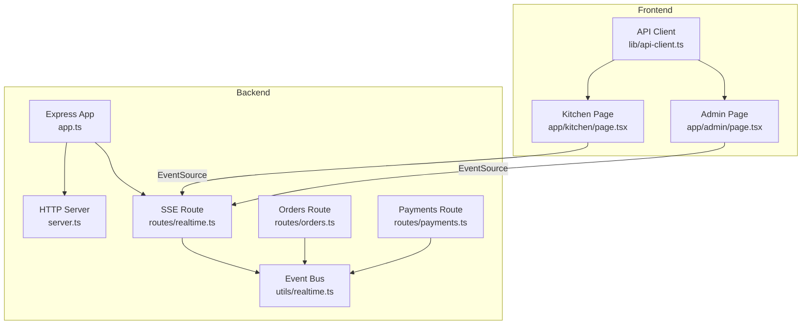
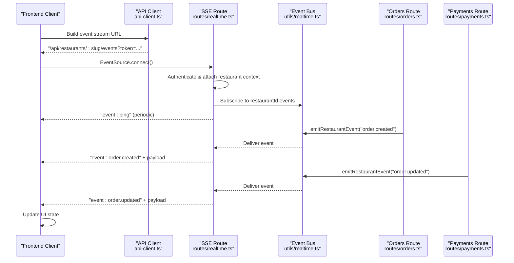
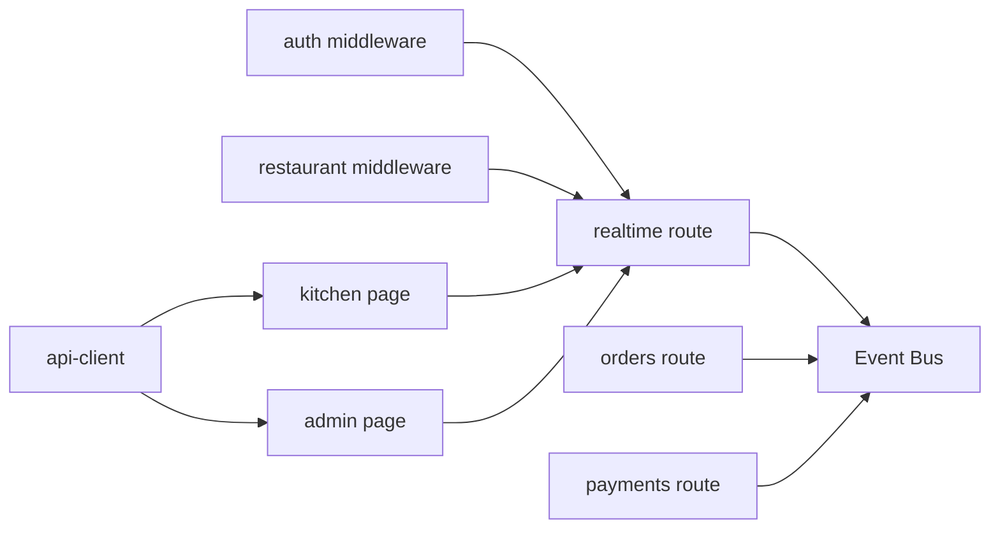

# Real-time Communication Endpoints

<cite>
**Referenced Files in This Document**
- [realtime.ts](file://restaurant-backend/src/routes/realtime.ts)
- [realtime.ts](file://restaurant-backend/src/utils/realtime.ts)
- [app.ts](file://restaurant-backend/src/app.ts)
- [server.ts](file://restaurant-backend/src/server.ts)
- [orders.ts](file://restaurant-backend/src/routes/orders.ts)
- [payments.ts](file://restaurant-backend/src/routes/payments.ts)
- [api-client.ts](file://restaurant-frontend/src/lib/api-client.ts)
- [kitchen-page.tsx](file://restaurant-frontend/src/app/kitchen/page.tsx)
- [admin-page.tsx](file://restaurant-frontend/src/app/admin/page.tsx)
</cite>

## Table of Contents
1. [Introduction](#introduction)
2. [Project Structure](#project-structure)
3. [Core Components](#core-components)
4. [Architecture Overview](#architecture-overview)
5. [Detailed Component Analysis](#detailed-component-analysis)
6. [Dependency Analysis](#dependency-analysis)
7. [Performance Considerations](#performance-considerations)
8. [Troubleshooting Guide](#troubleshooting-guide)
9. [Conclusion](#conclusion)

## Introduction
This document specifies the real-time communication endpoints powering live order updates, kitchen display system integration, and real-time notifications in DeQ-Bite. The system uses Server-Sent Events (SSE) to stream order-related events to authenticated clients. It covers endpoint specifications, message formats, connection lifecycle, and practical guidance for frontend integration and reliability.

## Project Structure
The real-time capability is implemented as:
- Backend Express route exposing an SSE endpoint for a restaurant’s event stream
- A lightweight in-process event bus emitting typed events scoped per restaurant
- Frontend components using the browser’s EventSource to consume the stream
- API client utilities to construct the event stream URL with tenant context

**Diagram sources**
- [app.ts:110-129](file://restaurant-backend/src/app.ts#L110-L129)
- [server.ts:17-30](file://restaurant-backend/src/server.ts#L17-L30)
- [realtime.ts:9-37](file://restaurant-backend/src/routes/realtime.ts#L9-L37)
- [realtime.ts:1-23](file://restaurant-backend/src/utils/realtime.ts#L1-L23)
- [orders.ts:253-257](file://restaurant-backend/src/routes/orders.ts#L253-L257)
- [payments.ts:391-392](file://restaurant-backend/src/routes/payments.ts#L391-L392)
- [api-client.ts:324-329](file://restaurant-frontend/src/lib/api-client.ts#L324-L329)
- [kitchen-page.tsx:41-64](file://restaurant-frontend/src/app/kitchen/page.tsx#L41-L64)
- [admin-page.tsx:72-95](file://restaurant-frontend/src/app/admin/page.tsx#L72-L95)

**Section sources**
- [app.ts:110-129](file://restaurant-backend/src/app.ts#L110-L129)
- [server.ts:17-30](file://restaurant-backend/src/server.ts#L17-L30)
- [realtime.ts:9-37](file://restaurant-backend/src/routes/realtime.ts#L9-L37)
- [realtime.ts:1-23](file://restaurant-backend/src/utils/realtime.ts#L1-L23)
- [api-client.ts:324-329](file://restaurant-frontend/src/lib/api-client.ts#L324-L329)
- [kitchen-page.tsx:41-64](file://restaurant-frontend/src/app/kitchen/page.tsx#L41-L64)
- [admin-page.tsx:72-95](file://restaurant-frontend/src/app/admin/page.tsx#L72-L95)

## Core Components
- SSE Endpoint: GET /api/:restaurantSlug/events streams events to authenticated users
- Event Bus: In-process EventEmitter keyed by restaurantId
- Event Types: order.created, order.updated, ping
- Frontend Consumers: Kitchen and Admin pages subscribe via EventSource

Key behaviors:
- Authentication: Requires a valid JWT and restaurant context
- Connection lifecycle: Headers configured for streaming; periodic ping keeps alive
- Event delivery: Typed events with payload containing normalized order data

**Section sources**
- [realtime.ts:9-37](file://restaurant-backend/src/routes/realtime.ts#L9-L37)
- [realtime.ts:3-22](file://restaurant-backend/src/utils/realtime.ts#L3-L22)
- [orders.ts:253-257](file://restaurant-backend/src/routes/orders.ts#L253-L257)
- [orders.ts:380-384](file://restaurant-backend/src/routes/orders.ts#L380-L384)
- [orders.ts:619-623](file://restaurant-backend/src/routes/orders.ts#L619-L623)
- [orders.ts:681-685](file://restaurant-backend/src/routes/orders.ts#L681-L685)

## Architecture Overview
The real-time architecture uses SSE for one-way server-to-client streaming. The backend emits restaurant-scoped events, and the frontend subscribes to the SSE endpoint for live updates.

**Diagram sources**
- [api-client.ts:324-329](file://restaurant-frontend/src/lib/api-client.ts#L324-L329)
- [realtime.ts:9-37](file://restaurant-backend/src/routes/realtime.ts#L9-L37)
- [realtime.ts:12-22](file://restaurant-backend/src/utils/realtime.ts#L12-L22)
- [orders.ts:253-257](file://restaurant-backend/src/routes/orders.ts#L253-L257)
- [orders.ts:380-384](file://restaurant-backend/src/routes/orders.ts#L380-L384)
- [orders.ts:619-623](file://restaurant-backend/src/routes/orders.ts#L619-L623)
- [orders.ts:681-685](file://restaurant-backend/src/routes/orders.ts#L681-L685)

## Detailed Component Analysis

### SSE Endpoint Specification
- Method: GET
- Path: /api/:restaurantSlug/events
- Authentication: JWT required; restaurant context attached
- Response: text/event-stream with keep-alive headers
- Events:
  - order.created: emitted when a new order is placed
  - order.updated: emitted when order or payment status changes
  - ping: periodic keepalive event

Connection lifecycle:
- Headers configure streaming and no buffering
- Periodic ping event sent every ~25 seconds
- On client close, keepalive cleared and subscription unsubscribed

**Section sources**
- [realtime.ts:9-37](file://restaurant-backend/src/routes/realtime.ts#L9-L37)
- [app.ts:110-129](file://restaurant-backend/src/app.ts#L110-L129)

### Event Bus and Emission
- Event Bus: EventEmitter keyed by restaurantId
- Emission: emitRestaurantEvent(restaurantId, { type, payload })
- Subscription: onRestaurantEvent(restaurantId, listener) returns unsubscribe function

Events emitted by backend routes:
- Orders: order.created on creation, order.updated on status/payload changes
- Payments: order.updated on payment status changes

**Section sources**
- [realtime.ts:3-22](file://restaurant-backend/src/utils/realtime.ts#L3-L22)
- [orders.ts:253-257](file://restaurant-backend/src/routes/orders.ts#L253-L257)
- [orders.ts:380-384](file://restaurant-backend/src/routes/orders.ts#L380-L384)
- [orders.ts:619-623](file://restaurant-backend/src/routes/orders.ts#L619-L623)
- [orders.ts:681-685](file://restaurant-backend/src/routes/orders.ts#L681-L685)
- [payments.ts:391-392](file://restaurant-backend/src/routes/payments.ts#L391-L392)

### Message Formats
Real-time event object schema:
- type: string (e.g., order.created, order.updated, ping)
- restaurantId: string
- payload: any (normalized order or metadata)

Ping event payload:
- ts: number (Unix timestamp)

Order event payload (from backend emission):
- Normalized order data suitable for UI consumption (as emitted by routes)

Note: The exact shape of the payload is derived from the buildOrderEventPayload used in routes; consumers should treat payload as opaque and rely on documented fields.

**Section sources**
- [realtime.ts:3-7](file://restaurant-backend/src/utils/realtime.ts#L3-L7)
- [orders.ts:253-257](file://restaurant-backend/src/routes/orders.ts#L253-L257)
- [orders.ts:380-384](file://restaurant-backend/src/routes/orders.ts#L380-L384)
- [orders.ts:619-623](file://restaurant-backend/src/routes/orders.ts#L619-L623)
- [orders.ts:681-685](file://restaurant-backend/src/routes/orders.ts#L681-L685)

### Frontend Integration Patterns
- EventSource URL construction: api-client.getEventStreamUrl(token)
- Kitchen and Admin pages subscribe to order.created and order.updated
- Automatic reconnection: browser EventSource retries on disconnect
- Snapshot-based diffing: maintain local snapshots to compute deltas and show concise notifications

Implementation highlights:
- Kitchen page listens for order.created and order.updated, refetches orders, and computes diffs
- Admin page mirrors similar behavior with additional payment status notifications
- Both pages close the EventSource on unmount

**Section sources**
- [api-client.ts:324-329](file://restaurant-frontend/src/lib/api-client.ts#L324-L329)
- [kitchen-page.tsx:41-64](file://restaurant-frontend/src/app/kitchen/page.tsx#L41-L64)
- [admin-page.tsx:72-95](file://restaurant-frontend/src/app/admin/page.tsx#L72-L95)

### Connection Lifecycle and Reconnection
- Connection: Establish with EventSource against the SSE endpoint
- Keepalive: Server sends ping events periodically
- Reconnection: Browser retries automatically on network failure
- Cleanup: Close EventSource on component unmount

Operational notes:
- The SSE route flushes headers immediately and sets keep-alive headers
- On client close, the server clears keepalive interval and unsubscribes listeners

**Section sources**
- [realtime.ts:11-37](file://restaurant-backend/src/routes/realtime.ts#L11-L37)
- [kitchen-page.tsx:57-64](file://restaurant-frontend/src/app/kitchen/page.tsx#L57-L64)
- [admin-page.tsx:88-95](file://restaurant-frontend/src/app/admin/page.tsx#L88-L95)

### Channel Subscription Management
- Scope: Per restaurantId
- Subscription: One listener per SSE connection
- Unsubscription: Occurs on client close or route cleanup

Practical guidance:
- Ensure the correct restaurant slug is used to target the intended channel
- Maintain a single EventSource per user session to avoid duplication

**Section sources**
- [realtime.ts:19-22](file://restaurant-backend/src/utils/realtime.ts#L19-L22)
- [realtime.ts:24-30](file://restaurant-backend/src/routes/realtime.ts#L24-L30)

### Example: WebSocket Client Implementation Notes
While the backend uses SSE, the frontend demonstrates a robust pattern for real-time subscriptions:
- Construct the URL with tenant context and token
- Instantiate EventSource
- Listen for specific event types
- Handle errors and automatic reconnection
- Clean up on unmount

For environments requiring WebSocket, the same pattern applies: connect with auth, subscribe to channels, handle reconnection, and manage lifecycle.

[No sources needed since this subsection provides conceptual guidance]

## Dependency Analysis
The real-time pipeline depends on:
- Express routing and middleware for authentication and tenant scoping
- An in-process event bus for decoupled event distribution
- Frontend EventSource for consuming the stream

**Diagram sources**
- [realtime.ts:1-5](file://restaurant-backend/src/routes/realtime.ts#L1-L5)
- [app.ts:110-129](file://restaurant-backend/src/app.ts#L110-L129)
- [realtime.ts:1-23](file://restaurant-backend/src/utils/realtime.ts#L1-L23)
- [orders.ts:253-257](file://restaurant-backend/src/routes/orders.ts#L253-L257)
- [payments.ts:391-392](file://restaurant-backend/src/routes/payments.ts#L391-L392)
- [api-client.ts:324-329](file://restaurant-frontend/src/lib/api-client.ts#L324-L329)
- [kitchen-page.tsx:41-64](file://restaurant-frontend/src/app/kitchen/page.tsx#L41-L64)
- [admin-page.tsx:72-95](file://restaurant-frontend/src/app/admin/page.tsx#L72-L95)

**Section sources**
- [app.ts:110-129](file://restaurant-backend/src/app.ts#L110-L129)
- [realtime.ts:1-5](file://restaurant-backend/src/routes/realtime.ts#L1-L5)
- [realtime.ts:1-23](file://restaurant-backend/src/utils/realtime.ts#L1-L23)
- [orders.ts:253-257](file://restaurant-backend/src/routes/orders.ts#L253-L257)
- [payments.ts:391-392](file://restaurant-backend/src/routes/payments.ts#L391-L392)
- [api-client.ts:324-329](file://restaurant-frontend/src/lib/api-client.ts#L324-L329)
- [kitchen-page.tsx:41-64](file://restaurant-frontend/src/app/kitchen/page.tsx#L41-L64)
- [admin-page.tsx:72-95](file://restaurant-frontend/src/app/admin/page.tsx#L72-L95)

## Performance Considerations
- SSE overhead: Minimal compared to WebSocket for one-way server-to-client updates
- Keepalive: Ping events every ~25 seconds reduce idle connection churn
- Event volume: Emit only essential events (order.created, order.updated); avoid redundant emissions
- Client-side batching: Frontends already refetch and diff locally; avoid excessive UI updates

[No sources needed since this section provides general guidance]

## Troubleshooting Guide
Common issues and resolutions:
- Authentication failures: Ensure Authorization header and valid token are present
- Wrong tenant: Verify x-restaurant-slug header matches the intended restaurant
- No events received: Confirm EventSource connects and receives ping events
- Frequent reconnects: Check network stability; browser EventSource retries automatically
- Duplicate updates: Ensure a single EventSource per session; avoid multiple subscriptions

Operational checks:
- Health endpoint: GET /health confirms service availability
- Logging: Server logs indicate startup and graceful shutdown signals

**Section sources**
- [server.ts:17-30](file://restaurant-backend/src/server.ts#L17-L30)
- [app.ts:92-99](file://restaurant-backend/src/app.ts#L92-L99)
- [kitchen-page.tsx:57-59](file://restaurant-frontend/src/app/kitchen/page.tsx#L57-L59)
- [admin-page.tsx:88-90](file://restaurant-frontend/src/app/admin/page.tsx#L88-L90)

## Conclusion
DeQ-Bite’s real-time system leverages SSE for efficient, scalable live order updates. The SSE endpoint, event bus, and frontend consumers work together to deliver timely notifications to kitchen and admin interfaces. By following the documented patterns—authentication, subscription, reconnection, and lifecycle management—teams can integrate reliably and extend the system with additional event types as needed.