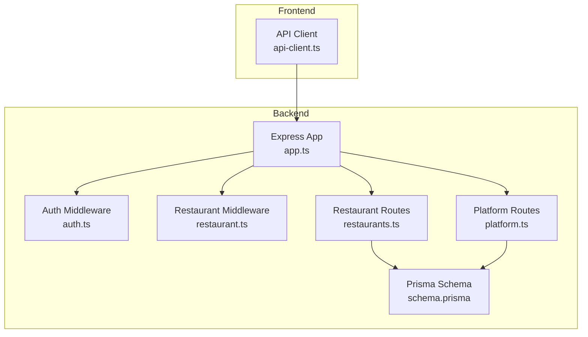
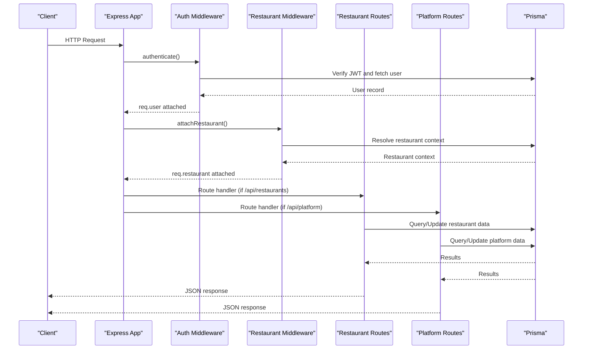
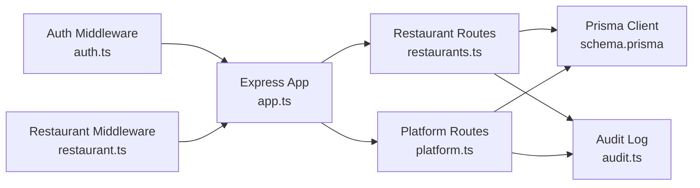
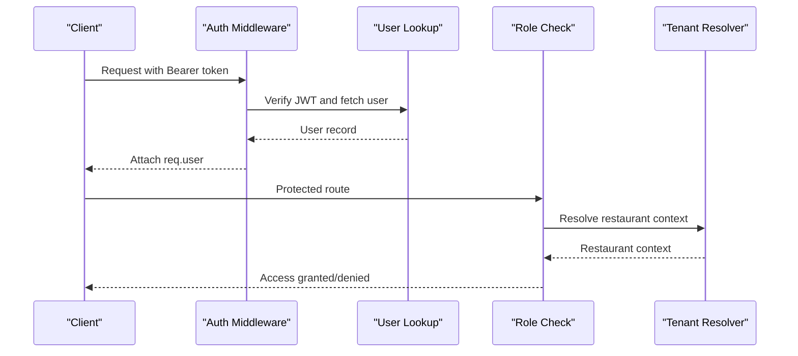
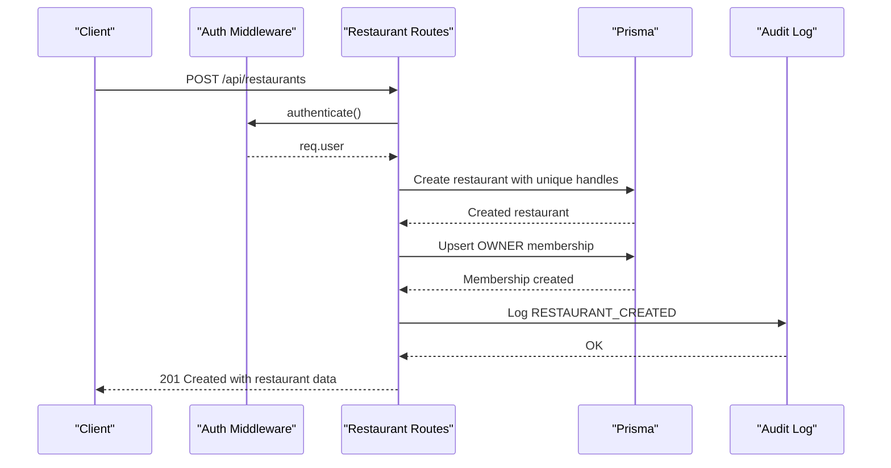
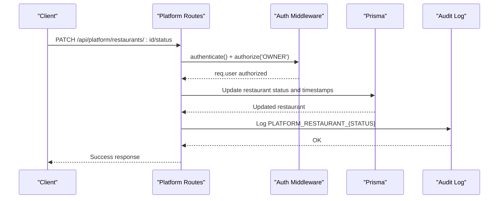

# Restaurant Administration Endpoints

<cite>
**Referenced Files in This Document**
- [restaurants.ts](file://restaurant-backend/src/routes/restaurants.ts)
- [platform.ts](file://restaurant-backend/src/routes/platform.ts)
- [auth.ts](file://restaurant-backend/src/middleware/auth.ts)
- [restaurant.ts](file://restaurant-backend/src/middleware/restaurant.ts)
- [api.ts](file://restaurant-backend/src/types/api.ts)
- [schema.prisma](file://restaurant-backend/prisma/schema.prisma)
- [app.ts](file://restaurant-backend/src/app.ts)
- [api-client.ts](file://restaurant-frontend/src/lib/api-client.ts)
- [DeQ-Restaurants-API.postman_collection.json](file://restaurant-backend/postman/DeQ-Restaurants-API.postman_collection.json)
- [audit.ts](file://restaurant-backend/src/utils/audit.ts)
</cite>

## Table of Contents
1. [Introduction](#introduction)
2. [Project Structure](#project-structure)
3. [Core Components](#core-components)
4. [Architecture Overview](#architecture-overview)
5. [Detailed Component Analysis](#detailed-component-analysis)
6. [Dependency Analysis](#dependency-analysis)
7. [Performance Considerations](#performance-considerations)
8. [Troubleshooting Guide](#troubleshooting-guide)
9. [Conclusion](#conclusion)
10. [Appendices](#appendices)

## Introduction
This document provides comprehensive API documentation for DeQ-Bite's restaurant administration endpoints. It covers restaurant onboarding, listing and search, detailed profiles, profile updates, deactivation, and platform-level administrative functions including analytics dashboards and user management. The documentation includes request/response schemas, authentication and authorization requirements, and practical examples of workflows.

## Project Structure
The API is organized around route modules under the backend service, with shared middleware for authentication, authorization, and tenant context resolution. The frontend client encapsulates API interactions and provides typed interfaces for responses.

**Diagram sources**
- [app.ts:107-124](file://restaurant-backend/src/app.ts#L107-L124)
- [auth.ts:7-75](file://restaurant-backend/src/middleware/auth.ts#L7-L75)
- [restaurant.ts:76-200](file://restaurant-backend/src/middleware/restaurant.ts#L76-L200)
- [restaurants.ts:10](file://restaurant-backend/src/routes/restaurants.ts#L10)
- [platform.ts:8](file://restaurant-backend/src/routes/platform.ts#L8)
- [schema.prisma:27-73](file://restaurant-backend/prisma/schema.prisma#L27-L73)

**Section sources**
- [app.ts:107-124](file://restaurant-backend/src/app.ts#L107-L124)

## Core Components
- Restaurant Routes: Handles onboarding, search, public profiles, current/mine listings, payment policy management, and user management for restaurants.
- Platform Routes: Provides administrative endpoints for restaurant status, commission rates, details, order listing, and earnings analytics.
- Authentication & Authorization: JWT-based authentication with role-based access control and restaurant context injection.
- Data Model: Prisma schema defines restaurant entity and related fields such as status, payment policies, and verification attributes.

**Section sources**
- [restaurants.ts:71-375](file://restaurant-backend/src/routes/restaurants.ts#L71-L375)
- [platform.ts:33-203](file://restaurant-backend/src/routes/platform.ts#L33-L203)
- [auth.ts:7-89](file://restaurant-backend/src/middleware/auth.ts#L7-L89)
- [restaurant.ts:202-245](file://restaurant-backend/src/middleware/restaurant.ts#L202-L245)
- [schema.prisma:27-73](file://restaurant-backend/prisma/schema.prisma#L27-L73)

## Architecture Overview
The backend exposes REST endpoints under /api with tenant-aware routing. Authentication middleware validates JWTs and attaches user context. Restaurant middleware resolves tenant context via headers or subdomain/host. Platform routes are protected by central admin authorization.

**Diagram sources**
- [app.ts:107-124](file://restaurant-backend/src/app.ts#L107-L124)
- [auth.ts:7-75](file://restaurant-backend/src/middleware/auth.ts#L7-L75)
- [restaurant.ts:76-200](file://restaurant-backend/src/middleware/restaurant.ts#L76-L200)
- [restaurants.ts:307-375](file://restaurant-backend/src/routes/restaurants.ts#L307-L375)
- [platform.ts:33-151](file://restaurant-backend/src/routes/platform.ts#L33-L151)

## Detailed Component Analysis

### Restaurant Onboarding: POST /api/restaurants
Purpose: Create a new restaurant under the authenticated user's ownership.

- Authentication: Required (Bearer token).
- Authorization: Any authenticated user can create a restaurant.
- Request Body Schema:
  - name: string (required, 2-120 chars)
  - email: string (optional, valid email)
  - phone: string (optional)
  - address: string (optional)
  - city: string (optional)
  - state: string (optional)
  - country: string (optional)
  - cuisineTypes: array of strings (optional, up to 10 items)
- Response: Restaurant object with id, name, slug, subdomain, contact info, payment policy defaults, timestamps, and optional status if schema supports it.
- Behavior:
  - Generates unique slug/subdomain from name.
  - Sets active=true and status APPROVED if schema supports it.
  - Creates initial OWNER membership for the requesting user.
  - Logs audit event.

Example request (Postman):
- Method: POST
- URL: {{baseUrl}}/api/restaurants
- Headers: Authorization: Bearer {{token}}, Content-Type: application/json
- Body: {"name":"Demo Restaurant","email":"restaurant@example.com","phone":"9999999999","address":"Sample Address"}

Example response:
{
  "success": true,
  "data": {
    "restaurant": {
      "id": "r-uuid",
      "name": "Demo Restaurant",
      "slug": "demo-restaurant",
      "subdomain": "demo-restaurant",
      "email": "restaurant@example.com",
      "phone": "9999999999",
      "address": "Sample Address",
      "city": null,
      "state": null,
      "country": null,
      "cuisineTypes": [],
      "paymentCollectionTiming": "AFTER_MEAL",
      "cashPaymentEnabled": true,
      "active": true,
      "createdAt": "2025-01-01T00:00:00Z",
      "updatedAt": "2025-01-01T00:00:00Z",
      "status": "APPROVED"
    }
  },
  "message": "Restaurant onboarded successfully"
}

**Section sources**
- [restaurants.ts:307-375](file://restaurant-backend/src/routes/restaurants.ts#L307-L375)
- [schema.prisma:27-73](file://restaurant-backend/prisma/schema.prisma#L27-L73)
- [audit.ts:5-16](file://restaurant-backend/src/utils/audit.ts#L5-L16)

### Restaurant Search and Listing: GET /api/restaurants/public/search
Purpose: Public search for restaurants with filters.

- Query Parameters:
  - query: string (search term)
  - cuisine: string (cuisine type)
  - location: string (city/state/address match)
- Response: Array of restaurant summaries with id, name, slug, subdomain, address, city, state, cuisineTypes, and payment policy fields.
- Filters:
  - active=true
  - status=APPROVED (if schema supports status)
  - name contains query (case-insensitive)
  - cuisineTypes has cuisine
  - city/state/address contains location (case-insensitive)

Example request (Postman):
- Method: GET
- URL: {{baseUrl}}/api/restaurants/public/search?query=burger&cuisine=Indian&location=Mumbai

Example response:
{
  "success": true,
  "data": {
    "restaurants": [
      {
        "id": "r-uuid",
        "name": "Burger Junction",
        "slug": "burger-junction",
        "subdomain": "burger-junction",
        "address": "123 Mall Road",
        "city": "Mumbai",
        "state": "MH",
        "cuisineTypes": ["Indian", "Fast Food"],
        "paymentCollectionTiming": "AFTER_MEAL",
        "cashPaymentEnabled": true
      }
    ]
  }
}

**Section sources**
- [restaurants.ts:92-164](file://restaurant-backend/src/routes/restaurants.ts#L92-L164)

### Public Restaurant Profile: GET /api/restaurants/public/:identifier
Purpose: Retrieve a single restaurant's public profile.

- Path Parameter: identifier (id, slug, or subdomain)
- Response: Restaurant object with contact info, location, cuisineTypes, and nested categories and recent menu items.
- Filters:
  - active=true
  - status=APPROVED (if schema supports status)
- Nested selections:
  - categories: active, ordered by sortOrder
  - menuItems: available=true, newest 12 items

Example request (Postman):
- Method: GET
- URL: {{baseUrl}}/api/restaurants/public/demo-restaurant

Example response:
{
  "success": true,
  "data": {
    "restaurant": {
      "id": "r-uuid",
      "name": "Demo Restaurant",
      "slug": "demo-restaurant",
      "subdomain": "demo-restaurant",
      "address": "Sample Address",
      "city": "City",
      "state": "State",
      "country": "Country",
      "email": "contact@demo.com",
      "phone": "9999999999",
      "cuisineTypes": ["North Indian"],
      "paymentCollectionTiming": "AFTER_MEAL",
      "cashPaymentEnabled": true,
      "categories": [
        {"id": "cat-uuid", "name": "Starters"}
      ],
      "menuItems": [
        {
          "id": "item-uuid",
          "name": "Paneer Tikka",
          "description": "Grilled paneer",
          "pricePaise": 34900,
          "isVeg": true,
          "category": {"id": "cat-uuid", "name": "Starters"}
        }
      ]
    }
  }
}

**Section sources**
- [restaurants.ts:166-250](file://restaurant-backend/src/routes/restaurants.ts#L166-L250)

### Current Restaurant Context: GET /api/restaurants/current
Purpose: Get the restaurant context for the authenticated user.

- Authentication: Required (Bearer token).
- Tenant Context: Requires x-restaurant-slug or x-restaurant-subdomain header or subdomain-based routing.
- Response: Current restaurant object (id, slug, subdomain, name, payment policy).

Example request (Postman):
- Method: GET
- URL: {{baseUrl}}/api/restaurants/current
- Headers: Authorization: Bearer {{token}}, x-restaurant-subdomain: demo

Example response:
{
  "success": true,
  "data": {
    "restaurant": {
      "id": "r-uuid",
      "slug": "demo-restaurant",
      "subdomain": "demo-restaurant",
      "name": "Demo Restaurant",
      "paymentCollectionTiming": "AFTER_MEAL",
      "cashPaymentEnabled": true
    }
  }
}

**Section sources**
- [restaurants.ts:252-260](file://restaurant-backend/src/routes/restaurants.ts#L252-L260)
- [restaurant.ts:76-200](file://restaurant-backend/src/middleware/restaurant.ts#L76-L200)

### My Restaurants: GET /api/restaurants/mine
Purpose: List restaurants the authenticated user belongs to.

- Authentication: Required (Bearer token).
- Response: Array of restaurant memberships with role, status, and payment policy fields.

Example request (Postman):
- Method: GET
- URL: {{baseUrl}}/api/restaurants/mine
- Headers: Authorization: Bearer {{token}}

Example response:
{
  "success": true,
  "data": {
    "restaurants": [
      {
        "id": "r-uuid",
        "name": "Demo Restaurant",
        "slug": "demo-restaurant",
        "subdomain": "demo-restaurant",
        "status": "APPROVED",
        "role": "OWNER",
        "paymentCollectionTiming": "AFTER_MEAL",
        "cashPaymentEnabled": true
      }
    ]
  }
}

**Section sources**
- [restaurants.ts:262-305](file://restaurant-backend/src/routes/restaurants.ts#L262-L305)

### Payment Policy Management
Endpoints:
- GET /api/restaurants/settings/payment-policy
- PUT /api/restaurants/settings/payment-policy

- Authentication: Required (Bearer token).
- Tenant Context: Requires restaurant context.
- Authorization: OWNER or ADMIN.
- Request Body (PUT):
  - paymentCollectionTiming: BEFORE_MEAL or AFTER_MEAL
  - cashPaymentEnabled: boolean
- Response: Payment policy object with timing and cash flag.

Example request (Postman):
- Method: PUT
- URL: {{baseUrl}}/api/restaurants/settings/payment-policy
- Headers: Authorization: Bearer {{token}}, x-restaurant-subdomain: demo
- Body: {"paymentCollectionTiming":"BEFORE_MEAL","cashPaymentEnabled":true}

Example response:
{
  "success": true,
  "data": {
    "paymentPolicy": {
      "id": "r-uuid",
      "name": "Demo Restaurant",
      "paymentCollectionTiming": "BEFORE_MEAL",
      "cashPaymentEnabled": true
    }
  },
  "message": "Payment policy updated"
}

**Section sources**
- [restaurants.ts:377-429](file://restaurant-backend/src/routes/restaurants.ts#L377-L429)
- [restaurant.ts:213-245](file://restaurant-backend/src/middleware/restaurant.ts#L213-L245)

### Restaurant User Management
Endpoints:
- GET /api/restaurants/users
- POST /api/restaurants/users

- Authentication: Required (Bearer token).
- Tenant Context: Requires restaurant context.
- Authorization: OWNER or ADMIN.
- GET Response: Array of active restaurant users with roles and registration details.
- POST Request Body:
  - email: string (valid email)
  - role: OWNER, ADMIN, or STAFF
- POST Response: Membership object with role and user details.

Example request (Postman):
- Method: POST
- URL: {{baseUrl}}/api/restaurants/users
- Headers: Authorization: Bearer {{token}}, x-restaurant-subdomain: demo
- Body: {"email":"staff@example.com","role":"STAFF"}

Example response:
{
  "success": true,
  "data": {
    "membership": {
      "membershipId": "rm-uuid",
      "role": "STAFF",
      "active": true,
      "user": {
        "id": "u-uuid",
        "name": "Staff Member",
        "email": "staff@example.com",
        "phone": null
      }
    }
  },
  "message": "Restaurant user added/updated successfully"
}

**Section sources**
- [restaurants.ts:431-551](file://restaurant-backend/src/routes/restaurants.ts#L431-L551)

### Platform-Level Administrative Endpoints

#### Restaurant Status Management: PATCH /api/platform/restaurants/:id/status
- Authentication: Required (Bearer token).
- Authorization: OWNER (central admin).
- Request Body:
  - status: APPROVED or SUSPENDED
  - suspendedReason: optional string (max 500)
- Behavior: Updates status, active flag, approval timestamps, and logs audit event.

Example request (Postman):
- Method: PATCH
- URL: {{baseUrl}}/api/platform/restaurants/{{restaurantId}}/status
- Headers: Authorization: Bearer {{token}}
- Body: {"status":"APPROVED"}

Example response:
{
  "success": true,
  "data": {
    "restaurant": {
      "id": "r-uuid",
      "name": "Demo Restaurant",
      "status": "APPROVED",
      "active": true,
      "suspendedReason": null,
      "approvedAt": "2025-01-01T00:00:00Z",
      "approvedByUserId": "u-uuid"
    }
  },
  "message": "Restaurant approved successfully"
}

**Section sources**
- [platform.ts:71-114](file://restaurant-backend/src/routes/platform.ts#L71-L114)

#### Commission Rate Update: PATCH /api/platform/restaurants/:id/commission
- Authentication: Required (Bearer token).
- Authorization: OWNER (central admin).
- Request Body:
  - commissionRate: number (0-100)
- Response: Updated restaurant with commissionRate.

Example request (Postman):
- Method: PATCH
- URL: {{baseUrl}}/api/platform/restaurants/{{restaurantId}}/commission
- Headers: Authorization: Bearer {{token}}
- Body: {"commissionRate":15}

Example response:
{
  "success": true,
  "data": {
    "restaurant": {
      "id": "r-uuid",
      "name": "Demo Restaurant",
      "commissionRate": 15
    }
  },
  "message": "Commission updated successfully"
}

**Section sources**
- [platform.ts:116-151](file://restaurant-backend/src/routes/platform.ts#L116-L151)

#### Restaurant Details Update: PATCH /api/platform/restaurants/:id/details
- Authentication: Required (Bearer token).
- Authorization: OWNER (central admin).
- Request Body (partial):
  - gstNumber: string (max 40)
  - bankAccountName: string (max 120)
  - bankAccountNumber: string (max 40)
  - bankIfsc: string (max 20)
  - address: string (max 250)
  - city: string (max 80)
  - state: string (max 80)
  - country: string (max 80)
- Response: Updated restaurant details.

Example request (Postman):
- Method: PATCH
- URL: {{baseUrl}}/api/platform/restaurants/{{restaurantId}}/details
- Headers: Authorization: Bearer {{token}}
- Body: {"gstNumber":"GST123","bankAccountName":"Demo Bank"}

Example response:
{
  "success": true,
  "data": {
    "restaurant": {
      "id": "r-uuid",
      "name": "Demo Restaurant",
      "gstNumber": "GST123",
      "bankAccountName": "Demo Bank",
      "bankAccountNumber": null,
      "bankIfsc": null,
      "address": null,
      "city": null,
      "state": null,
      "country": null
    }
  },
  "message": "Restaurant details updated"
}

**Section sources**
- [platform.ts:153-203](file://restaurant-backend/src/routes/platform.ts#L153-L203)

#### Orders Listing: GET /api/platform/orders
- Authentication: Required (Bearer token).
- Authorization: OWNER (central admin).
- Query Parameter:
  - restaurantId: optional filter by restaurant
- Response: Array of orders with restaurant and user details.

Example request (Postman):
- Method: GET
- URL: {{baseUrl}}/api/platform/orders?restaurantId={{restaurantId}}
- Headers: Authorization: Bearer {{token}}

Example response:
{
  "success": true,
  "data": {
    "orders": [
      {
        "id": "o-uuid",
        "createdAt": "2025-01-01T00:00:00Z",
        "status": "CONFIRMED",
        "paymentStatus": "COMPLETED",
        "totalPaise": 150000,
        "paidAmountPaise": 150000,
        "dueAmountPaise": 0,
        "restaurant": {"id": "r-uuid", "name": "Demo Restaurant"},
        "user": {"id": "u-uuid", "name": "Customer", "email": "cust@example.com"}
      }
    ]
  }
}

**Section sources**
- [platform.ts:205-242](file://restaurant-backend/src/routes/platform.ts#L205-L242)

#### Earnings Analytics: GET /api/platform/earnings
- Authentication: Required (Bearer token).
- Authorization: OWNER (central admin).
- Response: Totals and breakdown by restaurant including counts and aggregated amounts.

Example request (Postman):
- Method: GET
- URL: {{baseUrl}}/api/platform/earnings
- Headers: Authorization: Bearer {{token}}

Example response:
{
  "success": true,
  "data": {
    "totals": {
      "grossAmountPaise": 1000000,
      "platformCommissionPaise": 100000,
      "restaurantEarningPaise": 900000,
      "pendingRestaurantSettlementPaise": 0
    },
    "byRestaurant": [
      {
        "restaurantId": "r-uuid",
        "restaurantName": "Demo Restaurant",
        "orderCount": 10,
        "grossAmountPaise": 1000000,
        "platformCommissionPaise": 100000,
        "restaurantEarningPaise": 900000
      }
    ]
  }
}

**Section sources**
- [platform.ts:244-308](file://restaurant-backend/src/routes/platform.ts#L244-L308)

## Dependency Analysis
Key dependencies and relationships:
- Authentication: JWT verification and user lookup.
- Tenant Resolution: Restaurant context derived from headers or subdomain.
- Authorization: Role checks per route (OWNER/ADMIN/STAFF).
- Data Access: Prisma client queries with dynamic select clauses to handle schema evolution.
- Audit Logging: Centralized safe logging with migration-safe handling.

**Diagram sources**
- [auth.ts:7-75](file://restaurant-backend/src/middleware/auth.ts#L7-L75)
- [restaurant.ts:76-200](file://restaurant-backend/src/middleware/restaurant.ts#L76-L200)
- [restaurants.ts:10](file://restaurant-backend/src/routes/restaurants.ts#L10)
- [platform.ts:8](file://restaurant-backend/src/routes/platform.ts#L8)
- [schema.prisma:27-73](file://restaurant-backend/prisma/schema.prisma#L27-L73)
- [audit.ts:5-16](file://restaurant-backend/src/utils/audit.ts#L5-L16)

**Section sources**
- [auth.ts:7-89](file://restaurant-backend/src/middleware/auth.ts#L7-L89)
- [restaurant.ts:202-245](file://restaurant-backend/src/middleware/restaurant.ts#L202-L245)
- [restaurants.ts:16-40](file://restaurant-backend/src/routes/restaurants.ts#L16-L40)
- [platform.ts:30-31](file://restaurant-backend/src/routes/platform.ts#L30-L31)

## Performance Considerations
- Selective Field Retrieval: Dynamic select clauses minimize payload sizes and reduce database load.
- Pagination and Limits: Search returns up to 50 results; order listing capped at 500.
- Schema Evolution Safety: Runtime detection of schema fields prevents crashes during deployment transitions.
- Rate Limiting: Global rate limiter protects against abuse.
- Caching: Consider caching public restaurant profiles for frequently accessed identifiers.

[No sources needed since this section provides general guidance]

## Troubleshooting Guide
Common issues and resolutions:
- 401 Unauthorized: Missing or invalid Bearer token. Ensure Authorization header is set.
- 403 Forbidden: Insufficient permissions (role or restaurant membership). Verify user role and restaurant context.
- 404 Not Found: Restaurant not found by identifier or user not found for adding membership.
- Schema Mismatch: If status field is missing, endpoints gracefully retry without it and log warnings.
- Audit Log Table Missing: Safe logging ignores missing audit table to avoid breaking flows.

**Section sources**
- [auth.ts:67-74](file://restaurant-backend/src/middleware/auth.ts#L67-L74)
- [restaurant.ts:141-183](file://restaurant-backend/src/middleware/restaurant.ts#L141-L183)
- [audit.ts:9-15](file://restaurant-backend/src/utils/audit.ts#L9-L15)

## Conclusion
The restaurant administration API provides a robust foundation for onboarding, management, and oversight of restaurant operations. With strong authentication, tenant-aware routing, and comprehensive platform-level controls, it supports both restaurant operators and central administrators. The documented endpoints, schemas, and examples enable consistent integration and reliable operation.

[No sources needed since this section summarizes without analyzing specific files]

## Appendices

### API Schemas

#### Restaurant Object
- id: string
- name: string
- slug: string
- subdomain: string
- email: string?
- phone: string?
- address: string?
- city: string?
- state: string?
- country: string?
- cuisineTypes: string[]
- paymentCollectionTiming: BEFORE_MEAL | AFTER_MEAL
- cashPaymentEnabled: boolean
- active: boolean
- status: PENDING_APPROVAL | APPROVED | SUSPENDED?
- approvedAt: datetime?
- approvedByUserId: string?
- createdAt: datetime
- updatedAt: datetime

**Section sources**
- [schema.prisma:27-73](file://restaurant-backend/prisma/schema.prisma#L27-L73)
- [restaurants.ts:307-375](file://restaurant-backend/src/routes/restaurants.ts#L307-L375)

### Authentication and Authorization Flow

**Diagram sources**
- [auth.ts:7-75](file://restaurant-backend/src/middleware/auth.ts#L7-L75)
- [restaurant.ts:76-200](file://restaurant-backend/src/middleware/restaurant.ts#L76-L200)

### Example Workflows

#### Restaurant Onboarding Workflow

**Diagram sources**
- [restaurants.ts:307-375](file://restaurant-backend/src/routes/restaurants.ts#L307-L375)
- [audit.ts:5-16](file://restaurant-backend/src/utils/audit.ts#L5-L16)

#### Platform Restaurant Status Update

**Diagram sources**
- [platform.ts:71-114](file://restaurant-backend/src/routes/platform.ts#L71-L114)
- [audit.ts:5-16](file://restaurant-backend/src/utils/audit.ts#L5-L16)