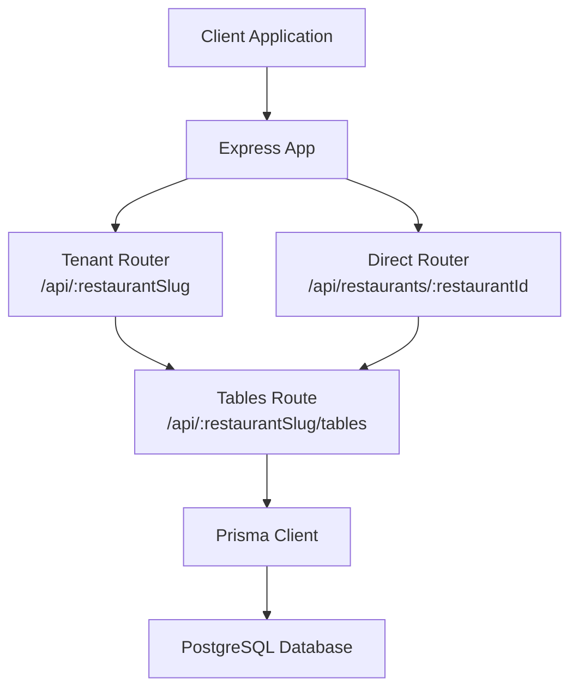
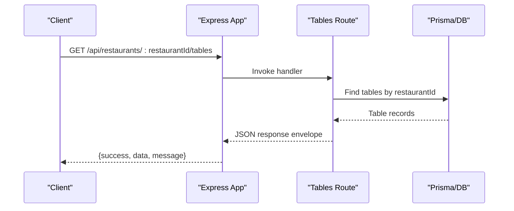
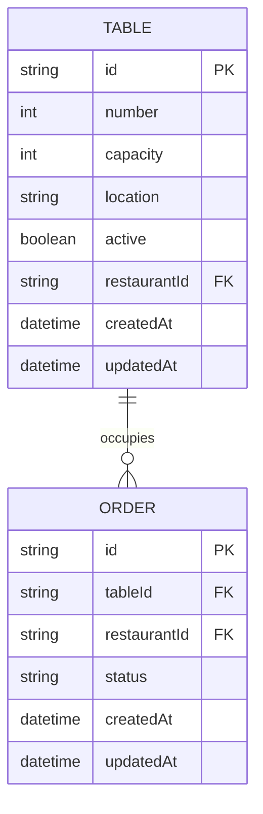
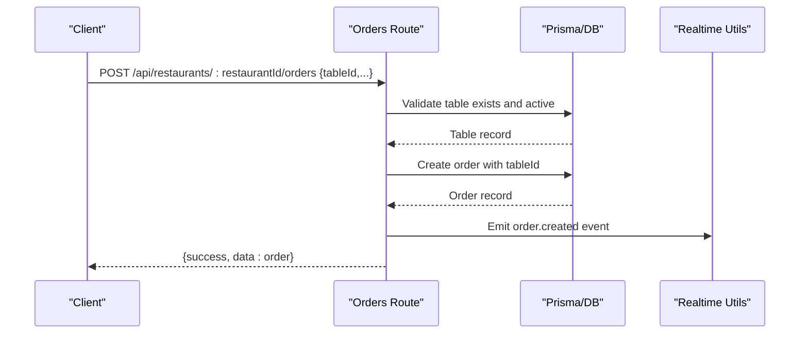
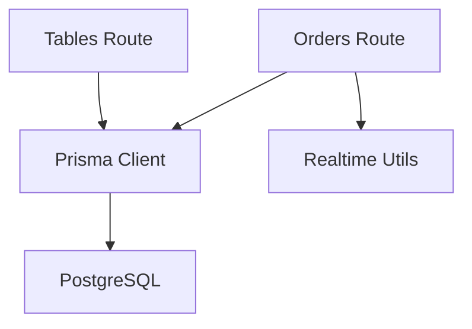

# Table Management Endpoints

<cite>
**Referenced Files in This Document**
- [tables.ts](file://restaurant-backend/src/routes/tables.ts)
- [schema.prisma](file://restaurant-backend/prisma/schema.prisma)
- [api.ts](file://restaurant-backend/src/types/api.ts)
- [orders.ts](file://restaurant-backend/src/routes/orders.ts)
- [realtime.ts](file://restaurant-backend/src/utils/realtime.ts)
- [app.ts](file://restaurant-backend/src/app.ts)
- [seed.ts](file://restaurant-backend/prisma/seed.ts)
- [DeQ-Restaurants-API.postman_collection.json](file://restaurant-backend/postman/DeQ-Restaurants-API.postman_collection.json)
</cite>

## Table of Contents
1. [Introduction](#introduction)
2. [Project Structure](#project-structure)
3. [Core Components](#core-components)
4. [Architecture Overview](#architecture-overview)
5. [Detailed Component Analysis](#detailed-component-analysis)
6. [Dependency Analysis](#dependency-analysis)
7. [Performance Considerations](#performance-considerations)
8. [Troubleshooting Guide](#troubleshooting-guide)
9. [Conclusion](#conclusion)

## Introduction
This document provides comprehensive API documentation for DeQ-Bite's table management endpoints. It covers the available table listing, filtering, retrieval by ID, and the integration of tables with the order management system. It also explains how table assignments occur during order placement, how occupancy is tracked, and how real-time events propagate changes. The documentation includes response schemas, request examples, and operational guidance for managing table availability and utilization.

## Project Structure
The table management functionality is implemented as part of the restaurant tenant API. Routes are mounted under `/api/restaurants/:restaurantId/tables` and include:
- GET /api/restaurants/:restaurantId/tables (all tables for a restaurant)
- GET /api/restaurants/:restaurantId/tables/available (active tables only)
- GET /api/restaurants/:restaurantId/tables/:id (single table by ID)

These endpoints are protected by the restaurant context middleware and return standardized API responses.

**Diagram sources**
- [app.ts:111-134](file://restaurant-backend/src/app.ts#L111-L134)
- [tables.ts:1-92](file://restaurant-backend/src/routes/tables.ts#L1-L92)

**Section sources**
- [app.ts:111-134](file://restaurant-backend/src/app.ts#L111-L134)
- [tables.ts:1-92](file://restaurant-backend/src/routes/tables.ts#L1-L92)

## Core Components
- Table model: Defines table attributes including number, capacity, location, activity status, and restaurant association.
- Tables route: Implements listing, filtering, and retrieval of tables with restaurant-scoped access control.
- Order integration: During order creation, a table is assigned to the order, establishing the occupancy relationship.
- Real-time notifications: Events are emitted when orders are created or updated, enabling live updates to clients.

Key data structures and relationships:
- Table entity: Includes identifiers, capacity, location, and active flag.
- Order entity: References a table via tableId, linking orders to specific tables for occupancy tracking.
- API response envelope: Standardized success/error/message fields for consistent client consumption.

**Section sources**
- [schema.prisma:148-160](file://restaurant-backend/prisma/schema.prisma#L148-L160)
- [tables.ts:8-89](file://restaurant-backend/src/routes/tables.ts#L8-L89)
- [orders.ts:82-267](file://restaurant-backend/src/routes/orders.ts#L82-L267)
- [api.ts:79-87](file://restaurant-backend/src/types/api.ts#L79-L87)

## Architecture Overview
The table management API sits within the tenant-based routing system. Requests pass through middleware to attach restaurant context, then reach the tables route handlers. Responses are returned in a consistent envelope. Orders reference tables, enabling occupancy tracking and real-time updates.

**Diagram sources**
- [app.ts:131](file://restaurant-backend/src/app.ts#L131)
- [tables.ts:9-26](file://restaurant-backend/src/routes/tables.ts#L9-L26)

## Detailed Component Analysis

### Table Model Schema
The table entity stores:
- Identifier and restaurant association
- Table number (unique per restaurant)
- Capacity and optional location
- Active flag for availability
- Timestamps for creation/update

**Diagram sources**
- [schema.prisma:148-160](file://restaurant-backend/prisma/schema.prisma#L148-L160)
- [schema.prisma:162-193](file://restaurant-backend/prisma/schema.prisma#L162-L193)

**Section sources**
- [schema.prisma:148-160](file://restaurant-backend/prisma/schema.prisma#L148-L160)

### Endpoint: GET /api/restaurants/:restaurantId/tables
Purpose: Retrieve all tables for the authenticated restaurant.

Behavior:
- Requires restaurant context via middleware
- Filters tables by restaurantId
- Returns a standardized response envelope

Response envelope:
- success: boolean
- data: array of table objects
- message: string

Table object fields:
- id: string
- number: number
- capacity: number
- location: string | null
- isAvailable: boolean (derived from active flag)
- createdAt: datetime
- updatedAt: datetime

Notes:
- The response schema includes an isAvailable field, which is derived from the active flag in the backend implementation.

**Section sources**
- [tables.ts:9-26](file://restaurant-backend/src/routes/tables.ts#L9-L26)
- [api.ts:79-87](file://restaurant-backend/src/types/api.ts#L79-L87)

### Endpoint: GET /api/restaurants/:restaurantId/tables/available
Purpose: Retrieve only active tables for the restaurant.

Behavior:
- Filters by active=true and restaurantId
- Returns the same standardized envelope

Response envelope:
- success: boolean
- data: array of table objects
- message: string

**Section sources**
- [tables.ts:29-49](file://restaurant-backend/src/routes/tables.ts#L29-L49)

### Endpoint: GET /api/restaurants/:restaurantId/tables/:id
Purpose: Retrieve a single table by ID scoped to the restaurant.

Behavior:
- Validates presence of table ID
- Ensures table belongs to the current restaurant
- Returns 404 if not found

Response envelope:
- success: boolean
- data: single table object
- message: string

Error responses:
- 400: Missing table ID
- 404: Table not found

**Section sources**
- [tables.ts:52-89](file://restaurant-backend/src/routes/tables.ts#L52-L89)

### Order Placement and Table Assignment
During order creation, the system assigns a table to the order. The flow ensures:
- The provided tableId exists and belongs to the restaurant
- The table is active
- The order is created with the tableId linked

**Diagram sources**
- [orders.ts:82-267](file://restaurant-backend/src/routes/orders.ts#L82-L267)
- [realtime.ts:12-22](file://restaurant-backend/src/utils/realtime.ts#L12-L22)

**Section sources**
- [orders.ts:82-267](file://restaurant-backend/src/routes/orders.ts#L82-L267)

### Occupancy Tracking and Real-Time Updates
Occupancy is implicitly tracked through the order-to-table relationship:
- An order referencing a table indicates that table is occupied
- When orders are created or updated, real-time events are emitted to notify clients

Real-time event emission:
- Type: "order.created" or "order.updated"
- Payload includes order details, enabling clients to refresh table occupancy status

**Section sources**
- [orders.ts:245-257](file://restaurant-backend/src/routes/orders.ts#L245-L257)
- [orders.ts:381-384](file://restaurant-backend/src/routes/orders.ts#L381-L384)
- [realtime.ts:12-22](file://restaurant-backend/src/utils/realtime.ts#L12-L22)

### Table Utilization Analytics
While the provided code does not include dedicated analytics endpoints, occupancy analytics can be derived from:
- Order history per table
- Time-series of order statuses
- Integration with reporting dashboards

Operational guidance:
- Use order queries filtered by tableId to compute utilization metrics
- Track status transitions to understand peak hours and turnover rates

[No sources needed since this section provides general guidance]

## Dependency Analysis
The tables route depends on:
- Prisma client for database operations
- Restaurant context middleware for tenant scoping
- Standardized API response envelope

Order management integrates with tables via:
- tableId foreign key
- Real-time event propagation

**Diagram sources**
- [tables.ts:1-6](file://restaurant-backend/src/routes/tables.ts#L1-L6)
- [orders.ts:1-8](file://restaurant-backend/src/routes/orders.ts#L1-L8)
- [realtime.ts:1-7](file://restaurant-backend/src/utils/realtime.ts#L1-L7)

**Section sources**
- [tables.ts:1-6](file://restaurant-backend/src/routes/tables.ts#L1-L6)
- [orders.ts:1-8](file://restaurant-backend/src/routes/orders.ts#L1-L8)
- [realtime.ts:1-7](file://restaurant-backend/src/utils/realtime.ts#L1-L7)

## Performance Considerations
- Indexes: The Prisma schema defines a unique composite index on (restaurantId, number) for tables, ensuring efficient lookups and preventing duplicates.
- Filtering: Queries filter by restaurantId to maintain tenant isolation and reduce result sets.
- Pagination: For large datasets, consider adding pagination parameters to listing endpoints.

**Section sources**
- [schema.prisma:158](file://restaurant-backend/prisma/schema.prisma#L158)

## Troubleshooting Guide
Common issues and resolutions:
- Missing restaurant context: Ensure the request includes proper authentication and restaurant headers/slug.
- Invalid table ID: Verify the tableId exists and belongs to the current restaurant.
- Table not active: Only active tables are returned by the available endpoint; activate tables via administrative controls.
- Database/client schema mismatch: The restaurant middleware handles fallback queries when schema fields are missing.

Operational checks:
- Confirm tenant routing is correct (/api/restaurants/:restaurantId/tables)
- Validate request headers for restaurant identification
- Review logs for Prisma query errors or middleware failures

**Section sources**
- [app.ts:131](file://restaurant-backend/src/app.ts#L131)
- [tables.ts:52-89](file://restaurant-backend/src/routes/tables.ts#L52-L89)
- [restaurant.ts:142-183](file://restaurant-backend/src/middleware/restaurant.ts#L142-L183)

## Conclusion
DeQ-Bite's table management endpoints provide restaurant-scoped table listing, filtering, and retrieval. Integration with the order management system enables robust occupancy tracking and real-time updates. While dedicated table CRUD endpoints (POST, PUT, DELETE) are not present in the current implementation, the existing schema and relationships support building such features. The provided analytics guidance helps operators derive occupancy insights from order data.