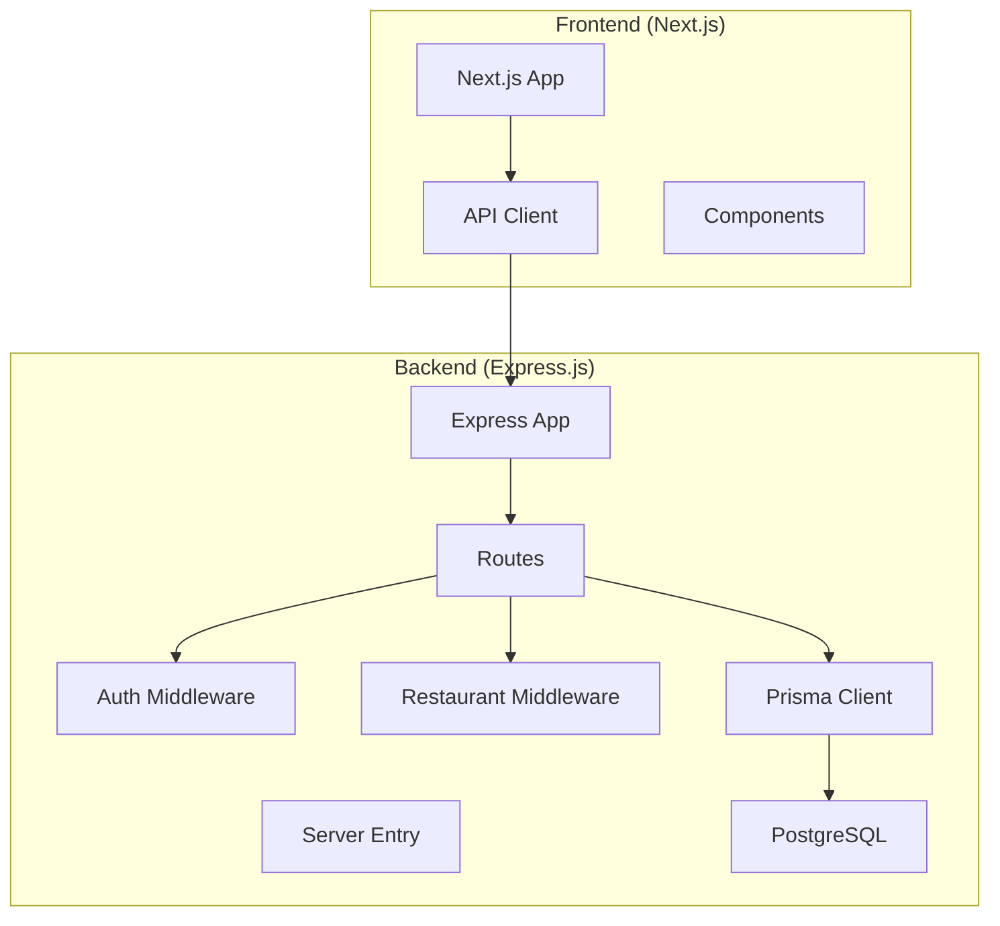
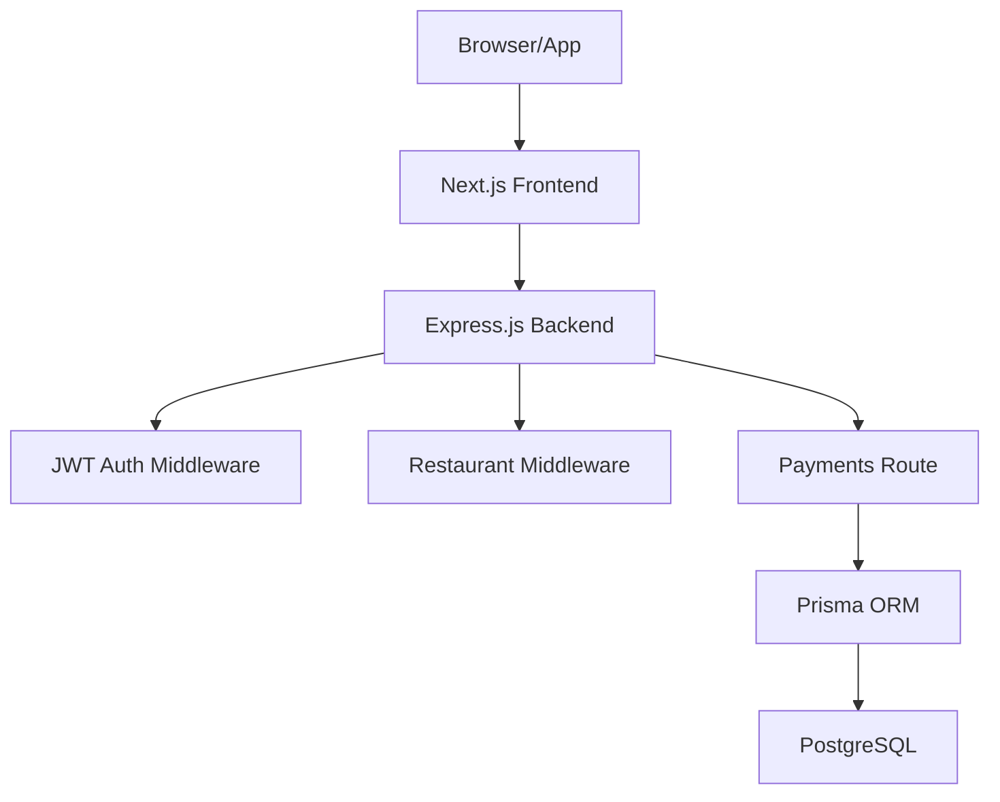
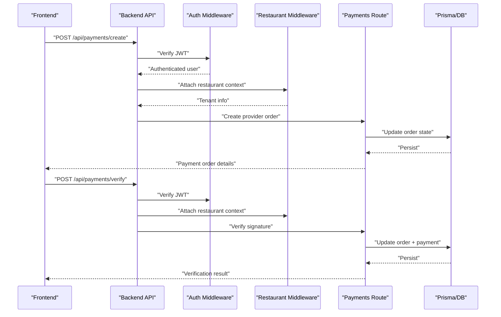
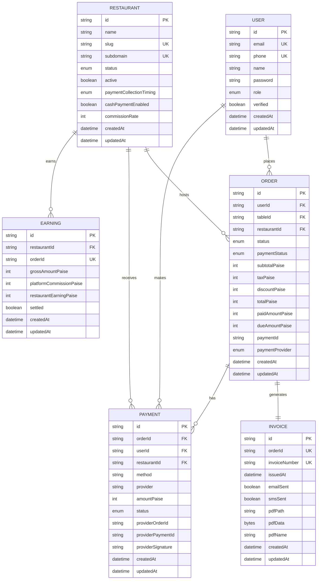
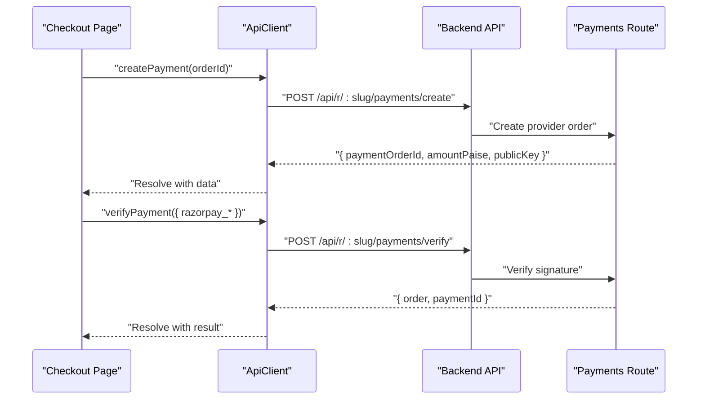
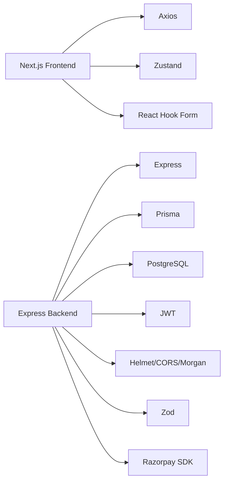

# Architecture Overview

<cite>
**Referenced Files in This Document**
- [restaurant-backend/package.json](file://restaurant-backend/package.json)
- [restaurant-frontend/package.json](file://restaurant-frontend/package.json)
- [restaurant-backend/src/server.ts](file://restaurant-backend/src/server.ts)
- [restaurant-backend/src/app.ts](file://restaurant-backend/src/app.ts)
- [restaurant-backend/src/config/database.ts](file://restaurant-backend/src/config/database.ts)
- [restaurant-backend/prisma/schema.prisma](file://restaurant-backend/prisma/schema.prisma)
- [restaurant-backend/src/middleware/auth.ts](file://restaurant-backend/src/middleware/auth.ts)
- [restaurant-backend/src/middleware/errorHandler.ts](file://restaurant-backend/src/middleware/errorHandler.ts)
- [restaurant-backend/src/middleware/restaurant.ts](file://restaurant-backend/src/middleware/restaurant.ts)
- [restaurant-backend/src/routes/auth.ts](file://restaurant-backend/src/routes/auth.ts)
- [restaurant-backend/src/routes/payments.ts](file://restaurant-backend/src/routes/payments.ts)
- [restaurant-backend/src/types/api.ts](file://restaurant-backend/src/types/api.ts)
- [restaurant-frontend/src/lib/api-client.ts](file://restaurant-frontend/src/lib/api-client.ts)
- [restaurant-frontend/src/components/SecurePaymentProcessor.tsx](file://restaurant-frontend/src/components/SecurePaymentProcessor.tsx)
</cite>

## Table of Contents
1. [Introduction](#introduction)
2. [Project Structure](#project-structure)
3. [Core Components](#core-components)
4. [Architecture Overview](#architecture-overview)
5. [Detailed Component Analysis](#detailed-component-analysis)
6. [Dependency Analysis](#dependency-analysis)
7. [Performance Considerations](#performance-considerations)
8. [Troubleshooting Guide](#troubleshooting-guide)
9. [Conclusion](#conclusion)

## Introduction
This document describes the architectural design of DeQ-Bite’s separated system, which consists of:
- A standalone backend API server built with Express.js and TypeScript, serving a tenant-aware, multi-restaurant platform.
- A separate frontend application built with Next.js and TypeScript, consuming the backend APIs.
- A PostgreSQL-backed persistence layer powered by Prisma ORM.
- A security model centered on JWT authentication, CORS protection, and server-side payment verification to prevent tampering.

The architecture follows a layered design with clear separation of concerns:
- Presentation layer (Next.js frontend)
- Business logic layer (Express.js routes and middleware)
- Data access layer (Prisma ORM and PostgreSQL)

It is designed to be microservices-ready, enabling independent scaling of the frontend and backend components.

## Project Structure
The repository is organized into two primary directories:
- restaurant-backend: Express.js server, routes, middleware, Prisma schema, and configuration.
- restaurant-frontend: Next.js application with pages, components, stores, and API client.

**Diagram sources**
- [restaurant-backend/src/server.ts](file://restaurant-backend/src/server.ts#L1-L33)
- [restaurant-backend/src/app.ts](file://restaurant-backend/src/app.ts#L1-L148)
- [restaurant-backend/src/config/database.ts](file://restaurant-backend/src/config/database.ts#L1-L66)
- [restaurant-backend/prisma/schema.prisma](file://restaurant-backend/prisma/schema.prisma#L1-L384)
- [restaurant-frontend/src/lib/api-client.ts](file://restaurant-frontend/src/lib/api-client.ts#L1-L894)

**Section sources**
- [restaurant-backend/package.json](file://restaurant-backend/package.json#L1-L80)
- [restaurant-frontend/package.json](file://restaurant-frontend/package.json#L1-L54)

## Core Components
- Backend API server
  - Entry point initializes the server and connects to the database.
  - Express app configures middleware, CORS, rate limiting, logging, and routes.
  - Tenant-aware routing supports multi-restaurant contexts via slug/subdomain/host headers.
- Frontend application
  - Next.js app with typed API client encapsulating HTTP calls, interceptors, and tenant-aware endpoints.
  - Secure payment component integrates with the backend for payment creation and verification.
- Data layer
  - Prisma ORM models define the domain entities and relationships.
  - PostgreSQL serves as the persistent store.

**Section sources**
- [restaurant-backend/src/server.ts](file://restaurant-backend/src/server.ts#L1-L33)
- [restaurant-backend/src/app.ts](file://restaurant-backend/src/app.ts#L1-L148)
- [restaurant-backend/src/config/database.ts](file://restaurant-backend/src/config/database.ts#L1-L66)
- [restaurant-backend/prisma/schema.prisma](file://restaurant-backend/prisma/schema.prisma#L1-L384)
- [restaurant-frontend/src/lib/api-client.ts](file://restaurant-frontend/src/lib/api-client.ts#L1-L894)

## Architecture Overview
The system enforces a strict separation between frontend and backend:
- The frontend communicates exclusively via HTTPS to the backend API.
- The backend validates authentication and authorization, enforces tenant context, and performs all sensitive operations (e.g., payment verification).
- The frontend handles UI rendering and user interactions, delegating all state-changing operations to the backend.

**Diagram sources**
- [restaurant-backend/src/app.ts](file://restaurant-backend/src/app.ts#L1-L148)
- [restaurant-backend/src/middleware/auth.ts](file://restaurant-backend/src/middleware/auth.ts#L1-L137)
- [restaurant-backend/src/middleware/restaurant.ts](file://restaurant-backend/src/middleware/restaurant.ts#L1-L246)
- [restaurant-backend/src/routes/payments.ts](file://restaurant-backend/src/routes/payments.ts#L1-L731)
- [restaurant-backend/src/config/database.ts](file://restaurant-backend/src/config/database.ts#L1-L66)
- [restaurant-backend/prisma/schema.prisma](file://restaurant-backend/prisma/schema.prisma#L1-L384)

## Detailed Component Analysis

### Layered Architecture
- Presentation layer (Next.js)
  - Pages and components consume the API client to fetch and mutate data.
  - The API client injects authentication and tenant headers automatically.
- Business logic layer (Express.js)
  - Routes encapsulate domain operations (authentication, orders, payments, invoices).
  - Middleware enforces authentication, authorization, and tenant context.
- Data access layer (Prisma + PostgreSQL)
  - Strongly-typed models and relations enable safe queries and transactions.
  - Audit logs and real-time events integrate with business workflows.

```mermaid
graph TB
subgraph "Presentation"
FE_Pages["Pages & Components"]
FE_API["API Client"]
end
subgraph "Business Logic"
MW_Auth["Auth Middleware"]
MW_Rest["Restaurant Middleware"]
Routes["Route Handlers"]
end
subgraph "Data Access"
Prisma["Prisma Client"]
SQL["PostgreSQL"]
end
FE_Pages --> FE_API
FE_API --> Routes
Routes --> MW_Auth
Routes --> MW_Rest
Routes --> Prisma
Prisma --> SQL
```

**Diagram sources**
- [restaurant-frontend/src/lib/api-client.ts](file://restaurant-frontend/src/lib/api-client.ts#L1-L894)
- [restaurant-backend/src/app.ts](file://restaurant-backend/src/app.ts#L1-L148)
- [restaurant-backend/src/middleware/auth.ts](file://restaurant-backend/src/middleware/auth.ts#L1-L137)
- [restaurant-backend/src/middleware/restaurant.ts](file://restaurant-backend/src/middleware/restaurant.ts#L1-L246)
- [restaurant-backend/src/config/database.ts](file://restaurant-backend/src/config/database.ts#L1-L66)
- [restaurant-backend/prisma/schema.prisma](file://restaurant-backend/prisma/schema.prisma#L1-L384)

**Section sources**
- [restaurant-frontend/src/lib/api-client.ts](file://restaurant-frontend/src/lib/api-client.ts#L1-L894)
- [restaurant-backend/src/app.ts](file://restaurant-backend/src/app.ts#L1-L148)
- [restaurant-backend/src/config/database.ts](file://restaurant-backend/src/config/database.ts#L1-L66)
- [restaurant-backend/prisma/schema.prisma](file://restaurant-backend/prisma/schema.prisma#L1-L384)

### Security Architecture
- JWT authentication
  - Tokens are validated centrally; protected routes require a valid token.
  - Optional-auth middleware allows unauthenticated access when appropriate.
- CORS protection
  - Strict origins list and allowed headers ensure only trusted clients can call the API.
- Server-side payment verification
  - Payment creation delegates to provider SDKs; verification occurs server-side to prevent tampering.
  - Cash payments require explicit restaurant-admin confirmation.

**Diagram sources**
- [restaurant-backend/src/middleware/auth.ts](file://restaurant-backend/src/middleware/auth.ts#L1-L137)
- [restaurant-backend/src/middleware/restaurant.ts](file://restaurant-backend/src/middleware/restaurant.ts#L1-L246)
- [restaurant-backend/src/routes/payments.ts](file://restaurant-backend/src/routes/payments.ts#L1-L731)
- [restaurant-frontend/src/components/SecurePaymentProcessor.tsx](file://restaurant-frontend/src/components/SecurePaymentProcessor.tsx#L1-L347)

**Section sources**
- [restaurant-backend/src/middleware/auth.ts](file://restaurant-backend/src/middleware/auth.ts#L1-L137)
- [restaurant-backend/src/app.ts](file://restaurant-backend/src/app.ts#L42-L65)
- [restaurant-backend/src/routes/payments.ts](file://restaurant-backend/src/routes/payments.ts#L195-L407)
- [restaurant-frontend/src/components/SecurePaymentProcessor.tsx](file://restaurant-frontend/src/components/SecurePaymentProcessor.tsx#L83-L206)

### Data Model Overview
The Prisma schema defines core entities and their relationships, including Users, Restaurants, Orders, Payments, Invoices, and Earnings.

**Diagram sources**
- [restaurant-backend/prisma/schema.prisma](file://restaurant-backend/prisma/schema.prisma#L1-L384)

**Section sources**
- [restaurant-backend/prisma/schema.prisma](file://restaurant-backend/prisma/schema.prisma#L1-L384)

### API Client and Tenant Routing
The frontend API client centralizes HTTP interactions, request/response interceptors, and tenant-aware endpoint construction. It attaches authentication and tenant headers automatically.

**Diagram sources**
- [restaurant-frontend/src/lib/api-client.ts](file://restaurant-frontend/src/lib/api-client.ts#L380-L441)
- [restaurant-backend/src/app.ts](file://restaurant-backend/src/app.ts#L111-L134)
- [restaurant-backend/src/routes/payments.ts](file://restaurant-backend/src/routes/payments.ts#L195-L407)

**Section sources**
- [restaurant-frontend/src/lib/api-client.ts](file://restaurant-frontend/src/lib/api-client.ts#L194-L330)
- [restaurant-backend/src/app.ts](file://restaurant-backend/src/app.ts#L111-L134)

## Dependency Analysis
- Technology stack integration
  - Backend: Express.js, TypeScript, Prisma ORM, PostgreSQL, JSON Web Token, Helmet, CORS, Morgan, Rate Limit, Zod, Nodemailer, Twilio, Razorpay SDK.
  - Frontend: Next.js, TypeScript, React, Axios, React Hook Form, Zustand, Tailwind CSS, React Query.
- Inter-module dependencies
  - Frontend depends on backend API contracts and tenant-aware endpoints.
  - Backend routes depend on middleware for auth and tenant context and on Prisma for data access.
  - Prisma schema defines the canonical data model used by backend services.

**Diagram sources**
- [restaurant-backend/package.json](file://restaurant-backend/package.json#L18-L44)
- [restaurant-frontend/package.json](file://restaurant-frontend/package.json#L12-L30)

**Section sources**
- [restaurant-backend/package.json](file://restaurant-backend/package.json#L1-L80)
- [restaurant-frontend/package.json](file://restaurant-frontend/package.json#L1-L54)

## Performance Considerations
- Database acceleration
  - Prisma Accelerate can be enabled when using the prisma+ protocol; the client conditionally loads the extension.
- Logging and observability
  - Morgan logs combined format to structured logger; production logs reduced to essential levels.
- Network and timeouts
  - Frontend API client sets a 25-second timeout for requests to prevent hanging.
- Rate limiting
  - Express rate limiter restricts burst requests to mitigate abuse.
- Payload sizes
  - JSON body parsing limits increased to support larger payloads.

Recommendations:
- Enable Prisma Accelerate in production environments where supported.
- Add connection pooling and query caching where appropriate.
- Instrument key endpoints for latency and error rates.
- Consider CDN for static assets and PDFs.

**Section sources**
- [restaurant-backend/src/config/database.ts](file://restaurant-backend/src/config/database.ts#L4-L27)
- [restaurant-frontend/src/lib/api-client.ts](file://restaurant-frontend/src/lib/api-client.ts#L198-L204)
- [restaurant-backend/src/app.ts](file://restaurant-backend/src/app.ts#L67-L75)

## Troubleshooting Guide
- Authentication failures
  - Missing or invalid JWT token leads to 401 responses; verify token presence and expiration.
- CORS errors
  - Requests from unauthorized origins are blocked; ensure FRONTEND_URL matches configured allowed origins.
- Tenant context issues
  - If x-restaurant-slug or subdomain headers are missing, tenant context may not be attached; verify routing and headers.
- Payment verification failures
  - Backend verifies signatures server-side; frontend surfaces provider-specific messages for UX clarity.
- Database connectivity
  - Startup logs indicate successful connection; schema mismatches are handled with fallback queries.

**Section sources**
- [restaurant-backend/src/middleware/auth.ts](file://restaurant-backend/src/middleware/auth.ts#L33-L74)
- [restaurant-backend/src/app.ts](file://restaurant-backend/src/app.ts#L42-L65)
- [restaurant-backend/src/middleware/restaurant.ts](file://restaurant-backend/src/middleware/restaurant.ts#L76-L200)
- [restaurant-backend/src/routes/payments.ts](file://restaurant-backend/src/routes/payments.ts#L294-L407)
- [restaurant-backend/src/config/database.ts](file://restaurant-backend/src/config/database.ts#L44-L52)

## Conclusion
DeQ-Bite’s architecture cleanly separates the frontend and backend, with the backend enforcing authentication, tenant context, and secure payment processing. The layered design—presentation, business logic, and data access—supports maintainability and scalability. The system is microservices-ready, allowing independent deployment and scaling of frontend and backend components. The technology stack integrates Express.js, Next.js, TypeScript, Prisma ORM, and PostgreSQL, complemented by robust security measures including JWT, CORS, and server-side payment verification.