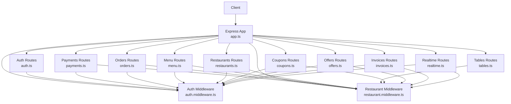
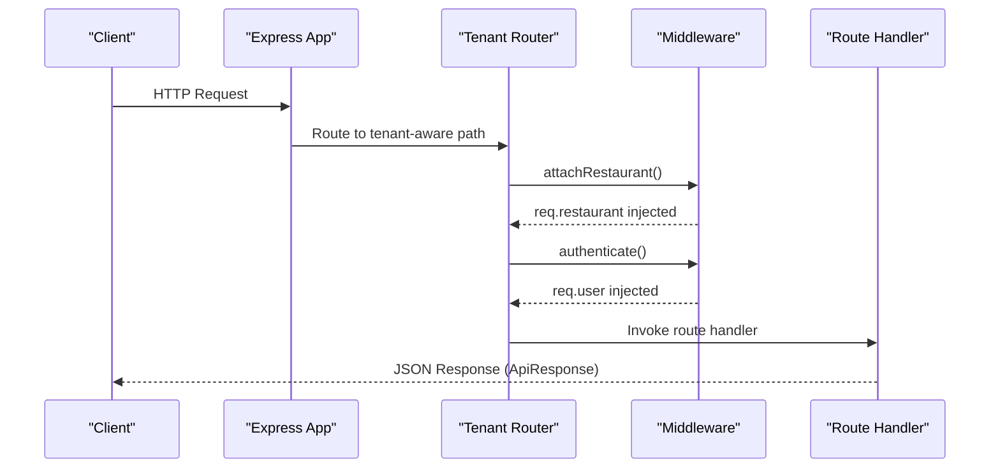
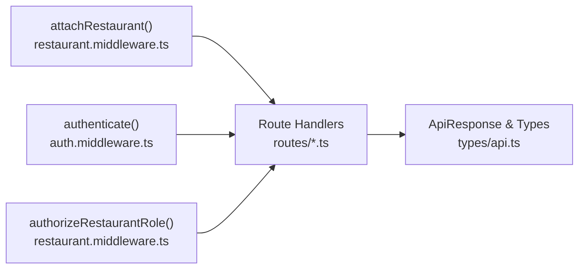

# API Endpoints

<cite>
**Referenced Files in This Document**
- [app.ts](file://restaurant-backend/src/app.ts)
- [auth.ts](file://restaurant-backend/src/routes/auth.ts)
- [payments.ts](file://restaurant-backend/src/routes/payments.ts)
- [orders.ts](file://restaurant-backend/src/routes/orders.ts)
- [menu.ts](file://restaurant-backend/src/routes/menu.ts)
- [restaurants.ts](file://restaurant-backend/src/routes/restaurants.ts)
- [tables.ts](file://restaurant-backend/src/routes/tables.ts)
- [coupons.ts](file://restaurant-backend/src/routes/coupons.ts)
- [offers.ts](file://restaurant-backend/src/routes/offers.ts)
- [invoices.ts](file://restaurant-backend/src/routes/invoices.ts)
- [realtime.ts](file://restaurant-backend/src/routes/realtime.ts)
- [auth.middleware.ts](file://restaurant-backend/src/middleware/auth.ts)
- [restaurant.middleware.ts](file://restaurant-backend/src/middleware/restaurant.ts)
- [api.types.ts](file://restaurant-backend/src/types/api.ts)
</cite>

## Table of Contents
1. [Introduction](#introduction)
2. [Project Structure](#project-structure)
3. [Core Components](#core-components)
4. [Architecture Overview](#architecture-overview)
5. [Detailed Component Analysis](#detailed-component-analysis)
6. [Dependency Analysis](#dependency-analysis)
7. [Performance Considerations](#performance-considerations)
8. [Troubleshooting Guide](#troubleshooting-guide)
9. [Conclusion](#conclusion)

## Introduction
This document provides comprehensive API documentation for the DeQ-Bite Restaurant Management System. It covers all REST endpoints grouped by functional domains: authentication, payment processing, order management, menu operations, restaurant administration, table management, coupon and offer systems, invoice generation, and real-time communication. For each endpoint, you will find HTTP methods, URL patterns, request/response schemas, authentication requirements, and error responses. Additional topics include request validation schemas, response formatting standards, pagination strategies, filtering options, API versioning, rate limiting, and security considerations.

## Project Structure
The backend is implemented as an Express.js application with modular routing. Tenants (restaurants) are identified via subdomain or slug headers and path parameters. Routes are mounted under a tenant-aware router and also under top-level platform endpoints.

**Diagram sources**
- [app.ts:107-124](file://restaurant-backend/src/app.ts#L107-L124)
- [auth.ts:1-390](file://restaurant-backend/src/routes/auth.ts#L1-L390)
- [payments.ts:1-731](file://restaurant-backend/src/routes/payments.ts#L1-L731)
- [orders.ts:1-694](file://restaurant-backend/src/routes/orders.ts#L1-L694)
- [menu.ts:1-356](file://restaurant-backend/src/routes/menu.ts#L1-L356)
- [restaurants.ts:1-554](file://restaurant-backend/src/routes/restaurants.ts#L1-L554)
- [tables.ts:1-92](file://restaurant-backend/src/routes/tables.ts#L1-L92)
- [coupons.ts:1-196](file://restaurant-backend/src/routes/coupons.ts#L1-L196)
- [offers.ts:1-157](file://restaurant-backend/src/routes/offers.ts#L1-L157)
- [invoices.ts:1-599](file://restaurant-backend/src/routes/invoices.ts#L1-L599)
- [realtime.ts:1-40](file://restaurant-backend/src/routes/realtime.ts#L1-L40)
- [auth.middleware.ts:1-137](file://restaurant-backend/src/middleware/auth.ts#L1-L137)
- [restaurant.middleware.ts:1-246](file://restaurant-backend/src/middleware/restaurant.ts#L1-L246)

**Section sources**
- [app.ts:107-124](file://restaurant-backend/src/app.ts#L107-L124)

## Core Components
- Tenant identification: Subdomain or slug-based tenant resolution via middleware.
- Authentication: JWT-based bearer tokens validated by middleware.
- Authorization: Role-based access control per restaurant membership.
- Request validation: Zod schemas for all request bodies.
- Response format: Unified ApiResponse envelope with success, data, message, and error fields.
- Rate limiting: Global IP-based rate limiting middleware.
- Security: Helmet, CORS, and strict headers.

**Section sources**
- [restaurant.middleware.ts:76-200](file://restaurant-backend/src/middleware/restaurant.ts#L76-L200)
- [auth.middleware.ts:7-75](file://restaurant-backend/src/middleware/auth.ts#L7-L75)
- [auth.middleware.ts:77-89](file://restaurant-backend/src/middleware/auth.ts#L77-L89)
- [api.types.ts:107-114](file://restaurant-backend/src/types/api.ts#L107-L114)
- [app.ts:67-77](file://restaurant-backend/src/app.ts#L67-L77)
- [app.ts:37-65](file://restaurant-backend/src/app.ts#L37-L65)

## Architecture Overview
The API follows a tenant-per-subdomain model. Requests are routed through a tenant-aware router that injects restaurant context into requests. Authentication and authorization are enforced at route level. Payment processing integrates with external providers, and real-time updates are streamed via Server-Sent Events.

**Diagram sources**
- [app.ts:111-124](file://restaurant-backend/src/app.ts#L111-L124)
- [restaurant.middleware.ts:76-200](file://restaurant-backend/src/middleware/restaurant.ts#L76-L200)
- [auth.middleware.ts:7-75](file://restaurant-backend/src/middleware/auth.ts#L7-L75)

## Detailed Component Analysis

### Authentication Endpoints
- Base path: /api/auth
- Authentication: None for registration/login; JWT required for protected endpoints.

Endpoints:
- POST /api/auth/register
  - Description: Register a new customer account.
  - Auth: None
  - Body schema: name, email, phone (optional), password (min 6)
  - Responses: 201 Created with token; 409 Conflict if user exists; 500 on server error.
  - Errors: Validation errors, duplicate user.

- POST /api/auth/login
  - Description: Login and receive JWT.
  - Auth: None
  - Body schema: email, password
  - Responses: 200 OK with user and token; 401 Unauthorized on invalid credentials.
  - Errors: Validation errors, invalid credentials.

- GET /api/auth/me
  - Description: Get current user profile with recent orders and restaurant role.
  - Auth: JWT required
  - Responses: 200 OK with user data; 404 Not Found if user missing.
  - Errors: Not found.

- GET /api/auth/profile
  - Description: Enhanced profile with order history and totals.
  - Auth: JWT required
  - Responses: 200 OK with user stats; 404 Not Found if user missing.
  - Errors: Not found.

- PUT /api/auth/change-password
  - Description: Change password after validating current password.
  - Auth: JWT required
  - Body schema: currentPassword, newPassword (min 6)
  - Responses: 200 OK on success; 400 Bad Request on wrong current password; 404 Not Found if user missing.
  - Errors: Validation, current password invalid.

- POST /api/auth/refresh
  - Description: Refresh JWT.
  - Auth: JWT required
  - Responses: 200 OK with new token; 401 Unauthorized on invalid token.
  - Errors: Token-related.

Validation schemas and response format are defined in the route and shared types.

**Section sources**
- [auth.ts:47-102](file://restaurant-backend/src/routes/auth.ts#L47-L102)
- [auth.ts:104-158](file://restaurant-backend/src/routes/auth.ts#L104-L158)
- [auth.ts:160-232](file://restaurant-backend/src/routes/auth.ts#L160-L232)
- [auth.ts:234-335](file://restaurant-backend/src/routes/auth.ts#L234-L335)
- [auth.ts:337-373](file://restaurant-backend/src/routes/auth.ts#L337-L373)
- [auth.ts:375-387](file://restaurant-backend/src/routes/auth.ts#L375-L387)
- [api.types.ts:107-114](file://restaurant-backend/src/types/api.ts#L107-L114)

### Payment Processing Endpoints
- Base path: /api/:restaurantSlug/payments or /api/restaurants/:restaurantId/payments
- Authentication: JWT required; restaurant context required; admin/owner required for some actions.
- Supported providers: Configurable via provider registry; CASH supported when enabled by restaurant.

Endpoints:
- GET /api/:restaurantSlug/payments/providers
  - Description: List enabled payment providers for the restaurant (including CASH if enabled).
  - Auth: JWT + restaurant context required.
  - Responses: 200 OK with providers array.

- POST /api/:restaurantSlug/payments/create
  - Description: Create a payment order for an unpaid order; sets payment provider if not set.
  - Auth: JWT + restaurant context required.
  - Body schema: orderId, paymentProvider (optional; defaults to order’s provider or Razorpay).
  - Responses: 201 Created with payment order details; 400/404 on validation/order errors.
  - Side effects: Updates order payment fields.

- POST /api/:restaurantSlug/payments/verify
  - Description: Verify payment signature and finalize payment; updates order and creates payment record.
  - Auth: JWT + restaurant context required.
  - Body schema: razorpay_order_id, razorpay_payment_id, razorpay_signature.
  - Responses: 200 OK with updated order; 404 if order not found; 400 if already completed.
  - Side effects: Audit log, invoice/earning creation if fully paid, real-time event emitted.

- POST /api/:restaurantSlug/payments/refund
  - Description: Initiate refund for a completed/partially paid order.
  - Auth: JWT + restaurant context required; admin/owner required.
  - Body schema: orderId, amount (optional), reason (optional).
  - Responses: 200 OK with refund details; 404/400 on validation/order errors.
  - Side effects: Transactionally updates order and payment records, audit log, real-time event.

- GET /api/:restaurantSlug/payments/status/:orderId
  - Description: Retrieve order payment status and payment history.
  - Auth: JWT + restaurant context required.
  - Responses: 200 OK with order and payments; 404 if not found.

- POST /api/:restaurantSlug/payments/cash/confirm
  - Description: Confirm cash payments for CASH orders; admin/owner required.
  - Auth: JWT + restaurant context + admin/owner required.
  - Body schema: orderId, amountPaise (optional).
  - Responses: 200 OK with updated order; 404/400 on validation/order errors.
  - Side effects: Creates payment record, audit log, invoice/earning if fully paid, real-time event.

- PUT /api/:restaurantSlug/payments/status
  - Description: Force update payment status and paid/due amounts; admin/owner required.
  - Auth: JWT + restaurant context + admin/owner required.
  - Body schema: orderId, paymentStatus (enum), paidAmountPaise (required for PARTIALLY_PAID).
  - Responses: 200 OK with updated order; 400/404 on validation/order errors.
  - Side effects: Audit log, invoice/earning if fully paid, real-time event.

Validation schemas and helper utilities:
- computeDueAndStatus: Computes paid/due amounts and derived status.
- ensureInvoiceAndEarningForFullyPaidOrder: Generates invoice PDF and earnings on full payment.
- buildOrderEventPayload: Payload for real-time events.

**Section sources**
- [payments.ts:180-193](file://restaurant-backend/src/routes/payments.ts#L180-L193)
- [payments.ts:195-292](file://restaurant-backend/src/routes/payments.ts#L195-L292)
- [payments.ts:294-407](file://restaurant-backend/src/routes/payments.ts#L294-L407)
- [payments.ts:409-516](file://restaurant-backend/src/routes/payments.ts#L409-L516)
- [payments.ts:518-568](file://restaurant-backend/src/routes/payments.ts#L518-L568)
- [payments.ts:570-646](file://restaurant-backend/src/routes/payments.ts#L570-L646)
- [payments.ts:648-728](file://restaurant-backend/src/routes/payments.ts#L648-L728)
- [payments.ts:44-59](file://restaurant-backend/src/routes/payments.ts#L44-L59)
- [payments.ts:61-166](file://restaurant-backend/src/routes/payments.ts#L61-L166)
- [payments.ts:168-178](file://restaurant-backend/src/routes/payments.ts#L168-L178)

### Order Management Endpoints
- Base path: /api/:restaurantSlug/orders or /api/restaurants/:restaurantId/orders
- Authentication: JWT required; restaurant context required for admin endpoints.

Endpoints:
- POST /api/:restaurantSlug/orders
  - Description: Create a new order for a table; applies coupon if provided; respects payment collection timing.
  - Auth: JWT + restaurant context required.
  - Body schema: tableId, items (array of menuItemId, quantity, notes optional), specialInstructions (optional), couponCode (optional), paymentProvider (RAZORPAY/PAYTM/PHONEPE/CASH).
  - Responses: 201 Created with order; 400/404 on validation/order errors.
  - Side effects: Emits order.created event.

- POST /api/:restaurantSlug/orders/:id/items
  - Description: Add items to an existing unpaid order; recalculates totals and status.
  - Auth: JWT + restaurant context required.
  - Body schema: items (array), specialInstructions (optional).
  - Responses: 200 OK with updated order; 400/404 on validation/order errors.
  - Side effects: Emits order.updated event.

- POST /api/:restaurantSlug/orders/:id/apply-coupon
  - Description: Apply or replace coupon on an unpaid order.
  - Auth: JWT + restaurant context required.
  - Body schema: couponCode.
  - Responses: 200 OK with updated order; 400/404 on validation/order errors.
  - Side effects: Emits order.updated event.

- GET /api/:restaurantSlug/orders
  - Description: Fetch orders for the authenticated user.
  - Auth: JWT + restaurant context required.
  - Responses: 200 OK with orders list.

- GET /api/:restaurantSlug/orders/restaurant/all
  - Description: Fetch all orders for the restaurant (admin/owner/staff).
  - Auth: JWT + restaurant context + admin/owner/staff required.
  - Responses: 200 OK with orders list.

- GET /api/:restaurantSlug/orders/:id
  - Description: Fetch a specific order for the authenticated user.
  - Auth: JWT + restaurant context required.
  - Responses: 200 OK with order; 404 if not found.

- PUT /api/:restaurantSlug/orders/:id/status
  - Description: Update order status (admin/owner/staff); enforces payment collection timing for BEFORE_MEAL.
  - Auth: JWT + restaurant context + admin/owner/staff required.
  - Body schema: status (enum).
  - Responses: 200 OK with updated order; 400/404 on validation/order errors.
  - Side effects: Emits order.updated event.

- PUT /api/:restaurantSlug/orders/:id/cancel
  - Description: Cancel an order if eligible.
  - Auth: JWT + restaurant context required.
  - Responses: 200 OK with cancelled order; 400/404 on validation/order errors.
  - Side effects: Emits order.updated event.

Coupon application logic:
- normalizeCouponCode: Uppercase trim.
- applyCoupon: Validates active period, usage limits, minimum order, and computes discount.
- calculateDiscountFromCoupon: Percent/Fixed with cap.

**Section sources**
- [orders.ts:82-267](file://restaurant-backend/src/routes/orders.ts#L82-L267)
- [orders.ts:269-394](file://restaurant-backend/src/routes/orders.ts#L269-L394)
- [orders.ts:396-497](file://restaurant-backend/src/routes/orders.ts#L396-L497)
- [orders.ts:499-546](file://restaurant-backend/src/routes/orders.ts#L499-L546)
- [orders.ts:548-579](file://restaurant-backend/src/routes/orders.ts#L548-L579)
- [orders.ts:581-629](file://restaurant-backend/src/routes/orders.ts#L581-L629)
- [orders.ts:631-691](file://restaurant-backend/src/routes/orders.ts#L631-L691)
- [orders.ts:14-36](file://restaurant-backend/src/routes/orders.ts#L14-L36)
- [orders.ts:50-80](file://restaurant-backend/src/routes/orders.ts#L50-L80)

### Menu Operations Endpoints
- Base path: /api/:restaurantSlug/menu or /api/restaurants/:restaurantId/menu
- Authentication: JWT required; admin/owner required for create/update/delete; admin/owner/staff for admin/all.

Endpoints:
- GET /api/:restaurantSlug/menu
  - Description: List available menu items (optionally filtered by categoryId).
  - Auth: JWT + restaurant context required.
  - Query: categoryId (optional).
  - Responses: 200 OK with items list.

- GET /api/:restaurantSlug/menu/admin/all
  - Description: List all menu items including unavailable ones.
  - Auth: JWT + restaurant context + admin/owner/staff required.
  - Responses: 200 OK with items list.

- GET /api/:restaurantSlug/menu/:id
  - Description: Get a specific menu item by ID.
  - Auth: JWT + restaurant context required.
  - Responses: 200 OK with item; 404 if not found/not available.

- POST /api/:restaurantSlug/menu
  - Description: Create a new menu item.
  - Auth: JWT + restaurant context + admin/owner required.
  - Body schema: name, description (optional), pricePaise, image (optional), categoryId, available (optional), preparationTime (optional), ingredients (optional), allergens (optional), isVeg/isVegan/isGlutenFree (optional), spiceLevel (optional).
  - Responses: 201 Created with item; 400 on validation/category errors.

- PUT /api/:restaurantSlug/menu/:id
  - Description: Update a menu item.
  - Auth: JWT + restaurant context + admin/owner required.
  - Body schema: Partial update fields (same as create).
  - Responses: 200 OK with updated item; 404 if not found; 400 on validation/category errors.

- PATCH /api/:restaurantSlug/menu/:id/availability
  - Description: Toggle availability flag.
  - Auth: JWT + restaurant context + admin/owner required.
  - Body: available (boolean).
  - Responses: 200 OK with updated item; 400/404 on validation/errors.

- DELETE /api/:restaurantSlug/menu/:id
  - Description: Delete a menu item.
  - Auth: JWT + restaurant context + admin/owner required.
  - Responses: 200 OK; 404 if not found.

Validation schema:
- menuItemSchema and partial update schema enforce constraints.

**Section sources**
- [menu.ts:28-60](file://restaurant-backend/src/routes/menu.ts#L28-L60)
- [menu.ts:62-89](file://restaurant-backend/src/routes/menu.ts#L62-L89)
- [menu.ts:91-135](file://restaurant-backend/src/routes/menu.ts#L91-L135)
- [menu.ts:137-192](file://restaurant-backend/src/routes/menu.ts#L137-L192)
- [menu.ts:194-268](file://restaurant-backend/src/routes/menu.ts#L194-L268)
- [menu.ts:270-316](file://restaurant-backend/src/routes/menu.ts#L270-L316)
- [menu.ts:318-353](file://restaurant-backend/src/routes/menu.ts#L318-L353)
- [menu.ts:10-26](file://restaurant-backend/src/routes/menu.ts#L10-L26)

### Restaurant Administration Endpoints
- Base path: /api/restaurants or /api/:restaurantSlug
- Authentication: JWT required for most; public endpoints require none.

Public endpoints:
- GET /api/restaurants/public/search
  - Query: query, cuisine, location.
  - Responses: 200 OK with restaurants list (up to 50).

- GET /api/restaurants/public/:identifier
  - Path: identifier (id/slug/subdomain).
  - Responses: 200 OK with restaurant details and paginated menu items; 404 if not found.

Authenticated endpoints:
- GET /api/restaurants/current
  - Responses: 200 OK with current restaurant context.

- GET /api/restaurants/mine
  - Responses: 200 OK with restaurants the user belongs to with roles.

- POST /api/restaurants
  - Body: name, email (optional), phone (optional), address (optional), city (optional), state (optional), country (optional), cuisineTypes (optional).
  - Responses: 201 Created with restaurant; 400 on validation.

Restaurant settings:
- GET /api/restaurants/settings/payment-policy
  - Responses: 200 OK with payment policy.

- PUT /api/restaurants/settings/payment-policy
  - Body: paymentCollectionTiming (BEFORE_MEAL/AFTER_MEAL), cashPaymentEnabled (boolean).
  - Responses: 200 OK with updated policy.

Restaurant users:
- GET /api/restaurants/users
  - Responses: 200 OK with active users and roles.

- POST /api/restaurants/users
  - Body: email, role (OWNER/ADMIN/STAFF).
  - Responses: 201 Created with membership; 404 if user not found.

**Section sources**
- [restaurants.ts:92-164](file://restaurant-backend/src/routes/restaurants.ts#L92-L164)
- [restaurants.ts:166-250](file://restaurant-backend/src/routes/restaurants.ts#L166-L250)
- [restaurants.ts:252-260](file://restaurant-backend/src/routes/restaurants.ts#L252-L260)
- [restaurants.ts:262-305](file://restaurant-backend/src/routes/restaurants.ts#L262-L305)
- [restaurants.ts:307-375](file://restaurant-backend/src/routes/restaurants.ts#L307-L375)
- [restaurants.ts:377-394](file://restaurant-backend/src/routes/restaurants.ts#L377-L394)
- [restaurants.ts:396-429](file://restaurant-backend/src/routes/restaurants.ts#L396-L429)
- [restaurants.ts:431-480](file://restaurant-backend/src/routes/restaurants.ts#L431-L480)
- [restaurants.ts:482-551](file://restaurant-backend/src/routes/restaurants.ts#L482-L551)

### Table Management Endpoints
- Base path: /api/:restaurantSlug/tables or /api/restaurants/:restaurantId/tables
- Authentication: JWT + restaurant context required.

Endpoints:
- GET /api/:restaurantSlug/tables
  - Responses: 200 OK with all tables.

- GET /api/:restaurantSlug/tables/available
  - Responses: 200 OK with active tables.

- GET /api/:restaurantSlug/tables/:id
  - Responses: 200 OK with table; 404 if not found.

**Section sources**
- [tables.ts:8-26](file://restaurant-backend/src/routes/tables.ts#L8-L26)
- [tables.ts:28-49](file://restaurant-backend/src/routes/tables.ts#L28-L49)
- [tables.ts:51-89](file://restaurant-backend/src/routes/tables.ts#L51-L89)

### Coupon and Offer Systems
- Base path: /api/:restaurantSlug/coupons and /api/:restaurantSlug/offers
- Authentication: JWT + restaurant context required for admin endpoints; admin/owner/staff required for coupon management.

Coupons:
- GET /api/:restaurantSlug/coupons
  - Responses: 200 OK with coupons list.

- POST /api/:restaurantSlug/coupons
  - Body: code, description (optional), type (PERCENT/FIXED), value, maxDiscountPaise (optional), minOrderPaise (optional), usageLimit (optional), startsAt/endsAt (optional), active (optional).
  - Responses: 201 Created with coupon; 400 on validation.

- PUT /api/:restaurantSlug/coupons/:id
  - Body: Partial update fields.
  - Responses: 200 OK with updated coupon; 404 if not found.

- POST /api/:restaurantSlug/coupons/validate
  - Body: code, subtotalPaise.
  - Responses: 200 OK with coupon and computed totals; 400/404 on validation.

Offers:
- GET /api/:restaurantSlug/offers
  - Responses: 200 OK with offers list.

- POST /api/:restaurantSlug/offers
  - Body: name, description (optional), code (optional), discountType (PERCENT/FIXED), value, minOrderPaise/maxDiscountPaise (optional), startsAt/endsAt (optional), active (optional).
  - Responses: 201 Created with offer; 400 on validation.

- PUT /api/:restaurantSlug/offers/:id
  - Body: Partial update fields.
  - Responses: 200 OK with updated offer; 404 if not found.

- DELETE /api/:restaurantSlug/offers/:id
  - Responses: 200 OK; 404 if not found.

Validation schemas:
- createCouponSchema/updateCouponSchema/validateCouponSchema
- offerSchema/offerUpdateSchema

**Section sources**
- [coupons.ts:52-64](file://restaurant-backend/src/routes/coupons.ts#L52-L64)
- [coupons.ts:66-97](file://restaurant-backend/src/routes/coupons.ts#L66-L97)
- [coupons.ts:99-139](file://restaurant-backend/src/routes/coupons.ts#L99-L139)
- [coupons.ts:141-193](file://restaurant-backend/src/routes/coupons.ts#L141-L193)
- [offers.ts:28-42](file://restaurant-backend/src/routes/offers.ts#L28-L42)
- [offers.ts:44-76](file://restaurant-backend/src/routes/offers.ts#L44-L76)
- [offers.ts:78-123](file://restaurant-backend/src/routes/offers.ts#L78-L123)
- [offers.ts:125-154](file://restaurant-backend/src/routes/offers.ts#L125-L154)

### Invoice Generation Endpoints
- Base path: /api/invoices and /api/restaurants/:restaurantId/invoices
- Authentication: JWT + restaurant context required.

Endpoints:
- POST /api/invoices/generate
  - Description: Generate and optionally deliver invoice for a COMPLETED order.
  - Body: orderId, methods (array of EMAIL/SMS).
  - Responses: 201/200 Created/Already Exists with invoice and delivery results; 400/404 on validation/order errors.
  - Side effects: PDF generation, email/SMS delivery, invoice record creation/update.

- GET /api/invoices/:orderId
  - Description: Retrieve invoice for an order owned by the user.
  - Responses: 200 OK with invoice; 404 if not found.

- GET /api/invoices/user/list
  - Description: List invoices for the authenticated user.
  - Responses: 200 OK with invoices list.

- POST /api/invoices/:invoiceId/resend
  - Description: Resend invoice via email/SMS.
  - Body: methods (array of EMAIL/SMS).
  - Responses: 200 OK with delivery results; 404 if not found.

- POST /api/invoices/:invoiceOrOrderId/refresh-pdf
  - Description: Regenerate and store PDF by invoice ID or order ID.
  - Responses: 200 OK with invoice PDF info; 404 if not found.

Delivery warnings:
- generateWarnings: Builds warnings for missing contact info or delivery failures.

**Section sources**
- [invoices.ts:21-241](file://restaurant-backend/src/routes/invoices.ts#L21-L241)
- [invoices.ts:243-287](file://restaurant-backend/src/routes/invoices.ts#L243-L287)
- [invoices.ts:289-325](file://restaurant-backend/src/routes/invoices.ts#L289-L325)
- [invoices.ts:327-454](file://restaurant-backend/src/routes/invoices.ts#L327-L454)
- [invoices.ts:456-566](file://restaurant-backend/src/routes/invoices.ts#L456-L566)
- [invoices.ts:568-596](file://restaurant-backend/src/routes/invoices.ts#L568-L596)

### Real-Time Communication Endpoints
- Base path: /api/:restaurantSlug/events
- Authentication: JWT + restaurant context required.

Endpoint:
- GET /api/:restaurantSlug/events
  - Description: Server-Sent Events stream for restaurant events (order.created, order.updated, etc.).
  - Headers: text/event-stream; keep-alive pings every 25 seconds.
  - Responses: 200 OK streaming events; connection closed on client disconnect.

**Section sources**
- [realtime.ts:9-37](file://restaurant-backend/src/routes/realtime.ts#L9-L37)

## Dependency Analysis
- Tenant resolution: attachRestaurant resolves restaurant context from headers/path/host; guards downstream routes.
- Authentication: authenticate validates JWT and injects user; authorize restricts by role.
- Authorization: authorizeRestaurantRole checks membership and role.
- Request validation: Zod schemas define request contracts for all endpoints.
- Response formatting: ApiResponse envelope ensures consistent responses.
- Real-time: onRestaurantEvent emits domain events; SSE endpoint streams events.

**Diagram sources**
- [restaurant.middleware.ts:76-246](file://restaurant-backend/src/middleware/restaurant.ts#L76-L246)
- [auth.middleware.ts:7-75](file://restaurant-backend/src/middleware/auth.ts#L7-L75)
- [api.types.ts:107-114](file://restaurant-backend/src/types/api.ts#L107-L114)

**Section sources**
- [restaurant.middleware.ts:76-246](file://restaurant-backend/src/middleware/restaurant.ts#L76-L246)
- [auth.middleware.ts:7-75](file://restaurant-backend/src/middleware/auth.ts#L7-L75)
- [api.types.ts:107-114](file://restaurant-backend/src/types/api.ts#L107-L114)

## Performance Considerations
- Pagination and filtering:
  - Public restaurant search: limited to 50 results.
  - Menu retrieval: optional categoryId filter; admin/all lists newest first.
  - Orders listing: newest first; admin/all lists newest first.
  - Invoices listing: newest first.
- Data shaping:
  - Selective includes to avoid N+1 and oversized payloads.
  - Conditional fields based on Prisma client schema presence.
- Streaming:
  - SSE events stream with periodic pings to maintain connections.
- Caching:
  - No explicit caching layer; rely on client-side caching and CDN for static assets.

[No sources needed since this section provides general guidance]

## Troubleshooting Guide
Common errors and resolutions:
- Authentication failures:
  - 401 Unauthorized: Missing/invalid/expired JWT token.
  - 403 Forbidden: Insufficient permissions or missing restaurant membership.
- Validation errors:
  - 400 Bad Request: Invalid request body (schema violations).
- Resource not found:
  - 404 Not Found: Order not found, coupon invalid/expired/usage exceeded, invoice not found, menu item not available, table not found.
- Business rule violations:
  - Cannot add items to pay-before-meal orders after the fact.
  - Cannot cancel orders with captured payments.
  - Cash payment confirmation requires admin/owner role.
- Rate limiting:
  - 429 Too Many Requests: Exceeded global IP rate limit.

Operational checks:
- Verify JWT_SECRET is configured in production.
- Ensure CORS origins include frontend hosts.
- Confirm tenant slug/subdomain headers or path parameters are correct.
- Validate payment provider configuration and signatures for verification.

**Section sources**
- [auth.middleware.ts:40-75](file://restaurant-backend/src/middleware/auth.ts#L40-L75)
- [restaurant.middleware.ts:202-245](file://restaurant-backend/src/middleware/restaurant.ts#L202-L245)
- [orders.ts:296-305](file://restaurant-backend/src/routes/orders.ts#L296-L305)
- [orders.ts:651-660](file://restaurant-backend/src/routes/orders.ts#L651-L660)
- [payments.ts:225-235](file://restaurant-backend/src/routes/payments.ts#L225-L235)
- [payments.ts:585-587](file://restaurant-backend/src/routes/payments.ts#L585-L587)
- [app.ts:67-77](file://restaurant-backend/src/app.ts#L67-L77)

## Conclusion
DeQ-Bite provides a comprehensive REST API for restaurant operations with strong tenant isolation, robust authentication and authorization, consistent response formatting, and real-time capabilities. The API supports full order lifecycle management, flexible payment processing, dynamic menu and coupon systems, and invoice generation with delivery options. Adhering to the documented schemas and security practices will ensure reliable integration across clients and environments.