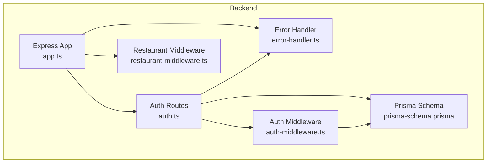
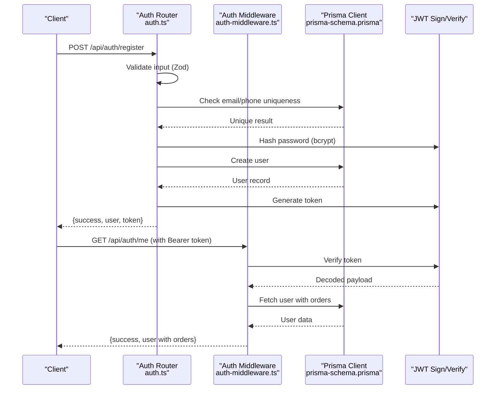
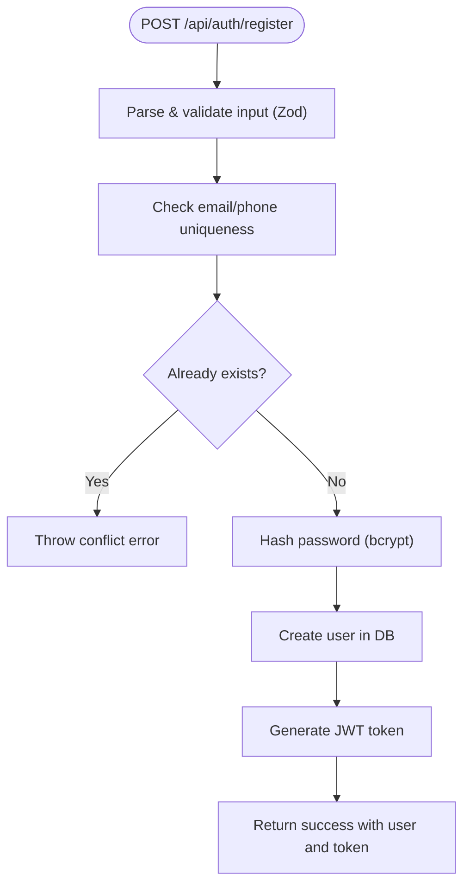
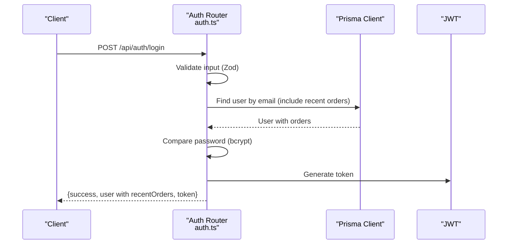
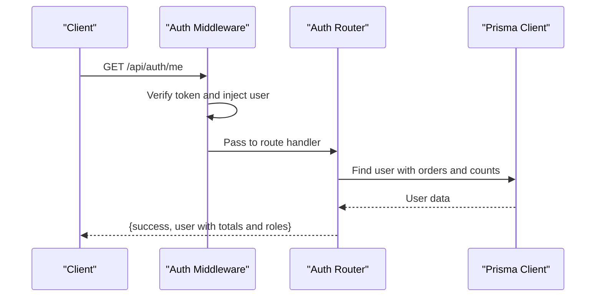
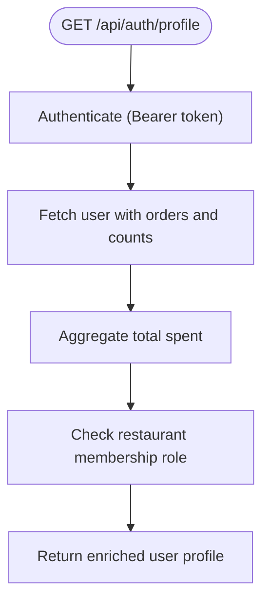
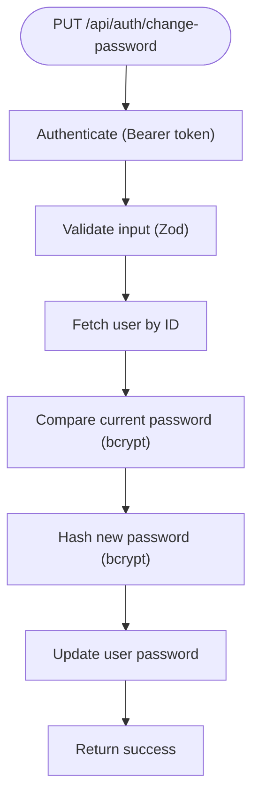
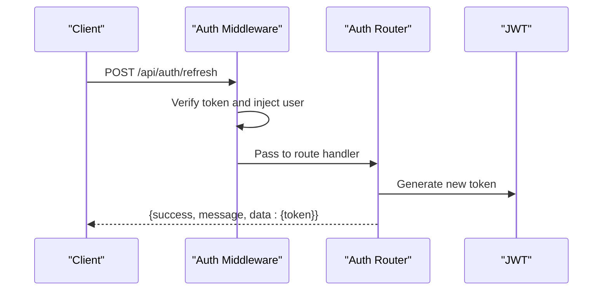
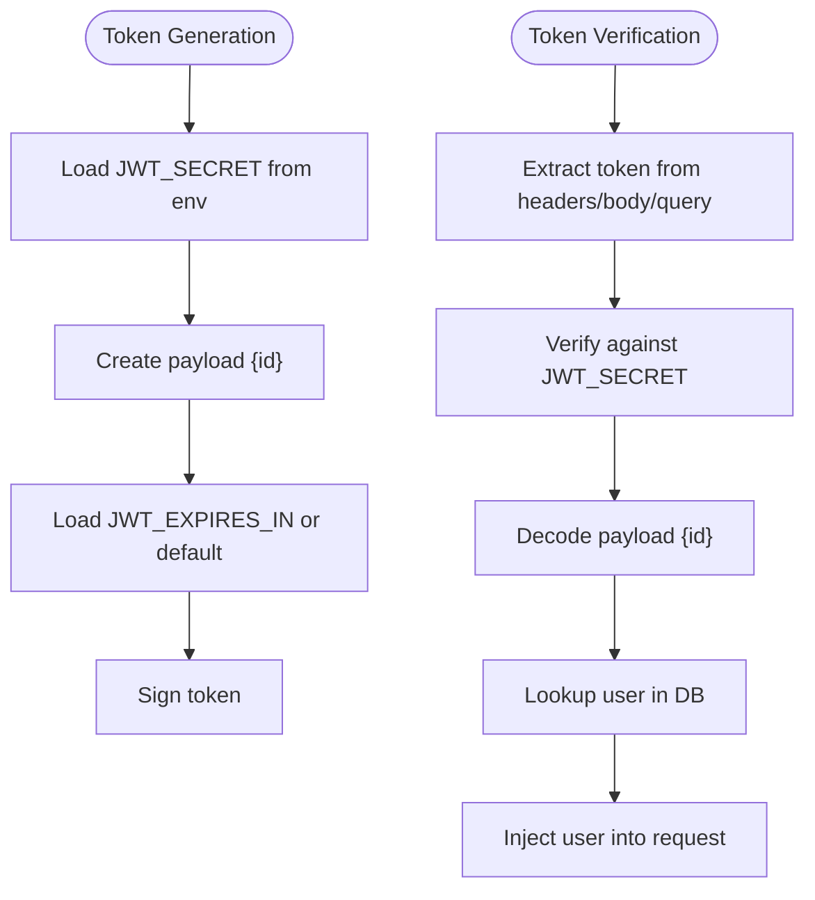
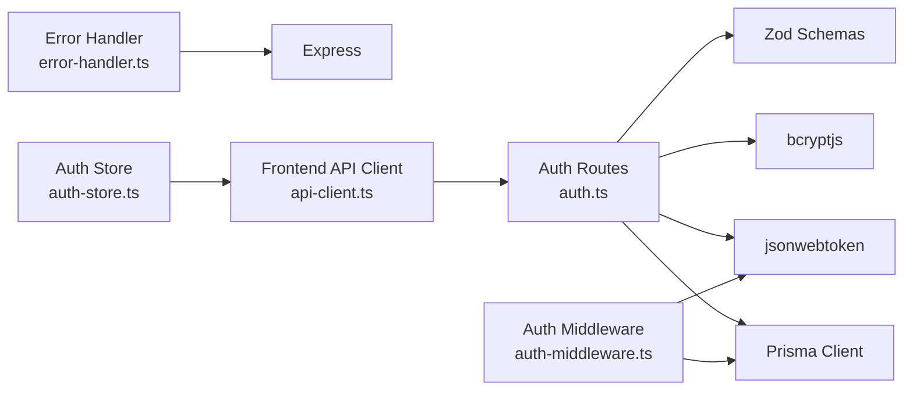

# Authentication Endpoints

<cite>
**Referenced Files in This Document**
- [auth.ts](file://restaurant-backend/src/routes/auth.ts)
- [auth-middleware.ts](file://restaurant-backend/src/middleware/auth.ts)
- [error-handler.ts](file://restaurant-backend/src/middleware/errorHandler.ts)
- [api-types.ts](file://restaurant-backend/src/types/api.ts)
- [app.ts](file://restaurant-backend/src/app.ts)
- [restaurant-middleware.ts](file://restaurant-backend/src/middleware/restaurant.ts)
- [prisma-schema.prisma](file://restaurant-backend/prisma/schema.prisma)
- [env-types.d.ts](file://restaurant-backend/src/types/env.d.ts)
- [api-client.ts](file://restaurant-frontend/src/lib/api-client.ts)
- [auth-store.ts](file://restaurant-frontend/src/store/auth.ts)
</cite>

## Table of Contents
1. [Introduction](#introduction)
2. [Project Structure](#project-structure)
3. [Core Components](#core-components)
4. [Architecture Overview](#architecture-overview)
5. [Detailed Component Analysis](#detailed-component-analysis)
6. [Dependency Analysis](#dependency-analysis)
7. [Performance Considerations](#performance-considerations)
8. [Troubleshooting Guide](#troubleshooting-guide)
9. [Conclusion](#conclusion)

## Introduction
This document provides comprehensive API documentation for the authentication system, covering user registration, login, protected profile endpoints, password change, and token refresh. It details validation schemas, uniqueness checks, password hashing, JWT token generation, user data retrieval, error handling patterns, and security considerations including rate limiting and session management.

## Project Structure
The authentication endpoints are implemented as Express routes with Zod validation, JWT middleware, and Prisma database interactions. The system integrates with a shared error handler and rate limiting middleware.

**Diagram sources**
- [app.ts:1-144](file://restaurant-backend/src/app.ts#L1-L144)
- [auth.ts:1-390](file://restaurant-backend/src/routes/auth.ts#L1-L390)
- [auth-middleware.ts:1-137](file://restaurant-backend/src/middleware/auth.ts#L1-L137)
- [error-handler.ts:1-82](file://restaurant-backend/src/middleware/errorHandler.ts#L1-L82)
- [restaurant-middleware.ts:1-254](file://restaurant-backend/src/middleware/restaurant.ts#L1-L254)
- [prisma-schema.prisma:1-402](file://restaurant-backend/prisma/schema.prisma#L1-L402)

**Section sources**
- [app.ts:1-144](file://restaurant-backend/src/app.ts#L1-L144)
- [auth.ts:1-390](file://restaurant-backend/src/routes/auth.ts#L1-L390)

## Core Components
- Authentication routes: Registration, login, protected profile retrieval, password change, and token refresh.
- Validation schemas: Zod schemas for registration, login, and password change.
- JWT middleware: Token extraction, verification, and user injection.
- Error handling: Centralized error handling with structured responses.
- Rate limiting: Global rate limiting middleware.
- Database models: User, Restaurant, and RestaurantUser relations.

**Section sources**
- [auth.ts:12-28](file://restaurant-backend/src/routes/auth.ts#L12-L28)
- [auth-middleware.ts:7-75](file://restaurant-backend/src/middleware/auth.ts#L7-L75)
- [error-handler.ts:9-20](file://restaurant-backend/src/middleware/errorHandler.ts#L9-L20)
- [app.ts:67-77](file://restaurant-backend/src/app.ts#L67-L77)
- [prisma-schema.prisma:11-88](file://restaurant-backend/prisma/schema.prisma#L11-L88)

## Architecture Overview
The authentication flow integrates route handlers, middleware, validation, and database operations. Protected endpoints rely on JWT middleware to inject user context.

**Diagram sources**
- [auth.ts:47-102](file://restaurant-backend/src/routes/auth.ts#L47-L102)
- [auth.ts:160-232](file://restaurant-backend/src/routes/auth.ts#L160-L232)
- [auth-middleware.ts:7-75](file://restaurant-backend/src/middleware/auth.ts#L7-L75)
- [prisma-schema.prisma:11-22](file://restaurant-backend/prisma/schema.prisma#L11-L22)

## Detailed Component Analysis

### Registration Endpoint
- Path: POST /api/auth/register
- Purpose: Create a new customer account with validated input, uniqueness checks, and password hashing.
- Validation schema:
  - name: string (min 2, max 50)
  - email: string (valid email)
  - phone: string (optional, min 10)
  - password: string (min 6)
- Uniqueness checks:
  - Email and phone uniqueness enforced via Prisma unique constraints and pre-check query.
- Password hashing:
  - Uses bcrypt with configurable rounds.
- Response:
  - success: boolean
  - message: string
  - data: { user, token }

**Diagram sources**
- [auth.ts:47-102](file://restaurant-backend/src/routes/auth.ts#L47-L102)
- [prisma-schema.prisma:13-14](file://restaurant-backend/prisma/schema.prisma#L13-L14)

**Section sources**
- [auth.ts:47-102](file://restaurant-backend/src/routes/auth.ts#L47-L102)
- [auth.ts:13-18](file://restaurant-backend/src/routes/auth.ts#L13-L18)
- [prisma-schema.prisma:13-14](file://restaurant-backend/prisma/schema.prisma#L13-L14)

### Login Endpoint
- Path: POST /api/auth/login
- Purpose: Authenticate user with email/password and return token with enriched user data including recent orders.
- Validation schema:
  - email: string (valid email)
  - password: string (min 1)
- Credential verification:
  - Fetches user by email and compares hashed password.
- Response:
  - success: boolean
  - message: string
  - data: { user: { id, name, email, phone, role, verified, createdAt, recentOrders }, token }

**Diagram sources**
- [auth.ts:104-158](file://restaurant-backend/src/routes/auth.ts#L104-L158)
- [prisma-schema.prisma:162-189](file://restaurant-backend/prisma/schema.prisma#L162-L189)

**Section sources**
- [auth.ts:104-158](file://restaurant-backend/src/routes/auth.ts#L104-L158)
- [auth.ts:20-23](file://restaurant-backend/src/routes/auth.ts#L20-L23)

### Protected Profile Endpoints

#### GET /api/auth/me
- Purpose: Retrieve current user profile with recent orders and total order count.
- Authentication: Required (Bearer token).
- Response fields:
  - success: boolean
  - data: { user: { ..., totalOrders, recentOrders, restaurantRole } }

**Diagram sources**
- [auth.ts:160-232](file://restaurant-backend/src/routes/auth.ts#L160-L232)
- [auth-middleware.ts:7-75](file://restaurant-backend/src/middleware/auth.ts#L7-L75)

**Section sources**
- [auth.ts:160-232](file://restaurant-backend/src/routes/auth.ts#L160-L232)

#### GET /api/auth/profile
- Purpose: Enhanced profile with recent orders, order statistics, and total spent calculation.
- Authentication: Required (Bearer token).
- Additional data:
  - totalSpent: sum of completed orders in paise
  - recentOrders: detailed with items and table info
- Response fields:
  - success: boolean
  - data: { user: { ..., totalOrders, totalSpent, recentOrders, restaurantRole } }

**Diagram sources**
- [auth.ts:234-335](file://restaurant-backend/src/routes/auth.ts#L234-L335)
- [prisma-schema.prisma:162-206](file://restaurant-backend/prisma/schema.prisma#L162-L206)

**Section sources**
- [auth.ts:234-335](file://restaurant-backend/src/routes/auth.ts#L234-L335)

### Password Change Endpoint
- Path: PUT /api/auth/change-password
- Purpose: Change user password after verifying current password.
- Validation schema:
  - currentPassword: string (required)
  - newPassword: string (min 6)
- Steps:
  - Fetch user by ID
  - Verify current password
  - Hash new password
  - Update user record
- Response:
  - success: boolean
  - message: string

**Diagram sources**
- [auth.ts:337-373](file://restaurant-backend/src/routes/auth.ts#L337-L373)

**Section sources**
- [auth.ts:337-373](file://restaurant-backend/src/routes/auth.ts#L337-L373)
- [auth.ts:25-28](file://restaurant-backend/src/routes/auth.ts#L25-L28)

### Token Refresh Endpoint
- Path: POST /api/auth/refresh
- Purpose: Generate a new JWT token for the authenticated user.
- Authentication: Required (Bearer token).
- Response:
  - success: boolean
  - message: string
  - data: { token }

**Diagram sources**
- [auth.ts:375-387](file://restaurant-backend/src/routes/auth.ts#L375-L387)

**Section sources**
- [auth.ts:375-387](file://restaurant-backend/src/routes/auth.ts#L375-L387)

### JWT Token Generation and Verification
- Secret and expiration:
  - Secret sourced from environment variable.
  - Expiration configurable via environment variable.
- Token payload:
  - Contains user ID.
- Extraction and verification:
  - Supports Authorization header (Bearer) and fallbacks to body/query tokens.
  - Verifies signature and decodes payload.

**Diagram sources**
- [auth.ts:30-45](file://restaurant-backend/src/routes/auth.ts#L30-L45)
- [auth-middleware.ts:14-75](file://restaurant-backend/src/middleware/auth.ts#L14-L75)
- [env-types.d.ts:8-9](file://restaurant-backend/src/types/env.d.ts#L8-L9)

**Section sources**
- [auth.ts:30-45](file://restaurant-backend/src/routes/auth.ts#L30-L45)
- [auth-middleware.ts:14-75](file://restaurant-backend/src/middleware/auth.ts#L14-L75)
- [env-types.d.ts:8-9](file://restaurant-backend/src/types/env.d.ts#L8-L9)

## Dependency Analysis
- Route dependencies:
  - Zod schemas for validation.
  - bcrypt for password hashing.
  - jsonwebtoken for token signing/verification.
  - Prisma for database operations.
- Middleware dependencies:
  - Auth middleware depends on JWT secret and Prisma user lookup.
  - Error handler centralizes error responses.
- Frontend integration:
  - API client stores and sends Bearer token.
  - Auth store persists token in local storage.

**Diagram sources**
- [auth.ts:1-10](file://restaurant-backend/src/routes/auth.ts#L1-L10)
- [auth-middleware.ts:1-6](file://restaurant-backend/src/middleware/auth.ts#L1-L6)
- [error-handler.ts:1-7](file://restaurant-backend/src/middleware/errorHandler.ts#L1-L7)
- [api-client.ts:335-371](file://restaurant-frontend/src/lib/api-client.ts#L335-L371)
- [auth-store.ts:162-176](file://restaurant-frontend/src/store/auth.ts#L162-L176)

**Section sources**
- [auth.ts:1-10](file://restaurant-backend/src/routes/auth.ts#L1-L10)
- [auth-middleware.ts:1-6](file://restaurant-backend/src/middleware/auth.ts#L1-L6)
- [error-handler.ts:1-7](file://restaurant-backend/src/middleware/errorHandler.ts#L1-L7)
- [api-client.ts:335-371](file://restaurant-frontend/src/lib/api-client.ts#L335-L371)
- [auth-store.ts:162-176](file://restaurant-frontend/src/store/auth.ts#L162-L176)

## Performance Considerations
- Password hashing cost:
  - Configurable rounds for balancing security and performance.
- Database queries:
  - Selective projections minimize payload size.
  - Aggregation queries for totals reduce client-side computation.
- Token generation:
  - Minimal payload reduces token size and network overhead.
- Rate limiting:
  - Global middleware limits requests per IP to prevent abuse.

[No sources needed since this section provides general guidance]

## Troubleshooting Guide
- Common errors:
  - Validation failures: thrown as operational errors with 400 status.
  - Authentication failures: invalid/expired tokens mapped to 401.
  - Database errors: handled with structured messages.
- Environment configuration:
  - JWT_SECRET must be set in production.
  - JWT_EXPIRES_IN controls token lifetime.
- Frontend token handling:
  - Ensure Bearer token is included in Authorization header.
  - Persist token in local storage and clear on logout.

**Section sources**
- [error-handler.ts:48-76](file://restaurant-backend/src/middleware/errorHandler.ts#L48-L76)
- [auth-middleware.ts:40-75](file://restaurant-backend/src/middleware/auth.ts#L40-L75)
- [env-types.d.ts:8-9](file://restaurant-backend/src/types/env.d.ts#L8-L9)
- [api-client.ts:335-371](file://restaurant-frontend/src/lib/api-client.ts#L335-L371)
- [auth-store.ts:162-176](file://restaurant-frontend/src/store/auth.ts#L162-L176)

## Conclusion
The authentication system provides secure, validated, and efficient endpoints for user lifecycle management. It enforces strong validation, uniqueness checks, and password hashing while offering comprehensive protected profile data and robust error handling. The integration of JWT middleware, rate limiting, and frontend token persistence ensures a reliable and secure user experience.