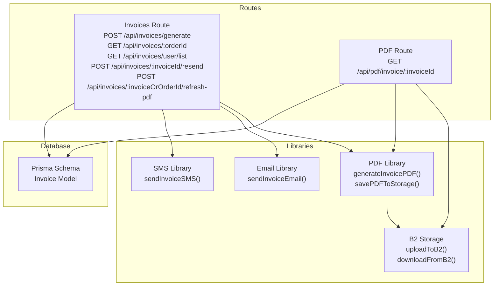
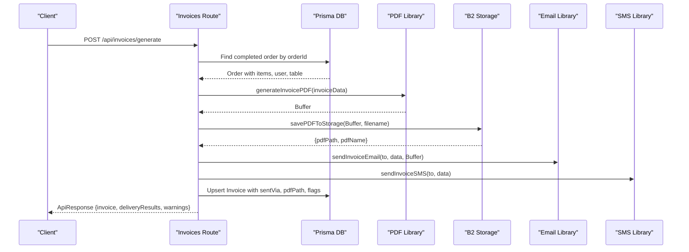
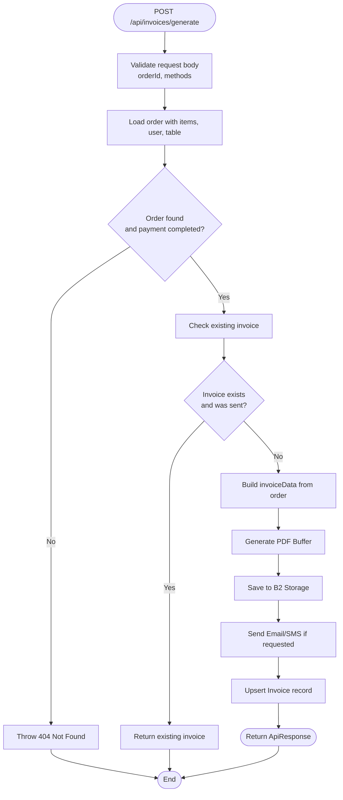
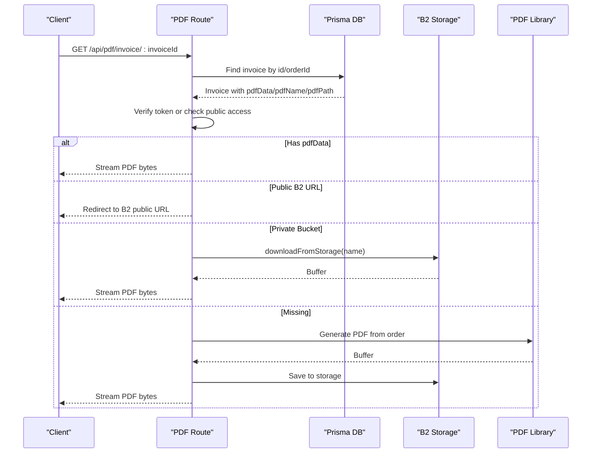
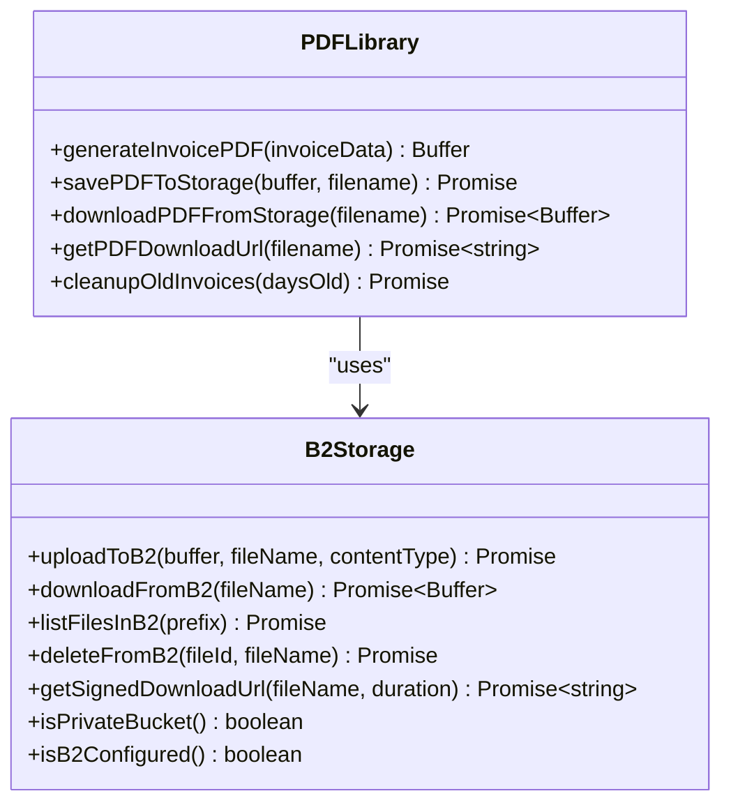
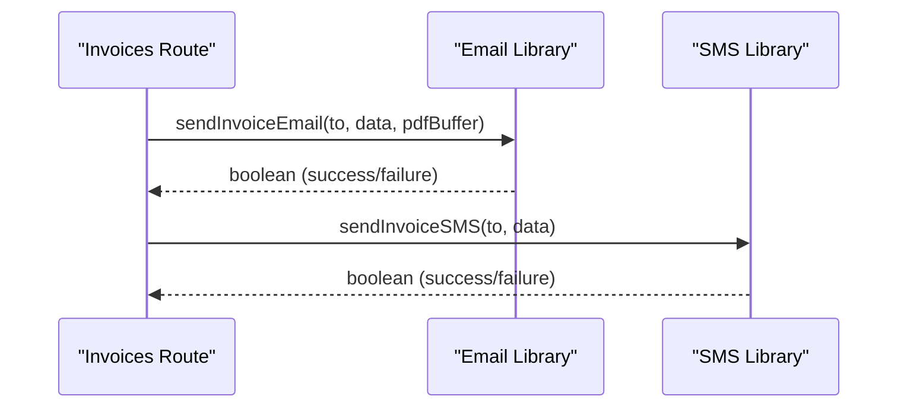
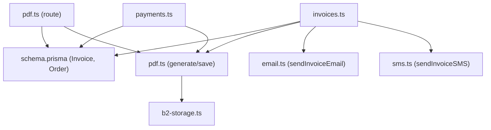

# Document Generation Endpoints

<cite>
**Referenced Files in This Document**
- [invoices.ts](file://restaurant-backend/src/routes/invoices.ts)
- [pdf.ts](file://restaurant-backend/src/routes/pdf.ts)
- [email.ts](file://restaurant-backend/src/lib/email.ts)
- [sms.ts](file://restaurant-backend/src/lib/sms.ts)
- [pdf.ts](file://restaurant-backend/src/lib/pdf.ts)
- [b2-storage.ts](file://restaurant-backend/src/lib/b2-storage.ts)
- [schema.prisma](file://restaurant-backend/prisma/schema.prisma)
- [api.ts](file://restaurant-backend/src/types/api.ts)
- [errorHandler.ts](file://restaurant-backend/src/middleware/errorHandler.ts)
- [payments.ts](file://restaurant-backend/src/routes/payments.ts)
- [orders.ts](file://restaurant-backend/src/routes/orders.ts)
</cite>

## Table of Contents
1. [Introduction](#introduction)
2. [Project Structure](#project-structure)
3. [Core Components](#core-components)
4. [Architecture Overview](#architecture-overview)
5. [Detailed Component Analysis](#detailed-component-analysis)
6. [Dependency Analysis](#dependency-analysis)
7. [Performance Considerations](#performance-considerations)
8. [Troubleshooting Guide](#troubleshooting-guide)
9. [Conclusion](#conclusion)

## Introduction
This document provides comprehensive API documentation for document generation and delivery endpoints focused on invoice creation, PDF generation, and delivery mechanisms via email and SMS. It also covers template customization, branding options, document formatting controls, retrieval and archival systems, notification delivery endpoints, document storage strategies, file management, retention policies, internationalization support, multi-currency formatting, tax calculation integration, webhook integration for external document processing systems, and practical examples of document workflows and delivery automation patterns.

## Project Structure
The document generation and delivery system spans several modules:
- Routes for invoice generation, retrieval, resend, and refresh-pdf
- PDF generation and storage utilities
- Email and SMS notification libraries
- Database schema for invoices and related entities
- Types and error handling utilities
- Payment and order processing integration

**Diagram sources**
- [invoices.ts:21-566](file://restaurant-backend/src/routes/invoices.ts#L21-L566)
- [pdf.ts:11-211](file://restaurant-backend/src/routes/pdf.ts#L11-L211)
- [pdf.ts:47-334](file://restaurant-backend/src/lib/pdf.ts#L47-L334)
- [email.ts:200-227](file://restaurant-backend/src/lib/email.ts#L200-L227)
- [sms.ts:89-131](file://restaurant-backend/src/lib/sms.ts#L89-L131)
- [b2-storage.ts:76-300](file://restaurant-backend/src/lib/b2-storage.ts#L76-L300)
- [schema.prisma:208-222](file://restaurant-backend/prisma/schema.prisma#L208-L222)

**Section sources**
- [invoices.ts:1-599](file://restaurant-backend/src/routes/invoices.ts#L1-L599)
- [pdf.ts:1-214](file://restaurant-backend/src/routes/pdf.ts#L1-L214)
- [pdf.ts:1-334](file://restaurant-backend/src/lib/pdf.ts#L1-L334)
- [email.ts:1-227](file://restaurant-backend/src/lib/email.ts#L1-L227)
- [sms.ts:1-131](file://restaurant-backend/src/lib/sms.ts#L1-L131)
- [b2-storage.ts:1-335](file://restaurant-backend/src/lib/b2-storage.ts#L1-L335)
- [schema.prisma:1-402](file://restaurant-backend/prisma/schema.prisma#L1-L402)

## Core Components
- Invoice generation route: Validates order ownership and completion, prepares invoice data, generates PDF, stores in cloud storage, sends email/SMS notifications, and persists invoice metadata.
- PDF generation library: Creates PDFs with standardized receipt-like format, supports customization via template fields, and integrates with cloud storage.
- Email and SMS libraries: Provide templated notifications with dynamic content and robust error logging.
- PDF retrieval route: Handles secure download with token verification, fallback to DB storage, and on-demand regeneration.
- Storage abstraction: Backblaze B2 integration with upload, download, signed URL generation, and cleanup utilities.
- Database model: Invoice entity with unique constraints, delivery metadata, and optional PDF storage fields.

**Section sources**
- [invoices.ts:21-241](file://restaurant-backend/src/routes/invoices.ts#L21-L241)
- [pdf.ts:47-197](file://restaurant-backend/src/lib/pdf.ts#L47-L197)
- [email.ts:200-227](file://restaurant-backend/src/lib/email.ts#L200-L227)
- [sms.ts:89-131](file://restaurant-backend/src/lib/sms.ts#L89-L131)
- [pdf.ts:11-211](file://restaurant-backend/src/routes/pdf.ts#L11-L211)
- [b2-storage.ts:76-300](file://restaurant-backend/src/lib/b2-storage.ts#L76-L300)
- [schema.prisma:208-222](file://restaurant-backend/prisma/schema.prisma#L208-L222)

## Architecture Overview
The system orchestrates invoice creation and delivery through a series of coordinated steps:
- Payment completion triggers invoice creation and storage.
- Delivery methods (email/SMS) are executed conditionally based on user preferences and availability.
- PDF retrieval supports both public and private storage modes with secure access control.
- Storage utilities manage uploads, downloads, and lifecycle cleanup.

**Diagram sources**
- [invoices.ts:21-241](file://restaurant-backend/src/routes/invoices.ts#L21-L241)
- [pdf.ts:47-197](file://restaurant-backend/src/lib/pdf.ts#L47-L197)
- [pdf.ts:201-236](file://restaurant-backend/src/lib/pdf.ts#L201-L236)
- [email.ts:200-227](file://restaurant-backend/src/lib/email.ts#L200-L227)
- [sms.ts:89-131](file://restaurant-backend/src/lib/sms.ts#L89-L131)
- [schema.prisma:208-222](file://restaurant-backend/prisma/schema.prisma#L208-L222)

## Detailed Component Analysis

### Invoice Generation Endpoint
- Purpose: Generate and deliver invoices for completed orders, supporting email and SMS delivery.
- Authentication and authorization: Requires authenticated user and restaurant context.
- Validation: Ensures order exists, belongs to the user and restaurant, and has completed payment status.
- PDF generation: Builds invoice data from order details and generates a compact receipt-style PDF.
- Storage: Saves PDF to Backblaze B2 with invoices/ prefix and records metadata.
- Delivery: Conditionally sends email and SMS notifications.
- Idempotency: Prevents duplicate generation for invoices already sent via delivery channels.
- Response: Includes invoice metadata, delivery results, and warnings for missing contact info or delivery failures.

**Diagram sources**
- [invoices.ts:21-241](file://restaurant-backend/src/routes/invoices.ts#L21-L241)

**Section sources**
- [invoices.ts:21-241](file://restaurant-backend/src/routes/invoices.ts#L21-L241)

### Invoice Retrieval Endpoint
- Purpose: Retrieve invoice details by order ID or invoice ID with ownership verification.
- Access control: Supports token-based verification and public download when appropriate.
- Storage fallback: Attempts to serve from DB bytes, B2 public URL, or private bucket streaming.
- On-demand regeneration: Generates and stores PDF if not available.

**Diagram sources**
- [pdf.ts:11-211](file://restaurant-backend/src/routes/pdf.ts#L11-L211)
- [pdf.ts:243-293](file://restaurant-backend/src/lib/pdf.ts#L243-L293)

**Section sources**
- [pdf.ts:11-211](file://restaurant-backend/src/routes/pdf.ts#L11-L211)

### Invoice Resend Endpoint
- Purpose: Resend invoice via email and/or SMS for an existing invoice.
- Behavior: Regenerates PDF when needed, updates delivery metadata, and returns delivery results.

**Section sources**
- [invoices.ts:327-454](file://restaurant-backend/src/routes/invoices.ts#L327-L454)

### Invoice Refresh PDF Endpoint
- Purpose: Regenerate and re-store PDF for an invoice or order, creating invoice record if missing.
- Behavior: Builds invoice data from order, generates PDF, saves to storage, and updates invoice record.

**Section sources**
- [invoices.ts:456-566](file://restaurant-backend/src/routes/invoices.ts#L456-L566)

### PDF Generation and Storage
- PDF generation: Creates a compact receipt-style PDF with customer details, items, totals, and branding fields.
- Storage: Uploads to Backblaze B2 under invoices/ with public URL generation or signed URL for private buckets.
- Cleanup: Lists and deletes old invoice files based on configurable retention window.

**Diagram sources**
- [pdf.ts:47-334](file://restaurant-backend/src/lib/pdf.ts#L47-L334)
- [b2-storage.ts:76-300](file://restaurant-backend/src/lib/b2-storage.ts#L76-L300)

**Section sources**
- [pdf.ts:47-197](file://restaurant-backend/src/lib/pdf.ts#L47-L197)
- [pdf.ts:201-293](file://restaurant-backend/src/lib/pdf.ts#L201-L293)
- [b2-storage.ts:76-300](file://restaurant-backend/src/lib/b2-storage.ts#L76-L300)

### Email and SMS Delivery
- Email: Sends HTML email with PDF attachment using SMTP transport, with robust error logging.
- SMS: Sends SMS via Twilio with configurable sender number and message templates.
- Templates: Dynamic content for invoice and order confirmation messages.

**Diagram sources**
- [email.ts:200-227](file://restaurant-backend/src/lib/email.ts#L200-L227)
- [sms.ts:89-131](file://restaurant-backend/src/lib/sms.ts#L89-L131)
- [invoices.ts:146-172](file://restaurant-backend/src/routes/invoices.ts#L146-L172)

**Section sources**
- [email.ts:200-227](file://restaurant-backend/src/lib/email.ts#L200-L227)
- [sms.ts:89-131](file://restaurant-backend/src/lib/sms.ts#L89-L131)

### Notification Delivery Endpoints
- Order confirmation SMS: Dedicated endpoint to send order confirmation SMS with table and amount details.
- Invoice notifications: Integrated within invoice generation and resend flows.

**Section sources**
- [sms.ts:109-131](file://restaurant-backend/src/lib/sms.ts#L109-L131)
- [invoices.ts:327-454](file://restaurant-backend/src/routes/invoices.ts#L327-L454)

### Document Storage Strategies and Retention
- Cloud storage: Backblaze B2 with invoices/ prefix for organization.
- Access modes: Public bucket direct URL or private bucket signed URL.
- Lifecycle: Optional cleanup of old invoice files based on retention policy.

**Section sources**
- [pdf.ts:201-236](file://restaurant-backend/src/lib/pdf.ts#L201-L236)
- [pdf.ts:299-334](file://restaurant-backend/src/lib/pdf.ts#L299-L334)
- [b2-storage.ts:265-300](file://restaurant-backend/src/lib/b2-storage.ts#L265-L300)

### Internationalization Support, Multi-Currency Formatting, and Tax Calculation
- Currency: Invoice totals are formatted in INR within the PDF and email templates.
- Tax: Calculated from subtotal minus discounts using a fixed rate during order processing.
- Localization: Date formatting uses en-IN locale; currency symbol rendering accommodates character limitations.

**Section sources**
- [invoices.ts:113-127](file://restaurant-backend/src/routes/invoices.ts#L113-L127)
- [email.ts:180-182](file://restaurant-backend/src/lib/email.ts#L180-L182)
- [orders.ts:10-36](file://restaurant-backend/src/routes/orders.ts#L10-L36)

### Webhook Integration for External Document Processing Systems
- Current implementation: No explicit webhook endpoints are exposed in the analyzed files.
- Recommendation: Implement a webhook endpoint to accept external processing callbacks, validate signatures, and update invoice/document status accordingly.

[No sources needed since this section provides recommendations without analyzing specific files]

### Examples of Document Workflows and Delivery Automation Patterns
- Automated invoice generation upon payment completion: Payment processing ensures invoice creation and storage.
- Conditional delivery: Email/SMS sent only when requested and recipient contact info is available.
- Resend capability: Allows re-delivery of invoices with updated PDFs.
- On-demand retrieval: Secure access to PDFs with token verification and fallback mechanisms.

**Section sources**
- [payments.ts:61-166](file://restaurant-backend/src/routes/payments.ts#L61-L166)
- [invoices.ts:327-454](file://restaurant-backend/src/routes/invoices.ts#L327-L454)
- [pdf.ts:11-211](file://restaurant-backend/src/routes/pdf.ts#L11-L211)

## Dependency Analysis
The invoice generation pipeline depends on:
- Prisma models for order, invoice, and related entities
- PDF generation and storage utilities
- Email and SMS libraries
- Environment configuration for SMTP, Twilio, and B2

**Diagram sources**
- [invoices.ts:1-12](file://restaurant-backend/src/routes/invoices.ts#L1-L12)
- [pdf.ts:1-11](file://restaurant-backend/src/lib/pdf.ts#L1-L11)
- [email.ts:1-2](file://restaurant-backend/src/lib/email.ts#L1-L2)
- [sms.ts:1-2](file://restaurant-backend/src/lib/sms.ts#L1-L2)
- [b2-storage.ts:1-2](file://restaurant-backend/src/lib/b2-storage.ts#L1-L2)
- [schema.prisma:208-222](file://restaurant-backend/prisma/schema.prisma#L208-L222)
- [pdf.ts:1-9](file://restaurant-backend/src/routes/pdf.ts#L1-L9)
- [payments.ts:1-14](file://restaurant-backend/src/routes/payments.ts#L1-L14)

**Section sources**
- [schema.prisma:208-222](file://restaurant-backend/prisma/schema.prisma#L208-L222)
- [invoices.ts:1-12](file://restaurant-backend/src/routes/invoices.ts#L1-L12)
- [pdf.ts:1-11](file://restaurant-backend/src/lib/pdf.ts#L1-L11)
- [email.ts:1-2](file://restaurant-backend/src/lib/email.ts#L1-L2)
- [sms.ts:1-2](file://restaurant-backend/src/lib/sms.ts#L1-L2)
- [b2-storage.ts:1-2](file://restaurant-backend/src/lib/b2-storage.ts#L1-L2)
- [pdf.ts:1-9](file://restaurant-backend/src/routes/pdf.ts#L1-L9)
- [payments.ts:1-14](file://restaurant-backend/src/routes/payments.ts#L1-L14)

## Performance Considerations
- PDF generation: Keep invoice data minimal to reduce PDF size and generation time.
- Storage: Prefer storing PDFs in cloud storage to offload server resources; use signed URLs for private buckets.
- Delivery retries: Implement idempotent operations and avoid redundant deliveries.
- Caching: Cache frequently accessed invoice metadata to reduce database queries.
- Logging: Use structured logs to monitor performance and troubleshoot bottlenecks.

[No sources needed since this section provides general guidance]

## Troubleshooting Guide
- Invoice not found: Ensure the order exists, belongs to the authenticated user and restaurant, and has completed payment status.
- Email/SMS delivery failures: Check SMTP/Twilio credentials and contact info availability; review warnings returned in the response.
- Storage errors: Verify B2 configuration and permissions; ensure bucket name/id and application keys are set.
- Access denied: For PDF retrieval, ensure a valid JWT token is provided or the bucket is public.

**Section sources**
- [invoices.ts:571-596](file://restaurant-backend/src/routes/invoices.ts#L571-L596)
- [pdf.ts:77-78](file://restaurant-backend/src/routes/pdf.ts#L77-L78)
- [errorHandler.ts:22-76](file://restaurant-backend/src/middleware/errorHandler.ts#L22-L76)

## Conclusion
The document generation and delivery system provides a robust, extensible foundation for invoice creation, PDF generation, and multi-channel delivery. By leveraging cloud storage, secure access controls, and modular libraries, it supports scalable document workflows with clear error handling and operational visibility. Extending the system with webhook capabilities and refined internationalization support would further enhance integration with external systems and global deployments.