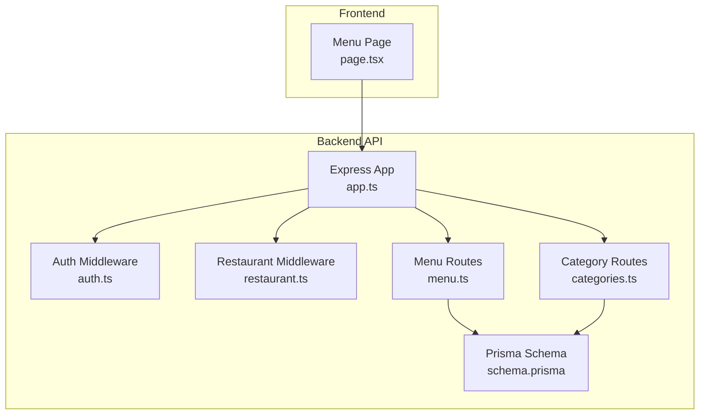
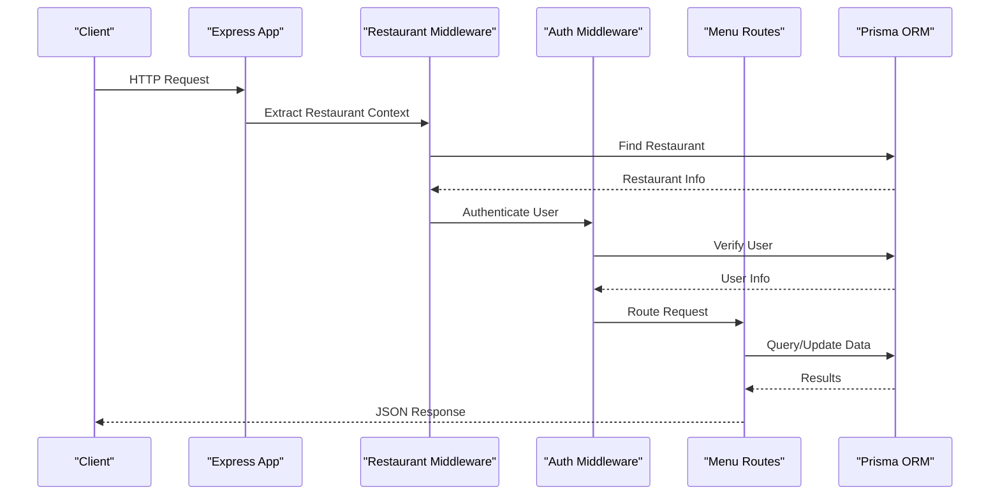
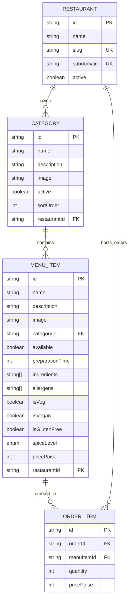
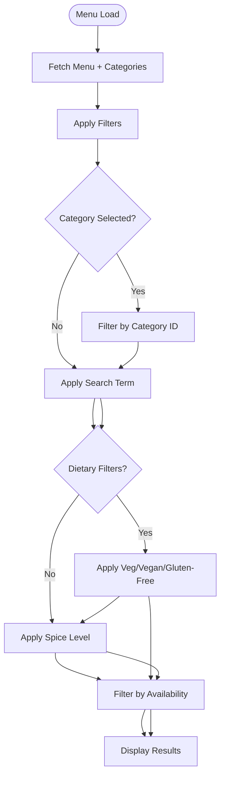
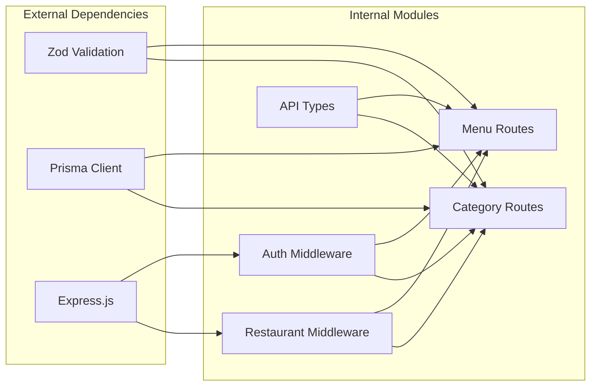

# Menu Management Endpoints

<cite>
**Referenced Files in This Document**
- [menu.ts](file://restaurant-backend/src/routes/menu.ts)
- [categories.ts](file://restaurant-backend/src/routes/categories.ts)
- [schema.prisma](file://restaurant-backend/prisma/schema.prisma)
- [restaurant.ts](file://restaurant-backend/src/middleware/restaurant.ts)
- [api.ts](file://restaurant-backend/src/types/api.ts)
- [app.ts](file://restaurant-backend/src/app.ts)
- [DeQ-Restaurants-API.postman_collection.json](file://restaurant-backend/postman/DeQ-Restaurants-API.postman_collection.json)
- [page.tsx](file://restaurant-frontend/src/app/menu/page.tsx)
- [prisma-data-examples.js](file://restaurant-backend/dist/utils/prisma-data-examples.js)
</cite>

## Table of Contents
1. [Introduction](#introduction)
2. [Project Structure](#project-structure)
3. [Core Components](#core-components)
4. [Architecture Overview](#architecture-overview)
5. [Detailed Component Analysis](#detailed-component-analysis)
6. [Dependency Analysis](#dependency-analysis)
7. [Performance Considerations](#performance-considerations)
8. [Troubleshooting Guide](#troubleshooting-guide)
9. [Conclusion](#conclusion)

## Introduction
This document provides comprehensive API documentation for menu management endpoints in the restaurant ordering system. It covers menu item CRUD operations, category management, availability controls, pricing updates, dietary information tagging, search and filtering capabilities, and integration with the broader restaurant ecosystem. The documentation includes endpoint specifications, request/response formats, authentication requirements, and practical examples derived from the codebase.

## Project Structure
The menu management functionality is implemented as part of the backend Express.js application with TypeScript and Prisma ORM. The system follows a tenant-scoped routing pattern where endpoints are prefixed with restaurant identifiers for multi-tenancy support.

**Diagram sources**
- [app.ts:110-129](file://restaurant-backend/src/app.ts#L110-L129)
- [menu.ts:1-356](file://restaurant-backend/src/routes/menu.ts#L1-L356)
- [categories.ts:1-87](file://restaurant-backend/src/routes/categories.ts#L1-L87)

**Section sources**
- [app.ts:110-129](file://restaurant-backend/src/app.ts#L110-L129)
- [schema.prisma:107-131](file://restaurant-backend/prisma/schema.prisma#L107-L131)

## Core Components
The menu management system consists of two primary route modules:

### Menu Routes Module
Handles all menu item operations including creation, updates, deletion, availability toggling, and retrieval with filtering capabilities.

### Category Routes Module  
Manages menu categories for organizational structure and dietary information tagging.

### Database Schema
Defines the relationship between restaurants, categories, and menu items with proper foreign key constraints and indexing.

**Section sources**
- [menu.ts:10-26](file://restaurant-backend/src/routes/menu.ts#L10-L26)
- [categories.ts:8-34](file://restaurant-backend/src/routes/categories.ts#L8-L34)
- [schema.prisma:90-131](file://restaurant-backend/prisma/schema.prisma#L90-L131)

## Architecture Overview
The system implements a tenant-aware architecture where each restaurant has isolated menu data. The middleware extracts restaurant context from various sources (headers, subdomains, URL parameters) and enforces role-based access control.

**Diagram sources**
- [restaurant.ts:84-208](file://restaurant-backend/src/middleware/restaurant.ts#L84-L208)
- [menu.ts:138-192](file://restaurant-backend/src/routes/menu.ts#L138-L192)

**Section sources**
- [restaurant.ts:84-208](file://restaurant-backend/src/middleware/restaurant.ts#L84-L208)
- [app.ts:110-129](file://restaurant-backend/src/app.ts#L110-L129)

## Detailed Component Analysis

### Menu Item CRUD Operations

#### GET /api/restaurants/:restaurantId/menu
Retrieves all available menu items for a restaurant with optional category filtering.

**Request Parameters:**
- Query: `categoryId` (optional) - Filter by specific category

**Response:** Array of menu items with category inclusion

**Section sources**
- [menu.ts:28-60](file://restaurant-backend/src/routes/menu.ts#L28-L60)

#### GET /api/restaurants/:restaurantId/menu/admin/all
Admin endpoint to retrieve all menu items including unavailable ones.

**Authentication:** Requires JWT token and restaurant membership
**Authorization:** OWNER, ADMIN, or STAFF roles

**Response:** Array of menu items ordered by creation date (newest first)

**Section sources**
- [menu.ts:62-89](file://restaurant-backend/src/routes/menu.ts#L62-L89)

#### GET /api/restaurants/:restaurantId/menu/:id
Retrieves a specific menu item by ID.

**Behavior:** Returns 404 if item is not available or doesn't exist

**Response:** Single menu item with category information

**Section sources**
- [menu.ts:91-135](file://restaurant-backend/src/routes/menu.ts#L91-L135)

#### POST /api/restaurants/:restaurantId/menu
Creates a new menu item.

**Authentication & Authorization:** JWT required, OWNER or ADMIN role
**Validation:** Zod schema validates all required fields

**Request Body Fields:**
- `name` (string, 2-120 chars) - Required
- `description` (string, max 600 chars) - Optional
- `pricePaise` (integer > 0) - Required
- `image` (string, valid URL) - Optional
- `categoryId` (string) - Required
- `available` (boolean) - Optional, defaults to true
- `preparationTime` (integer 1-300) - Optional, defaults to 15
- `ingredients` (array of strings) - Optional
- `allergens` (array of strings) - Optional
- `isVeg` (boolean) - Optional, defaults to true
- `isVegan` (boolean) - Optional, defaults to false
- `isGlutenFree` (boolean) - Optional, defaults to false
- `spiceLevel` (enum: NONE, MILD, MEDIUM, HOT, EXTRA_HOT) - Optional, defaults to MILD

**Response:** Created menu item with category inclusion

**Section sources**
- [menu.ts:10-26](file://restaurant-backend/src/routes/menu.ts#L10-L26)
- [menu.ts:137-192](file://restaurant-backend/src/routes/menu.ts#L137-L192)

#### PUT /api/restaurants/:restaurantId/menu/:id
Updates an existing menu item.

**Authentication & Authorization:** JWT required, OWNER or ADMIN role
**Validation:** Partial Zod schema allows selective field updates

**Request Body:** Same fields as POST, all optional

**Response:** Updated menu item with category inclusion

**Section sources**
- [menu.ts:194-268](file://restaurant-backend/src/routes/menu.ts#L194-L268)

#### PATCH /api/restaurants/:restaurantId/menu/:id/availability
Toggles menu item availability.

**Authentication & Authorization:** JWT required, OWNER or ADMIN role
**Request Body:** `{ available: boolean }`

**Response:** Updated menu item

**Section sources**
- [menu.ts:270-316](file://restaurant-backend/src/routes/menu.ts#L270-L316)

#### DELETE /api/restaurants/:restaurantId/menu/:id
Deletes a menu item.

**Authentication & Authorization:** JWT required, OWNER or ADMIN role

**Response:** Success message

**Section sources**
- [menu.ts:318-353](file://restaurant-backend/src/routes/menu.ts#L318-L353)

### Category Management Endpoints

#### GET /api/restaurants/:restaurantId/categories
Retrieves all active categories for a restaurant, sorted by sort order.

**Response:** Array of categories with active status

**Section sources**
- [categories.ts:8-34](file://restaurant-backend/src/routes/categories.ts#L8-L34)

#### GET /api/restaurants/:restaurantId/categories/:id
Retrieves a specific category by ID.

**Behavior:** Returns 404 if category is inactive or doesn't exist

**Response:** Single category object

**Section sources**
- [categories.ts:36-84](file://restaurant-backend/src/routes/categories.ts#L36-L84)

### Data Model Relationships

**Diagram sources**
- [schema.prisma:27-73](file://restaurant-backend/prisma/schema.prisma#L27-L73)
- [schema.prisma:90-131](file://restaurant-backend/prisma/schema.prisma#L90-L131)

**Section sources**
- [schema.prisma:90-131](file://restaurant-backend/prisma/schema.prisma#L90-L131)

### Search and Filtering Capabilities

The frontend implements comprehensive filtering on the client side:

**Diagram sources**
- [page.tsx:88-106](file://restaurant-frontend/src/app/menu/page.tsx#L88-L106)

**Section sources**
- [page.tsx:88-106](file://restaurant-frontend/src/app/menu/page.tsx#L88-L106)

### Dietary Information Tagging
The system supports comprehensive dietary information through multiple fields:

- **Vegetarian**: `isVeg` boolean flag
- **Vegan**: `isVegan` boolean flag  
- **Gluten-free**: `isGlutenFree` boolean flag
- **Allergens**: Array of strings for ingredient warnings
- **Ingredients**: Array of strings for transparency
- **Spice Level**: Enum with predefined levels (NONE, MILD, MEDIUM, HOT, EXTRA_HOT)

**Section sources**
- [menu.ts:10-26](file://restaurant-backend/src/routes/menu.ts#L10-L26)
- [schema.prisma:107-131](file://restaurant-backend/prisma/schema.prisma#L107-L131)

### Menu Organization Strategies
Based on the database schema, effective menu organization strategies include:

1. **Hierarchical Categories**: Use `sortOrder` field to define category hierarchy
2. **Dietary Categories**: Create separate categories for special diets (e.g., "Vegan Options")
3. **Seasonal Categories**: Temporary categories for seasonal items
4. **Cross-Selling**: Group complementary items in the same category

**Section sources**
- [schema.prisma:90-105](file://restaurant-backend/prisma/schema.prisma#L90-L105)

### Dynamic Menu Configurations
The system supports dynamic menu configurations through:

- **Availability Flags**: Enable/disable items seasonally
- **Preparation Times**: Adjust cooking times per menu item
- **Pricing Updates**: Real-time price modifications
- **Image Management**: Dynamic image URLs for menu items

**Section sources**
- [menu.ts:137-192](file://restaurant-backend/src/routes/menu.ts#L137-L192)

## Dependency Analysis

**Diagram sources**
- [menu.ts:1-8](file://restaurant-backend/src/routes/menu.ts#L1-L8)
- [categories.ts:1-6](file://restaurant-backend/src/routes/categories.ts#L1-L6)

**Section sources**
- [menu.ts:1-8](file://restaurant-backend/src/routes/menu.ts#L1-L8)
- [categories.ts:1-6](file://restaurant-backend/src/routes/categories.ts#L1-L6)

## Performance Considerations
- **Database Indexing**: Foreign keys on `categoryId` and `restaurantId` for efficient joins
- **Query Optimization**: Selective field retrieval using Prisma's include patterns
- **Caching Strategy**: Consider implementing Redis caching for frequently accessed menu data
- **Pagination**: For large menus, implement pagination in future iterations
- **Image Optimization**: CDN integration for menu images would improve load times

## Troubleshooting Guide

### Common Issues and Solutions

**Authentication Failures:**
- Ensure JWT token is included in Authorization header
- Verify token hasn't expired
- Check restaurant context is properly attached

**Authorization Errors:**
- Confirm user has OWNER, ADMIN, or STAFF role for admin endpoints
- Verify restaurant membership is active
- Check restaurant context extraction from headers/subdomain

**Data Validation Errors:**
- Price must be positive integer (in paise)
- Name length must be between 2-120 characters
- Category must be active and belong to the same restaurant
- Spice level must be one of the allowed enum values

**Section sources**
- [restaurant.ts:221-253](file://restaurant-backend/src/middleware/restaurant.ts#L221-L253)
- [menu.ts:10-26](file://restaurant-backend/src/routes/menu.ts#L10-L26)

## Conclusion
The menu management system provides comprehensive functionality for restaurant operators to manage their product catalogs effectively. The implementation includes robust validation, role-based access control, and flexible filtering capabilities. The modular architecture supports future enhancements such as bulk operations, promotional pricing, and advanced inventory tracking integrations.

Key strengths of the current implementation include:
- Strong data validation using Zod schemas
- Comprehensive dietary information support
- Flexible filtering and search capabilities
- Proper separation of concerns with dedicated route modules
- Multi-tenant architecture for scalability

Future enhancements could include:
- Bulk menu update operations
- Seasonal menu management
- Inventory tracking integration
- Promotional pricing systems
- Advanced reporting and analytics