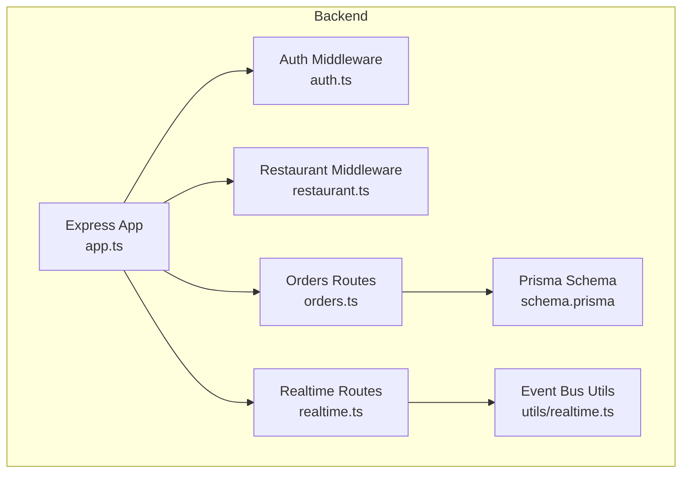
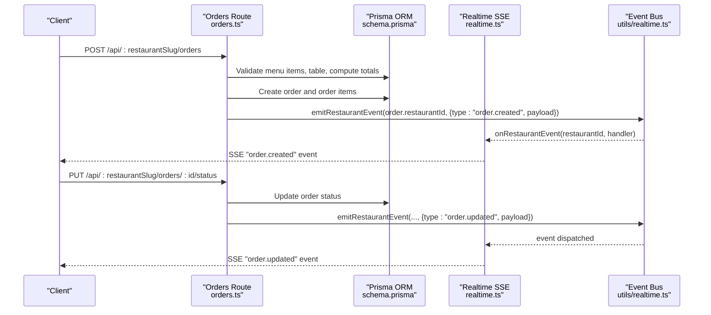
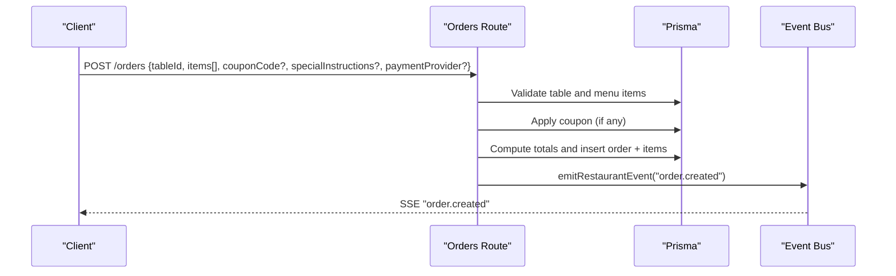
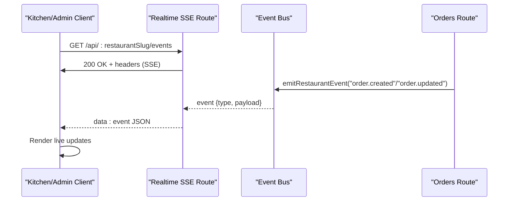
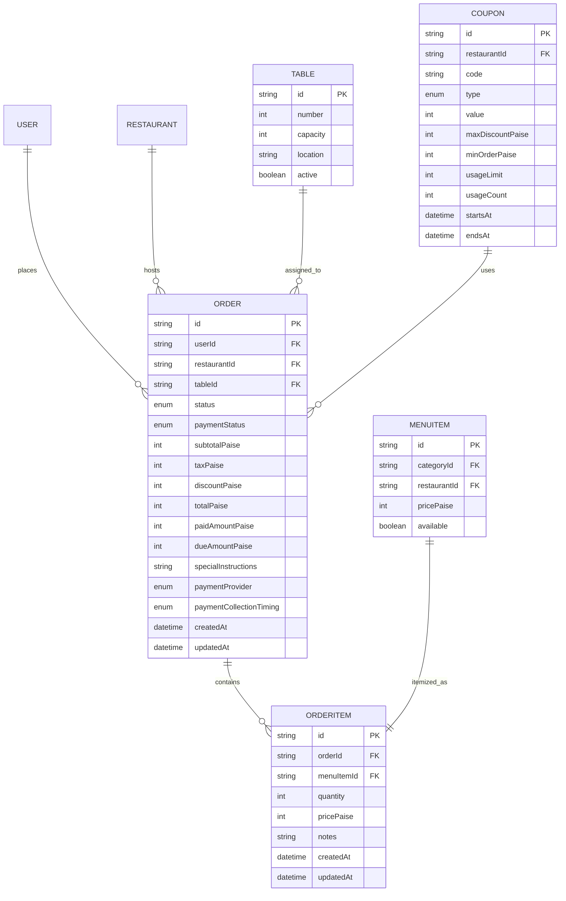
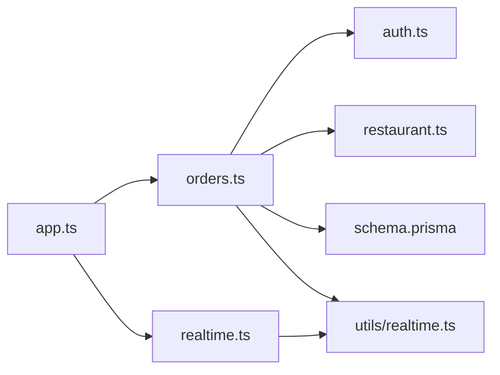

# Order Management Endpoints

<cite>
**Referenced Files in This Document**
- [orders.ts](file://restaurant-backend/src/routes/orders.ts)
- [realtime.ts](file://restaurant-backend/src/routes/realtime.ts)
- [auth.ts](file://restaurant-backend/src/middleware/auth.ts)
- [restaurant.ts](file://restaurant-backend/src/middleware/restaurant.ts)
- [api.ts](file://restaurant-backend/src/types/api.ts)
- [realtime.ts](file://restaurant-backend/src/utils/realtime.ts)
- [schema.prisma](file://restaurant-backend/prisma/schema.prisma)
- [app.ts](file://restaurant-backend/src/app.ts)
- [platform.ts](file://restaurant-backend/src/routes/platform.ts)
- [page.tsx](file://restaurant-frontend/src/app/kitchen/page.tsx)
- [page.tsx](file://restaurant-frontend/src/app/admin/page.tsx)
- [DeQ-Restaurants-API.postman_collection.json](file://restaurant-backend/postman/DeQ-Restaurants-API.postman_collection.json)
</cite>

## Table of Contents
1. [Introduction](#introduction)
2. [Project Structure](#project-structure)
3. [Core Components](#core-components)
4. [Architecture Overview](#architecture-overview)
5. [Detailed Component Analysis](#detailed-component-analysis)
6. [Dependency Analysis](#dependency-analysis)
7. [Performance Considerations](#performance-considerations)
8. [Troubleshooting Guide](#troubleshooting-guide)
9. [Conclusion](#conclusion)
10. [Appendices](#appendices)

## Introduction
This document provides comprehensive API documentation for order management endpoints. It covers the complete order lifecycle: creation, modification, cancellation, and status tracking. It details order placement with menu item validation, table assignment, and special instruction handling. It documents order status updates with role-based permissions and workflow transitions. It outlines order retrieval endpoints for customers, restaurant staff, and kitchen display systems. It also describes order history, analytics, and reporting endpoints. Finally, it addresses real-time order updates via Server-Sent Events (SSE), notifications, and WebSocket-like integrations, along with pagination strategies, filtering options, and search functionality.

## Project Structure
The order management system is implemented as Express routes mounted under a tenant-aware routing scheme. Authentication and restaurant context are enforced globally. Real-time events are emitted and streamed to clients.

**Diagram sources**
- [app.ts:110-129](file://restaurant-backend/src/app.ts#L110-L129)
- [auth.ts:1-137](file://restaurant-backend/src/middleware/auth.ts#L1-L137)
- [restaurant.ts:1-254](file://restaurant-backend/src/middleware/restaurant.ts#L1-L254)
- [orders.ts:1-694](file://restaurant-backend/src/routes/orders.ts#L1-L694)
- [realtime.ts:1-40](file://restaurant-backend/src/routes/realtime.ts#L1-L40)
- [realtime.ts:1-23](file://restaurant-backend/src/utils/realtime.ts#L1-L23)
- [schema.prisma:162-193](file://restaurant-backend/prisma/schema.prisma#L162-L193)

**Section sources**
- [app.ts:110-129](file://restaurant-backend/src/app.ts#L110-L129)
- [orders.ts:12-12](file://restaurant-backend/src/routes/orders.ts#L12-L12)
- [realtime.ts:9-37](file://restaurant-backend/src/routes/realtime.ts#L9-L37)

## Core Components
- Orders route module: Implements order creation, modification, coupon application, retrieval, status updates, and cancellations.
- Realtime SSE route: Streams order events to subscribed clients.
- Event bus utilities: Centralized event emission and subscription for restaurant-scoped events.
- Authentication and restaurant middleware: Enforce JWT-based auth and attach restaurant context.
- Types: Define order, order item, table, and API response shapes.
- Prisma schema: Defines order, order item, table, restaurant, and related entities.

Key responsibilities:
- Validate inputs, enforce business rules (e.g., payment timing, availability), and maintain financial totals.
- Emit restaurant-scoped events for real-time updates.
- Provide role-based access for staff/admin operations.

**Section sources**
- [orders.ts:82-267](file://restaurant-backend/src/routes/orders.ts#L82-L267)
- [orders.ts:269-394](file://restaurant-backend/src/routes/orders.ts#L269-L394)
- [orders.ts:396-497](file://restaurant-backend/src/routes/orders.ts#L396-L497)
- [orders.ts:499-579](file://restaurant-backend/src/routes/orders.ts#L499-L579)
- [orders.ts:581-691](file://restaurant-backend/src/routes/orders.ts#L581-L691)
- [realtime.ts:9-37](file://restaurant-backend/src/routes/realtime.ts#L9-L37)
- [realtime.ts:12-22](file://restaurant-backend/src/utils/realtime.ts#L12-L22)
- [auth.ts:7-75](file://restaurant-backend/src/middleware/auth.ts#L7-L75)
- [restaurant.ts:221-253](file://restaurant-backend/src/middleware/restaurant.ts#L221-L253)
- [api.ts:52-77](file://restaurant-backend/src/types/api.ts#L52-L77)
- [schema.prisma:162-206](file://restaurant-backend/prisma/schema.prisma#L162-L206)

## Architecture Overview
The order lifecycle is orchestrated by the orders route module, which validates inputs, enforces restaurant policies (e.g., payment collection timing), computes totals, persists data, and emits real-time events. Clients subscribe to SSE endpoints to receive live updates.

**Diagram sources**
- [orders.ts:82-267](file://restaurant-backend/src/routes/orders.ts#L82-L267)
- [orders.ts:581-629](file://restaurant-backend/src/routes/orders.ts#L581-L629)
- [realtime.ts:9-37](file://restaurant-backend/src/routes/realtime.ts#L9-L37)
- [realtime.ts:12-22](file://restaurant-backend/src/utils/realtime.ts#L12-L22)
- [schema.prisma:162-193](file://restaurant-backend/prisma/schema.prisma#L162-L193)

## Detailed Component Analysis

### Order Creation
Endpoints:
- POST /api/:restaurantSlug/orders (requires restaurant context)

Behavior:
- Validates presence of tableId and items array.
- Ensures each item has a valid menu item id and positive integer quantity.
- Verifies menu item availability and restaurant ownership.
- Applies optional coupon if provided; enforces coupon validity and minimum order thresholds.
- Computes subtotal, discount, tax, and total.
- Sets initial status to PENDING and payment status based on payment provider and payment collection timing.
- Emits a "order.created" event.

**Diagram sources**
- [orders.ts:82-267](file://restaurant-backend/src/routes/orders.ts#L82-L267)
- [orders.ts:38-48](file://restaurant-backend/src/routes/orders.ts#L38-L48)
- [orders.ts:50-80](file://restaurant-backend/src/routes/orders.ts#L50-L80)

**Section sources**
- [orders.ts:82-267](file://restaurant-backend/src/routes/orders.ts#L82-L267)
- [orders.ts:14-14](file://restaurant-backend/src/routes/orders.ts#L14-L14)
- [orders.ts:38-48](file://restaurant-backend/src/routes/orders.ts#L38-L48)
- [orders.ts:50-80](file://restaurant-backend/src/routes/orders.ts#L50-L80)

### Adding Items to an Ongoing Order
Endpoint:
- POST /api/:restaurantSlug/orders/:id/items (requires restaurant context)

Behavior:
- Validates order exists and belongs to the requesting user.
- Prevents adding items to closed orders or pay-before-meal orders mid-meal.
- Validates new items similarly to creation.
- Recomputes totals and updates payment status accordingly.
- Emits a "order.updated" event.

**Section sources**
- [orders.ts:269-394](file://restaurant-backend/src/routes/orders.ts#L269-L394)

### Applying or Replacing a Coupon
Endpoint:
- POST /api/:restaurantSlug/orders/:id/apply-coupon (requires restaurant context)

Behavior:
- Validates order exists and is unpaid.
- Applies a new coupon, recalculating totals and payment status.
- Emits a "order.updated" event.

**Section sources**
- [orders.ts:396-497](file://restaurant-backend/src/routes/orders.ts#L396-L497)

### Retrieving Orders
Endpoints:
- GET /api/:restaurantSlug/orders (customer endpoint)
- GET /api/:restaurantSlug/orders/restaurant/all (staff/admin endpoint)
- GET /api/:restaurantSlug/orders/:id (customer endpoint)

Behavior:
- Customer endpoints restrict by userId and restaurantId.
- Staff/admin endpoint retrieves all orders for the restaurant, ordered by creation time.

**Section sources**
- [orders.ts:499-524](file://restaurant-backend/src/routes/orders.ts#L499-L524)
- [orders.ts:526-546](file://restaurant-backend/src/routes/orders.ts#L526-L546)
- [orders.ts:548-579](file://restaurant-backend/src/routes/orders.ts#L548-L579)

### Updating Order Status
Endpoint:
- PUT /api/:restaurantSlug/orders/:id/status (requires authorized restaurant role)

Behavior:
- Requires OWNER, ADMIN, or STAFF roles.
- Enforces payment completion prerequisite for pay-before-meal orders before advancing to CONFIRMED/PREPARING/READY/SERVED/COMPLETED.
- Emits a "order.updated" event.

**Section sources**
- [orders.ts:581-629](file://restaurant-backend/src/routes/orders.ts#L581-L629)
- [restaurant.ts:221-253](file://restaurant-backend/src/middleware/restaurant.ts#L221-L253)

### Cancelling an Order
Endpoint:
- PUT /api/:restaurantSlug/orders/:id/cancel (requires restaurant context)

Behavior:
- Allows cancellation only when status is PENDING or CONFIRMED and no payment has been captured.
- Updates status to CANCELLED and paymentStatus to FAILED.
- Emits a "order.updated" event.

**Section sources**
- [orders.ts:631-691](file://restaurant-backend/src/routes/orders.ts#L631-L691)

### Real-Time Updates via Server-Sent Events (SSE)
Endpoint:
- GET /api/:restaurantSlug/events (authenticated, requires restaurant context)

Behavior:
- Establishes an SSE stream with periodic ping messages.
- Subscribes to restaurant-scoped events and streams them to the client.
- Used by kitchen and admin dashboards to reflect live order changes.

**Diagram sources**
- [realtime.ts:9-37](file://restaurant-backend/src/routes/realtime.ts#L9-L37)
- [realtime.ts:12-22](file://restaurant-backend/src/utils/realtime.ts#L12-L22)
- [orders.ts:254-257](file://restaurant-backend/src/routes/orders.ts#L254-L257)
- [orders.ts:381-384](file://restaurant-backend/src/routes/orders.ts#L381-L384)
- [orders.ts:620-623](file://restaurant-backend/src/routes/orders.ts#L620-L623)
- [orders.ts:682-685](file://restaurant-backend/src/routes/orders.ts#L682-L685)

**Section sources**
- [realtime.ts:9-37](file://restaurant-backend/src/routes/realtime.ts#L9-L37)
- [realtime.ts:12-22](file://restaurant-backend/src/utils/realtime.ts#L12-L22)
- [orders.ts:254-257](file://restaurant-backend/src/routes/orders.ts#L254-L257)
- [orders.ts:381-384](file://restaurant-backend/src/routes/orders.ts#L381-L384)
- [orders.ts:620-623](file://restaurant-backend/src/routes/orders.ts#L620-L623)
- [orders.ts:682-685](file://restaurant-backend/src/routes/orders.ts#L682-L685)

### Role-Based Permissions and Workflow Transitions
- Authentication middleware verifies JWT and attaches user.
- Restaurant middleware attaches restaurant context from slug/subdomain/host or URL parameters.
- Authorize middleware checks roles OWNER, ADMIN, STAFF for status updates.
- Payment collection timing influences allowed transitions (e.g., pay-before-meal orders cannot advance until payment completes).

**Section sources**
- [auth.ts:7-75](file://restaurant-backend/src/middleware/auth.ts#L7-L75)
- [restaurant.ts:84-208](file://restaurant-backend/src/middleware/restaurant.ts#L84-L208)
- [restaurant.ts:221-253](file://restaurant-backend/src/middleware/restaurant.ts#L221-L253)
- [orders.ts:600-609](file://restaurant-backend/src/routes/orders.ts#L600-L609)

### Data Models and Relationships

**Diagram sources**
- [schema.prisma:162-206](file://restaurant-backend/prisma/schema.prisma#L162-L206)
- [schema.prisma:224-245](file://restaurant-backend/prisma/schema.prisma#L224-L245)
- [api.ts:52-77](file://restaurant-backend/src/types/api.ts#L52-L77)

**Section sources**
- [schema.prisma:162-206](file://restaurant-backend/prisma/schema.prisma#L162-L206)
- [api.ts:52-77](file://restaurant-backend/src/types/api.ts#L52-L77)

### Analytics and Reporting Endpoints
Platform-level analytics endpoints:
- GET /api/platform/orders: Retrieve paginated orders with restaurant and user metadata.
- GET /api/platform/earnings: Aggregated earnings by restaurant and totals.

These endpoints support administrative reporting and insights.

**Section sources**
- [platform.ts:205-242](file://restaurant-backend/src/routes/platform.ts#L205-L242)
- [platform.ts:244-308](file://restaurant-backend/src/routes/platform.ts#L244-L308)

### Frontend Integration Notes
- Kitchen dashboard groups orders by status and supports advancing status and cancellation.
- Admin dashboard allows selecting and updating order statuses.

**Section sources**
- [page.tsx:181-206](file://restaurant-frontend/src/app/kitchen/page.tsx#L181-L206)
- [page.tsx:210-239](file://restaurant-frontend/src/app/kitchen/page.tsx#L210-L239)
- [page.tsx:573-590](file://restaurant-frontend/src/app/admin/page.tsx#L573-L590)

## Dependency Analysis

**Diagram sources**
- [orders.ts:1-9](file://restaurant-backend/src/routes/orders.ts#L1-L9)
- [auth.ts:1-7](file://restaurant-backend/src/middleware/auth.ts#L1-L7)
- [restaurant.ts:1-5](file://restaurant-backend/src/middleware/restaurant.ts#L1-L5)
- [realtime.ts:1-6](file://restaurant-backend/src/routes/realtime.ts#L1-L6)
- [realtime.ts:12-22](file://restaurant-backend/src/utils/realtime.ts#L12-L22)
- [app.ts:110-129](file://restaurant-backend/src/app.ts#L110-L129)

**Section sources**
- [orders.ts:1-9](file://restaurant-backend/src/routes/orders.ts#L1-L9)
- [realtime.ts:12-22](file://restaurant-backend/src/utils/realtime.ts#L12-L22)
- [app.ts:110-129](file://restaurant-backend/src/app.ts#L110-L129)

## Performance Considerations
- Use selective includes/selection to minimize payload sizes for order retrieval.
- Leverage database indexes on frequently queried fields (e.g., restaurantId, userId, status, createdAt).
- Batch operations: Prefer single transactional writes for order creation and item additions to reduce round trips.
- SSE streaming: Keep event payloads minimal; avoid sending redundant fields.
- Pagination: Limit result sets (e.g., take: 500) for platform reports to control memory and latency.

## Troubleshooting Guide
Common issues and resolutions:
- Unauthorized or missing token: Ensure Authorization header contains a valid Bearer token.
- Restaurant context required: Verify x-restaurant-slug/x-restaurant-subdomain headers or slug-based URL.
- Invalid or inactive coupon: Check coupon validity, usage limits, and minimum order thresholds.
- Payment collection timing restrictions: Pay-before-meal orders cannot advance until payment is completed.
- Order not found: Confirm order id, user ownership, and restaurant context.
- Cash payment disabled: Verify restaurant configuration for cash payments.

**Section sources**
- [auth.ts:7-75](file://restaurant-backend/src/middleware/auth.ts#L7-L75)
- [restaurant.ts:210-219](file://restaurant-backend/src/middleware/restaurant.ts#L210-L219)
- [orders.ts:50-80](file://restaurant-backend/src/routes/orders.ts#L50-L80)
- [orders.ts:600-609](file://restaurant-backend/src/routes/orders.ts#L600-L609)
- [orders.ts:423-429](file://restaurant-backend/src/routes/orders.ts#L423-L429)

## Conclusion
The order management system provides a robust, tenant-scoped API for placing, modifying, and tracking orders. It enforces restaurant policies around payment timing, validates menu items and tables, and maintains accurate financial computations. Real-time updates are delivered via SSE, enabling responsive kitchen and admin dashboards. Platform-level analytics and reporting endpoints support operational insights.

## Appendices

### Endpoint Reference

- POST /api/:restaurantSlug/orders
  - Body: { tableId, items[], couponCode?, specialInstructions?, paymentProvider? }
  - Auth: Required
  - Roles: N/A
  - Description: Creates a new order with validation and emits "order.created".

- POST /api/:restaurantSlug/orders/:id/items
  - Body: { items[], specialInstructions? }
  - Auth: Required
  - Roles: N/A
  - Description: Adds items to an ongoing order; recomputes totals and emits "order.updated".

- POST /api/:restaurantSlug/orders/:id/apply-coupon
  - Body: { couponCode }
  - Auth: Required
  - Roles: N/A
  - Description: Applies or replaces a coupon on an unpaid order; emits "order.updated".

- GET /api/:restaurantSlug/orders
  - Query: None
  - Auth: Required
  - Roles: N/A
  - Description: Retrieves customer orders for the current restaurant.

- GET /api/:restaurantSlug/orders/restaurant/all
  - Query: None
  - Auth: Required
  - Roles: OWNER, ADMIN, STAFF
  - Description: Retrieves all orders for the restaurant.

- GET /api/:restaurantSlug/orders/:id
  - Path: { id }
  - Auth: Required
  - Roles: N/A
  - Description: Retrieves a specific order by id.

- PUT /api/:restaurantSlug/orders/:id/status
  - Body: { status }
  - Auth: Required
  - Roles: OWNER, ADMIN, STAFF
  - Description: Updates order status with payment timing validations; emits "order.updated".

- PUT /api/:restaurantSlug/orders/:id/cancel
  - Body: None
  - Auth: Required
  - Roles: N/A
  - Description: Cancels an order if eligible; emits "order.updated".

- GET /api/:restaurantSlug/events
  - Query: None
  - Auth: Required
  - Roles: N/A
  - Description: SSE endpoint for real-time order events.

- GET /api/platform/orders
  - Query: { restaurantId? }
  - Auth: Required
  - Roles: OWNER
  - Description: Paginated orders for platform analytics.

- GET /api/platform/earnings
  - Query: None
  - Auth: Required
  - Roles: OWNER
  - Description: Aggregated earnings by restaurant and totals.

**Section sources**
- [orders.ts:82-267](file://restaurant-backend/src/routes/orders.ts#L82-L267)
- [orders.ts:269-394](file://restaurant-backend/src/routes/orders.ts#L269-L394)
- [orders.ts:396-497](file://restaurant-backend/src/routes/orders.ts#L396-L497)
- [orders.ts:499-579](file://restaurant-backend/src/routes/orders.ts#L499-L579)
- [orders.ts:581-691](file://restaurant-backend/src/routes/orders.ts#L581-L691)
- [realtime.ts:9-37](file://restaurant-backend/src/routes/realtime.ts#L9-L37)
- [platform.ts:205-242](file://restaurant-backend/src/routes/platform.ts#L205-L242)
- [platform.ts:244-308](file://restaurant-backend/src/routes/platform.ts#L244-L308)

### Data Model Definitions
- Order: Fields include identifiers, status enums, monetary amounts, payment metadata, and timestamps.
- OrderItem: Links orders to menu items with quantity and notes.
- Table: Table metadata for seat assignment.
- Coupon: Discount rules tied to restaurant.

**Section sources**
- [api.ts:52-77](file://restaurant-backend/src/types/api.ts#L52-L77)
- [schema.prisma:162-206](file://restaurant-backend/prisma/schema.prisma#L162-L206)

### Real-Time Event Payload
- Type: "order.created" or "order.updated"
- Payload: Includes order id, status, paymentStatus, paymentProvider, monetary fields, and timestamps.

**Section sources**
- [orders.ts:38-48](file://restaurant-backend/src/routes/orders.ts#L38-L48)
- [orders.ts:254-257](file://restaurant-backend/src/routes/orders.ts#L254-L257)
- [orders.ts:381-384](file://restaurant-backend/src/routes/orders.ts#L381-L384)
- [orders.ts:620-623](file://restaurant-backend/src/routes/orders.ts#L620-L623)
- [orders.ts:682-685](file://restaurant-backend/src/routes/orders.ts#L682-L685)

### Example Postman Collection References
- Status update example: See collection entry for updating order status.

**Section sources**
- [DeQ-Restaurants-API.postman_collection.json:685-698](file://restaurant-backend/postman/DeQ-Restaurants-API.postman_collection.json#L685-L698)