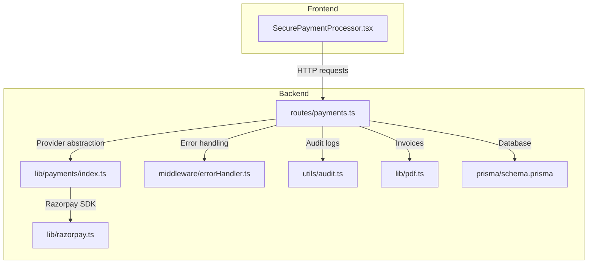
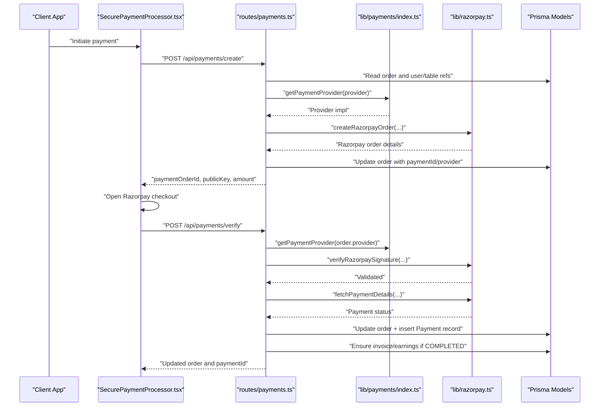
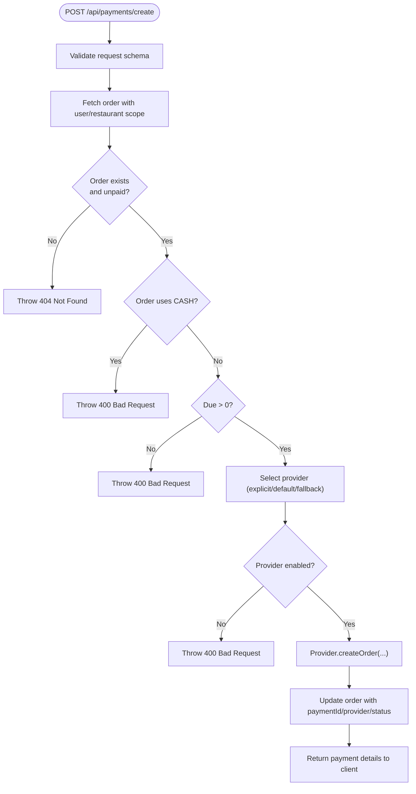
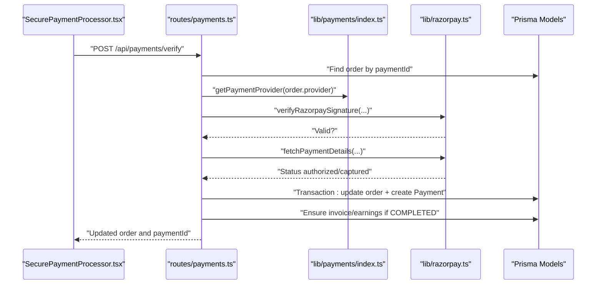
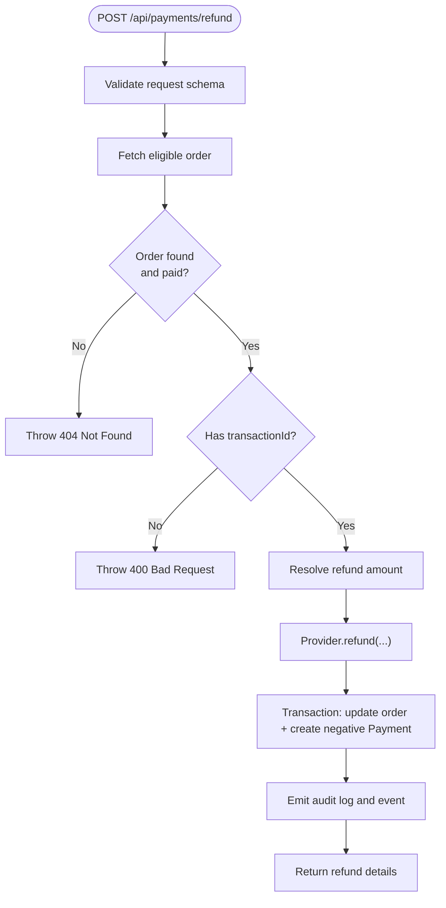
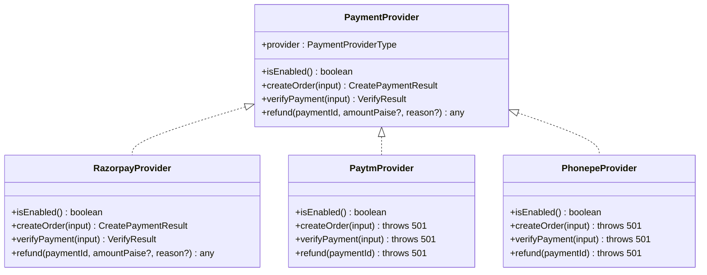
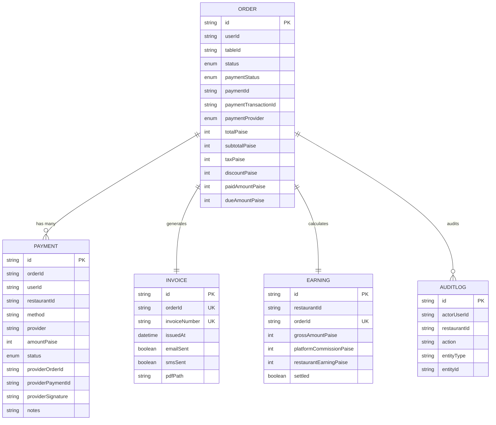
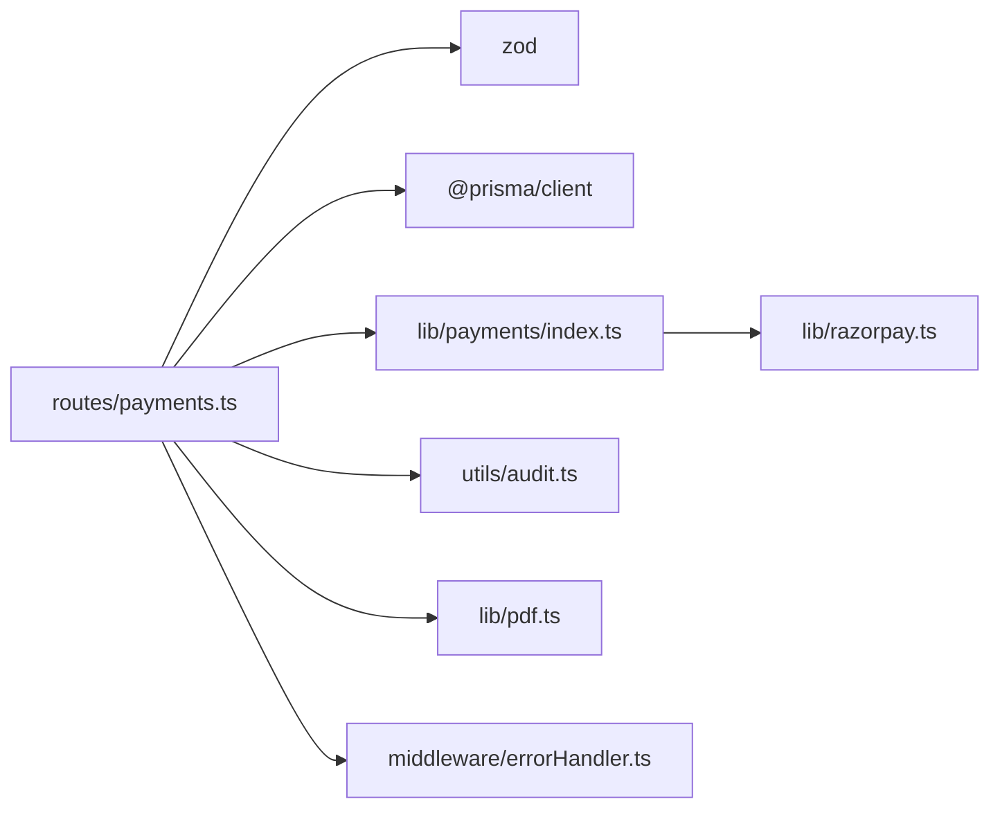

# Payment Processing Endpoints

<cite>
**Referenced Files in This Document**
- [payments.ts](file://restaurant-backend/src/routes/payments.ts)
- [index.ts](file://restaurant-backend/src/lib/payments/index.ts)
- [razorpay.ts](file://restaurant-backend/src/lib/razorpay.ts)
- [errorHandler.ts](file://restaurant-backend/src/middleware/errorHandler.ts)
- [schema.prisma](file://restaurant-backend/prisma/schema.prisma)
- [api.ts](file://restaurant-backend/src/types/api.ts)
- [SecurePaymentProcessor.tsx](file://restaurant-frontend/src/components/SecurePaymentProcessor.tsx)
- [pdf.ts](file://restaurant-backend/src/lib/pdf.ts)
- [audit.ts](file://restaurant-backend/src/utils/audit.ts)
- [package.json](file://restaurant-backend/package.json)
</cite>

## Table of Contents
1. [Introduction](#introduction)
2. [Project Structure](#project-structure)
3. [Core Components](#core-components)
4. [Architecture Overview](#architecture-overview)
5. [Detailed Component Analysis](#detailed-component-analysis)
6. [Dependency Analysis](#dependency-analysis)
7. [Performance Considerations](#performance-considerations)
8. [Troubleshooting Guide](#troubleshooting-guide)
9. [Conclusion](#conclusion)
10. [Appendices](#appendices)

## Introduction
This document provides comprehensive API documentation for the payment processing endpoints powering online ordering and payment workflows. It covers:
- Payment creation with order association and amount computation
- Razorpay signature verification and transaction status checks
- Payment status retrieval, refund processing, and error handling
- Request validation schemas, webhook integration patterns, and security considerations
- Provider abstraction supporting multiple payment gateways
- PCI compliance, encryption, and fraud prevention measures
- End-to-end payment flows, failure scenarios, and retry strategies

## Project Structure
The payment system spans backend route handlers, provider abstraction, gateway integrations, database models, and frontend payment UI.

**Diagram sources**
- [payments.ts:1-731](file://restaurant-backend/src/routes/payments.ts#L1-L731)
- [index.ts:1-124](file://restaurant-backend/src/lib/payments/index.ts#L1-L124)
- [razorpay.ts:1-219](file://restaurant-backend/src/lib/razorpay.ts#L1-L219)
- [errorHandler.ts:1-82](file://restaurant-backend/src/middleware/errorHandler.ts#L1-L82)
- [audit.ts:1-17](file://restaurant-backend/src/utils/audit.ts#L1-L17)
- [pdf.ts:1-334](file://restaurant-backend/src/lib/pdf.ts#L1-L334)
- [schema.prisma:162-296](file://restaurant-backend/prisma/schema.prisma#L162-L296)

**Section sources**
- [payments.ts:1-731](file://restaurant-backend/src/routes/payments.ts#L1-L731)
- [index.ts:1-124](file://restaurant-backend/src/lib/payments/index.ts#L1-L124)
- [razorpay.ts:1-219](file://restaurant-backend/src/lib/razorpay.ts#L1-L219)
- [schema.prisma:162-296](file://restaurant-backend/prisma/schema.prisma#L162-L296)

## Core Components
- Payment routes module exposes endpoints for provider discovery, payment creation, verification, refund, status retrieval, cash confirmation, and manual status updates.
- Provider abstraction layer defines a uniform interface for payment providers and currently implements Razorpay with placeholders for PAYTM and PHONEPE.
- Razorpay integration encapsulates order creation, signature verification, payment capture, refunds, and webhook signature validation.
- Database models define orders, payments, invoices, earnings, and audit logs with strict enums for statuses and providers.
- Frontend payment UI integrates securely with Razorpay checkout and handles verification with timeout protection.

**Section sources**
- [payments.ts:180-728](file://restaurant-backend/src/routes/payments.ts#L180-L728)
- [index.ts:32-124](file://restaurant-backend/src/lib/payments/index.ts#L32-L124)
- [razorpay.ts:33-219](file://restaurant-backend/src/lib/razorpay.ts#L33-L219)
- [schema.prisma:162-296](file://restaurant-backend/prisma/schema.prisma#L162-L296)
- [SecurePaymentProcessor.tsx:83-206](file://restaurant-frontend/src/components/SecurePaymentProcessor.tsx#L83-L206)

## Architecture Overview
The payment flow is orchestrated by the routes module, validated by Zod schemas, executed through the provider abstraction, and persisted via Prisma. Audit logging and invoice generation occur upon completion.

**Diagram sources**
- [payments.ts:196-407](file://restaurant-backend/src/routes/payments.ts#L196-L407)
- [index.ts:40-81](file://restaurant-backend/src/lib/payments/index.ts#L40-L81)
- [razorpay.ts:33-195](file://restaurant-backend/src/lib/razorpay.ts#L33-L195)
- [schema.prisma:162-296](file://restaurant-backend/prisma/schema.prisma#L162-L296)

## Detailed Component Analysis

### Payment Creation Endpoint
- Endpoint: POST /api/payments/create
- Purpose: Create a provider-specific payment order linked to an existing order, compute due amount, and prepare client-side keys.
- Validation: Zod schema enforces presence of orderId and optional preferred provider.
- Business logic:
  - Fetch order scoped to user and restaurant with allowed payment statuses.
  - Reject if order uses cash or is already fully paid.
  - Determine provider (explicit, order default, or fallback) and ensure it is enabled.
  - Delegate to provider to create an order with amountPaise equal to due or total, and notes containing order/user/table metadata.
  - Persist provider orderId and status to the order.
  - Return structured response with paymentOrderId, amount, currency, provider, and public key for client-side checkout.

**Diagram sources**
- [payments.ts:196-292](file://restaurant-backend/src/routes/payments.ts#L196-L292)
- [index.ts:40-59](file://restaurant-backend/src/lib/payments/index.ts#L40-L59)

**Section sources**
- [payments.ts:16-292](file://restaurant-backend/src/routes/payments.ts#L16-L292)
- [index.ts:11-59](file://restaurant-backend/src/lib/payments/index.ts#L11-L59)

### Payment Verification Endpoint
- Endpoint: POST /api/payments/verify
- Purpose: Validate Razorpay signature and transaction status, then atomically update order and persist payment record.
- Validation: Zod schema enforces presence of razorpay identifiers.
- Business logic:
  - Locate order by paymentId and user/restaurant scope.
  - If already COMPLETED, short-circuit with success.
  - Retrieve provider and delegate verification to provider implementation.
  - Compute paid/due amounts and derived status.
  - Perform database transaction to update order and create a Payment record.
  - Emit audit log and real-time event.
  - Optionally generate invoice and earnings if now fully paid.

**Diagram sources**
- [payments.ts:294-407](file://restaurant-backend/src/routes/payments.ts#L294-L407)
- [index.ts:60-81](file://restaurant-backend/src/lib/payments/index.ts#L60-L81)
- [razorpay.ts:65-195](file://restaurant-backend/src/lib/razorpay.ts#L65-L195)

**Section sources**
- [payments.ts:294-407](file://restaurant-backend/src/routes/payments.ts#L294-L407)
- [index.ts:26-81](file://restaurant-backend/src/lib/payments/index.ts#L26-L81)
- [razorpay.ts:65-195](file://restaurant-backend/src/lib/razorpay.ts#L65-L195)

### Refund Processing Endpoint
- Endpoint: POST /api/payments/refund
- Purpose: Issue refunds against a prior payment transaction.
- Validation: Zod schema enforces orderId and optional amount/reason.
- Business logic:
  - Fetch order in eligible states and ensure transactionId exists.
  - Resolve refund amount (explicit or full paid).
  - Delegate to provider refund function.
  - Atomically update order status and insert negative Payment record.
  - Emit audit log and real-time event.

**Diagram sources**
- [payments.ts:409-516](file://restaurant-backend/src/routes/payments.ts#L409-L516)
- [index.ts:78-81](file://restaurant-backend/src/lib/payments/index.ts#L78-L81)

**Section sources**
- [payments.ts:27-516](file://restaurant-backend/src/routes/payments.ts#L27-L516)
- [index.ts:78-81](file://restaurant-backend/src/lib/payments/index.ts#L78-L81)

### Payment Status Retrieval
- Endpoint: GET /api/payments/status/:orderId
- Purpose: Retrieve order with latest payment records for display.
- Validation: Path param enforced.
- Behavior: Returns order with ordered payments and selected fields.

**Section sources**
- [payments.ts:518-568](file://restaurant-backend/src/routes/payments.ts#L518-L568)
- [api.ts:107-114](file://restaurant-backend/src/types/api.ts#L107-L114)

### Cash Payment Confirmation
- Endpoint: POST /api/payments/cash/confirm
- Purpose: Allow restaurant admin to confirm cash payments for CASH orders.
- Validation: Zod schema enforces orderId and optional amountPaise.
- Behavior: Computes paid/due amounts, updates order and inserts Payment record, emits events and audit logs.

**Section sources**
- [payments.ts:570-646](file://restaurant-backend/src/routes/payments.ts#L570-L646)

### Manual Payment Status Update
- Endpoint: PUT /api/payments/status
- Purpose: Forcefully update payment/order status and paid amount (admin-only).
- Validation: Zod schema enforces orderId, status, and optional paidAmountPaise.
- Behavior: Computes derived status, auto-confirm order if fully paid, and emits events.

**Section sources**
- [payments.ts:648-728](file://restaurant-backend/src/routes/payments.ts#L648-L728)

### Provider Abstraction and Multi-Provider Support
- Provider interface defines isEnabled, createOrder, verifyPayment, and refund.
- Current implementation:
  - RAZORPAY: Fully implemented with order creation, signature verification, payment fetch, capture, and refund.
  - PAYTM/PHONEPE: Placeholders that throw 501 when invoked.
- Provider selection respects environment configuration and enables runtime provider discovery.

**Diagram sources**
- [index.ts:32-124](file://restaurant-backend/src/lib/payments/index.ts#L32-L124)

**Section sources**
- [index.ts:32-124](file://restaurant-backend/src/lib/payments/index.ts#L32-L124)

### Razorpay Integration Details
- Order creation: Uses amount in paise, currency INR, and optional notes.
- Signature verification: HMAC-SHA256 over concatenated order_id|payment_id using key_secret.
- Payment capture: Optional step depending on gateway configuration.
- Refunds: Supports partial and full refunds with optional notes.
- Webhook signature validation: Validates HMAC-SHA256 using webhook secret.

**Section sources**
- [razorpay.ts:33-219](file://restaurant-backend/src/lib/razorpay.ts#L33-L219)

### Data Models and Relationships
- Orders: Payment metadata, totals, and status.
- Payments: Individual transactions per order with provider details.
- Invoice: Generated upon full payment completion.
- Earning: Platform commission and restaurant earnings computed per order.
- AuditLog: Operational audit trail for payment actions.

**Diagram sources**
- [schema.prisma:162-324](file://restaurant-backend/prisma/schema.prisma#L162-L324)

**Section sources**
- [schema.prisma:162-324](file://restaurant-backend/prisma/schema.prisma#L162-L324)

### Request Validation Schemas
- createPaymentSchema: orderId required; paymentProvider optional enum.
- verifyPaymentSchema: razorpay identifiers required.
- refundPaymentSchema: orderId required; amount optional; reason optional.
- cashConfirmSchema: orderId required; amountPaise optional.
- updatePaymentStatusSchema: orderId required; paymentStatus enum; paidAmountPaise optional for PARTIALLY_PAID.

**Section sources**
- [payments.ts:16-42](file://restaurant-backend/src/routes/payments.ts#L16-L42)

### Frontend Payment Flow
- Initiates payment by calling backend create endpoint.
- For RAZORPAY, loads checkout script and opens modal with returned keys.
- On success, posts signature to backend verify endpoint with timeout protection.
- Displays verification status and transitions to order summary upon success.

**Section sources**
- [SecurePaymentProcessor.tsx:83-206](file://restaurant-frontend/src/components/SecurePaymentProcessor.tsx#L83-L206)

## Dependency Analysis
- Route handlers depend on:
  - Zod for validation
  - Prisma for persistence
  - Provider abstraction for gateway operations
  - Razorpay library for gateway-specific operations
  - Audit utilities for operational logs
  - PDF utilities for invoice generation
- Provider abstraction isolates gateway specifics and enables future multi-provider expansion.

**Diagram sources**
- [payments.ts:1-14](file://restaurant-backend/src/routes/payments.ts#L1-L14)
- [index.ts:1-10](file://restaurant-backend/src/lib/payments/index.ts#L1-L10)
- [razorpay.ts:1-10](file://restaurant-backend/src/lib/razorpay.ts#L1-L10)
- [errorHandler.ts:1-10](file://restaurant-backend/src/middleware/errorHandler.ts#L1-L10)
- [audit.ts:1-10](file://restaurant-backend/src/utils/audit.ts#L1-L10)
- [pdf.ts:1-14](file://restaurant-backend/src/lib/pdf.ts#L1-L14)

**Section sources**
- [payments.ts:1-14](file://restaurant-backend/src/routes/payments.ts#L1-L14)
- [index.ts:1-10](file://restaurant-backend/src/lib/payments/index.ts#L1-L10)
- [razorpay.ts:1-10](file://restaurant-backend/src/lib/razorpay.ts#L1-L10)
- [errorHandler.ts:1-10](file://restaurant-backend/src/middleware/errorHandler.ts#L1-L10)
- [audit.ts:1-10](file://restaurant-backend/src/utils/audit.ts#L1-L10)
- [pdf.ts:1-14](file://restaurant-backend/src/lib/pdf.ts#L1-L14)

## Performance Considerations
- Transaction boundaries: Use Prisma transactions for atomic order and payment updates to prevent inconsistent states.
- Logging: Structured logs include timing metrics for order creation and payment fetch to aid performance monitoring.
- Asynchronous flows: Verification uses a timeout to avoid hanging UIs; consider retry policies on the client for transient failures.
- Provider caching: Reuse Razorpay instance to minimize initialization overhead.

[No sources needed since this section provides general guidance]

## Troubleshooting Guide
Common issues and remedies:
- Validation errors: Ensure request bodies conform to Zod schemas; backend returns 400 with contextual messages.
- Order not found or unauthorized: Verify orderId belongs to the authenticated user and restaurant and is in allowed payment states.
- Provider not enabled: Confirm environment variables for the chosen provider are configured; enabled providers are returned by GET /providers.
- Signature verification failures: Check that razorpay identifiers are present and correct; backend validates HMAC-SHA256 signatures.
- Payment not successful: Ensure payment status is authorized/captured; otherwise, reject verification.
- Refund errors: Ensure order has a paymentTransactionId and provider supports refund operations.
- Audit logs: If audit table is missing, writes are skipped gracefully to avoid blocking core flows.

**Section sources**
- [errorHandler.ts:22-82](file://restaurant-backend/src/middleware/errorHandler.ts#L22-L82)
- [payments.ts:225-235](file://restaurant-backend/src/routes/payments.ts#L225-L235)
- [index.ts:42-76](file://restaurant-backend/src/lib/payments/index.ts#L42-L76)
- [audit.ts:5-16](file://restaurant-backend/src/utils/audit.ts#L5-L16)

## Conclusion
The payment processing system provides a robust, extensible, and secure foundation for online payments. It leverages a provider abstraction for multi-gateway support, enforces strict validation and error handling, and integrates with audit and invoicing systems. The frontend ensures secure checkout with timely verification feedback.

[No sources needed since this section summarizes without analyzing specific files]

## Appendices

### API Definitions

- GET /api/payments/providers
  - Description: Lists enabled providers plus CASH if restaurant allows it.
  - Response: Array of provider identifiers.

- POST /api/payments/create
  - Body: { orderId: string, paymentProvider?: 'RAZORPAY' | 'PAYTM' | 'PHONEPE' }
  - Response: { paymentOrderId, amountPaise, currency, provider, publicKey, redirectUrl?, orderId, customerDetails }

- POST /api/payments/verify
  - Body: { razorpay_order_id: string, razorpay_payment_id: string, razorpay_signature: string }
  - Response: { order, paymentId }

- POST /api/payments/refund
  - Body: { orderId: string, amount?: number, reason?: string }
  - Response: { refundId, amount, status }

- GET /api/payments/status/:orderId
  - Path: orderId
  - Response: { order }

- POST /api/payments/cash/confirm
  - Body: { orderId: string, amountPaise?: number }
  - Response: { order }

- PUT /api/payments/status
  - Body: { orderId: string, paymentStatus: enum, paidAmountPaise?: number }
  - Response: { order }

**Section sources**
- [payments.ts:180-728](file://restaurant-backend/src/routes/payments.ts#L180-L728)
- [api.ts:107-114](file://restaurant-backend/src/types/api.ts#L107-L114)

### Security Considerations
- PCI DSS: Payment instrument data is handled by the provider; backend receives only identifiers and signatures.
- Encryption: HTTPS transport and provider-side encryption; sensitive logs redact full signatures.
- Signature validation: HMAC-SHA256 verification for payment and webhook signatures.
- Access control: Endpoints enforce user and restaurant scoping; admin-only endpoints restrict roles.
- Environment variables: Provider credentials and webhook secrets are loaded from environment.

**Section sources**
- [razorpay.ts:65-105](file://restaurant-backend/src/lib/razorpay.ts#L65-L105)
- [index.ts:42-81](file://restaurant-backend/src/lib/payments/index.ts#L42-L81)
- [payments.ts:4-12](file://restaurant-backend/src/routes/payments.ts#L4-L12)

### Webhook Integration Patterns
- Webhook signature validation: Use validateWebhookSignature with webhook secret to ensure authenticity.
- Event-driven updates: Consider emitting and listening to real-time events for payment state changes.
- Idempotency: Backend verifies order existence and status to avoid duplicate processing.

**Section sources**
- [razorpay.ts:200-219](file://restaurant-backend/src/lib/razorpay.ts#L200-L219)
- [payments.ts:392-395](file://restaurant-backend/src/routes/payments.ts#L392-L395)

### Examples: Payment Flows

- Successful online payment:
  1. Client calls POST /api/payments/create → receives paymentOrderId and publicKey.
  2. Client opens provider checkout and completes payment.
  3. Client calls POST /api/payments/verify with returned identifiers.
  4. Backend validates signature, fetches payment status, updates order and payment records, and emits events.

- Partial payment followed by full cash confirmation:
  1. Online partial payment occurs; order moves to PARTIALLY_PAID.
  2. Restaurant admin confirms remaining cash via POST /api/payments/cash/confirm.
  3. Order updates to COMPLETED and invoice/earnings ensured.

- Refund scenario:
  1. Client calls POST /api/payments/refund with optional amount/reason.
  2. Provider issues refund; backend updates order and inserts negative Payment record.

**Section sources**
- [payments.ts:196-407](file://restaurant-backend/src/routes/payments.ts#L196-L407)
- [payments.ts:570-646](file://restaurant-backend/src/routes/payments.ts#L570-L646)
- [payments.ts:409-516](file://restaurant-backend/src/routes/payments.ts#L409-L516)

### Retry Mechanisms
- Frontend verification timeout: 25 seconds; on timeout, prompt user to retry or contact support.
- Idempotent operations: Provider operations should be designed to tolerate retries; backend guards against duplicate processing via order state checks.

**Section sources**
- [SecurePaymentProcessor.tsx:158-173](file://restaurant-frontend/src/components/SecurePaymentProcessor.tsx#L158-L173)
- [payments.ts:310-317](file://restaurant-backend/src/routes/payments.ts#L310-L317)