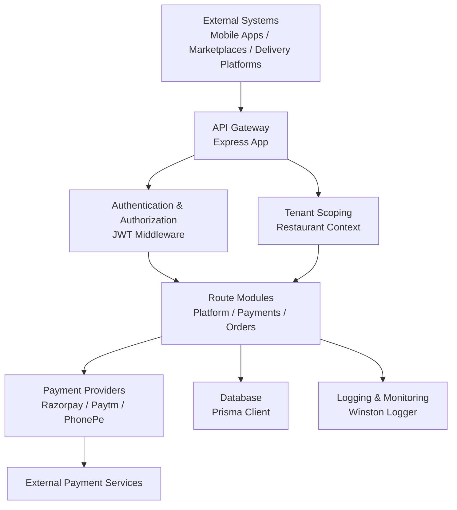
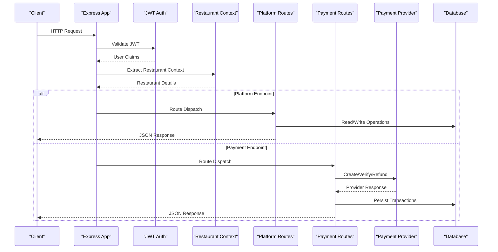
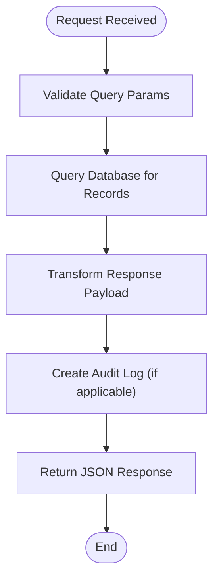
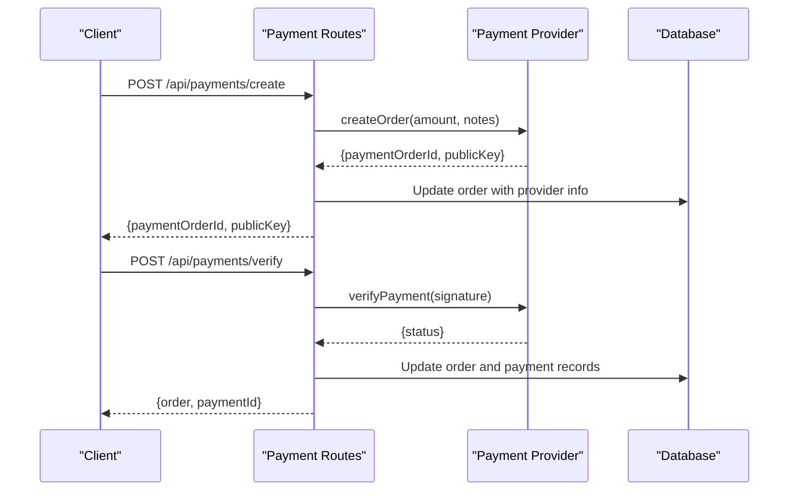
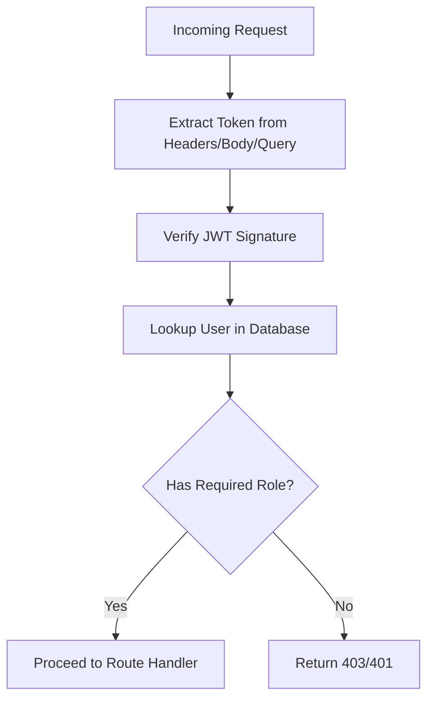
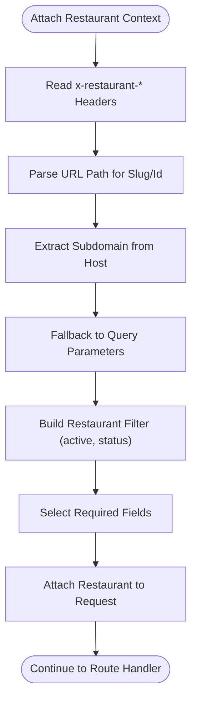
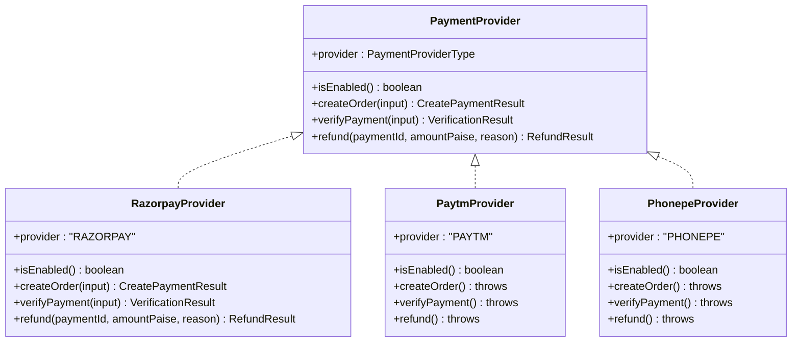
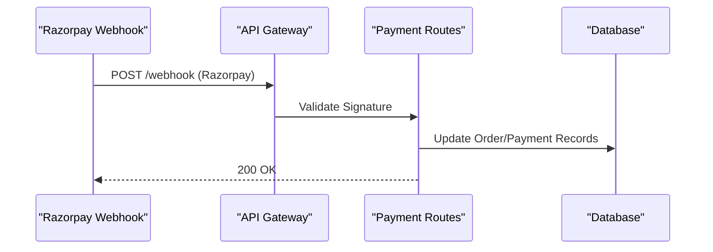
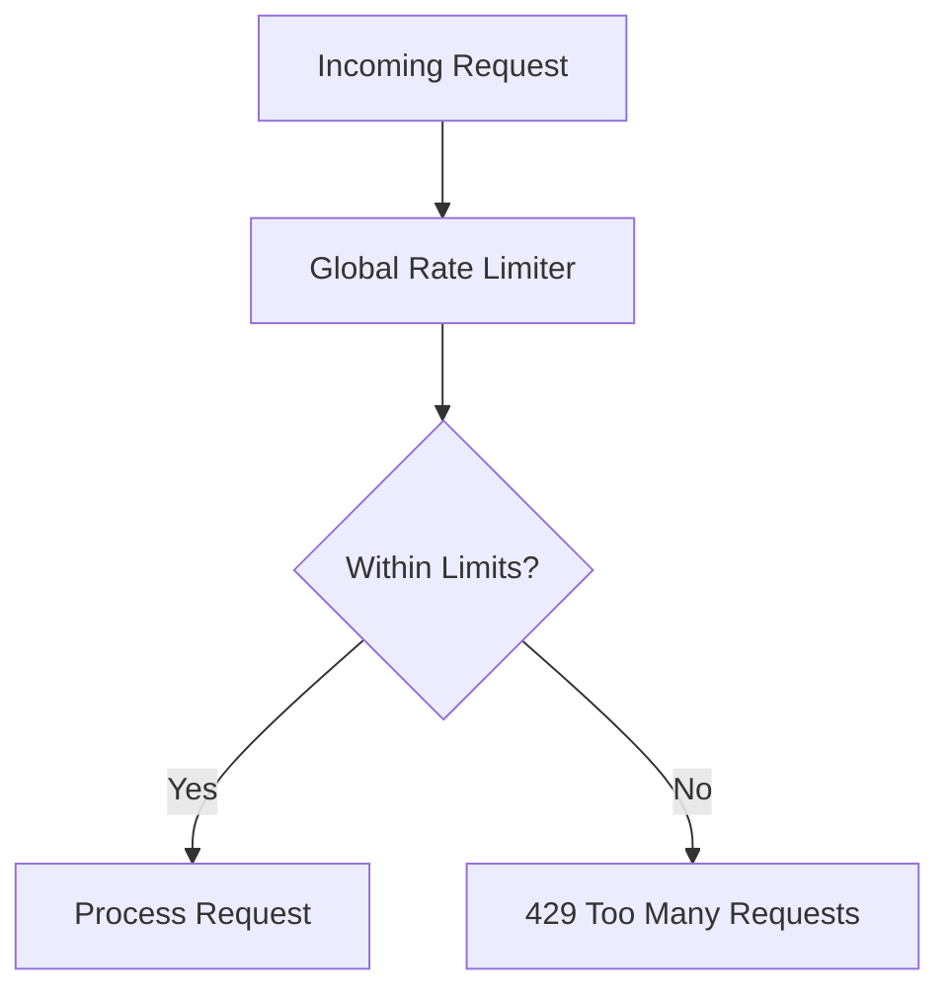
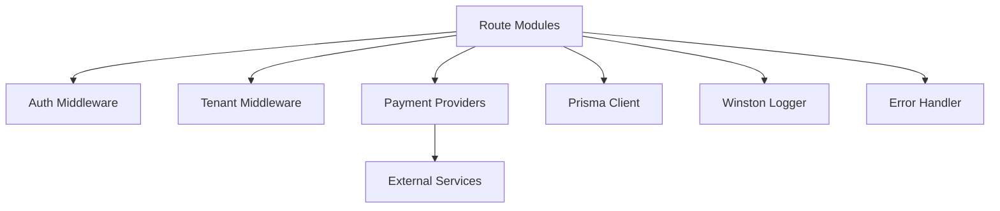

# Platform Integration Endpoints

<cite>
**Referenced Files in This Document**
- [platform.ts](file://restaurant-backend/src/routes/platform.ts)
- [payments.ts](file://restaurant-backend/src/routes/payments.ts)
- [auth.ts](file://restaurant-backend/src/middleware/auth.ts)
- [app.ts](file://restaurant-backend/src/app.ts)
- [payments/index.ts](file://restaurant-backend/src/lib/payments/index.ts)
- [razorpay.ts](file://restaurant-backend/src/lib/razorpay.ts)
- [restaurant.ts](file://restaurant-backend/src/middleware/restaurant.ts)
- [api.ts](file://restaurant-backend/src/types/api.ts)
- [errorHandler.ts](file://restaurant-backend/src/middleware/errorHandler.ts)
- [audit.ts](file://restaurant-backend/src/utils/audit.ts)
- [logger.ts](file://restaurant-backend/src/utils/logger.ts)
- [database.ts](file://restaurant-backend/src/config/database.ts)
- [DeQ-Restaurants-API.postman_collection.json](file://restaurant-backend/postman/DeQ-Restaurants-API.postman_collection.json)
- [package.json](file://restaurant-backend/package.json)
</cite>

## Table of Contents
1. [Introduction](#introduction)
2. [Project Structure](#project-structure)
3. [Core Components](#core-components)
4. [Architecture Overview](#architecture-overview)
5. [Detailed Component Analysis](#detailed-component-analysis)
6. [Dependency Analysis](#dependency-analysis)
7. [Performance Considerations](#performance-considerations)
8. [Troubleshooting Guide](#troubleshooting-guide)
9. [Conclusion](#conclusion)
10. [Appendices](#appendices)

## Introduction
This document provides comprehensive API documentation for platform integration endpoints within the Restaurant Management System. It covers third-party service integrations (payment providers), API gateway functionality, external system connectivity, marketplace integration patterns, delivery service coordination, and payment provider connections. It also documents webhook endpoints for external notifications, bidirectional data synchronization, API versioning and compatibility considerations, rate limiting and quota management, security measures, monitoring and logging, and operational troubleshooting guidance.

## Project Structure
The backend is organized around Express routes grouped by domain capabilities, with middleware for authentication, authorization, and tenant scoping. Payment integrations are abstracted behind a provider interface, enabling pluggable third-party providers. Environment-driven configuration controls provider availability and security headers.

**Diagram sources**
- [app.ts:34-144](file://restaurant-backend/src/app.ts#L34-L144)
- [auth.ts:7-137](file://restaurant-backend/src/middleware/auth.ts#L7-L137)
- [restaurant.ts:84-208](file://restaurant-backend/src/middleware/restaurant.ts#L84-L208)
- [payments/index.ts:117-124](file://restaurant-backend/src/lib/payments/index.ts#L117-L124)
- [database.ts:44-66](file://restaurant-backend/src/config/database.ts#L44-L66)
- [logger.ts:50-56](file://restaurant-backend/src/utils/logger.ts#L50-L56)

**Section sources**
- [app.ts:107-130](file://restaurant-backend/src/app.ts#L107-L130)
- [package.json:18-46](file://restaurant-backend/package.json#L18-L46)

## Core Components
- Platform administration endpoints for restaurant lifecycle management, commission updates, and earnings reporting.
- Payment orchestration endpoints supporting provider selection, order creation, verification, refunds, and cash payment confirmation.
- Authentication and authorization middleware enforcing JWT-based access and role-based permissions.
- Tenant scoping middleware extracting restaurant context from headers, subdomains, or URL slugs.
- Provider abstraction layer enabling pluggable payment providers with standardized interfaces.
- Logging and audit utilities for operational visibility and compliance.

**Section sources**
- [platform.ts:33-311](file://restaurant-backend/src/routes/platform.ts#L33-L311)
- [payments.ts:180-731](file://restaurant-backend/src/routes/payments.ts#L180-L731)
- [auth.ts:7-89](file://restaurant-backend/src/middleware/auth.ts#L7-L89)
- [restaurant.ts:84-253](file://restaurant-backend/src/middleware/restaurant.ts#L84-L253)
- [payments/index.ts:32-124](file://restaurant-backend/src/lib/payments/index.ts#L32-L124)
- [audit.ts:5-16](file://restaurant-backend/src/utils/audit.ts#L5-L16)

## Architecture Overview
The system exposes a unified API gateway with route modules for platform and tenant-specific resources. Authentication is enforced globally; tenant context is attached per-request. Payment flows integrate with external providers via a provider abstraction, while internal auditing and logging capture operational events.

**Diagram sources**
- [app.ts:34-144](file://restaurant-backend/src/app.ts#L34-L144)
- [auth.ts:7-89](file://restaurant-backend/src/middleware/auth.ts#L7-L89)
- [restaurant.ts:84-208](file://restaurant-backend/src/middleware/restaurant.ts#L84-L208)
- [platform.ts:33-311](file://restaurant-backend/src/routes/platform.ts#L33-L311)
- [payments.ts:180-731](file://restaurant-backend/src/routes/payments.ts#L180-L731)
- [payments/index.ts:32-124](file://restaurant-backend/src/lib/payments/index.ts#L32-L124)

## Detailed Component Analysis

### Platform Integration Endpoints
These endpoints enable platform-level administrative operations for restaurants and earnings.

- GET /api/platform/restaurants
  - Filters: status query parameter supports APPROVED, PENDING_APPROVAL, SUSPENDED.
  - Returns restaurant summary list with counts and timestamps.
- PATCH /api/platform/restaurants/:id/status
  - Updates restaurant status and related fields; enforces OWNER role.
  - Creates audit log entries for platform actions.
- PATCH /api/platform/restaurants/:id/commission
  - Updates platform commission rate; enforces OWNER role.
  - Creates audit log entries.
- PATCH /api/platform/restaurants/:id/details
  - Updates legal and banking details; enforces OWNER role.
  - Creates audit log entries.
- GET /api/platform/orders
  - Lists recent orders with restaurant and user metadata.
- GET /api/platform/earnings
  - Aggregates totals, pending settlements, and per-restaurant earnings.

**Diagram sources**
- [platform.ts:33-311](file://restaurant-backend/src/routes/platform.ts#L33-L311)
- [audit.ts:5-16](file://restaurant-backend/src/utils/audit.ts#L5-L16)

**Section sources**
- [platform.ts:33-311](file://restaurant-backend/src/routes/platform.ts#L33-L311)

### Payment Provider Integration
The payment module orchestrates online and cash payments, integrates with external providers, and manages refunds and status updates.

- GET /api/payments/providers
  - Returns enabled providers for the current restaurant context.
- POST /api/payments/create
  - Creates a provider order for the due amount; attaches provider metadata.
- POST /api/payments/verify
  - Verifies payment signature and updates order/payment records atomically.
- POST /api/payments/refund
  - Initiates provider refund and updates order/payment records.
- GET /api/payments/status/:orderId
  - Retrieves order payment status and transaction history.
- POST /api/payments/cash/confirm
  - Confirms cash payments with role-based authorization.
- PUT /api/payments/status
  - Manually updates payment status with validation.

**Diagram sources**
- [payments.ts:195-407](file://restaurant-backend/src/routes/payments.ts#L195-L407)
- [payments/index.ts:40-81](file://restaurant-backend/src/lib/payments/index.ts#L40-L81)
- [razorpay.ts:33-60](file://restaurant-backend/src/lib/razorpay.ts#L33-L60)

**Section sources**
- [payments.ts:180-731](file://restaurant-backend/src/routes/payments.ts#L180-L731)
- [payments/index.ts:117-124](file://restaurant-backend/src/lib/payments/index.ts#L117-L124)
- [razorpay.ts:134-169](file://restaurant-backend/src/lib/razorpay.ts#L134-L169)

### Authentication and Authorization
- JWT-based authentication extracts tokens from Authorization header, body, or query.
- Role-based authorization restricts access to platform and payment operations.
- Optional authentication middleware allows anonymous access for specific flows.

**Diagram sources**
- [auth.ts:7-89](file://restaurant-backend/src/middleware/auth.ts#L7-L89)

**Section sources**
- [auth.ts:7-137](file://restaurant-backend/src/middleware/auth.ts#L7-L137)

### Tenant Scoping and Multi-tenancy
- Restaurant context is attached from x-restaurant-slug, x-restaurant-subdomain, URL path, or host subdomain.
- Supports graceful fallbacks when database/client schema mismatches occur.
- Enforces active and approved restaurant filters.

**Diagram sources**
- [restaurant.ts:84-208](file://restaurant-backend/src/middleware/restaurant.ts#L84-L208)

**Section sources**
- [restaurant.ts:84-253](file://restaurant-backend/src/middleware/restaurant.ts#L84-L253)

### Provider Abstraction and External Integrations
- Provider interface defines createOrder, verifyPayment, refund, and isEnabled.
- Razorpay provider implements all methods with signature verification and webhook validation.
- Paytm and PhonePe providers are placeholders with 501 Not Implemented responses.

**Diagram sources**
- [payments/index.ts:32-124](file://restaurant-backend/src/lib/payments/index.ts#L32-L124)
- [razorpay.ts:33-169](file://restaurant-backend/src/lib/razorpay.ts#L33-L169)

**Section sources**
- [payments/index.ts:32-124](file://restaurant-backend/src/lib/payments/index.ts#L32-L124)
- [razorpay.ts:198-219](file://restaurant-backend/src/lib/razorpay.ts#L198-L219)

### Webhooks and Bidirectional Synchronization
- Razorpay webhook signature validation is supported for incoming notifications.
- Real-time events are emitted upon payment verification and status updates.
- Audit logs capture platform and payment actions for reconciliation.

**Diagram sources**
- [razorpay.ts:198-219](file://restaurant-backend/src/lib/razorpay.ts#L198-L219)
- [payments.ts:294-407](file://restaurant-backend/src/routes/payments.ts#L294-L407)

**Section sources**
- [razorpay.ts:198-219](file://restaurant-backend/src/lib/razorpay.ts#L198-L219)
- [payments.ts:376-388](file://restaurant-backend/src/routes/payments.ts#L376-L388)

### API Versioning, Compatibility, and Deprecation
- Current implementation does not define explicit API versioning headers or routes.
- Backward compatibility is maintained via schema-aware field selection and fallback queries when database/client schema mismatches occur.
- Recommendations:
  - Introduce X-API-Version header and semver-based versioning.
  - Maintain compatibility matrices for provider capabilities.
  - Announce deprecations with migration timelines and transitional endpoints.

[No sources needed since this section provides general guidance]

### Rate Limiting, Throttling, and Quota Management
- Global rate limiter: 200 requests per 15 minutes per IP.
- Standard headers enabled for client-side quota awareness.
- Consider implementing provider-specific quotas and per-integration rate limits for payment operations.

**Diagram sources**
- [app.ts:67-77](file://restaurant-backend/src/app.ts#L67-L77)

**Section sources**
- [app.ts:67-77](file://restaurant-backend/src/app.ts#L67-L77)

### Security Considerations
- Helmet-enabled CSP and COEP disabled for compatibility.
- CORS configured for allowed origins and credentials.
- JWT secret validation and error handling.
- Provider signature verification and webhook validation.
- Audit logs and structured logging for compliance.

**Section sources**
- [app.ts:37-65](file://restaurant-backend/src/app.ts#L37-L65)
- [auth.ts:40-44](file://restaurant-backend/src/middleware/auth.ts#L40-L44)
- [razorpay.ts:65-105](file://restaurant-backend/src/lib/razorpay.ts#L65-L105)
- [audit.ts:5-16](file://restaurant-backend/src/utils/audit.ts#L5-L16)

### Monitoring, Logging, and Troubleshooting
- Winston-based structured logging with console and file transports.
- Morgan integration logs HTTP requests to logger.
- Error handler centralizes error responses and logging.
- Audit logs capture critical platform and payment actions.

**Section sources**
- [logger.ts:50-56](file://restaurant-backend/src/utils/logger.ts#L50-L56)
- [app.ts:84-90](file://restaurant-backend/src/app.ts#L84-L90)
- [errorHandler.ts:22-76](file://restaurant-backend/src/middleware/errorHandler.ts#L22-L76)
- [audit.ts:5-16](file://restaurant-backend/src/utils/audit.ts#L5-L16)

## Dependency Analysis
The system exhibits clear separation of concerns:
- Routes depend on middleware for auth/tenant and on provider abstractions for payment operations.
- Providers encapsulate external service specifics.
- Database access is centralized via Prisma with environment-driven acceleration.

**Diagram sources**
- [payments.ts:180-731](file://restaurant-backend/src/routes/payments.ts#L180-L731)
- [platform.ts:33-311](file://restaurant-backend/src/routes/platform.ts#L33-L311)
- [auth.ts:7-137](file://restaurant-backend/src/middleware/auth.ts#L7-L137)
- [restaurant.ts:84-253](file://restaurant-backend/src/middleware/restaurant.ts#L84-L253)
- [payments/index.ts:32-124](file://restaurant-backend/src/lib/payments/index.ts#L32-L124)
- [database.ts:44-66](file://restaurant-backend/src/config/database.ts#L44-L66)
- [logger.ts:50-56](file://restaurant-backend/src/utils/logger.ts#L50-L56)
- [errorHandler.ts:22-76](file://restaurant-backend/src/middleware/errorHandler.ts#L22-L76)

**Section sources**
- [payments.ts:180-731](file://restaurant-backend/src/routes/payments.ts#L180-L731)
- [platform.ts:33-311](file://restaurant-backend/src/routes/platform.ts#L33-L311)
- [payments/index.ts:32-124](file://restaurant-backend/src/lib/payments/index.ts#L32-L124)
- [database.ts:44-66](file://restaurant-backend/src/config/database.ts#L44-L66)

## Performance Considerations
- Use provider caching for frequently accessed order/payment details.
- Batch audit log writes during high-volume periods.
- Monitor provider latency and implement circuit breaker patterns for external calls.
- Optimize database queries with selective field projections and pagination.

[No sources needed since this section provides general guidance]

## Troubleshooting Guide
- Authentication failures: Verify JWT_SECRET environment variable and token validity.
- CORS errors: Confirm allowed origins and credentials configuration.
- Provider errors: Check provider credentials and signature verification logs.
- Schema mismatches: Review fallback query behavior and apply migrations.
- Rate limiting: Adjust global limits or implement provider-specific quotas.

**Section sources**
- [auth.ts:40-44](file://restaurant-backend/src/middleware/auth.ts#L40-L44)
- [app.ts:42-65](file://restaurant-backend/src/app.ts#L42-L65)
- [razorpay.ts:52-59](file://restaurant-backend/src/lib/razorpay.ts#L52-L59)
- [restaurant.ts:149-191](file://restaurant-backend/src/middleware/restaurant.ts#L149-L191)
- [app.ts:67-77](file://restaurant-backend/src/app.ts#L67-L77)

## Conclusion
The platform integration endpoints provide a robust foundation for third-party payment processing, tenant scoping, and operational observability. By adopting explicit API versioning, enhancing provider-specific rate limiting, and formalizing webhook validation, the system can evolve to meet growing integration demands while maintaining security and reliability.

## Appendices

### API Reference Summary

- Platform Endpoints
  - GET /api/platform/restaurants
  - PATCH /api/platform/restaurants/:id/status
  - PATCH /api/platform/restaurants/:id/commission
  - PATCH /api/platform/restaurants/:id/details
  - GET /api/platform/orders
  - GET /api/platform/earnings

- Payment Endpoints
  - GET /api/payments/providers
  - POST /api/payments/create
  - POST /api/payments/verify
  - POST /api/payments/refund
  - GET /api/payments/status/:orderId
  - POST /api/payments/cash/confirm
  - PUT /api/payments/status

- Authentication and Authorization
  - JWT-based authentication with role checks
  - Optional authentication support

- Tenant Scoping
  - x-restaurant-slug, x-restaurant-subdomain, URL path, or host subdomain

- Provider Capabilities
  - Razorpay: Enabled with signature verification and webhook validation
  - Paytm/PhonePe: Placeholder implementations (501 Not Implemented)

**Section sources**
- [platform.ts:33-311](file://restaurant-backend/src/routes/platform.ts#L33-L311)
- [payments.ts:180-731](file://restaurant-backend/src/routes/payments.ts#L180-L731)
- [payments/index.ts:117-124](file://restaurant-backend/src/lib/payments/index.ts#L117-L124)
- [restaurant.ts:84-208](file://restaurant-backend/src/middleware/restaurant.ts#L84-L208)
- [auth.ts:7-89](file://restaurant-backend/src/middleware/auth.ts#L7-L89)