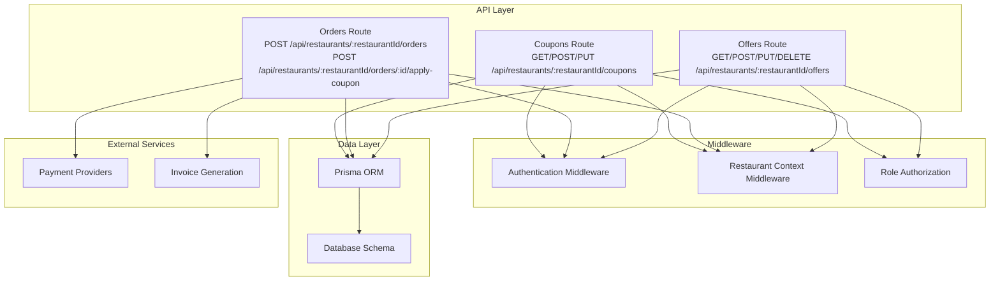
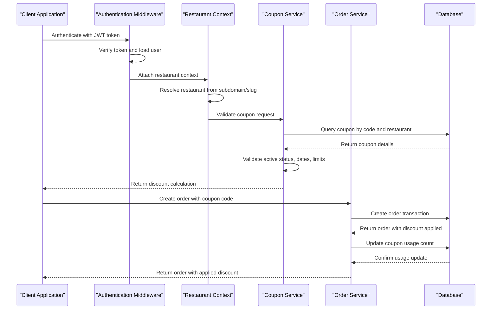
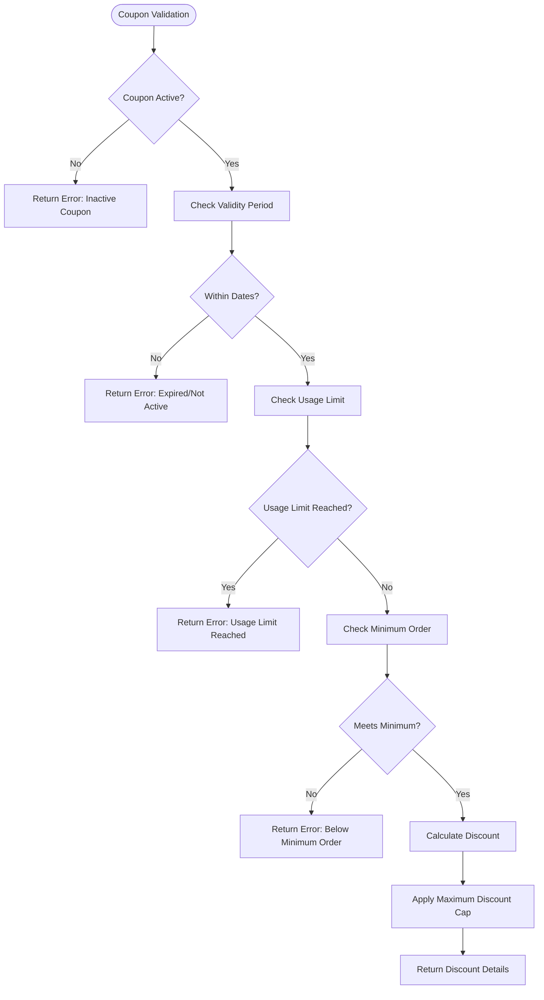
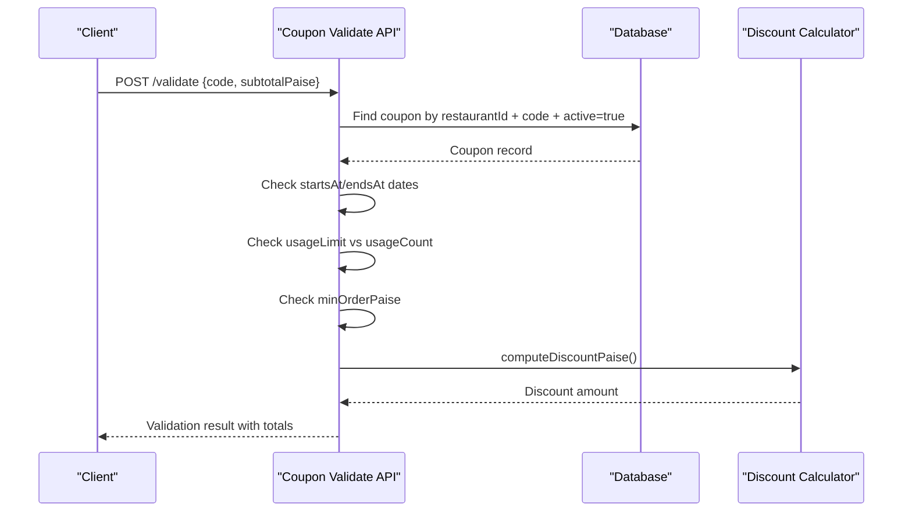
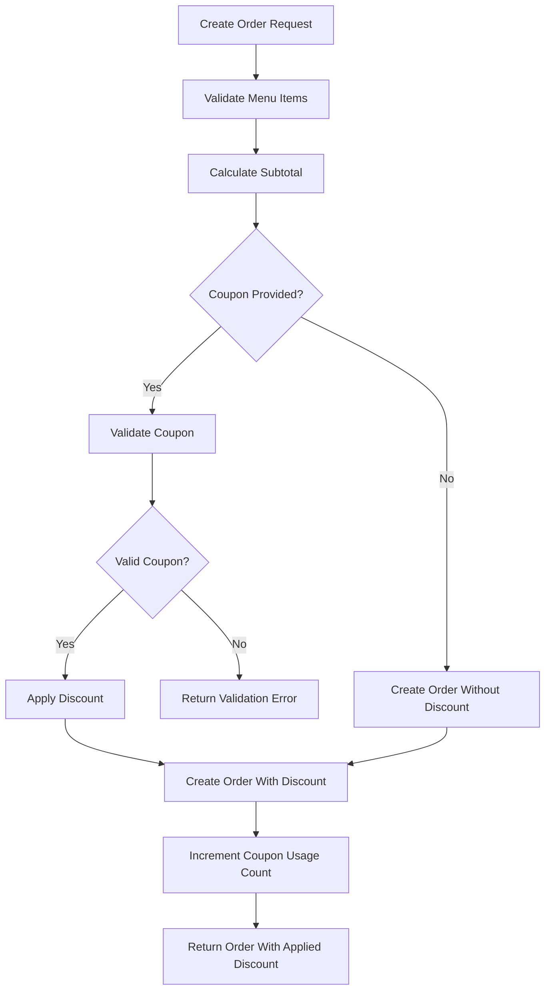
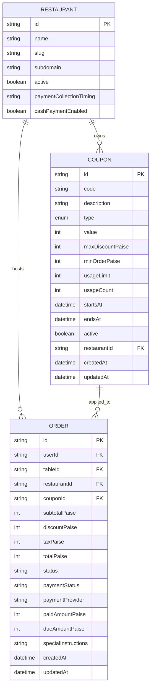
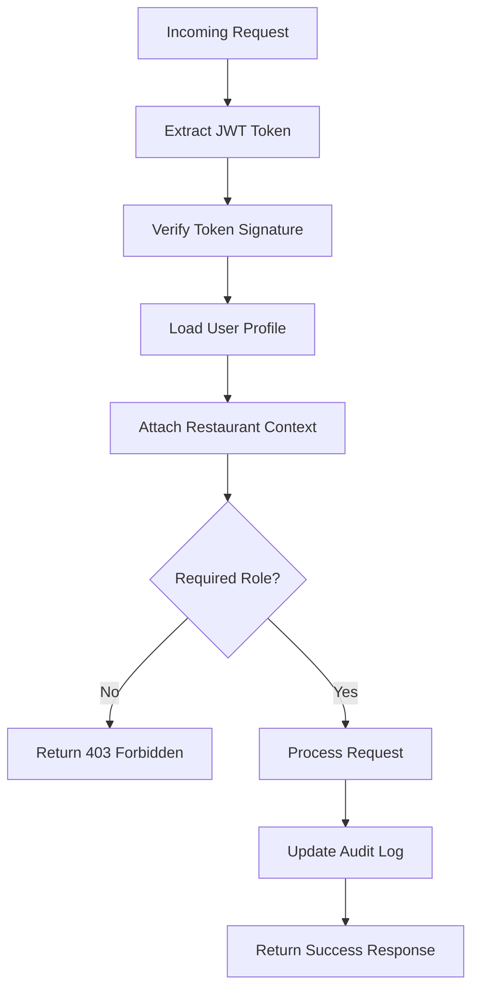

# Promotion & Coupon Endpoints

<cite>
**Referenced Files in This Document**
- [coupons.ts](file://restaurant-backend/src/routes/coupons.ts)
- [offers.ts](file://restaurant-backend/src/routes/offers.ts)
- [orders.ts](file://restaurant-backend/src/routes/orders.ts)
- [schema.prisma](file://restaurant-backend/prisma/schema.prisma)
- [api.ts](file://restaurant-backend/src/types/api.ts)
- [auth.ts](file://restaurant-backend/src/middleware/auth.ts)
- [restaurant.ts](file://restaurant-backend/src/middleware/restaurant.ts)
- [app.ts](file://restaurant-backend/src/app.ts)
- [DeQ-Restaurants-API.postman_collection.json](file://restaurant-backend/postman/DeQ-Restaurants-API.postman_collection.json)
</cite>

## Table of Contents
1. [Introduction](#introduction)
2. [Project Structure](#project-structure)
3. [Core Components](#core-components)
4. [Architecture Overview](#architecture-overview)
5. [Detailed Component Analysis](#detailed-component-analysis)
6. [Dependency Analysis](#dependency-analysis)
7. [Performance Considerations](#performance-considerations)
8. [Troubleshooting Guide](#troubleshooting-guide)
9. [Conclusion](#conclusion)

## Introduction
This document provides comprehensive API documentation for promotion and coupon management endpoints within the restaurant management system. It covers coupon creation, validation, and redemption workflows, discount calculations, usage limits, offer management for promotional campaigns, and integration with order processing for automatic discount application. The documentation includes endpoint specifications, data models, validation rules, error handling, and operational guidelines for coupon expiration, validation rules, and fraud prevention measures.

## Project Structure
The promotion and coupon system is implemented as part of the restaurant backend API, with dedicated route handlers for coupons, offers, and order processing. The system integrates with Prisma ORM for data persistence and uses middleware for authentication, authorization, and restaurant context resolution.

**Diagram sources**
- [app.ts:110-129](file://restaurant-backend/src/app.ts#L110-L129)
- [coupons.ts:1-196](file://restaurant-backend/src/routes/coupons.ts#L1-L196)
- [orders.ts:1-694](file://restaurant-backend/src/routes/orders.ts#L1-L694)
- [offers.ts:1-157](file://restaurant-backend/src/routes/offers.ts#L1-L157)

**Section sources**
- [app.ts:110-129](file://restaurant-backend/src/app.ts#L110-L129)
- [schema.prisma:224-276](file://restaurant-backend/prisma/schema.prisma#L224-L276)

## Core Components
The promotion and coupon system consists of three primary components:

### Coupon Management
- **Coupon Creation**: RESTful endpoints for creating, updating, and listing restaurant-specific coupons
- **Coupon Validation**: Real-time validation with comprehensive checks for active status, validity period, usage limits, and minimum order requirements
- **Discount Calculation**: Automated computation of discount amounts based on coupon type (percentage or fixed amount)

### Offer Management  
- **Promotional Campaigns**: Support for various offer types including percentage discounts, fixed amounts, buy-x-get-y deals, and free delivery
- **Campaign Lifecycle**: Complete CRUD operations for managing promotional campaigns
- **Targeting Capabilities**: Applicable items and categories filtering for precise campaign targeting

### Order Integration
- **Automatic Discount Application**: Seamless integration with order processing pipeline
- **Real-time Validation**: Validation during order creation and modification
- **Payment Workflow**: Integration with payment providers and invoice generation

**Section sources**
- [coupons.ts:13-50](file://restaurant-backend/src/routes/coupons.ts#L13-L50)
- [orders.ts:16-80](file://restaurant-backend/src/routes/orders.ts#L16-L80)
- [offers.ts:11-26](file://restaurant-backend/src/routes/offers.ts#L11-L26)

## Architecture Overview
The system follows a layered architecture with clear separation of concerns:

**Diagram sources**
- [orders.ts:50-80](file://restaurant-backend/src/routes/orders.ts#L50-L80)
- [orders.ts:183-243](file://restaurant-backend/src/routes/orders.ts#L183-L243)
- [coupons.ts:141-193](file://restaurant-backend/src/routes/coupons.ts#L141-L193)

The architecture ensures:
- **Security**: JWT-based authentication with role-based authorization
- **Scalability**: Restaurant-scoped routing with flexible context resolution
- **Reliability**: Transactional operations for coupon usage updates
- **Flexibility**: Support for multiple coupon types and validation rules

## Detailed Component Analysis

### Coupon Management Endpoints

#### Coupon Creation and Management
The coupon management system provides comprehensive CRUD operations with strict validation and restaurant scoping.

**Endpoint Specifications:**
- **GET /api/restaurants/:restaurantId/coupons** - List all coupons for a restaurant
- **POST /api/restaurants/:restaurantId/coupons** - Create a new coupon
- **PUT /api/restaurants/:restaurantId/coupons/:id** - Update existing coupon

**Validation Rules:**
- Code normalization (trim and uppercase)
- Type validation (PERCENT/FIXED)
- Value constraints (positive integers)
- Optional fields: description, maxDiscountPaise, minOrderPaise, usageLimit
- Active status management

**Discount Calculation Logic:**

**Diagram sources**
- [coupons.ts:158-170](file://restaurant-backend/src/routes/coupons.ts#L158-L170)
- [orders.ts:16-36](file://restaurant-backend/src/routes/orders.ts#L16-L36)

**Section sources**
- [coupons.ts:52-97](file://restaurant-backend/src/routes/coupons.ts#L52-L97)
- [coupons.ts:99-139](file://restaurant-backend/src/routes/coupons.ts#L99-L139)
- [schema.prisma:224-245](file://restaurant-backend/prisma/schema.prisma#L224-L245)

#### Coupon Validation Endpoint
The validation endpoint provides real-time coupon verification with comprehensive checks:

**Endpoint:** POST `/api/restaurants/:restaurantId/coupons/validate`

**Request Payload:**
- `code`: Coupon code to validate
- `subtotalPaise`: Order subtotal in paisa (smallest currency unit)

**Response Includes:**
- Coupon details (id, code, type, value)
- Calculated discount in paisa
- Tax calculation (8% rate)
- Final total after discount and tax

**Validation Sequence:**

**Diagram sources**
- [coupons.ts:141-193](file://restaurant-backend/src/routes/coupons.ts#L141-L193)

**Section sources**
- [coupons.ts:141-193](file://restaurant-backend/src/routes/coupons.ts#L141-L193)

### Order Processing Integration

#### Automatic Discount Application
The order processing system seamlessly integrates coupon validation and application:

**Key Features:**
- **Real-time Validation**: Coupon validation during order creation
- **Transaction Safety**: Atomic operations for order creation and coupon usage updates
- **Dynamic Recalculation**: Discount recalculation when adding items to existing orders
- **Payment Integration**: Automatic discount application in payment workflow

**Order Creation Flow:**

**Diagram sources**
- [orders.ts:82-267](file://restaurant-backend/src/routes/orders.ts#L82-L267)
- [orders.ts:183-243](file://restaurant-backend/src/routes/orders.ts#L183-L243)

**Section sources**
- [orders.ts:82-267](file://restaurant-backend/src/routes/orders.ts#L82-L267)
- [orders.ts:396-497](file://restaurant-backend/src/routes/orders.ts#L396-L497)

#### Dynamic Coupon Management
The system supports dynamic coupon application and replacement:

**Endpoints:**
- **POST /api/restaurants/:restaurantId/orders/:id/apply-coupon** - Apply or replace coupon on existing unpaid orders

**Features:**
- **Coupon Replacement**: Replace existing coupon with new one
- **Usage Count Management**: Proper handling of coupon usage counts during replacement
- **Real-time Recalculation**: Immediate recalculation of order totals

**Section sources**
- [orders.ts:396-497](file://restaurant-backend/src/routes/orders.ts#L396-L497)

### Offer Management Endpoints

#### Offer Lifecycle Management
The offers system provides comprehensive promotional campaign management:

**Endpoint Specifications:**
- **GET /api/restaurants/:restaurantId/offers** - List all offers for a restaurant
- **POST /api/restaurants/:restaurantId/offers** - Create new promotional offer
- **PUT /api/restaurants/:restaurantId/offers/:id** - Update existing offer
- **DELETE /api/restaurants/:restaurantId/offers/:id** - Delete offer

**Offer Types:**
- **PERCENTAGE**: Percentage-based discounts
- **FIXED_AMOUNT**: Fixed amount discounts  
- **BUY_X_GET_Y**: Buy X get Y free deals
- **FREE_DELIVERY**: Free delivery promotions

**Targeting Options:**
- **Applicable Items**: Specific menu items
- **Applicable Categories**: Category-based targeting
- **Minimum Order Value**: Threshold requirements
- **Maximum Discount**: Cap on discount amount

**Section sources**
- [offers.ts:28-76](file://restaurant-backend/src/routes/offers.ts#L28-L76)
- [offers.ts:78-123](file://restaurant-backend/src/routes/offers.ts#L78-L123)
- [offers.ts:125-154](file://restaurant-backend/src/routes/offers.ts#L125-L154)
- [schema.prisma:247-276](file://restaurant-backend/prisma/schema.prisma#L247-L276)

### Data Models and Relationships

#### Coupon Schema
The coupon model supports comprehensive discount management:

**Diagram sources**
- [schema.prisma:224-245](file://restaurant-backend/prisma/schema.prisma#L224-L245)
- [schema.prisma:162-193](file://restaurant-backend/prisma/schema.prisma#L162-L193)

**Section sources**
- [schema.prisma:224-245](file://restaurant-backend/prisma/schema.prisma#L224-L245)
- [schema.prisma:162-193](file://restaurant-backend/prisma/schema.prisma#L162-L193)

## Dependency Analysis

### Security and Authentication Flow
The system implements a multi-layered security approach:

**Diagram sources**
- [auth.ts:7-75](file://restaurant-backend/src/middleware/auth.ts#L7-L75)
- [restaurant.ts:221-253](file://restaurant-backend/src/middleware/restaurant.ts#L221-L253)

### Database Relationships
The promotion system relies on well-defined database relationships:

**Key Dependencies:**
- **Restaurant Scoping**: All coupons and offers are scoped to restaurants
- **Order-Coupon Relationship**: One-to-many relationship between coupons and orders
- **Audit Trail**: Comprehensive logging for all promotional activities

**Section sources**
- [restaurant.ts:84-208](file://restaurant-backend/src/middleware/restaurant.ts#L84-L208)
- [schema.prisma:63-69](file://restaurant-backend/prisma/schema.prisma#L63-L69)

## Performance Considerations

### Optimization Strategies
The system implements several performance optimizations:

**Database Indexing:**
- Composite index on (restaurantId, code) for coupon lookups
- Unique constraint on restaurantId + code combination
- Efficient querying patterns for validation operations

**Caching Opportunities:**
- Coupon validation results could benefit from caching
- Restaurant context could be cached for repeated requests
- Offer targeting filters could be pre-computed

**Transaction Management:**
- Atomic operations for coupon usage updates
- Proper rollback mechanisms for failed operations
- Optimistic locking for concurrent access scenarios

### Scalability Guidelines
- **Horizontal Scaling**: Stateless design supports load balancing
- **Database Sharding**: Restaurant-based partitioning for data isolation
- **Connection Pooling**: Efficient database connection management
- **Rate Limiting**: Built-in protection against abuse

## Troubleshooting Guide

### Common Issues and Solutions

#### Coupon Validation Failures
**Issue**: "Invalid or inactive coupon"
**Cause**: Coupon not found or marked inactive
**Solution**: Verify coupon code and active status

**Issue**: "Coupon is not active yet"
**Cause**: startsAt date in future
**Solution**: Check coupon validity period

**Issue**: "Coupon has expired"
**Cause**: endsAt date in past
**Solution**: Use valid coupon within date range

**Issue**: "Coupon usage limit reached"
**Cause**: usageLimit exceeded
**Solution**: Create new coupon or adjust limit

**Issue**: "Order total does not meet coupon minimum"
**Cause**: subtotal below minOrderPaise
**Solution**: Increase order value or adjust minimum requirement

#### Order Processing Errors
**Issue**: "Cannot apply coupon on a paid order"
**Cause**: Payment already processed
**Solution**: Apply coupon before payment completion

**Issue**: "Cannot add dishes to pay-before-meal orders"
**Cause**: Payment timing conflict
**Solution**: Create new order for additional items

**Issue**: "Invalid table selected"
**Cause**: Table not associated with restaurant
**Solution**: Select valid table for restaurant

### Debugging Tools
- **Audit Logs**: Track all promotional activities
- **Request Logging**: Morgan-based request/response logging
- **Database Queries**: Prisma query logging for debugging
- **Error Handling**: Centralized error response format

**Section sources**
- [orders.ts:427-429](file://restaurant-backend/src/routes/orders.ts#L427-L429)
- [orders.ts:600-609](file://restaurant-backend/src/routes/orders.ts#L600-L609)

## Conclusion

The promotion and coupon management system provides a comprehensive solution for restaurant promotional activities with strong security, scalability, and flexibility. The system successfully integrates coupon validation with order processing, supports multiple discount types, and provides robust administrative controls for promotional campaign management.

Key strengths include:
- **Comprehensive Validation**: Multi-layered coupon validation with real-time feedback
- **Seamless Integration**: Automatic discount application in order processing
- **Flexible Targeting**: Advanced offer targeting with category and item filtering
- **Strong Security**: JWT-based authentication with role-based authorization
- **Audit Trail**: Complete logging of promotional activities
- **Performance Optimization**: Transactional operations and efficient database design

The system is well-suited for both small restaurants and enterprise deployments, with clear extension points for advanced features like bulk coupon operations, export capabilities, and sophisticated analytics reporting.