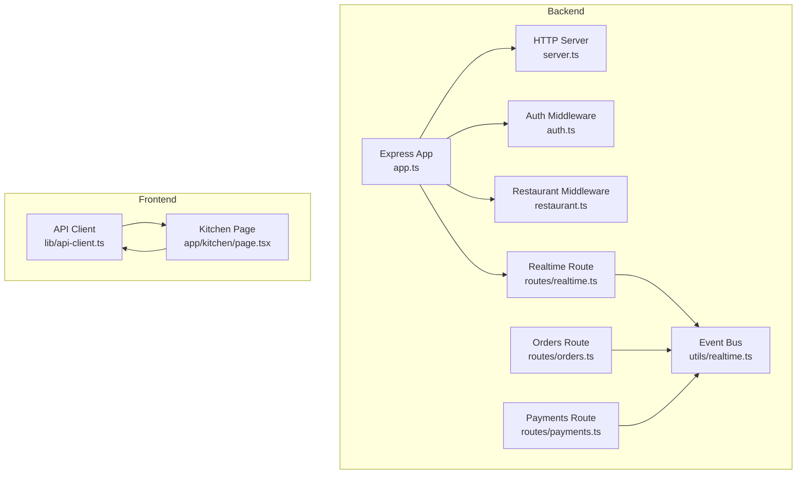
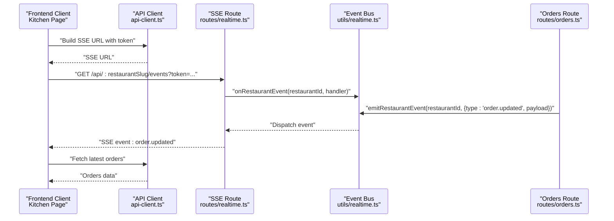
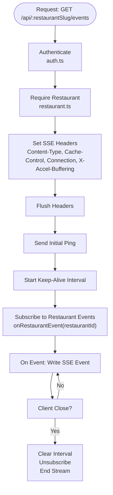
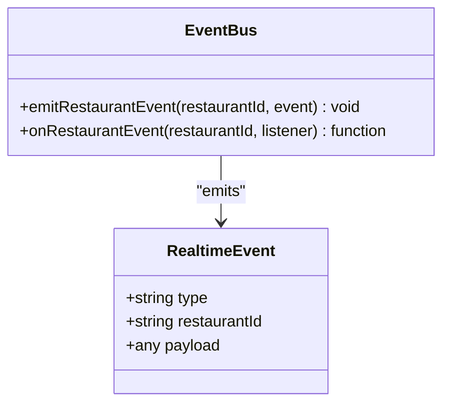
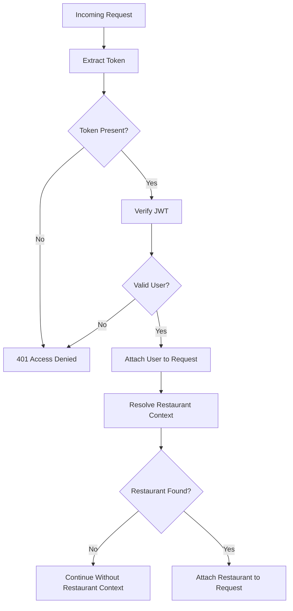
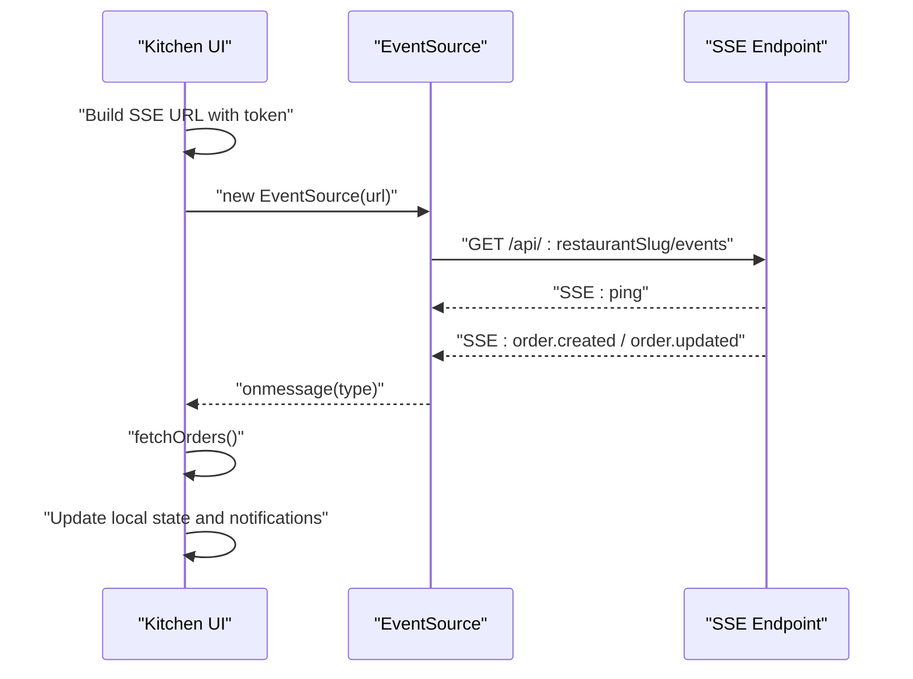
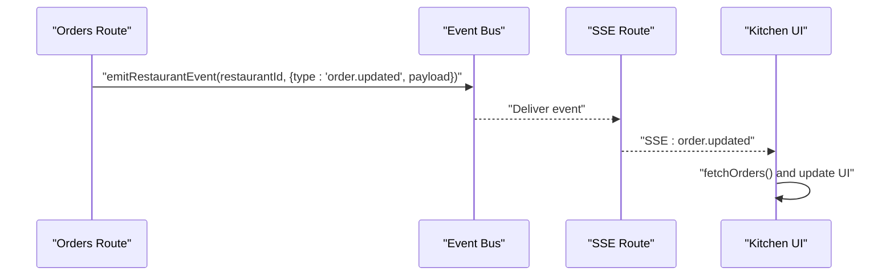
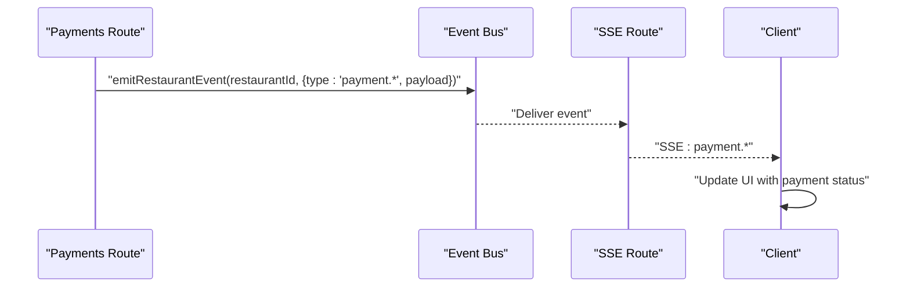
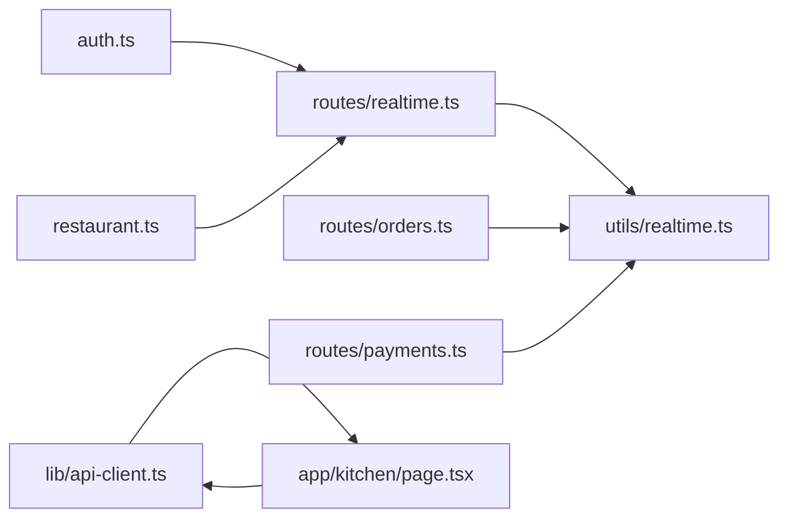

# Real-time Communication Endpoints

<cite>
**Referenced Files in This Document**
- [realtime.ts](file://restaurant-backend/src/routes/realtime.ts)
- [realtime.ts](file://restaurant-backend/src/utils/realtime.ts)
- [app.ts](file://restaurant-backend/src/app.ts)
- [server.ts](file://restaurant-backend/src/server.ts)
- [auth.ts](file://restaurant-backend/src/middleware/auth.ts)
- [restaurant.ts](file://restaurant-backend/src/middleware/restaurant.ts)
- [api-client.ts](file://restaurant-frontend/src/lib/api-client.ts)
- [kitchen-page.tsx](file://restaurant-frontend/src/app/kitchen/page.tsx)
- [orders.ts](file://restaurant-backend/src/route/orders.ts)
- [payments.ts](file://restaurant-backend/src/route/payments.ts)
</cite>

## Table of Contents
1. [Introduction](#introduction)
2. [Project Structure](#project-structure)
3. [Core Components](#core-components)
4. [Architecture Overview](#architecture-overview)
5. [Detailed Component Analysis](#detailed-component-analysis)
6. [Dependency Analysis](#dependency-analysis)
7. [Performance Considerations](#performance-considerations)
8. [Troubleshooting Guide](#troubleshooting-guide)
9. [Conclusion](#conclusion)

## Introduction
This document provides comprehensive API documentation for real-time communication endpoints in the Restaurant Management System. It covers:
- Server-Sent Events (SSE) for real-time updates
- Authentication and tenant scoping
- Live order updates and kitchen display system integration
- Event broadcasting and subscription mechanics
- Client-side integration patterns
- Scalability, load balancing, and session management considerations
- Examples of real-time user experiences and performance optimization techniques

## Project Structure
The real-time system spans backend Express routes and middleware, a lightweight event bus, and a frontend client using SSE.

**Diagram sources**
- [app.ts:1-144](file://restaurant-backend/src/app.ts#L1-L144)
- [server.ts:1-33](file://restaurant-backend/src/server.ts#L1-L33)
- [auth.ts:1-137](file://restaurant-backend/src/middleware/auth.ts#L1-L137)
- [restaurant.ts:1-254](file://restaurant-backend/src/middleware/restaurant.ts#L1-L254)
- [realtime.ts:1-40](file://restaurant-backend/src/routes/realtime.ts#L1-L40)
- [realtime.ts:1-23](file://restaurant-backend/src/utils/realtime.ts#L1-L23)
- [orders.ts:1-694](file://restaurant-backend/src/route/orders.ts#L1-L694)
- [payments.ts:1-800](file://restaurant-backend/src/route/payments.ts#L1-L800)
- [api-client.ts:1-894](file://restaurant-frontend/src/lib/api-client.ts#L1-L894)
- [kitchen-page.tsx:1-259](file://restaurant-frontend/src/app/kitchen/page.tsx#L1-L259)

**Section sources**
- [app.ts:1-144](file://restaurant-backend/src/app.ts#L1-L144)
- [server.ts:1-33](file://restaurant-backend/src/server.ts#L1-L33)

## Core Components
- Realtime SSE Endpoint: Provides a long-lived connection emitting events scoped to a restaurant.
- Event Bus: In-process event emitter keyed by restaurantId for broadcasting.
- Authentication and Tenant Middleware: Ensures requests are authenticated and scoped to a tenant.
- Frontend SSE Client: Subscribes to the SSE endpoint and reacts to order-related events.

Key responsibilities:
- Establish authenticated SSE connections per restaurant.
- Emit typed events for order lifecycle changes.
- Deliver real-time updates to kitchen dashboards and other clients.

**Section sources**
- [realtime.ts:1-40](file://restaurant-backend/src/routes/realtime.ts#L1-L40)
- [realtime.ts:1-23](file://restaurant-backend/src/utils/realtime.ts#L1-L23)
- [auth.ts:1-137](file://restaurant-backend/src/middleware/auth.ts#L1-L137)
- [restaurant.ts:1-254](file://restaurant-backend/src/middleware/restaurant.ts#L1-L254)
- [api-client.ts:324-329](file://restaurant-frontend/src/lib/api-client.ts#L324-L329)
- [kitchen-page.tsx:36-64](file://restaurant-frontend/src/app/kitchen/page.tsx#L36-L64)

## Architecture Overview
The real-time architecture uses Server-Sent Events (SSE) with a simple event bus. Backend routes emit restaurant-scoped events, and the SSE endpoint streams them to subscribed clients.

**Diagram sources**
- [api-client.ts:324-329](file://restaurant-frontend/src/lib/api-client.ts#L324-L329)
- [kitchen-page.tsx:36-64](file://restaurant-frontend/src/app/kitchen/page.tsx#L36-L64)
- [realtime.ts:10-37](file://restaurant-backend/src/routes/realtime.ts#L10-L37)
- [realtime.ts:19-22](file://restaurant-backend/src/utils/realtime.ts#L19-L22)
- [orders.ts:619-623](file://restaurant-backend/src/route/orders.ts#L619-L623)

## Detailed Component Analysis

### Realtime SSE Endpoint
- Path: GET /api/:restaurantSlug/events
- Authentication: Requires a valid bearer token.
- Tenant Scoping: Requires a restaurant context (slug/id/subdomain).
- Streaming: Sets appropriate headers for SSE, sends periodic ping events, and flushes headers.
- Subscription: Registers an event listener keyed by restaurantId and cleans up on close.

**Diagram sources**
- [realtime.ts:10-37](file://restaurant-backend/src/routes/realtime.ts#L10-L37)
- [auth.ts:7-75](file://restaurant-backend/src/middleware/auth.ts#L7-L75)
- [restaurant.ts:210-219](file://restaurant-backend/src/middleware/restaurant.ts#L210-L219)

**Section sources**
- [realtime.ts:1-40](file://restaurant-backend/src/routes/realtime.ts#L1-L40)
- [auth.ts:1-137](file://restaurant-backend/src/middleware/auth.ts#L1-L137)
- [restaurant.ts:1-254](file://restaurant-backend/src/middleware/restaurant.ts#L1-L254)

### Event Bus and Broadcasting
- Event Model: Typed event with type, restaurantId, and payload.
- Emission: emitRestaurantEvent dispatches events to listeners registered under the restaurantId.
- Subscription: onRestaurantEvent registers a listener and returns an unsubscribe function.

**Diagram sources**
- [realtime.ts:3-7](file://restaurant-backend/src/utils/realtime.ts#L3-L7)
- [realtime.ts:12-22](file://restaurant-backend/src/utils/realtime.ts#L12-L22)

**Section sources**
- [realtime.ts:1-23](file://restaurant-backend/src/utils/realtime.ts#L1-L23)

### Authentication and Tenant Scoping
- Authentication: Extracts Bearer token from Authorization header (with fallbacks), validates via JWT, and attaches user to request.
- Tenant Resolution: Resolves restaurant context from x-restaurant-slug/x-restaurant-subdomain headers, path params, or subdomain/host.
- Role Checks: Optional role-based authorization for restaurant-scoped actions.

**Diagram sources**
- [auth.ts:7-75](file://restaurant-backend/src/middleware/auth.ts#L7-L75)
- [restaurant.ts:84-208](file://restaurant-backend/src/middleware/restaurant.ts#L84-L208)

**Section sources**
- [auth.ts:1-137](file://restaurant-backend/src/middleware/auth.ts#L1-L137)
- [restaurant.ts:1-254](file://restaurant-backend/src/middleware/restaurant.ts#L1-L254)

### Client-Side Integration (Kitchen Dashboard)
- SSE URL Construction: Builds tenant-aware SSE URL with token appended as query parameter.
- EventSource Usage: Subscribes to order.created and order.updated events.
- Reconnection Behavior: Relies on browser automatic retry; no manual reconnect logic.
- Data Synchronization: Fetches latest orders after receiving SSE events to ensure UI consistency.

**Diagram sources**
- [api-client.ts:324-329](file://restaurant-frontend/src/lib/api-client.ts#L324-L329)
- [kitchen-page.tsx:36-64](file://restaurant-frontend/src/app/kitchen/page.tsx#L36-L64)

**Section sources**
- [api-client.ts:324-329](file://restaurant-frontend/src/lib/api-client.ts#L324-L329)
- [kitchen-page.tsx:1-259](file://restaurant-frontend/src/app/kitchen/page.tsx#L1-L259)

### Live Order Updates and Kitchen Display System
- Event Emission: Order status updates trigger emitRestaurantEvent with type order.updated and a structured payload.
- Client Reaction: Kitchen page listens for order.updated and refreshes order lists, grouping by status, and optionally triggers notifications.

**Diagram sources**
- [orders.ts:619-623](file://restaurant-backend/src/route/orders.ts#L619-L623)
- [realtime.ts:19-22](file://restaurant-backend/src/utils/realtime.ts#L19-L22)
- [kitchen-page.tsx:50-52](file://restaurant-frontend/src/app/kitchen/page.tsx#L50-L52)

**Section sources**
- [orders.ts:619-623](file://restaurant-backend/src/route/orders.ts#L619-L623)
- [kitchen-page.tsx:1-259](file://restaurant-frontend/src/app/kitchen/page.tsx#L1-L259)

### Payments Integration and Real-time Notifications
- Payment Status Updates: Payment routes emit restaurant-scoped events upon payment creation, verification, and status changes.
- Client Synchronization: Clients can subscribe to payment-related events to reflect payment state changes in real time.

**Diagram sources**
- [payments.ts:391](file://restaurant-backend/src/route/payments.ts#L391)
- [payments.ts:482](file://restaurant-backend/src/route/payments.ts#L482)
- [payments.ts:633](file://restaurant-backend/src/route/payments.ts#L633)
- [payments.ts:717](file://restaurant-backend/src/route/payments.ts#L717)
- [realtime.ts:19-22](file://restaurant-backend/src/utils/realtime.ts#L19-L22)

**Section sources**
- [payments.ts:1-800](file://restaurant-backend/src/route/payments.ts#L1-L800)
- [realtime.ts:1-23](file://restaurant-backend/src/utils/realtime.ts#L1-L23)

## Dependency Analysis
- Routes depend on middleware for auth and tenant resolution.
- SSE route depends on the event bus for subscriptions.
- Business routes (orders, payments) depend on the event bus to broadcast state changes.
- Frontend depends on the API client to construct SSE URLs and uses EventSource for streaming.

**Diagram sources**
- [auth.ts:1-137](file://restaurant-backend/src/middleware/auth.ts#L1-L137)
- [restaurant.ts:1-254](file://restaurant-backend/src/middleware/restaurant.ts#L1-L254)
- [realtime.ts:1-40](file://restaurant-backend/src/routes/realtime.ts#L1-L40)
- [realtime.ts:1-23](file://restaurant-backend/src/utils/realtime.ts#L1-L23)
- [orders.ts:1-694](file://restaurant-backend/src/route/orders.ts#L1-L694)
- [payments.ts:1-800](file://restaurant-backend/src/route/payments.ts#L1-L800)
- [api-client.ts:1-894](file://restaurant-frontend/src/lib/api-client.ts#L1-L894)
- [kitchen-page.tsx:1-259](file://restaurant-frontend/src/app/kitchen/page.tsx#L1-L259)

**Section sources**
- [app.ts:113-129](file://restaurant-backend/src/app.ts#L113-L129)
- [realtime.ts:1-40](file://restaurant-backend/src/routes/realtime.ts#L1-L40)
- [realtime.ts:1-23](file://restaurant-backend/src/utils/realtime.ts#L1-L23)
- [orders.ts:1-694](file://restaurant-backend/src/route/orders.ts#L1-L694)
- [payments.ts:1-800](file://restaurant-backend/src/route/payments.ts#L1-L800)
- [api-client.ts:1-894](file://restaurant-frontend/src/lib/api-client.ts#L1-L894)
- [kitchen-page.tsx:1-259](file://restaurant-frontend/src/app/kitchen/page.tsx#L1-L259)

## Performance Considerations
- SSE Keep-Alive: Periodic ping events maintain connection liveness and help detect dead connections.
- Minimal Payloads: Emit only necessary fields in event payloads to reduce bandwidth.
- Client Polling vs Streaming: Prefer SSE for real-time updates; fetch latest data after receiving SSE events to reconcile state.
- Rate Limiting: Global rate limiting is enabled at the application level to protect endpoints.
- Header Optimization: Disables buffering and sets appropriate cache-control for SSE compatibility.

[No sources needed since this section provides general guidance]

## Troubleshooting Guide
Common issues and resolutions:
- Authentication Failures: Ensure a valid Bearer token is included in the Authorization header or passed as a query parameter in the SSE URL.
- Missing Restaurant Context: Verify x-restaurant-slug or x-restaurant-subdomain headers, or ensure the URL uses a valid restaurant slug.
- SSE Not Receiving Events: Confirm the client is listening for the correct event types (e.g., order.created, order.updated) and that the backend emits them on state changes.
- Connection Drops: Rely on browser automatic retry for SSE; implement client-side logging to diagnose frequent disconnects.
- CORS Errors: Confirm the frontend origin is allowed by the backend CORS configuration.

**Section sources**
- [auth.ts:33-74](file://restaurant-backend/src/middleware/auth.ts#L33-L74)
- [restaurant.ts:210-219](file://restaurant-backend/src/middleware/restaurant.ts#L210-L219)
- [kitchen-page.tsx:57-59](file://restaurant-frontend/src/app/kitchen/page.tsx#L57-L59)
- [app.ts:42-65](file://restaurant-backend/src/app.ts#L42-L65)

## Conclusion
The real-time communication system leverages Server-Sent Events with a simple in-process event bus to deliver restaurant-scoped updates to clients. The design ensures:
- Strong authentication and tenant scoping
- Clear event typing and targeted delivery
- Seamless integration on the frontend using EventSource
- Scalability through horizontal scaling of the backend while maintaining per-restaurant event isolation

Future enhancements could include:
- Redis-backed event bus for multi-instance deployments
- WebSocket support alongside SSE for bidirectional communication
- Client-side reconnection strategies with exponential backoff
- Event deduplication and acknowledgment patterns