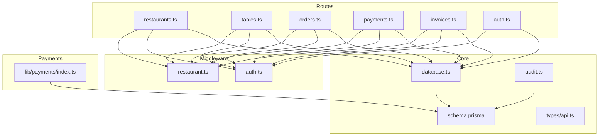
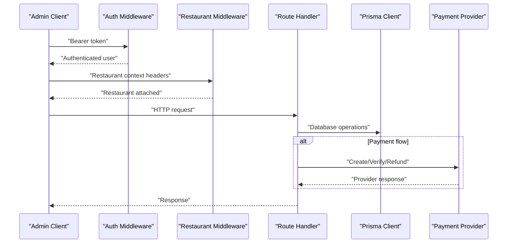
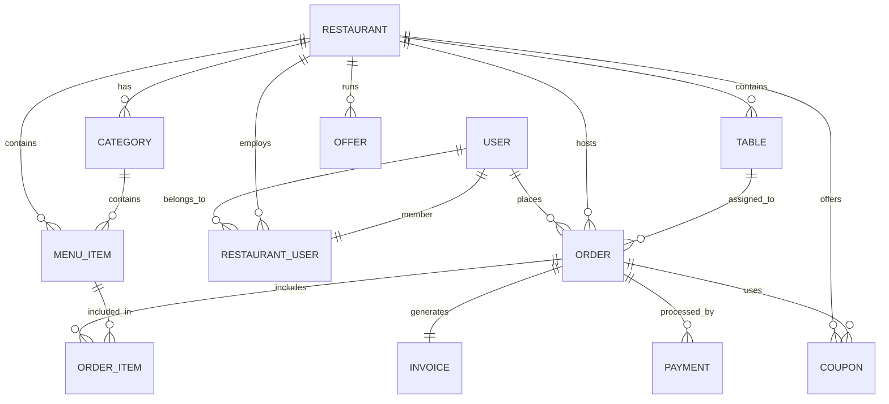
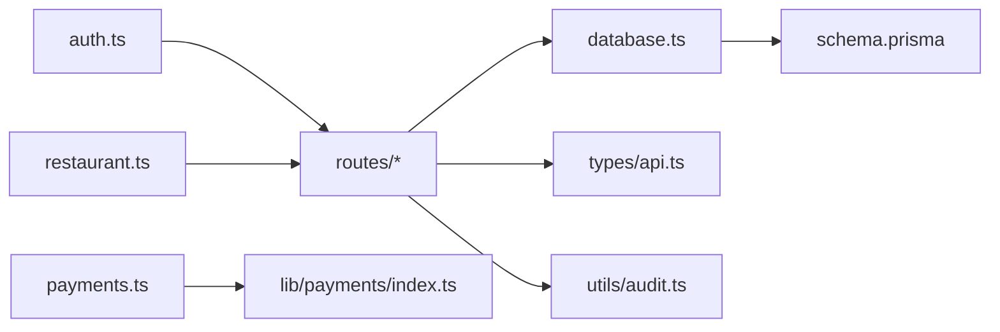
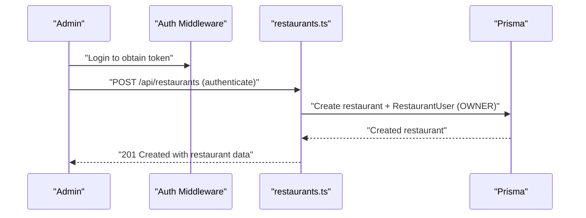
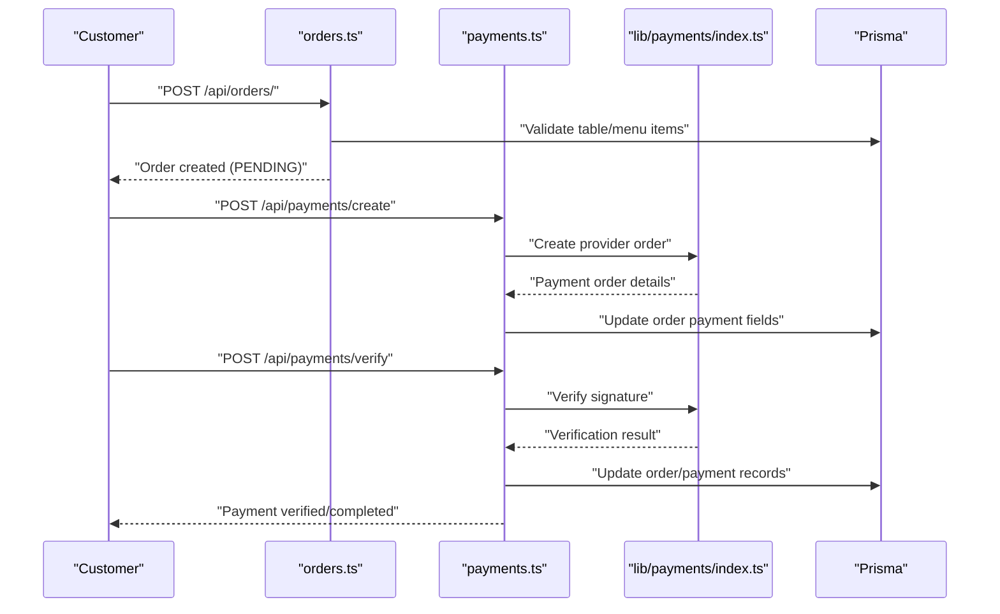

# Restaurant Administration Endpoints

<cite>
**Referenced Files in This Document**
- [restaurants.ts](file://restaurant-backend/src/routes/restaurants.ts)
- [tables.ts](file://restaurant-backend/src/routes/tables.ts)
- [auth.ts](file://restaurant-backend/src/routes/auth.ts)
- [orders.ts](file://restaurant-backend/src/routes/orders.ts)
- [payments.ts](file://restaurant-backend/src/routes/payments.ts)
- [invoices.ts](file://restaurant-backend/src/routes/invoices.ts)
- [restaurant.ts](file://restaurant-backend/src/middleware/restaurant.ts)
- [auth.ts](file://restaurant-backend/src/middleware/auth.ts)
- [api.ts](file://restaurant-backend/src/types/api.ts)
- [schema.prisma](file://restaurant-backend/prisma/schema.prisma)
- [database.ts](file://restaurant-backend/src/config/database.ts)
- [audit.ts](file://restaurant-backend/src/utils/audit.ts)
- [index.ts](file://restaurant-backend/src/lib/payments/index.ts)
- [DeQ-Restaurants-API.postman_collection.json](file://restaurant-backend/postman/DeQ-Restaurants-API.postman_collection.json)
</cite>

## Table of Contents
1. [Introduction](#introduction)
2. [Project Structure](#project-structure)
3. [Core Components](#core-components)
4. [Architecture Overview](#architecture-overview)
5. [Detailed Component Analysis](#detailed-component-analysis)
6. [Dependency Analysis](#dependency-analysis)
7. [Performance Considerations](#performance-considerations)
8. [Troubleshooting Guide](#troubleshooting-guide)
9. [Conclusion](#conclusion)
10. [Appendices](#appendices)

## Introduction
This document provides comprehensive API documentation for restaurant administration endpoints. It covers restaurant onboarding and setup, profile management, operational settings, staff member management, table management, order and payment workflows, invoicing, analytics and earnings tracking, multi-restaurant support, and integrations with external payment providers. The goal is to enable administrators and developers to configure, operate, and monitor restaurant services effectively.

## Project Structure
The backend is organized around Express routes grouped by domain (restaurants, tables, orders, payments, invoices, auth), middleware for authentication and restaurant context, Prisma schema defining the data model, and utility modules for payments, logging, and auditing.

**Diagram sources**
- [restaurants.ts:1-554](file://restaurant-backend/src/routes/restaurants.ts#L1-L554)
- [tables.ts:1-92](file://restaurant-backend/src/routes/tables.ts#L1-L92)
- [orders.ts:1-694](file://restaurant-backend/src/routes/orders.ts#L1-L694)
- [payments.ts:1-731](file://restaurant-backend/src/routes/payments.ts#L1-L731)
- [invoices.ts:1-599](file://restaurant-backend/src/routes/invoices.ts#L1-L599)
- [auth.ts:1-137](file://restaurant-backend/src/middleware/auth.ts#L1-L137)
- [restaurant.ts:1-254](file://restaurant-backend/src/middleware/restaurant.ts#L1-L254)
- [database.ts:1-66](file://restaurant-backend/src/config/database.ts#L1-L66)
- [schema.prisma:1-402](file://restaurant-backend/prisma/schema.prisma#L1-L402)
- [api.ts:1-114](file://restaurant-backend/src/types/api.ts#L1-L114)
- [audit.ts:1-17](file://restaurant-backend/src/utils/audit.ts#L1-L17)
- [index.ts:1-124](file://restaurant-backend/src/lib/payments/index.ts#L1-L124)

**Section sources**
- [restaurants.ts:1-554](file://restaurant-backend/src/routes/restaurants.ts#L1-L554)
- [tables.ts:1-92](file://restaurant-backend/src/routes/tables.ts#L1-L92)
- [orders.ts:1-694](file://restaurant-backend/src/routes/orders.ts#L1-L694)
- [payments.ts:1-731](file://restaurant-backend/src/routes/payments.ts#L1-L731)
- [invoices.ts:1-599](file://restaurant-backend/src/routes/invoices.ts#L1-L599)
- [auth.ts:1-137](file://restaurant-backend/src/middleware/auth.ts#L1-L137)
- [restaurant.ts:1-254](file://restaurant-backend/src/middleware/restaurant.ts#L1-L254)
- [database.ts:1-66](file://restaurant-backend/src/config/database.ts#L1-L66)
- [schema.prisma:1-402](file://restaurant-backend/prisma/schema.prisma#L1-L402)
- [api.ts:1-114](file://restaurant-backend/src/types/api.ts#L1-L114)
- [audit.ts:1-17](file://restaurant-backend/src/utils/audit.ts#L1-L17)
- [index.ts:1-124](file://restaurant-backend/src/lib/payments/index.ts#L1-L124)

## Core Components
- Authentication and Authorization: JWT-based authentication with role checks and optional restaurant context attachment.
- Restaurant Management: Onboarding, profile retrieval, operational settings, and staff management.
- Table Management: CRUD and availability queries for tables.
- Orders and Payments: Order creation, updates, payment initiation, verification, refunds, and cash confirmation.
- Invoicing: Automatic and manual invoice generation, delivery via email/SMS, and PDF refresh.
- Analytics and Earnings: Earning records and audit logs for tracking revenue and actions.

**Section sources**
- [auth.ts:1-137](file://restaurant-backend/src/middleware/auth.ts#L1-L137)
- [restaurant.ts:1-254](file://restaurant-backend/src/middleware/restaurant.ts#L1-L254)
- [restaurants.ts:1-554](file://restaurant-backend/src/routes/restaurants.ts#L1-L554)
- [tables.ts:1-92](file://restaurant-backend/src/routes/tables.ts#L1-L92)
- [orders.ts:1-694](file://restaurant-backend/src/routes/orders.ts#L1-L694)
- [payments.ts:1-731](file://restaurant-backend/src/routes/payments.ts#L1-L731)
- [invoices.ts:1-599](file://restaurant-backend/src/routes/invoices.ts#L1-L599)
- [audit.ts:1-17](file://restaurant-backend/src/utils/audit.ts#L1-L17)

## Architecture Overview
The system uses Express with TypeScript, Prisma ORM for database operations, and modular middleware for authentication and restaurant context. Payment processing integrates with external providers via a provider abstraction.

**Diagram sources**
- [auth.ts:1-137](file://restaurant-backend/src/middleware/auth.ts#L1-L137)
- [restaurant.ts:1-254](file://restaurant-backend/src/middleware/restaurant.ts#L1-L254)
- [payments.ts:1-731](file://restaurant-backend/src/routes/payments.ts#L1-L731)
- [index.ts:1-124](file://restaurant-backend/src/lib/payments/index.ts#L1-L124)
- [database.ts:1-66](file://restaurant-backend/src/config/database.ts#L1-L66)

## Detailed Component Analysis

### Restaurant Onboarding and Setup
Endpoints for creating restaurants, retrieving current/owned restaurants, and searching public restaurants.

- POST /api/restaurants
  - Purpose: Create a new restaurant and auto-assign the creator as OWNER.
  - Authentication: Required (authenticate).
  - Request body: Restaurant profile fields (name, email, phone, address, city, state, country, cuisineTypes).
  - Response: Created restaurant with initial status and payment policy defaults.
  - Audit: Logs RESTAURANT_CREATED with slug/subdomain metadata.

- GET /api/restaurants/current
  - Purpose: Retrieve the restaurant context attached to the request.
  - Authentication: Required (requireRestaurant).
  - Response: Current restaurant object.

- GET /api/restaurants/mine
  - Purpose: List restaurants where the authenticated user has active membership.
  - Authentication: Required (authenticate).
  - Response: Array of restaurants with role and status.

- GET /api/restaurants/public/search
  - Purpose: Public search across restaurants with filters (query, cuisine, location).
  - Authentication: Optional (optionalAuth).
  - Response: Paginated list of restaurants with selected fields.

- GET /api/restaurants/public/:identifier
  - Purpose: Public detail lookup by id/slug/subdomain.
  - Authentication: Optional.
  - Response: Restaurant details with categories and recent menu items.

- Operational Settings
  - GET /api/restaurants/settings/payment-policy
    - Purpose: Fetch current payment policy (collection timing, cash enabled).
    - Authentication: Required (authenticate), Restaurant context (requireRestaurant), Role: OWNER/ADMIN.
  - PUT /api/restaurants/settings/payment-policy
    - Purpose: Update payment policy.
    - Authentication: Required, Restaurant context, Role: OWNER/ADMIN.
    - Audit: Logs PAYMENT_POLICY_UPDATED.

- Staff Management
  - GET /api/restaurants/users
    - Purpose: List active members of the restaurant with roles.
    - Authentication: Required, Restaurant context, Role: OWNER/ADMIN.
  - POST /api/restaurants/users
    - Purpose: Add or update a user's role in the restaurant.
    - Authentication: Required, Restaurant context, Role: OWNER/ADMIN.
    - Response: Membership object with user details.
    - Audit: Logs RESTAURANT_USER_UPSERT.

**Section sources**
- [restaurants.ts:307-375](file://restaurant-backend/src/routes/restaurants.ts#L307-L375)
- [restaurants.ts:252-260](file://restaurant-backend/src/routes/restaurants.ts#L252-L260)
- [restaurants.ts:262-305](file://restaurant-backend/src/routes/restaurants.ts#L262-L305)
- [restaurants.ts:92-164](file://restaurant-backend/src/routes/restaurants.ts#L92-L164)
- [restaurants.ts:166-250](file://restaurant-backend/src/routes/restaurants.ts#L166-L250)
- [restaurants.ts:377-394](file://restaurant-backend/src/routes/restaurants.ts#L377-L394)
- [restaurants.ts:396-429](file://restaurant-backend/src/routes/restaurants.ts#L396-L429)
- [restaurants.ts:431-480](file://restaurant-backend/src/routes/restaurants.ts#L431-L480)
- [restaurants.ts:482-551](file://restaurant-backend/src/routes/restaurants.ts#L482-L551)
- [restaurant.ts:221-253](file://restaurant-backend/src/middleware/restaurant.ts#L221-L253)
- [audit.ts:1-17](file://restaurant-backend/src/utils/audit.ts#L1-L17)

### Table Management
Endpoints for managing tables used in reservations and order assignment.

- GET /api/tables/
  - Purpose: List all tables for the current restaurant.
  - Authentication: Required, Restaurant context.

- GET /api/tables/available
  - Purpose: List active tables for availability checks.
  - Authentication: Required, Restaurant context.

- GET /api/tables/:id
  - Purpose: Retrieve a specific table by ID.
  - Authentication: Required, Restaurant context.
  - Validation: Requires a valid table ID.

**Section sources**
- [tables.ts:8-26](file://restaurant-backend/src/routes/tables.ts#L8-L26)
- [tables.ts:28-49](file://restaurant-backend/src/routes/tables.ts#L28-L49)
- [tables.ts:51-89](file://restaurant-backend/src/routes/tables.ts#L51-L89)

### Orders and Reservation Handling
Endpoints for creating orders, modifying them, applying coupons, and updating statuses.

- POST /api/orders/
  - Purpose: Create a new order for a table with items.
  - Authentication: Required, Restaurant context.
  - Validation: tableId required, items array must be non-empty, each item requires menuItemId and quantity.
  - Payment provider selection: RAZORPAY, PAYTM, PHONEPE, CASH (with restrictions).
  - Cash policy: If cash is disabled by restaurant, CASH provider is rejected.
  - Status: New orders start as PENDING; staff/admin must confirm via status endpoint.
  - Real-time: Emits order.created event.

- POST /api/orders/:id/items
  - Purpose: Add items to an existing unpaid order.
  - Restrictions: Cannot add items to pay-before-meal orders; cannot modify closed orders.
  - Recalculation: Updates subtotal, discount, tax, total, due, and payment status.

- POST /api/orders/:id/apply-coupon
  - Purpose: Apply or replace a coupon on an unpaid order.
  - Validation: Coupon must be active, within validity period, usage limits, and meet minimum order value.

- GET /api/orders/
  - Purpose: Fetch orders for the authenticated user at the current restaurant.

- GET /api/orders/restaurant/all
  - Purpose: Fetch all orders for the current restaurant (OWNER/ADMIN/STAFF).
  - Authentication: Required, Restaurant context, Role: OWNER/ADMIN/STAFF.

- GET /api/orders/:id
  - Purpose: Fetch a specific order for the authenticated user.

- PUT /api/orders/:id/status
  - Purpose: Update order status (OWNER/ADMIN/STAFF).
  - Constraint: For pay-before-meal orders, payment must be completed before advancing to CONFIRMED/PREPARING/READY/SERVED/COMPLETED.

- PUT /api/orders/:id/cancel
  - Purpose: Cancel an order if eligible (PENDING/CONFIRMED and no payment captured).

**Section sources**
- [orders.ts:82-267](file://restaurant-backend/src/routes/orders.ts#L82-L267)
- [orders.ts:269-394](file://restaurant-backend/src/routes/orders.ts#L269-L394)
- [orders.ts:396-497](file://restaurant-backend/src/routes/orders.ts#L396-L497)
- [orders.ts:499-546](file://restaurant-backend/src/routes/orders.ts#L499-L546)
- [orders.ts:548-579](file://restaurant-backend/src/routes/orders.ts#L548-L579)
- [orders.ts:581-629](file://restaurant-backend/src/routes/orders.ts#L581-L629)
- [orders.ts:631-691](file://restaurant-backend/src/routes/orders.ts#L631-L691)

### Payments and Cash Handling
Endpoints for payment creation, verification, refunds, and cash confirmation.

- GET /api/payments/providers
  - Purpose: List enabled payment providers for the restaurant (including CASH if enabled).

- POST /api/payments/create
  - Purpose: Initialize a payment order with a provider.
  - Validation: Order must exist, not already processed, and have due amount > 0.
  - Provider selection: Defaults to order.paymentProvider or RAZORPAY.

- POST /api/payments/verify
  - Purpose: Verify payment signature and update order/payment records.
  - Transaction: Atomic update of order and creation of payment record.
  - Audit: Logs PAYMENT_VERIFIED.

- POST /api/payments/refund
  - Purpose: Refund a completed or partially paid order.
  - Validation: Order must have a payment transaction ID.
  - Audit: Logs PAYMENT_REFUNDED.

- GET /api/payments/status/:orderId
  - Purpose: Check payment status and history for an order.

- POST /api/payments/cash/confirm
  - Purpose: Confirm cash payments (OWNER/ADMIN).
  - Validation: Order must be unpaid/partially paid and use CASH provider.

- PUT /api/payments/status
  - Purpose: Manually update payment status and recalculate due/amounts (OWNER/ADMIN).
  - Auto-confirm: Fully paid PENDING orders are auto-confirmed.

- Earnings and Invoices
  - Automatic invoice generation and earning calculation occur upon full payment completion.
  - Ensures invoice and earning records are created only once per order.

**Section sources**
- [payments.ts:180-193](file://restaurant-backend/src/routes/payments.ts#L180-L193)
- [payments.ts:195-292](file://restaurant-backend/src/routes/payments.ts#L195-L292)
- [payments.ts:294-407](file://restaurant-backend/src/routes/payments.ts#L294-L407)
- [payments.ts:409-516](file://restaurant-backend/src/routes/payments.ts#L409-L516)
- [payments.ts:518-568](file://restaurant-backend/src/routes/payments.ts#L518-L568)
- [payments.ts:570-646](file://restaurant-backend/src/routes/payments.ts#L570-L646)
- [payments.ts:648-728](file://restaurant-backend/src/routes/payments.ts#L648-L728)
- [payments.ts:61-166](file://restaurant-backend/src/routes/payments.ts#L61-L166)

### Invoicing
Endpoints for generating, retrieving, resending, and refreshing invoices.

- POST /api/invoices/generate
  - Purpose: Generate invoice for a completed payment.
  - Delivery: Optional EMAIL/SMS delivery; tracks sentVia and results.
  - Auto-generation: Automatically created when payment completes (via payments module).

- GET /api/invoices/:orderId
  - Purpose: Retrieve invoice details for an order.

- GET /api/invoices/user/list
  - Purpose: List invoices for the authenticated user.

- POST /api/invoices/:invoiceId/resend
  - Purpose: Resend invoice via EMAIL/SMS.

- POST /api/invoices/:invoiceOrOrderId/refresh-pdf
  - Purpose: Regenerate and store PDF by invoice ID or order ID.

**Section sources**
- [invoices.ts:21-241](file://restaurant-backend/src/routes/invoices.ts#L21-L241)
- [invoices.ts:243-287](file://restaurant-backend/src/routes/invoices.ts#L243-L287)
- [invoices.ts:289-325](file://restaurant-backend/src/routes/invoices.ts#L289-L325)
- [invoices.ts:327-454](file://restaurant-backend/src/routes/invoices.ts#L327-L454)
- [invoices.ts:456-566](file://restaurant-backend/src/routes/invoices.ts#L456-L566)

### Authentication and Authorization
- Authentication: Extracts Bearer token from Authorization header or body/query, verifies JWT, attaches user to request.
- Authorization: Centralized authorize(role...) and restaurant-specific authorizeRestaurantRole for OWNER/ADMIN/STAFF.
- Optional auth: Allows requests without strict enforcement for public endpoints.

**Section sources**
- [auth.ts:7-75](file://restaurant-backend/src/middleware/auth.ts#L7-L75)
- [auth.ts:77-89](file://restaurant-backend/src/middleware/auth.ts#L77-L89)
- [auth.ts:91-137](file://restaurant-backend/src/middleware/auth.ts#L91-L137)
- [restaurant.ts:221-253](file://restaurant-backend/src/middleware/restaurant.ts#L221-L253)

### Multi-Restaurant Support and Ownership
- Restaurant context attachment: Extracts restaurant from headers, subdomain/host, or path parameters; supports fallback queries when schema fields differ.
- Membership roles: Users can belong to multiple restaurants with distinct roles (OWNER, ADMIN, STAFF).
- Ownership transfer: Not exposed as a dedicated endpoint; role changes via POST /api/restaurants/users and status management via operational settings.

**Section sources**
- [restaurant.ts:84-208](file://restaurant-backend/src/middleware/restaurant.ts#L84-L208)
- [restaurants.ts:262-305](file://restaurant-backend/src/routes/restaurants.ts#L262-L305)
- [restaurants.ts:482-551](file://restaurant-backend/src/routes/restaurants.ts#L482-L551)

### Data Model Overview
The Prisma schema defines core entities and relationships used across endpoints.

**Diagram sources**
- [schema.prisma:11-402](file://restaurant-backend/prisma/schema.prisma#L11-L402)

**Section sources**
- [schema.prisma:11-402](file://restaurant-backend/prisma/schema.prisma#L11-L402)

### Payment Providers Integration
- Provider abstraction: Supports RAZORPAY, PAYTM, PHONEPE, and CASH.
- Environment-driven configuration: Provider availability depends on environment variables.
- Operations: createOrder, verifyPayment, refund.

**Section sources**
- [index.ts:1-124](file://restaurant-backend/src/lib/payments/index.ts#L1-L124)
- [payments.ts:18-42](file://restaurant-backend/src/routes/payments.ts#L18-L42)

### Analytics and Earnings Tracking
- Earnings: Automatic creation of earning records upon full payment completion, calculating platform commission and restaurant earnings.
- Audit Logs: Comprehensive logging for critical actions (onboarding, payment updates, user additions, etc.).

**Section sources**
- [payments.ts:61-166](file://restaurant-backend/src/routes/payments.ts#L61-L166)
- [audit.ts:1-17](file://restaurant-backend/src/utils/audit.ts#L1-L17)

## Dependency Analysis
The following diagram shows key dependencies among modules and their relationships.

**Diagram sources**
- [auth.ts:1-137](file://restaurant-backend/src/middleware/auth.ts#L1-L137)
- [restaurant.ts:1-254](file://restaurant-backend/src/middleware/restaurant.ts#L1-L254)
- [restaurants.ts:1-554](file://restaurant-backend/src/routes/restaurants.ts#L1-L554)
- [tables.ts:1-92](file://restaurant-backend/src/routes/tables.ts#L1-L92)
- [orders.ts:1-694](file://restaurant-backend/src/routes/orders.ts#L1-L694)
- [payments.ts:1-731](file://restaurant-backend/src/routes/payments.ts#L1-L731)
- [invoices.ts:1-599](file://restaurant-backend/src/routes/invoices.ts#L1-L599)
- [database.ts:1-66](file://restaurant-backend/src/config/database.ts#L1-L66)
- [api.ts:1-114](file://restaurant-backend/src/types/api.ts#L1-L114)
- [audit.ts:1-17](file://restaurant-backend/src/utils/audit.ts#L1-L17)
- [index.ts:1-124](file://restaurant-backend/src/lib/payments/index.ts#L1-L124)
- [schema.prisma:1-402](file://restaurant-backend/prisma/schema.prisma#L1-L402)

**Section sources**
- [auth.ts:1-137](file://restaurant-backend/src/middleware/auth.ts#L1-L137)
- [restaurant.ts:1-254](file://restaurant-backend/src/middleware/restaurant.ts#L1-L254)
- [restaurants.ts:1-554](file://restaurant-backend/src/routes/restaurants.ts#L1-L554)
- [tables.ts:1-92](file://restaurant-backend/src/routes/tables.ts#L1-L92)
- [orders.ts:1-694](file://restaurant-backend/src/routes/orders.ts#L1-L694)
- [payments.ts:1-731](file://restaurant-backend/src/routes/payments.ts#L1-L731)
- [invoices.ts:1-599](file://restaurant-backend/src/routes/invoices.ts#L1-L599)
- [database.ts:1-66](file://restaurant-backend/src/config/database.ts#L1-L66)
- [api.ts:1-114](file://restaurant-backend/src/types/api.ts#L1-L114)
- [audit.ts:1-17](file://restaurant-backend/src/utils/audit.ts#L1-L17)
- [index.ts:1-124](file://restaurant-backend/src/lib/payments/index.ts#L1-L124)
- [schema.prisma:1-402](file://restaurant-backend/prisma/schema.prisma#L1-L402)

## Performance Considerations
- Selective field loading: Routes use dynamic select clauses to avoid fetching unnecessary fields, reducing payload sizes and query overhead.
- Schema-aware queries: Runtime detection of schema fields prevents crashes during migrations and ensures backward compatibility.
- Transactions: Payment and order updates use atomic transactions to maintain consistency.
- Logging and monitoring: Structured logs and audit trails aid in diagnosing performance bottlenecks and tracking critical events.

[No sources needed since this section provides general guidance]

## Troubleshooting Guide
- Authentication failures: Ensure Authorization header contains a valid Bearer token and JWT_SECRET is configured.
- Restaurant context missing: Verify x-restaurant-slug/x-restaurant-subdomain headers or subdomain/host match configured restaurant identifiers.
- Payment provider errors: Check environment variables for provider keys and ensure provider is enabled.
- Order status transitions: For pay-before-meal orders, payment must be completed before advancing to CONFIRMED/PREPARING/READY/SERVED/COMPLETED.
- Audit logs: Missing audit table indicates migrations not applied; logs are safely ignored to avoid breaking flows.

**Section sources**
- [auth.ts:33-75](file://restaurant-backend/src/middleware/auth.ts#L33-L75)
- [restaurant.ts:84-208](file://restaurant-backend/src/middleware/restaurant.ts#L84-L208)
- [payments.ts:240-242](file://restaurant-backend/src/routes/payments.ts#L240-L242)
- [orders.ts:600-609](file://restaurant-backend/src/routes/orders.ts#L600-L609)
- [audit.ts:9-15](file://restaurant-backend/src/utils/audit.ts#L9-L15)

## Conclusion
The restaurant administration API provides a comprehensive set of endpoints for onboarding, configuration, staff management, table handling, orders, payments, invoicing, and analytics. Its modular design, robust authentication and authorization, and provider abstraction facilitate scalable and secure restaurant operations.

[No sources needed since this section summarizes without analyzing specific files]

## Appendices

### API Workflow Examples

#### Restaurant Onboarding Workflow

**Diagram sources**
- [restaurants.ts:307-375](file://restaurant-backend/src/routes/restaurants.ts#L307-L375)
- [auth.ts:1-137](file://restaurant-backend/src/middleware/auth.ts#L1-L137)

#### Order Creation and Payment Flow

**Diagram sources**
- [orders.ts:82-267](file://restaurant-backend/src/routes/orders.ts#L82-L267)
- [payments.ts:195-292](file://restaurant-backend/src/routes/payments.ts#L195-L292)
- [payments.ts:294-407](file://restaurant-backend/src/routes/payments.ts#L294-L407)
- [index.ts:1-124](file://restaurant-backend/src/lib/payments/index.ts#L1-L124)

### Administrative Best Practices
- Role-based access: Limit sensitive operations (payment status updates, staff management) to OWNER/ADMIN.
- Payment policies: Configure paymentCollectionTiming and cashPaymentEnabled according to operational needs.
- Audit and monitoring: Enable audit logs and review logs regularly for compliance and troubleshooting.
- Provider configuration: Keep provider credentials up-to-date and restrict provider lists per restaurant.

[No sources needed since this section provides general guidance]