# Authentication & Authorization

<cite>
**Referenced Files in This Document**
- [auth.ts](file://restaurant-backend/src/middleware/auth.ts)
- [auth.ts](file://restaurant-backend/src/routes/auth.ts)
- [restaurant.ts](file://restaurant-backend/src/middleware/restaurant.ts)
- [app.ts](file://restaurant-backend/src/app.ts)
- [errorHandler.ts](file://restaurant-backend/src/middleware/errorHandler.ts)
- [api.ts](file://restaurant-backend/src/types/api.ts)
- [schema.prisma](file://restaurant-backend/prisma/schema.prisma)
- [auth.ts](file://restaurant-frontend/src/store/auth.ts)
- [api-client.ts](file://restaurant-frontend/src/lib/api-client.ts)
</cite>

## Table of Contents
1. [Introduction](#introduction)
2. [Project Structure](#project-structure)
3. [Core Components](#core-components)
4. [Architecture Overview](#architecture-overview)
5. [Detailed Component Analysis](#detailed-component-analysis)
6. [Dependency Analysis](#dependency-analysis)
7. [Performance Considerations](#performance-considerations)
8. [Troubleshooting Guide](#troubleshooting-guide)
9. [Conclusion](#conclusion)

## Introduction
This document explains DeQ-Bite’s JWT-based authentication and authorization system. It covers token generation and validation, refresh mechanisms, role-based access control (RBAC), middleware protecting routes, restaurant-scoped authorization, login/logout flows, password hashing with bcrypt, session management, token expiration handling, CORS and rate limiting, and error handling for authentication failures.

## Project Structure
The authentication and authorization logic spans backend middleware, routes, and frontend client stores and interceptors. The backend uses Express, JSON Web Tokens, bcrypt, Prisma, and Helmet/CORS/rate limiting. The frontend persists tokens and injects Authorization headers automatically.

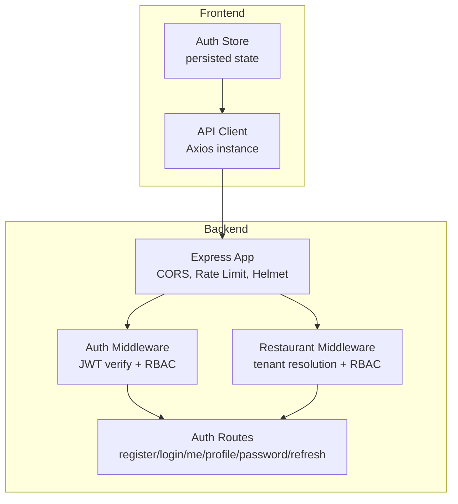

**Diagram sources**
- [app.ts:34-148](file://restaurant-backend/src/app.ts#L34-L148)
- [auth.ts:7-137](file://restaurant-backend/src/middleware/auth.ts#L7-L137)
- [restaurant.ts:76-246](file://restaurant-backend/src/middleware/restaurant.ts#L76-L246)
- [auth.ts:10-390](file://restaurant-backend/src/routes/auth.ts#L10-L390)

**Section sources**
- [app.ts:34-148](file://restaurant-backend/src/app.ts#L34-L148)
- [auth.ts:7-137](file://restaurant-backend/src/middleware/auth.ts#L7-L137)
- [restaurant.ts:76-246](file://restaurant-backend/src/middleware/restaurant.ts#L76-L246)
- [auth.ts:10-390](file://restaurant-backend/src/routes/auth.ts#L10-L390)

## Core Components
- JWT-based authentication middleware validates tokens and attaches user info to requests.
- Role-based authorization middleware enforces allowed roles globally and per-restaurant.
- Auth routes implement registration, login, profile retrieval, password change, and token refresh.
- Frontend stores token in persisted state and injects Authorization headers via an Axios interceptor.
- Database schema defines user roles and restaurant-user memberships for tenant-level permissions.

Key implementation references:
- [JWT verify and user attach:12-65](file://restaurant-backend/src/middleware/auth.ts#L12-L65)
- [Role-based authorization:77-89](file://restaurant-backend/src/middleware/auth.ts#L77-L89)
- [Optional auth for guest-friendly flows:91-137](file://restaurant-backend/src/middleware/auth.ts#L91-L137)
- [Token generation:31-45](file://restaurant-backend/src/routes/auth.ts#L31-L45)
- [Login flow:105-158](file://restaurant-backend/src/routes/auth.ts#L105-L158)
- [Profile and membership queries:161-335](file://restaurant-backend/src/routes/auth.ts#L161-L335)
- [Password change:338-373](file://restaurant-backend/src/routes/auth.ts#L338-L373)
- [Token refresh:376-387](file://restaurant-backend/src/routes/auth.ts#L376-L387)
- [Frontend token persistence and interceptor:206-240](file://restaurant-frontend/src/lib/api-client.ts#L206-L240)
- [Frontend auth store actions:24-177](file://restaurant-frontend/src/store/auth.ts#L24-L177)
- [User and restaurant role enums:326-339](file://restaurant-backend/prisma/schema.prisma#L326-L339)

**Section sources**
- [auth.ts:7-137](file://restaurant-backend/src/middleware/auth.ts#L7-L137)
- [auth.ts:31-387](file://restaurant-backend/src/routes/auth.ts#L31-L387)
- [api-client.ts:206-240](file://restaurant-frontend/src/lib/api-client.ts#L206-L240)
- [auth.ts:24-177](file://restaurant-frontend/src/store/auth.ts#L24-L177)
- [schema.prisma:326-339](file://restaurant-backend/prisma/schema.prisma#L326-L339)

## Architecture Overview
The system enforces layered security:
- Transport/security: Helmet, CORS, rate limiting.
- Authentication: JWT bearer tokens validated centrally.
- Authorization: Global roles and restaurant-scoped roles.
- Tenant isolation: Restaurant context attached via subdomain/slug headers or path.

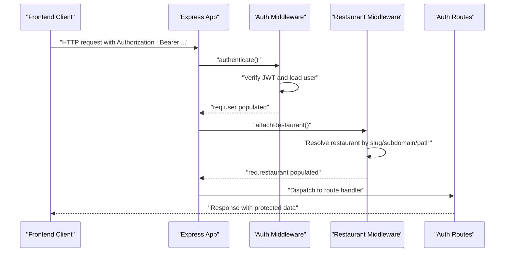

**Diagram sources**
- [app.ts:34-148](file://restaurant-backend/src/app.ts#L34-L148)
- [auth.ts:7-137](file://restaurant-backend/src/middleware/auth.ts#L7-L137)
- [restaurant.ts:76-246](file://restaurant-backend/src/middleware/restaurant.ts#L76-L246)
- [auth.ts:10-390](file://restaurant-backend/src/routes/auth.ts#L10-L390)

## Detailed Component Analysis

### JWT Token Generation and Validation
- Token generation uses a signing secret from environment variables with an expiry window configurable via environment.
- Validation occurs in middleware using the same secret; invalid/expired tokens are handled with appropriate HTTP statuses.
- Optional authentication mode allows unauthenticated requests to proceed, useful for public pages.

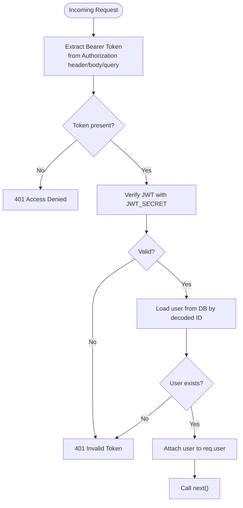

**Diagram sources**
- [auth.ts:12-75](file://restaurant-backend/src/middleware/auth.ts#L12-L75)

**Section sources**
- [auth.ts:12-75](file://restaurant-backend/src/middleware/auth.ts#L12-L75)
- [auth.ts:31-45](file://restaurant-backend/src/routes/auth.ts#L31-L45)

### Authentication Middleware
- Centralized middleware extracts tokens from multiple locations and verifies them.
- Populates req.user with essential fields and continues to route handlers.
- Provides an authorize higher-order function to restrict routes by role.
- Provides optionalAuth to allow guest access while still attaching user if authenticated.

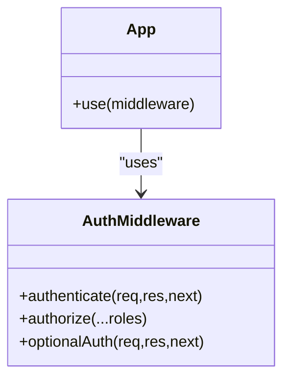

**Diagram sources**
- [auth.ts:7-137](file://restaurant-backend/src/middleware/auth.ts#L7-L137)

**Section sources**
- [auth.ts:7-137](file://restaurant-backend/src/middleware/auth.ts#L7-L137)

### Role-Based Access Control (RBAC)
- Global roles: customer, admin, staff, owner, central_admin, kitchen_staff.
- Restaurant-scoped roles: owner, admin, staff.
- Global RBAC enforced via authorize(role...).
- Restaurant RBAC enforced via authorizeRestaurantRole(...roles) after tenant context is attached.

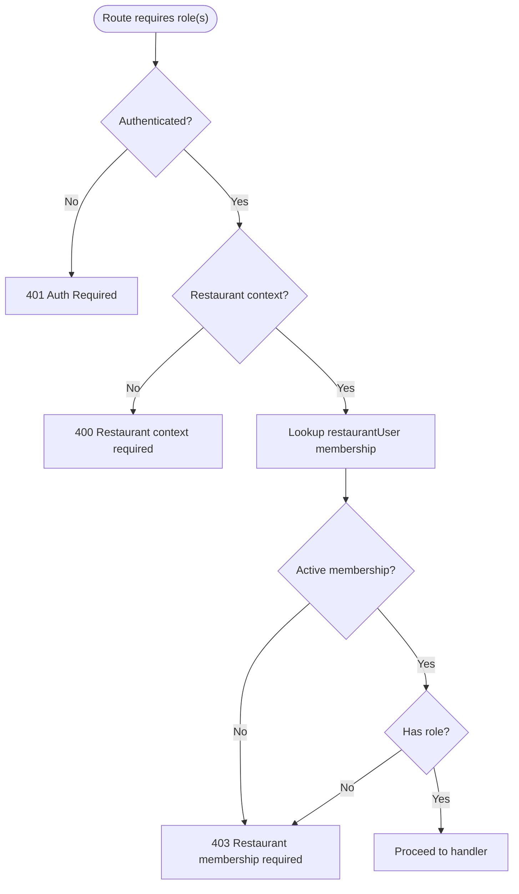

**Diagram sources**
- [auth.ts:77-89](file://restaurant-backend/src/middleware/auth.ts#L77-L89)
- [restaurant.ts:213-245](file://restaurant-backend/src/middleware/restaurant.ts#L213-L245)

**Section sources**
- [schema.prisma:326-339](file://restaurant-backend/prisma/schema.prisma#L326-L339)
- [auth.ts:77-89](file://restaurant-backend/src/middleware/auth.ts#L77-L89)
- [restaurant.ts:213-245](file://restaurant-backend/src/middleware/restaurant.ts#L213-L245)

### Restaurant-Specific Authorization Middleware
- Resolves restaurant context from x-restaurant-slug, x-restaurant-subdomain, host subdomain, or path.
- Attaches a minimal restaurant object to req.restaurant for downstream authorization checks.
- Enforces active restaurant and optional status filtering based on client schema compatibility.

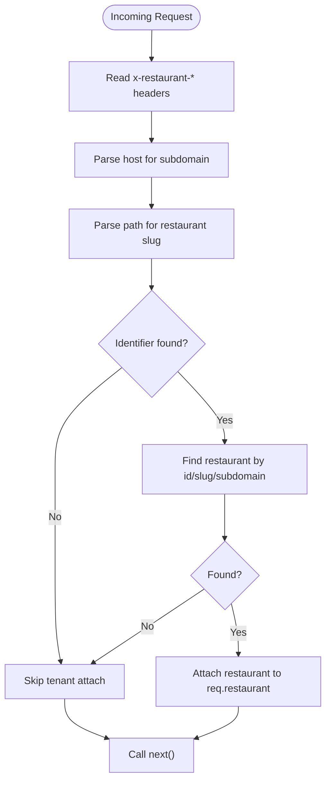

**Diagram sources**
- [restaurant.ts:76-200](file://restaurant-backend/src/middleware/restaurant.ts#L76-L200)

**Section sources**
- [restaurant.ts:76-200](file://restaurant-backend/src/middleware/restaurant.ts#L76-L200)

### Protected Route Configuration and Permission Checking
- Auth routes are mounted under /api/auth and protected by authenticate where required.
- Profile and membership queries combine user data with restaurant membership to enrich responses.
- Restaurant-scoped routes are mounted under /api/:restaurantSlug and decorated with attachRestaurant.

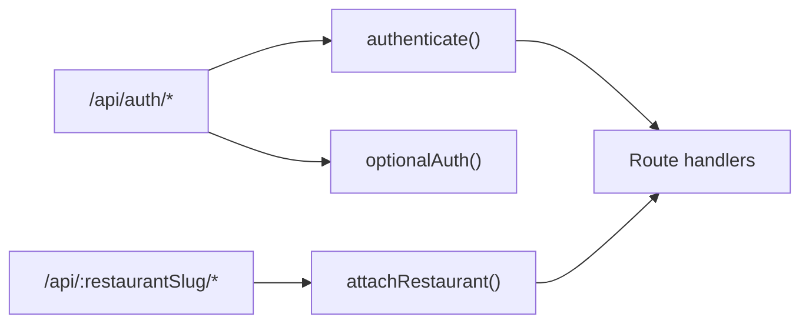

**Diagram sources**
- [app.ts:107-134](file://restaurant-backend/src/app.ts#L107-L134)
- [auth.ts:10-390](file://restaurant-backend/src/routes/auth.ts#L10-L390)
- [auth.ts:91-137](file://restaurant-backend/src/middleware/auth.ts#L91-L137)
- [restaurant.ts:76-200](file://restaurant-backend/src/middleware/restaurant.ts#L76-L200)

**Section sources**
- [app.ts:107-134](file://restaurant-backend/src/app.ts#L107-L134)
- [auth.ts:161-335](file://restaurant-backend/src/routes/auth.ts#L161-L335)

### Login and Logout Processes
- Login validates credentials against hashed passwords and returns a signed JWT.
- Registration hashes passwords and creates a customer user, then returns a JWT.
- Frontend stores the token in persisted state and sets Authorization header on all requests.
- Logout clears the stored token.

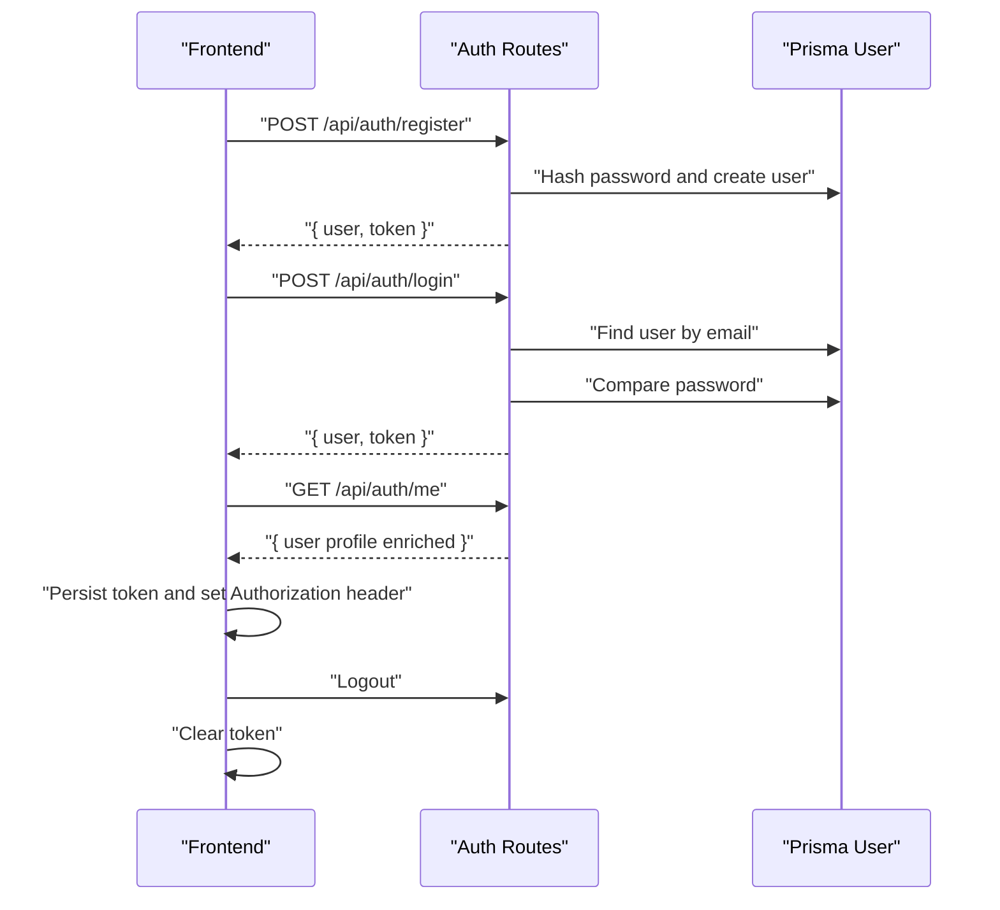

**Diagram sources**
- [auth.ts:48-102](file://restaurant-backend/src/routes/auth.ts#L48-L102)
- [auth.ts:105-158](file://restaurant-backend/src/routes/auth.ts#L105-L158)
- [auth.ts:161-232](file://restaurant-backend/src/routes/auth.ts#L161-L232)
- [auth.ts:24-93](file://restaurant-frontend/src/store/auth.ts#L24-L93)
- [api-client.ts:332-378](file://restaurant-frontend/src/lib/api-client.ts#L332-L378)

**Section sources**
- [auth.ts:48-158](file://restaurant-backend/src/routes/auth.ts#L48-L158)
- [auth.ts:24-93](file://restaurant-frontend/src/store/auth.ts#L24-L93)
- [api-client.ts:332-378](file://restaurant-frontend/src/lib/api-client.ts#L332-L378)

### Password Hashing with Bcrypt
- Passwords are hashed with bcrypt at a configurable cost factor during registration and password change.
- Password comparison is performed during login to validate credentials.

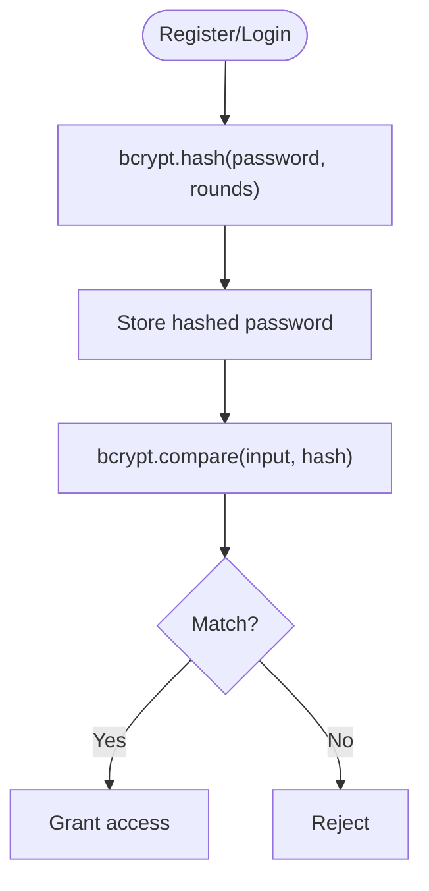

**Diagram sources**
- [auth.ts:66-67](file://restaurant-backend/src/routes/auth.ts#L66-L67)
- [auth.ts](file://restaurant-backend/src/routes/auth.ts#L130)
- [auth.ts:358-359](file://restaurant-backend/src/routes/auth.ts#L358-L359)

**Section sources**
- [auth.ts:66-67](file://restaurant-backend/src/routes/auth.ts#L66-L67)
- [auth.ts](file://restaurant-backend/src/routes/auth.ts#L130)
- [auth.ts:358-359](file://restaurant-backend/src/routes/auth.ts#L358-L359)

### Session Management
- Stateless JWT model: no server-side session storage.
- Frontend persists token locally and sends Authorization: Bearer on every request.
- Response interceptor handles 401 by clearing token and redirecting to sign-in.

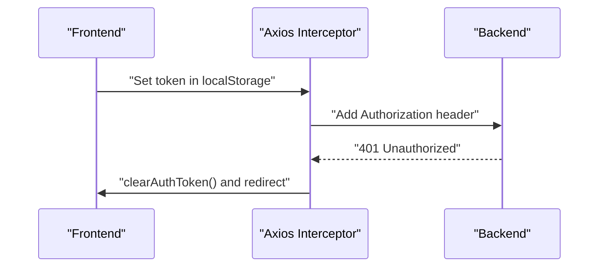

**Diagram sources**
- [api-client.ts:206-240](file://restaurant-frontend/src/lib/api-client.ts#L206-L240)
- [auth.ts:83-93](file://restaurant-frontend/src/store/auth.ts#L83-L93)

**Section sources**
- [api-client.ts:206-240](file://restaurant-frontend/src/lib/api-client.ts#L206-L240)
- [auth.ts:83-93](file://restaurant-frontend/src/store/auth.ts#L83-L93)

### Token Expiration and Refresh Strategies
- Tokens are signed with an expiry window; expired tokens are rejected by middleware.
- Refresh endpoint regenerates a new token for the authenticated user.

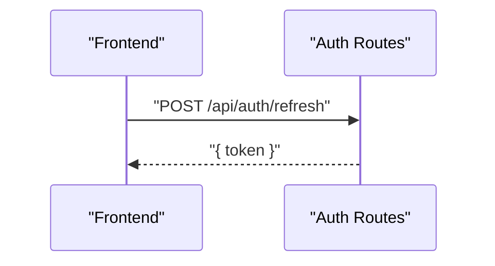

**Diagram sources**
- [auth.ts:376-387](file://restaurant-backend/src/routes/auth.ts#L376-L387)

**Section sources**
- [auth.ts:376-387](file://restaurant-backend/src/routes/auth.ts#L376-L387)

### CORS, CSRF Protection, and Rate Limiting
- CORS: Allowed origins include localhost ports and the frontend deployment URL; credentials enabled; specific headers allowed.
- CSRF: Not implemented in backend; CSRF protection is typically handled by frontend frameworks or external middleware. The backend does not set CSRF cookies or tokens.
- Rate limiting: Global rate limiter applied to all requests.

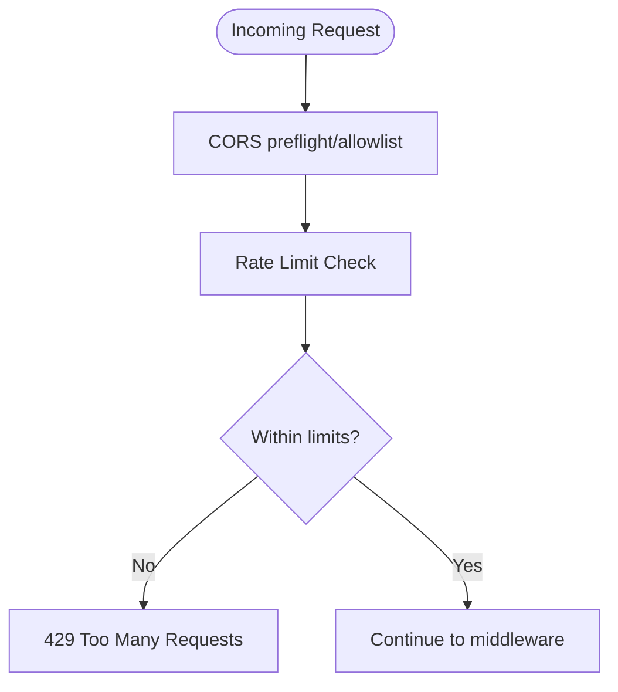

**Diagram sources**
- [app.ts:42-77](file://restaurant-backend/src/app.ts#L42-L77)

**Section sources**
- [app.ts:42-77](file://restaurant-backend/src/app.ts#L42-L77)

## Dependency Analysis
- Backend depends on Express, jsonwebtoken, bcryptjs, Prisma, helmet, cors, express-rate-limit, morgan, winston.
- Frontend depends on axios and Zustand for state management and persistence.

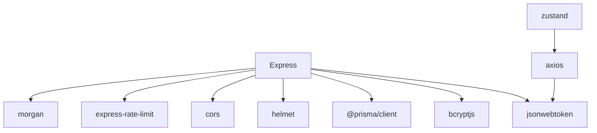

**Diagram sources**
- [package.json:18-44](file://restaurant-backend/package.json#L18-L44)
- [api-client.ts:1-10](file://restaurant-frontend/src/lib/api-client.ts#L1-L10)

**Section sources**
- [package.json:18-44](file://restaurant-backend/package.json#L18-L44)

## Performance Considerations
- Prefer short-lived access tokens with refresh endpoints to minimize long-lived token exposure.
- Use database indexes on frequently queried fields (e.g., user email, restaurant identifiers).
- Cache non-sensitive user/restaurant metadata where safe to reduce DB load.
- Monitor rate-limit triggers and adjust windows and thresholds as needed.

## Troubleshooting Guide
Common issues and resolutions:
- Missing or invalid JWT_SECRET: server logs indicate configuration error; ensure environment variable is set in production.
- Invalid/expired token: middleware throws 401; frontend clears token and redirects to sign-in.
- CORS blocked: verify allowed origins and credentials; ensure frontend URL matches.
- Rate limit exceeded: reduce client-side polling or increase limits temporarily.
- Schema mismatch: restaurant middleware gracefully falls back when DB/client schema differs.

**Section sources**
- [app.ts:28-32](file://restaurant-backend/src/app.ts#L28-L32)
- [auth.ts:67-74](file://restaurant-backend/src/middleware/auth.ts#L67-L74)
- [errorHandler.ts:22-76](file://restaurant-backend/src/middleware/errorHandler.ts#L22-L76)
- [app.ts:42-77](file://restaurant-backend/src/app.ts#L42-L77)
- [restaurant.ts:141-183](file://restaurant-backend/src/middleware/restaurant.ts#L141-L183)

## Conclusion
DeQ-Bite implements a robust, layered authentication and authorization system centered on JWT, with global and restaurant-scoped roles, strict middleware enforcement, and frontend-driven token management. While CSRF protection is not implemented in the backend, the system’s design supports secure, scalable tenant isolation and controlled access to resources.