# Backend Architecture

<cite>
**Referenced Files in This Document**
- [package.json](file://restaurant-backend/package.json)
- [tsconfig.json](file://restaurant-backend/tsconfig.json)
- [server.ts](file://restaurant-backend/src/server.ts)
- [app.ts](file://restaurant-backend/src/app.ts)
- [database.ts](file://restaurant-backend/src/config/database.ts)
- [errorHandler.ts](file://restaurant-backend/src/middleware/errorHandler.ts)
- [auth.ts](file://restaurant-backend/src/middleware/auth.ts)
- [restaurant.ts](file://restaurant-backend/src/middleware/restaurant.ts)
- [logger.ts](file://restaurant-backend/src/utils/logger.ts)
- [audit.ts](file://restaurant-backend/src/utils/audit.ts)
- [email.ts](file://restaurant-backend/src/lib/email.ts)
- [pdf.ts](file://restaurant-backend/src/lib/pdf.ts)
- [auth.ts (route)](file://restaurant-backend/src/routes/auth.ts)
- [env.d.ts](file://restaurant-backend/src/types/env.d.ts)
- [api.ts](file://restaurant-backend/src/types/api.ts)
- [schema.prisma](file://restaurant-backend/prisma/schema.prisma)
- [render.yaml](file://restaurant-backend/render.yaml)
</cite>

## Table of Contents
1. [Introduction](#introduction)
2. [Project Structure](#project-structure)
3. [Core Components](#core-components)
4. [Architecture Overview](#architecture-overview)
5. [Detailed Component Analysis](#detailed-component-analysis)
6. [Dependency Analysis](#dependency-analysis)
7. [Performance Considerations](#performance-considerations)
8. [Troubleshooting Guide](#troubleshooting-guide)
9. [Conclusion](#conclusion)
10. [Appendices](#appendices)

## Introduction
This document describes the backend architecture of DeQ-Bite’s Express.js API server. It covers the project structure, TypeScript configuration, build process, server initialization, middleware pipeline, route registration, modular architecture, database configuration with Prisma ORM, environment variable system, deployment setup, error handling, and logging integration. The goal is to provide a clear understanding of how the system is organized and how to operate, extend, and maintain it effectively.

## Project Structure
The backend is organized into a modular, feature-based layout under the src directory, with dedicated folders for configuration, routes, middleware, utilities, libraries, types, and shared utilities. The build compiles TypeScript into the dist directory, and Prisma manages schema and migrations.

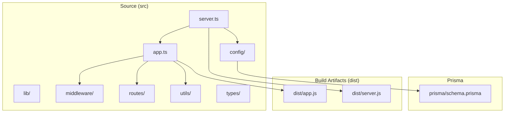

**Diagram sources**
- [app.ts](file://restaurant-backend/src/app.ts#L1-L148)
- [server.ts](file://restaurant-backend/src/server.ts#L1-L33)
- [database.ts](file://restaurant-backend/src/config/database.ts#L1-L66)
- [schema.prisma](file://restaurant-backend/prisma/schema.prisma#L1-L384)

**Section sources**
- [app.ts](file://restaurant-backend/src/app.ts#L1-L148)
- [server.ts](file://restaurant-backend/src/server.ts#L1-L33)
- [tsconfig.json](file://restaurant-backend/tsconfig.json#L1-L52)

## Core Components
- Application bootstrap and server lifecycle: Initializes Express app, loads environment, connects to the database, and starts listening on the configured port.
- Middleware pipeline: Security headers, CORS, rate limiting, JSON parsing, tenant identification, structured logging, and centralized error handling.
- Route registration: Platform-wide and tenant-scoped routes mounted under standardized prefixes.
- Database abstraction: Prisma client with environment-aware logging and optional acceleration extension.
- Utilities and libraries: Logging, audit logging, email delivery, PDF generation, and SMS utilities.
- Type safety: Strongly typed request/response shapes and environment variables.

**Section sources**
- [server.ts](file://restaurant-backend/src/server.ts#L1-L33)
- [app.ts](file://restaurant-backend/src/app.ts#L1-L148)
- [database.ts](file://restaurant-backend/src/config/database.ts#L1-L66)
- [logger.ts](file://restaurant-backend/src/utils/logger.ts#L1-L56)
- [email.ts](file://restaurant-backend/src/lib/email.ts#L1-L227)
- [pdf.ts](file://restaurant-backend/src/lib/pdf.ts#L1-L259)
- [env.d.ts](file://restaurant-backend/src/types/env.d.ts#L1-L32)
- [api.ts](file://restaurant-backend/src/types/api.ts#L1-L114)

## Architecture Overview
The backend follows a layered architecture:
- Entry point initializes the server and database.
- Express app composes middleware and mounts routes.
- Routes delegate to domain handlers that interact with Prisma.
- Libraries encapsulate cross-cutting concerns (email, PDF, payments).
- Utilities provide logging and audit capabilities.

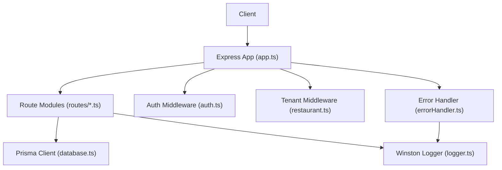

**Diagram sources**
- [app.ts](file://restaurant-backend/src/app.ts#L1-L148)
- [auth.ts](file://restaurant-backend/src/middleware/auth.ts#L1-L137)
- [restaurant.ts](file://restaurant-backend/src/middleware/restaurant.ts#L1-L246)
- [errorHandler.ts](file://restaurant-backend/src/middleware/errorHandler.ts#L1-L82)
- [database.ts](file://restaurant-backend/src/config/database.ts#L1-L66)
- [logger.ts](file://restaurant-backend/src/utils/logger.ts#L1-L56)

## Detailed Component Analysis

### Server Initialization Sequence
The server starts by loading environment variables, connecting to the database, and then starting the HTTP listener. Graceful shutdown signals are handled to ensure clean exit.

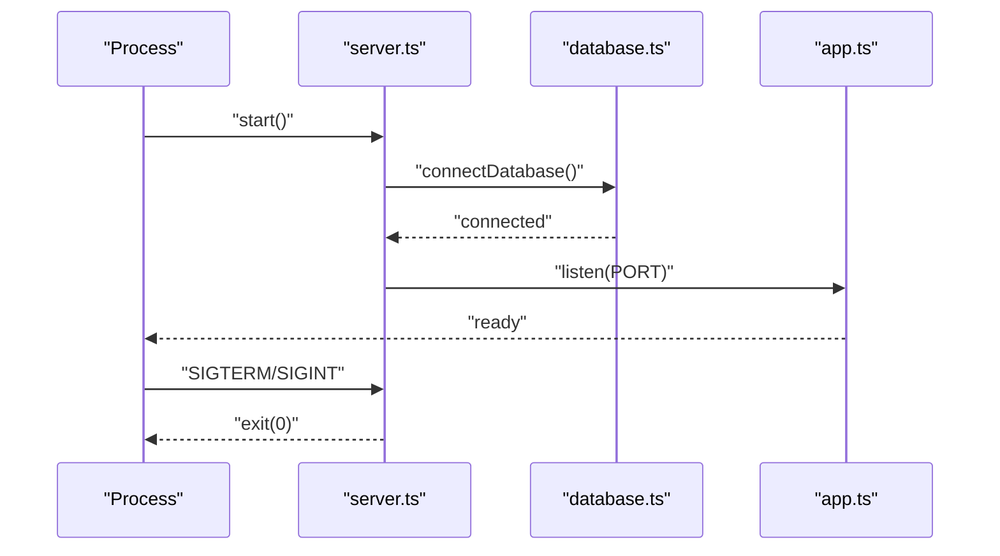

**Diagram sources**
- [server.ts](file://restaurant-backend/src/server.ts#L1-L33)
- [database.ts](file://restaurant-backend/src/config/database.ts#L44-L52)
- [app.ts](file://restaurant-backend/src/app.ts#L26-L28)

**Section sources**
- [server.ts](file://restaurant-backend/src/server.ts#L1-L33)
- [database.ts](file://restaurant-backend/src/config/database.ts#L1-L66)

### Middleware Pipeline Setup
The Express app configures security, CORS, rate limiting, JSON parsing, tenant detection, logging, health checks, static assets, and error handling.

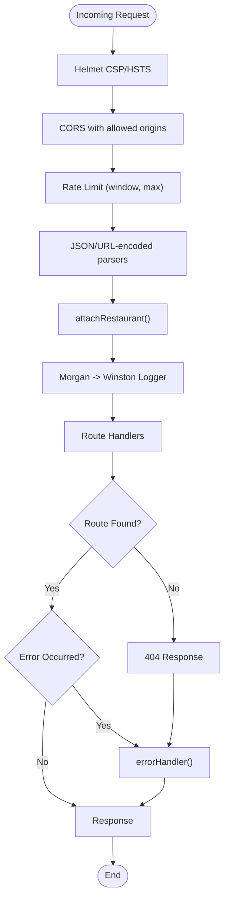

**Diagram sources**
- [app.ts](file://restaurant-backend/src/app.ts#L37-L90)
- [restaurant.ts](file://restaurant-backend/src/middleware/restaurant.ts#L76-L200)
- [errorHandler.ts](file://restaurant-backend/src/middleware/errorHandler.ts#L22-L76)
- [logger.ts](file://restaurant-backend/src/utils/logger.ts#L1-L56)

**Section sources**
- [app.ts](file://restaurant-backend/src/app.ts#L1-L148)
- [restaurant.ts](file://restaurant-backend/src/middleware/restaurant.ts#L1-L246)
- [errorHandler.ts](file://restaurant-backend/src/middleware/errorHandler.ts#L1-L82)
- [logger.ts](file://restaurant-backend/src/utils/logger.ts#L1-L56)

### Route Registration Mechanism
Routes are grouped under platform-wide and tenant-scoped prefixes. A tenant router aggregates routes and attaches the tenant context middleware.

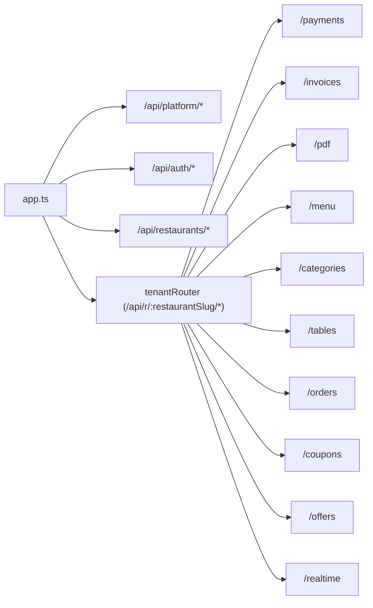

**Diagram sources**
- [app.ts](file://restaurant-backend/src/app.ts#L107-L135)

**Section sources**
- [app.ts](file://restaurant-backend/src/app.ts#L107-L135)

### Modular Architecture
- routes: Feature-specific route groups (auth, restaurants, orders, payments, pdf, etc.).
- middleware: Cross-cutting concerns (auth, error handling, tenant context).
- utils: Logging, audit logging, real-time helpers.
- lib: Domain utilities (email, PDF generation, SMS, Razorpay integration).
- config: Database client creation and connection management.
- types: Shared TypeScript interfaces and environment typings.

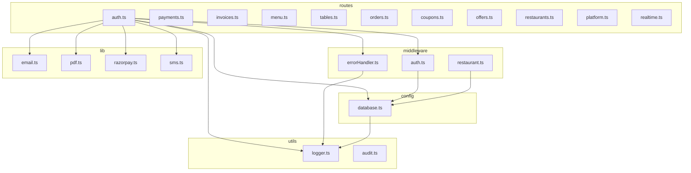

**Diagram sources**
- [auth.ts (route)](file://restaurant-backend/src/routes/auth.ts#L1-L390)
- [auth.ts](file://restaurant-backend/src/middleware/auth.ts#L1-L137)
- [errorHandler.ts](file://restaurant-backend/src/middleware/errorHandler.ts#L1-L82)
- [restaurant.ts](file://restaurant-backend/src/middleware/restaurant.ts#L1-L246)
- [logger.ts](file://restaurant-backend/src/utils/logger.ts#L1-L56)
- [audit.ts](file://restaurant-backend/src/utils/audit.ts#L1-L17)
- [email.ts](file://restaurant-backend/src/lib/email.ts#L1-L227)
- [pdf.ts](file://restaurant-backend/src/lib/pdf.ts#L1-L259)
- [database.ts](file://restaurant-backend/src/config/database.ts#L1-L66)

**Section sources**
- [auth.ts (route)](file://restaurant-backend/src/routes/auth.ts#L1-L390)
- [auth.ts](file://restaurant-backend/src/middleware/auth.ts#L1-L137)
- [errorHandler.ts](file://restaurant-backend/src/middleware/errorHandler.ts#L1-L82)
- [restaurant.ts](file://restaurant-backend/src/middleware/restaurant.ts#L1-L246)
- [logger.ts](file://restaurant-backend/src/utils/logger.ts#L1-L56)
- [audit.ts](file://restaurant-backend/src/utils/audit.ts#L1-L17)
- [email.ts](file://restaurant-backend/src/lib/email.ts#L1-L227)
- [pdf.ts](file://restaurant-backend/src/lib/pdf.ts#L1-L259)
- [database.ts](file://restaurant-backend/src/config/database.ts#L1-L66)

### Database Configuration with Prisma ORM
- Schema defines models for Users, Restaurants, Orders, Payments, Invoices, and more.
- Client is created with environment-aware logging; supports Prisma Accelerate via an extension when enabled.
- Global singleton pattern ensures a single client instance per environment.
- Connection/disconnection helpers and graceful shutdown integration.

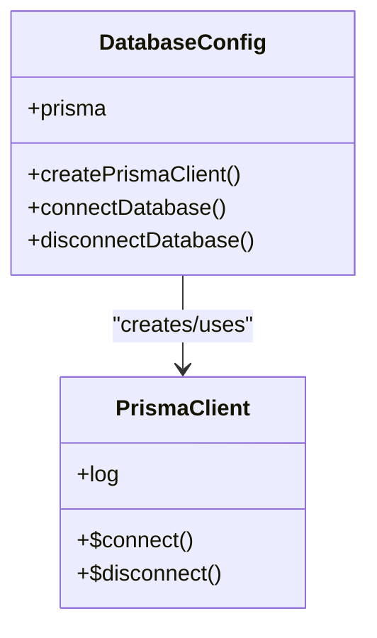

**Diagram sources**
- [database.ts](file://restaurant-backend/src/config/database.ts#L1-L66)
- [schema.prisma](file://restaurant-backend/prisma/schema.prisma#L1-L384)

**Section sources**
- [database.ts](file://restaurant-backend/src/config/database.ts#L1-L66)
- [schema.prisma](file://restaurant-backend/prisma/schema.prisma#L1-L384)

### Environment Variable System and Configuration Loading
- Environment variables are loaded at startup and validated in development/production contexts.
- Strong typing for environment variables via a global declaration.
- Render deployment configuration sets production defaults and environment variables.

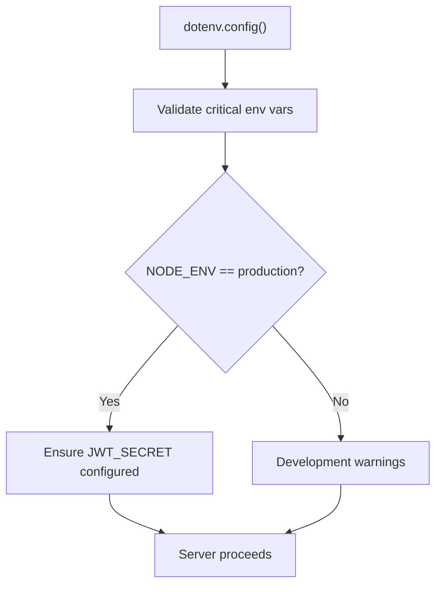

**Diagram sources**
- [app.ts](file://restaurant-backend/src/app.ts#L26-L32)
- [env.d.ts](file://restaurant-backend/src/types/env.d.ts#L1-L32)
- [render.yaml](file://restaurant-backend/render.yaml#L1-L13)

**Section sources**
- [app.ts](file://restaurant-backend/src/app.ts#L26-L32)
- [env.d.ts](file://restaurant-backend/src/types/env.d.ts#L1-L32)
- [render.yaml](file://restaurant-backend/render.yaml#L1-L13)

### Build Process and TypeScript Compilation
- Scripts orchestrate Prisma generation, TypeScript compilation, alias resolution, and post-build copy of public assets.
- tsconfig enables strict mode, path aliases, declaration files, source maps, and ES target.
- Production builds emit declarations and source maps for diagnostics.

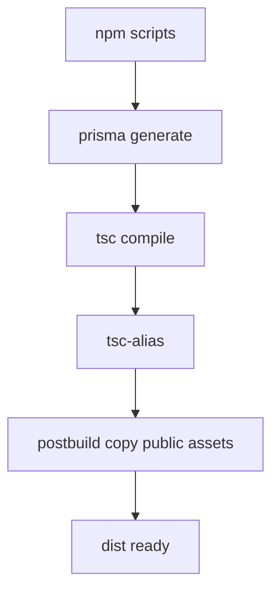

**Diagram sources**
- [package.json](file://restaurant-backend/package.json#L6-L16)
- [tsconfig.json](file://restaurant-backend/tsconfig.json#L1-L52)

**Section sources**
- [package.json](file://restaurant-backend/package.json#L6-L16)
- [tsconfig.json](file://restaurant-backend/tsconfig.json#L1-L52)

### Deployment-Ready Setup
- Render configuration defines a web service with Node environment, build/start commands, and environment variables including JWT_SECRET.
- Health check endpoint is exposed for monitoring.
- Static asset serving for invoices.

**Section sources**
- [render.yaml](file://restaurant-backend/render.yaml#L1-L13)
- [app.ts](file://restaurant-backend/src/app.ts#L92-L105)
- [app.ts](file://restaurant-backend/src/app.ts#L135-L135)

### Error Handling Architecture
- Centralized error handler normalizes responses, logs context, and adapts messages by environment.
- Async wrapper ensures uncaught exceptions in async route handlers are forwarded to the error handler.
- Specific error types are mapped (validation, auth, Prisma).

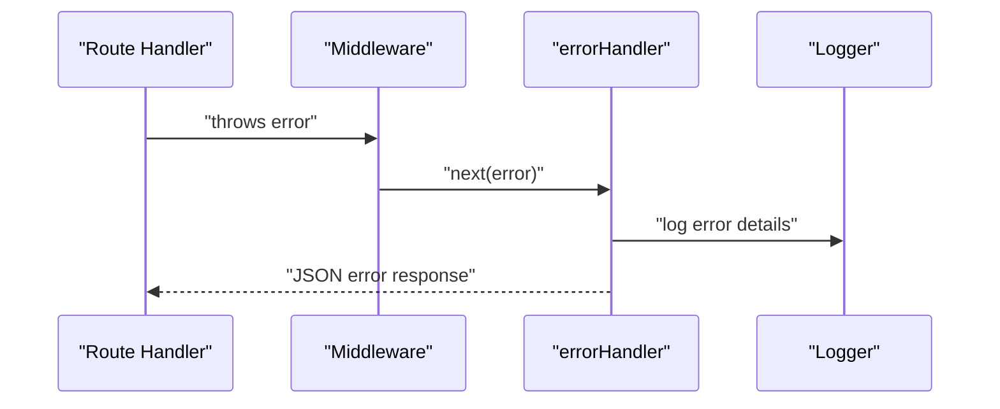

**Diagram sources**
- [errorHandler.ts](file://restaurant-backend/src/middleware/errorHandler.ts#L22-L76)
- [logger.ts](file://restaurant-backend/src/utils/logger.ts#L1-L56)

**Section sources**
- [errorHandler.ts](file://restaurant-backend/src/middleware/errorHandler.ts#L1-L82)
- [logger.ts](file://restaurant-backend/src/utils/logger.ts#L1-L56)

### Logging System Integration
- Winston is configured with console transport and optional file transports for server environments.
- Logs include timestamps, levels, messages, and stacks.
- Used across the app for structured logging and error capture.

**Section sources**
- [logger.ts](file://restaurant-backend/src/utils/logger.ts#L1-L56)
- [app.ts](file://restaurant-backend/src/app.ts#L84-L90)

### Authentication and Authorization
- Token extraction from headers/body/query with robust fallbacks.
- JWT verification with environment validation and user lookup.
- Role-based authorization and optional authentication helpers.
- Tenant-aware roles enforced via restaurant membership checks.

**Section sources**
- [auth.ts](file://restaurant-backend/src/middleware/auth.ts#L1-L137)
- [restaurant.ts](file://restaurant-backend/src/middleware/restaurant.ts#L202-L246)

### Audit Logging
- Safe audit log creation that tolerates missing tables during early migration stages.

**Section sources**
- [audit.ts](file://restaurant-backend/src/utils/audit.ts#L1-L17)

### Email and PDF Utilities
- Email transport configured via SMTP environment variables; invoice templates and PDF attachments supported.
- PDF generation tailored for receipt width and height; storage and cleanup utilities included.

**Section sources**
- [email.ts](file://restaurant-backend/src/lib/email.ts#L1-L227)
- [pdf.ts](file://restaurant-backend/src/lib/pdf.ts#L1-L259)

## Dependency Analysis
The backend relies on Express, Prisma, and a set of middleware and libraries for security, validation, logging, and integrations.

```mermaid
graph TB
Express["express"]
Prisma["@prisma/client"]
Helmet["helmet"]
Cors["cors"]
RateLimit["express-rate-limit"]
Morgan["morgan"]
Winston["winston"]
Zod["zod"]
Bcrypt["bcryptjs"]
JWT["jsonwebtoken"]
Nodemailer["nodemailer"]
PDFKit["pdfkit"]
Twilio["twilio"]
Razorpay["razorpay"]
App["app.ts"] --> Express
App --> Helmet
App --> Cors
App --> RateLimit
App --> Morgan
App --> Winston
Routes["routes/*"] --> Zod
Routes --> Bcrypt
Routes --> JWT
Routes --> Prisma
LibEmail["lib/email.ts"] --> Nodemailer
LibPDF["lib/pdf.ts"] --> PDFKit
LibSMS["lib/sms.ts"] --> Twilio
LibPay["lib/razorpay.ts"] --> Razorpay
ConfigDB["config/database.ts"] --> Prisma
UtilsAudit["utils/audit.ts"] --> Prisma
```

**Diagram sources**
- [package.json](file://restaurant-backend/package.json#L18-L44)
- [app.ts](file://restaurant-backend/src/app.ts#L1-L148)
- [auth.ts (route)](file://restaurant-backend/src/routes/auth.ts#L1-L390)
- [email.ts](file://restaurant-backend/src/lib/email.ts#L1-L227)
- [pdf.ts](file://restaurant-backend/src/lib/pdf.ts#L1-L259)
- [database.ts](file://restaurant-backend/src/config/database.ts#L1-L66)
- [audit.ts](file://restaurant-backend/src/utils/audit.ts#L1-L17)

**Section sources**
- [package.json](file://restaurant-backend/package.json#L18-L44)

## Performance Considerations
- Use Prisma Accelerate when appropriate to reduce latency for read-heavy workloads.
- Keep rate limits tuned for expected traffic patterns.
- Prefer selective field queries and pagination to minimize payload sizes.
- Enable production logging levels to reduce overhead while retaining observability.
- Use static file serving for invoices and cacheable assets.

## Troubleshooting Guide
- Database connectivity failures: Verify DATABASE_URL/DIRECT_DATABASE_URL and Prisma client initialization logs.
- JWT configuration errors: Ensure JWT_SECRET is set and not using default placeholder values in production.
- CORS issues: Confirm allowed origins and credentials configuration.
- 404 endpoints: Review route registration and tenant context middleware behavior.
- Email/PDF failures: Check SMTP configuration and file system permissions for invoice storage.

**Section sources**
- [database.ts](file://restaurant-backend/src/config/database.ts#L44-L62)
- [app.ts](file://restaurant-backend/src/app.ts#L28-L32)
- [app.ts](file://restaurant-backend/src/app.ts#L42-L65)
- [errorHandler.ts](file://restaurant-backend/src/middleware/errorHandler.ts#L22-L76)
- [email.ts](file://restaurant-backend/src/lib/email.ts#L31-L61)
- [pdf.ts](file://restaurant-backend/src/lib/pdf.ts#L191-L224)

## Conclusion
The backend is a well-structured, modular Express application with strong TypeScript typing, robust middleware pipeline, and pragmatic database and utility integrations. It emphasizes security, observability, and operational readiness, with clear separation of concerns across routes, middleware, utilities, and libraries. The Prisma ORM provides a scalable foundation for data access, while the build and deployment configuration supports reliable production deployments.

## Appendices

### Environment Variables Reference
- NODE_ENV: development | production | test
- PORT: server port
- FRONTEND_URL: allowed origin for CORS
- DATABASE_URL: primary Prisma connection URL
- DIRECT_DATABASE_URL: direct connection URL
- JWT_SECRET: signing key for tokens
- JWT_EXPIRES_IN: token lifetime
- RAZORPAY_KEY_ID, RAZORPAY_KEY_SECRET: payment provider keys
- SMTP_HOST, SMTP_PORT, SMTP_USER, SMTP_PASS: email transport
- TWILIO_ACCOUNT_SID, TWILIO_AUTH_TOKEN, TWILIO_PHONE_NUMBER: SMS provider
- APP_NAME, APP_URL: branding and URLs
- MAX_FILE_SIZE, UPLOAD_PATH: file upload policy
- RATE_LIMIT_WINDOW_MS, RATE_LIMIT_MAX_REQUESTS: rate limiting
- ENCRYPTION_KEY, API_KEY: security-related keys
- LOG_LEVEL: logging verbosity

**Section sources**
- [env.d.ts](file://restaurant-backend/src/types/env.d.ts#L1-L32)
- [render.yaml](file://restaurant-backend/render.yaml#L7-L12)