# Backend Architecture

<cite>
**Referenced Files in This Document**
- [package.json](file://restaurant-backend/package.json)
- [tsconfig.json](file://restaurant-backend/tsconfig.json)
- [server.ts](file://restaurant-backend/src/server.ts)
- [app.ts](file://restaurant-backend/src/app.ts)
- [database.ts](file://restaurant-backend/src/config/database.ts)
- [errorHandler.ts](file://restaurant-backend/src/middleware/errorHandler.ts)
- [auth.ts](file://restaurant-backend/src/middleware/auth.ts)
- [restaurant.ts](file://restaurant-backend/src/middleware/restaurant.ts)
- [accelerate-cache.ts](file://restaurant-backend/src/utils/accelerate-cache.ts)
- [logger.ts](file://restaurant-backend/src/utils/logger.ts)
- [audit.ts](file://restaurant-backend/src/utils/audit.ts)
- [email.ts](file://restaurant-backend/src/lib/email.ts)
- [pdf.ts](file://restaurant-backend/src/lib/pdf.ts)
- [auth.ts (route)](file://restaurant-backend/src/routes/auth.ts)
- [env.d.ts](file://restaurant-backend/src/types/env.d.ts)
- [api.ts](file://restaurant-backend/src/types/api.ts)
- [schema.prisma](file://restaurant-backend/prisma/schema.prisma)
- [render.yaml](file://restaurant-backend/render.yaml)
</cite>

## Update Summary
**Changes Made**
- Enhanced restaurant context management with improved middleware system
- Added comprehensive role-based access control with restaurant membership validation
- Integrated Prisma Accelerate caching infrastructure with TTL and SWR support
- Improved schema migration handling with fallback mechanisms
- Enhanced middleware composition with restaurant-aware authorization

## Table of Contents
1. [Introduction](#introduction)
2. [Project Structure](#project-structure)
3. [Core Components](#core-components)
4. [Architecture Overview](#architecture-overview)
5. [Detailed Component Analysis](#detailed-component-analysis)
6. [Dependency Analysis](#dependency-analysis)
7. [Performance Considerations](#performance-considerations)
8. [Troubleshooting Guide](#troubleshooting-guide)
9. [Conclusion](#conclusion)
10. [Appendices](#appendices)

## Introduction
This document describes the backend architecture of DeQ-Bite's Express.js API server. It covers the project structure, TypeScript configuration, build process, server initialization, middleware pipeline, route registration, modular architecture, database configuration with Prisma ORM, environment variable system, deployment setup, error handling, and logging integration. The system now features an enhanced middleware system with improved restaurant context management, comprehensive role-based access control, and integrated caching infrastructure for optimal performance.

## Project Structure
The backend is organized into a modular, feature-based layout under the src directory, with dedicated folders for configuration, routes, middleware, utilities, libraries, types, and shared utilities. The build compiles TypeScript into the dist directory, and Prisma manages schema and migrations with integrated caching support.

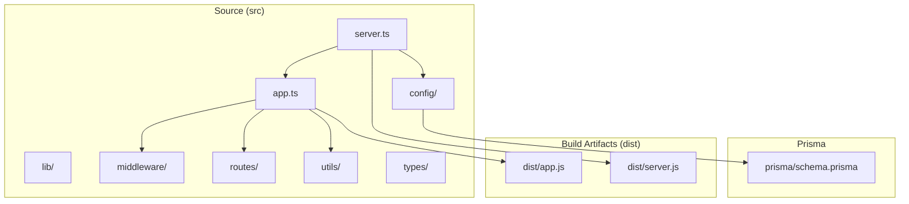
```mermaid
graph TB
subgraph "Source (src)"
CFG["config/"]
LIB["lib/"]
MID["middleware/"]
RT["routes/"]
UTL["utils/"]
TYP["types/"]
APP["app.ts"]
SRV["server.ts"]
end
subgraph "Prisma"
SCHEMA["prisma/schema.prisma"]
end
subgraph "Build Artifacts (dist)"
DIST_APP["dist/app.js"]
DIST_SRV["dist/server.js"]
end
APP --> RT
APP --> MID
APP --> UTL
SRV --> CFG
SRV --> APP
CFG --> SCHEMA
APP --> DIST_APP
SRV --> DIST_SRV
```

**Diagram sources**
- [app.ts:1-148](file://restaurant-backend/src/app.ts#L1-L148)
- [server.ts:1-33](file://restaurant-backend/src/server.ts#L1-L33)
- [database.ts:1-85](file://restaurant-backend/src/config/database.ts#L1-L85)
- [schema.prisma:1-384](file://restaurant-backend/prisma/schema.prisma#L1-L384)

**Section sources**
- [app.ts:1-148](file://restaurant-backend/src/app.ts#L1-L148)
- [server.ts:1-33](file://restaurant-backend/src/server.ts#L1-L33)
- [tsconfig.json:1-52](file://restaurant-backend/tsconfig.json#L1-L52)

## Core Components
- Application bootstrap and server lifecycle: Initializes Express app, loads environment, connects to the database with Prisma Accelerate support, and starts listening on the configured port.
- Enhanced middleware pipeline: Security headers, CORS, rate limiting, JSON parsing, tenant identification, structured logging, centralized error handling, and comprehensive restaurant context management.
- Advanced route registration: Platform-wide and tenant-scoped routes with role-based access control and restaurant membership validation.
- Database abstraction: Prisma client with environment-aware logging, optional Prisma Accelerate extension, and schema migration fallback handling.
- Caching infrastructure: Integrated Prisma Accelerate caching with TTL and SWR (stale-while-revalidate) support for improved performance.
- Utilities and libraries: Logging, audit logging, email delivery, PDF generation, and SMS utilities.
- Type safety: Strongly typed request/response shapes and environment variables.

**Section sources**
- [server.ts:1-33](file://restaurant-backend/src/server.ts#L1-L33)
- [app.ts:1-148](file://restaurant-backend/src/app.ts#L1-L148)
- [database.ts:1-85](file://restaurant-backend/src/config/database.ts#L1-L85)
- [restaurant.ts:1-277](file://restaurant-backend/src/middleware/restaurant.ts#L1-L277)
- [accelerate-cache.ts:1-7](file://restaurant-backend/src/utils/accelerate-cache.ts#L1-L7)
- [logger.ts:1-56](file://restaurant-backend/src/utils/logger.ts#L1-L56)
- [email.ts:1-227](file://restaurant-backend/src/lib/email.ts#L1-L227)
- [pdf.ts:1-259](file://restaurant-backend/src/lib/pdf.ts#L1-L259)
- [env.d.ts:1-32](file://restaurant-backend/src/types/env.d.ts#L1-L32)
- [api.ts:1-114](file://restaurant-backend/src/types/api.ts#L1-L114)

## Architecture Overview
The backend follows a layered architecture with enhanced middleware composition:
- Entry point initializes the server and database with Prisma Accelerate support.
- Express app composes middleware and mounts routes with restaurant context awareness.
- Routes delegate to domain handlers that interact with Prisma using caching strategies.
- Libraries encapsulate cross-cutting concerns (email, PDF, payments).
- Utilities provide logging, audit capabilities, and caching infrastructure.
- Comprehensive role-based access control ensures restaurant membership validation.

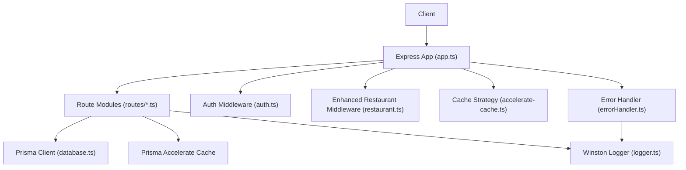
```mermaid
graph TB
Client["Client"]
ExpressApp["Express App (app.ts)"]
DB["Prisma Client (database.ts)"]
Cache["Prisma Accelerate Cache"]
Logger["Winston Logger (logger.ts)"]
ErrorHandler["Error Handler (errorHandler.ts)"]
AuthMW["Auth Middleware (auth.ts)"]
RestMW["Enhanced Restaurant Middleware (restaurant.ts)"]
CacheMW["Cache Strategy (accelerate-cache.ts)"]
Routes["Route Modules (routes/*.ts)"]
Client --> ExpressApp
ExpressApp --> AuthMW
ExpressApp --> RestMW
ExpressApp --> CacheMW
ExpressApp --> Routes
Routes --> DB
Routes --> Cache
Routes --> Logger
ExpressApp --> ErrorHandler
ErrorHandler --> Logger
```

**Diagram sources**
- [app.ts:1-148](file://restaurant-backend/src/app.ts#L1-L148)
- [auth.ts:1-137](file://restaurant-backend/src/middleware/auth.ts#L1-L137)
- [restaurant.ts:1-277](file://restaurant-backend/src/middleware/restaurant.ts#L1-L277)
- [accelerate-cache.ts:1-7](file://restaurant-backend/src/utils/accelerate-cache.ts#L1-L7)
- [errorHandler.ts:1-82](file://restaurant-backend/src/middleware/errorHandler.ts#L1-L82)
- [database.ts:1-85](file://restaurant-backend/src/config/database.ts#L1-L85)
- [logger.ts:1-56](file://restaurant-backend/src/utils/logger.ts#L1-L56)

## Detailed Component Analysis

### Enhanced Server Initialization Sequence
The server starts by loading environment variables, connecting to the database with Prisma Accelerate support, and then starting the HTTP listener. Graceful shutdown signals are handled to ensure clean exit.

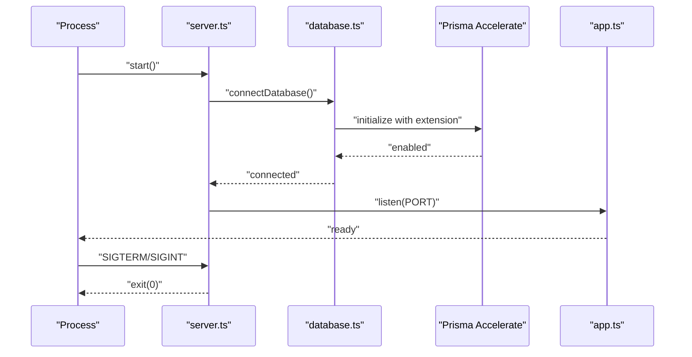
```mermaid
sequenceDiagram
participant Proc as "Process"
participant Server as "server.ts"
participant DB as "database.ts"
participant Cache as "Prisma Accelerate"
participant App as "app.ts"
Proc->>Server : "start()"
Server->>DB : "connectDatabase()"
DB->>Cache : "initialize with extension"
Cache-->>DB : "enabled"
DB-->>Server : "connected"
Server->>App : "listen(PORT)"
App-->>Proc : "ready"
Proc->>Server : "SIGTERM/SIGINT"
Server-->>Proc : "exit(0)"
```

**Diagram sources**
- [server.ts:1-33](file://restaurant-backend/src/server.ts#L1-L33)
- [database.ts:31-43](file://restaurant-backend/src/config/database.ts#L31-L43)
- [app.ts:26-28](file://restaurant-backend/src/app.ts#L26-L28)

**Section sources**
- [server.ts:1-33](file://restaurant-backend/src/server.ts#L1-L33)
- [database.ts:1-85](file://restaurant-backend/src/config/database.ts#L1-L85)

### Enhanced Middleware Pipeline Setup
The Express app configures security, CORS, rate limiting, JSON parsing, tenant detection, logging, health checks, static assets, and error handling with comprehensive restaurant context management.

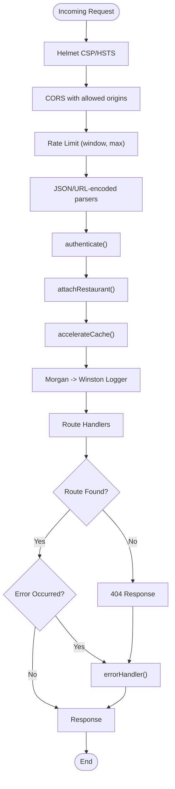
```mermaid
flowchart TD
Start(["Incoming Request"]) --> Helmet["Helmet CSP/HSTS"]
Helmet --> CORS["CORS with allowed origins"]
CORS --> RateLimit["Rate Limit (window, max)"]
RateLimit --> BodyParse["JSON/URL-encoded parsers"]
BodyParse --> Auth["authenticate()"]
Auth --> Restaurant["attachRestaurant()"]
Restaurant --> Cache["accelerateCache()"]
Cache --> Morgan["Morgan -> Winston Logger"]
Morgan --> Routes["Route Handlers"]
Routes --> NotFound{"Route Found?"}
NotFound --> |No| NotF["404 Response"]
NotFound --> |Yes| ErrorCheck{"Error Occurred?"}
ErrorCheck --> |Yes| EH["errorHandler()"]
ErrorCheck --> |No| Resp["Response"]
EH --> Resp
NotF --> EH
Resp --> End(["End"])
```

**Diagram sources**
- [app.ts:37-90](file://restaurant-backend/src/app.ts#L37-L90)
- [auth.ts:7-75](file://restaurant-backend/src/middleware/auth.ts#L7-L75)
- [restaurant.ts:85-211](file://restaurant-backend/src/middleware/restaurant.ts#L85-L211)
- [accelerate-cache.ts:1-7](file://restaurant-backend/src/utils/accelerate-cache.ts#L1-L7)
- [errorHandler.ts:22-76](file://restaurant-backend/src/middleware/errorHandler.ts#L22-L76)
- [logger.ts:1-56](file://restaurant-backend/src/utils/logger.ts#L1-L56)

**Section sources**
- [app.ts:1-148](file://restaurant-backend/src/app.ts#L1-L148)
- [auth.ts:1-137](file://restaurant-backend/src/middleware/auth.ts#L1-L137)
- [restaurant.ts:1-277](file://restaurant-backend/src/middleware/restaurant.ts#L1-L277)
- [accelerate-cache.ts:1-7](file://restaurant-backend/src/utils/accelerate-cache.ts#L1-L7)
- [errorHandler.ts:1-82](file://restaurant-backend/src/middleware/errorHandler.ts#L1-L82)
- [logger.ts:1-56](file://restaurant-backend/src/utils/logger.ts#L1-L56)

### Enhanced Route Registration Mechanism
Routes are grouped under platform-wide and tenant-scoped prefixes with comprehensive role-based access control and restaurant membership validation.

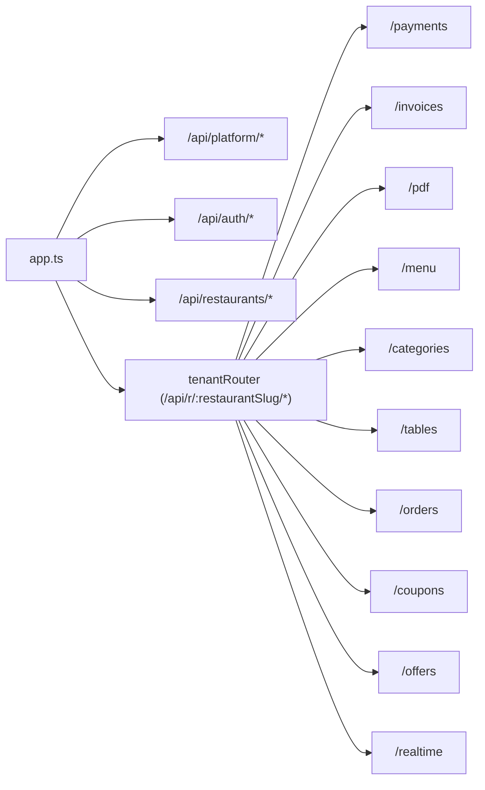
```mermaid
graph LR
Root["app.ts"]
Platform["/api/platform/*"]
Auth["/api/auth/*"]
Restaurants["/api/restaurants/*"]
TenantRouter["tenantRouter (/api/r/:restaurantSlug/*)"]
Payments["/payments"]
Invoices["/invoices"]
Pdf["/pdf"]
Menu["/menu"]
Categories["/categories"]
Tables["/tables"]
Orders["/orders"]
Coupons["/coupons"]
Offers["/offers"]
Realtime["/realtime"]
Root --> Platform
Root --> Auth
Root --> Restaurants
Root --> TenantRouter
TenantRouter --> Payments
TenantRouter --> Invoices
TenantRouter --> Pdf
TenantRouter --> Menu
TenantRouter --> Categories
TenantRouter --> Tables
TenantRouter --> Orders
TenantRouter --> Coupons
TenantRouter --> Offers
TenantRouter --> Realtime
```

**Diagram sources**
- [app.ts:107-135](file://restaurant-backend/src/app.ts#L107-L135)

**Section sources**
- [app.ts:107-135](file://restaurant-backend/src/app.ts#L107-L135)

### Enhanced Modular Architecture
- routes: Feature-specific route groups (auth, restaurants, orders, payments, pdf, etc.) with role-based access control.
- middleware: Cross-cutting concerns (auth, error handling, enhanced restaurant context, caching strategies).
- utils: Logging, audit logging, real-time helpers, and caching infrastructure.
- lib: Domain utilities (email, PDF generation, SMS, Razorpay integration).
- config: Database client creation with Prisma Accelerate support and connection management.
- types: Shared TypeScript interfaces and environment typings.

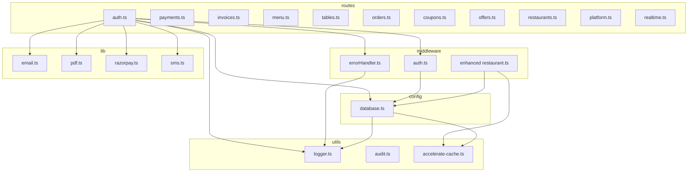
```mermaid
graph TB
subgraph "routes"
RAuth["auth.ts"]
RPayments["payments.ts"]
RInvoices["invoices.ts"]
RMenu["menu.ts"]
RTables["tables.ts"]
ROrders["orders.ts"]
RCoupons["coupons.ts"]
ROffers["offers.ts"]
RRestaurants["restaurants.ts"]
RPlatform["platform.ts"]
RRealtime["realtime.ts"]
end
subgraph "middleware"
MAuth["auth.ts"]
MEH["errorHandler.ts"]
MR["enhanced restaurant.ts"]
end
subgraph "utils"
ULogger["logger.ts"]
UAudit["audit.ts"]
UAccel["accelerate-cache.ts"]
end
subgraph "lib"
LEmail["email.ts"]
LPDF["pdf.ts"]
LRZP["razorpay.ts"]
LSMS["sms.ts"]
end
subgraph "config"
CDB["database.ts"]
end
RAuth --> MAuth
RAuth --> MEH
RAuth --> CDB
RAuth --> ULogger
RAuth --> LEmail
RAuth --> LPDF
RAuth --> LRZP
RAuth --> LSMS
MAuth --> CDB
MR --> CDB
MR --> UAccel
MEH --> ULogger
CDB --> ULogger
CDB --> UAccel
```

**Diagram sources**
- [auth.ts (route):1-390](file://restaurant-backend/src/routes/auth.ts#L1-L390)
- [auth.ts:1-137](file://restaurant-backend/src/middleware/auth.ts#L1-L137)
- [restaurant.ts:1-277](file://restaurant-backend/src/middleware/restaurant.ts#L1-L277)
- [errorHandler.ts:1-82](file://restaurant-backend/src/middleware/errorHandler.ts#L1-L82)
- [accelerate-cache.ts:1-7](file://restaurant-backend/src/utils/accelerate-cache.ts#L1-L7)
- [logger.ts:1-56](file://restaurant-backend/src/utils/logger.ts#L1-L56)
- [audit.ts:1-17](file://restaurant-backend/src/utils/audit.ts#L1-L17)
- [email.ts:1-227](file://restaurant-backend/src/lib/email.ts#L1-L227)
- [pdf.ts:1-259](file://restaurant-backend/src/lib/pdf.ts#L1-L259)
- [database.ts:1-85](file://restaurant-backend/src/config/database.ts#L1-L85)

**Section sources**
- [auth.ts (route):1-390](file://restaurant-backend/src/routes/auth.ts#L1-L390)
- [auth.ts:1-137](file://restaurant-backend/src/middleware/auth.ts#L1-L137)
- [restaurant.ts:1-277](file://restaurant-backend/src/middleware/restaurant.ts#L1-L277)
- [errorHandler.ts:1-82](file://restaurant-backend/src/middleware/errorHandler.ts#L1-L82)
- [accelerate-cache.ts:1-7](file://restaurant-backend/src/utils/accelerate-cache.ts#L1-L7)
- [logger.ts:1-56](file://restaurant-backend/src/utils/logger.ts#L1-L56)
- [audit.ts:1-17](file://restaurant-backend/src/utils/audit.ts#L1-L17)
- [email.ts:1-227](file://restaurant-backend/src/lib/email.ts#L1-L227)
- [pdf.ts:1-259](file://restaurant-backend/src/lib/pdf.ts#L1-L259)
- [database.ts:1-85](file://restaurant-backend/src/config/database.ts#L1-L85)

### Enhanced Database Configuration with Prisma ORM and Caching
- Schema defines models for Users, Restaurants, Orders, Payments, Invoices, and more.
- Client is created with environment-aware logging and optional Prisma Accelerate extension for caching.
- Global singleton pattern ensures a single client instance per environment.
- Connection/disconnection helpers and graceful shutdown integration.
- Schema migration fallback handling for backward compatibility.

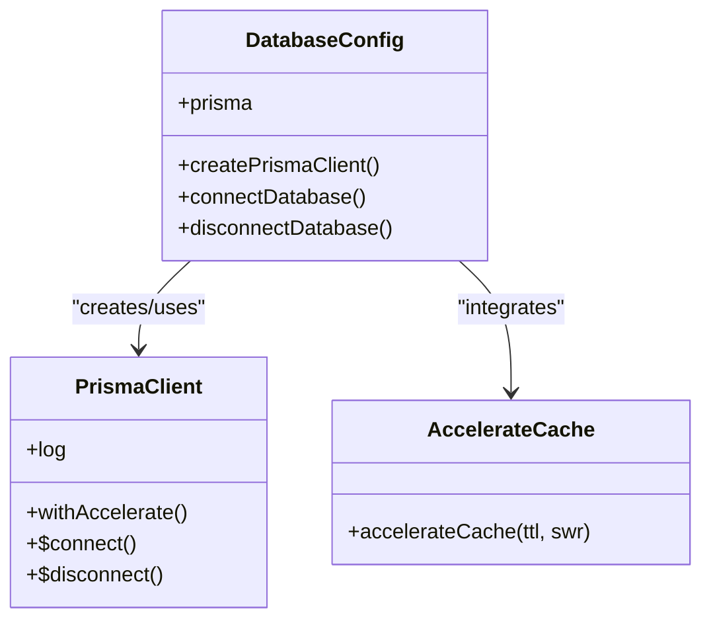
```mermaid
classDiagram
class PrismaClient {
+log
+withAccelerate()
+$connect()
+$disconnect()
}
class DatabaseConfig {
+createPrismaClient()
+connectDatabase()
+disconnectDatabase()
+prisma
}
class AccelerateCache {
+accelerateCache(ttl, swr)
}
DatabaseConfig --> PrismaClient : "creates/uses"
DatabaseConfig --> AccelerateCache : "integrates"
```

**Diagram sources**
- [database.ts:1-85](file://restaurant-backend/src/config/database.ts#L1-L85)
- [accelerate-cache.ts:1-7](file://restaurant-backend/src/utils/accelerate-cache.ts#L1-L7)
- [schema.prisma:1-384](file://restaurant-backend/prisma/schema.prisma#L1-L384)

**Section sources**
- [database.ts:1-85](file://restaurant-backend/src/config/database.ts#L1-L85)
- [accelerate-cache.ts:1-7](file://restaurant-backend/src/utils/accelerate-cache.ts#L1-L7)
- [schema.prisma:1-384](file://restaurant-backend/prisma/schema.prisma#L1-L384)

### Enhanced Environment Variable System and Configuration Loading
- Environment variables are loaded at startup and validated in development/production contexts.
- Strong typing for environment variables via a global declaration.
- Render deployment configuration sets production defaults and environment variables.
- Prisma Accelerate configuration for caching infrastructure.

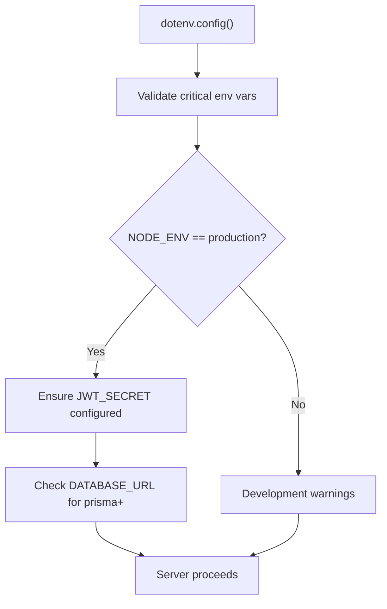
```mermaid
flowchart TD
EnvLoad["dotenv.config()"] --> Validate["Validate critical env vars"]
Validate --> ProdCheck{"NODE_ENV == production?"}
ProdCheck --> |Yes| JWTCheck["Ensure JWT_SECRET configured"]
ProdCheck --> |No| DevWarn["Development warnings"]
JWTCheck --> AccelCheck["Check DATABASE_URL for prisma+"]
AccelCheck --> Ready["Server proceeds"]
DevWarn --> Ready
```

**Diagram sources**
- [app.ts:26-32](file://restaurant-backend/src/app.ts#L26-L32)
- [env.d.ts:1-32](file://restaurant-backend/src/types/env.d.ts#L1-L32)
- [render.yaml:1-13](file://restaurant-backend/render.yaml#L1-L13)
- [database.ts:31-43](file://restaurant-backend/src/config/database.ts#L31-L43)

**Section sources**
- [app.ts:26-32](file://restaurant-backend/src/app.ts#L26-L32)
- [env.d.ts:1-32](file://restaurant-backend/src/types/env.d.ts#L1-L32)
- [render.yaml:1-13](file://restaurant-backend/render.yaml#L1-L13)
- [database.ts:31-43](file://restaurant-backend/src/config/database.ts#L31-L43)

### Enhanced Build Process and TypeScript Compilation
- Scripts orchestrate Prisma generation, TypeScript compilation, alias resolution, and post-build copy of public assets.
- tsconfig enables strict mode, path aliases, declaration files, source maps, and ES target.
- Production builds emit declarations and source maps for diagnostics.
- Prisma Accelerate dependency integration for caching support.

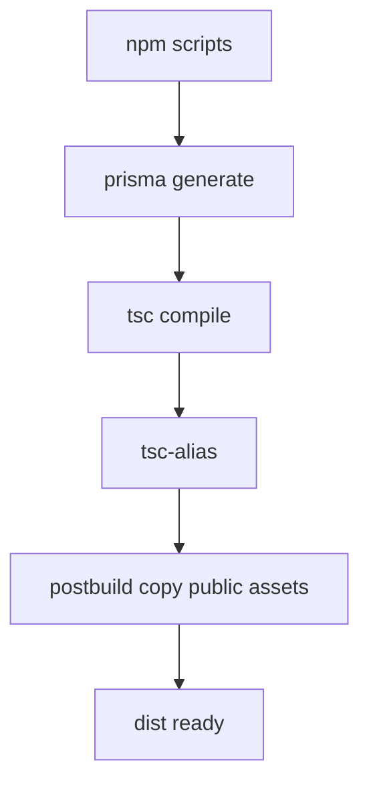
```mermaid
flowchart TD
NPMRun["npm scripts"] --> PrismaGen["prisma generate"]
PrismaGen --> TSC["tsc compile"]
TSC --> Aliases["tsc-alias"]
Aliases --> PostBuild["postbuild copy public assets"]
PostBuild --> Dist["dist ready"]
```

**Diagram sources**
- [package.json:6-16](file://restaurant-backend/package.json#L6-L16)
- [tsconfig.json:1-52](file://restaurant-backend/tsconfig.json#L1-L52)

**Section sources**
- [package.json:6-16](file://restaurant-backend/package.json#L6-L16)
- [tsconfig.json:1-52](file://restaurant-backend/tsconfig.json#L1-L52)

### Enhanced Deployment-Ready Setup
- Render configuration defines a web service with Node environment, build/start commands, and environment variables including JWT_SECRET.
- Health check endpoint is exposed for monitoring.
- Static asset serving for invoices.
- Prisma Accelerate integration for production caching.

**Section sources**
- [render.yaml:1-13](file://restaurant-backend/render.yaml#L1-L13)
- [app.ts:92-105](file://restaurant-backend/src/app.ts#L92-L105)
- [app.ts:135-135](file://restaurant-backend/src/app.ts#L135-L135)

### Enhanced Error Handling Architecture
- Centralized error handler normalizes responses, logs context, and adapts messages by environment.
- Async wrapper ensures uncaught exceptions in async route handlers are forwarded to the error handler.
- Specific error types are mapped (validation, auth, Prisma).
- Restaurant context-aware error responses.

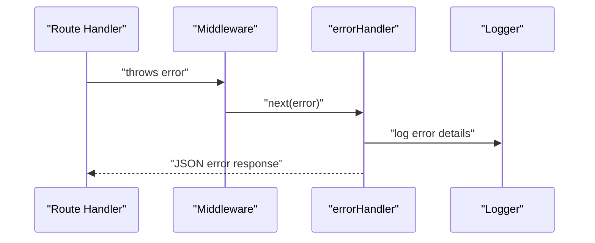
```mermaid
sequenceDiagram
participant Route as "Route Handler"
participant MW as "Middleware"
participant EH as "errorHandler"
participant Log as "Logger"
Route->>MW : "throws error"
MW->>EH : "next(error)"
EH->>Log : "log error details"
EH-->>Route : "JSON error response"
```

**Diagram sources**
- [errorHandler.ts:22-76](file://restaurant-backend/src/middleware/errorHandler.ts#L22-L76)
- [logger.ts:1-56](file://restaurant-backend/src/utils/logger.ts#L1-L56)

**Section sources**
- [errorHandler.ts:1-82](file://restaurant-backend/src/middleware/errorHandler.ts#L1-L82)
- [logger.ts:1-56](file://restaurant-backend/src/utils/logger.ts#L1-L56)

### Enhanced Logging System Integration
- Winston is configured with console transport and optional file transports for server environments.
- Logs include timestamps, levels, messages, and stacks.
- Used across the app for structured logging and error capture.
- Slow query detection and caching strategy logging.

**Section sources**
- [logger.ts:1-56](file://restaurant-backend/src/utils/logger.ts#L1-L56)
- [app.ts:84-90](file://restaurant-backend/src/app.ts#L84-L90)

### Enhanced Authentication and Authorization
- Token extraction from headers/body/query with robust fallbacks.
- JWT verification with environment validation and user lookup.
- Role-based authorization and optional authentication helpers.
- Enhanced tenant-aware roles enforced via restaurant membership checks.
- Comprehensive restaurant membership validation and role enforcement.

**Section sources**
- [auth.ts:1-137](file://restaurant-backend/src/middleware/auth.ts#L1-L137)
- [restaurant.ts:213-277](file://restaurant-backend/src/middleware/restaurant.ts#L213-L277)

### Enhanced Restaurant Context Management
- Advanced restaurant identification from multiple sources (headers, subdomains, slugs, paths).
- Dynamic field selection based on Prisma client schema version.
- Schema migration fallback handling for backward compatibility.
- Restaurant membership validation and role-based access control.
- Caching integration with TTL and SWR support for improved performance.

**Section sources**
- [restaurant.ts:1-277](file://restaurant-backend/src/middleware/restaurant.ts#L1-L277)
- [api.ts:10-18](file://restaurant-backend/src/types/api.ts#L10-L18)

### Enhanced Audit Logging
- Safe audit log creation that tolerates missing tables during early migration stages.
- Restaurant-specific audit logging with membership validation.

**Section sources**
- [audit.ts:1-17](file://restaurant-backend/src/utils/audit.ts#L1-L17)

### Enhanced Email and PDF Utilities
- Email transport configured via SMTP environment variables; invoice templates and PDF attachments supported.
- PDF generation tailored for receipt width and height; storage and cleanup utilities included.

**Section sources**
- [email.ts:1-227](file://restaurant-backend/src/lib/email.ts#L1-L227)
- [pdf.ts:1-259](file://restaurant-backend/src/lib/pdf.ts#L1-L259)

### Enhanced Caching Infrastructure Integration
- Prisma Accelerate extension automatically enabled for prisma+ URLs.
- Configurable cache strategies with TTL and SWR (stale-while-revalidate) support.
- Runtime cache strategy selection based on environment and query patterns.
- Fallback mechanisms for cache extension availability.

**Section sources**
- [database.ts:31-43](file://restaurant-backend/src/config/database.ts#L31-L43)
- [accelerate-cache.ts:1-7](file://restaurant-backend/src/utils/accelerate-cache.ts#L1-L7)

## Dependency Analysis
The backend relies on Express, Prisma, Prisma Accelerate, and a set of middleware and libraries for security, validation, logging, caching, and integrations.

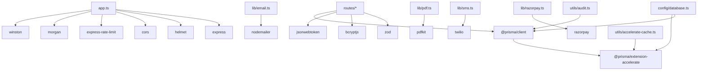
```mermaid
graph TB
Express["express"]
Prisma["@prisma/client"]
Accelerate["@prisma/extension-accelerate"]
Helmet["helmet"]
Cors["cors"]
RateLimit["express-rate-limit"]
Morgan["morgan"]
Winston["winston"]
Zod["zod"]
Bcrypt["bcryptjs"]
JWT["jsonwebtoken"]
Nodemailer["nodemailer"]
PDFKit["pdfkit"]
Twilio["twilio"]
Razorpay["razorpay"]
App["app.ts"] --> Express
App --> Helmet
App --> Cors
App --> RateLimit
App --> Morgan
App --> Winston
Routes["routes/*"] --> Zod
Routes --> Bcrypt
Routes --> JWT
Routes --> Prisma
Prisma --> Accelerate
LibEmail["lib/email.ts"] --> Nodemailer
LibPDF["lib/pdf.ts"] --> PDFKit
LibSMS["lib/sms.ts"] --> Twilio
LibPay["lib/razorpay.ts"] --> Razorpay
ConfigDB["config/database.ts"] --> Prisma
ConfigDB --> Accelerate
UtilsAudit["utils/audit.ts"] --> Prisma
UtilsCache["utils/accelerate-cache.ts"] --> Accelerate
```

**Diagram sources**
- [package.json:18-46](file://restaurant-backend/package.json#L18-L46)
- [app.ts:1-148](file://restaurant-backend/src/app.ts#L1-L148)
- [auth.ts (route):1-390](file://restaurant-backend/src/routes/auth.ts#L1-L390)
- [email.ts:1-227](file://restaurant-backend/src/lib/email.ts#L1-L227)
- [pdf.ts:1-259](file://restaurant-backend/src/lib/pdf.ts#L1-L259)
- [database.ts:1-85](file://restaurant-backend/src/config/database.ts#L1-L85)
- [accelerate-cache.ts:1-7](file://restaurant-backend/src/utils/accelerate-cache.ts#L1-L7)
- [audit.ts:1-17](file://restaurant-backend/src/utils/audit.ts#L1-L17)

**Section sources**
- [package.json:18-46](file://restaurant-backend/package.json#L18-L46)

## Performance Considerations
- Use Prisma Accelerate for read-heavy workloads with configurable TTL and SWR caching.
- Keep rate limits tuned for expected traffic patterns.
- Prefer selective field queries and pagination to minimize payload sizes.
- Enable production logging levels to reduce overhead while retaining observability.
- Use static file serving for invoices and cacheable assets.
- Implement schema migration fallbacks to avoid downtime during deployments.
- Leverage restaurant context caching for improved tenant-specific query performance.

## Troubleshooting Guide
- Database connectivity failures: Verify DATABASE_URL/DIRECT_DATABASE_URL and Prisma client initialization logs.
- JWT configuration errors: Ensure JWT_SECRET is set and not using default placeholder values in production.
- CORS issues: Confirm allowed origins and credentials configuration.
- 404 endpoints: Review route registration and tenant context middleware behavior.
- Email/PDF failures: Check SMTP configuration and file system permissions for invoice storage.
- Cache extension issues: Verify @prisma/extension-accelerate installation for prisma+ URLs.
- Schema migration errors: Check for fallback mechanisms and field compatibility.
- Restaurant context failures: Verify restaurant identification from headers/subdomains/slugs.

**Section sources**
- [database.ts:44-62](file://restaurant-backend/src/config/database.ts#L44-L62)
- [app.ts:28-32](file://restaurant-backend/src/app.ts#L28-L32)
- [app.ts:42-65](file://restaurant-backend/src/app.ts#L42-L65)
- [errorHandler.ts:22-76](file://restaurant-backend/src/middleware/errorHandler.ts#L22-L76)
- [email.ts:31-61](file://restaurant-backend/src/lib/email.ts#L31-L61)
- [pdf.ts:191-224](file://restaurant-backend/src/lib/pdf.ts#L191-L224)
- [database.ts:31-43](file://restaurant-backend/src/config/database.ts#L31-L43)
- [restaurant.ts:151-194](file://restaurant-backend/src/middleware/restaurant.ts#L151-L194)

## Conclusion
The backend is a well-structured, modular Express application with enhanced middleware pipeline featuring comprehensive restaurant context management, robust role-based access control, and integrated caching infrastructure. It emphasizes security, observability, operational readiness, and performance optimization through Prisma Accelerate. The system provides strong TypeScript typing, pragmatic database and utility integrations, and clear separation of concerns across routes, middleware, utilities, and libraries. The enhanced architecture supports scalable tenant-based operations with dynamic schema handling and efficient caching strategies.

## Appendices

### Enhanced Environment Variables Reference
- NODE_ENV: development | production | test
- PORT: server port
- FRONTEND_URL: allowed origin for CORS
- DATABASE_URL: primary Prisma connection URL (supports prisma+ for Accelerate)
- DIRECT_DATABASE_URL: direct connection URL
- JWT_SECRET: signing key for tokens
- JWT_EXPIRES_IN: token lifetime
- RAZORPAY_KEY_ID, RAZORPAY_KEY_SECRET: payment provider keys
- SMTP_HOST, SMTP_PORT, SMTP_USER, SMTP_PASS: email transport
- TWILIO_ACCOUNT_SID, TWILIO_AUTH_TOKEN, TWILIO_PHONE_NUMBER: SMS provider
- APP_NAME, APP_URL: branding and URLs
- MAX_FILE_SIZE, UPLOAD_PATH: file upload policy
- RATE_LIMIT_WINDOW_MS, RATE_LIMIT_MAX_REQUESTS: rate limiting
- LOG_LEVEL: logging verbosity
- LOG_SLOW_QUERIES: enable slow query logging
- SLOW_QUERY_MS: slow query threshold
- LOG_SLOW_QUERY_PARAMS: include query parameters in logs

**Section sources**
- [env.d.ts:1-32](file://restaurant-backend/src/types/env.d.ts#L1-L32)
- [render.yaml:7-12](file://restaurant-backend/render.yaml#L7-L12)
- [database.ts:5-9](file://restaurant-backend/src/config/database.ts#L5-L9)