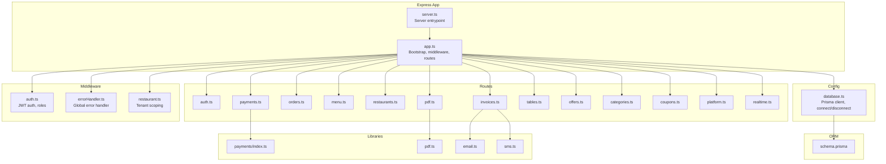
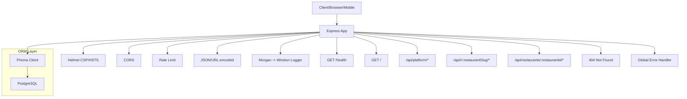
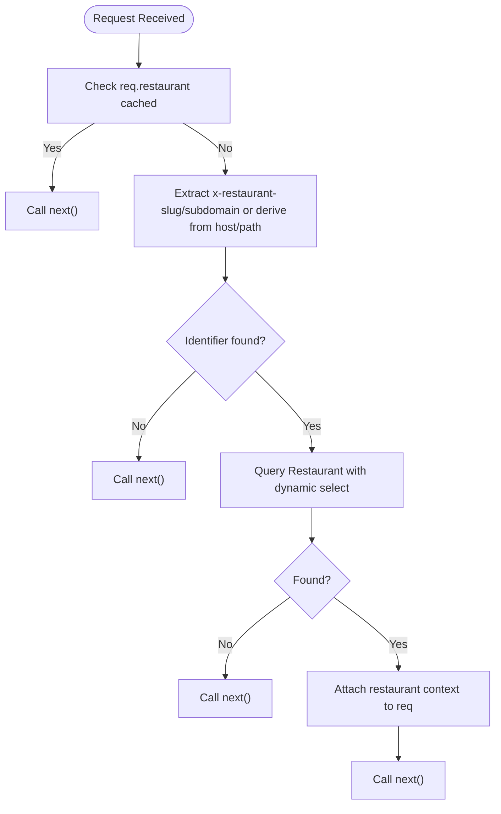
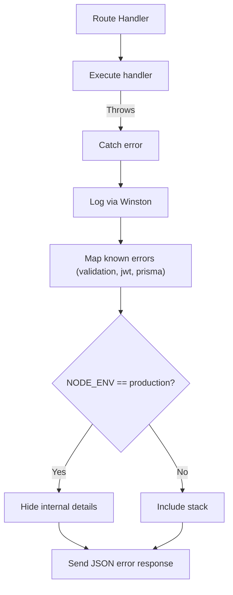
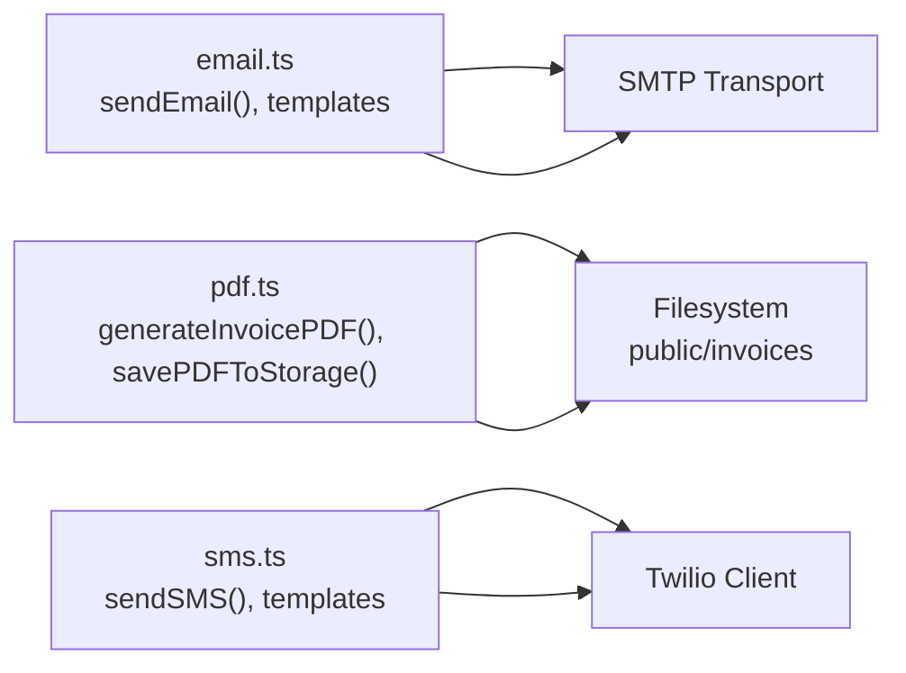
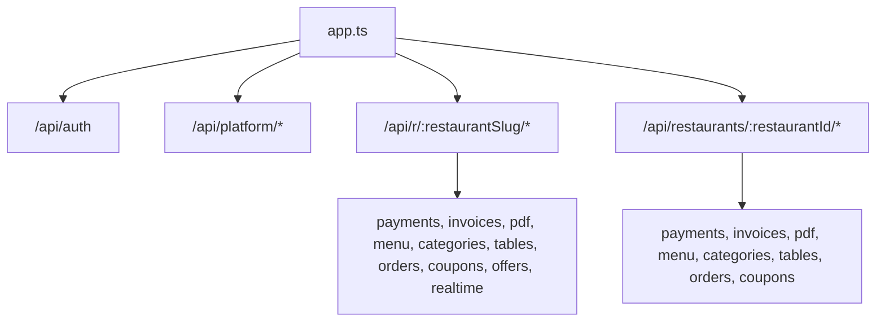
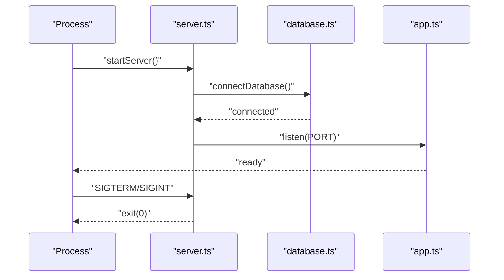
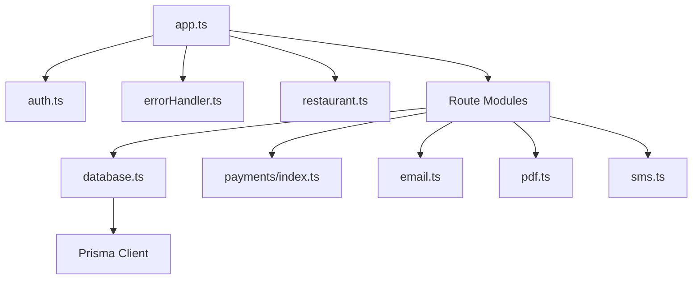
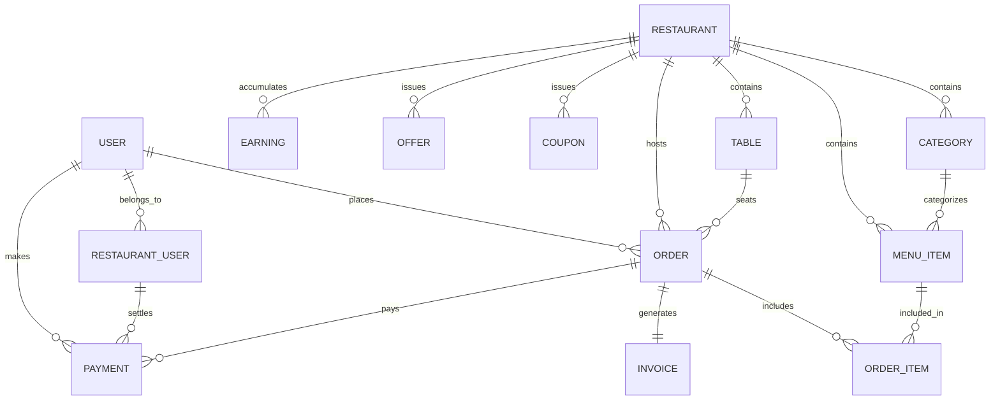

# Backend System

<cite>
**Referenced Files in This Document**
- [package.json](file://restaurant-backend/package.json)
- [tsconfig.json](file://restaurant-backend/tsconfig.json)
- [app.ts](file://restaurant-backend/src/app.ts)
- [server.ts](file://restaurant-backend/src/server.ts)
- [database.ts](file://restaurant-backend/src/config/database.ts)
- [auth.ts](file://restaurant-backend/src/middleware/auth.ts)
- [errorHandler.ts](file://restaurant-backend/src/middleware/errorHandler.ts)
- [restaurant.ts](file://restaurant-backend/src/middleware/restaurant.ts)
- [logger.ts](file://restaurant-backend/src/utils/logger.ts)
- [auth.ts](file://restaurant-backend/src/routes/auth.ts)
- [index.ts](file://restaurant-backend/src/lib/payments/index.ts)
- [email.ts](file://restaurant-backend/src/lib/email.ts)
- [pdf.ts](file://restaurant-backend/src/lib/pdf.ts)
- [sms.ts](file://restaurant-backend/src/lib/sms.ts)
- [schema.prisma](file://restaurant-backend/prisma/schema.prisma)
</cite>

## Table of Contents
1. [Introduction](#introduction)
2. [Project Structure](#project-structure)
3. [Core Components](#core-components)
4. [Architecture Overview](#architecture-overview)
5. [Detailed Component Analysis](#detailed-component-analysis)
6. [Dependency Analysis](#dependency-analysis)
7. [Performance Considerations](#performance-considerations)
8. [Troubleshooting Guide](#troubleshooting-guide)
9. [Conclusion](#conclusion)
10. [Appendices](#appendices)

## Introduction
This document describes the backend system for DeQ-Bite’s restaurant management platform. It covers the Express.js server written in TypeScript, middleware architecture (authentication, error handling, restaurant scoping), route organization, Prisma ORM integration, security measures (JWT, rate limiting, input validation), logging and error handling strategy, and modular business logic libraries for payments, email, PDF generation, and SMS. It also outlines deployment considerations and environment variable requirements.

## Project Structure
The backend is organized around a layered architecture:
- Application bootstrap and middleware registration in the Express app
- Route modules grouped by domain (auth, menu, orders, payments, etc.)
- Middleware for authentication, error handling, and restaurant scoping
- Configuration for database connectivity and Prisma client
- Utility modules for logging and real-time helpers
- Business logic libraries for payments, email, PDF, and SMS
- Prisma schema and migrations



**Diagram sources**
- [app.ts](file://restaurant-backend/src/app.ts#L1-L148)
- [server.ts](file://restaurant-backend/src/server.ts#L1-L33)
- [auth.ts](file://restaurant-backend/src/middleware/auth.ts#L1-L137)
- [errorHandler.ts](file://restaurant-backend/src/middleware/errorHandler.ts#L1-L82)
- [restaurant.ts](file://restaurant-backend/src/middleware/restaurant.ts#L1-L246)
- [database.ts](file://restaurant-backend/src/config/database.ts#L1-L66)
- [index.ts](file://restaurant-backend/src/lib/payments/index.ts#L1-L124)
- [email.ts](file://restaurant-backend/src/lib/email.ts#L1-L227)
- [pdf.ts](file://restaurant-backend/src/lib/pdf.ts#L1-L259)
- [sms.ts](file://restaurant-backend/src/lib/sms.ts#L1-L131)
- [schema.prisma](file://restaurant-backend/prisma/schema.prisma#L1-L384)

**Section sources**
- [package.json](file://restaurant-backend/package.json#L1-L80)
- [tsconfig.json](file://restaurant-backend/tsconfig.json#L1-L52)
- [app.ts](file://restaurant-backend/src/app.ts#L1-L148)
- [server.ts](file://restaurant-backend/src/server.ts#L1-L33)

## Core Components
- Express application bootstrap and middleware pipeline
- Global error handling and async wrapper
- JWT-based authentication and authorization
- Tenant-aware restaurant scoping middleware
- Prisma client configuration with optional acceleration
- Logging via Winston
- Modular business libraries for payments, email, PDF, and SMS

Key implementation references:
- Application setup and middleware chain: [app.ts](file://restaurant-backend/src/app.ts#L1-L148)
- Server startup and graceful shutdown: [server.ts](file://restaurant-backend/src/server.ts#L1-L33)
- Database client and connection lifecycle: [database.ts](file://restaurant-backend/src/config/database.ts#L1-L66)
- JWT auth and authorization helpers: [auth.ts](file://restaurant-backend/src/middleware/auth.ts#L1-L137)
- Global error handling and async wrapper: [errorHandler.ts](file://restaurant-backend/src/middleware/errorHandler.ts#L1-L82)
- Restaurant scoping and role checks: [restaurant.ts](file://restaurant-backend/src/middleware/restaurant.ts#L1-L246)
- Logging configuration: [logger.ts](file://restaurant-backend/src/utils/logger.ts#L1-L56)

**Section sources**
- [app.ts](file://restaurant-backend/src/app.ts#L1-L148)
- [server.ts](file://restaurant-backend/src/server.ts#L1-L33)
- [database.ts](file://restaurant-backend/src/config/database.ts#L1-L66)
- [auth.ts](file://restaurant-backend/src/middleware/auth.ts#L1-L137)
- [errorHandler.ts](file://restaurant-backend/src/middleware/errorHandler.ts#L1-L82)
- [restaurant.ts](file://restaurant-backend/src/middleware/restaurant.ts#L1-L246)
- [logger.ts](file://restaurant-backend/src/utils/logger.ts#L1-L56)

## Architecture Overview
The system initializes the Express app, registers global middleware (security headers, CORS, rate limiting, JSON parsing, Morgan logging), mounts route groups under both platform and tenant contexts, and wires up error handling. Prisma connects to PostgreSQL with optional acceleration. Business logic is encapsulated in dedicated libraries.



**Diagram sources**
- [app.ts](file://restaurant-backend/src/app.ts#L37-L90)
- [app.ts](file://restaurant-backend/src/app.ts#L107-L145)
- [database.ts](file://restaurant-backend/src/config/database.ts#L4-L27)

**Section sources**
- [app.ts](file://restaurant-backend/src/app.ts#L37-L145)
- [database.ts](file://restaurant-backend/src/config/database.ts#L4-L27)

## Detailed Component Analysis

### Authentication Middleware
Implements bearer token extraction, JWT verification, user loading, and role-based authorization. Provides optional authentication for public endpoints.

```mermaid
sequenceDiagram
participant C as "Client"
participant MW as "auth.ts"
participant JWT as "jsonwebtoken"
participant DB as "Prisma User"
participant NEXT as "Route Handler"
C->>MW : "Request with Authorization : Bearer ..."
MW->>JWT : "verify(token, secret)"
JWT-->>MW : "decoded payload"
MW->>DB : "findUnique({ id })"
DB-->>MW : "user record"
MW->>NEXT : "req.user = user; next()"
NEXT-->>C : "Response"
```

**Diagram sources**
- [auth.ts](file://restaurant-backend/src/middleware/auth.ts#L7-L75)

**Section sources**
- [auth.ts](file://restaurant-backend/src/middleware/auth.ts#L1-L137)

### Restaurant Scoping Middleware
Determines the active restaurant from headers, subdomain/host, or path slug. Applies dynamic field selection to avoid schema mismatches and enforces active/optional status filters. Supports role-based authorization against the restaurant membership.



**Diagram sources**
- [restaurant.ts](file://restaurant-backend/src/middleware/restaurant.ts#L76-L200)

**Section sources**
- [restaurant.ts](file://restaurant-backend/src/middleware/restaurant.ts#L1-L246)

### Error Handling Strategy
Centralized error handler with structured logging, environment-aware error messages, and async wrapper to unify error propagation.



**Diagram sources**
- [errorHandler.ts](file://restaurant-backend/src/middleware/errorHandler.ts#L22-L76)

**Section sources**
- [errorHandler.ts](file://restaurant-backend/src/middleware/errorHandler.ts#L1-L82)

### Payments Library
Provides a provider-agnostic abstraction for payment processing, currently integrating Razorpay. Supports order creation, signature verification, and refunds.

```mermaid
classDiagram
class PaymentProvider {
+provider : PaymentProviderType
+isEnabled() bool
+createOrder(input) CreatePaymentResult
+verifyPayment(input) { status }
+refund(paymentId, amountPaise?, reason?) any
}
class RazorpayProvider {
+isEnabled() bool
+createOrder(input) CreatePaymentResult
+verifyPayment(input) { status }
+refund(paymentId, amountPaise?, reason?) any
}
class PaytmProvider {
+isEnabled() bool
+createOrder(...) throws
+verifyPayment(...) throws
+refund(...) throws
}
class PhonePeProvider {
+isEnabled() bool
+createOrder(...) throws
+verifyPayment(...) throws
+refund(...) throws
}
PaymentProvider <|.. RazorpayProvider
PaymentProvider <|.. PaytmProvider
PaymentProvider <|.. PhonePeProvider
```

**Diagram sources**
- [index.ts](file://restaurant-backend/src/lib/payments/index.ts#L32-L124)

**Section sources**
- [index.ts](file://restaurant-backend/src/lib/payments/index.ts#L1-L124)

### Email, PDF, and SMS Libraries
- Email: SMTP transport via Nodemailer with templating and optional PDF attachments.
- PDF: jsPDF-based invoice generation and storage under public/invoices.
- SMS: Twilio integration for invoice and order notifications.



**Diagram sources**
- [email.ts](file://restaurant-backend/src/lib/email.ts#L31-L61)
- [pdf.ts](file://restaurant-backend/src/lib/pdf.ts#L37-L187)
- [pdf.ts](file://restaurant-backend/src/lib/pdf.ts#L191-L224)
- [sms.ts](file://restaurant-backend/src/lib/sms.ts#L31-L66)

**Section sources**
- [email.ts](file://restaurant-backend/src/lib/email.ts#L1-L227)
- [pdf.ts](file://restaurant-backend/src/lib/pdf.ts#L1-L259)
- [sms.ts](file://restaurant-backend/src/lib/sms.ts#L1-L131)

### Route Organization and API Endpoints
The app mounts routes under two contexts:
- Platform routes: /api/platform/*
- Tenant routes: /api/r/:restaurantSlug/* and /api/restaurants/:restaurantId/*

Examples of mounted route groups include auth, payments, invoices, pdf, menu, categories, tables, orders, coupons, restaurants, offers, and realtime.



**Diagram sources**
- [app.ts](file://restaurant-backend/src/app.ts#L107-L135)

**Section sources**
- [app.ts](file://restaurant-backend/src/app.ts#L107-L135)

### Server Initialization and Control Flow
- Server listens on configured port
- Connects to database before starting
- Registers signal handlers for graceful shutdown
- Logs health endpoint availability



**Diagram sources**
- [server.ts](file://restaurant-backend/src/server.ts#L17-L30)
- [database.ts](file://restaurant-backend/src/config/database.ts#L44-L52)
- [app.ts](file://restaurant-backend/src/app.ts#L21-L25)

**Section sources**
- [server.ts](file://restaurant-backend/src/server.ts#L1-L33)
- [database.ts](file://restaurant-backend/src/config/database.ts#L1-L66)
- [app.ts](file://restaurant-backend/src/app.ts#L1-L148)

## Dependency Analysis
- Express app depends on middleware, routes, and configuration modules
- Routes depend on Prisma client for data access
- Business libraries depend on external SDKs (Razorpay, Twilio, Nodemailer)
- Prisma client depends on environment variables for database URLs and optional acceleration extension



**Diagram sources**
- [app.ts](file://restaurant-backend/src/app.ts#L1-L25)
- [auth.ts](file://restaurant-backend/src/middleware/auth.ts#L1-L10)
- [errorHandler.ts](file://restaurant-backend/src/middleware/errorHandler.ts#L1-L7)
- [restaurant.ts](file://restaurant-backend/src/middleware/restaurant.ts#L1-L5)
- [database.ts](file://restaurant-backend/src/config/database.ts#L1-L2)
- [index.ts](file://restaurant-backend/src/lib/payments/index.ts#L1-L7)
- [email.ts](file://restaurant-backend/src/lib/email.ts#L1-L2)
- [pdf.ts](file://restaurant-backend/src/lib/pdf.ts#L1-L4)
- [sms.ts](file://restaurant-backend/src/lib/sms.ts#L1-L2)

**Section sources**
- [package.json](file://restaurant-backend/package.json#L18-L44)
- [tsconfig.json](file://restaurant-backend/tsconfig.json#L30-L38)

## Performance Considerations
- Rate limiting reduces abuse and protects downstream services
- Dynamic Prisma select minimizes payload size and avoids stale schema errors
- Winston file transport rotation prevents unbounded log growth
- Environment-aware Prisma logging levels reduce overhead in production
- Static serving of invoices reduces compute load

Recommendations:
- Monitor Prisma query performance and enable slow query logging in development
- Consider connection pooling and Prisma Accelerate for production scaling
- Use CDN for static assets and invoice downloads
- Implement circuit breakers for external providers (Twilio, SMTP)

**Section sources**
- [app.ts](file://restaurant-backend/src/app.ts#L67-L77)
- [restaurant.ts](file://restaurant-backend/src/middleware/restaurant.ts#L13-L38)
- [logger.ts](file://restaurant-backend/src/utils/logger.ts#L17-L48)
- [database.ts](file://restaurant-backend/src/config/database.ts#L5-L9)

## Troubleshooting Guide
Common issues and remedies:
- JWT_SECRET misconfiguration in production leads to authentication failures; the app logs warnings during bootstrap
- CORS blocked origins indicate frontend URL mismatch; verify allowed origins and credentials
- 404 endpoints suggest missing route mounting or incorrect base paths
- Database connection failures require checking DATABASE_URL/DIRECT_DATABASE_URL and network access
- Prisma schema mismatch errors can be handled by dynamic field selection and fallback queries
- Email/SMS failures often stem from missing credentials; verify SMTP/Twilio environment variables

Operational checks:
- Use /health endpoint to confirm server readiness
- Review Winston logs in console and rotated files
- Validate environment variables via scripts and CI

**Section sources**
- [app.ts](file://restaurant-backend/src/app.ts#L28-L32)
- [app.ts](file://restaurant-backend/src/app.ts#L42-L65)
- [app.ts](file://restaurant-backend/src/app.ts#L137-L143)
- [database.ts](file://restaurant-backend/src/config/database.ts#L44-L52)
- [restaurant.ts](file://restaurant-backend/src/middleware/restaurant.ts#L141-L183)
- [logger.ts](file://restaurant-backend/src/utils/logger.ts#L14-L48)

## Conclusion
The backend employs a clean, modular architecture with strong separation of concerns. Security is enforced via helmet, CORS, rate limiting, JWT, and tenant scoping. Prisma provides robust data access with schema resilience. Business logic is encapsulated in dedicated libraries for payments, email, PDF, and SMS. The system is designed for scalability and maintainability with clear logging, error handling, and environment-driven configuration.

## Appendices

### Database Schema Overview
Core entities include Users, Restaurants, RestaurantUsers, Categories, MenuItems, Tables, Orders, OrderItems, Invoices, Coupons, Offers, Payments, Earnings, and AuditLogs. Enums define roles, statuses, and types.



**Diagram sources**
- [schema.prisma](file://restaurant-backend/prisma/schema.prisma#L11-L306)

**Section sources**
- [schema.prisma](file://restaurant-backend/prisma/schema.prisma#L1-L384)

### Environment Variables
Critical variables include:
- Database: DATABASE_URL, DIRECT_DATABASE_URL
- JWT: JWT_SECRET, JWT_EXPIRES_IN
- SMTP: SMTP_HOST, SMTP_PORT, SMTP_USER, SMTP_PASS, APP_NAME
- Twilio: TWILIO_ACCOUNT_SID, TWILIO_AUTH_TOKEN, TWILIO_PHONE_NUMBER
- Razorpay: RAZORPAY_KEY_ID, RAZORPAY_KEY_SECRET
- Server: PORT, NODE_ENV, FRONTEND_URL, BASE_DOMAIN, LOG_LEVEL

Ensure production includes secure secrets and appropriate CORS origins.

**Section sources**
- [app.ts](file://restaurant-backend/src/app.ts#L28-L32)
- [email.ts](file://restaurant-backend/src/lib/email.ts#L5-L15)
- [sms.ts](file://restaurant-backend/src/lib/sms.ts#L7-L21)
- [index.ts](file://restaurant-backend/src/lib/payments/index.ts#L42-L46)