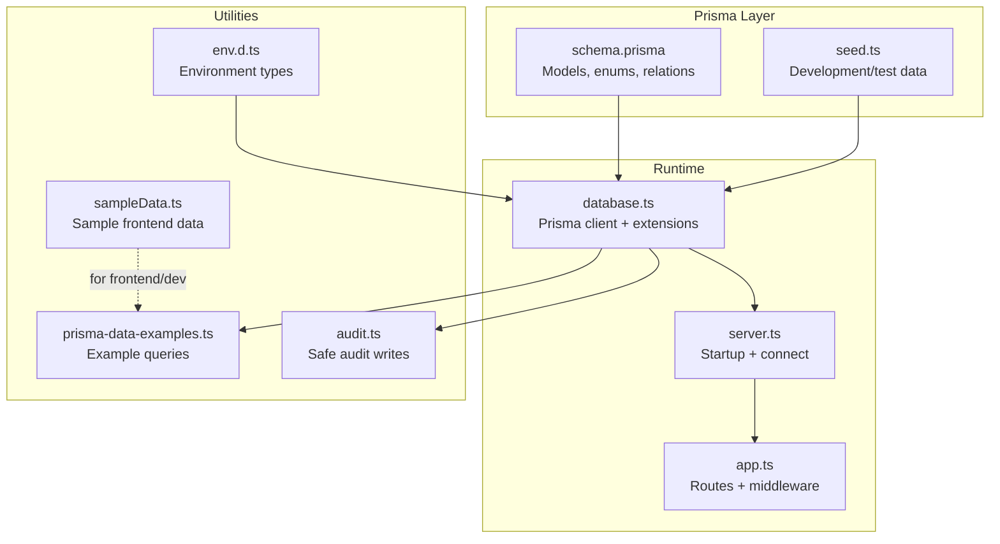
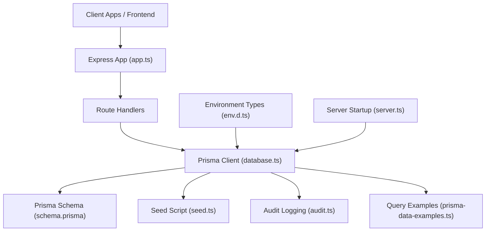
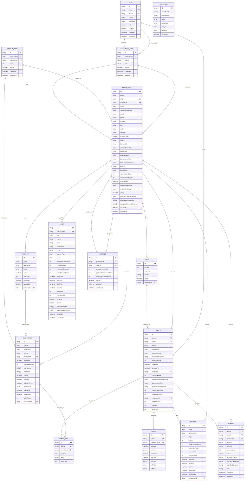
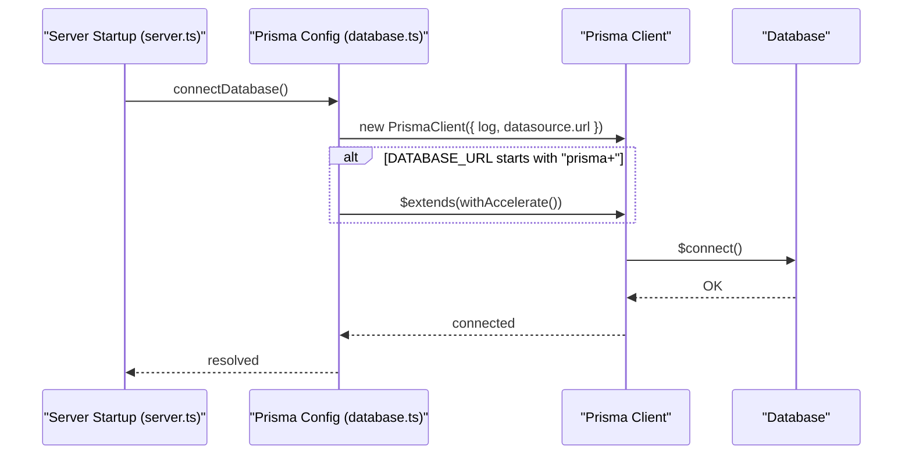
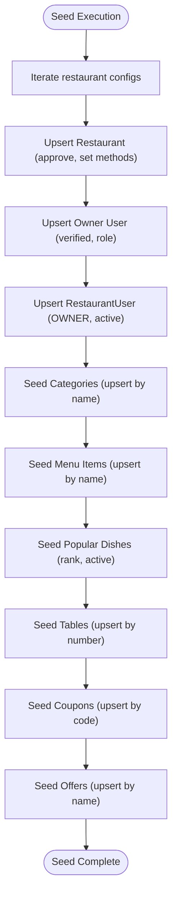
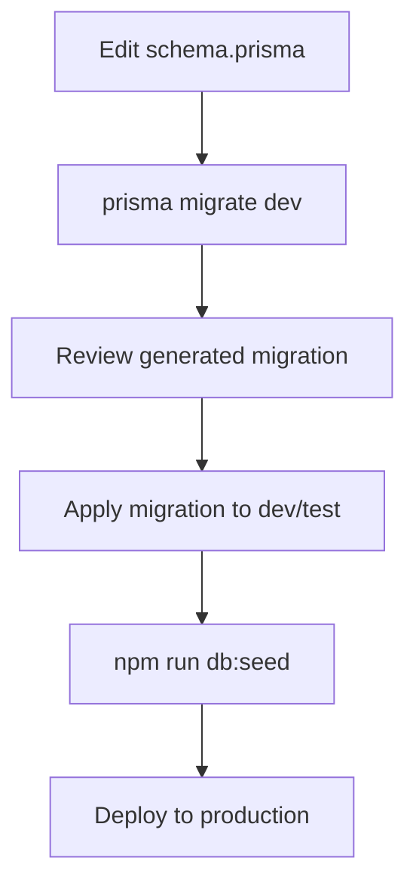
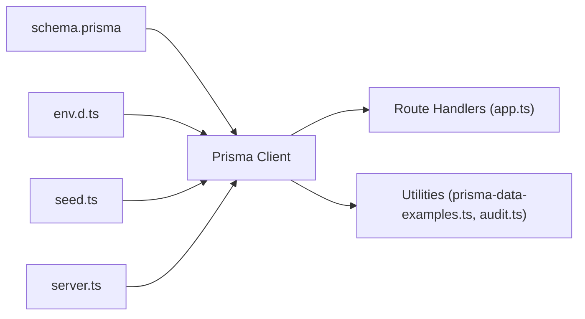

# Database Management

<cite>
**Referenced Files in This Document**
- [schema.prisma](file://restaurant-backend/prisma/schema.prisma)
- [database.ts](file://restaurant-backend/src/config/database.ts)
- [seed.ts](file://restaurant-backend/prisma/seed.ts)
- [package.json](file://restaurant-backend/package.json)
- [prisma-data-examples.ts](file://restaurant-backend/src/utils/prisma-data-examples.ts)
- [audit.ts](file://restaurant-backend/src/utils/audit.ts)
- [env.d.ts](file://restaurant-backend/src/types/env.d.ts)
- [server.ts](file://restaurant-backend/src/server.ts)
- [app.ts](file://restaurant-backend/src/app.ts)
- [sampleData.ts](file://restaurant-backend/src/lib/sampleData.ts)
</cite>

## Table of Contents
1. [Introduction](#introduction)
2. [Project Structure](#project-structure)
3. [Core Components](#core-components)
4. [Architecture Overview](#architecture-overview)
5. [Detailed Component Analysis](#detailed-component-analysis)
6. [Dependency Analysis](#dependency-analysis)
7. [Performance Considerations](#performance-considerations)
8. [Troubleshooting Guide](#troubleshooting-guide)
9. [Conclusion](#conclusion)
10. [Appendices](#appendices)

## Introduction
This document provides comprehensive database management guidance for DeQ-Bite’s Prisma ORM implementation. It covers the complete database schema, entity relationships, Prisma configuration, seeding, migrations, transactions, performance, and operational best practices. The focus is on enabling developers and operators to confidently build, evolve, and maintain the database layer for the restaurant management platform.

## Project Structure
The database layer is centered around Prisma schema definitions, a shared Prisma client configuration, and seed scripts for development/test data. Supporting utilities include audit logging, environment typing, and example data utilities for demonstration and testing.

**Diagram sources**
- [schema.prisma:1-402](file://restaurant-backend/prisma/schema.prisma#L1-L402)
- [database.ts:1-66](file://restaurant-backend/src/config/database.ts#L1-L66)
- [seed.ts:1-388](file://restaurant-backend/prisma/seed.ts#L1-L388)
- [server.ts:1-33](file://restaurant-backend/src/server.ts#L1-L33)
- [app.ts:1-148](file://restaurant-backend/src/app.ts#L1-L148)
- [prisma-data-examples.ts:1-236](file://restaurant-backend/src/utils/prisma-data-examples.ts#L1-L236)
- [audit.ts:1-17](file://restaurant-backend/src/utils/audit.ts#L1-L17)
- [sampleData.ts:1-557](file://restaurant-backend/src/lib/sampleData.ts#L1-L557)
- [env.d.ts:1-32](file://restaurant-backend/src/types/env.d.ts#L1-L32)

**Section sources**
- [schema.prisma:1-402](file://restaurant-backend/prisma/schema.prisma#L1-L402)
- [database.ts:1-66](file://restaurant-backend/src/config/database.ts#L1-L66)
- [seed.ts:1-388](file://restaurant-backend/prisma/seed.ts#L1-L388)
- [package.json:1-80](file://restaurant-backend/package.json#L1-L80)
- [prisma-data-examples.ts:1-236](file://restaurant-backend/src/utils/prisma-data-examples.ts#L1-L236)
- [audit.ts:1-17](file://restaurant-backend/src/utils/audit.ts#L1-L17)
- [env.d.ts:1-32](file://restaurant-backend/src/types/env.d.ts#L1-L32)
- [server.ts:1-33](file://restaurant-backend/src/server.ts#L1-L33)
- [app.ts:1-148](file://restaurant-backend/src/app.ts#L1-L148)
- [sampleData.ts:1-557](file://restaurant-backend/src/lib/sampleData.ts#L1-L557)

## Core Components
- Prisma schema defines entities (User, Restaurant, MenuItem, Order, Payment, Invoice, etc.), relations, enums, and constraints.
- Prisma client configuration supports local development, production logging, and optional acceleration extension.
- Seed script initializes restaurants, owners, categories, menu items, popular dishes, tables, coupons, and offers.
- Environment typing ensures required variables like DATABASE_URL are present.
- Utilities demonstrate advanced Prisma queries and safe audit logging.

**Section sources**
- [schema.prisma:11-402](file://restaurant-backend/prisma/schema.prisma#L11-L402)
- [database.ts:4-66](file://restaurant-backend/src/config/database.ts#L4-L66)
- [seed.ts:188-388](file://restaurant-backend/prisma/seed.ts#L188-L388)
- [env.d.ts:3-28](file://restaurant-backend/src/types/env.d.ts#L3-L28)
- [prisma-data-examples.ts:11-236](file://restaurant-backend/src/utils/prisma-data-examples.ts#L11-L236)
- [audit.ts:5-16](file://restaurant-backend/src/utils/audit.ts#L5-L16)

## Architecture Overview
The database architecture follows a tenant-per-restaurant pattern with shared platform-level entities. The Prisma client is initialized at server startup, optionally extended with acceleration, and used across routes and utilities.

**Diagram sources**
- [app.ts:12-148](file://restaurant-backend/src/app.ts#L12-L148)
- [database.ts:4-66](file://restaurant-backend/src/config/database.ts#L4-L66)
- [schema.prisma:1-402](file://restaurant-backend/prisma/schema.prisma#L1-L402)
- [seed.ts:1-388](file://restaurant-backend/prisma/seed.ts#L1-L388)
- [audit.ts:1-17](file://restaurant-backend/src/utils/audit.ts#L1-L17)
- [prisma-data-examples.ts:1-236](file://restaurant-backend/src/utils/prisma-data-examples.ts#L1-L236)
- [env.d.ts:1-32](file://restaurant-backend/src/types/env.d.ts#L1-L32)
- [server.ts:17-33](file://restaurant-backend/src/server.ts#L17-L33)

## Detailed Component Analysis

### Database Schema and Entities
The schema defines core entities and their relationships. Notable aspects:
- Identity and timestamps: Most models use a cuid-based id and createdAt/updatedAt.
- Enumerations: UserRole, RestaurantRole, CouponType, PaymentProvider, OrderStatus, PaymentStatus, SpiceLevel, OfferType, OnboardingStatus, PaymentCollectionTiming, and InvoiceMethod.
- Unique constraints: Email, phone, and slug/subdomain uniqueness for users and restaurants; composite unique keys for associations like RestaurantUser and Category.
- Cascade deletes: Several relations specify onDelete: Cascade to maintain referential integrity across parent-child hierarchies.
- Additional fields: Rich attributes for restaurants (gst, bank details, cuisines), menu items (dietary flags, spice level), orders (discounts, taxes, totals), and payments (provider-specific identifiers).

**Diagram sources**
- [schema.prisma:11-402](file://restaurant-backend/prisma/schema.prisma#L11-L402)

**Section sources**
- [schema.prisma:11-402](file://restaurant-backend/prisma/schema.prisma#L11-L402)

### Prisma Client Configuration and Extensions
- Client creation toggles logging based on environment and conditionally applies Prisma Accelerate when the DATABASE_URL scheme indicates it.
- Global singleton pattern avoids multiple clients in non-production environments.
- Connection lifecycle includes explicit connect/disconnect hooks.

**Diagram sources**
- [server.ts:17-33](file://restaurant-backend/src/server.ts#L17-L33)
- [database.ts:4-66](file://restaurant-backend/src/config/database.ts#L4-L66)

**Section sources**
- [database.ts:4-66](file://restaurant-backend/src/config/database.ts#L4-L66)
- [server.ts:17-33](file://restaurant-backend/src/server.ts#L17-L33)

### Seeding Process and Initial Data
- The seed script creates multiple restaurants with owners, categories, menu items, popular dishes, tables, coupons, and offers.
- Upsert patterns ensure idempotent development data setup.
- Prices are normalized to paise; spice levels and dietary flags are mapped from enums.

**Diagram sources**
- [seed.ts:238-388](file://restaurant-backend/prisma/seed.ts#L238-L388)

**Section sources**
- [seed.ts:188-388](file://restaurant-backend/prisma/seed.ts#L188-L388)

### Transactions and Batch Operations
- The seed script performs multiple upserts and updates in sequence. For production-scale data ingestion, wrap batch operations in Prisma transactions to ensure atomicity and rollback safety.
- Use transaction blocks for dependent writes (e.g., restaurant + owner + roles) to prevent partial states.

[No sources needed since this section provides general guidance]

### Migration and Schema Evolution
- Use Prisma migrations to evolve the schema safely across environments.
- Typical workflow:
  - Modify schema.prisma.
  - Run the migration command to generate and apply migrations.
  - Reset and seed for development/testing as needed.

**Diagram sources**
- [package.json:13-16](file://restaurant-backend/package.json#L13-L16)
- [schema.prisma:1-402](file://restaurant-backend/prisma/schema.prisma#L1-L402)

**Section sources**
- [package.json:13-16](file://restaurant-backend/package.json#L13-L16)
- [schema.prisma:1-402](file://restaurant-backend/prisma/schema.prisma#L1-L402)

### Production Deployment Strategies
- Ensure DATABASE_URL is set in production and environment types are enforced.
- Use Prisma Accelerate when supported by the hosting provider.
- Monitor logs and health checks; keep Prisma client connections healthy.

**Section sources**
- [env.d.ts:3-28](file://restaurant-backend/src/types/env.d.ts#L3-L28)
- [database.ts:12-24](file://restaurant-backend/src/config/database.ts#L12-L24)
- [app.ts:92-99](file://restaurant-backend/src/app.ts#L92-L99)

### Data Modeling Best Practices
- Use cuid for globally unique IDs; maintain createdAt/updatedAt for auditability.
- Enforce uniqueness via @unique and composite @unique where appropriate.
- Use enums for controlled sets of values to reduce invalid states.
- Apply onDelete: Cascade judiciously to maintain referential integrity while avoiding unintended bulk deletions.
- Normalize monetary values to integer paise to avoid floating-point errors.

**Section sources**
- [schema.prisma:11-402](file://restaurant-backend/prisma/schema.prisma#L11-L402)

### Referential Integrity and Cascade Operations
- Restaurant cascades to categories, menu items, tables, orders, coupons, offers, payments, and earnings.
- Order cascades to order items and payments.
- RestaurantUser cascades to user and restaurant.
- These relationships enforce data consistency and simplify cleanup.

**Section sources**
- [schema.prisma:75-131](file://restaurant-backend/prisma/schema.prisma#L75-L131)
- [schema.prisma:162-193](file://restaurant-backend/prisma/schema.prisma#L162-L193)
- [schema.prisma:195-206](file://restaurant-backend/prisma/schema.prisma#L195-L206)

### Database Seeding Scripts
- Development/test seeding: npm run db:seed
- Reset and seed: npm run db:reset
- Studio for schema inspection: npm run db:studio

**Section sources**
- [package.json:13-16](file://restaurant-backend/package.json#L13-L16)
- [seed.ts:1-388](file://restaurant-backend/prisma/seed.ts#L1-L388)

### Query Patterns and Analytics
- Demonstrates nested includes, aggregations, groupBy, and computed fields.
- Useful for building analytics dashboards and reporting.

**Section sources**
- [prisma-data-examples.ts:11-236](file://restaurant-backend/src/utils/prisma-data-examples.ts#L11-L236)

### Audit Logging
- Safe audit logging with graceful fallback when the audit table does not exist yet.

**Section sources**
- [audit.ts:5-16](file://restaurant-backend/src/utils/audit.ts#L5-L16)

## Dependency Analysis
- Prisma client depends on schema definitions and environment variables.
- Routes depend on the Prisma client for data access.
- Seed script depends on Prisma client and bcrypt for hashing.
- Environment types ensure required variables are present.

**Diagram sources**
- [schema.prisma:1-402](file://restaurant-backend/prisma/schema.prisma#L1-L402)
- [env.d.ts:1-32](file://restaurant-backend/src/types/env.d.ts#L1-L32)
- [app.ts:12-148](file://restaurant-backend/src/app.ts#L12-L148)
- [prisma-data-examples.ts:1-236](file://restaurant-backend/src/utils/prisma-data-examples.ts#L1-L236)
- [audit.ts:1-17](file://restaurant-backend/src/utils/audit.ts#L1-L17)
- [seed.ts:1-388](file://restaurant-backend/prisma/seed.ts#L1-L388)
- [server.ts:1-33](file://restaurant-backend/src/server.ts#L1-L33)

**Section sources**
- [schema.prisma:1-402](file://restaurant-backend/prisma/schema.prisma#L1-L402)
- [env.d.ts:1-32](file://restaurant-backend/src/types/env.d.ts#L1-L32)
- [app.ts:12-148](file://restaurant-backend/src/app.ts#L12-L148)
- [prisma-data-examples.ts:1-236](file://restaurant-backend/src/utils/prisma-data-examples.ts#L1-L236)
- [audit.ts:1-17](file://restaurant-backend/src/utils/audit.ts#L1-L17)
- [seed.ts:1-388](file://restaurant-backend/prisma/seed.ts#L1-L388)
- [server.ts:1-33](file://restaurant-backend/src/server.ts#L1-L33)

## Performance Considerations
- Prefer upserts for idempotent development/test data to avoid duplication.
- Use selective includes and pagination for large datasets.
- Aggregate queries (groupBy) can offload computation to the database.
- Monitor Prisma logs in development; restrict logging in production.
- Consider Prisma Accelerate for query acceleration when supported.

[No sources needed since this section provides general guidance]

## Troubleshooting Guide
- Connection failures: Verify DATABASE_URL and environment variables; check Prisma client initialization.
- Missing audit table: Safe audit logging handles missing tables gracefully; apply migrations to create the table.
- Health checks: Use the /health endpoint to confirm service availability.
- Development vs production: Ensure JWT_SECRET and other secrets are configured for production.

**Section sources**
- [database.ts:44-62](file://restaurant-backend/src/config/database.ts#L44-L62)
- [audit.ts:5-16](file://restaurant-backend/src/utils/audit.ts#L5-L16)
- [app.ts:92-99](file://restaurant-backend/src/app.ts#L92-L99)
- [env.d.ts:3-28](file://restaurant-backend/src/types/env.d.ts#L3-L28)

## Conclusion
DeQ-Bite’s database layer leverages Prisma for robust schema modeling, strong typing, and efficient data operations. The schema enforces referential integrity, supports tenant isolation, and provides extensibility for evolving business needs. With proper migrations, seed scripts, and operational practices, the system remains maintainable and scalable across development, staging, and production environments.

## Appendices
- Environment variables: DATABASE_URL, JWT_SECRET, SMTP, Twilio, etc.
- Example data utilities: sampleData.ts provides frontend-friendly sample data for development and testing.

**Section sources**
- [env.d.ts:3-28](file://restaurant-backend/src/types/env.d.ts#L3-L28)
- [sampleData.ts:1-557](file://restaurant-backend/src/lib/sampleData.ts#L1-L557)