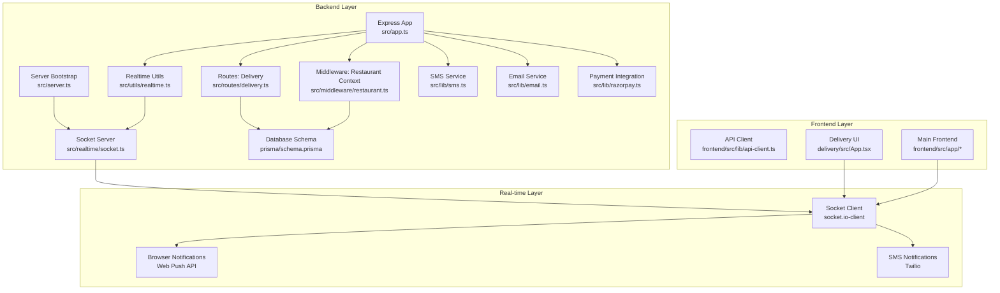
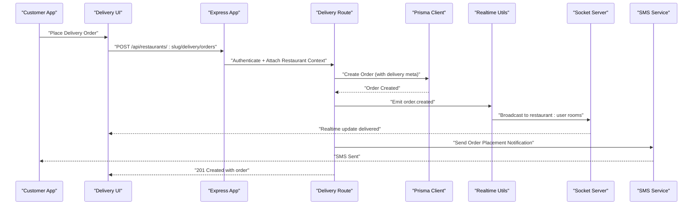
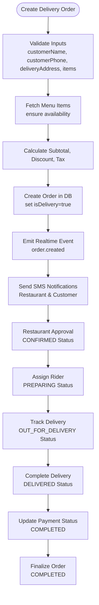
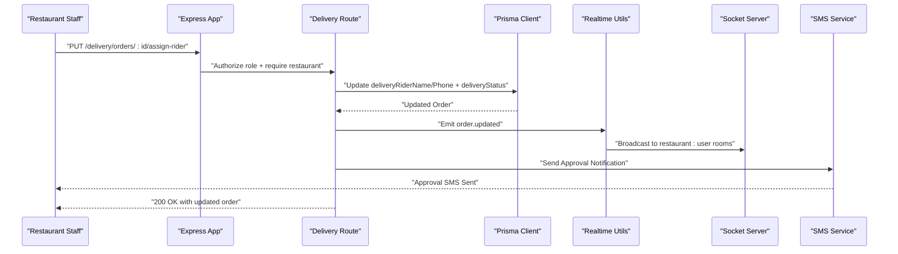
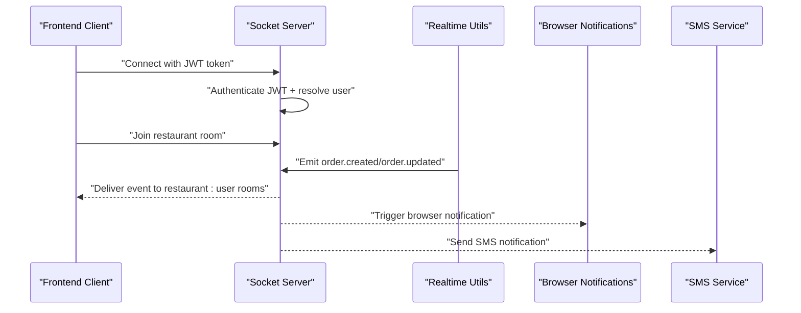
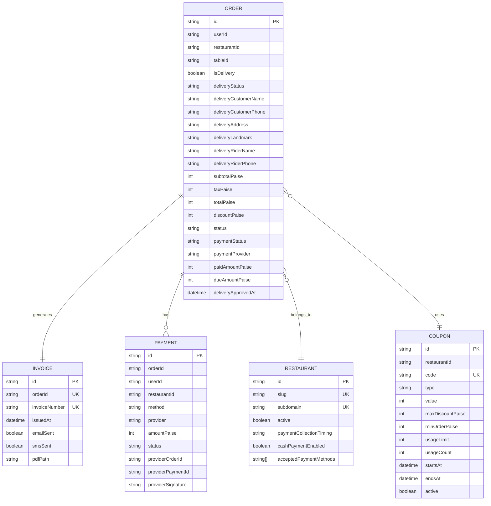
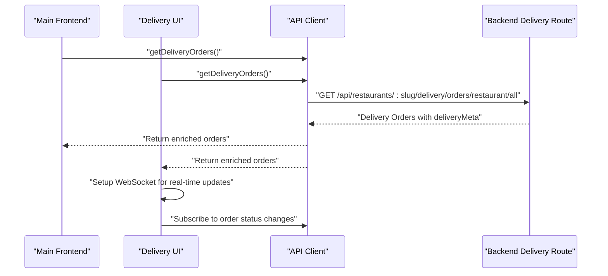
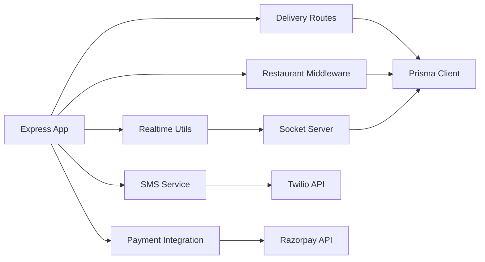

# Delivery System

<cite>
**Referenced Files in This Document**
- [README.md](file://README.md)
- [restaurant-backend/package.json](file://restaurant-backend/package.json)
- [restaurant-frontend/package.json](file://restaurant-frontend/package.json)
- [restaurant-delivery/package.json](file://restaurant-delivery/package.json)
- [restaurant-backend/src/app.ts](file://restaurant-backend/src/app.ts)
- [restaurant-backend/src/server.ts](file://restaurant-backend/src/server.ts)
- [restaurant-backend/prisma/schema.prisma](file://restaurant-backend/prisma/schema.prisma)
- [restaurant-backend/src/routes/delivery.ts](file://restaurant-backend/src/routes/delivery.ts)
- [restaurant-backend/src/middleware/restaurant.ts](file://restaurant-backend/src/middleware/restaurant.ts)
- [restaurant-backend/src/utils/realtime.ts](file://restaurant-backend/src/utils/realtime.ts)
- [restaurant-backend/src/realtime/socket.ts](file://restaurant-backend/src/realtime/socket.ts)
- [restaurant-backend/src/types/api.ts](file://restaurant-backend/src/types/api.ts)
- [restaurant-frontend/src/lib/api-client.ts](file://restaurant-frontend/src/lib/api-client.ts)
- [restaurant-delivery/src/App.tsx](file://restaurant-delivery/src/App.tsx)
</cite>

## Update Summary
**Changes Made**
- Enhanced delivery order lifecycle documentation with comprehensive real-time tracking
- Added detailed coverage of driver assignment and status management workflows
- Expanded customer notification system documentation including SMS and browser notifications
- Updated database schema documentation to reflect delivery-specific fields and relationships
- Added comprehensive frontend integration documentation for the separate delivery UI module
- Enhanced real-time communication documentation with Socket.IO implementation details

## Table of Contents
1. [Introduction](#introduction)
2. [Project Structure](#project-structure)
3. [Core Components](#core-components)
4. [Architecture Overview](#architecture-overview)
5. [Detailed Component Analysis](#detailed-component-analysis)
6. [Dependency Analysis](#dependency-analysis)
7. [Performance Considerations](#performance-considerations)
8. [Troubleshooting Guide](#troubleshooting-guide)
9. [Conclusion](#conclusion)

## Introduction
This document describes the comprehensive Delivery System within the Restaurant Online Ordering Platform. The system enables customers to place delivery orders, assigns riders, tracks delivery status in real-time, and integrates with SMS notifications and browser push notifications. It features a multi-layered architecture with a separated backend (Express.js + TypeScript + Prisma), frontend (Next.js + React), and a dedicated delivery-focused UI module, providing secure, scalable, and tenant-aware order management for multiple restaurants.

## Project Structure
The repository is organized into four main applications:
- restaurant-backend: Express.js API server with route handlers, middleware, database schema, and real-time capabilities
- restaurant-frontend: Next.js frontend application that consumes the backend API and manages user interactions
- restaurant-delivery: A separate delivery-focused UI module built with React/Vite for streamlined order management
- Shared business logic and utilities across all applications

**Diagram sources**
- [restaurant-backend/src/app.ts:1-150](file://restaurant-backend/src/app.ts#L1-L150)
- [restaurant-backend/src/server.ts:1-38](file://restaurant-backend/src/server.ts#L1-L38)
- [restaurant-backend/src/routes/delivery.ts:1-609](file://restaurant-backend/src/routes/delivery.ts#L1-L609)
- [restaurant-backend/src/middleware/restaurant.ts:1-277](file://restaurant-backend/src/middleware/restaurant.ts#L1-L277)
- [restaurant-backend/src/utils/realtime.ts:1-42](file://restaurant-backend/src/utils/realtime.ts#L1-L42)
- [restaurant-backend/src/realtime/socket.ts:1-122](file://restaurant-backend/src/realtime/socket.ts#L1-L122)
- [restaurant-backend/prisma/schema.prisma:1-436](file://restaurant-backend/prisma/schema.prisma#L1-L436)
- [restaurant-frontend/src/lib/api-client.ts:1-996](file://restaurant-frontend/src/lib/api-client.ts#L1-L996)
- [restaurant-delivery/src/App.tsx:1-825](file://restaurant-delivery/src/App.tsx#L1-L825)

**Section sources**
- [README.md:65-99](file://README.md#L65-L99)
- [restaurant-backend/package.json:1-84](file://restaurant-backend/package.json#L1-L84)
- [restaurant-frontend/package.json:1-59](file://restaurant-frontend/package.json#L1-L59)
- [restaurant-delivery/package.json:1-26](file://restaurant-delivery/package.json#L1-L26)

## Core Components
- **Tenant-aware routing and restaurant context resolution** for multi-restaurant support
- **Comprehensive delivery order lifecycle** with creation, rider assignment, and status updates
- **Real-time event emission** and Socket.IO integration for instant updates
- **SMS and browser notification systems** for customer and restaurant communication
- **Advanced database schema** supporting orders, invoices, payments, and delivery metadata
- **Dual frontend integration** with main frontend API client and dedicated delivery UI
- **Multi-provider payment support** including cash, Razorpay, Paytm, and PhonePe

Key implementation references:
- Tenant routing and restaurant context: [restaurant-backend/src/app.ts:112-135](file://restaurant-backend/src/app.ts#L112-L135), [restaurant-backend/src/middleware/restaurant.ts:85-211](file://restaurant-backend/src/middleware/restaurant.ts#L85-L211)
- Delivery routes with comprehensive status management: [restaurant-backend/src/routes/delivery.ts:248-609](file://restaurant-backend/src/routes/delivery.ts#L248-L609)
- Realtime utilities and socket server: [restaurant-backend/src/utils/realtime.ts:1-42](file://restaurant-backend/src/utils/realtime.ts#L1-L42), [restaurant-backend/src/realtime/socket.ts:79-122](file://restaurant-backend/src/realtime/socket.ts#L79-L122)
- Notification systems: [restaurant-backend/src/routes/delivery.ts:200-246](file://restaurant-backend/src/routes/delivery.ts#L200-246)
- Database models: [restaurant-backend/prisma/schema.prisma:167-243](file://restaurant-backend/prisma/schema.prisma#L167-L243)
- Frontend API client for delivery: [restaurant-frontend/src/lib/api-client.ts:735-750](file://restaurant-frontend/src/lib/api-client.ts#L735-L750)
- Dedicated delivery UI: [restaurant-delivery/src/App.tsx:1-825](file://restaurant-delivery/src/App.tsx#L1-L825)

**Section sources**
- [restaurant-backend/src/app.ts:112-135](file://restaurant-backend/src/app.ts#L112-L135)
- [restaurant-backend/src/middleware/restaurant.ts:85-211](file://restaurant-backend/src/middleware/restaurant.ts#L85-L211)
- [restaurant-backend/src/routes/delivery.ts:248-609](file://restaurant-backend/src/routes/delivery.ts#L248-L609)
- [restaurant-backend/src/utils/realtime.ts:1-42](file://restaurant-backend/src/utils/realtime.ts#L1-L42)
- [restaurant-backend/src/realtime/socket.ts:79-122](file://restaurant-backend/src/realtime/socket.ts#L79-L122)
- [restaurant-backend/src/routes/delivery.ts:200-246](file://restaurant-backend/src/routes/delivery.ts#L200-246)
- [restaurant-backend/prisma/schema.prisma:167-243](file://restaurant-backend/prisma/schema.prisma#L167-L243)
- [restaurant-frontend/src/lib/api-client.ts:735-750](file://restaurant-frontend/src/lib/api-client.ts#L735-L750)
- [restaurant-delivery/src/App.tsx:1-825](file://restaurant-delivery/src/App.tsx#L1-L825)

## Architecture Overview
The delivery system follows a comprehensive layered architecture with real-time communication:
- **HTTP Layer**: Express app with CORS, rate limiting, and tenant-aware routing
- **Middleware Layer**: Restaurant context attachment and role-based authorization
- **Business Logic Layer**: Delivery endpoints for order creation, rider assignment, and status updates
- **Real-time Layer**: Socket.IO server emitting order events to restaurant and user rooms
- **Notification Layer**: SMS and browser push notifications for instant customer updates
- **Persistence Layer**: Prisma-managed PostgreSQL schema for orders, invoices, and related entities
- **Frontend Layer**: Dual UI approach with main frontend and dedicated delivery interface

**Diagram sources**
- [restaurant-backend/src/app.ts:112-135](file://restaurant-backend/src/app.ts#L112-L135)
- [restaurant-backend/src/routes/delivery.ts:248-407](file://restaurant-backend/src/routes/delivery.ts#L248-L407)
- [restaurant-backend/src/utils/realtime.ts:28-36](file://restaurant-backend/src/utils/realtime.ts#L28-L36)
- [restaurant-backend/src/realtime/socket.ts:97-115](file://restaurant-backend/src/realtime/socket.ts#L97-L115)
- [restaurant-backend/src/routes/delivery.ts:200-246](file://restaurant-backend/src/routes/delivery.ts#L200-246)

## Detailed Component Analysis

### Comprehensive Delivery Order Lifecycle
The delivery order lifecycle covers creation, rider assignment, and status transitions with full real-time tracking:
- **Order Creation**: Validation of customer delivery details and menu items with tax calculation
- **Coupon Application**: Advanced coupon system with usage limits and validity checks
- **Rider Assignment**: Restaurant staff assignment with automatic status progression
- **Status Management**: Complete delivery status tracking from PLACED to DELIVERED
- **Payment Integration**: Multi-provider payment support with cash, Razorpay, Paytm, and PhonePe
- **Real-time Updates**: Instant notifications to all connected clients
- **Customer Notifications**: SMS alerts for order placement and approval

**Diagram sources**
- [restaurant-backend/src/routes/delivery.ts:248-407](file://restaurant-backend/src/routes/delivery.ts#L248-L407)
- [restaurant-backend/src/utils/realtime.ts:28-36](file://restaurant-backend/src/utils/realtime.ts#L28-L36)
- [restaurant-backend/src/routes/delivery.ts:200-246](file://restaurant-backend/src/routes/delivery.ts#L200-246)

**Section sources**
- [restaurant-backend/src/routes/delivery.ts:248-407](file://restaurant-backend/src/routes/delivery.ts#L248-L407)
- [restaurant-backend/src/utils/realtime.ts:28-36](file://restaurant-backend/src/utils/realtime.ts#L28-L36)
- [restaurant-backend/src/routes/delivery.ts:200-246](file://restaurant-backend/src/routes/delivery.ts#L200-246)

### Advanced Rider Assignment and Status Management
Restaurant staff can manage delivery operations with comprehensive control:
- **Role-based Access Control**: OWNER, ADMIN, and STAFF permissions for delivery management
- **Automatic Status Progression**: Smart status mapping from delivery to order states
- **Driver Information Management**: Complete rider assignment with contact details
- **Payment Status Integration**: Automatic payment completion upon delivery
- **Real-time Broadcasting**: Instant updates to all connected clients
- **Notification System**: SMS alerts for approval and status changes

**Diagram sources**
- [restaurant-backend/src/routes/delivery.ts:463-531](file://restaurant-backend/src/routes/delivery.ts#L463-L531)
- [restaurant-backend/src/utils/realtime.ts:28-36](file://restaurant-backend/src/utils/realtime.ts#L28-L36)
- [restaurant-backend/src/routes/delivery.ts:220-246](file://restaurant-backend/src/routes/delivery.ts#L220-246)

**Section sources**
- [restaurant-backend/src/routes/delivery.ts:463-531](file://restaurant-backend/src/routes/delivery.ts#L463-L531)
- [restaurant-backend/src/utils/realtime.ts:28-36](file://restaurant-backend/src/utils/realtime.ts#L28-L36)
- [restaurant-backend/src/routes/delivery.ts:220-246](file://restaurant-backend/src/routes/delivery.ts#L220-246)

### Real-time Communication and Notifications
Real-time communication is handled via comprehensive Socket.IO implementation:
- **JWT-based Authentication**: Secure socket connections with user verification
- **Room-based Messaging**: Restaurant and user-specific room management
- **Event-driven Architecture**: Real-time order lifecycle event broadcasting
- **Browser Notifications**: Web Push API integration for desktop alerts
- **SMS Integration**: Twilio-based SMS notifications for critical updates
- **Multi-client Support**: Seamless updates across mobile, desktop, and delivery interfaces

**Diagram sources**
- [restaurant-backend/src/realtime/socket.ts:40-70](file://restaurant-backend/src/realtime/socket.ts#L40-L70)
- [restaurant-backend/src/realtime/socket.ts:97-115](file://restaurant-backend/src/realtime/socket.ts#L97-L115)
- [restaurant-backend/src/utils/realtime.ts:28-36](file://restaurant-backend/src/utils/realtime.ts#L28-L36)
- [restaurant-delivery/src/App.tsx:220-235](file://restaurant-delivery/src/App.tsx#L220-L235)

**Section sources**
- [restaurant-backend/src/realtime/socket.ts:40-70](file://restaurant-backend/src/realtime/socket.ts#L40-L70)
- [restaurant-backend/src/realtime/socket.ts:97-115](file://restaurant-backend/src/realtime/socket.ts#L97-L115)
- [restaurant-backend/src/utils/realtime.ts:28-36](file://restaurant-backend/src/utils/realtime.ts#L28-L36)
- [restaurant-delivery/src/App.tsx:220-235](file://restaurant-delivery/src/App.tsx#L220-L235)

### Comprehensive Database Model for Delivery
The database schema defines the core entities for comprehensive delivery management:
- **Order Entity**: Includes delivery-specific fields (customer details, rider info, delivery status)
- **Invoice Entity**: Linked to orders for post-payment generation with SMS/email tracking
- **Payment Entity**: Records payment transactions with provider-specific metadata
- **Restaurant Entity**: Tenant context with payment collection timing and cash payment settings
- **Coupon Entity**: Advanced coupon system with usage limits and validity periods
- **Audit Logging**: Complete audit trail for all delivery operations

**Diagram sources**
- [restaurant-backend/prisma/schema.prisma:167-243](file://restaurant-backend/prisma/schema.prisma#L167-L243)
- [restaurant-backend/prisma/schema.prisma:228-243](file://restaurant-backend/prisma/schema.prisma#L228-L243)
- [restaurant-backend/prisma/schema.prisma:301-321](file://restaurant-backend/prisma/schema.prisma#L301-L321)
- [restaurant-backend/prisma/schema.prisma:245-266](file://restaurant-backend/prisma/schema.prisma#L245-L266)
- [restaurant-backend/prisma/schema.prisma:27-73](file://restaurant-backend/prisma/schema.prisma#L27-L73)

**Section sources**
- [restaurant-backend/prisma/schema.prisma:167-243](file://restaurant-backend/prisma/schema.prisma#L167-L243)
- [restaurant-backend/prisma/schema.prisma:228-243](file://restaurant-backend/prisma/schema.prisma#L228-L243)
- [restaurant-backend/prisma/schema.prisma:301-321](file://restaurant-backend/prisma/schema.prisma#L301-L321)
- [restaurant-backend/prisma/schema.prisma:245-266](file://restaurant-backend/prisma/schema.prisma#L245-L266)
- [restaurant-backend/prisma/schema.prisma:27-73](file://restaurant-backend/prisma/schema.prisma#L27-L73)

### Dual Frontend Integration
The system supports dual frontend approaches with comprehensive API integration:
- **Main Frontend API Client**: [restaurant-frontend/src/lib/api-client.ts:735-750](file://restaurant-frontend/src/lib/api-client.ts#L735-L750) with tenant-aware delivery endpoints
- **Dedicated Delivery UI**: [restaurant-delivery/src/App.tsx:1-825](file://restaurant-delivery/src/App.tsx#L1-L825) with real-time order tracking and browser notifications
- **Shared Business Logic**: Common delivery functionality across both interfaces
- **Real-time Synchronization**: WebSocket connections for instant order updates
- **Responsive Design**: Mobile-first approach for delivery operations

**Diagram sources**
- [restaurant-frontend/src/lib/api-client.ts:735-739](file://restaurant-frontend/src/lib/api-client.ts#L735-L739)
- [restaurant-backend/src/routes/delivery.ts:409-433](file://restaurant-backend/src/routes/delivery.ts#L409-L433)
- [restaurant-delivery/src/App.tsx:211-240](file://restaurant-delivery/src/App.tsx#L211-L240)

**Section sources**
- [restaurant-frontend/src/lib/api-client.ts:735-739](file://restaurant-frontend/src/lib/api-client.ts#L735-L739)
- [restaurant-backend/src/routes/delivery.ts:409-433](file://restaurant-backend/src/routes/delivery.ts#L409-L433)
- [restaurant-delivery/src/App.tsx:211-240](file://restaurant-delivery/src/App.tsx#L211-L240)

## Dependency Analysis
The backend depends on comprehensive external services and libraries:
- **Express Framework**: HTTP routing and middleware stack
- **Prisma ORM**: Database access and schema validation with PostgreSQL
- **Socket.IO**: Real-time bidirectional event-based communication
- **Twilio**: SMS service for customer and restaurant notifications
- **JWT Authentication**: Secure user authentication and authorization
- **Environment Configuration**: Multiple environment variables for production deployment
- **Payment Gateways**: Razorpay integration for online payments

**Diagram sources**
- [restaurant-backend/src/app.ts:112-135](file://restaurant-backend/src/app.ts#L112-L135)
- [restaurant-backend/src/routes/delivery.ts:1-26](file://restaurant-backend/src/routes/delivery.ts#L1-L26)
- [restaurant-backend/src/middleware/restaurant.ts:1-277](file://restaurant-backend/src/middleware/restaurant.ts#L1-L277)
- [restaurant-backend/src/utils/realtime.ts:1-42](file://restaurant-backend/src/utils/realtime.ts#L1-L42)
- [restaurant-backend/src/realtime/socket.ts:1-122](file://restaurant-backend/src/realtime/socket.ts#L1-L122)
- [restaurant-backend/src/routes/delivery.ts:200-246](file://restaurant-backend/src/routes/delivery.ts#L200-246)

**Section sources**
- [restaurant-backend/src/app.ts:112-135](file://restaurant-backend/src/app.ts#L112-L135)
- [restaurant-backend/src/routes/delivery.ts:1-26](file://restaurant-backend/src/routes/delivery.ts#L1-L26)
- [restaurant-backend/src/middleware/restaurant.ts:1-277](file://restaurant-backend/src/middleware/restaurant.ts#L1-L277)
- [restaurant-backend/src/utils/realtime.ts:1-42](file://restaurant-backend/src/utils/realtime.ts#L1-L42)
- [restaurant-backend/src/realtime/socket.ts:1-122](file://restaurant-backend/src/realtime/socket.ts#L1-L122)
- [restaurant-backend/src/routes/delivery.ts:200-246](file://restaurant-backend/src/routes/delivery.ts#L200-246)

## Performance Considerations
- **Tenant-aware Routing**: Minimizes cross-tenant queries through restaurant context resolution
- **Database Indexing**: Strategic indexing on frequently queried fields (restaurantId, createdAt, deliveryStatus)
- **Rate Limiting**: Application-level rate limiting to prevent abuse and ensure fair usage
- **Cache Optimization**: Selective field retrieval and caching strategies for restaurant context
- **Transaction Safety**: Atomic operations for coupon usage and order creation to maintain consistency
- **Real-time Efficiency**: Optimized Socket.IO event broadcasting with room-based filtering
- **SMS Optimization**: Best-effort SMS delivery with retry mechanisms and error handling
- **Frontend Responsiveness**: Debounced real-time updates to prevent excessive re-renders

## Troubleshooting Guide
Common issues and resolutions for the comprehensive delivery system:
- **Unauthorized Restaurant Context**: Ensure x-restaurant-slug header is set and restaurant is active and approved
- **Invalid Delivery Order Creation**: Verify customer details, menu item availability, and items array format
- **Socket Authentication Failures**: Confirm JWT secret configuration and token validity
- **Real-time Events Not Received**: Check allowed origins configuration and room join operations
- **SMS Notification Failures**: Verify Twilio credentials and recipient phone numbers
- **Browser Notification Issues**: Ensure HTTPS deployment and proper permission handling
- **Payment Integration Problems**: Validate payment provider credentials and webhook configurations
- **Coupon Application Errors**: Check coupon validity, usage limits, and minimum order requirements

**Section sources**
- [restaurant-backend/src/middleware/restaurant.ts:213-242](file://restaurant-backend/src/middleware/restaurant.ts#L213-L242)
- [restaurant-backend/src/routes/delivery.ts:248-407](file://restaurant-backend/src/routes/delivery.ts#L248-L407)
- [restaurant-backend/src/realtime/socket.ts:40-70](file://restaurant-backend/src/realtime/socket.ts#L40-L70)
- [restaurant-delivery/src/App.tsx:490-500](file://restaurant-delivery/src/App.tsx#L490-L500)

## Conclusion
The Delivery System provides a comprehensive, tenant-aware solution for managing delivery orders across multiple restaurants with advanced real-time tracking, driver assignment, status management, and multi-channel notification systems. The system integrates secure order creation, intelligent rider assignment, automated status progression, instant real-time updates, and comprehensive customer notifications through SMS and browser push notifications. The modular architecture with dual frontend integration supports independent scaling and provides a seamless experience for both customers and restaurant staff. The system's robust database design, comprehensive security measures, and extensive notification capabilities make it suitable for production deployment in demanding restaurant environments.