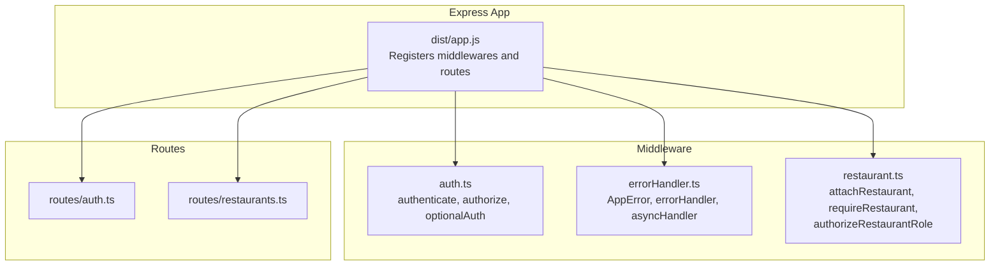
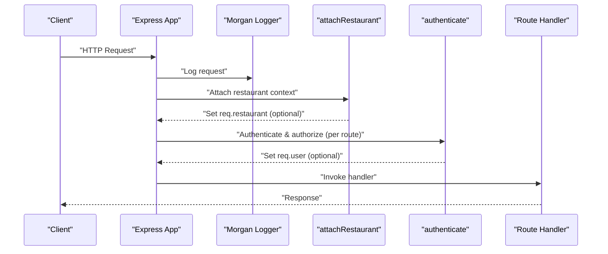
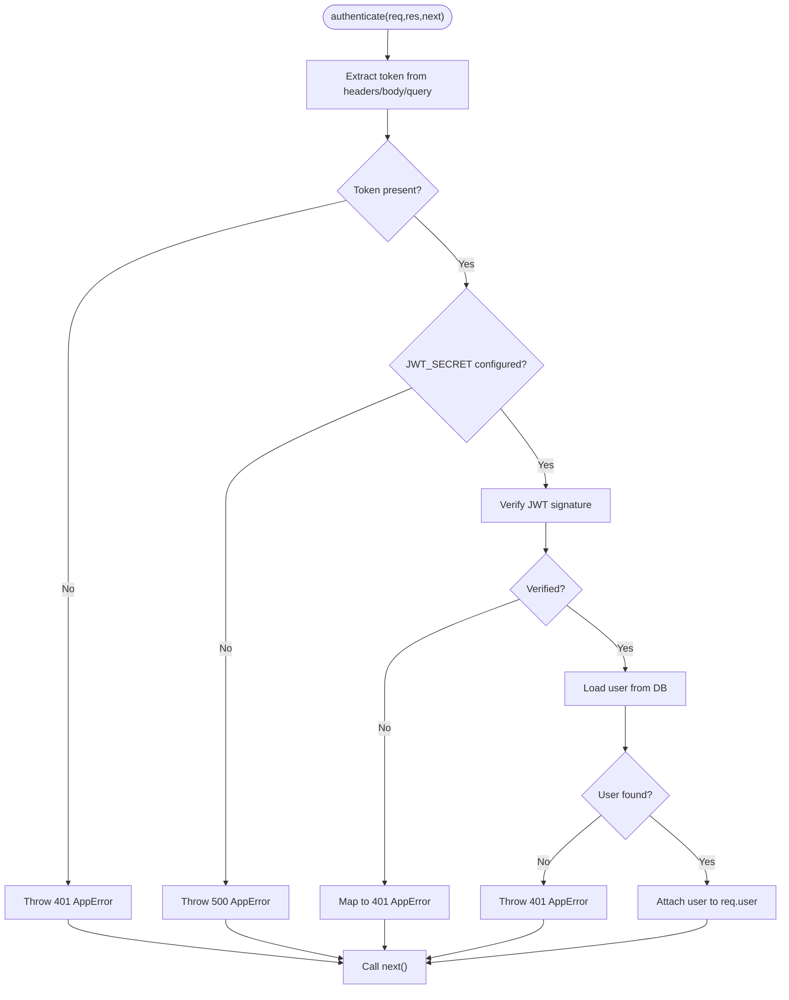
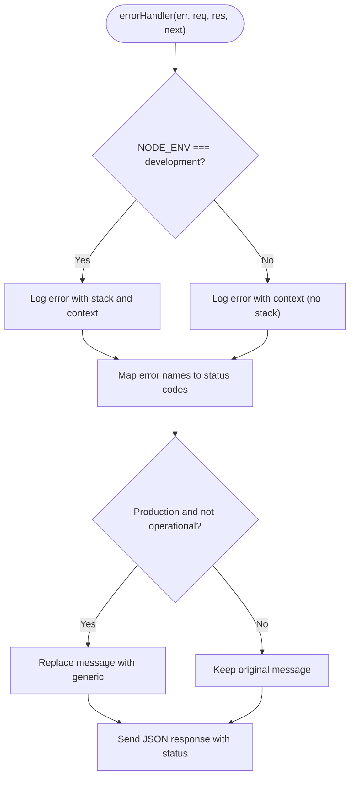
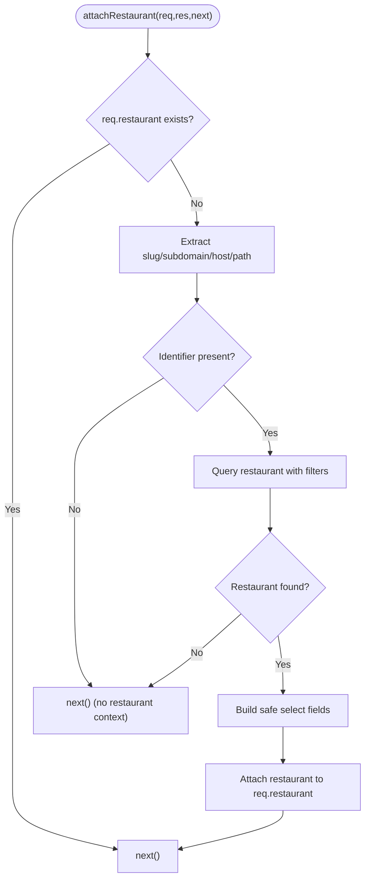
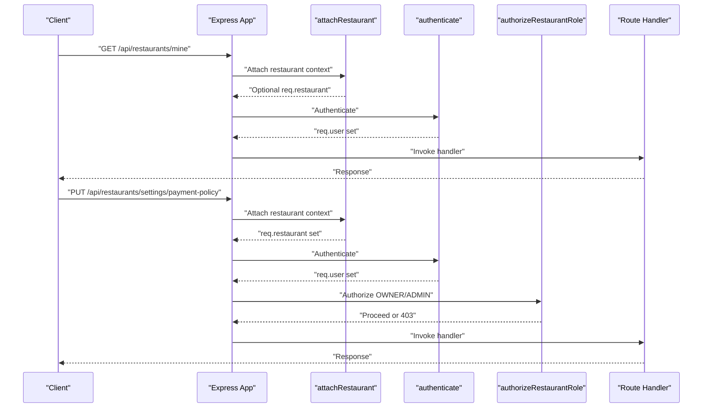
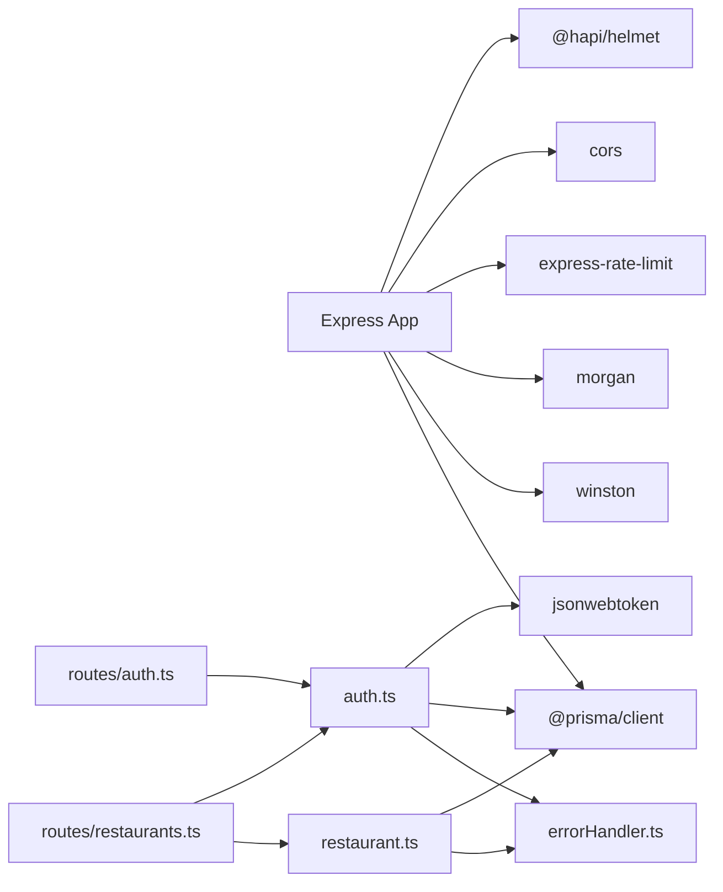

# Middleware System

<cite>
**Referenced Files in This Document**
- [auth.ts](file://restaurant-backend/src/middleware/auth.ts)
- [errorHandler.ts](file://restaurant-backend/src/middleware/errorHandler.ts)
- [restaurant.ts](file://restaurant-backend/src/middleware/restaurant.ts)
- [app.js](file://restaurant-backend/dist/app.js)
- [server.ts](file://restaurant-backend/src/server.ts)
- [restaurants.ts](file://restaurant-backend/src/routes/restaurants.ts)
- [auth.ts](file://restaurant-backend/src/routes/auth.ts)
- [api.ts](file://restaurant-backend/src/types/api.ts)
- [logger.ts](file://restaurant-backend/src/utils/logger.ts)
- [database.ts](file://restaurant-backend/src/config/database.ts)
- [package.json](file://restaurant-backend/package.json)
</cite>

## Table of Contents
1. [Introduction](#introduction)
2. [Project Structure](#project-structure)
3. [Core Components](#core-components)
4. [Architecture Overview](#architecture-overview)
5. [Detailed Component Analysis](#detailed-component-analysis)
6. [Dependency Analysis](#dependency-analysis)
7. [Performance Considerations](#performance-considerations)
8. [Troubleshooting Guide](#troubleshooting-guide)
9. [Conclusion](#conclusion)
10. [Appendices](#appendices)

## Introduction
This document describes the middleware system of DeQ-Bite’s Express.js backend. It explains the middleware pipeline architecture, execution order, and how middleware integrates with route handlers. It covers:
- Authentication middleware that validates JWT tokens and enriches requests with user context
- Error handling middleware that standardizes error responses and logging
- Restaurant-specific middleware that attaches restaurant context and enforces access control
- Middleware configuration, error propagation strategies, and patterns for creating custom middleware
- Composition techniques, conditional application, async/await handling, and performance considerations
- Integration with route handlers, request/response modification patterns, and testing/debugging strategies

## Project Structure
The middleware system is implemented under the src/middleware directory and wired into the application via the Express app definition. Routes import and apply middleware selectively to protect endpoints and enforce restaurant context.

**Diagram sources**
- [app.js:34-129](file://restaurant-backend/dist/app.js#L34-L129)
- [auth.ts:7-137](file://restaurant-backend/src/middleware/auth.ts#L7-L137)
- [errorHandler.ts:9-82](file://restaurant-backend/src/middleware/errorHandler.ts#L9-L82)
- [restaurant.ts:76-246](file://restaurant-backend/src/middleware/restaurant.ts#L76-L246)
- [auth.ts:1-390](file://restaurant-backend/src/routes/auth.ts#L1-L390)
- [restaurants.ts:1-554](file://restaurant-backend/src/routes/restaurants.ts#L1-L554)

**Section sources**
- [app.js:34-129](file://restaurant-backend/dist/app.js#L34-L129)

## Core Components
- Authentication middleware
  - Validates JWT from Authorization header, body, or query
  - Enriches request with user profile
  - Provides authorization by role
  - Supports optional authentication
- Error handling middleware
  - Standardizes error responses
  - Logs structured errors
  - Wraps async handlers to propagate exceptions
- Restaurant middleware
  - Attaches restaurant context from subdomain, slug, or path
  - Enforces restaurant membership and roles
  - Handles schema mismatches with fallback queries

**Section sources**
- [auth.ts:7-137](file://restaurant-backend/src/middleware/auth.ts#L7-L137)
- [errorHandler.ts:9-82](file://restaurant-backend/src/middleware/errorHandler.ts#L9-L82)
- [restaurant.ts:76-246](file://restaurant-backend/src/middleware/restaurant.ts#L76-L246)

## Architecture Overview
The Express app registers global middleware before mounting routes. Restaurant context is attached early to enable per-route enforcement. Authentication and authorization are applied per route as needed.

**Diagram sources**
- [app.js:75-82](file://restaurant-backend/dist/app.js#L75-L82)
- [restaurant.ts:76-200](file://restaurant-backend/src/middleware/restaurant.ts#L76-L200)
- [auth.ts:7-89](file://restaurant-backend/src/middleware/auth.ts#L7-L89)
- [auth.ts:160-232](file://restaurant-backend/src/routes/auth.ts#L160-L232)

**Section sources**
- [app.js:75-129](file://restaurant-backend/dist/app.js#L75-L129)

## Detailed Component Analysis

### Authentication Middleware
Responsibilities:
- Extract token from Authorization header, body, or query
- Validate JWT and load user profile
- Attach user to request for downstream handlers
- Role-based authorization
- Optional authentication that does not block requests

Key behaviors:
- Robust token extraction supporting multiple locations
- Environment validation for JWT secret
- Error mapping for JWT errors
- Optional auth continues even if token is absent or invalid

**Diagram sources**
- [auth.ts:7-75](file://restaurant-backend/src/middleware/auth.ts#L7-L75)

**Section sources**
- [auth.ts:7-137](file://restaurant-backend/src/middleware/auth.ts#L7-L137)
- [api.ts:3-18](file://restaurant-backend/src/types/api.ts#L3-L18)

### Error Handling Middleware
Responsibilities:
- Standardize error responses with success flag and error message
- Log structured errors with contextual info
- Map specific error names to appropriate HTTP status codes
- Prevent operational error leakage in production
- Wrap async handlers to catch thrown/rejected promises

**Diagram sources**
- [errorHandler.ts:22-76](file://restaurant-backend/src/middleware/errorHandler.ts#L22-L76)
- [logger.ts:50-56](file://restaurant-backend/src/utils/logger.ts#L50-L56)

**Section sources**
- [errorHandler.ts:9-82](file://restaurant-backend/src/middleware/errorHandler.ts#L9-L82)
- [logger.ts:1-56](file://restaurant-backend/src/utils/logger.ts#L1-L56)

### Restaurant Middleware
Responsibilities:
- Attach restaurant context from subdomain, slug, or path
- Enforce restaurant membership and roles
- Gracefully handle schema mismatches between Prisma client and database
- Build safe select clauses to avoid “empty select” errors

Execution flow:
- Detect restaurant identifier from headers, host, or path
- Query restaurant with active and status filters
- Fallback query if schema mismatch detected
- Attach sanitized restaurant fields to request
- Require restaurant context and enforce roles via higher-order function

**Diagram sources**
- [restaurant.ts:76-200](file://restaurant-backend/src/middleware/restaurant.ts#L76-L200)

**Section sources**
- [restaurant.ts:76-246](file://restaurant-backend/src/middleware/restaurant.ts#L76-L246)
- [api.ts:10-18](file://restaurant-backend/src/types/api.ts#L10-L18)

### Route Integration and Execution Order
Global middleware registration:
- Helmet, CORS, rate limiting, body parsing, restaurant context attachment, Morgan logging
- Health endpoints and static assets
- Tenant routes mounted under /api/:restaurantSlug with restaurant context attached
- Global 404 and error handler last

Per-route middleware usage:
- Authentication and authorization applied where needed
- Restaurant context enforced with requireRestaurant
- Role checks via authorizeRestaurantRole

**Diagram sources**
- [app.js:99-129](file://restaurant-backend/dist/app.js#L99-L129)
- [restaurants.ts:263-305](file://restaurant-backend/src/routes/restaurants.ts#L263-L305)
- [restaurants.ts:377-429](file://restaurant-backend/src/routes/restaurants.ts#L377-L429)
- [auth.ts:160-232](file://restaurant-backend/src/routes/auth.ts#L160-L232)

**Section sources**
- [app.js:75-129](file://restaurant-backend/dist/app.js#L75-L129)
- [restaurants.ts:252-305](file://restaurant-backend/src/routes/restaurants.ts#L252-L305)
- [restaurants.ts:377-429](file://restaurant-backend/src/routes/restaurants.ts#L377-L429)
- [auth.ts:160-232](file://restaurant-backend/src/routes/auth.ts#L160-L232)

## Dependency Analysis
- Express app depends on:
  - Helmet for security headers
  - CORS for cross-origin allowance
  - Rate limiter for abuse protection
  - Morgan for request logging
  - Prisma client for database operations
  - Winston logger for structured logging
- Middleware depend on:
  - JWT library for token verification
  - Prisma client for user and restaurant lookups
  - Environment variables for secrets and configuration
- Routes depend on:
  - Authentication and restaurant middleware
  - Zod for request validation
  - Prisma client for data access

**Diagram sources**
- [app.js:34-129](file://restaurant-backend/dist/app.js#L34-L129)
- [auth.ts:1-6](file://restaurant-backend/src/middleware/auth.ts#L1-L6)
- [errorHandler.ts:1-2](file://restaurant-backend/src/middleware/errorHandler.ts#L1-L2)
- [restaurant.ts:1-5](file://restaurant-backend/src/middleware/restaurant.ts#L1-L5)
- [auth.ts:1-8](file://restaurant-backend/src/routes/auth.ts#L1-L8)
- [restaurants.ts:1-8](file://restaurant-backend/src/routes/restaurants.ts#L1-L8)

**Section sources**
- [package.json:18-45](file://restaurant-backend/package.json#L18-L45)
- [app.js:34-129](file://restaurant-backend/dist/app.js#L34-L129)

## Performance Considerations
- Early restaurant context attachment reduces repeated lookups in handlers
- Safe select building avoids unnecessary fields and “empty select” errors
- Schema mismatch fallback minimizes downtime during deployments
- Rate limiting protects endpoints from abuse
- Logging streams to Winston to avoid blocking I/O
- Async handler wrapper ensures unhandled rejections are captured

Recommendations:
- Prefer selective field selection in queries
- Cache infrequent data where feasible
- Monitor Prisma client schema alignment to reduce fallbacks
- Tune rate limits per endpoint as needed

[No sources needed since this section provides general guidance]

## Troubleshooting Guide
Common issues and resolutions:
- Missing JWT_SECRET
  - Symptom: 500 errors during authentication
  - Resolution: Set JWT_SECRET in environment
- Invalid or expired token
  - Symptom: 401 errors mapped from JWT errors
  - Resolution: Regenerate token or refresh token
- Restaurant context not found
  - Symptom: 400 “Restaurant context required” or no restaurant attached
  - Resolution: Ensure proper subdomain/slug/path or include x-restaurant-* headers
- Permission denied
  - Symptom: 403 errors from authorization checks
  - Resolution: Verify user membership and role in restaurantUser
- Database schema mismatch
  - Symptom: Query failures referencing unknown fields
  - Resolution: Fallback queries handle mismatch; align Prisma client and schema

Debugging tips:
- Enable development logging to see stack traces
- Use Morgan logs to trace request lifecycle
- Inspect req.user and req.restaurant in handlers
- Validate environment variables at startup

**Section sources**
- [errorHandler.ts:22-76](file://restaurant-backend/src/middleware/errorHandler.ts#L22-L76)
- [auth.ts:40-44](file://restaurant-backend/src/middleware/auth.ts#L40-L44)
- [auth.ts:66-74](file://restaurant-backend/src/middleware/auth.ts#L66-L74)
- [restaurant.ts:141-183](file://restaurant-backend/src/middleware/restaurant.ts#L141-L183)
- [logger.ts:50-56](file://restaurant-backend/src/utils/logger.ts#L50-L56)

## Conclusion
DeQ-Bite’s middleware system provides a robust, layered approach to authentication, error handling, and restaurant context management. By attaching restaurant context early, applying authentication and authorization selectively, and standardizing error responses, the system achieves predictable behavior, strong security, and maintainable routing. The patterns described here support scalable middleware composition, conditional application, and resilient error propagation.

[No sources needed since this section summarizes without analyzing specific files]

## Appendices

### Middleware Pipeline Execution Order
- Security: Helmet, CORS
- Traffic control: Rate limiter
- Body parsing: JSON/URL-encoded
- Context: attachRestaurant
- Logging: Morgan
- Routes: Mounted under /api/*
- Not found: 404 handler
- Error: errorHandler

**Section sources**
- [app.js:34-129](file://restaurant-backend/dist/app.js#L34-L129)

### Conditional Middleware Application Patterns
- Per-route application: Apply authenticate and authorizeRestaurantRole only where needed
- Optional authentication: Use optionalAuth to enrich request without failing
- Higher-order authorization: authorizeRestaurantRole(...) enables role gating

**Section sources**
- [auth.ts:77-89](file://restaurant-backend/src/middleware/auth.ts#L77-L89)
- [auth.ts:91-137](file://restaurant-backend/src/middleware/auth.ts#L91-L137)
- [restaurants.ts:377-429](file://restaurant-backend/src/routes/restaurants.ts#L377-L429)

### Async/Await Handling in Middleware Chains
- asyncHandler wraps route handlers to convert thrown errors into next(error)
- Authentication middleware uses try/catch around JWT verification and DB lookup
- Restaurant middleware uses try/catch around queries and fallback logic

**Section sources**
- [errorHandler.ts:78-82](file://restaurant-backend/src/middleware/errorHandler.ts#L78-L82)
- [auth.ts:11-75](file://restaurant-backend/src/middleware/auth.ts#L11-L75)
- [restaurant.ts:80-200](file://restaurant-backend/src/middleware/restaurant.ts#L80-L200)

### Testing Strategies
- Unit tests for middleware:
  - Test token extraction and validation paths
  - Simulate JWT errors and environment misconfiguration
  - Mock Prisma client to test restaurant context attachment and role checks
- Integration tests for routes:
  - Verify middleware application order and error responses
  - Test optionalAuth behavior when token is absent
  - Validate 403 responses for insufficient permissions

[No sources needed since this section provides general guidance]