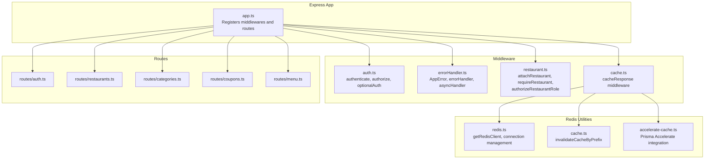
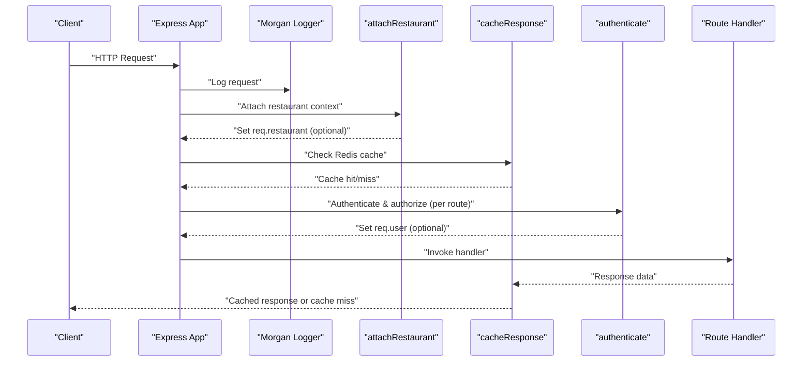
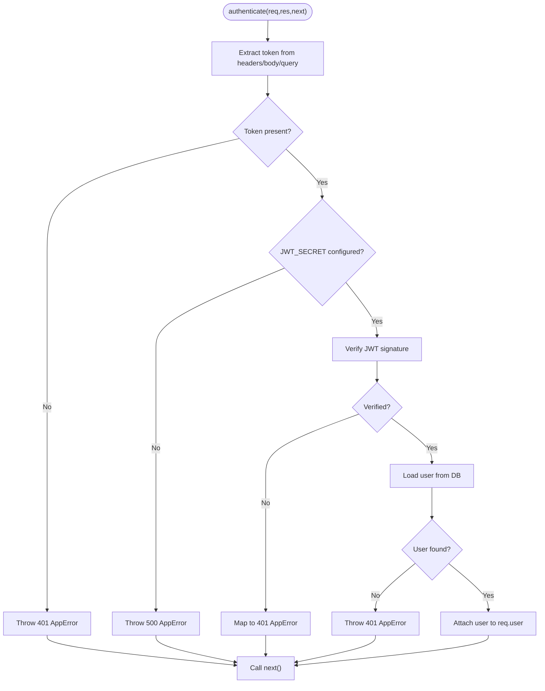
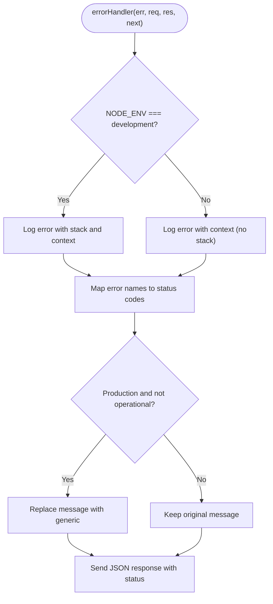
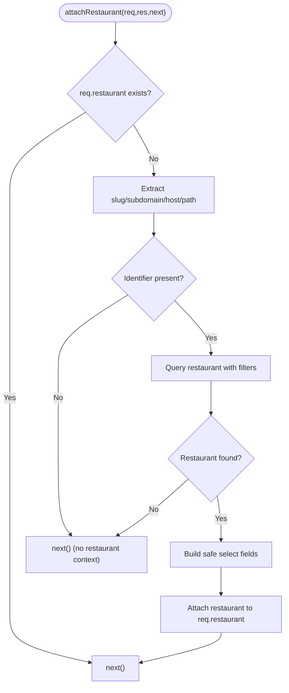
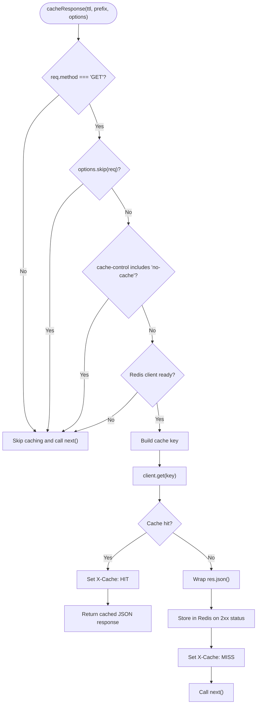
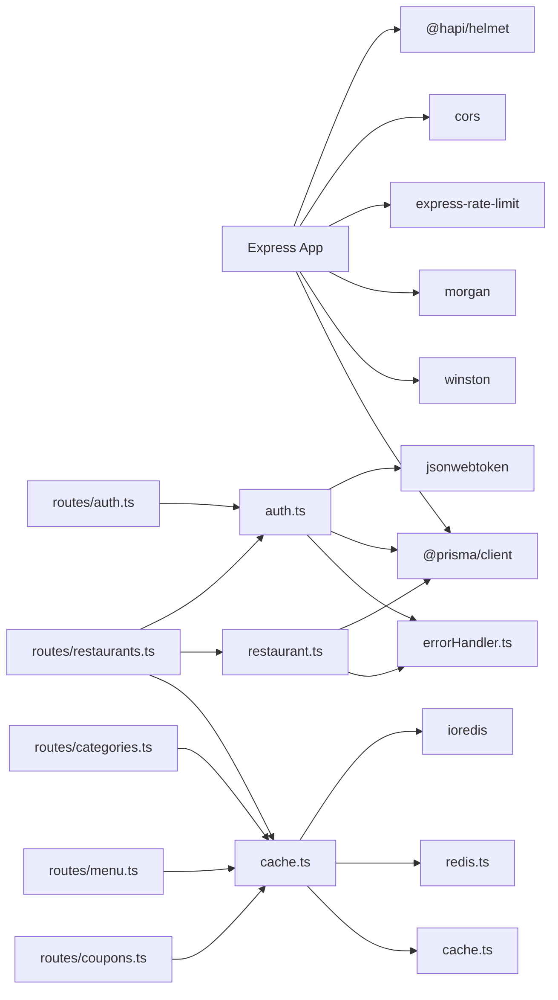

# Middleware System

<cite>
**Referenced Files in This Document**
- [auth.ts](file://restaurant-backend/src/middleware/auth.ts)
- [errorHandler.ts](file://restaurant-backend/src/middleware/errorHandler.ts)
- [restaurant.ts](file://restaurant-backend/src/middleware/restaurant.ts)
- [cache.ts](file://restaurant-backend/src/middleware/cache.ts)
- [app.ts](file://restaurant-backend/src/app.ts)
- [server.ts](file://restaurant-backend/src/server.ts)
- [restaurants.ts](file://restaurant-backend/src/routes/restaurants.ts)
- [auth.ts](file://restaurant-backend/src/routes/auth.ts)
- [categories.ts](file://restaurant-backend/src/routes/categories.ts)
- [coupons.ts](file://restaurant-backend/src/routes/coupons.ts)
- [menu.ts](file://restaurant-backend/src/routes/menu.ts)
- [api.ts](file://restaurant-backend/src/types/api.ts)
- [logger.ts](file://restaurant-backend/src/utils/logger.ts)
- [database.ts](file://restaurant-backend/src/config/database.ts)
- [redis.ts](file://restaurant-backend/src/utils/redis.ts)
- [cache.ts](file://restaurant-backend/src/utils/cache.ts)
- [accelerate-cache.ts](file://restaurant-backend/src/utils/accelerate-cache.ts)
- [package.json](file://restaurant-backend/package.json)
</cite>

## Update Summary
**Changes Made**
- Enhanced Redis caching middleware documentation with new cacheResponse implementation
- Added comprehensive cache key generation patterns and TTL configuration strategies
- Documented improved cache invalidation utilities with cursor-based iteration
- Integrated Prisma Accelerate caching system with TTL and SWR configuration
- Updated middleware architecture to reflect enhanced caching layer
- Added detailed examples of cache usage across restaurant, menu, and coupon routes

## Table of Contents
1. [Introduction](#introduction)
2. [Project Structure](#project-structure)
3. [Core Components](#core-components)
4. [Architecture Overview](#architecture-overview)
5. [Detailed Component Analysis](#detailed-component-analysis)
6. [Enhanced Redis Caching System](#enhanced-redis-caching-system)
7. [Dependency Analysis](#dependency-analysis)
8. [Performance Considerations](#performance-considerations)
9. [Troubleshooting Guide](#troubleshooting-guide)
10. [Conclusion](#conclusion)
11. [Appendices](#appendices)

## Introduction
This document describes the middleware system of DeQ-Bite's Express.js backend. It explains the middleware pipeline architecture, execution order, and how middleware integrates with route handlers. It covers:
- Authentication middleware that validates JWT tokens and enriches requests with user context
- Error handling middleware that standardizes error responses and logging
- Restaurant-specific middleware that attaches restaurant context and enforces access control
- **Enhanced Redis-based caching middleware with configurable TTL settings, automatic cache invalidation, and Prisma Accelerate integration**
- Middleware configuration, error propagation strategies, and patterns for creating custom middleware
- Composition techniques, conditional application, async/await handling, and performance considerations
- Integration with route handlers, request/response modification patterns, and testing/debugging strategies

## Project Structure
The middleware system is implemented under the src/middleware directory and wired into the application via the Express app definition. Routes import and apply middleware selectively to protect endpoints, enforce restaurant context, and implement caching strategies with enhanced Redis integration.

```mermaid
graph TB
subgraph "Express App"
A["app.ts<br/>Registers middlewares and routes"]
end
subgraph "Middleware"
M1["auth.ts<br/>authenticate, authorize, optionalAuth"]
M2["errorHandler.ts<br/>AppError, errorHandler, asyncHandler"]
M3["restaurant.ts<br/>attachRestaurant, requireRestaurant,<br/>authorizeRestaurantRole"]
M4["cache.ts<br/>cacheResponse middleware"]
end
subgraph "Redis Utilities"
R1["redis.ts<br/>getRedisClient, connection management"]
R2["cache.ts<br/>invalidateCacheByPrefix"]
R3["accelerate-cache.ts<br/>Prisma Accelerate integration"]
end
subgraph "Routes"
R5["routes/auth.ts"]
R6["routes/restaurants.ts"]
R7["routes/categories.ts"]
R8["routes/coupons.ts"]
R9["routes/menu.ts"]
end
A --> M1
A --> M2
A --> M3
A --> M4
M4 --> R1
M4 --> R2
M4 --> R3
A --> R5
A --> R6
A --> R7
A --> R8
A --> R9
```

**Diagram sources**
- [app.ts:85-86](file://restaurant-backend/src/app.ts#L85-L86)
- [auth.ts:7-137](file://restaurant-backend/src/middleware/auth.ts#L7-L137)
- [errorHandler.ts:9-82](file://restaurant-backend/src/middleware/errorHandler.ts#L9-L82)
- [restaurant.ts:76-246](file://restaurant-backend/src/middleware/restaurant.ts#L76-L246)
- [cache.ts:1-53](file://restaurant-backend/src/middleware/cache.ts#L1-L53)
- [redis.ts:1-33](file://restaurant-backend/src/utils/redis.ts#L1-L33)
- [cache.ts:1-17](file://restaurant-backend/src/utils/cache.ts#L1-L17)
- [accelerate-cache.ts:1-7](file://restaurant-backend/src/utils/accelerate-cache.ts#L1-L7)

**Section sources**
- [app.ts:85-148](file://restaurant-backend/src/app.ts#L85-L148)

## Core Components
- Authentication middleware
  - Validates JWT from Authorization header, body, or query
  - Enriches request with user profile
  - Provides authorization by role
  - Supports optional authentication
- Error handling middleware
  - Standardizes error responses
  - Logs structured errors
  - Wraps async handlers to propagate exceptions
- Restaurant middleware
  - Attaches restaurant context from subdomain, slug, or path
  - Enforces restaurant membership and roles
  - Handles schema mismatches with fallback queries
- **Enhanced Redis caching middleware**
  - **Configurable TTL (Time-To-Live) settings per route**
  - **Restaurant-scoped cache keys for multi-tenant isolation**
  - **Automatic cache invalidation patterns with cursor-based iteration**
  - **Integration with Prisma Accelerate for distributed caching**
  - **Conditional caching with skip functions**
  - **Cache-Control header support for bypassing cache**

**Section sources**
- [auth.ts:7-137](file://restaurant-backend/src/middleware/auth.ts#L7-L137)
- [errorHandler.ts:9-82](file://restaurant-backend/src/middleware/errorHandler.ts#L9-L82)
- [restaurant.ts:76-246](file://restaurant-backend/src/middleware/restaurant.ts#L76-L246)
- [cache.ts:1-53](file://restaurant-backend/src/middleware/cache.ts#L1-L53)

## Architecture Overview
The Express app registers global middleware before mounting routes. Restaurant context is attached early to enable per-route enforcement. Authentication and authorization are applied per route as needed. The enhanced Redis caching middleware sits between the restaurant context and route handlers to provide transparent caching capabilities with intelligent cache key generation and automatic invalidation.

```mermaid
sequenceDiagram
participant C as "Client"
participant APP as "Express App"
participant LOG as "Morgan Logger"
participant REST as "attachRestaurant"
participant CACHE as "cacheResponse"
participant AUTH as "authenticate"
participant ROUTE as "Route Handler"
C->>APP : "HTTP Request"
APP->>LOG : "Log request"
APP->>REST : "Attach restaurant context"
REST-->>APP : "Set req.restaurant (optional)"
APP->>CACHE : "Check Redis cache"
CACHE-->>APP : "Cache hit/miss"
APP->>AUTH : "Authenticate & authorize (per route)"
AUTH-->>APP : "Set req.user (optional)"
APP->>ROUTE : "Invoke handler"
ROUTE-->>CACHE : "Response data"
CACHE-->>C : "Cached response or cache miss"
```

**Diagram sources**
- [app.ts:85-86](file://restaurant-backend/src/app.ts#L85-L86)
- [restaurant.ts:76-200](file://restaurant-backend/src/middleware/restaurant.ts#L76-L200)
- [cache.ts:9-52](file://restaurant-backend/src/middleware/cache.ts#L9-L52)
- [auth.ts:7-89](file://restaurant-backend/src/middleware/auth.ts#L7-L89)

**Section sources**
- [app.ts:85-148](file://restaurant-backend/src/app.ts#L85-L148)

## Detailed Component Analysis

### Authentication Middleware
Responsibilities:
- Extract token from Authorization header, body, or query
- Validate JWT and load user profile
- Attach user to request for downstream handlers
- Role-based authorization
- Optional authentication that does not block requests

Key behaviors:
- Robust token extraction supporting multiple locations
- Environment validation for JWT secret
- Error mapping for JWT errors
- Optional auth continues even if token is absent or invalid

```mermaid
flowchart TD
Start(["authenticate(req,res,next)"]) --> Extract["Extract token from headers/body/query"]
Extract --> HasToken{"Token present?"}
HasToken --> |No| NoToken["Throw 401 AppError"]
HasToken --> |Yes| Secret{"JWT_SECRET configured?"}
Secret --> |No| ConfigErr["Throw 500 AppError"]
Secret --> |Yes| Verify["Verify JWT signature"]
Verify --> Verified{"Verified?"}
Verified --> |No| JwtErr["Map to 401 AppError"]
Verified --> |Yes| LoadUser["Load user from DB"]
LoadUser --> Found{"User found?"}
Found --> |No| InvalidToken["Throw 401 AppError"]
Found --> |Yes| Attach["Attach user to req.user"]
Attach --> Next["Call next()"]
NoToken --> Next
JwtErr --> Next
ConfigErr --> Next
InvalidToken --> Next
```

**Diagram sources**
- [auth.ts:7-75](file://restaurant-backend/src/middleware/auth.ts#L7-L75)

**Section sources**
- [auth.ts:7-137](file://restaurant-backend/src/middleware/auth.ts#L7-L137)
- [api.ts:3-18](file://restaurant-backend/src/types/api.ts#L3-L18)

### Error Handling Middleware
Responsibilities:
- Standardize error responses with success flag and error message
- Log structured errors with contextual info
- Map specific error names to appropriate HTTP status codes
- Prevent operational error leakage in production
- Wrap async handlers to catch thrown/rejected promises

```mermaid
flowchart TD
EHStart(["errorHandler(err, req, res, next)"]) --> Dev{"NODE_ENV === development?"}
Dev --> |Yes| LogDev["Log error with stack and context"]
Dev --> |No| LogProd["Log error with context (no stack)"]
LogDev --> Map["Map error names to status codes"]
LogProd --> Map
Map --> Op{"Production and not operational?"}
Op --> |Yes| Hide["Replace message with generic"]
Op --> |No| Keep["Keep original message"]
Hide --> Respond["Send JSON response with status"]
Keep --> Respond
```

**Diagram sources**
- [errorHandler.ts:22-76](file://restaurant-backend/src/middleware/errorHandler.ts#L22-L76)
- [logger.ts:50-56](file://restaurant-backend/src/utils/logger.ts#L50-L56)

**Section sources**
- [errorHandler.ts:9-82](file://restaurant-backend/src/middleware/errorHandler.ts#L9-L82)
- [logger.ts:1-56](file://restaurant-backend/src/utils/logger.ts#L1-L56)

### Restaurant Middleware
Responsibilities:
- Attach restaurant context from subdomain, slug, or path
- Enforce restaurant membership and roles
- Gracefully handle schema mismatches between Prisma client and database
- Build safe select clauses to avoid "empty select" errors

Execution flow:
- Detect restaurant identifier from headers, host, or path
- Query restaurant with active and status filters
- Fallback query if schema mismatch detected
- Attach sanitized restaurant fields to request
- Require restaurant context and enforce roles via higher-order function

```mermaid
flowchart TD
RSStart(["attachRestaurant(req,res,next)"]) --> CheckCache{"req.restaurant exists?"}
CheckCache --> |Yes| Done["next()"]
CheckCache --> |No| Extract["Extract slug/subdomain/host/path"]
Extract --> HasId{"Identifier present?"}
HasId --> |No| Skip["next() (no restaurant context)"]
HasId --> |Yes| Query["Query restaurant with filters"]
Query --> Found{"Restaurant found?"}
Found --> |No| Skip
Found --> |Yes| Select["Build safe select fields"]
Select --> Attach["Attach restaurant to req.restaurant"]
Attach --> Done
```

**Diagram sources**
- [restaurant.ts:76-200](file://restaurant-backend/src/middleware/restaurant.ts#L76-L200)

**Section sources**
- [restaurant.ts:76-246](file://restaurant-backend/src/middleware/restaurant.ts#L76-L246)
- [api.ts:10-18](file://restaurant-backend/src/types/api.ts#L10-L18)

## Enhanced Redis Caching System

### Cache Response Middleware
The `cacheResponse` middleware provides transparent Redis caching for GET requests with configurable TTL settings, restaurant-scoped cache keys, and automatic cache invalidation patterns.

**Updated** Enhanced with improved cache key generation, conditional caching, and graceful error handling.

Key features:
- **Configurable TTL (Time-To-Live) settings per route**
- **Restaurant-scoped cache keys for multi-tenant isolation**
- **Automatic cache invalidation patterns with cursor-based iteration**
- **Integration with Prisma Accelerate for distributed caching**
- **Conditional caching with skip functions**
- **Cache-Control header support for bypassing cache**
- **Graceful degradation when Redis is unavailable**
- **X-Cache headers for cache hit/miss tracking**

Implementation details:
- **Cache key format**: `cache:{prefix}:{restaurantId}:{originalUrl}`
- **Cache hit detection**: Checks Redis before executing route handler
- **Cache miss handling**: Stores response in Redis after successful request
- **Error handling**: Graceful degradation when Redis is unavailable
- **Header injection**: Adds `X-Cache: HIT` or `X-Cache: MISS` headers

```mermaid
flowchart TD
CRStart(["cacheResponse(ttl, prefix, options)"]) --> Method{"req.method === 'GET'?"}
Method --> |No| Next["Skip caching and call next()"]
Method --> |Yes| Skip{"options.skip(req)?"}
Skip --> |Yes| Next
Skip --> |No| NoCache{"cache-control includes 'no-cache'?"}
NoCache --> |Yes| Next
NoCache --> |No| RedisCheck{"Redis client ready?"}
RedisCheck --> |No| Next
RedisCheck --> |Yes| Key["Build cache key"]
Key --> ReadCache["client.get(key)"]
ReadCache --> Cached{"Cache hit?"}
Cached --> |Yes| SetHeader["Set X-Cache: HIT"]
SetHeader --> Return["Return cached JSON response"]
Cached --> |No| WrapJSON["Wrap res.json()"]
WrapJSON --> StoreCache["Store in Redis on 2xx status"]
StoreCache --> SetMiss["Set X-Cache: MISS"]
SetMiss --> CallNext["Call next()"]
```

**Diagram sources**
- [cache.ts:9-52](file://restaurant-backend/src/middleware/cache.ts#L9-L52)

**Section sources**
- [cache.ts:1-53](file://restaurant-backend/src/middleware/cache.ts#L1-L53)

### Redis Client Utilities
The Redis client management utility provides centralized connection handling with automatic reconnection, error logging, and graceful degradation capabilities.

**Updated** Enhanced with improved connection management and error handling.

Key features:
- **Lazy initialization**: Creates Redis client only when needed
- **Connection pooling**: Reuses single client instance
- **Error monitoring**: Logs Redis connection errors with structured context
- **Graceful degradation**: Continues operation without Redis
- **Connection management**: Automatic reconnect on failure
- **Status monitoring**: Tracks connection state and readiness

Configuration:
- **Environment variable**: `REDIS_URL` for Redis connection string
- **Connection options**: Max retries per request (2), ready check enabled
- **Logging**: Separate info/warn logging for connection states
- **Reconnection**: Automatic retry on connection failures

**Section sources**
- [redis.ts:1-33](file://restaurant-backend/src/utils/redis.ts#L1-L33)

### Enhanced Cache Invalidation System
The cache invalidation utility provides pattern-based cache clearing with cursor-based iteration for efficient cache maintenance across restaurant scopes.

**Updated** Enhanced with improved cursor-based iteration and batch processing.

Key features:
- **Pattern-based invalidation**: Uses Redis SCAN for efficient key matching
- **Restaurant-scoped invalidation**: Targets specific restaurant's cache entries
- **Batch deletion**: Processes keys in batches (COUNT: 100) to avoid blocking operations
- **Cursor-based iteration**: Handles large numbers of cache entries efficiently
- **Asynchronous processing**: Non-blocking cache invalidation operations

Usage patterns:
- **Post-operation invalidation**: Clear caches after data modifications
- **Bulk invalidation**: Remove all entries matching a specific prefix
- **Restaurant-wide invalidation**: Clear all caches for a specific restaurant
- **Immediate invalidation**: Triggered in finally blocks after database operations

**Section sources**
- [cache.ts:1-17](file://restaurant-backend/src/utils/cache.ts#L1-L17)

### Prisma Accelerate Integration
The accelerate-cache utility provides seamless integration with Prisma Accelerate for enhanced distributed caching with configurable TTL and SWR (Stale-While-Revalidate) strategies.

**Updated** Enhanced with improved environment detection and configuration handling.

Key features:
- **Conditional activation**: Only works with Prisma Accelerate URLs (DATABASE_URL starting with 'prisma+')
- **TTL configuration**: Sets cache strategy with TTL and optional SWR parameters
- **Environment detection**: Automatically detects Prisma Accelerate configuration
- **Fallback support**: Graceful handling when Accelerate is not configured
- **SWR support**: Optional stale-while-revalidate caching strategy

Configuration:
- **Environment variable**: `DATABASE_URL` with 'prisma+' prefix for Accelerate
- **Cache strategy**: `{ cacheStrategy: { ttl, swr? } }`
- **Activation**: Automatic when DATABASE_URL starts with 'prisma+'

**Section sources**
- [accelerate-cache.ts:1-7](file://restaurant-backend/src/utils/accelerate-cache.ts#L1-L7)

### Route Integration Examples
The caching middleware is integrated across multiple route handlers with different TTL configurations and restaurant-scoped cache patterns.

**Updated** Enhanced with comprehensive examples showing various caching strategies.

**Public Search Endpoints**:
- **TTL**: 60 seconds for authenticated users, 120 seconds for anonymous users
- **Cache prefix**: `restaurants:public:search`
- **Skip function**: Skips caching for authenticated users
- **Restaurant scope**: Global scope (restaurantId: 'global')

**Menu Management Endpoints**:
- **List endpoint**: 120 seconds TTL, cache prefix `menu:list`
- **Admin endpoint**: 30 seconds TTL, cache prefix `menu:admin`
- **Item endpoint**: 120 seconds TTL, cache prefix `menu:item`
- **Restaurant scope**: Individual restaurant isolation

**Coupon Management Endpoints**:
- **List endpoint**: 120 seconds TTL, cache prefix `coupons:list`
- **Automatic invalidation**: Clears cache on create/update/delete operations
- **Restaurant scope**: Individual restaurant isolation

**Category Management Endpoints**:
- **List endpoint**: 300 seconds TTL, cache prefix `categories:list`
- **Item endpoint**: 300 seconds TTL, cache prefix `categories:item`
- **Restaurant scope**: Individual restaurant isolation

**Section sources**
- [restaurants.ts:108-188](file://restaurant-backend/src/routes/restaurants.ts#L108-L188)
- [categories.ts:11-42](file://restaurant-backend/src/routes/categories.ts#L11-L42)
- [menu.ts:32-151](file://restaurant-backend/src/routes/menu.ts#L32-L151)
- [coupons.ts:56-112](file://restaurant-backend/src/routes/coupons.ts#L56-L112)

## Dependency Analysis
- Express app depends on:
  - Helmet for security headers
  - CORS for cross-origin allowance
  - Rate limiter for abuse protection
  - Morgan for request logging
  - Prisma client for database operations
  - Winston logger for structured logging
  - **Enhanced Redis client for caching operations**
- Middleware depend on:
  - JWT library for token verification
  - Prisma client for user and restaurant lookups
  - Environment variables for secrets and configuration
  - **Enhanced Redis client for cache operations**
- Routes depend on:
  - Authentication and restaurant middleware
  - **Enhanced cache middleware for performance optimization**
  - Zod for request validation
  - Prisma client for data access

```mermaid
graph LR
Express["Express App"] --> Helmet["@hapi/helmet"]
Express --> Cors["cors"]
Express --> Limiter["express-rate-limit"]
Express --> Morgan["morgan"]
Express --> Winston["winston"]
Express --> Prisma["@prisma/client"]
AuthMW["auth.ts"] --> JWT["jsonwebtoken"]
AuthMW --> Prisma
AuthMW --> ErrorHandler["errorHandler.ts"]
RestMW["restaurant.ts"] --> Prisma
RestMW --> ErrorHandler
CacheMW["cache.ts"] --> Redis["ioredis"]
CacheMW --> RedisUtils["redis.ts"]
CacheMW --> CacheUtils["cache.ts"]
RoutesAuth["routes/auth.ts"] --> AuthMW
RoutesRest["routes/restaurants.ts"] --> AuthMW
RoutesRest --> RestMW
RoutesRest --> CacheMW
RoutesCat["routes/categories.ts"] --> CacheMW
RoutesMenu["routes/menu.ts"] --> CacheMW
RoutesCoupons["routes/coupons.ts"] --> CacheMW
```

**Diagram sources**
- [app.ts:18-46](file://restaurant-backend/package.json#L18-L46)
- [auth.ts:1-6](file://restaurant-backend/src/middleware/auth.ts#L1-L6)
- [errorHandler.ts:1-2](file://restaurant-backend/src/middleware/errorHandler.ts#L1-L2)
- [restaurant.ts:1-5](file://restaurant-backend/src/middleware/restaurant.ts#L1-L5)
- [cache.ts:1-2](file://restaurant-backend/src/middleware/cache.ts#L1-L2)
- [redis.ts:1-2](file://restaurant-backend/src/utils/redis.ts#L1-L2)
- [cache.ts:1-1](file://restaurant-backend/src/utils/cache.ts#L1-L1)

**Section sources**
- [package.json:18-46](file://restaurant-backend/package.json#L18-L46)
- [app.ts:85-148](file://restaurant-backend/src/app.ts#L85-L148)

## Performance Considerations
- Early restaurant context attachment reduces repeated lookups in handlers
- Safe select building avoids unnecessary fields and "empty select" errors
- Schema mismatch fallback minimizes downtime during deployments
- Rate limiting protects endpoints from abuse
- Logging streams to Winston to avoid blocking I/O
- Async handler wrapper ensures unhandled rejections are captured
- **Enhanced Redis caching reduces database load for frequently accessed endpoints**
- **Configurable TTL settings optimize cache hit rates based on data volatility**
- **Automatic cache invalidation prevents stale data issues across restaurant scopes**
- **Prisma Accelerate integration provides distributed caching with TTL and SWR**
- **Cursor-based cache invalidation handles large-scale cache maintenance efficiently**
- **Restaurant-scoped cache keys prevent cross-tenant data leakage**

Recommendations:
- Prefer selective field selection in queries
- **Configure appropriate TTL values based on data volatility and access patterns**
- **Use cache invalidation patterns after data modifications with restaurant scoping**
- **Monitor Redis connection health and cache hit ratios with X-Cache headers**
- **Implement cache warming strategies for high-traffic endpoints**
- Monitor Prisma client schema alignment to reduce fallbacks
- Tune rate limits per endpoint as needed
- **Use restaurant-scoped cache keys for user-specific and tenant-specific data**
- **Implement skip functions for authenticated users to reduce cache pollution**

## Troubleshooting Guide
Common issues and resolutions:
- Missing JWT_SECRET
  - Symptom: 500 errors during authentication
  - Resolution: Set JWT_SECRET in environment
- Invalid or expired token
  - Symptom: 401 errors mapped from JWT errors
  - Resolution: Regenerate token or refresh token
- Restaurant context not found
  - Symptom: 400 "Restaurant context required" or no restaurant attached
  - Resolution: Ensure proper subdomain/slug/path or include x-restaurant-* headers
- Permission denied
  - Symptom: 403 errors from authorization checks
  - Resolution: Verify user membership and role in restaurantUser
- Database schema mismatch
  - Symptom: Query failures referencing unknown fields
  - Resolution: Fallback queries handle mismatch; align Prisma client and schema
- **Redis connectivity issues**
  - **Symptom: Cache misses despite valid data, degraded performance**
  - **Resolution: Check REDIS_URL environment variable, verify Redis server availability, monitor connection logs**
- **Cache invalidation failures**
  - **Symptom: Stale data after updates**
  - **Resolution: Verify cache invalidation calls in route handlers, check Redis permissions, ensure restaurant ID is available**
- **Cache key conflicts**
  - **Symptom: Wrong data returned for different restaurants**
  - **Resolution: Ensure unique cache prefixes per resource type and restaurant ID, verify restaurant-scoped key generation**
- **Prisma Accelerate not working**
  - **Symptom: Cache not being used despite accelerateCache configuration**
  - **Resolution: Verify DATABASE_URL starts with 'prisma+', check Prisma extension installation**

Debugging tips:
- Enable development logging to see stack traces
- Use Morgan logs to trace request lifecycle
- Inspect req.user and req.restaurant in handlers
- Validate environment variables at startup
- **Monitor X-Cache headers to verify cache behavior (HIT/MISS)**
- **Check Redis connection logs for error patterns and connection states**
- **Use Redis CLI to inspect cache keys, TTL values, and scan patterns**
- **Verify cache invalidation patterns with cursor-based iteration**
- **Test restaurant-scoped cache isolation between different tenants**

**Section sources**
- [errorHandler.ts:22-76](file://restaurant-backend/src/middleware/errorHandler.ts#L22-L76)
- [auth.ts:40-44](file://restaurant-backend/src/middleware/auth.ts#L40-L44)
- [auth.ts:66-74](file://restaurant-backend/src/middleware/auth.ts#L66-L74)
- [restaurant.ts:141-183](file://restaurant-backend/src/middleware/restaurant.ts#L141-L183)
- [logger.ts:50-56](file://restaurant-backend/src/utils/logger.ts#L50-L56)
- [redis.ts:16-22](file://restaurant-backend/src/utils/redis.ts#L16-L22)

## Conclusion
DeQ-Bite's middleware system provides a robust, layered approach to authentication, error handling, restaurant context management, and enhanced Redis-based caching. By attaching restaurant context early, applying authentication and authorization selectively, standardizing error responses, and implementing intelligent caching strategies with restaurant-scoped isolation, the system achieves predictable behavior, strong security, maintainable routing, and excellent performance. The enhanced Redis caching middleware with configurable TTL settings, automatic cache invalidation, and Prisma Accelerate integration significantly improves scalability and reduces database load while ensuring data consistency across restaurant tenants. The patterns described here support scalable middleware composition, conditional application, resilient error propagation, and efficient caching strategies with comprehensive monitoring and debugging capabilities.

## Appendices

### Middleware Pipeline Execution Order
- Security: Helmet, CORS
- Traffic control: Rate limiter
- Body parsing: JSON/URL-encoded
- Context: attachRestaurant
- **Enhanced Caching: cacheResponse (applies per-route with TTL configuration)**
- Logging: Morgan
- Routes: Mounted under /api/*
- Not found: 404 handler
- Error: errorHandler

**Section sources**
- [app.ts:85-148](file://restaurant-backend/src/app.ts#L85-L148)

### Conditional Middleware Application Patterns
- Per-route application: Apply authenticate and authorizeRestaurantRole only where needed
- Optional authentication: Use optionalAuth to enrich request without failing
- Higher-order authorization: authorizeRestaurantRole(...) enables role gating
- **Conditional caching: Use cacheResponse with skip functions for dynamic cache control**
- **Restaurant-scoped caching: Leverages req.restaurant.id for tenant isolation**
- **Cache invalidation: Use invalidateCacheByPrefix with cursor-based iteration**
- **Prisma Accelerate: Use accelerateCache for distributed caching with TTL/SWR**

**Section sources**
- [auth.ts:77-89](file://restaurant-backend/src/middleware/auth.ts#L77-L89)
- [auth.ts:91-137](file://restaurant-backend/src/middleware/auth.ts#L91-L137)
- [restaurants.ts:108-188](file://restaurant-backend/src/routes/restaurants.ts#L108-L188)
- [cache.ts:9-13](file://restaurant-backend/src/middleware/cache.ts#L9-L13)
- [cache.ts:3-16](file://restaurant-backend/src/utils/cache.ts#L3-L16)
- [accelerate-cache.ts:1-7](file://restaurant-backend/src/utils/accelerate-cache.ts#L1-L7)

### Async/Await Handling in Middleware Chains
- asyncHandler wraps route handlers to convert thrown errors into next(error)
- Authentication middleware uses try/catch around JWT verification and DB lookup
- Restaurant middleware uses try/catch around queries and fallback logic
- **Enhanced cache middleware uses async/await for Redis operations with graceful error handling**
- **Enhanced cache invalidation uses batch processing with cursor-based iteration**
- **Prisma Accelerate integration uses conditional configuration with async operations**

**Section sources**
- [errorHandler.ts:78-82](file://restaurant-backend/src/middleware/errorHandler.ts#L78-L82)
- [auth.ts:11-75](file://restaurant-backend/src/middleware/auth.ts#L11-L75)
- [restaurant.ts:80-200](file://restaurant-backend/src/middleware/restaurant.ts#L80-L200)
- [cache.ts:27-35](file://restaurant-backend/src/middleware/cache.ts#L27-L35)
- [cache.ts:3-16](file://restaurant-backend/src/utils/cache.ts#L3-L16)

### Testing Strategies
- Unit tests for middleware:
  - Test token extraction and validation paths
  - Simulate JWT errors and environment misconfiguration
  - Mock Prisma client to test restaurant context attachment and role checks
  - **Test cache middleware with mocked Redis client for cache hit/miss scenarios**
  - **Simulate Redis connection failures and cache invalidation patterns**
  - **Test restaurant-scoped cache isolation between different tenants**
- Integration tests for routes:
  - Verify middleware application order and error responses
  - Test optionalAuth behavior when token is absent
  - Validate 403 responses for insufficient permissions
  - **Test cache behavior with X-Cache headers and TTL validation**
  - **Verify cache invalidation after data modification operations**
  - **Test Prisma Accelerate integration with different TTL configurations**
- Performance testing:
  - **Test cache hit ratios and Redis memory usage**
  - **Verify cursor-based cache invalidation performance with large datasets**
  - **Test restaurant-scoped cache isolation under load**

### Cache Configuration Best Practices
- **High-frequency read endpoints**: Use shorter TTL (30-120 seconds)
- **Static data endpoints**: Use longer TTL (5-15 minutes)
- **User-specific data**: Use restaurant-scoped cache keys
- **Transactional endpoints**: Implement immediate cache invalidation with restaurant scoping
- **Monitoring**: Track cache hit ratios, Redis memory usage, and X-Cache headers
- **Performance tuning**: Adjust TTL based on data volatility and access patterns
- **Scalability**: Use cursor-based invalidation for large-scale cache maintenance
- **Tenant isolation**: Always use restaurant-scoped cache keys for multi-tenant applications