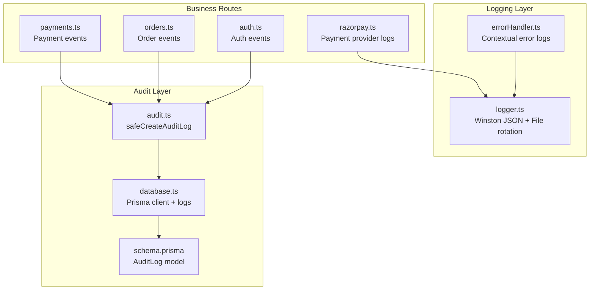
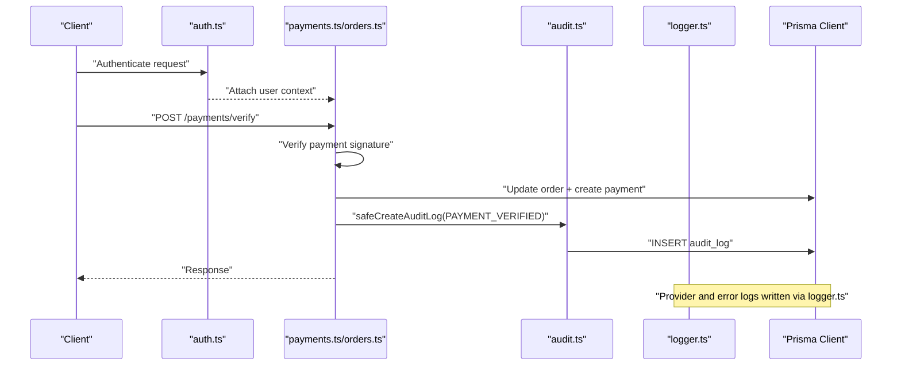
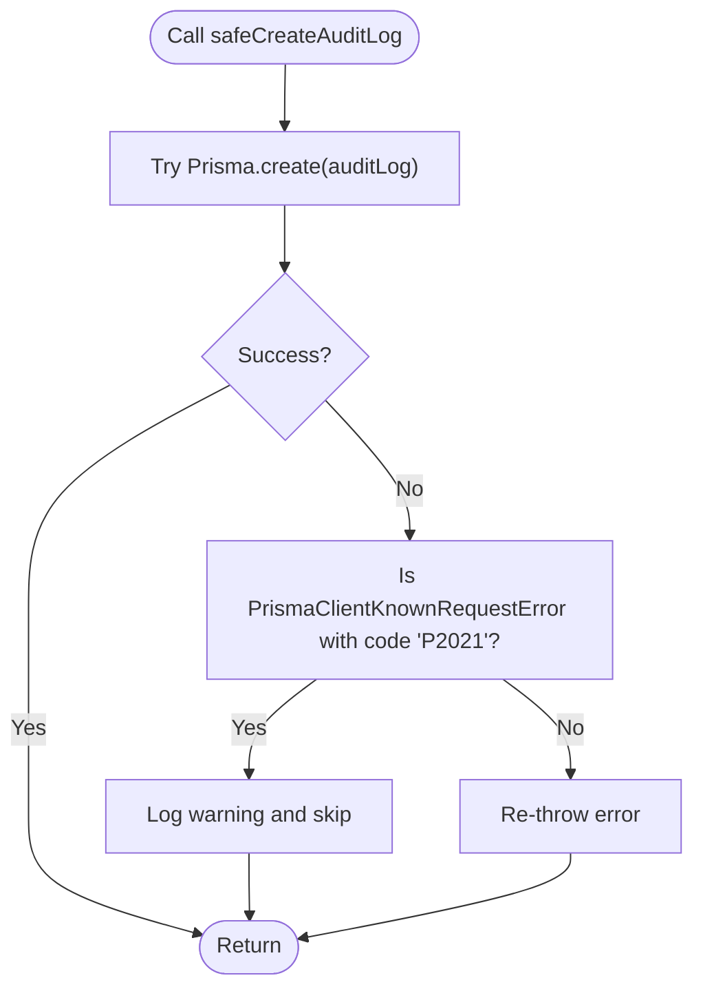
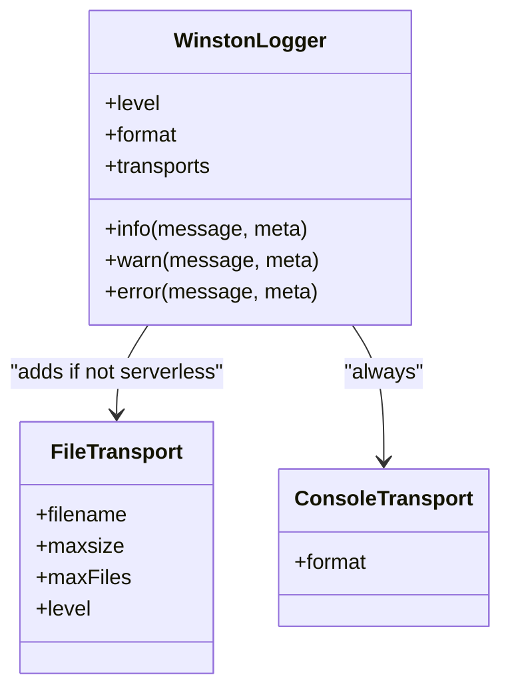
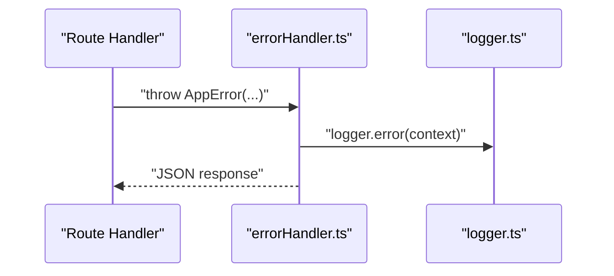
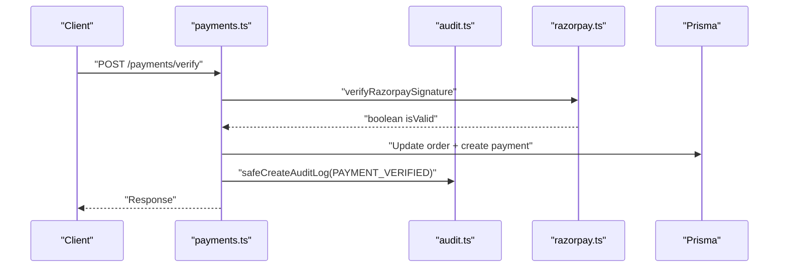
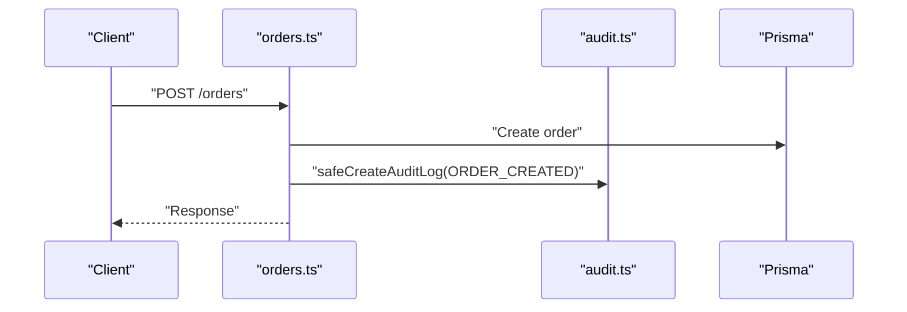
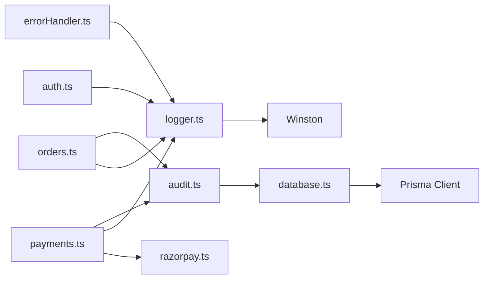

# Audit & Logging

<cite>
**Referenced Files in This Document**
- [audit.ts](file://restaurant-backend/src/utils/audit.ts)
- [logger.ts](file://restaurant-backend/src/utils/logger.ts)
- [errorHandler.ts](file://restaurant-backend/src/middleware/errorHandler.ts)
- [auth.ts](file://restaurant-backend/src/middleware/auth.ts)
- [payments.ts](file://restaurant-backend/src/routes/payments.ts)
- [orders.ts](file://restaurant-backend/src/routes/orders.ts)
- [auth.ts](file://restaurant-backend/src/routes/auth.ts)
- [razorpay.ts](file://restaurant-backend/src/lib/razorpay.ts)
- [database.ts](file://restaurant-backend/src/config/database.ts)
- [schema.prisma](file://restaurant-backend/prisma/schema.prisma)
- [env.d.ts](file://restaurant-backend/src/types/env.d.ts)
- [package.json](file://restaurant-backend/package.json)
- [render.yaml](file://restaurant-backend/render.yaml)
</cite>

## Table of Contents
1. [Introduction](#introduction)
2. [Project Structure](#project-structure)
3. [Core Components](#core-components)
4. [Architecture Overview](#architecture-overview)
5. [Detailed Component Analysis](#detailed-component-analysis)
6. [Dependency Analysis](#dependency-analysis)
7. [Performance Considerations](#performance-considerations)
8. [Troubleshooting Guide](#troubleshooting-guide)
9. [Conclusion](#conclusion)
10. [Appendices](#appendices)

## Introduction
This document describes the audit and logging implementation for DeQ-Bite’s restaurant platform. It explains how user actions, system events, and business transactions are tracked, how structured logs are produced with timestamps and context, and how audit events are persisted safely. It also covers log rotation, retention, secure storage of sensitive data, environment-specific configurations, and practical guidance for querying, compliance reporting, and monitoring.

## Project Structure
The audit and logging system spans several layers:
- Logging infrastructure built on Winston with JSON formatting and file rotation.
- Centralized error handling that enriches logs with contextual request data.
- Audit persistence via Prisma into a dedicated audit_logs table.
- Payment lifecycle hooks that record meaningful audit events.
- Order lifecycle hooks that record state transitions and administrative actions.
- Environment configuration and deployment specifics affecting log behavior.

**Diagram sources**
- [logger.ts:1-56](file://restaurant-backend/src/utils/logger.ts#L1-L56)
- [errorHandler.ts:1-82](file://restaurant-backend/src/middleware/errorHandler.ts#L1-L82)
- [audit.ts:1-17](file://restaurant-backend/src/utils/audit.ts#L1-L17)
- [database.ts:1-66](file://restaurant-backend/src/config/database.ts#L1-L66)
- [schema.prisma:313-324](file://restaurant-backend/prisma/schema.prisma#L313-L324)
- [payments.ts:1-731](file://restaurant-backend/src/routes/payments.ts#L1-L731)
- [orders.ts:1-694](file://restaurant-backend/src/routes/orders.ts#L1-L694)
- [auth.ts:1-390](file://restaurant-backend/src/routes/auth.ts#L1-L390)
- [razorpay.ts:1-219](file://restaurant-backend/src/lib/razorpay.ts#L1-L219)

**Section sources**
- [logger.ts:1-56](file://restaurant-backend/src/utils/logger.ts#L1-L56)
- [errorHandler.ts:1-82](file://restaurant-backend/src/middleware/errorHandler.ts#L1-L82)
- [audit.ts:1-17](file://restaurant-backend/src/utils/audit.ts#L1-L17)
- [database.ts:1-66](file://restaurant-backend/src/config/database.ts#L1-L66)
- [schema.prisma:313-324](file://restaurant-backend/prisma/schema.prisma#L313-L324)
- [payments.ts:1-731](file://restaurant-backend/src/routes/payments.ts#L1-L731)
- [orders.ts:1-694](file://restaurant-backend/src/routes/orders.ts#L1-L694)
- [auth.ts:1-390](file://restaurant-backend/src/routes/auth.ts#L1-L390)
- [razorpay.ts:1-219](file://restaurant-backend/src/lib/razorpay.ts#L1-L219)

## Core Components
- Structured logger with JSON output, timestamps, and contextual enrichment.
- Error handler that logs request context and normalizes error messages per environment.
- Safe audit log writer that tolerates missing audit_logs table until migrations are applied.
- Payment provider integrations that log lifecycle events and security checks.
- Business routes that emit audit events for payment verification, refunds, cash confirmation, and status updates.

Key capabilities:
- Log levels and rotation: Console transport plus rotating files with size limits and file counts.
- Contextual fields: IP, user agent, URL, method, and sanitized stacks in development.
- Audit schema supports actor, restaurant scope, action, entity, and metadata for compliance.

**Section sources**
- [logger.ts:1-56](file://restaurant-backend/src/utils/logger.ts#L1-L56)
- [errorHandler.ts:22-76](file://restaurant-backend/src/middleware/errorHandler.ts#L22-L76)
- [audit.ts:5-16](file://restaurant-backend/src/utils/audit.ts#L5-L16)
- [schema.prisma:313-324](file://restaurant-backend/prisma/schema.prisma#L313-L324)
- [payments.ts:376-388](file://restaurant-backend/src/routes/payments.ts#L376-L388)
- [payments.ts:470-481](file://restaurant-backend/src/routes/payments.ts#L470-L481)
- [payments.ts:619-630](file://restaurant-backend/src/routes/payments.ts#L619-L630)
- [payments.ts:701-712](file://restaurant-backend/src/routes/payments.ts#L701-L712)
- [orders.ts:246-252](file://restaurant-backend/src/routes/orders.ts#L246-L252)
- [razorpay.ts:33-60](file://restaurant-backend/src/lib/razorpay.ts#L33-L60)
- [razorpay.ts:65-105](file://restaurant-backend/src/lib/razorpay.ts#L65-L105)
- [razorpay.ts:110-129](file://restaurant-backend/src/lib/razorpay.ts#L110-L129)
- [razorpay.ts:134-169](file://restaurant-backend/src/lib/razorpay.ts#L134-L169)
- [razorpay.ts:174-195](file://restaurant-backend/src/lib/razorpay.ts#L174-L195)
- [razorpay.ts:198-219](file://restaurant-backend/src/lib/razorpay.ts#L198-L219)

## Architecture Overview
The audit and logging architecture integrates with Express middleware and route handlers to capture:
- Authentication events (login, refresh, profile access).
- Order lifecycle events (creation, modification, cancellation).
- Payment lifecycle events (verification, refund, cash confirmation, status updates).
- Provider interactions (Razorpay order creation, signature verification, capture, refund, fetch, webhook validation).

**Diagram sources**
- [auth.ts:7-75](file://restaurant-backend/src/middleware/auth.ts#L7-L75)
- [payments.ts:294-407](file://restaurant-backend/src/routes/payments.ts#L294-L407)
- [audit.ts:5-16](file://restaurant-backend/src/utils/audit.ts#L5-L16)
- [logger.ts:1-56](file://restaurant-backend/src/utils/logger.ts#L1-L56)
- [database.ts:1-66](file://restaurant-backend/src/config/database.ts#L1-L66)

## Detailed Component Analysis

### Audit Persistence Utility
The audit utility wraps Prisma writes to tolerate missing tables gracefully during early stages of deployment.

**Diagram sources**
- [audit.ts:5-16](file://restaurant-backend/src/utils/audit.ts#L5-L16)

**Section sources**
- [audit.ts:5-16](file://restaurant-backend/src/utils/audit.ts#L5-L16)
- [schema.prisma:313-324](file://restaurant-backend/prisma/schema.prisma#L313-L324)

### Structured Logging with Winston
- JSON format with timestamp and stack traces.
- Console transport always enabled; file transport added unless runtime is serverless.
- Rotating files with fixed size and file count to manage disk usage.
- Environment variable controls default log level.

**Diagram sources**
- [logger.ts:17-48](file://restaurant-backend/src/utils/logger.ts#L17-L48)

**Section sources**
- [logger.ts:1-56](file://restaurant-backend/src/utils/logger.ts#L1-L56)

### Error Handling and Contextual Logs
- Centralized error handler enriches logs with request context in development.
- Normalizes operational vs. internal errors and avoids leaking stack traces in production.
- Uses logger with structured metadata for diagnostics.

**Diagram sources**
- [errorHandler.ts:22-76](file://restaurant-backend/src/middleware/errorHandler.ts#L22-L76)
- [logger.ts:1-56](file://restaurant-backend/src/utils/logger.ts#L1-L56)

**Section sources**
- [errorHandler.ts:22-76](file://restaurant-backend/src/middleware/errorHandler.ts#L22-L76)

### Payment Lifecycle and Audit Events
Payment routes emit audit events for:
- PAYMENT_VERIFIED after successful verification.
- PAYMENT_REFUNDED after refund completion.
- CASH_PAYMENT_CONFIRMED after admin confirms cash payments.
- PAYMENT_STATUS_UPDATED after manual status adjustments.

Provider integrations log:
- Order creation outcomes.
- Signature verification results (with partial signatures).
- Capture and refund operations.
- Payment fetch and webhook validation.

**Diagram sources**
- [payments.ts:294-407](file://restaurant-backend/src/routes/payments.ts#L294-L407)
- [audit.ts:5-16](file://restaurant-backend/src/utils/audit.ts#L5-L16)
- [razorpay.ts:65-105](file://restaurant-backend/src/lib/razorpay.ts#L65-L105)

**Section sources**
- [payments.ts:376-388](file://restaurant-backend/src/routes/payments.ts#L376-L388)
- [payments.ts:470-481](file://restaurant-backend/src/routes/payments.ts#L470-L481)
- [payments.ts:619-630](file://restaurant-backend/src/routes/payments.ts#L619-L630)
- [payments.ts:701-712](file://restaurant-backend/src/routes/payments.ts#L701-L712)
- [razorpay.ts:33-60](file://restaurant-backend/src/lib/razorpay.ts#L33-L60)
- [razorpay.ts:65-105](file://restaurant-backend/src/lib/razorpay.ts#L65-L105)
- [razorpay.ts:110-129](file://restaurant-backend/src/lib/razorpay.ts#L110-L129)
- [razorpay.ts:134-169](file://restaurant-backend/src/lib/razorpay.ts#L134-L169)
- [razorpay.ts:174-195](file://restaurant-backend/src/lib/razorpay.ts#L174-L195)
- [razorpay.ts:198-219](file://restaurant-backend/src/lib/razorpay.ts#L198-L219)

### Order Lifecycle and Audit Events
Order routes emit audit events for:
- New order creation awaiting confirmation.
- Status updates by authorized roles.
- Cancellations with payment safeguards.

**Diagram sources**
- [orders.ts:246-252](file://restaurant-backend/src/routes/orders.ts#L246-L252)
- [audit.ts:5-16](file://restaurant-backend/src/utils/audit.ts#L5-L16)

**Section sources**
- [orders.ts:246-252](file://restaurant-backend/src/routes/orders.ts#L246-L252)
- [orders.ts:581-629](file://restaurant-backend/src/routes/orders.ts#L581-L629)
- [orders.ts:631-691](file://restaurant-backend/src/routes/orders.ts#L631-L691)

### Authentication and Audit Events
Authentication routes support:
- Login and profile access.
- Token refresh.
- Password change.

While not emitting audit logs directly, authentication middleware attaches user context used by downstream audit events.

**Section sources**
- [auth.ts:104-158](file://restaurant-backend/src/routes/auth.ts#L104-L158)
- [auth.ts:375-387](file://restaurant-backend/src/routes/auth.ts#L375-L387)
- [auth.ts:337-373](file://restaurant-backend/src/routes/auth.ts#L337-L373)
- [auth.ts:7-75](file://restaurant-backend/src/middleware/auth.ts#L7-L75)

## Dependency Analysis
- Winston provides structured logging with transports.
- Prisma client persists audit logs and business data.
- Payment provider library logs interactions and security checks.
- Express middleware ensures authenticated context for audit events.

**Diagram sources**
- [logger.ts:1-56](file://restaurant-backend/src/utils/logger.ts#L1-L56)
- [errorHandler.ts:1-82](file://restaurant-backend/src/middleware/errorHandler.ts#L1-L82)
- [audit.ts:1-17](file://restaurant-backend/src/utils/audit.ts#L1-L17)
- [database.ts:1-66](file://restaurant-backend/src/config/database.ts#L1-L66)
- [payments.ts:1-731](file://restaurant-backend/src/routes/payments.ts#L1-L731)
- [orders.ts:1-694](file://restaurant-backend/src/routes/orders.ts#L1-L694)
- [auth.ts:1-390](file://restaurant-backend/src/routes/auth.ts#L1-L390)
- [razorpay.ts:1-219](file://restaurant-backend/src/lib/razorpay.ts#L1-L219)

**Section sources**
- [logger.ts:1-56](file://restaurant-backend/src/utils/logger.ts#L1-L56)
- [audit.ts:1-17](file://restaurant-backend/src/utils/audit.ts#L1-L17)
- [database.ts:1-66](file://restaurant-backend/src/config/database.ts#L1-L66)
- [payments.ts:1-731](file://restaurant-backend/src/routes/payments.ts#L1-L731)
- [orders.ts:1-694](file://restaurant-backend/src/routes/orders.ts#L1-L694)
- [auth.ts:1-390](file://restaurant-backend/src/routes/auth.ts#L1-L390)
- [razorpay.ts:1-219](file://restaurant-backend/src/lib/razorpay.ts#L1-L219)

## Performance Considerations
- Logging overhead: JSON formatting and file I/O are synchronous; keep log volume reasonable and avoid excessive metadata.
- Audit writes: Wrapping Prisma creates in a try/catch prevents audit failures from blocking core flows.
- Prisma logging: Development enables verbose queries; production restricts to warnings and errors to reduce noise.

[No sources needed since this section provides general guidance]

## Troubleshooting Guide
Common scenarios and remedies:
- Missing audit_logs table: The safe writer logs a warning and continues. Run migrations to create the table.
- Filesystem not writable: Logger falls back to console-only logging.
- Production error masking: Operational errors hide stack traces; non-operational errors show generic messages unless explicitly marked operational.
- Payment signature mismatches: Provider logs include partial signatures and lengths for quick diagnostics.

**Section sources**
- [audit.ts:5-16](file://restaurant-backend/src/utils/audit.ts#L5-L16)
- [logger.ts:26-48](file://restaurant-backend/src/utils/logger.ts#L26-L48)
- [errorHandler.ts:67-69](file://restaurant-backend/src/middleware/errorHandler.ts#L67-L69)
- [razorpay.ts:87-94](file://restaurant-backend/src/lib/razorpay.ts#L87-L94)

## Conclusion
DeQ-Bite’s audit and logging system combines structured, contextual logs with a resilient audit persistence layer. It captures critical business events across authentication, orders, and payments, and provides mechanisms to handle missing schema states gracefully. With environment-aware configuration and sensible defaults, the system supports compliance, monitoring, and incident response.

[No sources needed since this section summarizes without analyzing specific files]

## Appendices

### Audit Event Types and Examples
- Authentication
  - Action: LOGIN_SUCCESS
  - Metadata: user id, timestamp, device info (via request context)
  - Example path: [auth.ts:104-158](file://restaurant-backend/src/routes/auth.ts#L104-L158)

- Order Modifications
  - Action: ORDER_CREATED
  - Metadata: restaurant id, table id, items count, subtotal, tax, total
  - Example path: [orders.ts:246-252](file://restaurant-backend/src/routes/orders.ts#L246-L252)

- Payment Processing
  - Action: PAYMENT_VERIFIED
  - Metadata: amount paid now, payment status, due amount, provider payment id
  - Example path: [payments.ts:376-388](file://restaurant-backend/src/routes/payments.ts#L376-L388)

- Payment Refunds
  - Action: PAYMENT_REFUNDED
  - Metadata: refund amount, refund id, reason
  - Example path: [payments.ts:470-481](file://restaurant-backend/src/routes/payments.ts#L470-L481)

- Cash Payments
  - Action: CASH_PAYMENT_CONFIRMED
  - Metadata: amount added, payment status, due amount
  - Example path: [payments.ts:619-630](file://restaurant-backend/src/routes/payments.ts#L619-L630)

- Administrative Actions
  - Action: PAYMENT_STATUS_UPDATED
  - Metadata: target status, paid amount, due amount
  - Example path: [payments.ts:701-712](file://restaurant-backend/src/routes/payments.ts#L701-L712)

- Provider Interactions
  - Action: RAZORPAY_ORDER_CREATED, SIGNATURE_VERIFIED, PAYMENT_CAPTURED, PAYMENT_REFUNDED, PAYMENT_DETAILS_FETCHED, WEBHOOK_VALIDATED
  - Metadata: ids, amounts, durations, validity flags
  - Example paths: [razorpay.ts:33-60](file://restaurant-backend/src/lib/razorpay.ts#L33-L60), [razorpay.ts:65-105](file://restaurant-backend/src/lib/razorpay.ts#L65-L105), [razorpay.ts:110-129](file://restaurant-backend/src/lib/razorpay.ts#L110-L129), [razorpay.ts:134-169](file://restaurant-backend/src/lib/razorpay.ts#L134-L169), [razorpay.ts:174-195](file://restaurant-backend/src/lib/razorpay.ts#L174-L195), [razorpay.ts:198-219](file://restaurant-backend/src/lib/razorpay.ts#L198-L219)

### Log Levels and Rotation
- Levels: Controlled by LOG_LEVEL environment variable; default info.
- Rotation: File transport configured with max size and max files; serverless runtimes disable file transport automatically.
- Context: Development logs include stack traces and request context; production suppresses stack traces.

**Section sources**
- [logger.ts:14-16](file://restaurant-backend/src/utils/logger.ts#L14-L16)
- [logger.ts:32-44](file://restaurant-backend/src/utils/logger.ts#L32-L44)
- [errorHandler.ts:30-46](file://restaurant-backend/src/middleware/errorHandler.ts#L30-L46)

### Secure Storage and Sensitive Data Handling
- Sensitive fields in logs: Signature hashes are truncated to first 10 characters; personal data is excluded from production logs.
- Audit data: Stored in the audit_logs table with actor, restaurant scope, action, entity, and metadata.

**Section sources**
- [razorpay.ts:79-85](file://restaurant-backend/src/lib/razorpay.ts#L79-L85)
- [errorHandler.ts:67-69](file://restaurant-backend/src/middleware/errorHandler.ts#L67-L69)
- [schema.prisma:313-324](file://restaurant-backend/prisma/schema.prisma#L313-L324)

### Logging Configuration Across Environments
- Development: Verbose Prisma logs, colored console, detailed error context.
- Staging/Production: Minimal Prisma logs, file rotation, environment-controlled log level.
- Deployment: Render sets NODE_ENV=production and port; ensure LOG_LEVEL and other environment variables are set appropriately.

**Section sources**
- [database.ts:5-9](file://restaurant-backend/src/config/database.ts#L5-L9)
- [logger.ts:14](file://restaurant-backend/src/utils/logger.ts#L14)
- [render.yaml:7-11](file://restaurant-backend/render.yaml#L7-L11)
- [env.d.ts:27](file://restaurant-backend/src/types/env.d.ts#L27)

### Log Aggregation and Compliance Reporting
- Local aggregation: Combine console and rotated files; ship to centralized logging systems (e.g., ELK, Loki, CloudWatch) using standard agents.
- Compliance: Retain audit logs per policy; export audit_logs for periodic reports; mask or redact sensitive fields.
- Alerting: Monitor error rate spikes, audit gaps (missing table), and provider anomalies (signature mismatches, refund failures).

[No sources needed since this section provides general guidance]

### Practical Queries and Dashboards
- Query examples (conceptual):
  - Count payment verifications per day: group by date and action.
  - Top 10 restaurants by refund volume: filter by action and sum amounts.
  - Signature mismatch incidents: filter provider logs with invalid signatures.
- Dashboard ideas:
  - Real-time payment throughput and error rates.
  - Audit trail drill-down by user or restaurant.
  - Provider health metrics (latency, success rate).

[No sources needed since this section provides general guidance]