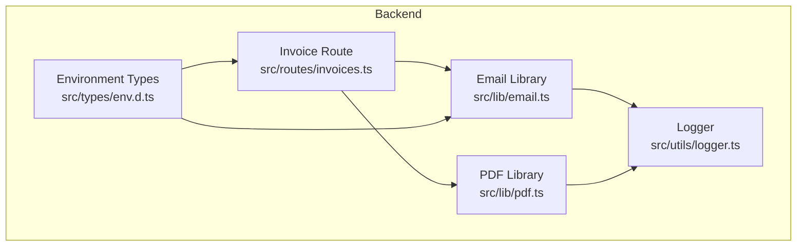
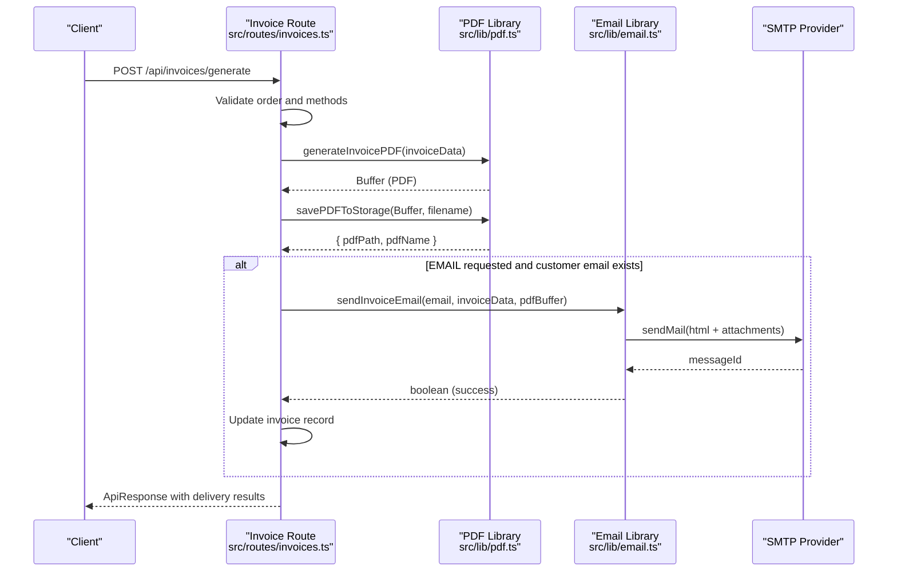
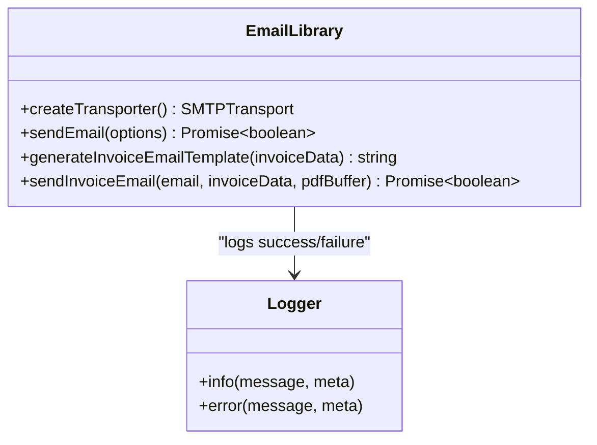
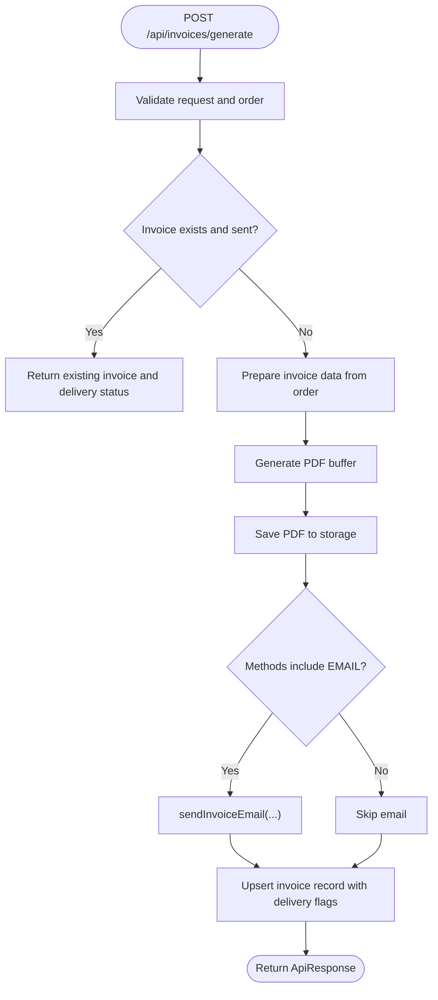
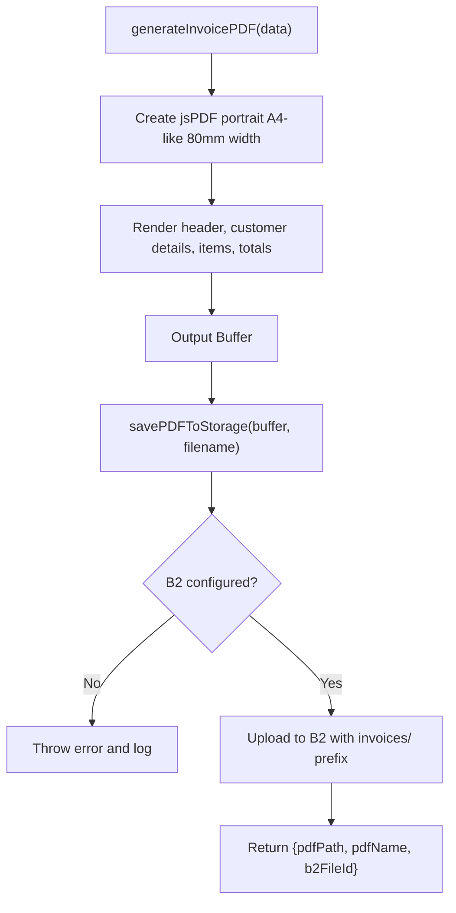
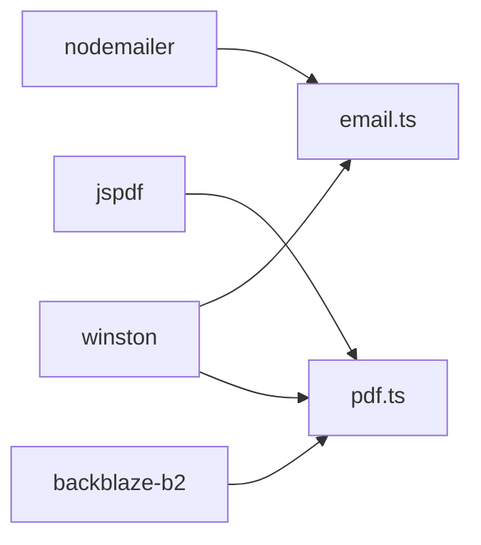

# Email Service

<cite>
**Referenced Files in This Document**
- [email.ts](file://restaurant-backend/src/lib/email.ts)
- [invoices.ts](file://restaurant-backend/src/routes/invoices.ts)
- [pdf.ts](file://restaurant-backend/src/lib/pdf.ts)
- [env.d.ts](file://restaurant-backend/src/types/env.d.ts)
- [logger.ts](file://restaurant-backend/src/utils/logger.ts)
- [package.json](file://restaurant-backend/package.json)
</cite>

## Table of Contents
1. [Introduction](#introduction)
2. [Project Structure](#project-structure)
3. [Core Components](#core-components)
4. [Architecture Overview](#architecture-overview)
5. [Detailed Component Analysis](#detailed-component-analysis)
6. [Dependency Analysis](#dependency-analysis)
7. [Performance Considerations](#performance-considerations)
8. [Troubleshooting Guide](#troubleshooting-guide)
9. [Conclusion](#conclusion)
10. [Appendices](#appendices)

## Introduction
This document describes the email delivery system used by DeQ-Bite’s restaurant backend. It covers Nodemailer integration, SMTP configuration, email template management, invoice email generation with PDF attachments, and the end-to-end workflow for order-related email delivery. It also documents error handling, security considerations, and operational guidance for providers such as Gmail, Outlook, and custom SMTP setups.

## Project Structure
The email service is implemented as a focused library module and integrated into the invoice generation workflow. The relevant parts of the backend are organized as follows:
- Email transport and templates: src/lib/email.ts
- Invoice generation and email dispatch: src/routes/invoices.ts
- PDF generation and storage: src/lib/pdf.ts
- Environment variable typing: src/types/env.d.ts
- Logging infrastructure: src/utils/logger.ts
- Dependencies: restaurant-backend/package.json

**Diagram sources**
- [email.ts:1-227](file://restaurant-backend/src/lib/email.ts#L1-L227)
- [invoices.ts:1-599](file://restaurant-backend/src/routes/invoices.ts#L1-L599)
- [pdf.ts:1-334](file://restaurant-backend/src/lib/pdf.ts#L1-L334)
- [logger.ts:1-56](file://restaurant-backend/src/utils/logger.ts#L1-L56)
- [env.d.ts:1-40](file://restaurant-backend/src/types/env.d.ts#L1-L40)

**Section sources**
- [email.ts:1-227](file://restaurant-backend/src/lib/email.ts#L1-L227)
- [invoices.ts:1-599](file://restaurant-backend/src/routes/invoices.ts#L1-L599)
- [pdf.ts:1-334](file://restaurant-backend/src/lib/pdf.ts#L1-L334)
- [env.d.ts:1-40](file://restaurant-backend/src/types/env.d.ts#L1-L40)
- [logger.ts:1-56](file://restaurant-backend/src/utils/logger.ts#L1-L56)
- [package.json:1-82](file://restaurant-backend/package.json#L1-L82)

## Core Components
- SMTP Transport: Creates a Nodemailer transport using environment variables for host, port, and credentials.
- Email Sending: Wraps Nodemailer sendMail with structured logging and error handling.
- Invoice Email Template: Generates a styled HTML invoice email tailored for customer delivery.
- Invoice Email Dispatch: Orchestrates PDF generation, storage, and email sending via the email library.
- Logging: Centralized Winston logger for success and error events.

Key responsibilities:
- Transport creation and reuse per send operation.
- Robust error handling with structured logs.
- Template rendering for invoices with embedded styles.
- Attachment handling for PDF buffers.
- Integration with invoice workflow for order completion.

**Section sources**
- [email.ts:5-15](file://restaurant-backend/src/lib/email.ts#L5-L15)
- [email.ts:31-61](file://restaurant-backend/src/lib/email.ts#L31-L61)
- [email.ts:66-195](file://restaurant-backend/src/lib/email.ts#L66-L195)
- [email.ts:200-227](file://restaurant-backend/src/lib/email.ts#L200-L227)
- [invoices.ts:146-159](file://restaurant-backend/src/routes/invoices.ts#L146-L159)
- [pdf.ts:47-197](file://restaurant-backend/src/lib/pdf.ts#L47-L197)

## Architecture Overview
The email service integrates with the invoice generation pipeline. When an order reaches a completed payment state, the system generates a PDF invoice, stores it, and optionally emails it to the customer with the PDF attached.

**Diagram sources**
- [invoices.ts:22-241](file://restaurant-backend/src/routes/invoices.ts#L22-L241)
- [pdf.ts:47-236](file://restaurant-backend/src/lib/pdf.ts#L47-L236)
- [email.ts:200-227](file://restaurant-backend/src/lib/email.ts#L200-L227)

## Detailed Component Analysis

### Email Library
The email library encapsulates SMTP transport creation and email sending with robust error handling and logging.

**Diagram sources**
- [email.ts:5-15](file://restaurant-backend/src/lib/email.ts#L5-L15)
- [email.ts:31-61](file://restaurant-backend/src/lib/email.ts#L31-L61)
- [email.ts:66-195](file://restaurant-backend/src/lib/email.ts#L66-L195)
- [email.ts:200-227](file://restaurant-backend/src/lib/email.ts#L200-L227)
- [logger.ts:50-56](file://restaurant-backend/src/utils/logger.ts#L50-L56)

Key behaviors:
- Transport configuration reads SMTP_HOST, SMTP_PORT, SMTP_USER, SMTP_PASS, and sets secure mode when port 465 is used.
- sendEmail constructs mail options with from address derived from APP_NAME and SMTP_USER, and attaches optional PDF buffers.
- generateInvoiceEmailTemplate produces a responsive HTML invoice with styling and placeholders for dynamic data.
- sendInvoiceEmail composes subject and HTML, then sends with a single PDF attachment.

Operational notes:
- No built-in retry mechanism; failures return false and are logged.
- Delivery tracking relies on returned messageId and logging metadata.

**Section sources**
- [email.ts:5-15](file://restaurant-backend/src/lib/email.ts#L5-L15)
- [email.ts:31-61](file://restaurant-backend/src/lib/email.ts#L31-L61)
- [email.ts:66-195](file://restaurant-backend/src/lib/email.ts#L66-L195)
- [email.ts:200-227](file://restaurant-backend/src/lib/email.ts#L200-L227)
- [logger.ts:50-56](file://restaurant-backend/src/utils/logger.ts#L50-L56)

### Invoice Route Integration
The invoice route coordinates PDF generation, storage, and optional email/SMS delivery upon order completion.

**Diagram sources**
- [invoices.ts:22-241](file://restaurant-backend/src/routes/invoices.ts#L22-L241)

Operational highlights:
- Only proceeds for orders with completed payments.
- Supports optional SMS alongside email via the same route.
- Tracks delivery results and warns about missing addresses or failed deliveries.

**Section sources**
- [invoices.ts:22-241](file://restaurant-backend/src/routes/invoices.ts#L22-L241)
- [invoices.ts:328-454](file://restaurant-backend/src/routes/invoices.ts#L328-L454)

### PDF Generation and Storage
PDFs are generated from invoice data and stored in Backblaze B2, returning a public URL for retrieval.

**Diagram sources**
- [pdf.ts:47-197](file://restaurant-backend/src/lib/pdf.ts#L47-L197)
- [pdf.ts:201-236](file://restaurant-backend/src/lib/pdf.ts#L201-L236)

**Section sources**
- [pdf.ts:47-197](file://restaurant-backend/src/lib/pdf.ts#L47-L197)
- [pdf.ts:201-236](file://restaurant-backend/src/lib/pdf.ts#L201-L236)

## Dependency Analysis
External libraries and their roles:
- nodemailer: SMTP transport and email sending.
- jspdf: PDF invoice generation.
- backblaze-b2: Cloud storage for invoices.
- winston: Structured logging.

**Diagram sources**
- [package.json:37-44](file://restaurant-backend/package.json#L37-L44)
- [email.ts](file://restaurant-backend/src/lib/email.ts#L1)
- [pdf.ts](file://restaurant-backend/src/lib/pdf.ts#L1)

**Section sources**
- [package.json:18-45](file://restaurant-backend/package.json#L18-L45)
- [email.ts](file://restaurant-backend/src/lib/email.ts#L1)
- [pdf.ts](file://restaurant-backend/src/lib/pdf.ts#L1)

## Performance Considerations
- Synchronous PDF generation and email sending occur during request handling. For high-volume scenarios, consider offloading to a background job queue (e.g., BullMQ, SQS) with retries and exponential backoff.
- Attachments are buffered in memory; large PDFs increase memory usage. Streaming attachments or pre-stored URLs could reduce memory footprint.
- Rate limiting at the application level can be introduced using express-rate-limit to protect external SMTP providers from bursts.

[No sources needed since this section provides general guidance]

## Troubleshooting Guide
Common issues and resolutions:
- Invalid SMTP credentials or host/port:
  - Verify SMTP_HOST, SMTP_PORT, SMTP_USER, SMTP_PASS, and secure mode alignment with port 465.
  - Check APP_NAME for sender display formatting.
- Email delivery fails:
  - Inspect logs for error entries with context (to, subject, error message).
  - Confirm the recipient address is valid and provider accepts the from address format.
- Missing PDF attachment:
  - Ensure PDF generation succeeds and storage upload completes; review storage configuration and permissions.
- Warning messages:
  - “Email delivery skipped: No email address available” indicates missing user email.
  - “Email delivery failed: Please check email configuration” indicates transport or authentication errors.

Operational checks:
- Environment variables: Ensure all SMTP and application variables are set according to env.d.ts.
- Logging: Review Winston logs for messageId and error stacks.

**Section sources**
- [env.d.ts:12-28](file://restaurant-backend/src/types/env.d.ts#L12-L28)
- [logger.ts:50-56](file://restaurant-backend/src/utils/logger.ts#L50-L56)
- [invoices.ts:571-596](file://restaurant-backend/src/routes/invoices.ts#L571-L596)
- [email.ts:52-61](file://restaurant-backend/src/lib/email.ts#L52-L61)

## Conclusion
DeQ-Bite’s email service leverages Nodemailer for reliable SMTP delivery, integrates PDF invoice generation and storage, and provides a clear invoice workflow with optional email/SMS delivery. While the current implementation focuses on synchronous request handling, adopting asynchronous queues and rate limiting will improve scalability and resilience for production workloads.

[No sources needed since this section summarizes without analyzing specific files]

## Appendices

### SMTP Configuration Options
Supported environment variables:
- SMTP_HOST: SMTP server hostname.
- SMTP_PORT: Port number (587 typical; 465 requires secure=true).
- SMTP_USER: Sender email address.
- SMTP_PASS: Password or app-specific password.
- APP_NAME: Display name used in the From header.

Provider examples:
- Gmail:
  - Host: smtp.gmail.com
  - Port: 465 (secure) or 587
  - Requires app-specific passwords or OAuth2 configuration outside this module.
- Outlook/Hotmail:
  - Host: smtp-mail.outlook.com
  - Port: 587
- Custom SMTP:
  - Configure host, port, and credentials accordingly.

Security notes:
- Store credentials in environment variables; avoid committing secrets.
- Prefer app-specific passwords or OAuth2 where supported by providers.
- Limit exposure by disabling less secure options on provider accounts.

**Section sources**
- [email.ts:5-15](file://restaurant-backend/src/lib/email.ts#L5-L15)
- [env.d.ts:12-18](file://restaurant-backend/src/types/env.d.ts#L12-L18)

### Email Formatting and Templates
- HTML template: The invoice template is generated dynamically with inline styles and placeholders for customer, order, and restaurant details.
- Attachments: PDF buffer is attached as application/pdf with a filename derived from the invoice number.

Usage references:
- Template generation: [generateInvoiceEmailTemplate:66-195](file://restaurant-backend/src/lib/email.ts#L66-L195)
- Email dispatch with attachment: [sendInvoiceEmail:200-227](file://restaurant-backend/src/lib/email.ts#L200-L227)

**Section sources**
- [email.ts:66-195](file://restaurant-backend/src/lib/email.ts#L66-L195)
- [email.ts:200-227](file://restaurant-backend/src/lib/email.ts#L200-L227)

### Delivery Tracking and Monitoring
- Success tracking: messageId is logged on successful send.
- Failure tracking: Errors are logged with contextual metadata.
- Monitoring suggestions:
  - Aggregate logs by service and level.
  - Alert on sustained failure rates or repeated authentication errors.
  - Track delivery results in the invoice record for auditing.

**Section sources**
- [email.ts:45-49](file://restaurant-backend/src/lib/email.ts#L45-L49)
- [email.ts:52-57](file://restaurant-backend/src/lib/email.ts#L52-L57)
- [invoices.ts:205-211](file://restaurant-backend/src/routes/invoices.ts#L205-L211)