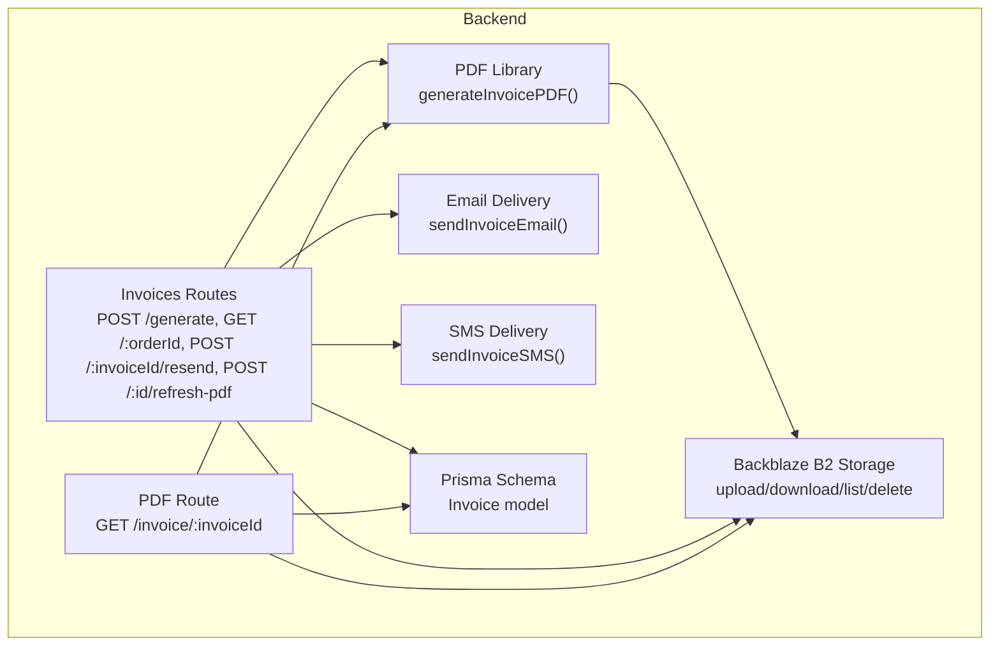
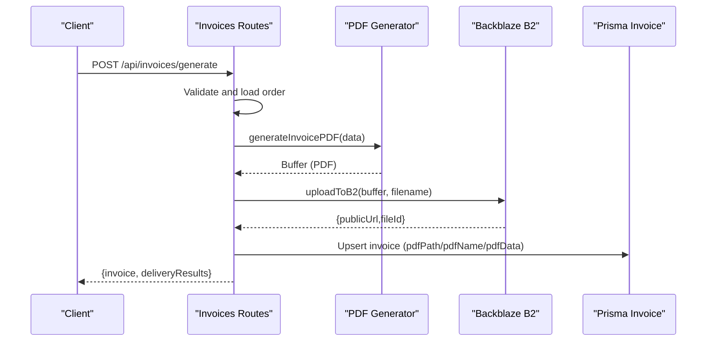
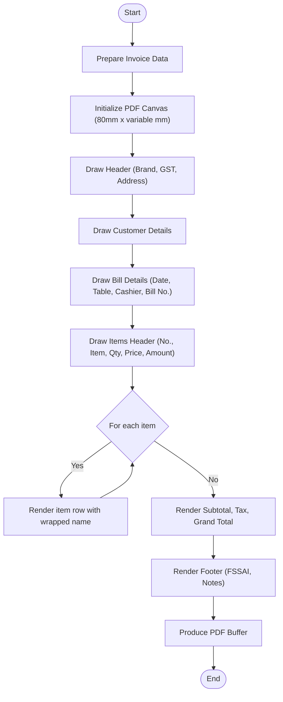
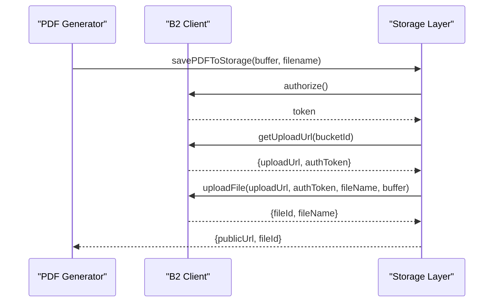
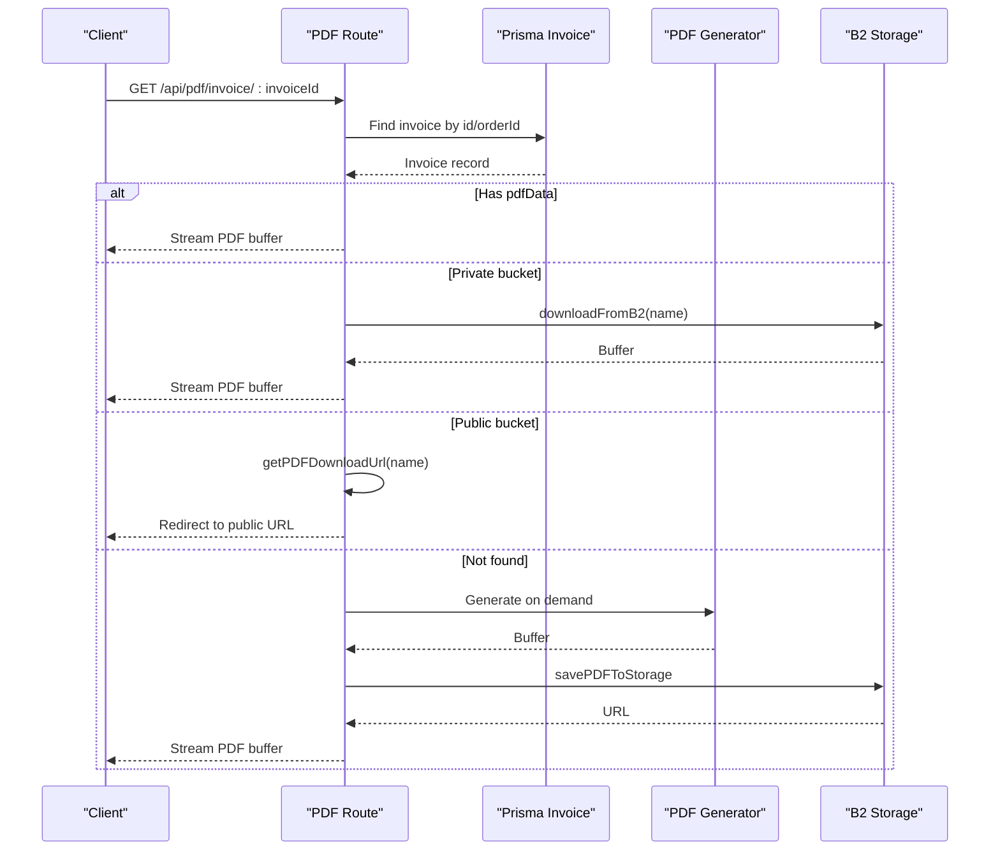
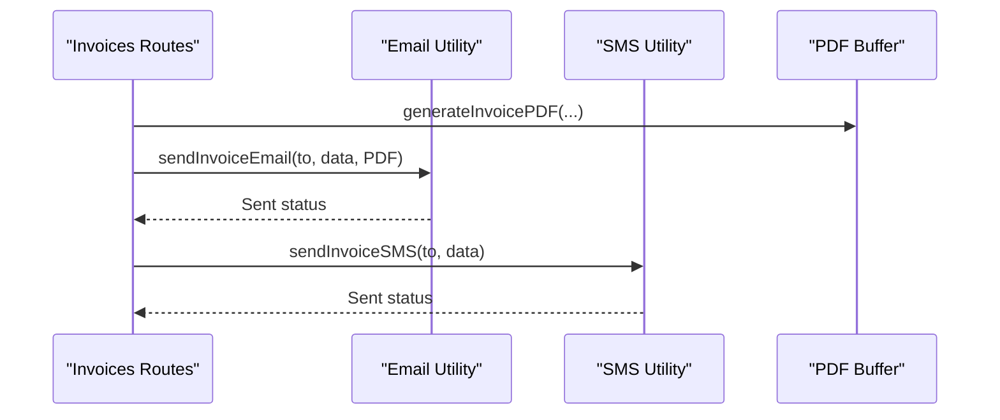
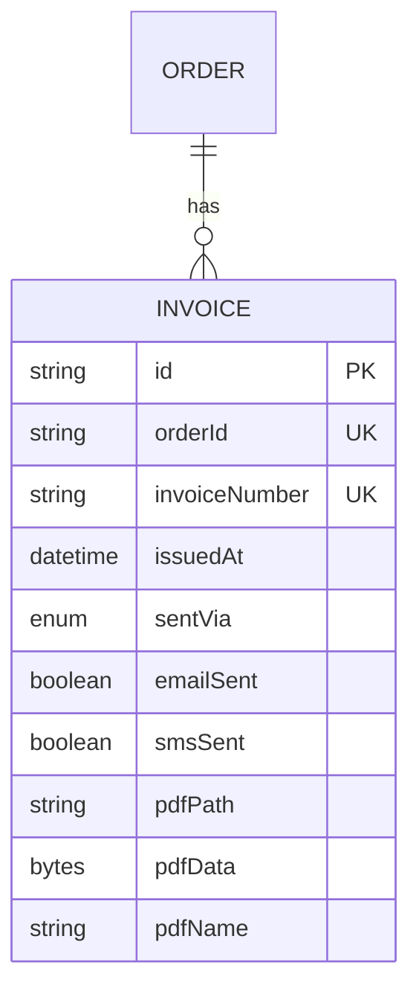
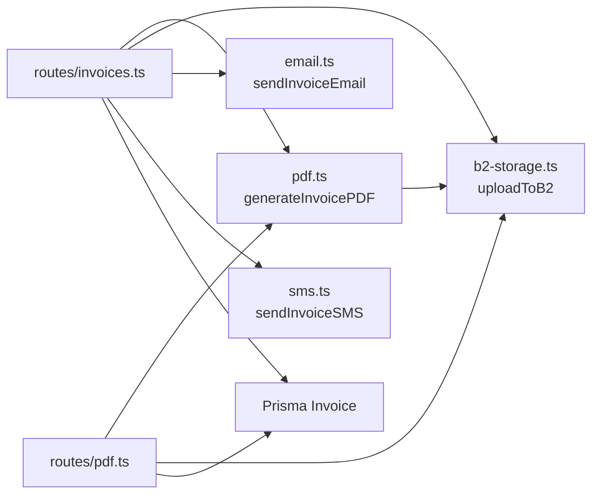

# PDF Generation

<cite>
**Referenced Files in This Document**
- [pdf.ts](file://restaurant-backend/src/lib/pdf.ts)
- [b2-storage.ts](file://restaurant-backend/src/lib/b2-storage.ts)
- [pdf.ts](file://restaurant-backend/src/routes/pdf.ts)
- [invoices.ts](file://restaurant-backend/src/routes/invoices.ts)
- [email.ts](file://restaurant-backend/src/lib/email.ts)
- [sms.ts](file://restaurant-backend/src/lib/sms.ts)
- [schema.prisma](file://restaurant-backend/prisma/schema.prisma)
- [package.json](file://restaurant-backend/package.json)
- [env.d.ts](file://restaurant-backend/src/types/env.d.ts)
- [orders.ts](file://restaurant-backend/src/routes/orders.ts)
</cite>

## Table of Contents
1. [Introduction](#introduction)
2. [Project Structure](#project-structure)
3. [Core Components](#core-components)
4. [Architecture Overview](#architecture-overview)
5. [Detailed Component Analysis](#detailed-component-analysis)
6. [Dependency Analysis](#dependency-analysis)
7. [Performance Considerations](#performance-considerations)
8. [Troubleshooting Guide](#troubleshooting-guide)
9. [Conclusion](#conclusion)
10. [Appendices](#appendices)

## Introduction
This document explains the PDF generation system for DeQ-Bite’s restaurant invoicing and document workflows. It covers how invoices are created using a PDF library, styled for POS receipt-like output, integrated with Backblaze B2 for storage and retrieval, and delivered via email and SMS. It also documents the data preparation pipeline, template rendering, file output, storage considerations, and operational guidance for versioning and archival.

## Project Structure
The PDF generation capability spans several modules:
- PDF generation and storage orchestration
- Backblaze B2 integration
- Invoice route handlers for generation, retrieval, and refresh
- Email and SMS delivery utilities
- Prisma schema for invoice persistence
- Environment configuration for cloud storage and third-party services

**Diagram sources**
- [pdf.ts:47-197](file://restaurant-backend/src/lib/pdf.ts#L47-L197)
- [b2-storage.ts:76-122](file://restaurant-backend/src/lib/b2-storage.ts#L76-L122)
- [invoices.ts:21-241](file://restaurant-backend/src/routes/invoices.ts#L21-L241)
- [pdf.ts:11-211](file://restaurant-backend/src/routes/pdf.ts#L11-L211)
- [email.ts:200-227](file://restaurant-backend/src/lib/email.ts#L200-L227)
- [sms.ts:89-104](file://restaurant-backend/src/lib/sms.ts#L89-L104)
- [schema.prisma:208-222](file://restaurant-backend/prisma/schema.prisma#L208-L222)

**Section sources**
- [pdf.ts:1-334](file://restaurant-backend/src/lib/pdf.ts#L1-L334)
- [b2-storage.ts:1-335](file://restaurant-backend/src/lib/b2-storage.ts#L1-L335)
- [invoices.ts:1-599](file://restaurant-backend/src/routes/invoices.ts#L1-L599)
- [pdf.ts:1-214](file://restaurant-backend/src/routes/pdf.ts#L1-L214)
- [email.ts:1-227](file://restaurant-backend/src/lib/email.ts#L1-L227)
- [sms.ts:1-131](file://restaurant-backend/src/lib/sms.ts#L1-L131)
- [schema.prisma:208-222](file://restaurant-backend/prisma/schema.prisma#L208-L222)
- [package.json:18-45](file://restaurant-backend/package.json#L18-L45)
- [env.d.ts:29-36](file://restaurant-backend/src/types/env.d.ts#L29-L36)

## Core Components
- PDF generation engine: Creates invoice PDFs with a fixed 80mm width and dynamic height based on content. It renders restaurant branding, customer and order details, itemized products, taxes, and totals.
- Storage integration: Uploads generated PDFs to Backblaze B2 under an organized folder, supports signed URLs for private buckets, and provides listing and deletion utilities.
- Invoice routes: Handles invoice generation, retrieval, resend, and refresh operations, including on-demand regeneration when needed.
- Delivery utilities: Sends invoice emails with PDF attachments and SMS notifications.
- Persistence: Stores invoice metadata (including PDF path/name/data) in the database for later retrieval and delivery.

**Section sources**
- [pdf.ts:47-197](file://restaurant-backend/src/lib/pdf.ts#L47-L197)
- [b2-storage.ts:76-122](file://restaurant-backend/src/lib/b2-storage.ts#L76-L122)
- [invoices.ts:21-241](file://restaurant-backend/src/routes/invoices.ts#L21-L241)
- [pdf.ts:11-211](file://restaurant-backend/src/routes/pdf.ts#L11-L211)
- [email.ts:200-227](file://restaurant-backend/src/lib/email.ts#L200-L227)
- [sms.ts:89-104](file://restaurant-backend/src/lib/sms.ts#L89-L104)
- [schema.prisma:208-222](file://restaurant-backend/prisma/schema.prisma#L208-L222)

## Architecture Overview
The PDF generation pipeline follows a clear flow:
- Data preparation: Extract order details and compute totals.
- Template rendering: Use jspdf to draw header, customer/order details, items, taxes, and totals.
- File output: Produce a PDF buffer.
- Storage: Upload to B2 and persist metadata in the database.
- Retrieval: Serve PDF via direct URL (public), signed URL (private), or on-demand regeneration.

**Diagram sources**
- [invoices.ts:21-241](file://restaurant-backend/src/routes/invoices.ts#L21-L241)
- [pdf.ts:47-197](file://restaurant-backend/src/lib/pdf.ts#L47-L197)
- [b2-storage.ts:76-122](file://restaurant-backend/src/lib/b2-storage.ts#L76-L122)
- [schema.prisma:208-222](file://restaurant-backend/prisma/schema.prisma#L208-L222)

## Detailed Component Analysis

### PDF Generation Engine
- Purpose: Render a compact, receipt-style invoice using a PDF toolkit.
- Inputs: Structured invoice data (customer, order date, items, totals, restaurant info).
- Rendering: Uses a monospace-friendly layout with fixed column widths and wrapping for long item names.
- Output: Binary buffer suitable for immediate streaming or storage.

**Diagram sources**
- [pdf.ts:47-197](file://restaurant-backend/src/lib/pdf.ts#L47-L197)

**Section sources**
- [pdf.ts:16-197](file://restaurant-backend/src/lib/pdf.ts#L16-L197)

### Backblaze B2 Storage Integration
- Upload: Accepts a buffer and filename, returns public URL and file metadata.
- Download: Retrieves a PDF buffer by filename.
- Signed URLs: Generates time-limited access tokens for private buckets.
- Listing and Cleanup: Lists files with a prefix and deletes old files based on age.
- Configuration: Requires application keys, bucket ID or name, and optional custom domain.

**Diagram sources**
- [b2-storage.ts:76-122](file://restaurant-backend/src/lib/b2-storage.ts#L76-L122)

**Section sources**
- [b2-storage.ts:1-335](file://restaurant-backend/src/lib/b2-storage.ts#L1-L335)

### Invoice Routes: Generation, Retrieval, Resend, Refresh
- POST /api/invoices/generate: Validates order, prepares invoice data, generates PDF, uploads to B2, updates DB, optionally emails/SMS.
- GET /api/invoices/:orderId: Returns invoice metadata for a given order.
- POST /api/invoices/:invoiceId/resend: Resends invoice via email/SMS using stored or regenerated PDF.
- POST /api/invoices/:invoiceOrOrderId/refresh-pdf: Regenerates and re-uploads PDF, updates DB.
- GET /api/pdf/invoice/:invoiceId: Serves PDF directly or redirects to B2 depending on privacy and availability.

**Diagram sources**
- [pdf.ts:11-211](file://restaurant-backend/src/routes/pdf.ts#L11-L211)

**Section sources**
- [invoices.ts:21-599](file://restaurant-backend/src/routes/invoices.ts#L21-L599)
- [pdf.ts:11-211](file://restaurant-backend/src/routes/pdf.ts#L11-L211)

### Email and SMS Delivery Utilities
- Email: Builds HTML templates and attaches PDF buffers for invoice delivery.
- SMS: Sends SMS notifications via a third-party provider with configurable sender number.

**Diagram sources**
- [email.ts:200-227](file://restaurant-backend/src/lib/email.ts#L200-L227)
- [sms.ts:89-104](file://restaurant-backend/src/lib/sms.ts#L89-L104)
- [invoices.ts:145-172](file://restaurant-backend/src/routes/invoices.ts#L145-L172)

**Section sources**
- [email.ts:1-227](file://restaurant-backend/src/lib/email.ts#L1-L227)
- [sms.ts:1-131](file://restaurant-backend/src/lib/sms.ts#L1-L131)
- [invoices.ts:145-172](file://restaurant-backend/src/routes/invoices.ts#L145-L172)

### Data Model: Invoice Persistence
- Fields include order linkage, invoice number, issuance timestamp, delivery channels, and PDF metadata (path/name/data).
- Supports efficient retrieval and auditing of invoice lifecycle.

**Diagram sources**
- [schema.prisma:208-222](file://restaurant-backend/prisma/schema.prisma#L208-L222)

**Section sources**
- [schema.prisma:208-222](file://restaurant-backend/prisma/schema.prisma#L208-L222)

## Dependency Analysis
- PDF generation depends on a PDF toolkit and uses a fixed-page layout optimized for receipt printing.
- Storage relies on Backblaze B2 SDK and environment configuration for credentials and bucket selection.
- Delivery utilities depend on external services (SMTP for email, a messaging provider for SMS).
- Routes orchestrate data preparation, PDF generation, storage, and persistence.

**Diagram sources**
- [pdf.ts:47-197](file://restaurant-backend/src/lib/pdf.ts#L47-L197)
- [b2-storage.ts:76-122](file://restaurant-backend/src/lib/b2-storage.ts#L76-L122)
- [invoices.ts:21-241](file://restaurant-backend/src/routes/invoices.ts#L21-L241)
- [pdf.ts:11-211](file://restaurant-backend/src/routes/pdf.ts#L11-L211)
- [email.ts:200-227](file://restaurant-backend/src/lib/email.ts#L200-L227)
- [sms.ts:89-104](file://restaurant-backend/src/lib/sms.ts#L89-L104)
- [schema.prisma:208-222](file://restaurant-backend/prisma/schema.prisma#L208-L222)

**Section sources**
- [package.json:18-45](file://restaurant-backend/package.json#L18-L45)
- [env.d.ts:29-36](file://restaurant-backend/src/types/env.d.ts#L29-L36)

## Performance Considerations
- PDF generation cost: Drawing many rows increases rendering time; keep item lists concise and avoid excessive wrapping.
- Storage throughput: Batch operations should reuse B2 upload URLs and minimize repeated authorizations.
- Memory usage: Large PDF buffers can increase memory pressure; stream where possible and avoid holding multiple buffers simultaneously.
- Network latency: Signed URL generation and B2 downloads add latency; cache signed URLs per session when feasible.
- Compression: Consider enabling server-side compression for PDF responses if bandwidth is constrained.

[No sources needed since this section provides general guidance]

## Troubleshooting Guide
Common issues and resolutions:
- PDF generation failure: Check input data completeness and logging output from the generator. Ensure required fields are present.
- Storage upload errors: Verify B2 credentials and bucket configuration; confirm bucket ID/name and custom domain settings.
- Download/URL generation failures: For private buckets, ensure signed URL generation succeeds; for public buckets, confirm public URL construction.
- Access control: When retrieving PDFs, ensure proper authentication and ownership checks; fallback to on-demand generation if storage fails.
- Delivery failures: Validate SMTP and messaging provider credentials; handle partial delivery scenarios gracefully.

**Section sources**
- [pdf.ts:189-196](file://restaurant-backend/src/lib/pdf.ts#L189-L196)
- [b2-storage.ts:115-121](file://restaurant-backend/src/lib/b2-storage.ts#L115-L121)
- [pdf.ts:115-146](file://restaurant-backend/src/routes/pdf.ts#L115-L146)
- [email.ts:52-61](file://restaurant-backend/src/lib/email.ts#L52-L61)
- [sms.ts:58-66](file://restaurant-backend/src/lib/sms.ts#L58-L66)

## Conclusion
DeQ-Bite’s PDF generation system combines a straightforward receipt-style template with robust cloud storage and delivery mechanisms. It supports on-demand generation, persistent storage, and flexible retrieval strategies, ensuring reliable invoice delivery across channels. Proper configuration of environment variables and adherence to operational safeguards will maintain performance and reliability.

[No sources needed since this section summarizes without analyzing specific files]

## Appendices

### Template Design Guidelines
- Fixed page size: 80mm width with dynamic height to fit content.
- Typography: Use bold for headers and totals; normal weight for details.
- Columns: Maintain consistent alignment for item, quantity, price, and amount.
- Wrapping: Long item names should wrap within a fixed width to preserve readability.
- Currency: Prefer explicit currency notation to avoid symbol rendering issues.

**Section sources**
- [pdf.ts:47-197](file://restaurant-backend/src/lib/pdf.ts#L47-L197)

### Styling Options and Custom Branding
- Branding elements: Restaurant name, GST number, address, and footer text can be customized via environment variables and invoice data.
- Responsive layout: The receipt format is fixed; adjust content density rather than page size to accommodate more items.

**Section sources**
- [pdf.ts:60-177](file://restaurant-backend/src/lib/pdf.ts#L60-L177)

### File Size Optimization and Storage Considerations
- Minimize embedded assets: Keep images and fonts external to reduce PDF size.
- Compress PDFs: Enable server-side compression for transport efficiency.
- Storage costs: Use B2 lifecycle policies or external automation to archive or delete old files.
- Versioning: Maintain unique filenames per invoice number to simplify retrieval and updates.

**Section sources**
- [b2-storage.ts:299-334](file://restaurant-backend/src/lib/b2-storage.ts#L299-L334)

### Examples and Workflows
- Invoice generation: POST to the generation endpoint with order ID and desired delivery methods; receive invoice metadata and delivery results.
- Batch processing: Iterate over orders, generate PDFs, upload to B2, and update records in bulk.
- Error handling: Catch and log failures during generation, storage, and delivery; return structured error responses.

**Section sources**
- [invoices.ts:21-241](file://restaurant-backend/src/routes/invoices.ts#L21-L241)
- [pdf.ts:11-211](file://restaurant-backend/src/routes/pdf.ts#L11-L211)

### Document Versioning and Archival Strategies
- Versioning: Use unique invoice numbers and filenames to track revisions.
- Archival: Periodically list and delete old invoice files from B2; maintain local logs for audit trails.
- Retention: Align archival schedules with legal requirements and internal policies.

**Section sources**
- [b2-storage.ts:299-334](file://restaurant-backend/src/lib/b2-storage.ts#L299-L334)
- [schema.prisma:208-222](file://restaurant-backend/prisma/schema.prisma#L208-L222)