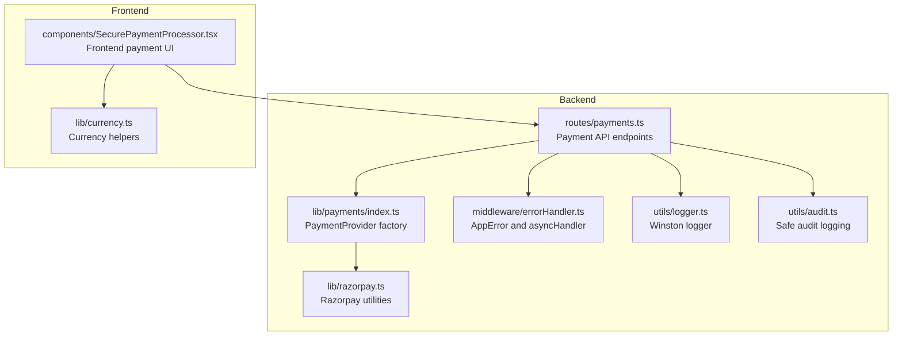
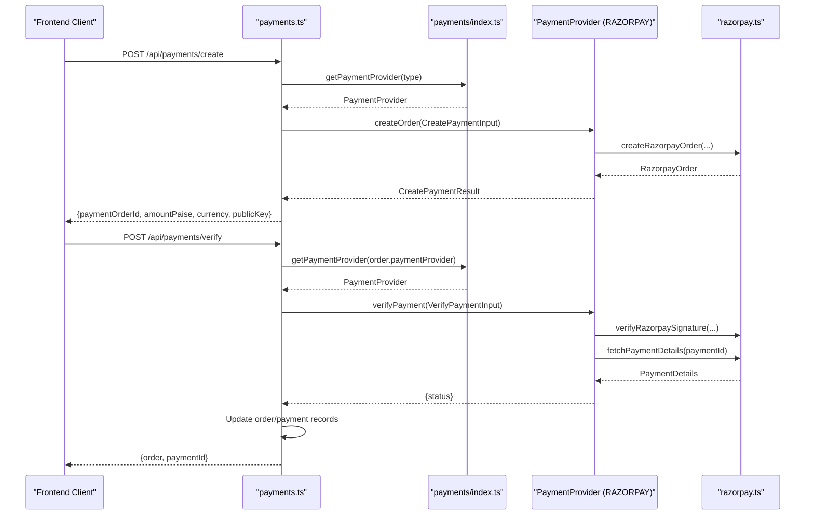
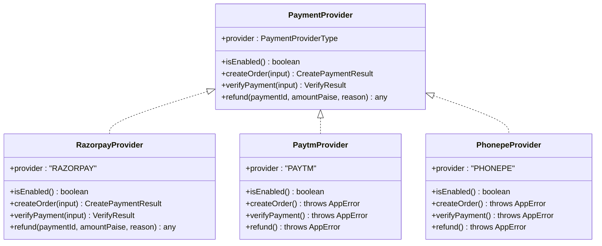
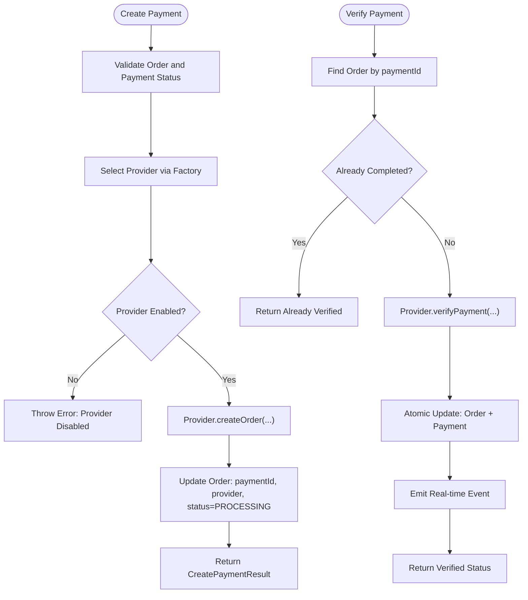
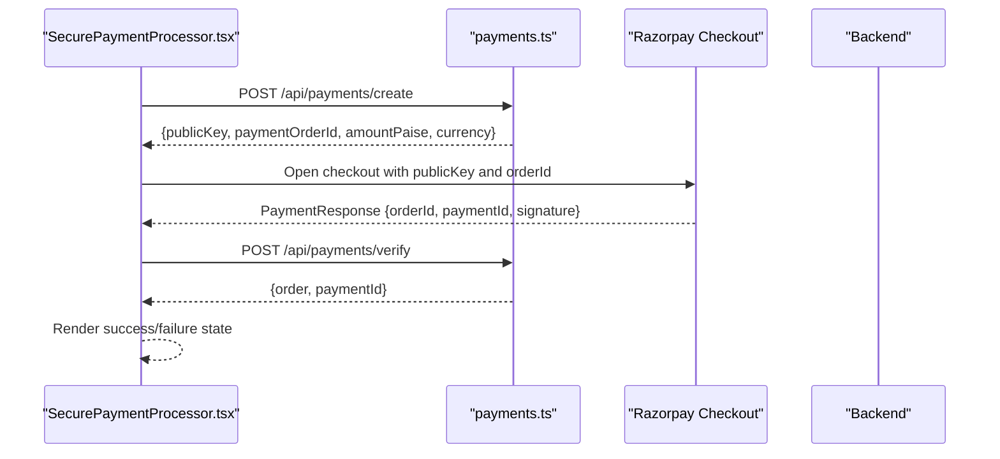
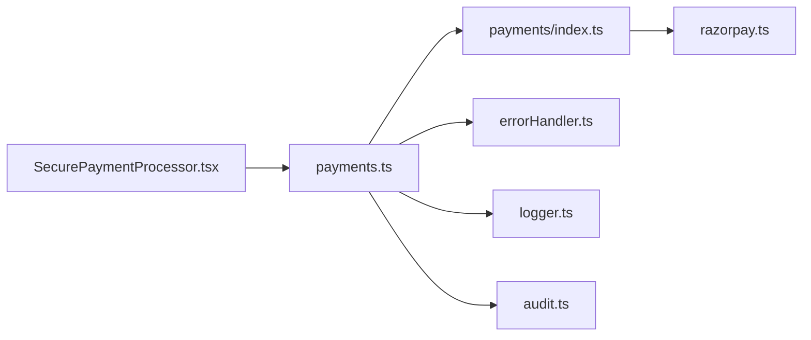

# Payment Processing

<cite>
**Referenced Files in This Document**
- [payments/index.ts](file://restaurant-backend/src/lib/payments/index.ts)
- [razorpay.ts](file://restaurant-backend/src/lib/razorpay.ts)
- [payments.ts](file://restaurant-backend/src/routes/payments.ts)
- [errorHandler.ts](file://restaurant-backend/src/middleware/errorHandler.ts)
- [logger.ts](file://restaurant-backend/src/utils/logger.ts)
- [audit.ts](file://restaurant-backend/src/utils/audit.ts)
- [env.d.ts](file://restaurant-backend/src/types/env.d.ts)
- [package.json](file://restaurant-backend/package.json)
- [SecurePaymentProcessor.tsx](file://restaurant-frontend/src/components/SecurePaymentProcessor.tsx)
- [currency.ts](file://restaurant-frontend/src/lib/currency.ts)
- [README.md](file://README.md)
- [SEPARATION_GUIDE.md](file://SEPARATION_GUIDE.md)
</cite>

## Table of Contents
1. [Introduction](#introduction)
2. [Project Structure](#project-structure)
3. [Core Components](#core-components)
4. [Architecture Overview](#architecture-overview)
5. [Detailed Component Analysis](#detailed-component-analysis)
6. [Dependency Analysis](#dependency-analysis)
7. [Performance Considerations](#performance-considerations)
8. [Troubleshooting Guide](#troubleshooting-guide)
9. [Conclusion](#conclusion)
10. [Appendices](#appendices)

## Introduction
This document provides comprehensive payment processing documentation for DeQ-Bite's payment gateway integration. It explains the pluggable payment provider architecture using a factory pattern, details the Razorpay integration (order creation, signature verification, payment capture, and refund processing), and documents the PaymentProvider interface contract. It also covers the CreatePaymentInput and CreatePaymentResult interfaces, amount calculations in paise, and currency handling. The document outlines the payment verification workflow, error handling strategies, configuration requirements, examples of payment flow implementation, transaction logging, and security best practices.

## Project Structure
The payment system spans both backend and frontend services:
- Backend (restaurant-backend):
  - Payment provider abstraction and factory in lib/payments
  - Razorpay integration utilities in lib/razorpay
  - Payment routes in routes/payments handling create, verify, refund, and status checks
  - Error handling middleware and logging utilities
- Frontend (restaurant-frontend):
  - SecurePaymentProcessor component orchestrating payment initiation and verification
  - Currency formatting utilities

**Diagram sources**
- [payments.ts:1-731](file://restaurant-backend/src/routes/payments.ts#L1-L731)
- [index.ts:1-124](file://restaurant-backend/src/lib/payments/index.ts#L1-L124)
- [razorpay.ts:1-219](file://restaurant-backend/src/lib/razorpay.ts#L1-L219)
- [errorHandler.ts:1-82](file://restaurant-backend/src/middleware/errorHandler.ts#L1-L82)
- [logger.ts:1-56](file://restaurant-backend/src/utils/logger.ts#L1-L56)
- [audit.ts:1-17](file://restaurant-backend/src/utils/audit.ts#L1-L17)
- [SecurePaymentProcessor.tsx:1-347](file://restaurant-frontend/src/components/SecurePaymentProcessor.tsx#L1-L347)
- [currency.ts:1-12](file://restaurant-frontend/src/lib/currency.ts#L1-L12)

**Section sources**
- [payments.ts:1-731](file://restaurant-backend/src/routes/payments.ts#L1-L731)
- [index.ts:1-124](file://restaurant-backend/src/lib/payments/index.ts#L1-L124)
- [razorpay.ts:1-219](file://restaurant-backend/src/lib/razorpay.ts#L1-L219)
- [errorHandler.ts:1-82](file://restaurant-backend/src/middleware/errorHandler.ts#L1-L82)
- [logger.ts:1-56](file://restaurant-backend/src/utils/logger.ts#L1-L56)
- [audit.ts:1-17](file://restaurant-backend/src/utils/audit.ts#L1-L17)
- [SecurePaymentProcessor.tsx:1-347](file://restaurant-frontend/src/components/SecurePaymentProcessor.tsx#L1-L347)
- [currency.ts:1-12](file://restaurant-frontend/src/lib/currency.ts#L1-L12)

## Core Components
- PaymentProvider interface contract:
  - provider: PaymentProviderType
  - isEnabled(): boolean
  - createOrder(input: CreatePaymentInput): Promise<CreatePaymentResult>
  - verifyPayment(input: VerifyPaymentInput): Promise<{ status: 'authorized' | 'captured' }>
  - refund(paymentId: string, amountPaise?: number, reason?: string): Promise<any>
- Factory functions:
  - getPaymentProvider(provider: PaymentProviderType)
  - getEnabledProviders(): PaymentProviderType[]
- Razorpay integration:
  - createRazorpayOrder(options)
  - verifyRazorpaySignature(orderId, paymentId, signature)
  - fetchPaymentDetails(paymentId)
  - refundRazorpayPayment(paymentId, amountPaise?, reason?)
  - captureRazorpayPayment(paymentId, amount)
  - validateWebhookSignature(body, signature, secret?)

**Section sources**
- [index.ts:32-38](file://restaurant-backend/src/lib/payments/index.ts#L32-L38)
- [index.ts:117-123](file://restaurant-backend/src/lib/payments/index.ts#L117-L123)
- [razorpay.ts:23-219](file://restaurant-backend/src/lib/razorpay.ts#L23-L219)

## Architecture Overview
The payment architecture follows a pluggable provider model with a factory pattern. The frontend initiates payment by requesting the backend to create a payment order. The backend selects the appropriate provider, delegates to provider-specific logic, and returns a response containing provider-specific identifiers and keys. On completion, the frontend submits the payment response to the backend for signature verification. The backend validates the signature, checks payment status, updates the order and payment records atomically, and emits real-time events.

**Diagram sources**
- [payments.ts:195-407](file://restaurant-backend/src/routes/payments.ts#L195-L407)
- [index.ts:40-81](file://restaurant-backend/src/lib/payments/index.ts#L40-L81)
- [razorpay.ts:33-195](file://restaurant-backend/src/lib/razorpay.ts#L33-L195)

## Detailed Component Analysis

### PaymentProvider Interface and Factory Pattern
The PaymentProvider interface defines the contract for payment providers. The factory exposes getPaymentProvider and getEnabledProviders to dynamically select and configure providers at runtime. Currently, RAZORPAY is fully implemented; PAYTM and PHONEPE are placeholders with isEnabled returning false.

**Diagram sources**
- [index.ts:32-109](file://restaurant-backend/src/lib/payments/index.ts#L32-L109)

**Section sources**
- [index.ts:9-123](file://restaurant-backend/src/lib/payments/index.ts#L9-L123)

### Razorpay Integration
Razorpay integration encapsulates order creation, signature verification, payment capture, refund processing, and webhook signature validation. Amounts are handled in paise and currency defaults to INR.

Key functions:
- createRazorpayOrder(options): Creates a Razorpay order with amount in paise and optional notes.
- verifyRazorpaySignature(orderId, paymentId, signature): Validates the HMAC-SHA256 signature using the shared key secret.
- fetchPaymentDetails(paymentId): Retrieves payment details for status validation.
- refundRazorpayPayment(paymentId, amountPaise?, reason?): Initiates a refund with optional amount and notes.
- captureRazorpayPayment(paymentId, amount): Captures a previously authorized payment.
- validateWebhookSignature(body, signature, secret?): Validates webhook signatures using a webhook secret.

**Section sources**
- [razorpay.ts:23-219](file://restaurant-backend/src/lib/razorpay.ts#L23-L219)

### Payment Routes and Workflows
The payments routes implement:
- GET /api/payments/providers: Lists enabled providers plus CASH if restaurant allows it.
- POST /api/payments/create: Creates a payment order for a given order ID, sets payment status to PROCESSING, and returns provider-specific data.
- POST /api/payments/verify: Verifies the payment signature, checks payment status, updates order and payment records atomically, and emits real-time events.
- POST /api/payments/refund: Processes refunds for completed or partially paid orders.
- GET /api/payments/status/:orderId: Retrieves order payment status and related transactions.
- POST /api/payments/cash/confirm: Confirms cash payments for CASH orders.
- PUT /api/payments/status: Updates payment status manually with validation.

**Diagram sources**
- [payments.ts:195-407](file://restaurant-backend/src/routes/payments.ts#L195-L407)

**Section sources**
- [payments.ts:180-731](file://restaurant-backend/src/routes/payments.ts#L180-L731)

### Frontend Payment Flow
The frontend SecurePaymentProcessor component:
- Requests payment creation from the backend.
- For RAZORPAY, loads the Razorpay checkout script and opens the payment interface.
- Submits the returned payment response to the backend for verification.
- Handles verification status and displays user feedback.
- Uses currency formatting helpers for INR amounts.

**Diagram sources**
- [SecurePaymentProcessor.tsx:83-206](file://restaurant-frontend/src/components/SecurePaymentProcessor.tsx#L83-L206)
- [payments.ts:195-407](file://restaurant-backend/src/routes/payments.ts#L195-L407)

**Section sources**
- [SecurePaymentProcessor.tsx:1-347](file://restaurant-frontend/src/components/SecurePaymentProcessor.tsx#L1-L347)
- [currency.ts:1-12](file://restaurant-frontend/src/lib/currency.ts#L1-L12)

## Dependency Analysis
- Backend dependencies:
  - razorpay SDK for payment operations
  - winston for structured logging
  - zod for request validation
  - express for routing
  - prisma for database operations
- Environment variables:
  - RAZORPAY_KEY_ID and RAZORPAY_KEY_SECRET for payment gateway
  - Optional PAYTM_* and PHONEPE_* placeholders for other providers
  - JWT_SECRET and FRONTEND_URL for authentication and CORS
  - SMTP_* and TWILIO_* for invoice delivery

**Diagram sources**
- [payments.ts:1-731](file://restaurant-backend/src/routes/payments.ts#L1-L731)
- [index.ts:1-124](file://restaurant-backend/src/lib/payments/index.ts#L1-L124)
- [razorpay.ts:1-219](file://restaurant-backend/src/lib/razorpay.ts#L1-L219)
- [errorHandler.ts:1-82](file://restaurant-backend/src/middleware/errorHandler.ts#L1-L82)
- [logger.ts:1-56](file://restaurant-backend/src/utils/logger.ts#L1-L56)
- [audit.ts:1-17](file://restaurant-backend/src/utils/audit.ts#L1-L17)
- [SecurePaymentProcessor.tsx:1-347](file://restaurant-frontend/src/components/SecurePaymentProcessor.tsx#L1-L347)

**Section sources**
- [package.json:18-45](file://restaurant-backend/package.json#L18-L45)
- [env.d.ts:1-40](file://restaurant-backend/src/types/env.d.ts#L1-L40)

## Performance Considerations
- Amount handling: All monetary values are represented in paise to avoid floating-point precision errors and ensure consistent currency conversion.
- Atomic operations: Payment verification updates order and payment records within a single database transaction to maintain consistency.
- Logging: Structured logging captures timing metrics for order creation and payment details fetching to aid performance monitoring.
- Frontend timeouts: The frontend enforces a verification timeout to prevent hanging UI states during network latency.

[No sources needed since this section provides general guidance]

## Troubleshooting Guide
Common issues and strategies:
- Invalid signature:
  - Backend throws an error when signature verification fails. Check that the shared key secret matches the gateway configuration.
- Missing verification fields:
  - Backend validates presence of required fields before verification. Ensure frontend sends razorpay_order_id, razorpay_payment_id, and razorpay_signature.
- Payment not successful:
  - Backend checks payment status and rejects non-captured or non-authorized statuses. Confirm gateway settlement and retry if needed.
- Provider not enabled:
  - Factory returns an error if provider credentials are missing. Verify environment variables for the selected provider.
- Network errors:
  - Gateway calls are wrapped with logging; inspect backend logs for error details and retry mechanisms.
- Audit and logs:
  - Safe audit logging ensures missing audit tables do not break flows; backend logs provide timestamps and stack traces for debugging.

**Section sources**
- [index.ts:60-77](file://restaurant-backend/src/lib/payments/index.ts#L60-L77)
- [payments.ts:294-407](file://restaurant-backend/src/routes/payments.ts#L294-L407)
- [razorpay.ts:52-59](file://restaurant-backend/src/lib/razorpay.ts#L52-L59)
- [audit.ts:5-16](file://restaurant-backend/src/utils/audit.ts#L5-L16)
- [logger.ts:1-56](file://restaurant-backend/src/utils/logger.ts#L1-L56)

## Conclusion
DeQ-Bite implements a secure, pluggable payment architecture centered on the PaymentProvider interface and factory pattern. The Razorpay integration is robust, handling order creation, signature verification, payment capture, and refunds while maintaining strict amount handling in paise and INR. The backend enforces server-side verification, atomic updates, and comprehensive logging, while the frontend provides a secure, user-friendly payment experience. Extending support to additional providers involves implementing the PaymentProvider interface and updating the factory registry.

[No sources needed since this section summarizes without analyzing specific files]

## Appendices

### Configuration Requirements
- Backend environment variables:
  - RAZORPAY_KEY_ID, RAZORPAY_KEY_SECRET (required for Razorpay)
  - Optional PAYTM_MERCHANT_ID, PAYTM_MERCHANT_KEY
  - Optional PHONEPE_MERCHANT_ID, PHONEPE_SALT_KEY
  - JWT_SECRET, FRONTEND_URL
  - SMTP_HOST, SMTP_PORT, SMTP_USER, SMTP_PASS
  - TWILIO_ACCOUNT_SID, TWILIO_AUTH_TOKEN, TWILIO_PHONE_NUMBER
- Frontend environment variables:
  - NEXT_PUBLIC_API_URL, NEXT_PUBLIC_RAZORPAY_KEY_ID, NEXT_PUBLIC_APP_NAME, NEXT_PUBLIC_APP_URL

**Section sources**
- [env.d.ts:1-40](file://restaurant-backend/src/types/env.d.ts#L1-L40)
- [README.md:187-202](file://README.md#L187-L202)
- [SEPARATION_GUIDE.md:86-113](file://SEPARATION_GUIDE.md#L86-L113)
- [SEPARATION_GUIDE.md:150-156](file://SEPARATION_GUIDE.md#L150-L156)

### Interfaces Reference
- CreatePaymentInput:
  - amountPaise: number
  - receipt: string
  - notes?: Record<string, string>
- CreatePaymentResult:
  - provider: PaymentProviderType
  - paymentOrderId: string
  - amountPaise: number
  - currency: 'INR'
  - publicKey?: string
  - redirectUrl?: string
- VerifyPaymentInput:
  - razorpay_order_id?: string
  - razorpay_payment_id?: string
  - razorpay_signature?: string

**Section sources**
- [index.ts:11-30](file://restaurant-backend/src/lib/payments/index.ts#L11-L30)

### Security Best Practices
- Server-side signature verification prevents tampering.
- JWT-based authentication secures API access.
- Input validation with Zod protects against malformed requests.
- Structured logging and audit trails support compliance and incident investigation.
- Currency and amount handling in paise reduces rounding errors and fraud risks.

**Section sources**
- [README.md:126-143](file://README.md#L126-L143)
- [SEPARATION_GUIDE.md:164-201](file://SEPARATION_GUIDE.md#L164-L201)