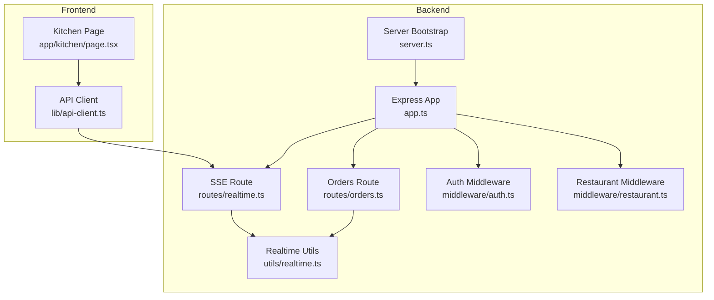
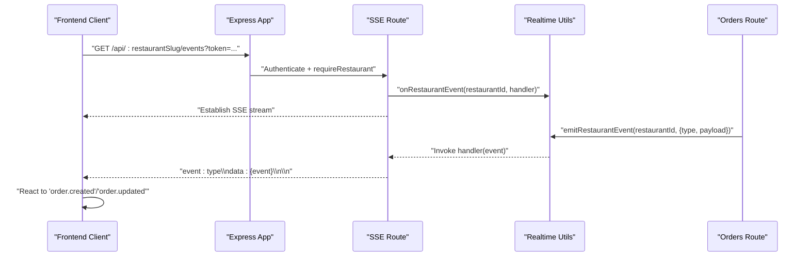
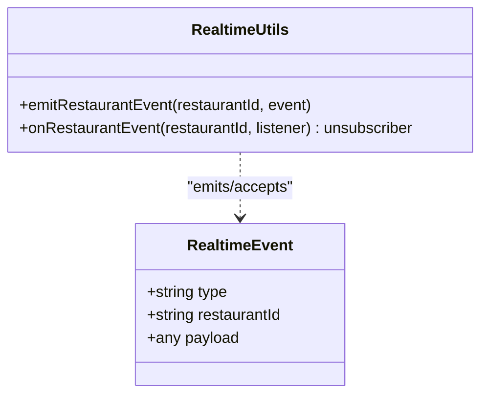
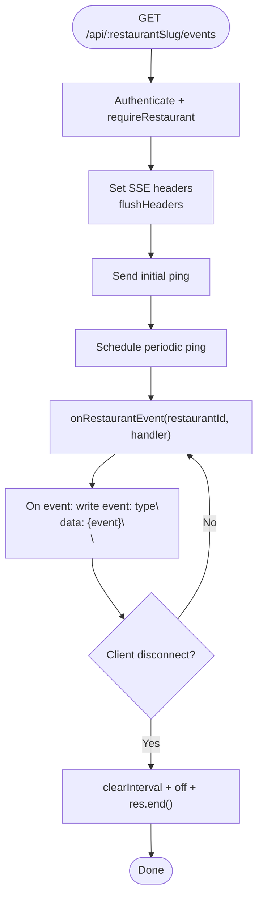
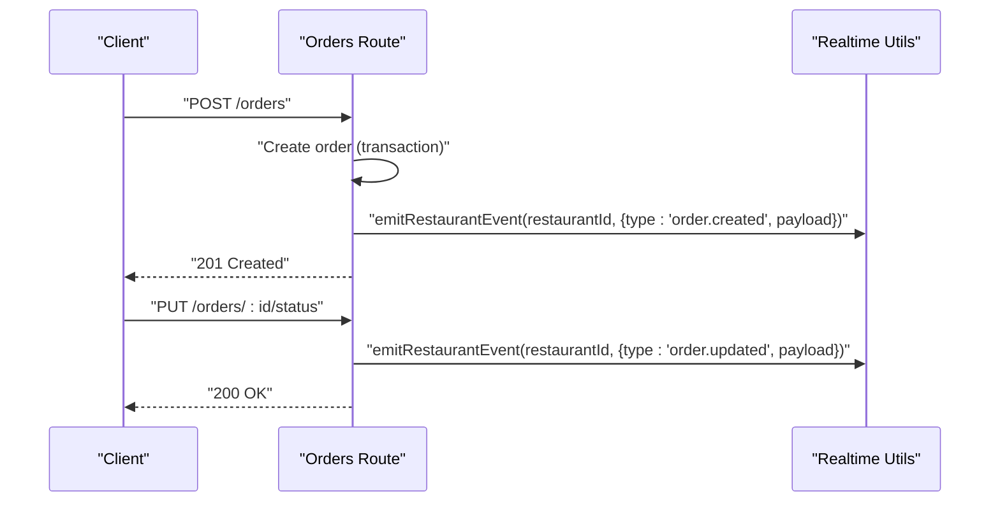
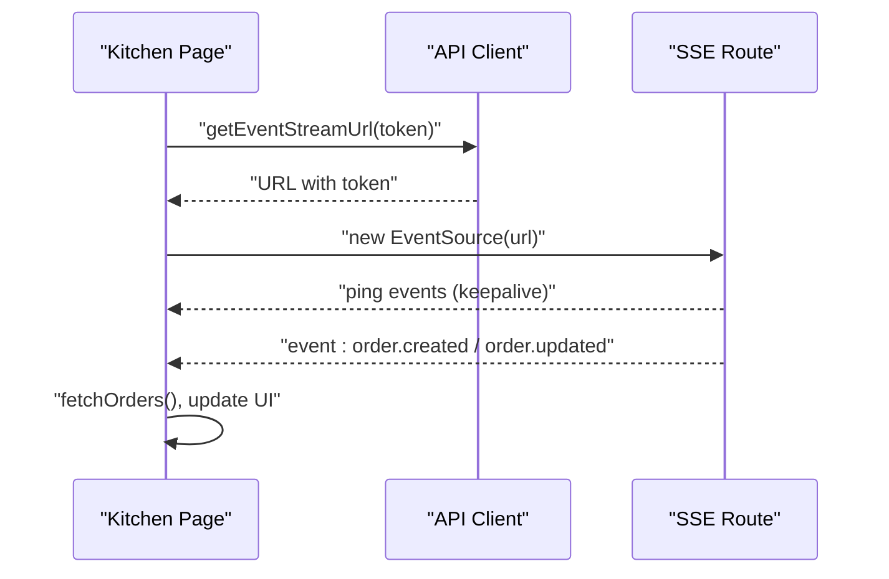
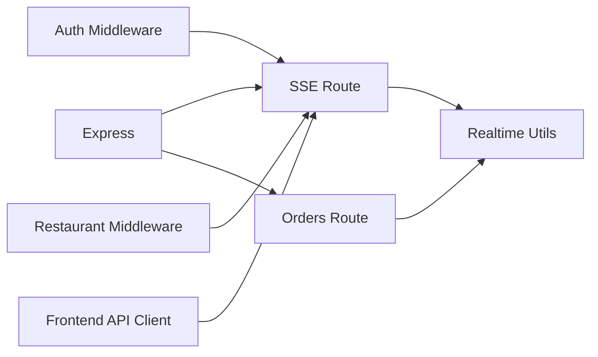

# Real-time Communication

<cite>
**Referenced Files in This Document**
- [realtime.ts](file://restaurant-backend/src/utils/realtime.ts)
- [realtime.ts](file://restaurant-backend/src/routes/realtime.ts)
- [orders.ts](file://restaurant-backend/src/route/orders.ts)
- [auth.ts](file://restaurant-backend/src/middleware/auth.ts)
- [restaurant.ts](file://restaurant-backend/src/middleware/restaurant.ts)
- [app.ts](file://restaurant-backend/src/app.ts)
- [server.ts](file://restaurant-backend/src/server.ts)
- [api-client.ts](file://restaurant-frontend/src/lib/api-client.ts)
- [page.tsx](file://restaurant-frontend/src/app/kitchen/page.tsx)
- [package.json](file://restaurant-backend/package.json)
</cite>

## Table of Contents
1. [Introduction](#introduction)
2. [Project Structure](#project-structure)
3. [Core Components](#core-components)
4. [Architecture Overview](#architecture-overview)
5. [Detailed Component Analysis](#detailed-component-analysis)
6. [Dependency Analysis](#dependency-analysis)
7. [Performance Considerations](#performance-considerations)
8. [Troubleshooting Guide](#troubleshooting-guide)
9. [Conclusion](#conclusion)

## Introduction
This document explains DeQ-Bite’s real-time communication system built on top of Server-Sent Events (SSE). It covers the WebSocket-like SSE server implementation, connection lifecycle, event broadcasting, client integration, and operational guidance for scaling, resilience, and security. The system emits order lifecycle events (created, updated) and supports kitchen displays and live dashboards.

## Project Structure
The real-time subsystem spans backend and frontend:
- Backend
  - Real-time utilities: event emission and subscription helpers
  - SSE route: authenticated SSE endpoint per restaurant
  - Order route: emits order-related events on create/update/cancel
  - Middleware: authentication and restaurant scoping
  - Application bootstrap: Express app wiring and rate limiting
- Frontend
  - API client: builds SSE URLs and attaches auth headers
  - Kitchen page: subscribes to SSE and reacts to order events

**Diagram sources**
- [app.ts:110-129](file://restaurant-backend/src/app.ts#L110-L129)
- [realtime.ts:1-39](file://restaurant-backend/src/routes/realtime.ts#L1-L39)
- [realtime.ts:1-23](file://restaurant-backend/src/utils/realtime.ts#L1-L23)
- [orders.ts:244-257](file://restaurant-backend/src/route/orders.ts#L244-L257)
- [auth.ts:7-75](file://restaurant-backend/src/middleware/auth.ts#L7-L75)
- [restaurant.ts:210-219](file://restaurant-backend/src/middleware/restaurant.ts#L210-L219)
- [server.ts:17-30](file://restaurant-backend/src/server.ts#L17-L30)
- [api-client.ts:324-329](file://restaurant-frontend/src/lib/api-client.ts#L324-L329)
- [page.tsx:36-64](file://restaurant-frontend/src/app/kitchen/page.tsx#L36-L64)

**Section sources**
- [app.ts:110-129](file://restaurant-backend/src/app.ts#L110-L129)
- [server.ts:17-30](file://restaurant-backend/src/server.ts#L17-L30)

## Core Components
- Realtime event model and emitter
  - Defines a typed event shape and exposes emit/on helpers scoped by restaurantId.
- SSE endpoint
  - Streams events to authenticated restaurant users via Server-Sent Events.
- Order event producers
  - Emits order.created and order.updated when orders change.
- Client integration
  - Builds SSE URL with token and subscribes via EventSource.

Key responsibilities:
- Emit events: emitRestaurantEvent
- Subscribe to events: onRestaurantEvent
- Stream events: GET /api/:restaurantSlug/events
- Publish order events: order creation and status updates

**Section sources**
- [realtime.ts:3-22](file://restaurant-backend/src/utils/realtime.ts#L3-L22)
- [realtime.ts:9-37](file://restaurant-backend/src/routes/realtime.ts#L9-L37)
- [orders.ts:244-257](file://restaurant-backend/src/route/orders.ts#L244-L257)

## Architecture Overview
The system uses an in-process event emitter to broadcast events to connected clients. Each restaurant has its own event channel keyed by restaurantId. Clients connect via SSE with Bearer token authentication and receive events filtered by their restaurant context.

**Diagram sources**
- [realtime.ts:10-37](file://restaurant-backend/src/routes/realtime.ts#L10-L37)
- [realtime.ts:12-22](file://restaurant-backend/src/utils/realtime.ts#L12-L22)
- [orders.ts:244-257](file://restaurant-backend/src/route/orders.ts#L244-L257)
- [auth.ts:7-75](file://restaurant-backend/src/middleware/auth.ts#L7-L75)
- [restaurant.ts:210-219](file://restaurant-backend/src/middleware/restaurant.ts#L210-L219)

## Detailed Component Analysis

### Realtime Utilities
- RealtimeEvent type: carries type, restaurantId, and payload.
- emitRestaurantEvent: emits an event on the restaurantId channel.
- onRestaurantEvent: registers a listener and returns an unsubscribe function.

**Diagram sources**
- [realtime.ts:3-22](file://restaurant-backend/src/utils/realtime.ts#L3-L22)

**Section sources**
- [realtime.ts:3-22](file://restaurant-backend/src/utils/realtime.ts#L3-L22)

### SSE Route
- Endpoint: GET /api/:restaurantSlug/events
- Authentication: requires Bearer token and restaurant context
- Streaming: sets SSE headers, sends periodic ping events, writes typed events
- Lifecycle: cleans up keepalive and listener on close

**Diagram sources**
- [realtime.ts:10-37](file://restaurant-backend/src/routes/realtime.ts#L10-L37)

**Section sources**
- [realtime.ts:9-37](file://restaurant-backend/src/routes/realtime.ts#L9-L37)

### Order Event Publishing
- Creation: emits order.created after transaction completes
- Updates: emits order.updated on status change or modifications
- Payload: minimal order summary for efficient streaming

**Diagram sources**
- [orders.ts:244-257](file://restaurant-backend/src/route/orders.ts#L244-L257)
- [orders.ts:611-623](file://restaurant-backend/src/route/orders.ts#L611-L623)
- [orders.ts:662-680](file://restaurant-backend/src/route/orders.ts#L662-L680)

**Section sources**
- [orders.ts:244-257](file://restaurant-backend/src/route/orders.ts#L244-L257)
- [orders.ts:611-623](file://restaurant-backend/src/route/orders.ts#L611-L623)
- [orders.ts:662-680](file://restaurant-backend/src/route/orders.ts#L662-L680)

### Client Integration (Frontend)
- API client constructs SSE URL with x-restaurant-slug and token query parameter.
- Kitchen page opens EventSource and listens for order.created/order.updated.
- On events, refetches orders and optionally shows toast notifications.

**Diagram sources**
- [api-client.ts:324-329](file://restaurant-frontend/src/lib/api-client.ts#L324-L329)
- [page.tsx:36-64](file://restaurant-frontend/src/app/kitchen/page.tsx#L36-L64)

**Section sources**
- [api-client.ts:324-329](file://restaurant-frontend/src/lib/api-client.ts#L324-L329)
- [page.tsx:36-64](file://restaurant-frontend/src/app/kitchen/page.tsx#L36-L64)

## Dependency Analysis
- Runtime dependencies
  - Express for HTTP/SSE routing
  - jsonwebtoken for auth middleware
  - express-rate-limit for request throttling
  - helmet for security headers
  - morgan for logging
- Internal dependencies
  - SSE route depends on auth and restaurant middleware
  - Orders route depends on realtime utils
  - Frontend API client depends on backend endpoints and auth headers

**Diagram sources**
- [package.json:18-45](file://restaurant-backend/package.json#L18-L45)
- [app.ts:110-129](file://restaurant-backend/src/app.ts#L110-L129)
- [realtime.ts:1-5](file://restaurant-backend/src/routes/realtime.ts#L1-L5)
- [orders.ts:1-8](file://restaurant-backend/src/route/orders.ts#L1-L8)
- [auth.ts:1-10](file://restaurant-backend/src/middleware/auth.ts#L1-L10)
- [restaurant.ts:1-5](file://restaurant-backend/src/middleware/restaurant.ts#L1-L5)

**Section sources**
- [package.json:18-45](file://restaurant-backend/package.json#L18-L45)
- [app.ts:110-129](file://restaurant-backend/src/app.ts#L110-L129)

## Performance Considerations
- SSE characteristics
  - Single long-lived connection per client; server maintains one write stream per subscriber.
  - Keep-alive ping reduces idle connection termination by proxies.
- Event volume
  - Emit only essential payload fields to minimize bandwidth.
  - Avoid emitting events for non-visible UI changes.
- Backpressure
  - SSE streams are fire-and-forget; if the client cannot keep up, it relies on automatic reconnection.
- Scalability
  - Current implementation uses an in-process EventEmitter; it does not fan-out across nodes.
  - For horizontal scaling, consider a message broker (e.g., Redis pub/sub) and a load-balancing strategy that ensures sticky sessions or shared state.

[No sources needed since this section provides general guidance]

## Troubleshooting Guide
Common issues and resolutions:
- Authentication failures
  - Verify Authorization header and token validity; ensure JWT_SECRET is configured.
- Restaurant context missing
  - Confirm x-restaurant-slug or subdomain/host matches a valid restaurant.
- SSE connection drops
  - Check keep-alive pings; browsers retry automatically on network errors.
- Excessive reconnect loops
  - Reduce client-side retry frequency; rely on SSE auto-reconnect.
- Rate limiting
  - The server enforces global rate limits; reduce bursty client requests.

Operational checks:
- Health endpoint: GET /health
- Verify CORS origins and credentials
- Monitor logs via morgan

**Section sources**
- [auth.ts:33-74](file://restaurant-backend/src/middleware/auth.ts#L33-L74)
- [restaurant.ts:210-219](file://restaurant-backend/src/middleware/restaurant.ts#L210-L219)
- [realtime.ts:17-37](file://restaurant-backend/src/routes/realtime.ts#L17-L37)
- [app.ts:67-76](file://restaurant-backend/src/app.ts#L67-L76)
- [server.ts:21-25](file://restaurant-backend/src/server.ts#L21-L25)

## Security Considerations
- Transport security
  - Use HTTPS in production to protect SSE streams and tokens.
- Authentication and authorization
  - Bearer token required; validated by auth middleware.
  - Restaurant context enforced; only authorized users for the restaurant receive events.
- Headers and CORS
  - Strict CORS configuration; credentials allowed only for approved origins.
  - Helmet enabled for CSP and COEP toggles.
- Secrets
  - JWT_SECRET must be set and strong in production.

**Section sources**
- [auth.ts:7-75](file://restaurant-backend/src/middleware/auth.ts#L7-L75)
- [restaurant.ts:210-219](file://restaurant-backend/src/middleware/restaurant.ts#L210-L219)
- [app.ts:42-65](file://restaurant-backend/src/app.ts#L42-L65)
- [server.ts:28-32](file://restaurant-backend/src/server.ts#L28-L32)

## Scaling and Session Management
- Current state
  - In-process EventEmitter; single-node operation.
- Recommendations
  - Use a shared pub/sub backend (e.g., Redis) to fan out events across instances.
  - Sticky sessions or shared state to ensure clients receive all events.
  - Horizontal scaling behind a load balancer with health checks.
- Session and concurrency
  - Each client connection is independent; no server-side session storage is required.
  - Use keep-alive pings to detect dead connections promptly.

[No sources needed since this section provides general guidance]

## Client Integration Examples
- Building the SSE URL
  - Construct URL with tenant endpoint and token query parameter.
- Subscribing and handling events
  - Open EventSource, listen for order.created/order.updated, and refresh UI.

**Section sources**
- [api-client.ts:324-329](file://restaurant-frontend/src/lib/api-client.ts#L324-L329)
- [page.tsx:36-64](file://restaurant-frontend/src/app/kitchen/page.tsx#L36-L64)

## Conclusion
DeQ-Bite’s real-time system leverages SSE with a simple, maintainable architecture. It securely streams order events to authenticated restaurant users, enabling near real-time kitchen displays and dashboards. For production-scale deployments, consider a distributed pub/sub backend and sticky sessions to ensure reliable delivery across multiple server instances.