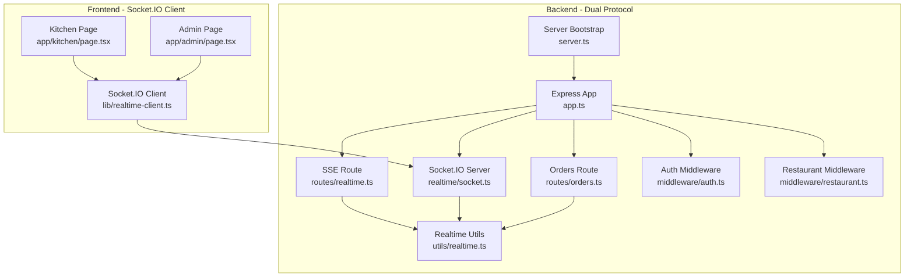
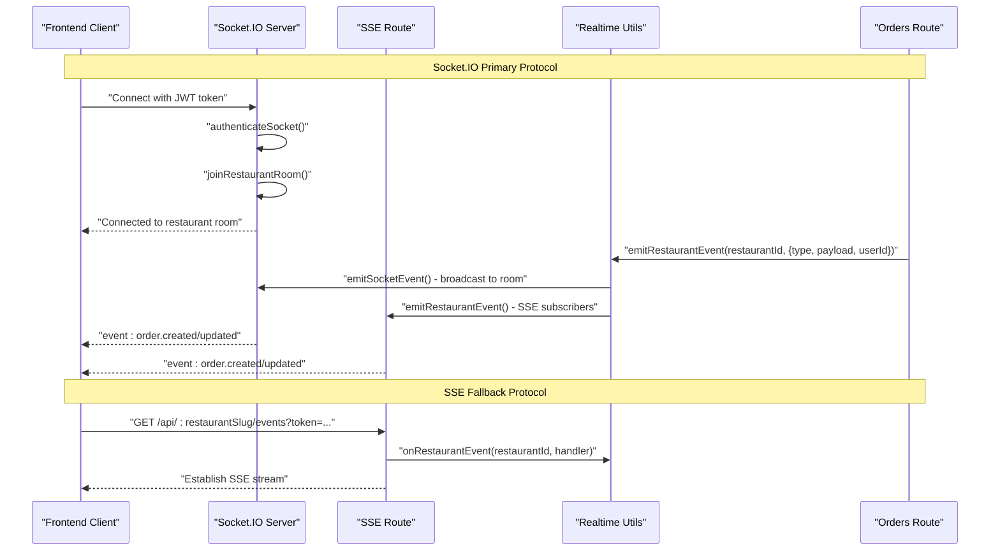
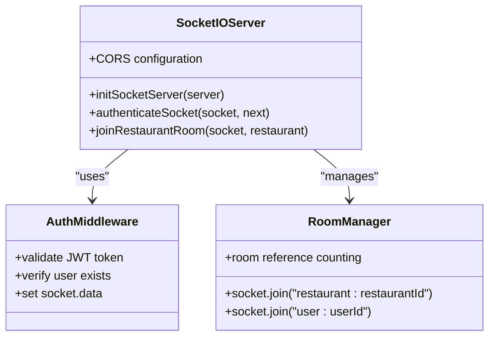
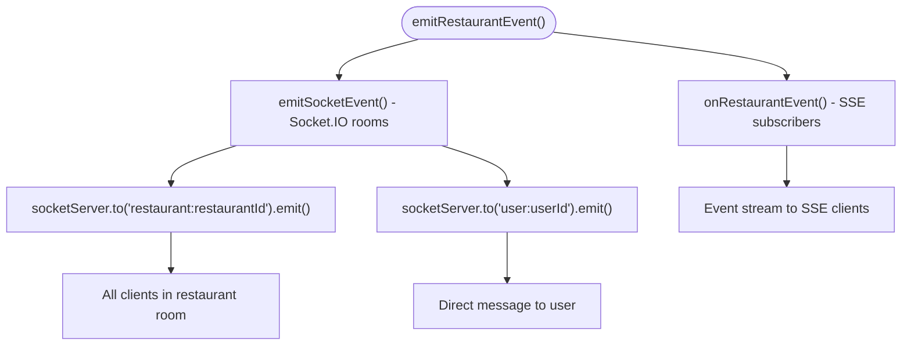
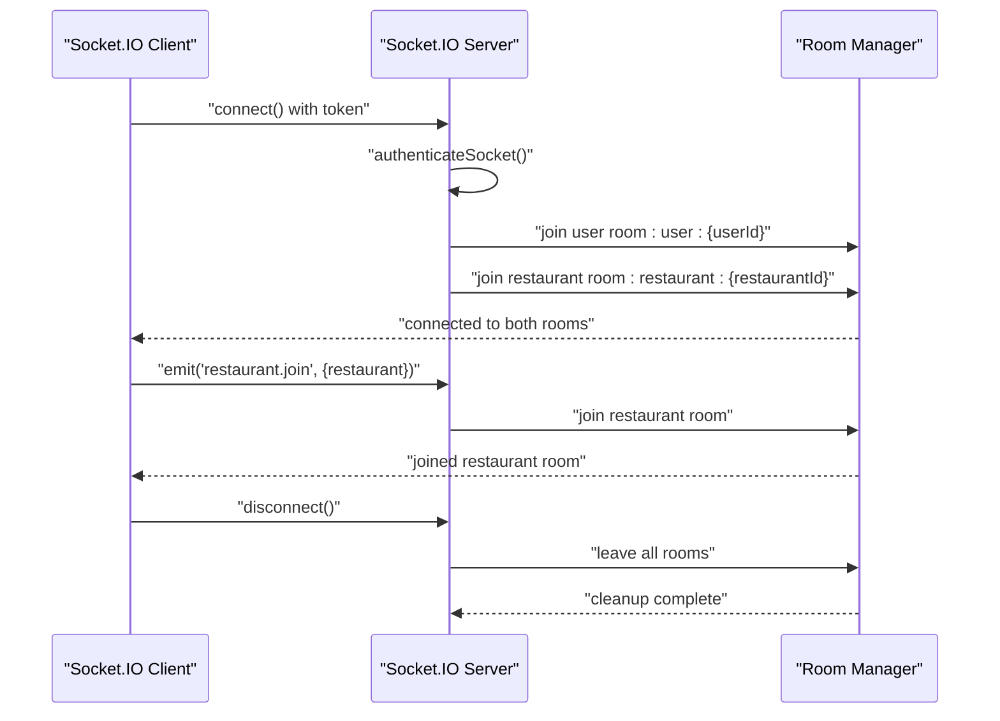
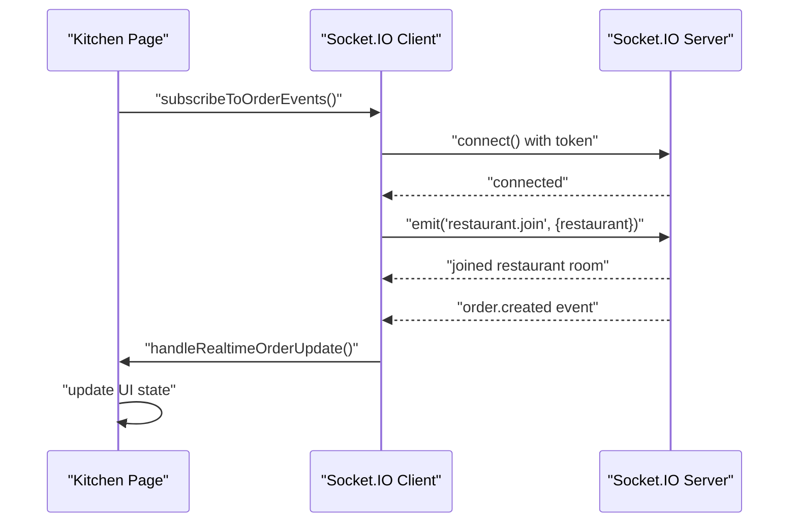

# Real-time Communication

<cite>
**Referenced Files in This Document**
- [socket.ts](file://restaurant-backend/src/realtime/socket.ts)
- [realtime.ts](file://restaurant-backend/src/utils/realtime.ts)
- [realtime.ts](file://restaurant-backend/src/routes/realtime.ts)
- [orders.ts](file://restaurant-backend/src/routes/orders.ts)
- [auth.ts](file://restaurant-backend/src/middleware/auth.ts)
- [restaurant.ts](file://restaurant-backend/src/middleware/restaurant.ts)
- [app.ts](file://restaurant-backend/src/app.ts)
- [server.ts](file://restaurant-backend/src/server.ts)
- [realtime-client.ts](file://restaurant-frontend/src/lib/realtime-client.ts)
- [page.tsx](file://restaurant-frontend/src/app/kitchen/page.tsx)
- [page.tsx](file://restaurant-frontend/src/app/admin/page.tsx)
- [package.json](file://restaurant-backend/package.json)
</cite>

## Update Summary
**Changes Made**
- Added comprehensive Socket.IO implementation documentation alongside existing SSE system
- Documented dual real-time communication approach with both Server-Sent Events and Socket.IO
- Added authentication middleware for Socket.IO connections
- Documented room-based messaging and event broadcasting capabilities
- Updated architecture diagrams to show both real-time protocols
- Enhanced client integration examples for Socket.IO
- Added Socket.IO-specific security and scaling considerations

## Table of Contents
1. [Introduction](#introduction)
2. [Project Structure](#project-structure)
3. [Core Components](#core-components)
4. [Architecture Overview](#architecture-overview)
5. [Detailed Component Analysis](#detailed-component-analysis)
6. [Dual Real-time Protocol Support](#dual-real-time-protocol-support)
7. [Socket.IO Implementation](#socket-io-implementation)
8. [Authentication and Security](#authentication-and-security)
9. [Client Integration Examples](#client-integration-examples)
10. [Performance Considerations](#performance-considerations)
11. [Scaling and Load Balancing](#scaling-and-load-balancing)
12. [Troubleshooting Guide](#troubleshooting-guide)
13. [Conclusion](#conclusion)

## Introduction
This document explains DeQ-Bite's real-time communication system featuring a dual-protocol architecture supporting both Server-Sent Events (SSE) and Socket.IO. The system provides bidirectional real-time communication for order lifecycle events, kitchen displays, and live dashboards. The Socket.IO implementation adds room-based messaging, user-specific channels, and enhanced connection management alongside the existing SSE infrastructure.

## Project Structure
The real-time subsystem spans backend and frontend with dual protocol support:
- Backend
  - Socket.IO server initialization and authentication middleware
  - Real-time utilities with dual event emission (SSE + Socket.IO)
  - SSE route for traditional server-sent events
  - Order route for emitting order-related events
  - Middleware for authentication and restaurant scoping
  - Application bootstrap with Socket.IO integration
- Frontend
  - Socket.IO client with automatic reconnection and room management
  - Kitchen and admin pages subscribing to real-time order updates
  - Event handlers for order lifecycle changes

```mermaid
graph TB
subgraph "Backend - Dual Protocol"
A["Express App<br/>app.ts"]
B["SSE Route<br/>routes/realtime.ts"]
C["Socket.IO Server<br/>realtime/socket.ts"]
D["Realtime Utils<br/>utils/realtime.ts"]
E["Orders Route<br/>routes/orders.ts"]
F["Auth Middleware<br/>middleware/auth.ts"]
G["Restaurant Middleware<br/>middleware/restaurant.ts"]
H["Server Bootstrap<br/>server.ts"]
end
subgraph "Frontend - Socket.IO Client"
X["Socket.IO Client<br/>lib/realtime-client.ts"]
Y["Kitchen Page<br/>app/kitchen/page.tsx"]
Z["Admin Page<br/>app/admin/page.tsx"]
end
A --> B
A --> C
A --> E
B --> D
C --> D
E --> D
X --> C
Y --> X
Z --> X
A --> F
A --> G
H --> A
```

**Diagram sources**
- [app.ts:110-129](file://restaurant-backend/src/app.ts#L110-L129)
- [realtime.ts:1-39](file://restaurant-backend/src/routes/realtime.ts#L1-L39)
- [socket.ts:79-122](file://restaurant-backend/src/realtime/socket.ts#L79-L122)
- [realtime.ts:1-23](file://restaurant-backend/src/utils/realtime.ts#L1-L23)
- [orders.ts:244-257](file://restaurant-backend/src/routes/orders.ts#L244-L257)
- [auth.ts:7-75](file://restaurant-backend/src/middleware/auth.ts#L7-L75)
- [restaurant.ts:210-219](file://restaurant-backend/src/middleware/restaurant.ts#L210-L219)
- [server.ts:17-30](file://restaurant-backend/src/server.ts#L17-L30)
- [realtime-client.ts:1-116](file://restaurant-frontend/src/lib/realtime-client.ts#L1-L116)

**Section sources**
- [app.ts:110-129](file://restaurant-backend/src/app.ts#L110-L129)
- [server.ts:17-30](file://restaurant-backend/src/server.ts#L17-L30)

## Core Components
- Dual real-time event model and emitter
  - Supports both SSE and Socket.IO event emission
  - Room-based and user-specific event broadcasting
- Socket.IO server
  - Authentication middleware with JWT validation
  - Room management for restaurant-specific channels
  - User-specific channels for direct messaging
- SSE endpoint (legacy support)
  - Maintains backward compatibility with existing clients
- Order event producers
  - Emits order.created and order.updated events via both protocols
- Client integration
  - Socket.IO client with automatic reconnection and room management

Key responsibilities:
- Emit events: emitRestaurantEvent (dual protocol)
- Subscribe to events: onRestaurantEvent (SSE) + Socket.IO listeners
- Stream events: GET /api/:restaurantSlug/events (SSE)
- Publish order events: order creation and status updates via both protocols

**Section sources**
- [realtime.ts:3-22](file://restaurant-backend/src/utils/realtime.ts#L3-L22)
- [realtime.ts:9-37](file://restaurant-backend/src/routes/realtime.ts#L9-L37)
- [orders.ts:244-257](file://restaurant-backend/src/routes/orders.ts#L244-L257)
- [socket.ts:40-70](file://restaurant-backend/src/realtime/socket.ts#L40-L70)

## Architecture Overview
The system now supports dual real-time protocols with Socket.IO as the primary implementation and SSE as fallback/compatibility layer. Socket.IO provides bidirectional communication with rooms, while SSE offers simpler server-to-client streaming.

```mermaid
sequenceDiagram
participant Client as "Frontend Client"
participant IO as "Socket.IO Server"
participant SSE as "SSE Route"
participant RT as "Realtime Utils"
participant Orders as "Orders Route"
Note over Client,Orders : Socket.IO Primary Protocol
Client->>IO : "Connect with JWT token"
IO->>IO : "authenticateSocket()"
IO->>IO : "joinRestaurantRoom()"
IO-->>Client : "Connected to restaurant room"
Orders->>RT : "emitRestaurantEvent(restaurantId, {type, payload, userId})"
RT->>IO : "emitSocketEvent() - broadcast to room"
RT->>SSE : "emitRestaurantEvent() - SSE subscribers"
IO-->>Client : "event : order.created/updated"
SSE-->>Client : "event : order.created/updated"
Note over Client,Orders : SSE Fallback Protocol
Client->>SSE : "GET /api/ : restaurantSlug/events?token=..."
SSE->>RT : "onRestaurantEvent(restaurantId, handler)"
SSE-->>Client : "Establish SSE stream"
```

**Diagram sources**
- [socket.ts:79-122](file://restaurant-backend/src/realtime/socket.ts#L79-L122)
- [realtime.ts:12-22](file://restaurant-backend/src/utils/realtime.ts#L12-L22)
- [orders.ts:244-257](file://restaurant-backend/src/routes/orders.ts#L244-L257)
- [auth.ts:7-75](file://restaurant-backend/src/middleware/auth.ts#L7-L75)
- [restaurant.ts:210-219](file://restaurant-backend/src/middleware/restaurant.ts#L210-L219)

## Detailed Component Analysis

### Socket.IO Server Implementation
- Authentication middleware validates JWT tokens and user roles
- Room-based messaging with restaurant-specific channels
- User-specific channels for direct messaging
- CORS configuration for multiple frontend origins
- Automatic room management with reference counting

```mermaid
classDiagram
class SocketIOServer {
+initSocketServer(server)
+authenticateSocket(socket, next)
+joinRestaurantRoom(socket, restaurant)
+CORS configuration
}
class AuthMiddleware {
+validate JWT token
+verify user exists
+set socket.data
}
class RoomManager {
+socket.join("restaurant : restaurantId")
+socket.join("user : userId")
+room reference counting
}
SocketIOServer --> AuthMiddleware : "uses"
SocketIOServer --> RoomManager : "manages"
```

**Diagram sources**
- [socket.ts:40-70](file://restaurant-backend/src/realtime/socket.ts#L40-L70)
- [socket.ts:72-77](file://restaurant-backend/src/realtime/socket.ts#L72-L77)
- [socket.ts:79-122](file://restaurant-backend/src/realtime/socket.ts#L79-L122)

**Section sources**
- [socket.ts:40-70](file://restaurant-backend/src/realtime/socket.ts#L40-L70)
- [socket.ts:72-77](file://restaurant-backend/src/realtime/socket.ts#L72-L77)
- [socket.ts:79-122](file://restaurant-backend/src/realtime/socket.ts#L79-L122)

### Realtime Utilities (Dual Protocol)
- Socket.IO event emission with room-based broadcasting
- SSE event emission for backward compatibility
- User-specific event targeting
- Centralized event management with dual output

```mermaid
flowchart TD
Start(["emitRestaurantEvent()"]) --> SSE["onRestaurantEvent() - SSE subscribers"]
Start --> Socket["emitSocketEvent() - Socket.IO rooms"]
Socket --> Room["socketServer.to('restaurant:restaurantId').emit()"]
Socket --> User["socketServer.to('user:userId').emit()"]
SSE --> Stream["Event stream to SSE clients"]
Room --> Clients["All clients in restaurant room"]
User --> Direct["Direct message to user"]
```

**Diagram sources**
- [realtime.ts:20-36](file://restaurant-backend/src/utils/realtime.ts#L20-L36)

**Section sources**
- [realtime.ts:20-36](file://restaurant-backend/src/utils/realtime.ts#L20-L36)

### SSE Route (Legacy Support)
- Maintains backward compatibility with existing SSE clients
- Authentication and restaurant scoping
- Keep-alive ping mechanism
- Event streaming with typed payloads

**Section sources**
- [realtime.ts:9-37](file://restaurant-backend/src/routes/realtime.ts#L9-L37)

## Dual Real-time Protocol Support
The system now supports both Socket.IO and SSE protocols simultaneously, allowing clients to choose the most appropriate connection method based on their needs and browser support.

### Protocol Comparison
- **Socket.IO**
  - Bidirectional communication
  - Room-based messaging
  - Automatic reconnection
  - User-specific channels
  - Better performance for frequent updates
- **SSE**
  - Server-to-client streaming only
  - Simpler implementation
  - Lower overhead for basic use cases
  - Good fallback option

### Event Emission Strategy
Both protocols receive identical events through the centralized `emitRestaurantEvent` function, ensuring consistency across all clients regardless of their chosen protocol.

**Section sources**
- [realtime.ts:28-36](file://restaurant-backend/src/utils/realtime.ts#L28-L36)
- [orders.ts:271-276](file://restaurant-backend/src/routes/orders.ts#L271-L276)

## Socket.IO Implementation

### Connection Management
- Token-based authentication with JWT verification
- Automatic room joining upon connection
- Reference counting for room membership
- Graceful disconnection handling

### Room-based Messaging
- Restaurant-specific rooms: `restaurant:{restaurantId}`
- User-specific rooms: `user:{userId}`
- Dynamic room joining/leaving
- Automatic cleanup on disconnect

### Event Broadcasting
- Restaurant-wide broadcasts for order updates
- User-specific notifications for direct messages
- Efficient room-based distribution
- Minimal event duplication

```mermaid
sequenceDiagram
participant Client as "Socket.IO Client"
participant Server as "Socket.IO Server"
participant Rooms as "Room Manager"
Client->>Server : "connect() with token"
Server->>Server : "authenticateSocket()"
Server->>Rooms : "join user room : user : {userId}"
Server->>Rooms : "join restaurant room : restaurant : {restaurantId}"
Rooms-->>Client : "connected to both rooms"
Client->>Server : "emit('restaurant.join', {restaurant})"
Server->>Rooms : "join restaurant room"
Rooms-->>Client : "joined restaurant room"
Client->>Server : "disconnect()"
Server->>Rooms : "leave all rooms"
Rooms-->>Server : "cleanup complete"
```

**Diagram sources**
- [socket.ts:97-115](file://restaurant-backend/src/realtime/socket.ts#L97-L115)
- [socket.ts:103-114](file://restaurant-backend/src/realtime/socket.ts#L103-L114)

**Section sources**
- [socket.ts:97-115](file://restaurant-backend/src/realtime/socket.ts#L97-L115)
- [socket.ts:103-114](file://restaurant-backend/src/realtime/socket.ts#L103-L114)

## Authentication and Security

### Socket.IO Authentication
- JWT token validation in handshake
- User role verification
- Restaurant context resolution
- Automatic user and restaurant ID assignment

### CORS Configuration
- Multiple frontend origins support
- Credentials allowed for approved domains
- Method restrictions (GET, POST)
- Origin validation and filtering

### Security Measures
- Transport security with HTTPS
- Token-based authentication
- Role-based access control
- Room-based isolation
- Rate limiting at application level

**Section sources**
- [socket.ts:40-70](file://restaurant-backend/src/realtime/socket.ts#L40-L70)
- [socket.ts:12-22](file://restaurant-backend/src/realtime/socket.ts#L12-L22)
- [auth.ts:7-75](file://restaurant-backend/src/middleware/auth.ts#L7-L75)

## Client Integration Examples

### Socket.IO Client Setup
- Automatic token injection
- Room management with reference counting
- Event subscription with cleanup
- Reconnection handling

### Frontend Integration Patterns
- Kitchen page: real-time order updates
- Admin dashboard: live order monitoring
- User-specific notifications
- Restaurant-scoped broadcasts

```mermaid
sequenceDiagram
participant Kitchen as "Kitchen Page"
participant Client as "Socket.IO Client"
participant Server as "Socket.IO Server"
Kitchen->>Client : "subscribeToOrderEvents()"
Client->>Server : "connect() with token"
Server-->>Client : "connected"
Client->>Server : "emit('restaurant.join', {restaurant})"
Server-->>Client : "joined restaurant room"
Server-->>Client : "order.created event"
Client->>Kitchen : "handleRealtimeOrderUpdate()"
Kitchen->>Kitchen : "update UI state"
```

**Diagram sources**
- [realtime-client.ts:86-115](file://restaurant-frontend/src/lib/realtime-client.ts#L86-L115)
- [page.tsx:37-51](file://restaurant-frontend/src/app/kitchen/page.tsx#L37-L51)

**Section sources**
- [realtime-client.ts:1-116](file://restaurant-frontend/src/lib/realtime-client.ts#L1-L116)
- [page.tsx:37-51](file://restaurant-frontend/src/app/kitchen/page.tsx#L37-L51)
- [page.tsx:99-113](file://restaurant-frontend/src/app/admin/page.tsx#L99-L113)

## Performance Considerations

### Socket.IO Advantages
- Lower latency for frequent updates
- Bidirectional communication reduces polling
- Efficient room-based broadcasting
- Built-in reconnection and heartbeat
- Reduced memory footprint compared to multiple SSE connections

### SSE Characteristics
- Single-direction streaming
- Lower overhead for simple use cases
- Good battery life on mobile devices
- Simple implementation and debugging

### Event Volume Optimization
- Emit only essential payload fields
- Use room-based filtering to avoid unnecessary broadcasts
- Implement client-side caching and deduplication
- Batch updates where possible

### Connection Management
- Automatic reconnection with exponential backoff
- Graceful degradation to SSE if Socket.IO fails
- Connection pooling and reuse
- Memory cleanup on disconnect

## Scaling and Load Balancing

### Socket.IO Scaling Strategies
- Sticky sessions for room state consistency
- Shared state backend (Redis) for multi-instance deployment
- Load balancer with session affinity
- Horizontal scaling with pub/sub messaging

### SSE Scaling Limitations
- Stateless connections easier to scale
- No shared state requirements
- Simple round-robin load balancing
- Limited to server-to-client communication

### Multi-instance Deployment
- Socket.IO with Redis adapter for cross-instance messaging
- Database-backed user and restaurant resolution
- Shared JWT secret across instances
- Consistent room state management

## Troubleshooting Guide

### Socket.IO Issues
- **Connection failures**: Check JWT token validity and server logs
- **Room joining problems**: Verify restaurant context resolution
- **Event delivery issues**: Monitor room membership and reference counts
- **Reconnection loops**: Check network connectivity and server availability

### SSE Issues
- **Authentication failures**: Verify token format and expiration
- **Connection drops**: Check keep-alive ping and network stability
- **Event filtering**: Ensure restaurant context matches user permissions

### Common Resolutions
- Verify CORS configuration allows frontend origins
- Check JWT_SECRET environment variable
- Monitor server logs for authentication errors
- Test with both protocols for comprehensive coverage

**Section sources**
- [socket.ts:40-70](file://restaurant-backend/src/realtime/socket.ts#L40-L70)
- [auth.ts:33-74](file://restaurant-backend/src/middleware/auth.ts#L33-L74)
- [realtime.ts:17-37](file://restaurant-backend/src/routes/realtime.ts#L17-L37)

## Conclusion
DeQ-Bite's real-time communication system now provides robust dual-protocol support with Socket.IO as the primary implementation and SSE as fallback. The Socket.IO implementation offers superior performance with room-based messaging, user-specific channels, and automatic reconnection. The centralized event emission system ensures consistent real-time updates across all clients regardless of their chosen protocol. This architecture supports future scalability with proper load balancing and multi-instance deployment strategies while maintaining backward compatibility with existing SSE clients.