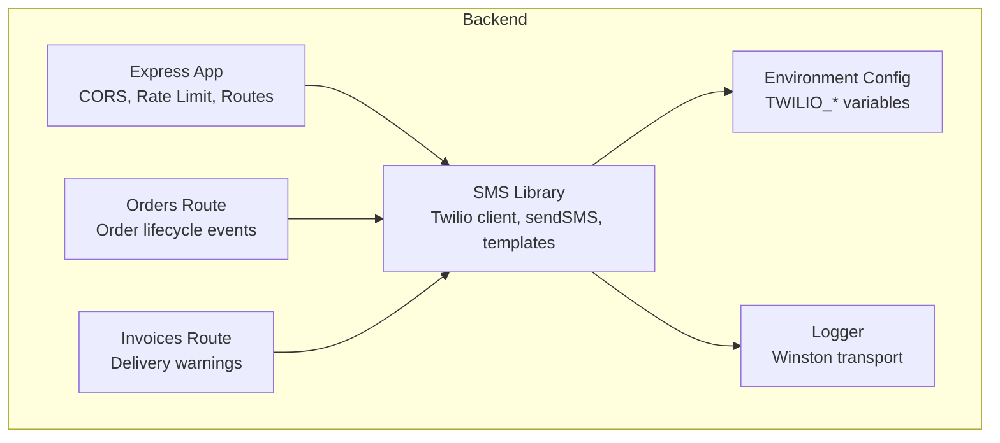
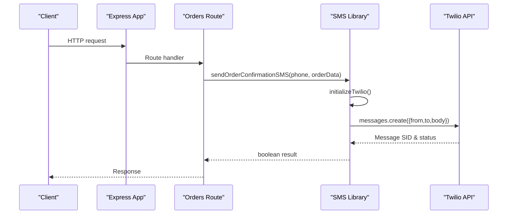
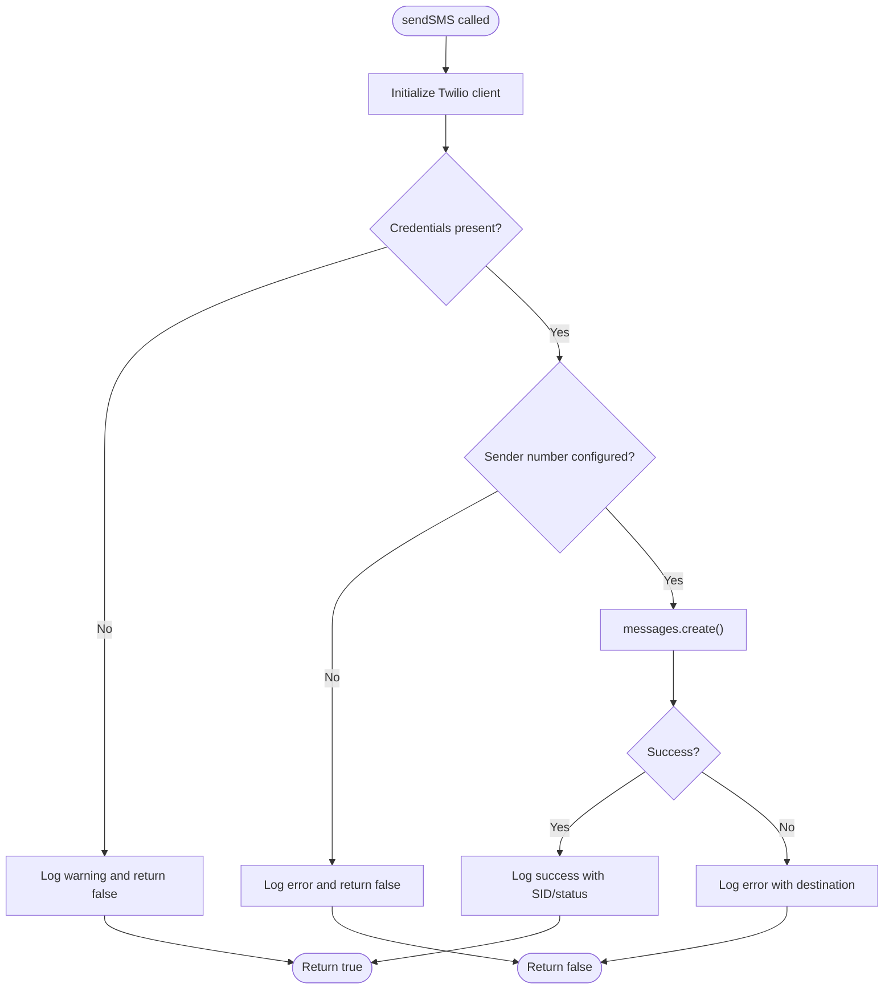
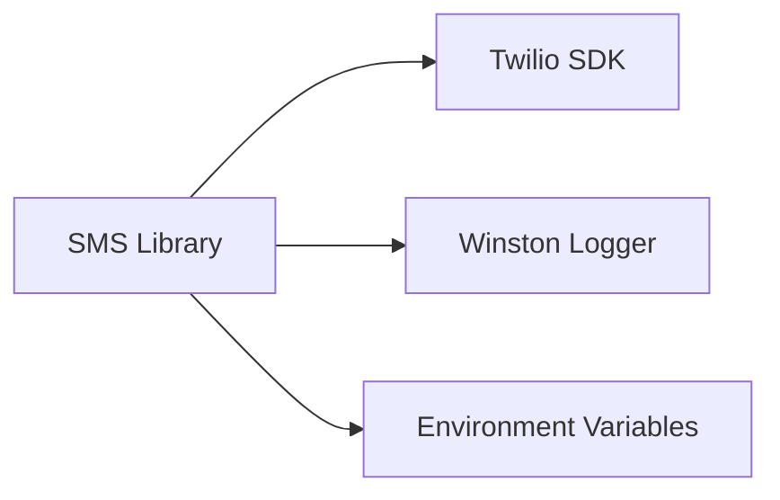

# SMS Service

<cite>
**Referenced Files in This Document**
- [sms.ts](file://restaurant-backend/src/lib/sms.ts)
- [env.d.ts](file://restaurant-backend/src/types/env.d.ts)
- [logger.ts](file://restaurant-backend/src/utils/logger.ts)
- [app.ts](file://restaurant-backend/src/app.ts)
- [errorHandler.ts](file://restaurant-backend/src/middleware/errorHandler.ts)
- [orders.ts](file://restaurant-backend/src/routes/orders.ts)
- [invoices.js](file://restaurant-backend/dist/routes/invoices.js)
- [package.json](file://restaurant-backend/package.json)
</cite>

## Table of Contents
1. [Introduction](#introduction)
2. [Project Structure](#project-structure)
3. [Core Components](#core-components)
4. [Architecture Overview](#architecture-overview)
5. [Detailed Component Analysis](#detailed-component-analysis)
6. [Dependency Analysis](#dependency-analysis)
7. [Performance Considerations](#performance-considerations)
8. [Troubleshooting Guide](#troubleshooting-guide)
9. [Conclusion](#conclusion)

## Introduction
This document describes the SMS service implementation for DeQ-Bite’s notification and alert system. It covers Twilio integration setup, API configuration, SMS template management for order notifications and administrative alerts, and the end-to-end SMS sending workflow. It also documents international SMS considerations, formatting and encoding, error handling, configuration options for alternate providers, and operational guidance for reliability, cost optimization, and compliance.

## Project Structure
The SMS service is implemented as a focused library module with supporting configuration and logging utilities. The primary integration points are:
- Twilio client initialization and message sending
- Environment variable configuration for credentials and sender number
- Logging for observability
- Optional integration points in order and invoice workflows

**Diagram sources**
- [sms.ts:1-131](file://restaurant-backend/src/lib/sms.ts#L1-L131)
- [env.d.ts:16-18](file://restaurant-backend/src/types/env.d.ts#L16-L18)
- [logger.ts:1-56](file://restaurant-backend/src/utils/logger.ts#L1-L56)
- [app.ts:67-77](file://restaurant-backend/src/app.ts#L67-L77)
- [orders.ts:581-629](file://restaurant-backend/src/routes/orders.ts#L581-L629)
- [invoices.js:472-493](file://restaurant-backend/dist/routes/invoices.js#L472-L493)

**Section sources**
- [sms.ts:1-131](file://restaurant-backend/src/lib/sms.ts#L1-L131)
- [env.d.ts:16-18](file://restaurant-backend/src/types/env.d.ts#L16-L18)
- [logger.ts:1-56](file://restaurant-backend/src/utils/logger.ts#L1-L56)
- [app.ts:67-77](file://restaurant-backend/src/app.ts#L67-L77)

## Core Components
- Twilio client initialization with lazy creation and environment validation
- Unified sendSMS function with robust error logging
- Template helpers for invoice and order confirmation messages
- Environment variables for Twilio credentials and sender number
- Centralized logging for operational visibility

Key responsibilities:
- Validate Twilio configuration before attempting to send
- Enforce presence of the sender phone number
- Log success and failure outcomes with contextual metadata
- Provide convenience functions for common message types

**Section sources**
- [sms.ts:7-21](file://restaurant-backend/src/lib/sms.ts#L7-L21)
- [sms.ts:31-66](file://restaurant-backend/src/lib/sms.ts#L31-L66)
- [sms.ts:68-104](file://restaurant-backend/src/lib/sms.ts#L68-L104)
- [sms.ts:106-131](file://restaurant-backend/src/lib/sms.ts#L106-L131)
- [env.d.ts:16-18](file://restaurant-backend/src/types/env.d.ts#L16-L18)

## Architecture Overview
The SMS service integrates with the Express application and can be invoked from route handlers. The current implementation focuses on Twilio; future enhancements can introduce provider abstraction and fallback strategies.

**Diagram sources**
- [orders.ts:581-629](file://restaurant-backend/src/routes/orders.ts#L581-L629)
- [sms.ts:31-66](file://restaurant-backend/src/lib/sms.ts#L31-L66)

## Detailed Component Analysis

### Twilio Integration and Initialization
- Credentials are loaded from environment variables and validated before creating the client.
- The client is lazily initialized and reused to avoid redundant connections.
- If credentials are missing, the service logs a warning and short-circuits sending.

Operational notes:
- Ensure TWILIO_ACCOUNT_SID, TWILIO_AUTH_TOKEN, and TWILIO_PHONE_NUMBER are set.
- The sender number must be a verified Twilio number or comply with Twilio policies.

**Section sources**
- [sms.ts:7-21](file://restaurant-backend/src/lib/sms.ts#L7-L21)
- [env.d.ts:16-18](file://restaurant-backend/src/types/env.d.ts#L16-L18)

### SMS Sending Workflow
- sendSMS accepts destination and message body, validates configuration, and attempts to send.
- On success, logs the message SID and status; on failure, logs the error with destination context.
- Returns a boolean indicating success or failure.

**Diagram sources**
- [sms.ts:31-66](file://restaurant-backend/src/lib/sms.ts#L31-L66)

**Section sources**
- [sms.ts:31-66](file://restaurant-backend/src/lib/sms.ts#L31-L66)

### Template Management
- Invoice template: Generates a localized message including customer name, invoice number, amount, and restaurant name.
- Order confirmation template: Includes customer name, order ID, amount, table number, and restaurant name.

Usage:
- These templates are consumed by dedicated functions that call sendSMS with the constructed message.

Formatting considerations:
- Messages are plain text; ensure content length aligns with carrier limits.
- Currency and numeric formatting are handled via standard formatting.

**Section sources**
- [sms.ts:68-84](file://restaurant-backend/src/lib/sms.ts#L68-L84)
- [sms.ts:86-104](file://restaurant-backend/src/lib/sms.ts#L86-L104)
- [sms.ts:106-131](file://restaurant-backend/src/lib/sms.ts#L106-L131)

### Integration Points
- Orders route: Status transitions and lifecycle events are logged and could trigger SMS notifications in future implementations.
- Invoices route: Delivery warnings explicitly check for SMS delivery status and provide actionable feedback.

Operational implications:
- Current order workflow does not automatically send SMS; integration would involve invoking sendSMS during relevant state changes.
- Invoice delivery warnings demonstrate how SMS failures are surfaced to callers.

**Section sources**
- [orders.ts:581-629](file://restaurant-backend/src/routes/orders.ts#L581-L629)
- [invoices.js:472-493](file://restaurant-backend/dist/routes/invoices.js#L472-L493)

### Provider Abstraction and Fallback Strategy
Current state:
- The implementation is tightly coupled to Twilio via the Twilio SDK.

Recommended enhancements:
- Introduce an SMS provider interface with implementations for Twilio and other providers.
- Add a fallback mechanism that retries failed sends against an alternate provider.
- Centralize provider selection and routing logic.

[No sources needed since this section proposes conceptual improvements]

### International SMS Support and Formatting
- Character encoding: The Twilio SDK handles GSM-7 and Unicode as needed; ensure messages use standard Unicode for international characters.
- Long messages: Twilio concatenates messages exceeding 160 characters; monitor concatenated segments for cost and delivery behavior.
- Sender number: Use a local or toll-free number appropriate for target regions; verify carrier permissions.

[No sources needed since this section provides general guidance]

### Cost Optimization and Rate Limiting
- Monitor message pricing per region and optimize message length.
- Batch sends are not currently implemented; consider queueing and batch APIs where supported.
- Rate limiting: The application enforces general API rate limiting; SMS providers may impose separate limits.

**Section sources**
- [app.ts:67-77](file://restaurant-backend/src/app.ts#L67-L77)

### Compliance and Best Practices
- Include opt-out mechanisms and unsubscribe links where applicable.
- Avoid promotional content without consent; adhere to TCPA, CASL, and regional regulations.
- Log and monitor delivery failures for compliance reporting.

[No sources needed since this section provides general guidance]

## Dependency Analysis
The SMS library depends on:
- Twilio SDK for messaging
- Winston logger for structured logging
- Environment configuration for credentials and sender number

**Diagram sources**
- [sms.ts:1-2](file://restaurant-backend/src/lib/sms.ts#L1-L2)
- [package.json:42-42](file://restaurant-backend/package.json#L42-L42)
- [logger.ts:1-56](file://restaurant-backend/src/utils/logger.ts#L1-L56)
- [env.d.ts:16-18](file://restaurant-backend/src/types/env.d.ts#L16-L18)

**Section sources**
- [package.json:42-42](file://restaurant-backend/package.json#L42-L42)
- [sms.ts:1-2](file://restaurant-backend/src/lib/sms.ts#L1-L2)
- [logger.ts:1-56](file://restaurant-backend/src/utils/logger.ts#L1-L56)
- [env.d.ts:16-18](file://restaurant-backend/src/types/env.d.ts#L16-L18)

## Performance Considerations
- Asynchronous sendSMS ensures non-blocking operation; consider queuing for high-volume scenarios.
- Reuse the initialized Twilio client to minimize overhead.
- Monitor Twilio API latency and throughput; implement circuit breakers if needed.

[No sources needed since this section provides general guidance]

## Troubleshooting Guide
Common issues and resolutions:
- Missing credentials: If TWILIO_ACCOUNT_SID or TWILIO_AUTH_TOKEN are not set, the service logs a warning and returns false. Verify environment configuration.
- Missing sender number: If TWILIO_PHONE_NUMBER is not set, the service logs an error and returns false. Ensure a valid sender number is configured.
- Invalid destination or carrier restrictions: Twilio errors are logged with the destination context; inspect logs for detailed error messages.
- Delivery failures: Logs capture error messages and destination; correlate with Twilio message SID for diagnostics.

Operational checks:
- Confirm environment variables are loaded by the runtime.
- Review Winston logs for structured entries with timestamps and service metadata.
- Use errorHandler middleware to surface errors consistently.

**Section sources**
- [sms.ts:7-21](file://restaurant-backend/src/lib/sms.ts#L7-L21)
- [sms.ts:31-66](file://restaurant-backend/src/lib/sms.ts#L31-L66)
- [logger.ts:50-56](file://restaurant-backend/src/utils/logger.ts#L50-L56)
- [errorHandler.ts:22-82](file://restaurant-backend/src/middleware/errorHandler.ts#L22-L82)

## Conclusion
The current SMS service provides a reliable foundation for sending notifications via Twilio with strong error handling and logging. To evolve toward a production-grade notification system, integrate SMS triggers into order and invoice workflows, implement provider abstraction and fallbacks, and adopt queueing and batching for scalability. Adhere to international carrier policies, optimize costs, and maintain robust monitoring and compliance practices.