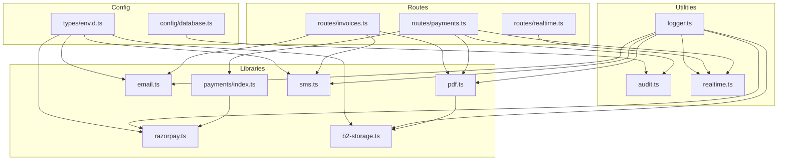
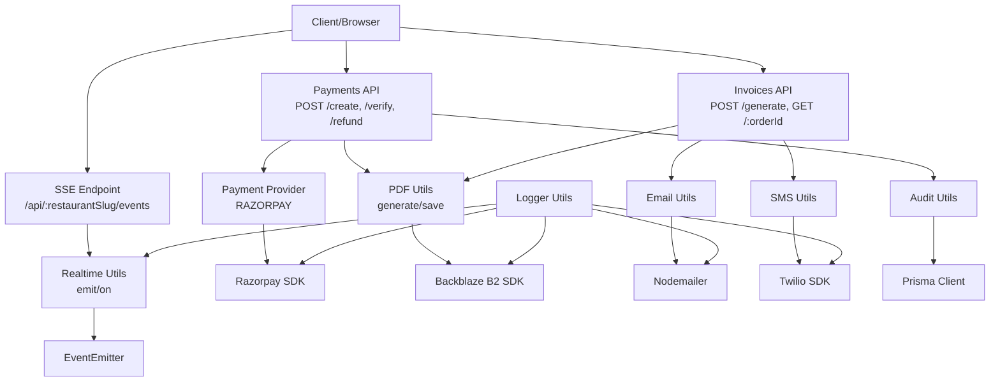
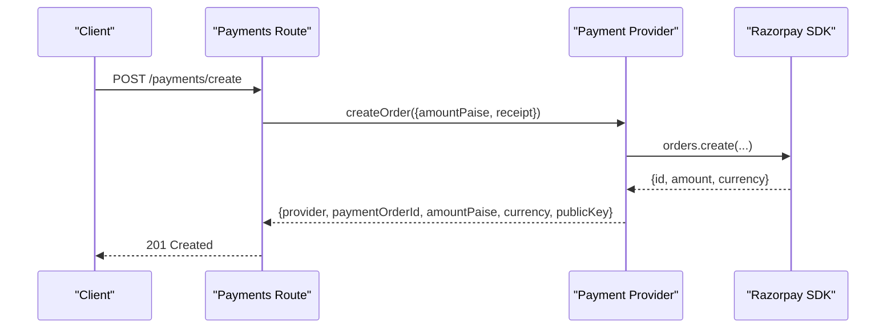
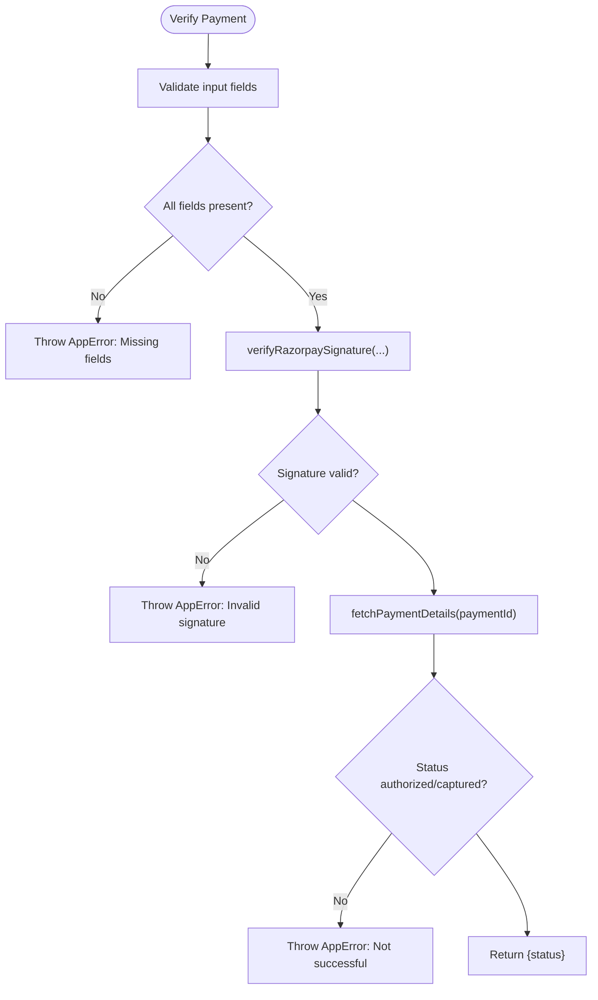
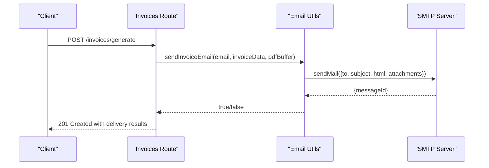
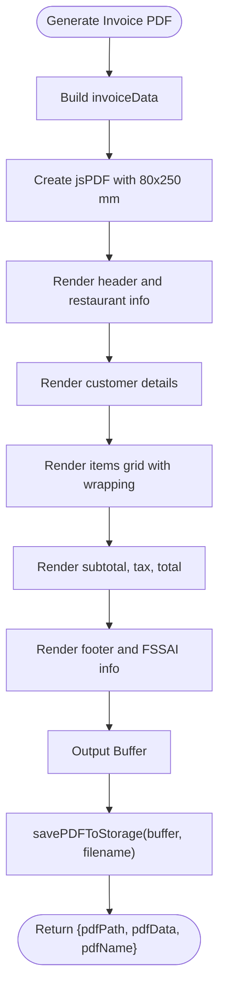
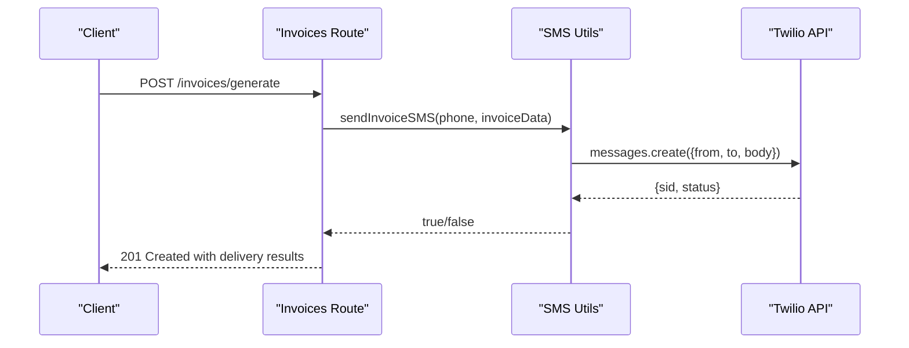
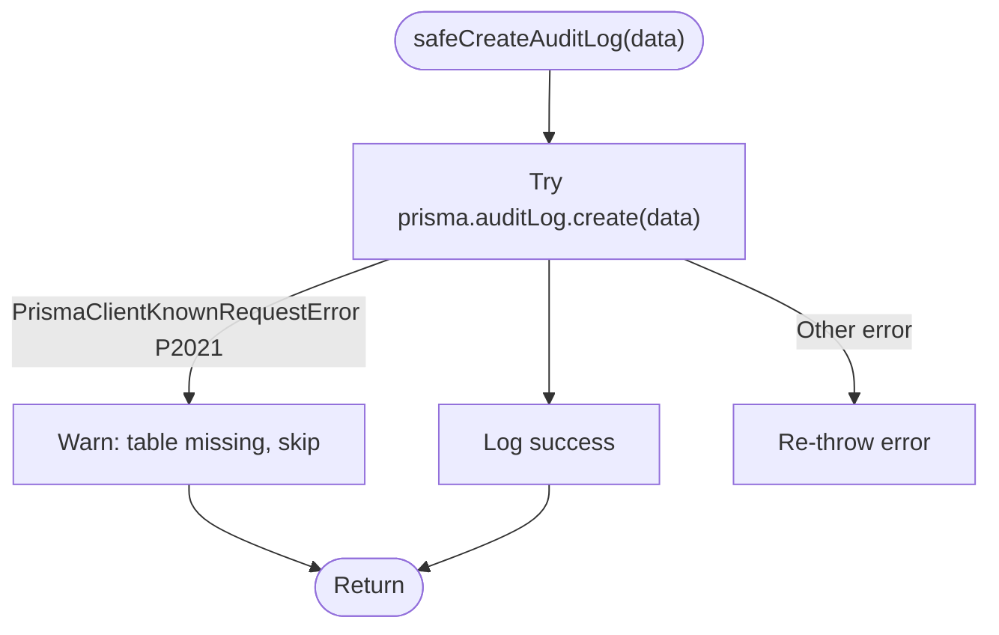
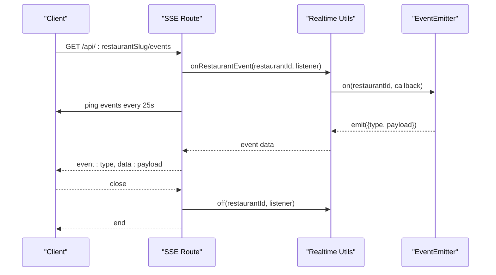
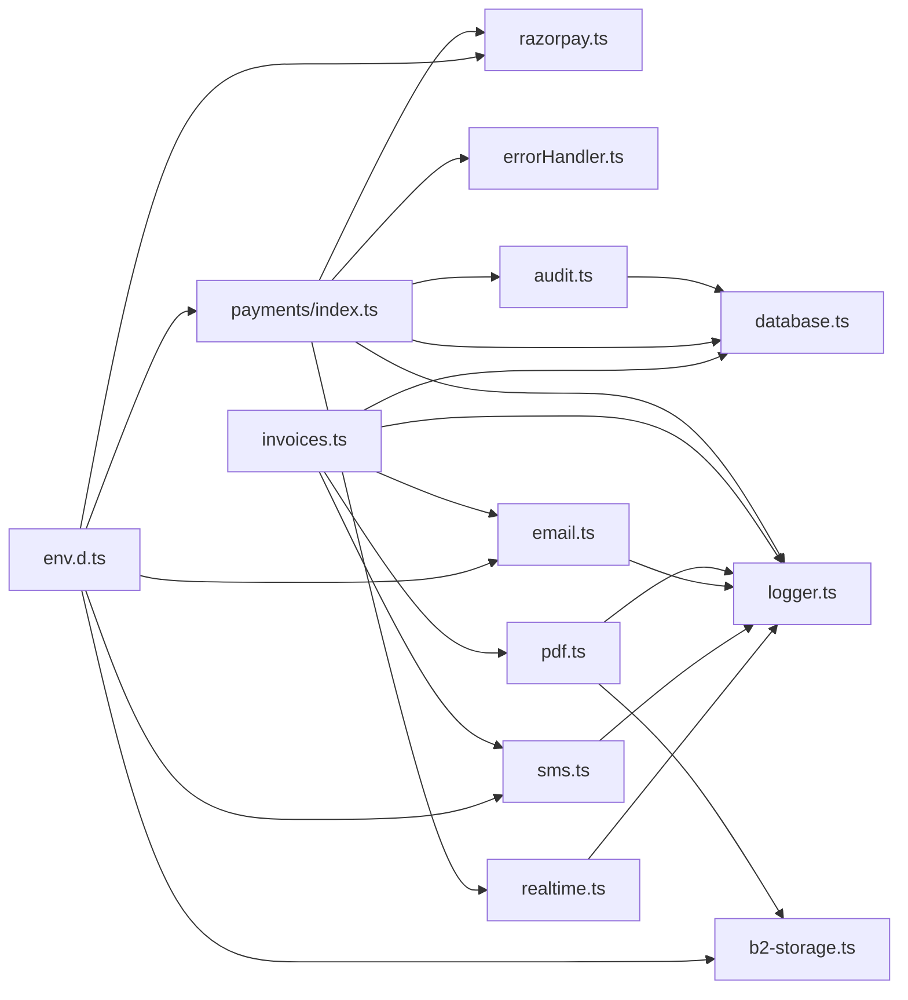

# Utility Libraries

<cite>
**Referenced Files in This Document**
- [payments/index.ts](file://restaurant-backend/src/lib/payments/index.ts)
- [razorpay.ts](file://restaurant-backend/src/lib/razorpay.ts)
- [email.ts](file://restaurant-backend/src/lib/email.ts)
- [pdf.ts](file://restaurant-backend/src/lib/pdf.ts)
- [sms.ts](file://restaurant-backend/src/lib/sms.ts)
- [b2-storage.ts](file://restaurant-backend/src/lib/b2-storage.ts)
- [audit.ts](file://restaurant-backend/src/utils/audit.ts)
- [realtime.ts](file://restaurant-backend/src/utils/realtime.ts)
- [logger.ts](file://restaurant-backend/src/utils/logger.ts)
- [errorHandler.ts](file://restaurant-backend/src/middleware/errorHandler.ts)
- [database.ts](file://restaurant-backend/src/config/database.ts)
- [env.d.ts](file://restaurant-backend/src/types/env.d.ts)
- [payments route](file://restaurant-backend/src/routes/payments.ts)
- [invoices route](file://restaurant-backend/src/routes/invoices.ts)
- [realtime SSE route](file://restaurant-backend/src/routes/realtime.ts)
</cite>

## Table of Contents
1. [Introduction](#introduction)
2. [Project Structure](#project-structure)
3. [Core Components](#core-components)
4. [Architecture Overview](#architecture-overview)
5. [Detailed Component Analysis](#detailed-component-analysis)
6. [Dependency Analysis](#dependency-analysis)
7. [Performance Considerations](#performance-considerations)
8. [Troubleshooting Guide](#troubleshooting-guide)
9. [Conclusion](#conclusion)
10. [Appendices](#appendices)

## Introduction
This document describes the utility libraries that power DeQ-Bite’s backend services. It covers:
- Payment processing with Razorpay integration, verification, and refunds
- Email service using Nodemailer with templates and delivery tracking
- PDF generation for invoices, styling, and Backblaze B2 storage integration
- SMS notifications via Twilio with templated messages
- Audit logging for compliance and activity monitoring
- Real-time communication via Server-Sent Events (SSE)
- Error handling, retry strategies, and fallbacks for external services
- Configuration management and environment-specific settings
- Modular design enabling provider replacement and extensibility

## Project Structure
The utility libraries are organized under src/lib and src/utils, with routes wiring them into the application. Environment variables are declared in src/types/env.d.ts and consumed across utilities.



**Diagram sources**
- [payments/index.ts:1-124](file://restaurant-backend/src/lib/payments/index.ts#L1-L124)
- [razorpay.ts:1-219](file://restaurant-backend/src/lib/razorpay.ts#L1-L219)
- [email.ts:1-227](file://restaurant-backend/src/lib/email.ts#L1-L227)
- [pdf.ts:1-293](file://restaurant-backend/src/lib/pdf.ts#L1-L293)
- [sms.ts:1-131](file://restaurant-backend/src/lib/sms.ts#L1-L131)
- [b2-storage.ts:1-285](file://restaurant-backend/src/lib/b2-storage.ts#L1-L285)
- [audit.ts:1-17](file://restaurant-backend/src/utils/audit.ts#L1-L17)
- [realtime.ts:1-23](file://restaurant-backend/src/utils/realtime.ts#L1-L23)
- [logger.ts:1-56](file://restaurant-backend/src/utils/logger.ts#L1-L56)
- [payments route:1-731](file://restaurant-backend/src/routes/payments.ts#L1-L731)
- [invoices route:1-599](file://restaurant-backend/src/routes/invoices.ts#L1-L599)
- [realtime SSE route:1-40](file://restaurant-backend/src/routes/realtime.ts#L1-L40)
- [database.ts:1-66](file://restaurant-backend/src/config/database.ts#L1-L66)
- [env.d.ts:1-39](file://restaurant-backend/src/types/env.d.ts#L1-L39)

**Section sources**
- [payments/index.ts:1-124](file://restaurant-backend/src/lib/payments/index.ts#L1-L124)
- [email.ts:1-227](file://restaurant-backend/src/lib/email.ts#L1-L227)
- [pdf.ts:1-293](file://restaurant-backend/src/lib/pdf.ts#L1-L293)
- [sms.ts:1-131](file://restaurant-backend/src/lib/sms.ts#L1-L131)
- [b2-storage.ts:1-285](file://restaurant-backend/src/lib/b2-storage.ts#L1-L285)
- [audit.ts:1-17](file://restaurant-backend/src/utils/audit.ts#L1-L17)
- [realtime.ts:1-23](file://restaurant-backend/src/utils/realtime.ts#L1-L23)
- [logger.ts:1-56](file://restaurant-backend/src/utils/logger.ts#L1-L56)
- [payments route:1-731](file://restaurant-backend/src/routes/payments.ts#L1-L731)
- [invoices route:1-599](file://restaurant-backend/src/routes/invoices.ts#L1-L599)
- [realtime SSE route:1-40](file://restaurant-backend/src/routes/realtime.ts#L1-L40)
- [database.ts:1-66](file://restaurant-backend/src/config/database.ts#L1-L66)
- [env.d.ts:1-39](file://restaurant-backend/src/types/env.d.ts#L1-L39)

## Core Components
- Payment Provider Abstraction: A provider interface supports pluggable payment gateways (currently Razorpay implemented; Paytm/PhonePe placeholders).
- Razorpay Integration: Creates orders, verifies signatures, captures payments, issues refunds, and validates webhooks.
- Email Service: Sends HTML emails with optional PDF attachments using Nodemailer and includes invoice templates.
- PDF Generation: Produces DIN A4-equivalent receipts in 80mm width, styled with jsPDF; integrates with Backblaze B2 for storage.
- SMS Service: Sends SMS via Twilio with configurable sender number and templated messages.
- Audit Logging: Writes audit logs safely to the database with graceful degradation if migrations are pending.
- Real-time Events: SSE endpoint emitting restaurant-scoped events using an internal event emitter.
- Error Handling: Centralized AppError and Express error handler with environment-aware logging and response shaping.
- Configuration: Strongly typed environment variables for all providers and services.

**Section sources**
- [payments/index.ts:32-124](file://restaurant-backend/src/lib/payments/index.ts#L32-L124)
- [razorpay.ts:33-219](file://restaurant-backend/src/lib/razorpay.ts#L33-L219)
- [email.ts:31-227](file://restaurant-backend/src/lib/email.ts#L31-L227)
- [pdf.ts:36-293](file://restaurant-backend/src/lib/pdf.ts#L36-L293)
- [sms.ts:31-131](file://restaurant-backend/src/lib/sms.ts#L31-L131)
- [audit.ts:5-17](file://restaurant-backend/src/utils/audit.ts#L5-L17)
- [realtime.ts:12-23](file://restaurant-backend/src/utils/realtime.ts#L12-L23)
- [errorHandler.ts:9-82](file://restaurant-backend/src/middleware/errorHandler.ts#L9-L82)
- [env.d.ts:3-35](file://restaurant-backend/src/types/env.d.ts#L3-L35)

## Architecture Overview
The system follows a layered architecture:
- Routes orchestrate business flows and call utility libraries.
- Utilities encapsulate third-party integrations and local concerns.
- Logger centralizes structured logging across all utilities.
- Config module initializes Prisma and environment-aware behavior.
- Audit and real-time utilities provide cross-cutting concerns.



**Diagram sources**
- [payments route:195-407](file://restaurant-backend/src/routes/payments.ts#L195-L407)
- [invoices route:21-241](file://restaurant-backend/src/routes/invoices.ts#L21-L241)
- [realtime SSE route:9-37](file://restaurant-backend/src/routes/realtime.ts#L9-L37)
- [payments/index.ts:40-81](file://restaurant-backend/src/lib/payments/index.ts#L40-L81)
- [pdf.ts:36-186](file://restaurant-backend/src/lib/pdf.ts#L36-L186)
- [email.ts:31-61](file://restaurant-backend/src/lib/email.ts#L31-L61)
- [sms.ts:31-66](file://restaurant-backend/src/lib/sms.ts#L31-L66)
- [audit.ts:5-17](file://restaurant-backend/src/utils/audit.ts#L5-L17)
- [realtime.ts:12-23](file://restaurant-backend/src/utils/realtime.ts#L12-L23)
- [razorpay.ts:33-60](file://restaurant-backend/src/lib/razorpay.ts#L33-L60)
- [b2-storage.ts:76-122](file://restaurant-backend/src/lib/b2-storage.ts#L76-L122)
- [logger.ts:50-56](file://restaurant-backend/src/utils/logger.ts#L50-L56)

## Detailed Component Analysis

### Payment Processing Library (Razorpay)
Implements a provider abstraction with:
- Provider selection and enablement checks
- Order creation, signature verification, payment capture, refund issuance, and webhook signature validation
- Robust error handling and logging

```mermaid
classDiagram
class PaymentProvider {
+provider : PaymentProviderType
+isEnabled() boolean
+createOrder(input) CreatePaymentResult
+verifyPayment(input) { status }
+refund(paymentId, amountPaise?, reason?) any
}
class RazorpayProvider {
+isEnabled() boolean
+createOrder(input) CreatePaymentResult
+verifyPayment(input) { status }
+refund(paymentId, amountPaise?, reason?) any
}
PaymentProvider <|.. RazorpayProvider
```

**Diagram sources**
- [payments/index.ts:32-81](file://restaurant-backend/src/lib/payments/index.ts#L32-L81)
- [razorpay.ts:33-169](file://restaurant-backend/src/lib/razorpay.ts#L33-L169)



**Diagram sources**
- [payments route:195-292](file://restaurant-backend/src/routes/payments.ts#L195-L292)
- [payments/index.ts:40-61](file://restaurant-backend/src/lib/payments/index.ts#L40-L61)
- [razorpay.ts:33-60](file://restaurant-backend/src/lib/razorpay.ts#L33-L60)



**Diagram sources**
- [payments/index.ts:60-77](file://restaurant-backend/src/lib/payments/index.ts#L60-L77)
- [razorpay.ts:65-105](file://restaurant-backend/src/lib/razorpay.ts#L65-L105)
- [razorpay.ts:174-195](file://restaurant-backend/src/lib/razorpay.ts#L174-L195)

Key capabilities:
- Signature verification and HMAC comparison
- Webhook signature validation
- Payment capture and refund with optional amount and reason
- Structured logging with timing and error contexts

**Section sources**
- [payments/index.ts:1-124](file://restaurant-backend/src/lib/payments/index.ts#L1-L124)
- [razorpay.ts:1-219](file://restaurant-backend/src/lib/razorpay.ts#L1-L219)
- [payments route:294-407](file://restaurant-backend/src/routes/payments.ts#L294-L407)

### Email Service (Nodemailer)
Provides:
- Transport configuration from environment
- Generic email sending with optional PDF attachments
- Invoice email template generation
- Delivery result tracking



**Diagram sources**
- [invoices route:145-172](file://restaurant-backend/src/routes/invoices.ts#L145-L172)
- [email.ts:31-61](file://restaurant-backend/src/lib/email.ts#L31-L61)
- [email.ts:200-227](file://restaurant-backend/src/lib/email.ts#L200-L227)

Template highlights:
- Responsive HTML with embedded styles
- Dynamic invoice data injection
- Attachment of PDF buffer

**Section sources**
- [email.ts:1-227](file://restaurant-backend/src/lib/email.ts#L1-L227)
- [invoices route:145-172](file://restaurant-backend/src/routes/invoices.ts#L145-L172)

### PDF Generation Library
Features:
- Generates DIN A4-equivalent receipts in 80mm width using jsPDF
- Includes restaurant branding, customer details, items, taxes, totals
- Stores PDFs to Backblaze B2 with public URL generation
- Downloads and cleans up old invoices



**Diagram sources**
- [pdf.ts:36-186](file://restaurant-backend/src/lib/pdf.ts#L36-L186)
- [pdf.ts:190-225](file://restaurant-backend/src/lib/pdf.ts#L190-L225)

Storage integration:
- Uploads with invoices/ prefix
- Public URL generation via custom domain or native B2 URL
- Listing, downloading, deleting, and cleanup of old files

**Section sources**
- [pdf.ts:1-293](file://restaurant-backend/src/lib/pdf.ts#L1-L293)
- [b2-storage.ts:76-144](file://restaurant-backend/src/lib/b2-storage.ts#L76-L144)
- [b2-storage.ts:151-209](file://restaurant-backend/src/lib/b2-storage.ts#L151-L209)
- [b2-storage.ts:216-261](file://restaurant-backend/src/lib/b2-storage.ts#L216-L261)

### SMS Service (Twilio)
Capabilities:
- Initializes Twilio client from environment
- Sends SMS with templated messages
- Provides invoice and order confirmation templates
- Graceful fallback when credentials are missing



**Diagram sources**
- [invoices route:161-172](file://restaurant-backend/src/routes/invoices.ts#L161-L172)
- [sms.ts:31-66](file://restaurant-backend/src/lib/sms.ts#L31-L66)
- [sms.ts:89-104](file://restaurant-backend/src/lib/sms.ts#L89-L104)

**Section sources**
- [sms.ts:1-131](file://restaurant-backend/src/lib/sms.ts#L1-L131)
- [invoices route:161-172](file://restaurant-backend/src/routes/invoices.ts#L161-L172)

### Audit Logging System
Ensures compliance and activity monitoring:
- Safe creation of audit logs with Prisma
- Graceful handling when the audit log table is missing (migration not yet applied)
- Used across payment flows to record actions and metadata



**Diagram sources**
- [audit.ts:5-17](file://restaurant-backend/src/utils/audit.ts#L5-L17)

**Section sources**
- [audit.ts:1-17](file://restaurant-backend/src/utils/audit.ts#L1-L17)
- [payments route:376-388](file://restaurant-backend/src/routes/payments.ts#L376-L388)
- [payments route:470-482](file://restaurant-backend/src/routes/payments.ts#L470-L482)

### Real-time Communication (SSE)
Provides live updates to clients:
- SSE endpoint emits restaurant-scoped events
- Keeps connection alive with periodic pings
- Listens to internal event emitter and streams events



**Diagram sources**
- [realtime SSE route:9-37](file://restaurant-backend/src/routes/realtime.ts#L9-L37)
- [realtime.ts:12-23](file://restaurant-backend/src/utils/realtime.ts#L12-L23)

**Section sources**
- [realtime.ts:1-23](file://restaurant-backend/src/utils/realtime.ts#L1-L23)
- [realtime SSE route:1-40](file://restaurant-backend/src/routes/realtime.ts#L1-L40)

## Dependency Analysis
External and internal dependencies:
- Payment Provider depends on Razorpay SDK and environment variables
- PDF depends on jsPDF and Backblaze B2 SDK
- Email depends on Nodemailer
- SMS depends on Twilio SDK
- Audit depends on Prisma Client
- Logger depends on Winston
- Routes depend on utilities and enforce validation and authorization



**Diagram sources**
- [payments/index.ts:1-124](file://restaurant-backend/src/lib/payments/index.ts#L1-L124)
- [razorpay.ts:1-219](file://restaurant-backend/src/lib/razorpay.ts#L1-L219)
- [email.ts:1-227](file://restaurant-backend/src/lib/email.ts#L1-L227)
- [pdf.ts:1-293](file://restaurant-backend/src/lib/pdf.ts#L1-L293)
- [sms.ts:1-131](file://restaurant-backend/src/lib/sms.ts#L1-L131)
- [b2-storage.ts:1-285](file://restaurant-backend/src/lib/b2-storage.ts#L1-L285)
- [audit.ts:1-17](file://restaurant-backend/src/utils/audit.ts#L1-L17)
- [realtime.ts:1-23](file://restaurant-backend/src/utils/realtime.ts#L1-L23)
- [errorHandler.ts:1-82](file://restaurant-backend/src/middleware/errorHandler.ts#L1-L82)
- [database.ts:1-66](file://restaurant-backend/src/config/database.ts#L1-L66)
- [env.d.ts:1-39](file://restaurant-backend/src/types/env.d.ts#L1-L39)

**Section sources**
- [payments/index.ts:1-124](file://restaurant-backend/src/lib/payments/index.ts#L1-L124)
- [pdf.ts:1-293](file://restaurant-backend/src/lib/pdf.ts#L1-L293)
- [email.ts:1-227](file://restaurant-backend/src/lib/email.ts#L1-L227)
- [sms.ts:1-131](file://restaurant-backend/src/lib/sms.ts#L1-L131)
- [b2-storage.ts:1-285](file://restaurant-backend/src/lib/b2-storage.ts#L1-L285)
- [audit.ts:1-17](file://restaurant-backend/src/utils/audit.ts#L1-L17)
- [realtime.ts:1-23](file://restaurant-backend/src/utils/realtime.ts#L1-L23)
- [errorHandler.ts:1-82](file://restaurant-backend/src/middleware/errorHandler.ts#L1-L82)
- [database.ts:1-66](file://restaurant-backend/src/config/database.ts#L1-L66)
- [env.d.ts:1-39](file://restaurant-backend/src/types/env.d.ts#L1-L39)

## Performance Considerations
- Logging includes timing metrics for order creation and payment fetch operations to aid profiling.
- PDF generation uses efficient text wrapping and minimal styling to reduce rendering overhead.
- SSE keeps connections alive with periodic pings to prevent timeouts and maintain responsiveness.
- Backblaze B2 operations are optimized with pre-fetched upload URLs and batched listing for cleanup.
- Prisma logging is reduced in production to minimize I/O overhead.

[No sources needed since this section provides general guidance]

## Troubleshooting Guide
Common issues and resolutions:
- Payment signature mismatch: Verify shared secret and signature composition; check logs for partial signature hashes.
- Razorpay credentials missing: Ensure RAZORPAY_KEY_ID and RAZORPAY_KEY_SECRET are set; provider will be disabled otherwise.
- Email delivery failures: Confirm SMTP_HOST, SMTP_PORT, SMTP_USER, SMTP_PASS; verify recipient email availability.
- SMS delivery failures: Ensure TWILIO_ACCOUNT_SID, TWILIO_AUTH_TOKEN, and TWILIO_PHONE_NUMBER are configured.
- PDF storage failures: Validate B2 credentials and bucket configuration; check public URL generation.
- Audit log table missing: Apply migrations; the system will skip writes gracefully until the table exists.
- SSE connection drops: Check server configuration for keep-alive and proxy buffering; ensure client handles reconnects.

**Section sources**
- [razorpay.ts:9-18](file://restaurant-backend/src/lib/razorpay.ts#L9-L18)
- [email.ts:5-15](file://restaurant-backend/src/lib/email.ts#L5-L15)
- [sms.ts:7-21](file://restaurant-backend/src/lib/sms.ts#L7-L21)
- [b2-storage.ts:11-26](file://restaurant-backend/src/lib/b2-storage.ts#L11-L26)
- [audit.ts:9-14](file://restaurant-backend/src/utils/audit.ts#L9-L14)
- [realtime SSE route:17-22](file://restaurant-backend/src/routes/realtime.ts#L17-L22)

## Conclusion
DeQ-Bite’s utility libraries provide a robust, modular foundation for payments, communications, document generation, and observability. The provider abstraction enables easy substitution of payment gateways, while centralized logging, error handling, and configuration ensure reliability and maintainability. The real-time SSE channel and audit logging support operational excellence and compliance.

[No sources needed since this section summarizes without analyzing specific files]

## Appendices

### Configuration Management and Environment Variables
Environment variables are strongly typed and used across utilities:
- Payment: RAZORPAY_KEY_ID, RAZORPAY_KEY_SECRET, RAZORPAY_WEBHOOK_SECRET
- Email: SMTP_HOST, SMTP_PORT, SMTP_USER, SMTP_PASS, APP_NAME
- SMS: TWILIO_ACCOUNT_SID, TWILIO_AUTH_TOKEN, TWILIO_PHONE_NUMBER
- Storage: B2_APPLICATION_KEY_ID, B2_APPLICATION_KEY, B2_BUCKET_ID or B2_BUCKET_NAME, B2_CUSTOM_DOMAIN
- Database: DATABASE_URL (with optional prisma+ acceleration)
- Logging: LOG_LEVEL

**Section sources**
- [env.d.ts:3-35](file://restaurant-backend/src/types/env.d.ts#L3-L35)
- [database.ts:4-27](file://restaurant-backend/src/config/database.ts#L4-L27)
- [razorpay.ts:200-218](file://restaurant-backend/src/lib/razorpay.ts#L200-L218)
- [email.ts:5-15](file://restaurant-backend/src/lib/email.ts#L5-L15)
- [sms.ts:7-21](file://restaurant-backend/src/lib/sms.ts#L7-L21)
- [b2-storage.ts:11-26](file://restaurant-backend/src/lib/b2-storage.ts#L11-L26)

### Testing Approaches
Recommended testing strategies:
- Unit tests for utility functions with mocked SDKs and environment variables
- Integration tests for payment flows with sandbox credentials
- Contract tests for email/SMS templates against expected outputs
- Load tests for PDF generation and B2 uploads
- Health checks for SSE connectivity and event emission
- Audit log assertions after payment and invoice operations

[No sources needed since this section provides general guidance]