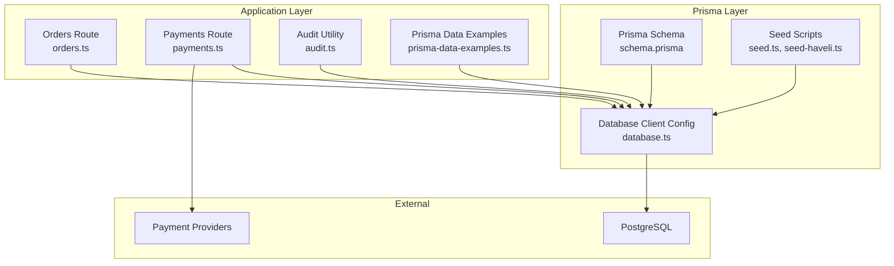
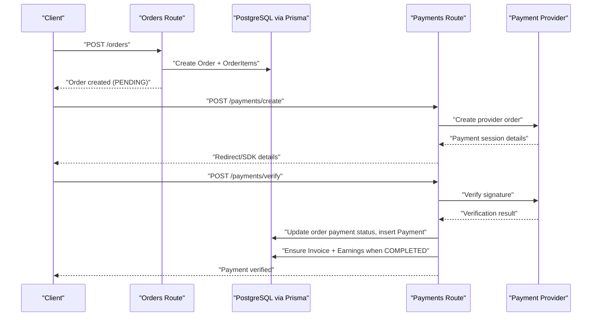
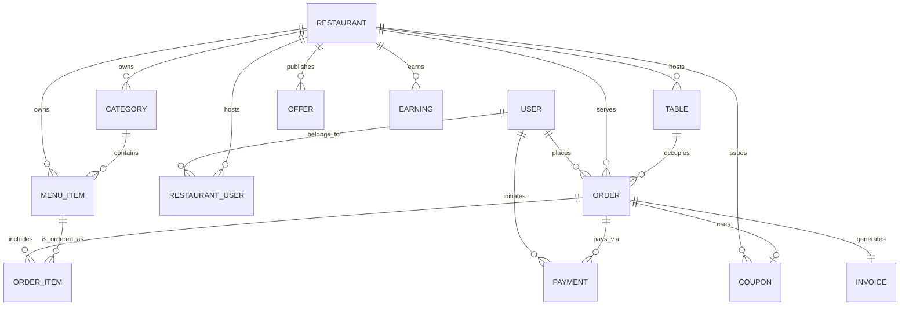
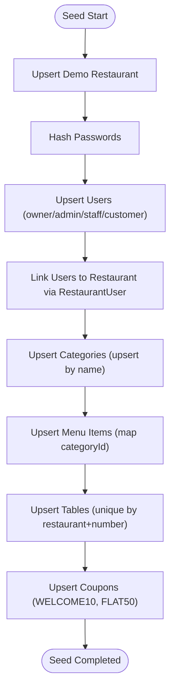
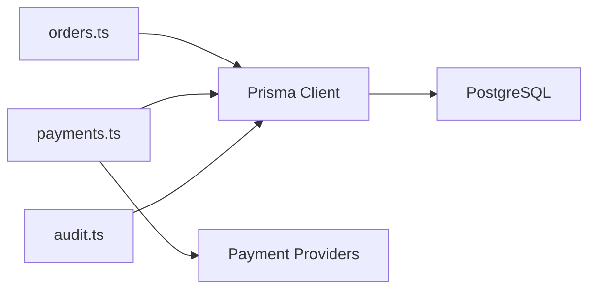

# Database Design

<cite>
**Referenced Files in This Document**
- [schema.prisma](file://restaurant-backend/prisma/schema.prisma)
- [seed.ts](file://restaurant-backend/prisma/seed.ts)
- [seed-haveli.ts](file://restaurant-backend/prisma/seed-haveli.ts)
- [sampleData.ts](file://restaurant-backend/src/lib/sampleData.ts)
- [database.ts](file://restaurant-backend/src/config/database.ts)
- [audit.ts](file://restaurant-backend/src/utils/audit.ts)
- [orders.ts](file://restaurant-backend/src/routes/orders.ts)
- [payments.ts](file://restaurant-backend/src/routes/payments.ts)
- [prisma-data-examples.ts](file://restaurant-backend/src/utils/prisma-data-examples.ts)
- [package.json](file://restaurant-backend/package.json)
</cite>

## Table of Contents
1. [Introduction](#introduction)
2. [Project Structure](#project-structure)
3. [Core Components](#core-components)
4. [Architecture Overview](#architecture-overview)
5. [Detailed Component Analysis](#detailed-component-analysis)
6. [Dependency Analysis](#dependency-analysis)
7. [Performance Considerations](#performance-considerations)
8. [Troubleshooting Guide](#troubleshooting-guide)
9. [Conclusion](#conclusion)
10. [Appendices](#appendices)

## Introduction
This document describes the DeQ-Bite restaurant management database built with PostgreSQL and Prisma ORM. It covers the entity-relationship model, Prisma schema definitions, migration and seeding strategies, indexing and referential integrity, data modeling for restaurant management, ordering, and payment processing, performance considerations, caching strategies, data lifecycle and retention, security and audit, and practical ER diagrams and sample data references for development and testing.

## Project Structure
The database layer is primarily defined in the Prisma schema and supported by seed scripts and runtime utilities. The backend uses Prisma Client to connect to PostgreSQL, with optional acceleration support and robust logging.

**Diagram sources**
- [schema.prisma](file://restaurant-backend/prisma/schema.prisma#L1-L384)
- [seed.ts](file://restaurant-backend/prisma/seed.ts#L1-L288)
- [seed-haveli.ts](file://restaurant-backend/prisma/seed-haveli.ts#L1-L156)
- [database.ts](file://restaurant-backend/src/config/database.ts#L1-L66)
- [orders.ts](file://restaurant-backend/src/routes/orders.ts#L1-L694)
- [payments.ts](file://restaurant-backend/src/routes/payments.ts#L1-L731)
- [audit.ts](file://restaurant-backend/src/utils/audit.ts#L1-L17)
- [prisma-data-examples.ts](file://restaurant-backend/src/utils/prisma-data-examples.ts#L1-L236)

**Section sources**
- [schema.prisma](file://restaurant-backend/prisma/schema.prisma#L1-L384)
- [database.ts](file://restaurant-backend/src/config/database.ts#L1-L66)
- [package.json](file://restaurant-backend/package.json#L6-L16)

## Core Components
- Users: Customer, admin, staff, central admin, owner, kitchen staff with roles and verification.
- Restaurants: Onboarding, status, contact info, payment collection timing, accepted methods, commission rates.
- Restaurant Users: Junction table linking users to restaurants with roles and activity.
- Categories: Menu categories per restaurant with sort order and activity.
- Menu Items: Per-restaurant items with pricing, dietary flags, allergens, spice level, availability.
- Tables: Restaurant tables with capacity and location.
- Orders: Customer orders with status, payment linkage, totals, coupons, and timing.
- Order Items: Line items linking orders to menu items with notes and prices.
- Coupons: Restaurant-specific promotional codes with type/value, limits, and validity.
- Offers: Restaurant-specific offer rules with types and applicability.
- Payments: Payment records per order with provider, method, status, and transaction IDs.
- Invoices: Generated PDF invoices per order with metadata.
- Earnings: Platform and restaurant earnings per order.
- Audit Logs: Centralized audit trail for actions and entities.

**Section sources**
- [schema.prisma](file://restaurant-backend/prisma/schema.prisma#L11-L306)

## Architecture Overview
End-to-end flow from customer order creation to payment completion and invoice/earning generation.

**Diagram sources**
- [orders.ts](file://restaurant-backend/src/routes/orders.ts#L82-L267)
- [payments.ts](file://restaurant-backend/src/routes/payments.ts#L196-L407)

## Detailed Component Analysis

### Entity-Relationship Model
Core entities and relationships are defined in the Prisma schema with explicit foreign keys and cascading deletes.

**Diagram sources**
- [schema.prisma](file://restaurant-backend/prisma/schema.prisma#L11-L306)

**Section sources**
- [schema.prisma](file://restaurant-backend/prisma/schema.prisma#L11-L306)

### Prisma Schema Definition Highlights
- Data Types and Constraints:
  - IDs: cuid() UUIDs.
  - Strings: email unique, phone unique, enums for statuses/providers/offers.
  - Money fields: stored in paise (integer) to avoid floating-point errors.
  - Arrays: cuisineTypes, acceptedPaymentMethods, allergens, ingredients.
  - Timestamps: createdAt defaults to now(), updatedAt auto-updated.
- Relationships:
  - One-to-many via relation fields and explicit foreign keys.
  - Unique constraints on composite keys (e.g., restaurantId+userId on junction).
  - Cascade deletes on parent deletion for child entities.
- Enums:
  - UserRole, RestaurantRole, CouponType, PaymentProvider, PaymentCollectionTiming, OrderStatus, PaymentStatus, SpiceLevel, InvoiceMethod, OfferType, OnboardingStatus.

**Section sources**
- [schema.prisma](file://restaurant-backend/prisma/schema.prisma#L11-L384)

### Migration Strategy
- Development migrations:
  - Command: npm run db:migrate
  - Creates and applies Prisma-managed migrations to PostgreSQL.
- Studio exploration:
  - Command: npm run db:studio
  - Opens Prisma Studio for schema and data inspection.
- Reset workflow:
  - Command: npm run db:reset
  - Resets migrations and seeds in one step.

Operational notes:
- DATABASE_URL and DIRECT_DATABASE_URL are loaded from environment variables.
- Production logging reduces verbosity; development logs queries and info.

**Section sources**
- [package.json](file://restaurant-backend/package.json#L13-L16)
- [database.ts](file://restaurant-backend/src/config/database.ts#L4-L27)

### Seed Data Implementation and Sample Data
- Main seed:
  - Creates a demo restaurant, users (owner/admin/staff/customer), assigns roles via RestaurantUser, upserts categories, menu items, tables, and coupons.
  - Converts currency to paise and maps categories to menu items.
- Haveli Dhaba import:
  - Reads a JSON file, clears existing categories/items for the demo restaurant, and imports items with derived spice levels and dietary flags.
- Sample data library:
  - Provides TypeScript arrays for categories, menu items, tables, users, and orders for frontend and backend development/testing.

**Diagram sources**
- [seed.ts](file://restaurant-backend/prisma/seed.ts#L7-L272)

**Section sources**
- [seed.ts](file://restaurant-backend/prisma/seed.ts#L1-L288)
- [seed-haveli.ts](file://restaurant-backend/prisma/seed-haveli.ts#L1-L156)
- [sampleData.ts](file://restaurant-backend/src/lib/sampleData.ts#L1-L557)

### Indexing Strategy and Referential Integrity
- Unique constraints:
  - User.email, User.phone, Restaurant.slug, Restaurant.subdomain.
  - RestaurantUser: unique(restaurantId, userId).
  - Category: unique(restaurantId, name).
  - Table: unique(restaurantId, number).
  - Coupon: unique(restaurantId, code).
  - Order: unique(paymentId) for external provider linkage.
  - Invoice: unique(orderId, invoiceNumber).
  - Earning: unique(orderId).
- Foreign Keys and Cascades:
  - RestaurantUser.restaurantId -> Restaurant.id (Cascade delete).
  - Category.restaurantId -> Restaurant.id (Cascade delete).
  - MenuItem.categoryId -> Category.id; restaurantId -> Restaurant.id (Cascade delete).
  - Table.restaurantId -> Restaurant.id (Cascade delete).
  - Order.restaurantId -> Restaurant.id (Cascade delete); tableId -> Table.id; userId -> User.id; couponId -> Coupon.id.
  - OrderItem.menuItemId -> MenuItem.id; orderId -> Order (Cascade delete).
  - Payment.orderId -> Order.id (Cascade delete).
  - Earning.restaurantId -> Restaurant.id; unique orderId.
  - AuditLog: actorUserId -> User.id; optional restaurantId.
- Additional Notes:
  - Composite unique indices are declared via @@unique in Prisma.
  - Prisma enforces referential integrity at the ORM level; PostgreSQL constraints align with these definitions.

**Section sources**
- [schema.prisma](file://restaurant-backend/prisma/schema.prisma#L11-L306)

### Data Modeling Approach
- Money Modeling:
  - All monetary values stored in paise (integer) to prevent rounding errors and simplify comparisons.
- Ordering System:
  - Orders track subtotal, discount, tax, total, paid/due amounts, and payment status.
  - Order status progression controlled by business rules (e.g., cash-before-meal constraints).
  - Coupons applied atomically with transactions; usage counts updated.
- Payment Processing:
  - Supports multiple providers (Razorpay, Paytm, PhonePe) and cash.
  - Payment records capture provider order/payment IDs and signatures.
  - Automatic invoice and earning creation upon full payment.
- Restaurant Management:
  - Commission rates and payment collection timing per restaurant.
  - Cuisine types and accepted payment methods configurable per restaurant.
  - Onboarding status and suspension reasons.

**Section sources**
- [orders.ts](file://restaurant-backend/src/routes/orders.ts#L14-L80)
- [payments.ts](file://restaurant-backend/src/routes/payments.ts#L44-L166)
- [schema.prisma](file://restaurant-backend/prisma/schema.prisma#L144-L293)

### Query Patterns and Aggregation Examples
- Comprehensive user data with orders, items, and invoice:
  - Demonstrates nested includes and aggregations.
- Menu popularity calculation:
  - Group-by orderItems to compute total ordered quantities per item.
- Spending analytics:
  - Group-by paymentStatus and monthly totals for user analytics.

**Section sources**
- [prisma-data-examples.ts](file://restaurant-backend/src/utils/prisma-data-examples.ts#L11-L235)

## Dependency Analysis
- Prisma Client connects to PostgreSQL using DATABASE_URL/DIRECT_DATABASE_URL.
- Routes depend on Prisma for data access and transactions.
- Payment routes integrate with external providers via provider adapters.
- Audit writes are resilient to missing tables using safeCreateAuditLog.

**Diagram sources**
- [orders.ts](file://restaurant-backend/src/routes/orders.ts#L1-L694)
- [payments.ts](file://restaurant-backend/src/routes/payments.ts#L1-L731)
- [audit.ts](file://restaurant-backend/src/utils/audit.ts#L1-L17)
- [database.ts](file://restaurant-backend/src/config/database.ts#L1-L66)

**Section sources**
- [orders.ts](file://restaurant-backend/src/routes/orders.ts#L1-L694)
- [payments.ts](file://restaurant-backend/src/routes/payments.ts#L1-L731)
- [audit.ts](file://restaurant-backend/src/utils/audit.ts#L1-L17)
- [database.ts](file://restaurant-backend/src/config/database.ts#L1-L66)

## Performance Considerations
- Monetary Precision:
  - Store amounts in paise (integer) to avoid floating-point inconsistencies.
- Transactions:
  - Use Prisma transactions for coupon application, order updates, and payment recording to maintain consistency.
- Aggregations:
  - Prefer Prisma groupBy for analytics to keep logic in the database layer.
- Logging:
  - Adjust Prisma log levels by environment to balance observability and overhead.
- Acceleration:
  - Optional Prisma Accelerate extension can be enabled when available.

[No sources needed since this section provides general guidance]

## Troubleshooting Guide
- Audit Log Table Absent:
  - safeCreateAuditLog catches missing table errors and logs a warning instead of failing core flows.
- Database Connectivity:
  - Verify DATABASE_URL and DIRECT_DATABASE_URL; check Prisma client initialization and environment-specific logging.
- Migration Issues:
  - Use npm run db:migrate to apply migrations; npm run db:studio to inspect schema/data; npm run db:reset to reset and re-seed.

**Section sources**
- [audit.ts](file://restaurant-backend/src/utils/audit.ts#L5-L16)
- [database.ts](file://restaurant-backend/src/config/database.ts#L4-L27)
- [package.json](file://restaurant-backend/package.json#L13-L16)

## Conclusion
The DeQ-Bite database design leverages Prisma ORM to model a restaurant ecosystem with clear entities, enforced referential integrity, and robust payment and ordering workflows. The schema, seeds, and route logic provide a solid foundation for development and production, with room for performance tuning and operational enhancements.

[No sources needed since this section summarizes without analyzing specific files]

## Appendices

### A. Sample Data References
- Sample categories, menu items, tables, users, and orders are defined in the sample data library for development and testing.
- Seed scripts import these samples and map them to the database.

**Section sources**
- [sampleData.ts](file://restaurant-backend/src/lib/sampleData.ts#L1-L557)
- [seed.ts](file://restaurant-backend/prisma/seed.ts#L1-L288)
- [seed-haveli.ts](file://restaurant-backend/prisma/seed-haveli.ts#L1-L156)

### B. Prisma Client Initialization and Environment
- Client creation respects NODE_ENV for logging.
- Optional Prisma Accelerate extension is conditionally loaded.

**Section sources**
- [database.ts](file://restaurant-backend/src/config/database.ts#L4-L27)

### C. Order Creation and Payment Flow (Sequence)

**Diagram sources**
- [orders.ts](file://restaurant-backend/src/routes/orders.ts#L82-L267)
- [payments.ts](file://restaurant-backend/src/routes/payments.ts#L196-L407)