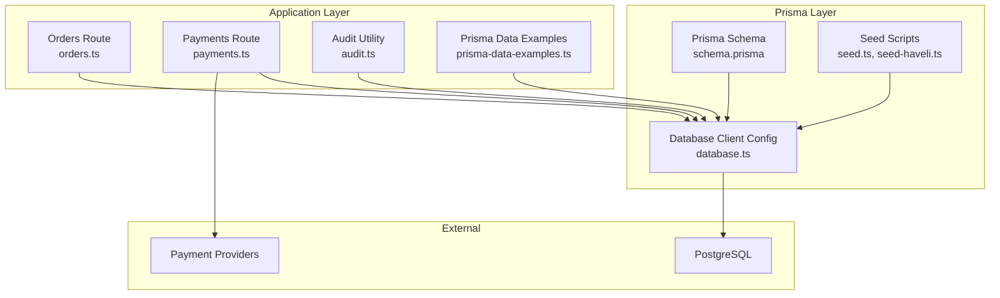
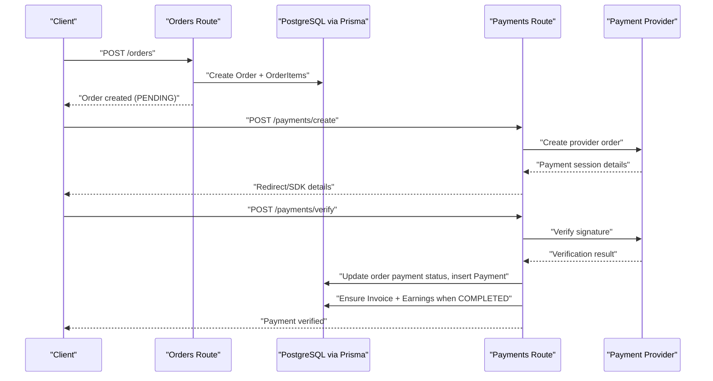
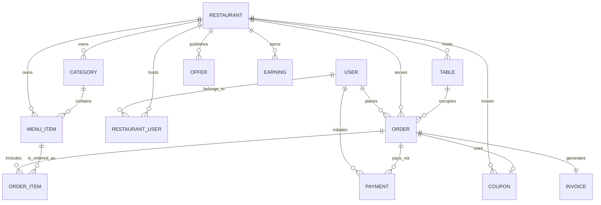
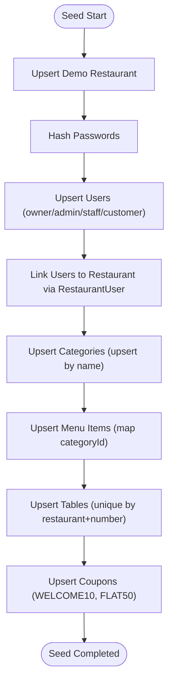
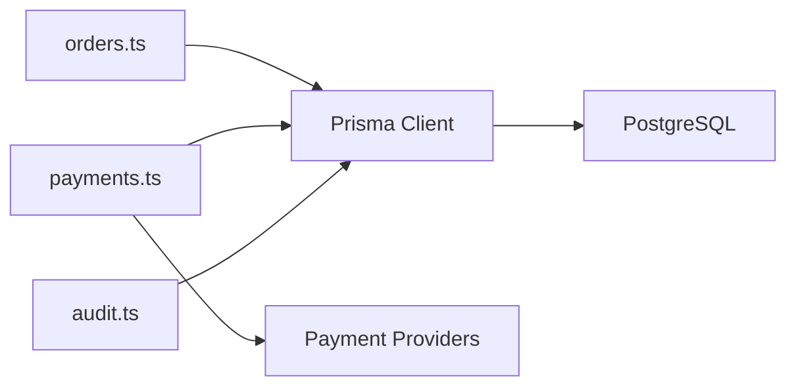

# Database Design

<cite>
**Referenced Files in This Document**
- [schema.prisma](file://restaurant-backend/prisma/schema.prisma)
- [seed.ts](file://restaurant-backend/prisma/seed.ts)
- [seed-haveli.ts](file://restaurant-backend/prisma/seed-haveli.ts)
- [sampleData.ts](file://restaurant-backend/src/lib/sampleData.ts)
- [database.ts](file://restaurant-backend/src/config/database.ts)
- [audit.ts](file://restaurant-backend/src/utils/audit.ts)
- [orders.ts](file://restaurant-backend/src/routes/orders.ts)
- [payments.ts](file://restaurant-backend/src/routes/payments.ts)
- [prisma-data-examples.ts](file://restaurant-backend/src/utils/prisma-data-examples.ts)
- [package.json](file://restaurant-backend/package.json)
</cite>

## Update Summary
**Changes Made**
- Added comprehensive indexing strategy documentation for all major entities
- Updated Performance Considerations section with strategic index explanations
- Enhanced Indexing Strategy section with detailed composite index analysis
- Added new section on Query Optimization Patterns with index usage examples

## Table of Contents
1. [Introduction](#introduction)
2. [Project Structure](#project-structure)
3. [Core Components](#core-components)
4. [Architecture Overview](#architecture-overview)
5. [Detailed Component Analysis](#detailed-component-analysis)
6. [Dependency Analysis](#dependency-analysis)
7. [Performance Considerations](#performance-considerations)
8. [Troubleshooting Guide](#troubleshooting-guide)
9. [Conclusion](#conclusion)
10. [Appendices](#appendices)

## Introduction
This document describes the DeQ-Bite restaurant management database built with PostgreSQL and Prisma ORM. It covers the entity-relationship model, Prisma schema definitions, migration and seeding strategies, indexing and referential integrity, data modeling for restaurant management, ordering, and payment processing, performance considerations, caching strategies, data lifecycle and retention, security and audit, and practical ER diagrams and sample data references for development and testing.

## Project Structure
The database layer is primarily defined in the Prisma schema and supported by seed scripts and runtime utilities. The backend uses Prisma Client to connect to PostgreSQL, with optional acceleration support and robust logging.

```mermaid
graph TB
subgraph "Prisma Layer"
Schema["Prisma Schema<br/>schema.prisma"]
Seed["Seed Scripts<br/>seed.ts, seed-haveli.ts"]
Config["Database Client Config<br/>database.ts"]
end
subgraph "Application Layer"
Orders["Orders Route<br/>orders.ts"]
Payments["Payments Route<br/>payments.ts"]
Audit["Audit Utility<br/>audit.ts"]
Examples["Prisma Data Examples<br/>prisma-data-examples.ts"]
end
subgraph "External"
Postgres["PostgreSQL"]
Providers["Payment Providers"]
end
Schema --> Config
Seed --> Config
Config --> Postgres
Orders --> Config
Payments --> Config
Audit --> Config
Examples --> Config
Payments --> Providers
```

**Diagram sources**
- [schema.prisma:1-416](file://restaurant-backend/prisma/schema.prisma#L1-L416)
- [seed.ts:1-388](file://restaurant-backend/prisma/seed.ts#L1-L388)
- [seed-haveli.ts:1-156](file://restaurant-backend/prisma/seed-haveli.ts#L1-L156)
- [database.ts:1-85](file://restaurant-backend/src/config/database.ts#L1-L85)
- [orders.ts:1-694](file://restaurant-backend/src/routes/orders.ts#L1-L694)
- [payments.ts:1-731](file://restaurant-backend/src/routes/payments.ts#L1-L731)
- [audit.ts:1-17](file://restaurant-backend/src/utils/audit.ts#L1-L17)
- [prisma-data-examples.ts:1-236](file://restaurant-backend/src/utils/prisma-data-examples.ts#L1-L236)

**Section sources**
- [schema.prisma:1-416](file://restaurant-backend/prisma/schema.prisma#L1-L416)
- [database.ts:1-85](file://restaurant-backend/src/config/database.ts#L1-L85)
- [package.json:6-16](file://restaurant-backend/package.json#L6-L16)

## Core Components
- Users: Customer, admin, staff, central admin, owner, kitchen staff with roles and verification.
- Restaurants: Onboarding, status, contact info, payment collection timing, accepted methods, commission rates.
- Restaurant Users: Junction table linking users to restaurants with roles and activity.
- Categories: Menu categories per restaurant with sort order and activity.
- Menu Items: Per-restaurant items with pricing, dietary flags, allergens, spice level, availability.
- Tables: Restaurant tables with capacity and location.
- Orders: Customer orders with status, payment linkage, totals, coupons, and timing.
- Order Items: Line items linking orders to menu items with notes and prices.
- Coupons: Restaurant-specific promotional codes with type/value, limits, and validity.
- Offers: Restaurant-specific offer rules with types and applicability.
- Payments: Payment records per order with provider, method, status, and transaction IDs.
- Invoices: Generated PDF invoices per order with metadata.
- Earnings: Platform and restaurant earnings per order.
- Audit Logs: Centralized audit trail for actions and entities.

**Section sources**
- [schema.prisma:11-325](file://restaurant-backend/prisma/schema.prisma#L11-L325)

## Architecture Overview
End-to-end flow from customer order creation to payment completion and invoice/earning generation.

```mermaid
sequenceDiagram
participant Client as "Client"
participant Orders as "Orders Route"
participant DB as "PostgreSQL via Prisma"
participant Payments as "Payments Route"
participant Prov as "Payment Provider"
Client->>Orders : "POST /orders"
Orders->>DB : "Create Order + OrderItems"
Orders-->>Client : "Order created (PENDING)"
Client->>Payments : "POST /payments/create"
Payments->>Prov : "Create provider order"
Prov-->>Payments : "Payment session details"
Payments-->>Client : "Redirect/SDK details"
Client->>Payments : "POST /payments/verify"
Payments->>Prov : "Verify signature"
Prov-->>Payments : "Verification result"
Payments->>DB : "Update order payment status, insert Payment"
Payments->>DB : "Ensure Invoice + Earnings when COMPLETED"
Payments-->>Client : "Payment verified"
```

**Diagram sources**
- [orders.ts:82-267](file://restaurant-backend/src/routes/orders.ts#L82-L267)
- [payments.ts:196-407](file://restaurant-backend/src/routes/payments.ts#L196-L407)

## Detailed Component Analysis

### Entity-Relationship Model
Core entities and relationships are defined in the Prisma schema with explicit foreign keys and cascading deletes.

```mermaid
erDiagram
USER ||--o{ ORDER : "places"
USER ||--o{ PAYMENT : "initiates"
USER ||--o{ RESTAURANT_USER : "belongs_to"
RESTAURANT ||--o{ RESTAURANT_USER : "hosts"
RESTAURANT ||--o{ CATEGORY : "owns"
RESTAURANT ||--o{ MENU_ITEM : "owns"
RESTAURANT ||--o{ TABLE : "hosts"
RESTAURANT ||--o{ ORDER : "serves"
RESTAURANT ||--o{ COUPON : "issues"
RESTAURANT ||--o{ OFFER : "publishes"
RESTAURANT ||--o{ EARNING : "earns"
CATEGORY ||--o{ MENU_ITEM : "contains"
TABLE ||--o{ ORDER : "occupies"
ORDER ||--o{ ORDER_ITEM : "includes"
ORDER ||--o{ PAYMENT : "pays_via"
ORDER ||--o| COUPON : "uses"
ORDER ||--|| INVOICE : "generates"
MENU_ITEM ||--o{ ORDER_ITEM : "is_ordered_as"
```

**Diagram sources**
- [schema.prisma:11-325](file://restaurant-backend/prisma/schema.prisma#L11-L325)

**Section sources**
- [schema.prisma:11-325](file://restaurant-backend/prisma/schema.prisma#L11-L325)

### Prisma Schema Definition Highlights
- Data Types and Constraints:
  - IDs: cuid() UUIDs.
  - Strings: email unique, phone unique, enums for statuses/providers/offers.
  - Money fields: stored in paise (integer) to avoid floating-point errors.
  - Arrays: cuisineTypes, acceptedPaymentMethods, allergens, ingredients.
  - Timestamps: createdAt defaults to now(), updatedAt auto-updated.
- Relationships:
  - One-to-many via relation fields and explicit foreign keys.
  - Unique constraints on composite keys (e.g., restaurantId+userId on junction).
  - Cascade deletes on parent deletion for child entities.
- Enums:
  - UserRole, RestaurantRole, CouponType, PaymentProvider, PaymentCollectionTiming, OrderStatus, PaymentStatus, SpiceLevel, InvoiceMethod, OfferType, OnboardingStatus.

**Section sources**
- [schema.prisma:11-416](file://restaurant-backend/prisma/schema.prisma#L11-L416)

### Migration Strategy
- Development migrations:
  - Command: npm run db:migrate
  - Creates and applies Prisma-managed migrations to PostgreSQL.
- Studio exploration:
  - Command: npm run db:studio
  - Opens Prisma Studio for schema and data inspection.
- Reset workflow:
  - Command: npm run db:reset
  - Resets migrations and seeds in one step.

Operational notes:
- DATABASE_URL and DIRECT_DATABASE_URL are loaded from environment variables.
- Production logging reduces verbosity; development logs queries and info.

**Section sources**
- [package.json:13-16](file://restaurant-backend/package.json#L13-L16)
- [database.ts:4-27](file://restaurant-backend/src/config/database.ts#L4-L27)

### Seed Data Implementation and Sample Data
- Main seed:
  - Creates a demo restaurant, users (owner/admin/staff/customer), assigns roles via RestaurantUser, upserts categories, menu items, tables, and coupons.
  - Converts currency to paise and maps categories to menu items.
- Haveli Dhaba import:
  - Reads a JSON file, clears existing categories/items for the demo restaurant, and imports items with derived spice levels and dietary flags.
- Sample data library:
  - Provides TypeScript arrays for categories, menu items, tables, users, and orders for frontend and backend development/testing.

```mermaid
flowchart TD
Start(["Seed Start"]) --> UpsertRestaurant["Upsert Demo Restaurant"]
UpsertRestaurant --> HashPasswords["Hash Passwords"]
HashPasswords --> UpsertUsers["Upsert Users (owner/admin/staff/customer)"]
UpsertUsers --> UpsertRestaurantUser["Link Users to Restaurant via RestaurantUser"]
UpsertRestaurantUser --> UpsertCategories["Upsert Categories (upsert by name)"]
UpsertCategories --> UpsertMenuItems["Upsert Menu Items (map categoryId)"]
UpsertMenuItems --> UpsertTables["Upsert Tables (unique by restaurant+number)"]
UpsertTables --> UpsertCoupons["Upsert Coupons (WELCOME10, FLAT50)"]
UpsertCoupons --> End(["Seed Completed"])
```

**Diagram sources**
- [seed.ts:7-378](file://restaurant-backend/prisma/seed.ts#L7-L378)

**Section sources**
- [seed.ts:1-388](file://restaurant-backend/prisma/seed.ts#L1-L388)
- [seed-haveli.ts:1-156](file://restaurant-backend/prisma/seed-haveli.ts#L1-L156)
- [sampleData.ts:1-557](file://restaurant-backend/src/lib/sampleData.ts#L1-L557)

### Indexing Strategy and Referential Integrity
**Updated** Strategic indexing has been implemented across all major entities to optimize query performance for common business operations.

#### Strategic Indexing Implementation

**Restaurant Users (restaurant_users):**
- Primary composite index: `@@index([restaurantId, userId, active])`
- Purpose: Optimizes user-role lookups and active membership queries
- Usage patterns: Role validation, user permissions, active staff filtering

**Categories (categories):**
- Composite index: `@@index([restaurantId, active, sortOrder])`
- Purpose: Optimizes category listing with sorting and filtering
- Usage patterns: Menu display, category navigation, active category queries

**Menu Items (menu_items):**
- Composite index: `@@index([restaurantId, available])`
- Purpose: Optimizes menu availability queries
- Usage patterns: Active menu display, availability checks
- Composite index: `@@index([restaurantId, categoryId])`
- Purpose: Optimizes category-based menu queries
- Usage patterns: Category-specific menu loading

**Tables (tables):**
- Composite index: `@@index([restaurantId, active])`
- Purpose: Optimizes table availability and status queries
- Usage patterns: Table booking, availability checks, active table filtering

**Orders (orders):**
- Composite index: `@@index([restaurantId, createdAt])`
- Purpose: Optimizes order listing by restaurant and chronological order
- Usage patterns: Restaurant dashboard, order history
- Composite index: `@@index([restaurantId, userId, createdAt])`
- Purpose: Optimizes customer order history queries
- Usage patterns: Customer profile, order tracking
- Composite index: `@@index([restaurantId, status, createdAt])`
- Purpose: Optimizes order status filtering and reporting
- Usage patterns: Kitchen display, status monitoring
- Composite index: `@@index([restaurantId, paymentStatus, createdAt])`
- Purpose: Optimizes payment-related order queries
- Usage patterns: Financial reporting, payment reconciliation

**Offers (offers):**
- Composite index: `@@index([restaurantId, active])`
- Purpose: Optimizes active offer queries
- Usage patterns: Offer display, promotion filtering
- Composite index: `@@index([restaurantId, startsAt, endsAt])`
- Purpose: Optimizes time-based offer queries
- Usage patterns: Active promotion filtering, schedule management

**Payments (payments):**
- Composite index: `@@index([orderId])`
- Purpose: Optimizes payment lookup by order
- Usage patterns: Payment verification, order payment status
- Composite index: `@@index([restaurantId, createdAt])`
- Purpose: Optimizes payment reporting by restaurant
- Usage patterns: Financial analytics, revenue tracking

**Invoices (invoices):**
- Composite index: `@@index([issuedAt])`
- Purpose: Optimizes invoice listing by creation date
- Usage patterns: Invoice management, financial reporting

#### Unique Constraints and Referential Integrity
- Unique constraints:
  - User.email, User.phone, Restaurant.slug, Restaurant.subdomain.
  - RestaurantUser: unique(restaurantId, userId).
  - Category: unique(restaurantId, name).
  - Table: unique(restaurantId, number).
  - Coupon: unique(restaurantId, code).
  - Order: unique(paymentId) for external provider linkage.
  - Invoice: unique(orderId, invoiceNumber).
  - Earning: unique(orderId).
- Foreign Keys and Cascades:
  - RestaurantUser.restaurantId -> Restaurant.id (Cascade delete).
  - Category.restaurantId -> Restaurant.id (Cascade delete).
  - MenuItem.categoryId -> Category.id; restaurantId -> Restaurant.id (Cascade delete).
  - Table.restaurantId -> Restaurant.id (Cascade delete).
  - Order.restaurantId -> Restaurant.id (Cascade delete); tableId -> Table.id; userId -> User.id; couponId -> Coupon.id.
  - OrderItem.menuItemId -> MenuItem.id; orderId -> Order (Cascade delete).
  - Payment.orderId -> Order.id (Cascade delete).
  - Earning.restaurantId -> Restaurant.id; unique orderId.
  - AuditLog: actorUserId -> User.id; optional restaurantId.
- Additional Notes:
  - Composite unique indices are declared via @@unique in Prisma.
  - Prisma enforces referential integrity at the ORM level; PostgreSQL constraints align with these definitions.

**Section sources**
- [schema.prisma:75-325](file://restaurant-backend/prisma/schema.prisma#L75-L325)

### Data Modeling Approach
- Money Modeling:
  - All monetary values stored in paise (integer) to prevent rounding errors and simplify comparisons.
- Ordering System:
  - Orders track subtotal, discount, tax, total, paid/due amounts, and payment status.
  - Order status progression controlled by business rules (e.g., cash-before-meal constraints).
  - Coupons applied atomically with transactions; usage counts updated.
- Payment Processing:
  - Supports multiple providers (Razorpay, Paytm, PhonePe) and cash.
  - Payment records capture provider order/payment IDs and signatures.
  - Automatic invoice and earning creation upon full payment.
- Restaurant Management:
  - Commission rates and payment collection timing per restaurant.
  - Cuisine types and accepted payment methods configurable per restaurant.
  - Onboarding status and suspension reasons.

**Section sources**
- [orders.ts:14-80](file://restaurant-backend/src/routes/orders.ts#L14-L80)
- [payments.ts:44-166](file://restaurant-backend/src/routes/payments.ts#L44-L166)
- [schema.prisma:167-325](file://restaurant-backend/prisma/schema.prisma#L167-L325)

### Query Patterns and Aggregation Examples
- Comprehensive user data with orders, items, and invoice:
  - Demonstrates nested includes and aggregations.
- Menu popularity calculation:
  - Group-by orderItems to compute total ordered quantities per item.
- Spending analytics:
  - Group-by paymentStatus and monthly totals for user analytics.

**Section sources**
- [prisma-data-examples.ts:11-235](file://restaurant-backend/src/utils/prisma-data-examples.ts#L11-L235)

## Dependency Analysis
- Prisma Client connects to PostgreSQL using DATABASE_URL/DIRECT_DATABASE_URL.
- Routes depend on Prisma for data access and transactions.
- Payment routes integrate with external providers via provider adapters.
- Audit writes are resilient to missing tables using safeCreateAuditLog.

```mermaid
graph LR
OrdersRoute["orders.ts"] --> PrismaClient["Prisma Client"]
PaymentsRoute["payments.ts"] --> PrismaClient
AuditUtil["audit.ts"] --> PrismaClient
PrismaClient --> PostgreSQL["PostgreSQL"]
PaymentsRoute --> Providers["Payment Providers"]
```

**Diagram sources**
- [orders.ts:1-694](file://restaurant-backend/src/routes/orders.ts#L1-L694)
- [payments.ts:1-731](file://restaurant-backend/src/routes/payments.ts#L1-L731)
- [audit.ts:1-17](file://restaurant-backend/src/utils/audit.ts#L1-L17)
- [database.ts:1-85](file://restaurant-backend/src/config/database.ts#L1-L85)

**Section sources**
- [orders.ts:1-694](file://restaurant-backend/src/routes/orders.ts#L1-L694)
- [payments.ts:1-731](file://restaurant-backend/src/routes/payments.ts#L1-L731)
- [audit.ts:1-17](file://restaurant-backend/src/utils/audit.ts#L1-L17)
- [database.ts:1-85](file://restaurant-backend/src/config/database.ts#L1-L85)

## Performance Considerations
**Updated** Strategic indexing has been implemented across all major entities to significantly improve query performance for common business operations.

### Strategic Indexing Benefits

**Enhanced Query Performance:**
- Restaurant Users: Composite index `@@index([restaurantId, userId, active])` optimizes user-role lookups and active membership queries
- Categories: Composite index `@@index([restaurantId, active, sortOrder])` enables efficient menu display with sorting
- Menu Items: Dual indexing (`restaurantId, available` and `restaurantId, categoryId`) optimizes both availability and category-based queries
- Orders: Multiple composite indexes enable efficient filtering by restaurant, user, status, and payment status
- Payments: Optimized payment lookup by order and restaurant-based reporting

### Database Optimization Strategies

**Monetary Precision:**
- Store amounts in paise (integer) to avoid floating-point inconsistencies.
- All money fields use integer storage with dedicated conversion utilities.

**Transaction Management:**
- Use Prisma transactions for coupon application, order updates, and payment recording to maintain consistency.
- Implement proper rollback handling for payment failures.

**Aggregation Optimization:**
- Prefer Prisma groupBy for analytics to keep logic in the database layer.
- Leverage composite indexes for efficient filtering and sorting in aggregations.

**Logging and Monitoring:**
- Adjust Prisma log levels by environment to balance observability and overhead.
- Implement slow query detection with configurable thresholds.
- Optional Prisma Accelerate extension for production scaling.

**Index Utilization Patterns:**
- Restaurant queries benefit from `restaurantId` prefixed indexes
- Time-based queries utilize `createdAt` indexes for chronological ordering
- Status-based queries leverage multi-column indexes for filtering
- Composite indexes minimize table scans for complex queries

### Performance Monitoring
- Slow query detection with configurable thresholds
- Query event logging with duration tracking
- Production logging optimized for minimal overhead
- Optional acceleration extension for high-throughput scenarios

**Section sources**
- [schema.prisma:75-325](file://restaurant-backend/prisma/schema.prisma#L75-L325)
- [database.ts:4-43](file://restaurant-backend/src/config/database.ts#L4-L43)

## Troubleshooting Guide
- Audit Log Table Absent:
  - safeCreateAuditLog catches missing table errors and logs a warning instead of failing core flows.
- Database Connectivity:
  - Verify DATABASE_URL and DIRECT_DATABASE_URL; check Prisma client initialization and environment-specific logging.
- Migration Issues:
  - Use npm run db:migrate to apply migrations; npm run db:studio to inspect schema/data; npm run db:reset to reset and re-seed.
- Index Performance Issues:
  - Monitor slow query logs to identify missing index usage.
  - Review composite index patterns for optimal query performance.
  - Consider adding additional indexes for frequently executed queries.

**Section sources**
- [audit.ts:5-16](file://restaurant-backend/src/utils/audit.ts#L5-L16)
- [database.ts:4-27](file://restaurant-backend/src/config/database.ts#L4-L27)
- [package.json:13-16](file://restaurant-backend/package.json#L13-L16)

## Conclusion
The DeQ-Bite database design leverages Prisma ORM to model a restaurant ecosystem with clear entities, enforced referential integrity, and robust payment and ordering workflows. The strategic indexing optimizations provide significant performance improvements across all major business operations. The schema, seeds, and route logic provide a solid foundation for development and production, with room for performance tuning and operational enhancements.

## Appendices

### A. Sample Data References
- Sample categories, menu items, tables, users, and orders are defined in the sample data library for development and testing.
- Seed scripts import these samples and map them to the database.

**Section sources**
- [sampleData.ts:1-557](file://restaurant-backend/src/lib/sampleData.ts#L1-L557)
- [seed.ts:1-388](file://restaurant-backend/prisma/seed.ts#L1-L388)
- [seed-haveli.ts:1-156](file://restaurant-backend/prisma/seed-haveli.ts#L1-L156)

### B. Prisma Client Initialization and Environment
- Client creation respects NODE_ENV for logging.
- Optional Prisma Accelerate extension is conditionally loaded.
- Slow query detection with configurable thresholds and parameter logging.

**Section sources**
- [database.ts:4-43](file://restaurant-backend/src/config/database.ts#L4-L43)

### C. Order Creation and Payment Flow (Sequence)

```mermaid
sequenceDiagram
participant Client as "Client"
participant Orders as "Orders Route"
participant DB as "PostgreSQL via Prisma"
participant Payments as "Payments Route"
participant Prov as "Payment Provider"
Client->>Orders : "POST /orders"
Orders->>DB : "Create Order + OrderItems"
Orders-->>Client : "Order created (PENDING)"
Client->>Payments : "POST /payments/create"
Payments->>Prov : "Create provider order"
Prov-->>Payments : "Payment session details"
Payments-->>Client : "Redirect/SDK details"
Client->>Payments : "POST /payments/verify"
Payments->>Prov : "Verify signature"
Prov-->>Payments : "Verification result"
Payments->>DB : "Update order payment status, insert Payment"
Payments->>DB : "Ensure Invoice + Earnings when COMPLETED"
Payments-->>Client : "Payment verified"
```

**Diagram sources**
- [orders.ts:82-267](file://restaurant-backend/src/routes/orders.ts#L82-L267)
- [payments.ts:196-407](file://restaurant-backend/src/routes/payments.ts#L196-L407)

### D. Strategic Indexing Reference
**Updated** Complete indexing strategy reference for all major entities:

**Restaurant Users:** `@@index([restaurantId, userId, active])`
- Optimal for user-role validation and active membership queries

**Categories:** `@@index([restaurantId, active, sortOrder])`
- Enables efficient menu display with sorting and filtering

**Menu Items:** 
- `@@index([restaurantId, available])` - Availability queries
- `@@index([restaurantId, categoryId])` - Category-based queries

**Tables:** `@@index([restaurantId, active])`
- Optimizes table availability and status queries

**Orders:**
- `@@index([restaurantId, createdAt])` - Restaurant order listing
- `@@index([restaurantId, userId, createdAt])` - Customer order history
- `@@index([restaurantId, status, createdAt])` - Status filtering
- `@@index([restaurantId, paymentStatus, createdAt])` - Payment queries

**Offers:**
- `@@index([restaurantId, active])` - Active offer queries
- `@@index([restaurantId, startsAt, endsAt])` - Time-based filtering

**Payments:** 
- `@@index([orderId])` - Payment lookup
- `@@index([restaurantId, createdAt])` - Reporting

**Invoices:** `@@index([issuedAt])` - Date-based listing

**Section sources**
- [schema.prisma:75-325](file://restaurant-backend/prisma/schema.prisma#L75-L325)