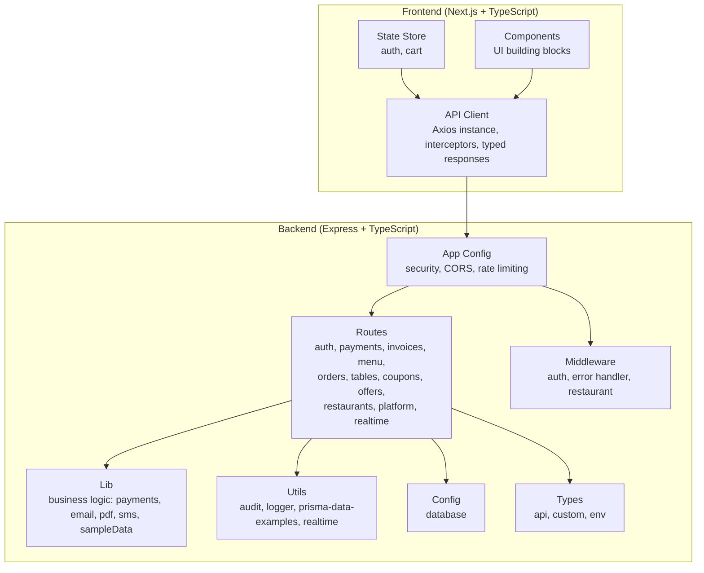
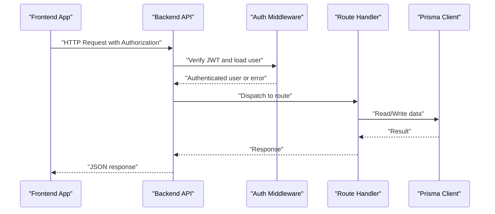
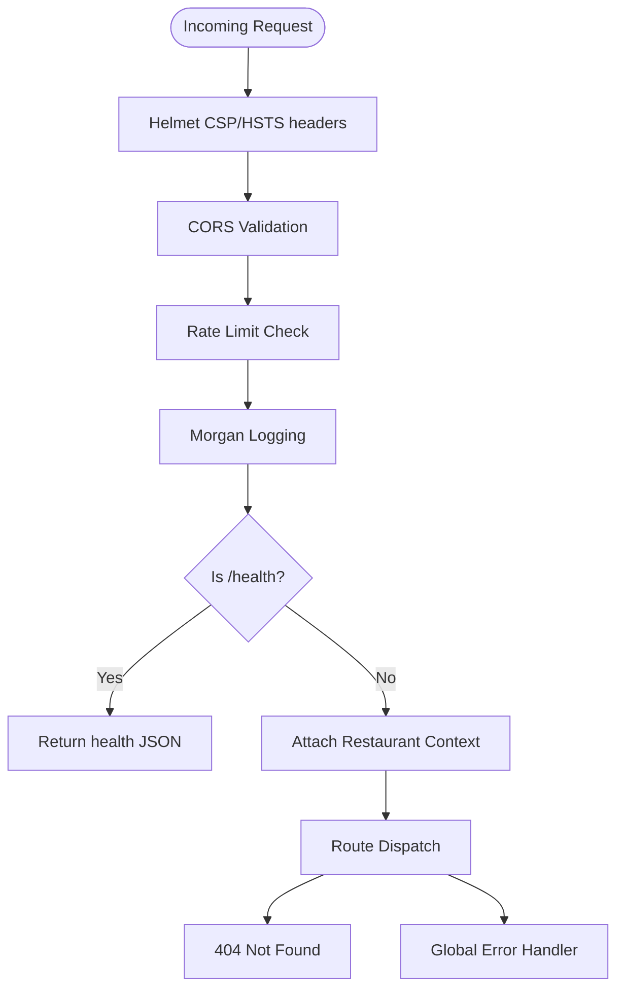
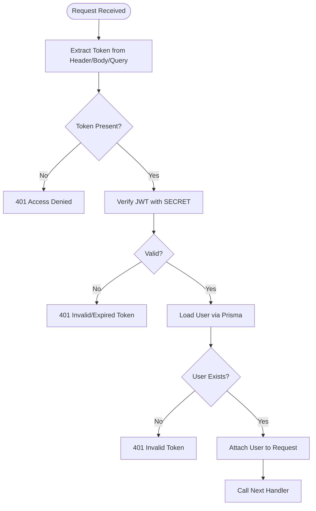
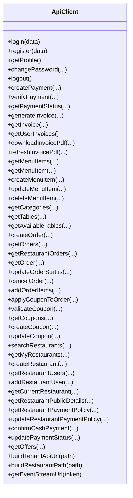
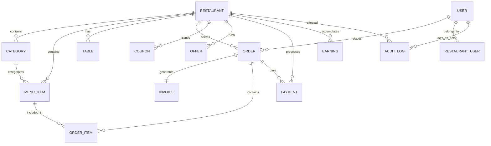
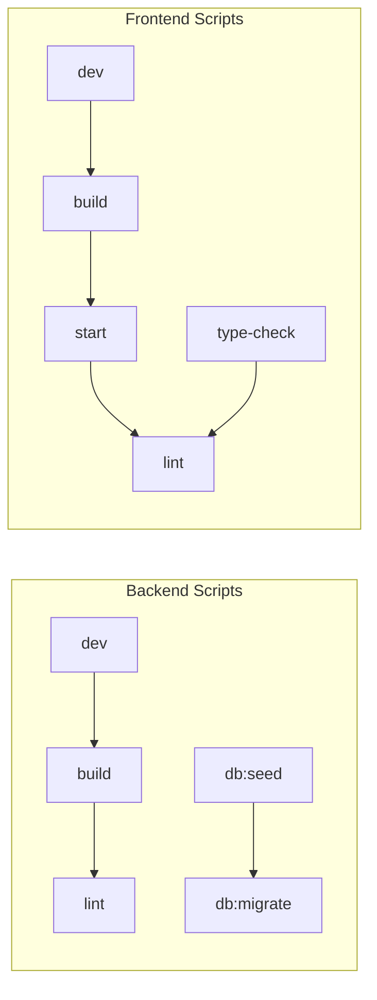

# Development Guidelines

<cite>
**Referenced Files in This Document**
- [README.md](file://README.md)
- [IMPLEMENTATION_STATUS.md](file://IMPLEMENTATION_STATUS.md)
- [restaurant-backend/package.json](file://restaurant-backend/package.json)
- [restaurant-frontend/package.json](file://restaurant-frontend/package.json)
- [restaurant-backend/tsconfig.json](file://restaurant-backend/tsconfig.json)
- [restaurant-frontend/tsconfig.json](file://restaurant-frontend/tsconfig.json)
- [restaurant-backend/prisma/schema.prisma](file://restaurant-backend/prisma/schema.prisma)
- [restaurant-backend/src/app.ts](file://restaurant-backend/src/app.ts)
- [restaurant-backend/src/server.ts](file://restaurant-backend/src/server.ts)
- [restaurant-backend/src/middleware/auth.ts](file://restaurant-backend/src/middleware/auth.ts)
- [restaurant-frontend/src/lib/api-client.ts](file://restaurant-frontend/src/lib/api-client.ts)
</cite>

## Table of Contents
1. [Introduction](#introduction)
2. [Project Structure](#project-structure)
3. [Core Components](#core-components)
4. [Architecture Overview](#architecture-overview)
5. [Detailed Component Analysis](#detailed-component-analysis)
6. [Dependency Analysis](#dependency-analysis)
7. [Performance Considerations](#performance-considerations)
8. [Troubleshooting Guide](#troubleshooting-guide)
9. [Contribution Guidelines](#contribution-guidelines)
10. [Testing Requirements](#testing-requirements)
11. [Quality Assurance](#quality-assurance)
12. [Development Environment Setup](#development-environment-setup)
13. [Debugging Procedures](#debugging-procedures)
14. [Implementation Status and Roadmap](#implementation-status-and-roadmap)
15. [Extending the System](#extending-the-system)
16. [Conclusion](#conclusion)

## Introduction
This document provides comprehensive development guidelines for contributing to DeQ-Bite’s codebase. It covers code standards, naming conventions, code organization patterns, development workflow, contribution processes, testing requirements, quality assurance, environment setup, debugging, troubleshooting, implementation status, roadmap, and extension guidelines. The system follows a separated backend/frontend architecture with Express.js + TypeScript + Prisma on the backend and Next.js + TypeScript on the frontend.

## Project Structure
DeQ-Bite is organized into two primary packages:
- Backend: Express.js API server with TypeScript, Prisma ORM, and modular route/middleware structure
- Frontend: Next.js application with TypeScript, React, and state management

Key characteristics:
- Strict TypeScript configuration with path aliases and strict compiler options
- Modular routing and middleware for security and separation of concerns
- Tenant-aware routing via restaurant slugs
- Comprehensive Prisma schema for domain models and enums

**Diagram sources**
- [restaurant-backend/src/app.ts](file://restaurant-backend/src/app.ts#L1-L148)
- [restaurant-backend/src/server.ts](file://restaurant-backend/src/server.ts#L1-L33)
- [restaurant-frontend/src/lib/api-client.ts](file://restaurant-frontend/src/lib/api-client.ts#L1-L894)

**Section sources**
- [README.md](file://README.md#L65-L99)
- [restaurant-backend/tsconfig.json](file://restaurant-backend/tsconfig.json#L1-L52)
- [restaurant-frontend/tsconfig.json](file://restaurant-frontend/tsconfig.json#L1-L34)

## Core Components
- Backend application bootstrap and middleware stack
- Tenant-aware routing with slug-based multi-tenancy
- Authentication middleware with JWT verification and role-based authorization
- API client abstraction with interceptors and typed responses
- Prisma schema defining domain models and enumerations

**Section sources**
- [restaurant-backend/src/app.ts](file://restaurant-backend/src/app.ts#L1-L148)
- [restaurant-backend/src/server.ts](file://restaurant-backend/src/server.ts#L1-L33)
- [restaurant-backend/src/middleware/auth.ts](file://restaurant-backend/src/middleware/auth.ts#L1-L137)
- [restaurant-frontend/src/lib/api-client.ts](file://restaurant-frontend/src/lib/api-client.ts#L1-L894)
- [restaurant-backend/prisma/schema.prisma](file://restaurant-backend/prisma/schema.prisma#L1-L384)

## Architecture Overview
The system enforces a clear separation between frontend and backend, with the frontend consuming RESTful endpoints and the backend implementing tenant-aware routing and robust security middleware.

**Diagram sources**
- [restaurant-backend/src/app.ts](file://restaurant-backend/src/app.ts#L34-L145)
- [restaurant-backend/src/middleware/auth.ts](file://restaurant-backend/src/middleware/auth.ts#L1-L137)
- [restaurant-frontend/src/lib/api-client.ts](file://restaurant-frontend/src/lib/api-client.ts#L194-L330)

## Detailed Component Analysis

### Backend Application and Routing
- Security middleware: Helmet, CORS with dynamic origins, rate limiting, Morgan logging
- Health endpoint and static asset serving for invoices
- Tenant router mounted under /api/r/:restaurantSlug with restaurant context attached
- Modular route registration for auth, payments, invoices, menu, orders, tables, coupons, offers, restaurants, platform, and realtime

**Diagram sources**
- [restaurant-backend/src/app.ts](file://restaurant-backend/src/app.ts#L34-L145)

**Section sources**
- [restaurant-backend/src/app.ts](file://restaurant-backend/src/app.ts#L1-L148)

### Authentication and Authorization Middleware
- Extracts JWT from Authorization header (case-insensitive), body, or query
- Verifies token against environment secret and loads user profile
- Provides role-based authorization and optional authentication helpers
- Integrates with Prisma for user lookup

**Diagram sources**
- [restaurant-backend/src/middleware/auth.ts](file://restaurant-backend/src/middleware/auth.ts#L7-L89)

**Section sources**
- [restaurant-backend/src/middleware/auth.ts](file://restaurant-backend/src/middleware/auth.ts#L1-L137)

### Frontend API Client
- Centralized Axios instance with base URL from environment
- Request interceptor adds Authorization and tenant slug headers
- Response interceptor handles 401 by clearing token and redirecting to sign-in
- Comprehensive typed API surface for auth, payments, invoices, menu, orders, tables, coupons, offers, restaurants, and platform features
- Helpers for tenant endpoint construction and event stream URLs

**Diagram sources**
- [restaurant-frontend/src/lib/api-client.ts](file://restaurant-frontend/src/lib/api-client.ts#L194-L894)

**Section sources**
- [restaurant-frontend/src/lib/api-client.ts](file://restaurant-frontend/src/lib/api-client.ts#L1-L894)

### Database Schema and Types
- Domain models: User, Restaurant, RestaurantUser, Category, MenuItem, Table, Order, OrderItem, Invoice, Coupon, Offer, Payment, Earning, AuditLog
- Enumerations: UserRole, RestaurantRole, CouponType, PaymentProvider, PaymentCollectionTiming, OrderStatus, PaymentStatus, SpiceLevel, InvoiceMethod, OfferType, OnboardingStatus
- Multi-tenancy via restaurantId relations and tenant-aware routes

**Diagram sources**
- [restaurant-backend/prisma/schema.prisma](file://restaurant-backend/prisma/schema.prisma#L11-L384)

**Section sources**
- [restaurant-backend/prisma/schema.prisma](file://restaurant-backend/prisma/schema.prisma#L1-L384)

## Dependency Analysis
- Backend dependencies include Express, Prisma, bcrypt, helmet, cors, rate-limit, zod, winston, nodemailer, twilio, razorpay, uuid, morgan, multer, jspdf, pdfkit, html2canvas, axios, dotenv, express-validator, get-stream, tsconfig-paths, tsc-alias, tsx, and eslint
- Frontend dependencies include Next.js, React, Tailwind CSS, Zustand, Axios, react-hook-form, zod, lucide-react, @heroicons/react, @headlessui/react, @tanstack/react-query, js-cookie, clsx, tailwind-merge, autoprefixer, postcss, and eslint-config-next

**Diagram sources**
- [restaurant-backend/package.json](file://restaurant-backend/package.json#L6-L16)
- [restaurant-frontend/package.json](file://restaurant-frontend/package.json#L5-L11)

**Section sources**
- [restaurant-backend/package.json](file://restaurant-backend/package.json#L1-L80)
- [restaurant-frontend/package.json](file://restaurant-frontend/package.json#L1-L54)

## Performance Considerations
- Rate limiting configured to 200 requests per 15 minutes for protection
- Helmet headers enabled for security and performance
- Morgan combined logging for observability
- Prisma client generation and optimized queries recommended
- Frontend uses Next.js App Router with code splitting and lazy loading
- State management with Zustand for efficient local state

[No sources needed since this section provides general guidance]

## Troubleshooting Guide
Common issues and resolutions:
- JWT_SECRET not configured in production: verify environment variables and restart server
- CORS blocked requests: ensure FRONTEND_URL matches allowed origins
- 401 Unauthorized: verify Authorization header format and token validity
- Database connectivity: check DATABASE_URL and run migrations
- Payment verification failures: validate Razorpay keys and signature verification flow
- Invoice generation: confirm PDF generation and storage permissions

**Section sources**
- [restaurant-backend/src/app.ts](file://restaurant-backend/src/app.ts#L28-L32)
- [restaurant-backend/src/app.ts](file://restaurant-backend/src/app.ts#L42-L65)
- [restaurant-backend/src/middleware/auth.ts](file://restaurant-backend/src/middleware/auth.ts#L40-L44)
- [restaurant-frontend/src/lib/api-client.ts](file://restaurant-frontend/src/lib/api-client.ts#L224-L239)

## Contribution Guidelines
Follow these steps to contribute effectively:
- Branch management
  - Use feature branches prefixed with feature/, fix/, chore/
  - Keep branches focused and small
  - Rebase onto main before opening pull requests
- Pull request process
  - Reference related issues
  - Include screenshots or videos for UI changes
  - Ensure tests pass locally
  - Request reviewers based on component ownership
- Code review standards
  - Maintain strict TypeScript configuration
  - Follow naming conventions and module organization
  - Add appropriate input validation and error handling
  - Update documentation for new features
- Issue reporting
  - Provide environment details and reproduction steps
  - Include logs and screenshots when applicable
- Feature development
  - Backend: add routes in src/routes/, implement logic in src/lib/
  - Frontend: create components in src/components/, update API client
  - Database: modify Prisma schema, run migrations and seed
  - Testing: test APIs with Postman, test UI functionality

**Section sources**
- [README.md](file://README.md#L214-L235)

## Testing Requirements
- Backend
  - Health checks and authentication endpoints
  - Use curl or Postman to test endpoints
  - Database seeding for test data
- Frontend
  - Manual testing of user flows: login, order placement, payment, invoice generation
- Unit/integration/end-to-end testing
  - Configure unit tests with Jest or Vitest
  - Integration tests for API endpoints
  - End-to-end tests for critical user journeys

**Section sources**
- [README.md](file://README.md#L159-L178)

## Quality Assurance
- Code quality tools
  - ESLint configured in both backend and frontend
  - Prettier formatting enforced via lint scripts
- Security reviews
  - JWT-based authentication with role-based access control
  - Input validation with Zod schemas
  - CORS protection and rate limiting
  - Helmet headers and secure logging
- Performance testing
  - Benchmark API endpoints under load
  - Monitor database query performance
  - Optimize frontend bundles and images

**Section sources**
- [restaurant-backend/package.json](file://restaurant-backend/package.json#L12-L66)
- [restaurant-frontend/package.json](file://restaurant-frontend/package.json#L32-L42)
- [README.md](file://README.md#L222-L227)

## Development Environment Setup
- Prerequisites
  - Node.js 18+, PostgreSQL database, Razorpay account
- Automated setup
  - Windows: run setup-separated-app.bat
  - Unix/Linux/macOS: chmod +x setup-separated-app.sh && ./setup-separated-app.sh
- Manual setup
  - Backend: cd restaurant-backend && npm install, copy .env.example to .env, npx prisma generate, npx prisma migrate dev, npm run dev
  - Frontend: cd restaurant-frontend && npm install, create .env.local with API URL and Razorpay key, npm run dev
- Environment variables
  - Backend: DATABASE_URL, JWT_SECRET, RAZORPAY_KEY_ID, RAZORPAY_KEY_SECRET, FRONTEND_URL
  - Frontend: NEXT_PUBLIC_API_URL, NEXT_PUBLIC_RAZORPAY_KEY_ID

**Section sources**
- [README.md](file://README.md#L27-L63)
- [README.md](file://README.md#L185-L202)

## Debugging Procedures
- Enable verbose logging in development
- Use browser developer tools for frontend debugging
- Inspect backend logs and Morgan streams
- Validate environment configuration and secrets
- Test payment flows with sandbox credentials
- Use Prisma Studio for database inspection

**Section sources**
- [restaurant-backend/src/app.ts](file://restaurant-backend/src/app.ts#L84-L90)
- [restaurant-backend/src/server.ts](file://restaurant-backend/src/server.ts#L17-L30)

## Implementation Status and Roadmap
- Current status: Production ready with separated architecture and enhanced security
- All features successfully implemented including authentication, menu management, cart/ordering, table management, payment integration, invoice system, admin dashboard, and comprehensive testing
- Future development plans
  - Enhance real-time features with WebSocket improvements
  - Expand payment providers and currencies
  - Add advanced analytics and reporting
  - Implement automated testing coverage
  - Improve accessibility and internationalization

**Section sources**
- [IMPLEMENTATION_STATUS.md](file://IMPLEMENTATION_STATUS.md#L1-L248)
- [README.md](file://README.md#L244-L248)

## Extending the System
Guidelines for adding new features while maintaining backward compatibility:
- Backend
  - Add new routes under src/routes/ with consistent naming
  - Implement business logic in src/lib/ with clear separation of concerns
  - Extend Prisma schema and run migrations
  - Add input validation with Zod schemas
  - Update error handling and logging
- Frontend
  - Create new components in src/components/ with reusable patterns
  - Update API client methods in src/lib/api-client.ts
  - Maintain type safety with existing interfaces
  - Preserve existing API contracts for backward compatibility
- Database
  - Use Prisma migrations for schema changes
  - Seed test data for new models
  - Ensure foreign key constraints and indexes
- Testing
  - Add unit tests for new logic
  - Update integration tests for changed endpoints
  - Document new API endpoints and flows

**Section sources**
- [README.md](file://README.md#L214-L221)
- [restaurant-backend/prisma/schema.prisma](file://restaurant-backend/prisma/schema.prisma#L1-L384)

## Conclusion
DeQ-Bite provides a robust, scalable, and secure foundation for restaurant ordering systems. By following these development guidelines—adhering to TypeScript standards, maintaining modular architecture, enforcing security practices, and ensuring comprehensive testing—you can confidently extend the system while preserving backward compatibility and operational excellence.