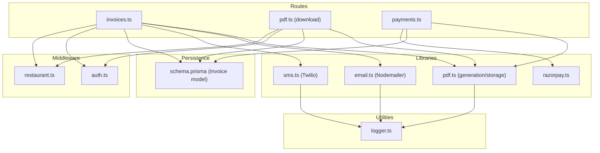
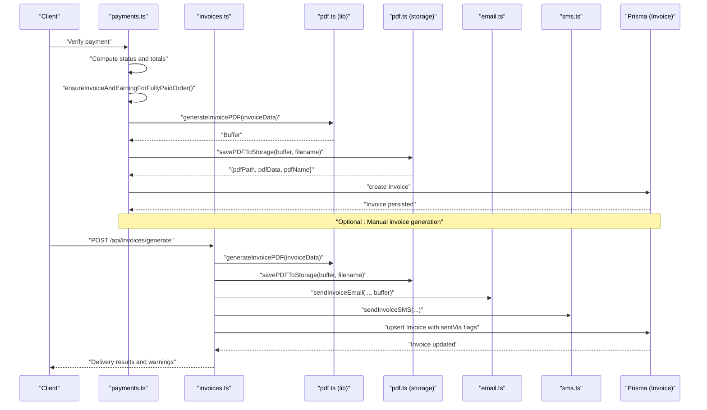
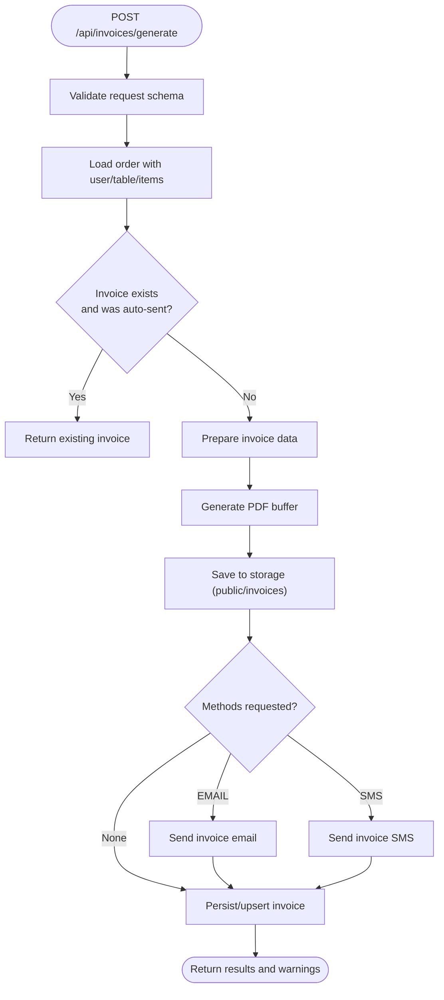
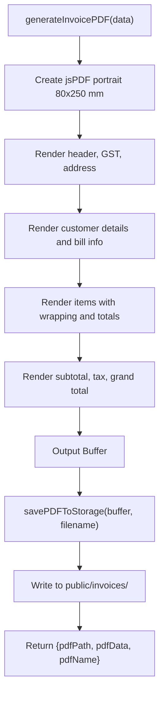
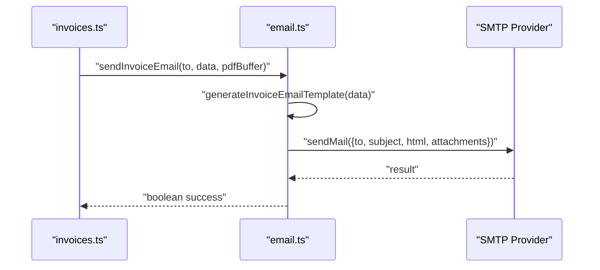
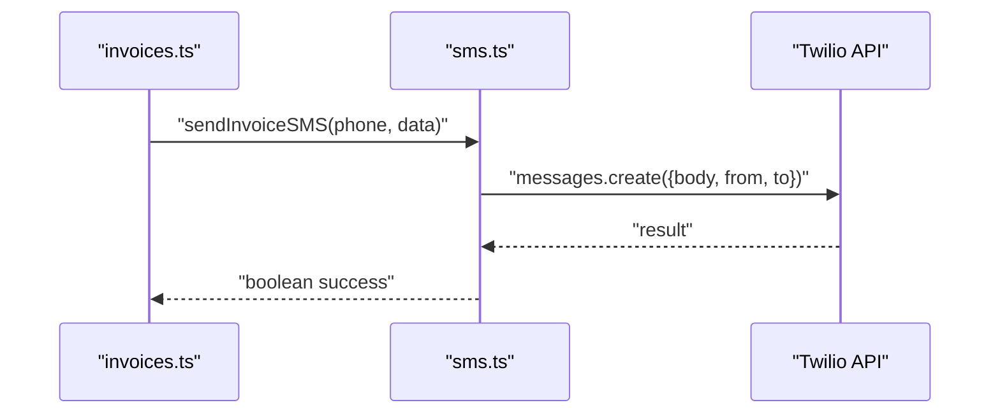
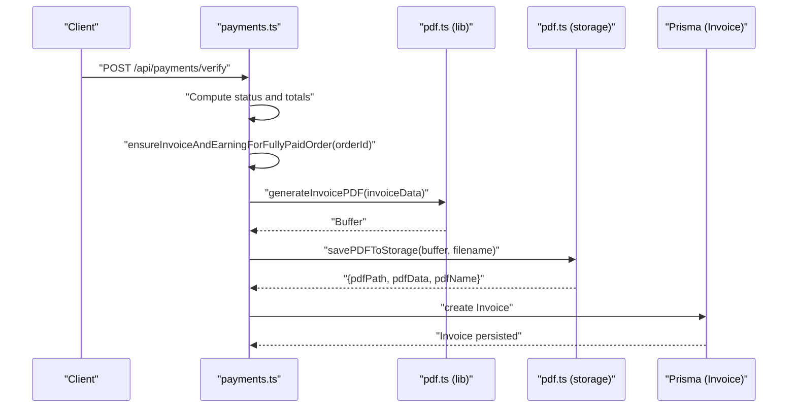
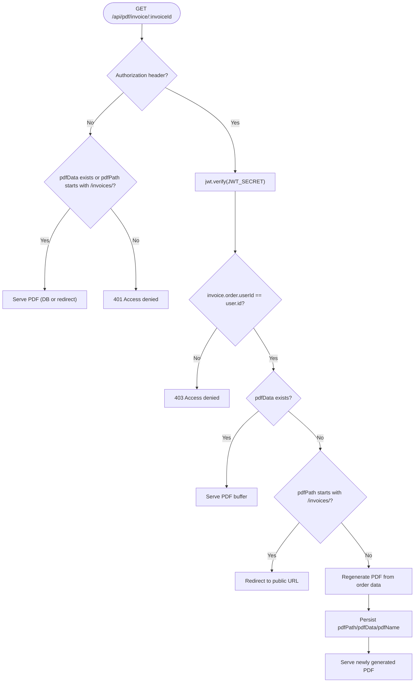
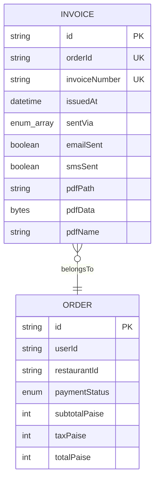
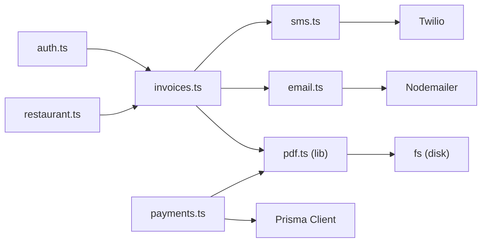

# Document Generation

<cite>
**Referenced Files in This Document**
- [invoices.ts](file://restaurant-backend/src/routes/invoices.ts)
- [pdf.ts](file://restaurant-backend/src/routes/pdf.ts)
- [pdf.ts](file://restaurant-backend/src/lib/pdf.ts)
- [email.ts](file://restaurant-backend/src/lib/email.ts)
- [sms.ts](file://restaurant-backend/src/lib/sms.ts)
- [payments.ts](file://restaurant-backend/src/routes/payments.ts)
- [schema.prisma](file://restaurant-backend/prisma/schema.prisma)
- [auth.ts](file://restaurant-backend/src/middleware/auth.ts)
- [restaurant.ts](file://restaurant-backend/src/middleware/restaurant.ts)
- [logger.ts](file://restaurant-backend/src/utils/logger.ts)
- [server.ts](file://restaurant-backend/src/server.ts)
- [package.json](file://restaurant-backend/package.json)
</cite>

## Table of Contents
1. [Introduction](#introduction)
2. [Project Structure](#project-structure)
3. [Core Components](#core-components)
4. [Architecture Overview](#architecture-overview)
5. [Detailed Component Analysis](#detailed-component-analysis)
6. [Dependency Analysis](#dependency-analysis)
7. [Performance Considerations](#performance-considerations)
8. [Troubleshooting Guide](#troubleshooting-guide)
9. [Conclusion](#conclusion)
10. [Appendices](#appendices)

## Introduction
This document explains the end-to-end document generation system for DeQ-Bite’s invoice and notification workflows. It covers:
- PDF invoice generation, including template creation, data formatting, and secure storage
- Multi-channel delivery via email and SMS, plus direct download
- The invoice generation workflow triggered upon successful payment verification
- Email service integration using Nodemailer and SMS service integration using Twilio
- Document security measures, including user-specific access control and file storage strategies
- Delivery confirmation tracking and warnings for failed deliveries
- Template customization, branding support, and batch processing considerations
- File storage strategies, cleanup policies, and archive management

## Project Structure
The document generation system spans routing, libraries, middleware, and persistence:
- Routes orchestrate invoice generation, retrieval, resends, and refreshes
- Libraries encapsulate PDF generation, email/SMS delivery, and payment provider integrations
- Middleware enforces authentication, restaurant context, and authorization
- Prisma models define the invoice entity and relationships
- Logging utilities track operations and failures

**Diagram sources**
- [invoices.ts](file://restaurant-backend/src/routes/invoices.ts#L1-L599)
- [pdf.ts](file://restaurant-backend/src/routes/pdf.ts#L1-L181)
- [pdf.ts](file://restaurant-backend/src/lib/pdf.ts#L1-L259)
- [email.ts](file://restaurant-backend/src/lib/email.ts#L1-L227)
- [sms.ts](file://restaurant-backend/src/lib/sms.ts#L1-L131)
- [payments.ts](file://restaurant-backend/src/routes/payments.ts#L1-L731)
- [schema.prisma](file://restaurant-backend/prisma/schema.prisma#L190-L204)
- [auth.ts](file://restaurant-backend/src/middleware/auth.ts#L1-L137)
- [restaurant.ts](file://restaurant-backend/src/middleware/restaurant.ts#L1-L246)
- [logger.ts](file://restaurant-backend/src/utils/logger.ts#L1-L56)

**Section sources**
- [invoices.ts](file://restaurant-backend/src/routes/invoices.ts#L1-L599)
- [pdf.ts](file://restaurant-backend/src/routes/pdf.ts#L1-L181)
- [pdf.ts](file://restaurant-backend/src/lib/pdf.ts#L1-L259)
- [email.ts](file://restaurant-backend/src/lib/email.ts#L1-L227)
- [sms.ts](file://restaurant-backend/src/lib/sms.ts#L1-L131)
- [payments.ts](file://restaurant-backend/src/routes/payments.ts#L1-L731)
- [schema.prisma](file://restaurant-backend/prisma/schema.prisma#L190-L204)
- [auth.ts](file://restaurant-backend/src/middleware/auth.ts#L1-L137)
- [restaurant.ts](file://restaurant-backend/src/middleware/restaurant.ts#L1-L246)
- [logger.ts](file://restaurant-backend/src/utils/logger.ts#L1-L56)

## Core Components
- Invoice generation route: Validates inputs, loads order data, prepares invoice data, generates PDF, stores it, sends notifications, and persists invoice metadata
- PDF generation library: Creates PDFs with a compact receipt-style layout and supports cleanup of old files
- Email delivery: Uses Nodemailer to send HTML emails with PDF attachments
- SMS delivery: Uses Twilio to send invoice notifications
- Payment-triggered invoice creation: Automatically creates invoices when orders reach a fully paid state
- PDF download route: Serves PDFs with token-based access control and fallback to static storage
- Middleware: Enforces JWT-based authentication and restaurant context
- Persistence: Invoice model tracks sentVia channels, delivery flags, and PDF metadata

**Section sources**
- [invoices.ts](file://restaurant-backend/src/routes/invoices.ts#L21-L241)
- [pdf.ts](file://restaurant-backend/src/lib/pdf.ts#L37-L187)
- [email.ts](file://restaurant-backend/src/lib/email.ts#L31-L61)
- [sms.ts](file://restaurant-backend/src/lib/sms.ts#L31-L66)
- [payments.ts](file://restaurant-backend/src/routes/payments.ts#L61-L166)
- [pdf.ts](file://restaurant-backend/src/routes/pdf.ts#L12-L178)
- [auth.ts](file://restaurant-backend/src/middleware/auth.ts#L7-L75)
- [restaurant.ts](file://restaurant-backend/src/middleware/restaurant.ts#L202-L211)
- [schema.prisma](file://restaurant-backend/prisma/schema.prisma#L190-L204)

## Architecture Overview
The system integrates payment completion with automatic invoice generation and multi-channel delivery. It ensures secure access to generated PDFs and maintains auditability through logging and database records.

**Diagram sources**
- [payments.ts](file://restaurant-backend/src/routes/payments.ts#L61-L166)
- [invoices.ts](file://restaurant-backend/src/routes/invoices.ts#L21-L241)
- [pdf.ts](file://restaurant-backend/src/lib/pdf.ts#L37-L187)
- [pdf.ts](file://restaurant-backend/src/lib/pdf.ts#L191-L224)
- [email.ts](file://restaurant-backend/src/lib/email.ts#L200-L227)
- [sms.ts](file://restaurant-backend/src/lib/sms.ts#L89-L104)
- [schema.prisma](file://restaurant-backend/prisma/schema.prisma#L190-L204)

## Detailed Component Analysis

### Invoice Generation Workflow
- Endpoint: POST /api/invoices/generate
- Validation: Requires orderId and optional methods array (EMAIL, SMS)
- Access control: Requires JWT authentication and restaurant context
- Data preparation: Loads order with user, table, and items; computes totals and formats invoice data
- PDF generation: Calls generateInvoicePDF with structured invoice data
- Storage: Saves PDF to public/invoices and returns path/name/data
- Delivery: Conditionally sends email and/or SMS based on requested methods and presence of contact info
- Persistence: Upserts invoice record with sentVia, delivery flags, and PDF metadata
- Warnings: Returns warnings for skipped or failed deliveries

**Diagram sources**
- [invoices.ts](file://restaurant-backend/src/routes/invoices.ts#L21-L241)

**Section sources**
- [invoices.ts](file://restaurant-backend/src/routes/invoices.ts#L21-L241)

### PDF Invoice Generation and Storage
- Template: Compact portrait layout optimized for 80mm roll receipts; includes restaurant branding, customer details, items list, taxes, and totals
- Data formatting: Converts paise to rupees, wraps long item names, computes totals and quantities
- Storage: Writes to public/invoices with a deterministic filename; returns path, buffer, and name for persistence
- Cleanup: Optional maintenance function to remove old files older than N days

**Diagram sources**
- [pdf.ts](file://restaurant-backend/src/lib/pdf.ts#L37-L187)
- [pdf.ts](file://restaurant-backend/src/lib/pdf.ts#L191-L224)

**Section sources**
- [pdf.ts](file://restaurant-backend/src/lib/pdf.ts#L37-L187)
- [pdf.ts](file://restaurant-backend/src/lib/pdf.ts#L191-L224)

### Email Delivery with Nodemailer
- Transport: Configured via SMTP_HOST, SMTP_PORT, SMTP_USER, SMTP_PASS, APP_NAME
- Template: Generates HTML email with styled sections for invoice details and total amount
- Attachment: Attaches the generated PDF buffer
- Delivery: Returns boolean success/failure and logs outcomes

**Diagram sources**
- [email.ts](file://restaurant-backend/src/lib/email.ts#L200-L227)
- [email.ts](file://restaurant-backend/src/lib/email.ts#L31-L61)

**Section sources**
- [email.ts](file://restaurant-backend/src/lib/email.ts#L31-L61)
- [email.ts](file://restaurant-backend/src/lib/email.ts#L200-L227)

### SMS Delivery with Twilio
- Client: Lazily initialized with TWILIO_ACCOUNT_SID, TWILIO_AUTH_TOKEN
- Message: Generates plain-text invoice summary
- Delivery: Sends via TWILIO_PHONE_NUMBER; returns boolean success/failure and logs outcomes

**Diagram sources**
- [sms.ts](file://restaurant-backend/src/lib/sms.ts#L89-L104)
- [sms.ts](file://restaurant-backend/src/lib/sms.ts#L31-L66)

**Section sources**
- [sms.ts](file://restaurant-backend/src/lib/sms.ts#L31-L66)
- [sms.ts](file://restaurant-backend/src/lib/sms.ts#L89-L104)

### Payment-Triggered Invoice Creation
- Endpoint: POST /api/payments/verify updates order payment status
- After verification, ensureInvoiceAndEarningForFullyPaidOrder runs:
  - Builds invoice data from order, user, and restaurant details
  - Generates PDF and saves to storage
  - Persists invoice record with PDF metadata

**Diagram sources**
- [payments.ts](file://restaurant-backend/src/routes/payments.ts#L61-L166)
- [pdf.ts](file://restaurant-backend/src/lib/pdf.ts#L37-L187)
- [pdf.ts](file://restaurant-backend/src/lib/pdf.ts#L191-L224)
- [schema.prisma](file://restaurant-backend/prisma/schema.prisma#L190-L204)

**Section sources**
- [payments.ts](file://restaurant-backend/src/routes/payments.ts#L61-L166)

### PDF Download and Access Control
- Endpoint: GET /api/pdf/invoice/:invoiceId
- Access control:
  - Without token: Allows public download only if pdfData exists in DB or pdfPath is publicly served
  - With token: Verifies JWT, checks ownership against invoice.order.userId, serves PDF from DB or storage
- On-demand generation: If PDF not available, regenerates from order data and stores it

**Diagram sources**
- [pdf.ts](file://restaurant-backend/src/routes/pdf.ts#L12-L178)
- [auth.ts](file://restaurant-backend/src/middleware/auth.ts#L7-L75)

**Section sources**
- [pdf.ts](file://restaurant-backend/src/routes/pdf.ts#L12-L178)
- [auth.ts](file://restaurant-backend/src/middleware/auth.ts#L7-L75)

### Invoice Resend and Refresh PDF
- Resend endpoint: POST /api/invoices/:invoiceId/resend
  - Validates invoice ownership
  - Rebuilds invoice data and regenerates PDF if needed
  - Sends email/SMS per requested methods
  - Updates sentVia flags
- Refresh PDF endpoint: POST /api/invoices/:invoiceOrOrderId/refresh-pdf
  - Resolves invoice by id or order id
  - Rebuilds invoice data from order
  - Regenerates and re-stores PDF
  - Updates invoice record

**Section sources**
- [invoices.ts](file://restaurant-backend/src/routes/invoices.ts#L327-L454)
- [invoices.ts](file://restaurant-backend/src/routes/invoices.ts#L456-L566)

### Data Model: Invoice
- Fields: orderId (unique), invoiceNumber (unique), issuedAt, sentVia (array), emailSent, smsSent, pdfPath, pdfData, pdfName
- Relationships: Belongs to Order via orderId

**Diagram sources**
- [schema.prisma](file://restaurant-backend/prisma/schema.prisma#L190-L204)

**Section sources**
- [schema.prisma](file://restaurant-backend/prisma/schema.prisma#L190-L204)

## Dependency Analysis
- Routing depends on middleware for auth and restaurant context
- Invoice route depends on PDF generation, storage, email, and SMS libraries
- Payment route triggers invoice creation and earning creation
- Libraries depend on external services (Nodemailer, Twilio, jsPDF)
- Persistence relies on Prisma client and database connectivity

**Diagram sources**
- [invoices.ts](file://restaurant-backend/src/routes/invoices.ts#L1-L12)
- [auth.ts](file://restaurant-backend/src/middleware/auth.ts#L1-L10)
- [restaurant.ts](file://restaurant-backend/src/middleware/restaurant.ts#L1-L10)
- [pdf.ts](file://restaurant-backend/src/lib/pdf.ts#L1-L4)
- [email.ts](file://restaurant-backend/src/lib/email.ts#L1-L2)
- [sms.ts](file://restaurant-backend/src/lib/sms.ts#L1-L2)
- [payments.ts](file://restaurant-backend/src/routes/payments.ts#L1-L12)

**Section sources**
- [invoices.ts](file://restaurant-backend/src/routes/invoices.ts#L1-L12)
- [pdf.ts](file://restaurant-backend/src/lib/pdf.ts#L1-L4)
- [email.ts](file://restaurant-backend/src/lib/email.ts#L1-L2)
- [sms.ts](file://restaurant-backend/src/lib/sms.ts#L1-L2)
- [payments.ts](file://restaurant-backend/src/routes/payments.ts#L1-L12)

## Performance Considerations
- PDF generation: Keep invoice data minimal; avoid excessive item lists to reduce rendering time
- Storage: Writing to disk is synchronous; consider asynchronous writes or CDN-backed storage for scale
- Email/SMS: Batch sending is not implemented; consider queueing for high-volume scenarios
- Cleanup: Use cleanupOldInvoices periodically to manage disk usage
- Logging: Ensure log rotation and avoid logging sensitive data

[No sources needed since this section provides general guidance]

## Troubleshooting Guide
Common issues and diagnostics:
- Missing tokens or invalid JWT: Access denied errors when downloading PDFs or generating invoices
- Missing email/SMS configuration: Delivery flags remain false; warnings indicate misconfiguration
- Missing contact info: Delivery skipped with warnings for email or SMS
- Storage failures: Errors during PDF write or cleanup; check disk permissions and free space
- Twilio not configured: SMS service disabled; initializeTwilio logs a warning
- Database connectivity: Prisma client connection errors; verify DATABASE_URL/DIRECT_DATABASE_URL

**Section sources**
- [pdf.ts](file://restaurant-backend/src/routes/pdf.ts#L54-L86)
- [auth.ts](file://restaurant-backend/src/middleware/auth.ts#L40-L44)
- [email.ts](file://restaurant-backend/src/lib/email.ts#L52-L60)
- [sms.ts](file://restaurant-backend/src/lib/sms.ts#L35-L43)
- [pdf.ts](file://restaurant-backend/src/lib/pdf.ts#L216-L223)
- [logger.ts](file://restaurant-backend/src/utils/logger.ts#L1-L56)

## Conclusion
DeQ-Bite’s document generation system provides a secure, multi-channel invoice workflow integrated with payment verification. It leverages Nodemailer and Twilio for notifications, stores PDFs locally with access controls, and exposes endpoints for on-demand generation, resends, and refreshes. The system is extensible for branding customization and can be enhanced with queuing, CDN storage, and batch processing for higher throughput.

[No sources needed since this section summarizes without analyzing specific files]

## Appendices

### Environment Variables
- SMTP configuration for email: SMTP_HOST, SMTP_PORT, SMTP_USER, SMTP_PASS, APP_NAME
- Twilio configuration for SMS: TWILIO_ACCOUNT_SID, TWILIO_AUTH_TOKEN, TWILIO_PHONE_NUMBER
- Database: DATABASE_URL, DIRECT_DATABASE_URL
- Logging: LOG_LEVEL
- JWT: JWT_SECRET

**Section sources**
- [email.ts](file://restaurant-backend/src/lib/email.ts#L5-L15)
- [sms.ts](file://restaurant-backend/src/lib/sms.ts#L7-L21)
- [config database](file://restaurant-backend/src/config/database.ts#L1-L66)
- [logger.ts](file://restaurant-backend/src/utils/logger.ts#L50-L55)

### Template Customization and Branding
- PDF template: Modify header, footer, and layout in generateInvoicePDF
- Email template: Customize HTML/CSS in generateInvoiceEmailTemplate
- Branding fields: restaurantName, restaurantAddress, restaurantPhone, GST/FSSAI numbers

**Section sources**
- [pdf.ts](file://restaurant-backend/src/lib/pdf.ts#L37-L187)
- [email.ts](file://restaurant-backend/src/lib/email.ts#L66-L195)

### Batch Processing and Archive Management
- Batch generation: Use refresh-pdf endpoint to regenerate PDFs for multiple invoices
- Cleanup policy: Use cleanupOldInvoices to remove old files; schedule via cron or job scheduler
- Archive management: Store historical invoices in cloud storage and maintain metadata in DB

**Section sources**
- [invoices.ts](file://restaurant-backend/src/routes/invoices.ts#L456-L566)
- [pdf.ts](file://restaurant-backend/src/lib/pdf.ts#L229-L259)