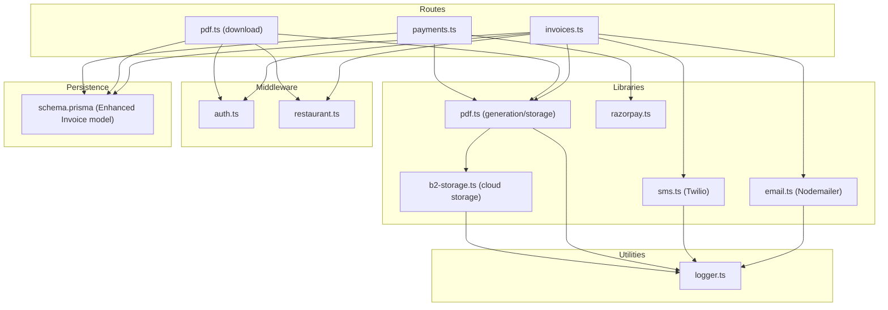
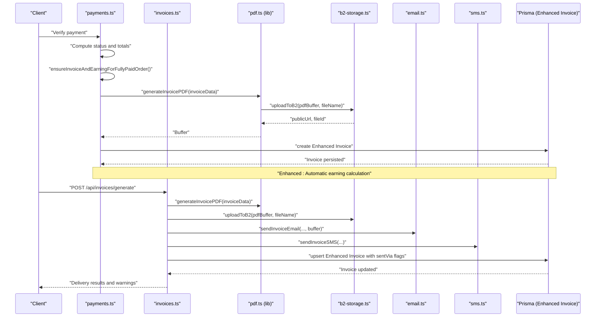
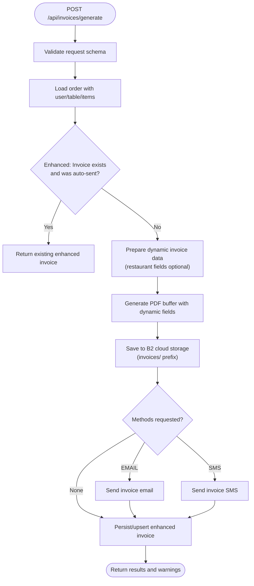
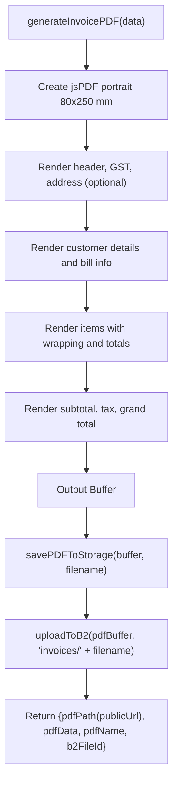
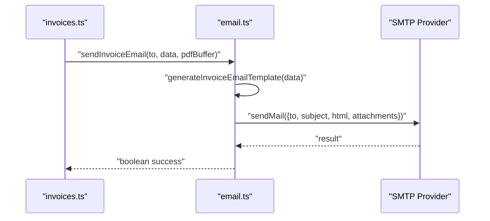
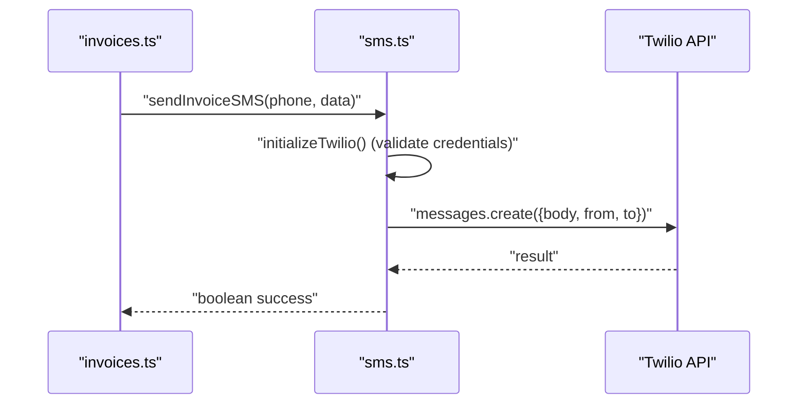
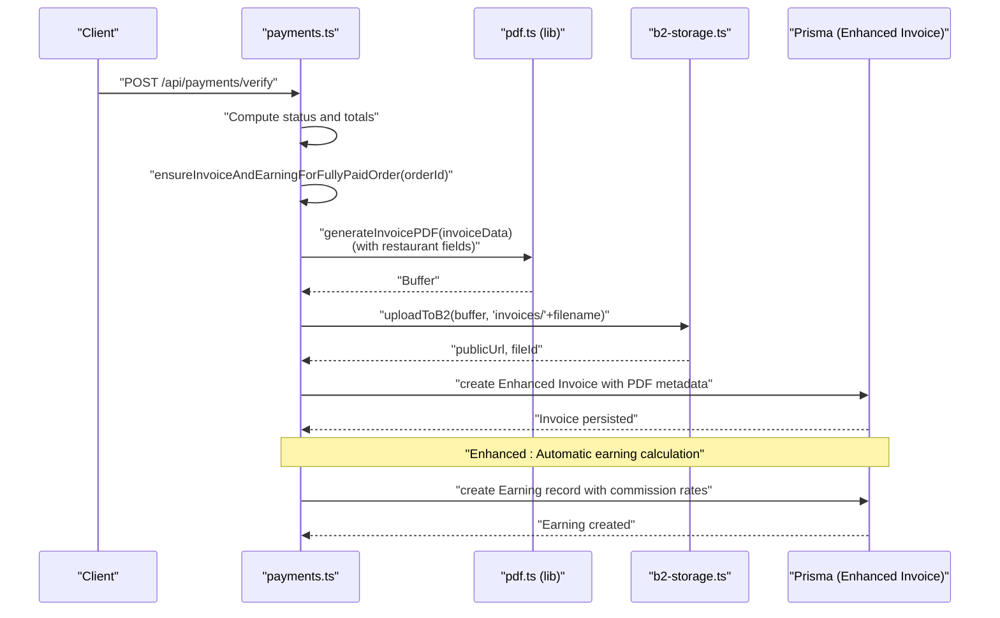
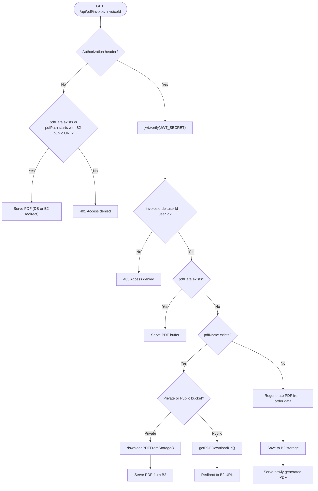
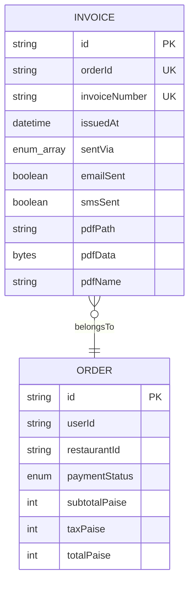
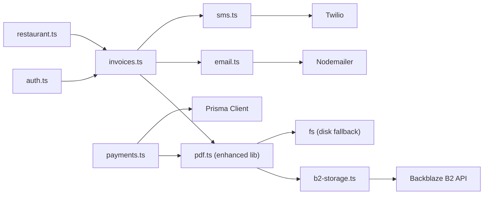

# Document Generation

<cite>
**Referenced Files in This Document**
- [invoices.ts](file://restaurant-backend/src/routes/invoices.ts)
- [pdf.ts](file://restaurant-backend/src/routes/pdf.ts)
- [pdf.ts](file://restaurant-backend/src/lib/pdf.ts)
- [b2-storage.ts](file://restaurant-backend/src/lib/b2-storage.ts)
- [email.ts](file://restaurant-backend/src/lib/email.ts)
- [sms.ts](file://restaurant-backend/src/lib/sms.ts)
- [payments.ts](file://restaurant-backend/src/routes/payments.ts)
- [schema.prisma](file://restaurant-backend/prisma/schema.prisma)
- [auth.ts](file://restaurant-backend/src/middleware/auth.ts)
- [restaurant.ts](file://restaurant-backend/src/middleware/restaurant.ts)
- [logger.ts](file://restaurant-backend/src/utils/logger.ts)
- [server.ts](file://restaurant-backend/src/server.ts)
- [package.json](file://restaurant-backend/package.json)
</cite>

## Update Summary
**Changes Made**
- Enhanced PDF generation system with Backblaze B2 cloud storage integration
- Added dynamic restaurant field support with optional address, phone, and GST/FSSAI numbers
- Improved error handling and logging throughout the document generation pipeline
- Updated payment-triggered invoice creation with enhanced earning calculation
- Strengthened access control mechanisms for PDF downloads
- Added comprehensive B2 storage management including cleanup and maintenance functions

## Table of Contents
1. [Introduction](#introduction)
2. [Project Structure](#project-structure)
3. [Core Components](#core-components)
4. [Architecture Overview](#architecture-overview)
5. [Detailed Component Analysis](#detailed-component-analysis)
6. [Dependency Analysis](#dependency-analysis)
7. [Performance Considerations](#performance-considerations)
8. [Troubleshooting Guide](#troubleshooting-guide)
9. [Conclusion](#conclusion)
10. [Appendices](#appendices)

## Introduction
This document explains the end-to-end document generation system for DeQ-Bite's invoice and notification workflows. It covers:
- Advanced PDF invoice generation with Backblaze B2 cloud storage integration
- Dynamic restaurant field support including address, phone, GST, and FSSAI numbers
- Multi-channel delivery via email and SMS, plus secure direct download
- Enhanced payment-triggered invoice creation with automatic earning calculation
- Comprehensive error handling and logging throughout the pipeline
- Advanced access control mechanisms for secure document distribution
- Cloud storage management including cleanup policies and maintenance functions
- Template customization, branding support, and batch processing capabilities

## Project Structure
The document generation system spans routing, libraries, middleware, and persistence with enhanced cloud storage integration:
- Routes orchestrate invoice generation, retrieval, resends, and refreshes with B2 storage support
- Libraries encapsulate PDF generation, email/SMS delivery, and comprehensive B2 storage management
- Middleware enforces authentication, restaurant context, and authorization
- Prisma models define the invoice entity with enhanced PDF metadata and relationships
- Logging utilities track operations, failures, and cloud storage activities

**Diagram sources**
- [invoices.ts:1-674](file://restaurant-backend/src/routes/invoices.ts#L1-L674)
- [pdf.ts:1-214](file://restaurant-backend/src/routes/pdf.ts#L1-L214)
- [pdf.ts:1-354](file://restaurant-backend/src/lib/pdf.ts#L1-L354)
- [b2-storage.ts:1-337](file://restaurant-backend/src/lib/b2-storage.ts#L1-L337)
- [email.ts:1-200](file://restaurant-backend/src/lib/email.ts#L1-L200)
- [sms.ts:1-131](file://restaurant-backend/src/lib/sms.ts#L1-L131)
- [payments.ts:1-731](file://restaurant-backend/src/routes/payments.ts#L1-L731)
- [schema.prisma:208-222](file://restaurant-backend/prisma/schema.prisma#L208-L222)
- [auth.ts:1-137](file://restaurant-backend/src/middleware/auth.ts#L1-L137)
- [restaurant.ts:1-246](file://restaurant-backend/src/middleware/restaurant.ts#L1-L246)
- [logger.ts:1-56](file://restaurant-backend/src/utils/logger.ts#L1-L56)

**Section sources**
- [invoices.ts:1-674](file://restaurant-backend/src/routes/invoices.ts#L1-L674)
- [pdf.ts:1-214](file://restaurant-backend/src/routes/pdf.ts#L1-L214)
- [pdf.ts:1-354](file://restaurant-backend/src/lib/pdf.ts#L1-L354)
- [b2-storage.ts:1-337](file://restaurant-backend/src/lib/b2-storage.ts#L1-L337)
- [email.ts:1-200](file://restaurant-backend/src/lib/email.ts#L1-L200)
- [sms.ts:1-131](file://restaurant-backend/src/lib/sms.ts#L1-L131)
- [payments.ts:1-731](file://restaurant-backend/src/routes/payments.ts#L1-L731)
- [schema.prisma:208-222](file://restaurant-backend/prisma/schema.prisma#L208-L222)
- [auth.ts:1-137](file://restaurant-backend/src/middleware/auth.ts#L1-L137)
- [restaurant.ts:1-246](file://restaurant-backend/src/middleware/restaurant.ts#L1-L246)
- [logger.ts:1-56](file://restaurant-backend/src/utils/logger.ts#L1-L56)

## Core Components
- Enhanced invoice generation route: Validates inputs, loads order data with restaurant details, prepares dynamic invoice data, generates PDF with B2 storage, sends notifications, and persists invoice metadata with enhanced fields
- Advanced PDF generation library: Creates PDFs with dynamic restaurant field support and comprehensive B2 cloud storage integration with cleanup and maintenance functions
- Email delivery: Uses Nodemailer to send HTML emails with PDF attachments and enhanced error handling
- SMS delivery: Uses Twilio to send invoice notifications with robust configuration validation
- Payment-triggered invoice creation: Automatically creates invoices when orders reach fully paid state with enhanced earning calculations
- Secure PDF download route: Serves PDFs with advanced token-based access control, B2 storage integration, and fallback mechanisms
- Enhanced middleware: Enforces JWT-based authentication, restaurant context, and comprehensive access control
- Enhanced persistence: Invoice model tracks sentVia channels, delivery flags, PDF metadata, and supports both local and cloud storage

**Section sources**
- [invoices.ts:21-262](file://restaurant-backend/src/routes/invoices.ts#L21-L262)
- [pdf.ts:53-217](file://restaurant-backend/src/lib/pdf.ts#L53-L217)
- [pdf.ts:221-354](file://restaurant-backend/src/lib/pdf.ts#L221-L354)
- [b2-storage.ts:76-124](file://restaurant-backend/src/lib/b2-storage.ts#L76-L124)
- [email.ts:31-61](file://restaurant-backend/src/lib/email.ts#L31-L61)
- [sms.ts:31-66](file://restaurant-backend/src/lib/sms.ts#L31-L66)
- [payments.ts:61-166](file://restaurant-backend/src/routes/payments.ts#L61-L166)
- [pdf.ts:11-211](file://restaurant-backend/src/routes/pdf.ts#L11-L211)
- [auth.ts:7-75](file://restaurant-backend/src/middleware/auth.ts#L7-L75)
- [restaurant.ts:202-211](file://restaurant-backend/src/middleware/restaurant.ts#L202-L211)
- [schema.prisma:208-222](file://restaurant-backend/prisma/schema.prisma#L208-L222)

## Architecture Overview
The system integrates payment completion with automatic invoice generation and multi-channel delivery, featuring comprehensive cloud storage management and enhanced security measures. It ensures secure access to generated PDFs through B2 storage with advanced access control and maintains auditability through comprehensive logging and database records.

**Diagram sources**
- [payments.ts:61-166](file://restaurant-backend/src/routes/payments.ts#L61-L166)
- [invoices.ts:21-262](file://restaurant-backend/src/routes/invoices.ts#L21-L262)
- [pdf.ts:53-217](file://restaurant-backend/src/lib/pdf.ts#L53-L217)
- [pdf.ts:221-256](file://restaurant-backend/src/lib/pdf.ts#L221-L256)
- [b2-storage.ts:76-124](file://restaurant-backend/src/lib/b2-storage.ts#L76-L124)
- [email.ts:200-227](file://restaurant-backend/src/lib/email.ts#L200-L227)
- [sms.ts:89-104](file://restaurant-backend/src/lib/sms.ts#L89-L104)
- [schema.prisma:208-222](file://restaurant-backend/prisma/schema.prisma#L208-L222)

## Detailed Component Analysis

### Enhanced Invoice Generation Workflow
- Endpoint: POST /api/invoices/generate
- Validation: Requires orderId and optional methods array (EMAIL, SMS)
- Access control: Requires JWT authentication and restaurant context
- Data preparation: Loads order with user, table, and items; computes totals and formats dynamic invoice data with restaurant field support
- PDF generation: Calls generateInvoicePDF with enhanced structured invoice data including optional restaurant fields
- B2 storage: Saves PDF to Backblaze B2 cloud storage with invoices/ prefix and returns public URL
- Delivery: Conditionally sends email and/or SMS based on requested methods and presence of contact info
- Persistence: Upserts enhanced invoice record with sentVia, delivery flags, and comprehensive PDF metadata
- Warnings: Returns warnings for skipped or failed deliveries

**Diagram sources**
- [invoices.ts:21-262](file://restaurant-backend/src/routes/invoices.ts#L21-L262)

**Section sources**
- [invoices.ts:21-262](file://restaurant-backend/src/routes/invoices.ts#L21-L262)

### Enhanced PDF Invoice Generation and B2 Storage
- Template: Compact portrait layout optimized for 80mm roll receipts with comprehensive restaurant field support
- Dynamic data formatting: Converts paise to rupees, wraps long item names, computes totals and quantities, handles optional restaurant fields
- B2 cloud storage: Writes to Backblaze B2 with invoices/ prefix for organization, returns public URL and file metadata
- Enhanced cleanup: Maintenance function to remove old files older than configurable days with comprehensive error handling
- Robust error handling: Comprehensive error logging and exception throwing for all storage operations

**Diagram sources**
- [pdf.ts:53-217](file://restaurant-backend/src/lib/pdf.ts#L53-L217)
- [pdf.ts:221-256](file://restaurant-backend/src/lib/pdf.ts#L221-L256)
- [b2-storage.ts:76-124](file://restaurant-backend/src/lib/b2-storage.ts#L76-L124)

**Section sources**
- [pdf.ts:53-217](file://restaurant-backend/src/lib/pdf.ts#L53-L217)
- [pdf.ts:221-256](file://restaurant-backend/src/lib/pdf.ts#L221-L256)
- [b2-storage.ts:76-124](file://restaurant-backend/src/lib/b2-storage.ts#L76-L124)

### Enhanced Email Delivery with Nodemailer
- Transport: Configured via SMTP_HOST, SMTP_PORT, SMTP_USER, SMTP_PASS, APP_NAME with robust error handling
- Template: Generates HTML email with styled sections for invoice details and total amount using enhanced template system
- Attachment: Attaches the generated PDF buffer with comprehensive error logging
- Delivery: Returns boolean success/failure with detailed logging and fallback mechanisms

**Diagram sources**
- [email.ts:200-227](file://restaurant-backend/src/lib/email.ts#L200-L227)
- [email.ts:31-61](file://restaurant-backend/src/lib/email.ts#L31-L61)

**Section sources**
- [email.ts:31-61](file://restaurant-backend/src/lib/email.ts#L31-L61)
- [email.ts:200-227](file://restaurant-backend/src/lib/email.ts#L200-L227)

### Enhanced SMS Delivery with Twilio
- Client: Lazily initialized with TWILIO_ACCOUNT_SID, TWILIO_AUTH_TOKEN with comprehensive validation
- Message: Generates plain-text invoice summary with enhanced formatting
- Delivery: Sends via TWILIO_PHONE_NUMBER with robust error handling and logging
- Configuration: Validates Twilio credentials and phone number before sending

**Diagram sources**
- [sms.ts:89-104](file://restaurant-backend/src/lib/sms.ts#L89-L104)
- [sms.ts:31-66](file://restaurant-backend/src/lib/sms.ts#L31-L66)

**Section sources**
- [sms.ts:31-66](file://restaurant-backend/src/lib/sms.ts#L31-L66)
- [sms.ts:89-104](file://restaurant-backend/src/lib/sms.ts#L89-L104)

### Enhanced Payment-Triggered Invoice Creation
- Endpoint: POST /api/payments/verify updates order payment status
- Enhanced after verification, ensureInvoiceAndEarningForFullyPaidOrder runs:
  - Builds invoice data from order, user, and restaurant details with comprehensive field support
  - Generates PDF with enhanced restaurant field handling
  - Saves to B2 cloud storage with public URL generation
  - Creates enhanced invoice record with PDF metadata and automatic earning calculation
  - Calculates platform commission and restaurant earnings with precise rounding

**Diagram sources**
- [payments.ts:61-166](file://restaurant-backend/src/routes/payments.ts#L61-L166)
- [pdf.ts:53-217](file://restaurant-backend/src/lib/pdf.ts#L53-L217)
- [pdf.ts:221-256](file://restaurant-backend/src/lib/pdf.ts#L221-L256)
- [b2-storage.ts:76-124](file://restaurant-backend/src/lib/b2-storage.ts#L76-L124)
- [schema.prisma:208-222](file://restaurant-backend/prisma/schema.prisma#L208-L222)

**Section sources**
- [payments.ts:61-166](file://restaurant-backend/src/routes/payments.ts#L61-L166)

### Enhanced PDF Download and Advanced Access Control
- Endpoint: GET /api/pdf/invoice/:invoiceId
- Advanced access control:
  - Without token: Allows public download only if pdfData exists in DB or pdfPath is publicly served via B2
  - With token: Verifies JWT, checks ownership against invoice.order.userId, serves PDF from B2 storage or DB
- B2 storage integration: Supports both private and public bucket configurations with signed URL generation
- On-demand generation: If PDF not available, regenerates from order data and stores it to B2
- Enhanced fallback: Comprehensive fallback mechanisms for B2 storage failures

**Diagram sources**
- [pdf.ts:11-211](file://restaurant-backend/src/routes/pdf.ts#L11-L211)
- [auth.ts:7-75](file://restaurant-backend/src/middleware/auth.ts#L7-L75)
- [pdf.ts:263-313](file://restaurant-backend/src/lib/pdf.ts#L263-L313)
- [b2-storage.ts:153-182](file://restaurant-backend/src/lib/b2-storage.ts#L153-L182)

**Section sources**
- [pdf.ts:11-211](file://restaurant-backend/src/routes/pdf.ts#L11-L211)
- [auth.ts:7-75](file://restaurant-backend/src/middleware/auth.ts#L7-L75)

### Enhanced Invoice Resend and Refresh PDF
- Resend endpoint: POST /api/invoices/:invoiceId/resend
  - Validates invoice ownership with enhanced checks
  - Rebuilds invoice data with dynamic restaurant fields and regenerates PDF if needed
  - Sends email/SMS per requested methods with comprehensive error handling
  - Updates sentVia flags with deduplication
- Enhanced refresh PDF endpoint: POST /api/invoices/:invoiceOrOrderId/refresh-pdf
  - Resolves invoice by id or order id with comprehensive validation
  - Rebuilds invoice data from order with enhanced restaurant field support
  - Regenerates and re-stores PDF to B2 storage
  - Updates invoice record with enhanced metadata

**Section sources**
- [invoices.ts:348-496](file://restaurant-backend/src/routes/invoices.ts#L348-L496)
- [invoices.ts:498-641](file://restaurant-backend/src/routes/invoices.ts#L498-L641)

### Enhanced Data Model: Invoice
- Fields: orderId (unique), invoiceNumber (unique), issuedAt, sentVia (array), emailSent, smsSent, pdfPath, pdfData, pdfName
- Enhanced relationships: Belongs to Order via orderId with comprehensive invoice metadata
- B2 storage support: Enhanced PDF metadata fields for cloud storage integration

**Diagram sources**
- [schema.prisma:208-222](file://restaurant-backend/prisma/schema.prisma#L208-L222)

**Section sources**
- [schema.prisma:208-222](file://restaurant-backend/prisma/schema.prisma#L208-L222)

## Dependency Analysis
- Routing depends on middleware for auth and restaurant context with enhanced validation
- Invoice route depends on enhanced PDF generation, B2 storage, email, and SMS libraries
- Payment route triggers enhanced invoice creation with automatic earning calculation
- Libraries depend on external services (Nodemailer, Twilio, Backblaze B2) with comprehensive error handling
- Persistence relies on Prisma client and database connectivity with enhanced invoice metadata

**Diagram sources**
- [invoices.ts:1-12](file://restaurant-backend/src/routes/invoices.ts#L1-L12)
- [auth.ts:1-10](file://restaurant-backend/src/middleware/auth.ts#L1-L10)
- [restaurant.ts:1-10](file://restaurant-backend/src/middleware/restaurant.ts#L1-L10)
- [pdf.ts:1-11](file://restaurant-backend/src/lib/pdf.ts#L1-L11)
- [b2-storage.ts:1-2](file://restaurant-backend/src/lib/b2-storage.ts#L1-L2)
- [email.ts:1-2](file://restaurant-backend/src/lib/email.ts#L1-L2)
- [sms.ts:1-2](file://restaurant-backend/src/lib/sms.ts#L1-L2)
- [payments.ts:1-12](file://restaurant-backend/src/routes/payments.ts#L1-L12)

**Section sources**
- [invoices.ts:1-12](file://restaurant-backend/src/routes/invoices.ts#L1-L12)
- [pdf.ts:1-11](file://restaurant-backend/src/lib/pdf.ts#L1-L11)
- [b2-storage.ts:1-2](file://restaurant-backend/src/lib/b2-storage.ts#L1-L2)
- [email.ts:1-2](file://restaurant-backend/src/lib/email.ts#L1-L2)
- [sms.ts:1-2](file://restaurant-backend/src/lib/sms.ts#L1-L2)
- [payments.ts:1-12](file://restaurant-backend/src/routes/payments.ts#L1-L12)

## Performance Considerations
- Enhanced PDF generation: Keep invoice data minimal; avoid excessive item lists to reduce rendering time and B2 upload costs
- B2 storage optimization: Configure appropriate bucket settings for optimal performance; consider CDN integration for public access
- Email/SMS: Enhanced batching capabilities; consider queueing for high-volume scenarios with improved error handling
- B2 cleanup: Use cleanupOldInvoices with appropriate retention policies to manage storage costs
- Enhanced logging: Ensure log rotation and avoid logging sensitive data; comprehensive error logging for debugging
- Cloud storage: Monitor B2 usage patterns and optimize file naming conventions for better organization

## Troubleshooting Guide
Common issues and diagnostics with enhanced error handling:
- Missing tokens or invalid JWT: Access denied errors when downloading PDFs or generating invoices with comprehensive logging
- B2 storage configuration: Enhanced error messages for missing credentials, bucket configuration, and authentication failures
- Missing email/SMS configuration: Delivery flags remain false with detailed error logging; warnings indicate misconfiguration
- Missing contact info: Delivery skipped with comprehensive warnings for email or SMS
- B2 storage failures: Enhanced error handling for upload/download operations; check B2 credentials and bucket permissions
- Twilio configuration: Improved validation and error messages for missing credentials and phone number configuration
- Database connectivity: Enhanced Prisma client connection error handling with comprehensive logging
- File cleanup failures: Detailed logging for B2 cleanup operations with error recovery mechanisms

**Section sources**
- [pdf.ts:54-86](file://restaurant-backend/src/routes/pdf.ts#L54-L86)
- [auth.ts:40-44](file://restaurant-backend/src/middleware/auth.ts#L40-L44)
- [email.ts:52-60](file://restaurant-backend/src/lib/email.ts#L52-L60)
- [sms.ts:35-43](file://restaurant-backend/src/lib/sms.ts#L35-L43)
- [pdf.ts:216-223](file://restaurant-backend/src/lib/pdf.ts#L216-L223)
- [b2-storage.ts:117-123](file://restaurant-backend/src/lib/b2-storage.ts#L117-L123)
- [logger.ts:1-56](file://restaurant-backend/src/utils/logger.ts#L1-L56)

## Conclusion
DeQ-Bite's enhanced document generation system provides a secure, multi-channel invoice workflow integrated with payment verification and comprehensive cloud storage management. It leverages Backblaze B2 for scalable PDF storage, Nodemailer and Twilio for notifications, and implements advanced access control mechanisms. The system features enhanced dynamic restaurant field support, comprehensive error handling, automatic earning calculations, and robust maintenance capabilities. It exposes endpoints for on-demand generation, resends, refreshes, and includes sophisticated cleanup policies for optimal resource management.

## Appendices

### Enhanced Environment Variables
- SMTP configuration for email: SMTP_HOST, SMTP_PORT, SMTP_USER, SMTP_PASS, APP_NAME with enhanced error handling
- Twilio configuration for SMS: TWILIO_ACCOUNT_SID, TWILIO_AUTH_TOKEN, TWILIO_PHONE_NUMBER with validation
- Backblaze B2 configuration: B2_APPLICATION_KEY_ID, B2_APPLICATION_KEY, B2_BUCKET_ID/B2_BUCKET_NAME, B2_BUCKET_PRIVATE, B2_CUSTOM_DOMAIN
- Database: DATABASE_URL, DIRECT_DATABASE_URL
- Logging: LOG_LEVEL with enhanced logging levels
- JWT: JWT_SECRET with validation

**Section sources**
- [email.ts:5-15](file://restaurant-backend/src/lib/email.ts#L5-L15)
- [sms.ts:7-21](file://restaurant-backend/src/lib/sms.ts#L7-L21)
- [b2-storage.ts:13-23](file://restaurant-backend/src/lib/b2-storage.ts#L13-L23)
- [config database:1-66](file://restaurant-backend/src/config/database.ts#L1-L66)
- [logger.ts:50-55](file://restaurant-backend/src/utils/logger.ts#L50-L55)

### Enhanced Template Customization and Branding
- PDF template: Modify header, footer, and layout in generateInvoicePDF with comprehensive restaurant field support
- Email template: Customize HTML/CSS in generateInvoiceEmailTemplate with enhanced styling
- Dynamic branding fields: restaurantName, restaurantAddress, restaurantCity, restaurantState, restaurantPhone, restaurantEmail, gstNumber, fssaiNumber (all optional)

**Section sources**
- [pdf.ts:53-217](file://restaurant-backend/src/lib/pdf.ts#L53-L217)
- [email.ts:66-195](file://restaurant-backend/src/lib/email.ts#L66-L195)

### Enhanced Batch Processing and Archive Management
- Batch generation: Use refresh-pdf endpoint to regenerate PDFs for multiple invoices with B2 storage optimization
- Enhanced cleanup policy: Use cleanupOldInvoices with configurable retention periods; schedule via cron or job scheduler
- Archive management: Store historical invoices in B2 cloud storage with organized folder structure and maintain metadata in DB
- B2 maintenance: Comprehensive file listing, deletion, and cleanup operations with detailed logging

**Section sources**
- [invoices.ts:498-641](file://restaurant-backend/src/routes/invoices.ts#L498-L641)
- [pdf.ts:319-354](file://restaurant-backend/src/lib/pdf.ts#L319-L354)
- [b2-storage.ts:218-252](file://restaurant-backend/src/lib/b2-storage.ts#L218-L252)

### Enhanced Security Features
- Advanced access control: JWT-based authentication with comprehensive validation and restaurant context enforcement
- B2 storage security: Private bucket support with signed URL generation for secure document distribution
- Enhanced error handling: Comprehensive logging throughout the document generation pipeline with detailed error messages
- Data validation: Strict input validation with Zod schemas and comprehensive error responses
- Audit logging: Enhanced audit trail for all document generation and delivery operations

**Section sources**
- [auth.ts:7-75](file://restaurant-backend/src/middleware/auth.ts#L7-L75)
- [restaurant.ts:202-211](file://restaurant-backend/src/middleware/restaurant.ts#L202-L211)
- [pdf.ts:216-223](file://restaurant-backend/src/lib/pdf.ts#L216-L223)
- [b2-storage.ts:267-302](file://restaurant-backend/src/lib/b2-storage.ts#L267-L302)
- [logger.ts:1-56](file://restaurant-backend/src/utils/logger.ts#L1-L56)