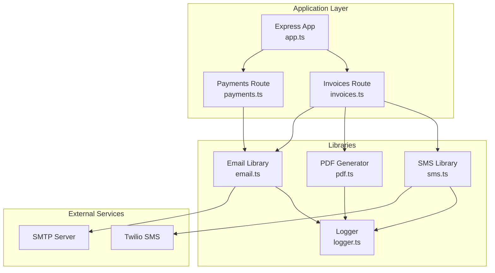
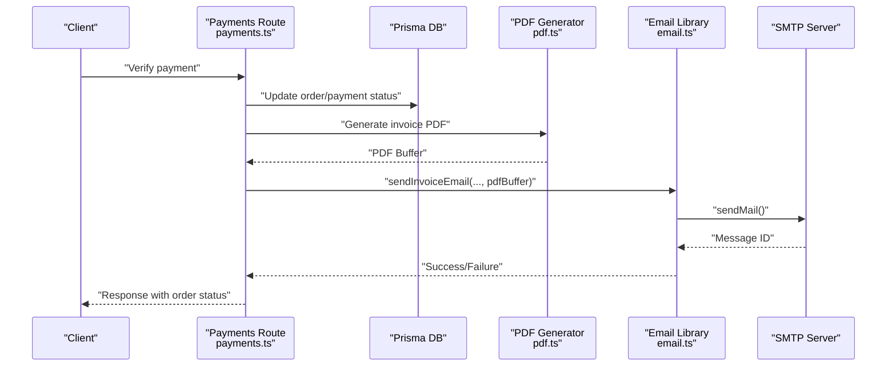
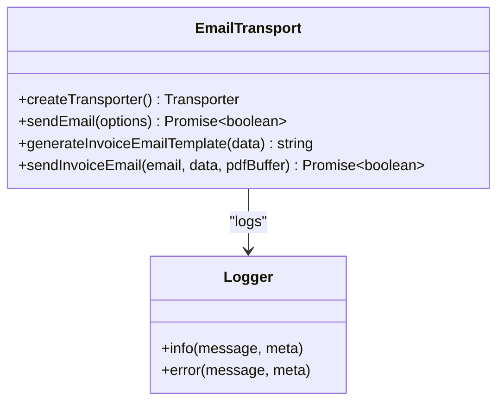
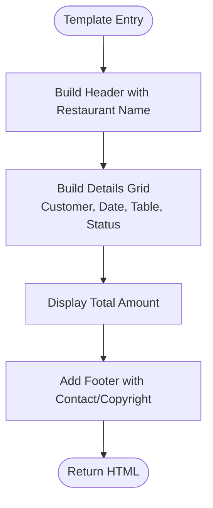
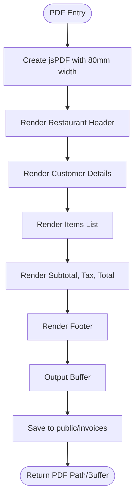
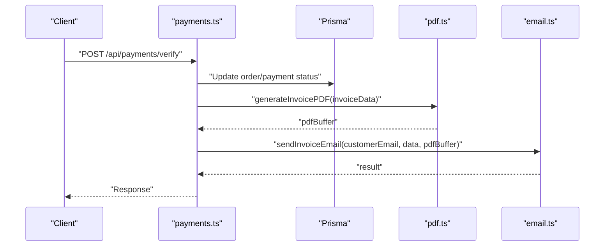
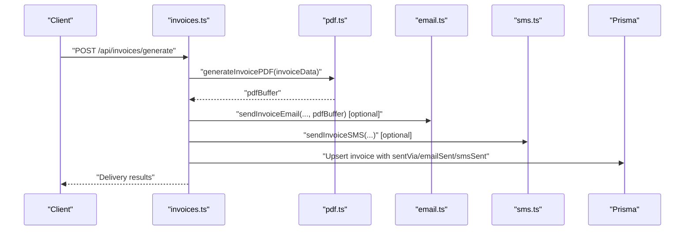
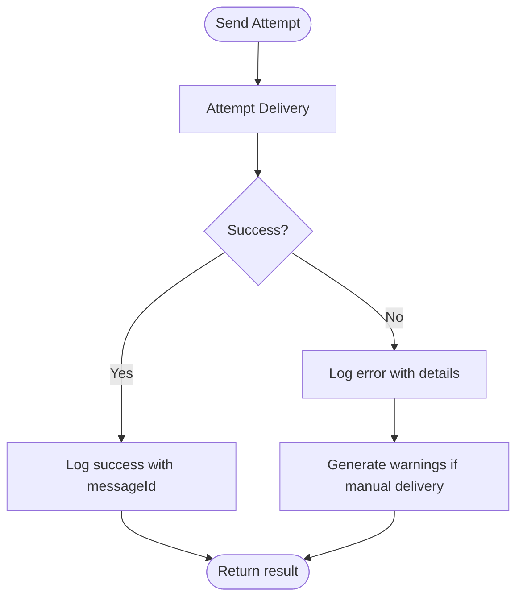
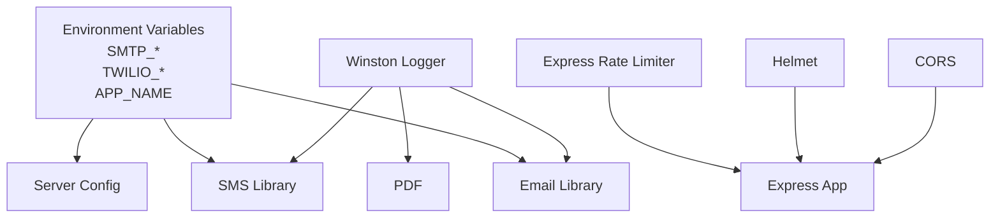
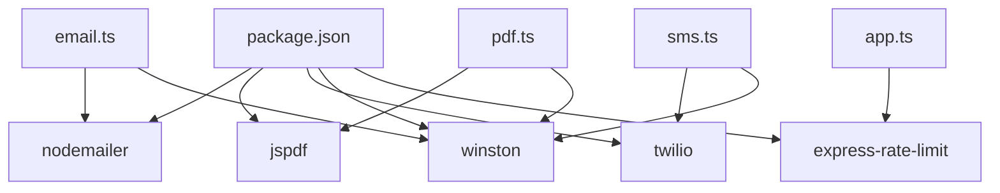

# Email Delivery System

<cite>
**Referenced Files in This Document**
- [email.ts](file://restaurant-backend/src/lib/email.ts)
- [invoices.ts](file://restaurant-backend/src/route/invoices.ts)
- [payments.ts](file://restaurant-backend/src/route/payments.ts)
- [pdf.ts](file://restaurant-backend/src/lib/pdf.ts)
- [sms.ts](file://restaurant-backend/src/lib/sms.ts)
- [app.ts](file://restaurant-backend/src/app.ts)
- [logger.ts](file://restaurant-backend/src/utils/logger.ts)
- [server.ts](file://restaurant-backend/src/server.ts)
- [package.json](file://restaurant-backend/package.json)
</cite>

## Table of Contents
1. [Introduction](#introduction)
2. [Project Structure](#project-structure)
3. [Core Components](#core-components)
4. [Architecture Overview](#architecture-overview)
5. [Detailed Component Analysis](#detailed-component-analysis)
6. [Dependency Analysis](#dependency-analysis)
7. [Performance Considerations](#performance-considerations)
8. [Troubleshooting Guide](#troubleshooting-guide)
9. [Conclusion](#conclusion)

## Introduction
This document describes the email delivery system integrated with Nodemailer in the DeQ-Bite restaurant management backend. It covers SMTP configuration, authentication, email templates for invoices, the end-to-end sending workflow triggered after successful payment processing, error handling, retry mechanisms, bounce management, integration with the PDF generation system for automatic invoice attachments, and security considerations including credential protection, rate limiting, and logging for delivery tracking.

## Project Structure
The email delivery system spans several modules:
- Email transport and sending logic
- Invoice generation and delivery orchestration
- PDF generation for invoice attachments
- SMS fallback delivery (complementary to email)
- Application security and rate limiting
- Logging infrastructure

**Diagram sources**
- [app.ts:1-148](file://restaurant-backend/src/app.ts#L1-L148)
- [payments.ts:1-731](file://restaurant-backend/src/routes/payments.ts#L1-L731)
- [invoices.ts:1-599](file://restaurant-backend/src/routes/invoices.ts#L1-L599)
- [email.ts:1-227](file://restaurant-backend/src/lib/email.ts#L1-L227)
- [pdf.ts:1-259](file://restaurant-backend/src/lib/pdf.ts#L1-L259)
- [sms.ts:1-131](file://restaurant-backend/src/lib/sms.ts#L1-L131)
- [logger.ts:1-56](file://restaurant-backend/src/utils/logger.ts#L1-L56)

**Section sources**
- [app.ts:1-148](file://restaurant-backend/src/app.ts#L1-L148)
- [package.json:1-80](file://restaurant-backend/package.json#L1-L80)

## Core Components
- Email transport and sending:
  - SMTP configuration via environment variables
  - Authentication using user and password
  - Transport creation and email sending with structured logging
- Invoice email template:
  - Dynamic HTML template with customer, order, and totals
  - Automatic PDF attachment handling
- PDF generation:
  - Invoice PDF creation and storage
  - Public URL exposure for downloaded invoices
- Delivery orchestration:
  - Payments route triggers invoice generation upon completion
  - Invoices route supports manual generation and resend with email/SMS
- Security and resilience:
  - Rate limiting at the Express layer
  - Environment-based configuration for credentials
  - Comprehensive logging for delivery tracking

**Section sources**
- [email.ts:1-227](file://restaurant-backend/src/lib/email.ts#L1-L227)
- [pdf.ts:1-259](file://restaurant-backend/src/lib/pdf.ts#L1-L259)
- [invoices.ts:1-599](file://restaurant-backend/src/routes/invoices.ts#L1-L599)
- [payments.ts:1-731](file://restaurant-backend/src/routes/payments.ts#L1-L731)
- [app.ts:67-77](file://restaurant-backend/src/app.ts#L67-L77)

## Architecture Overview
The email delivery pipeline integrates with payment completion and invoice generation. After a payment is verified/completed, the system generates an invoice PDF and sends an email with the PDF attached. Alternatively, users can manually generate and deliver invoices via dedicated endpoints.

**Diagram sources**
- [payments.ts:390-407](file://restaurant-backend/src/routes/payments.ts#L390-L407)
- [pdf.ts:37-187](file://restaurant-backend/src/lib/pdf.ts#L37-L187)
- [email.ts:200-227](file://restaurant-backend/src/lib/email.ts#L200-L227)

## Detailed Component Analysis

### Email Transport and Sending
- SMTP configuration:
  - Host, port, and secure flag derived from environment variables
  - Authentication using user and password
- Email sending:
  - From address constructed from application name and SMTP user
  - Supports attachments (PDF buffer)
  - Structured logging on success/failure
- Template generation:
  - Invoice-specific HTML template with responsive styles and dynamic content
  - Attachment filename and content-type set for PDF

**Diagram sources**
- [email.ts:5-61](file://restaurant-backend/src/lib/email.ts#L5-L61)
- [email.ts:66-195](file://restaurant-backend/src/lib/email.ts#L66-L195)
- [email.ts:200-227](file://restaurant-backend/src/lib/email.ts#L200-L227)
- [logger.ts:1-56](file://restaurant-backend/src/utils/logger.ts#L1-L56)

**Section sources**
- [email.ts:5-61](file://restaurant-backend/src/lib/email.ts#L5-L61)
- [email.ts:66-195](file://restaurant-backend/src/lib/email.ts#L66-L195)
- [email.ts:200-227](file://restaurant-backend/src/lib/email.ts#L200-L227)

### Invoice Email Template
- Structure:
  - Header with restaurant name
  - Invoice details grid (customer, date, table, status)
  - Total amount display
  - Footer with contact and copyright
- Dynamic content:
  - Customer name, invoice number, order date, total, table number, restaurant name
- Styling:
  - CSS-inlined for broad SMTP compatibility
  - Responsive grid layout

**Diagram sources**
- [email.ts:66-195](file://restaurant-backend/src/lib/email.ts#L66-L195)

**Section sources**
- [email.ts:66-195](file://restaurant-backend/src/lib/email.ts#L66-L195)

### PDF Generation and Storage
- PDF generation:
  - Uses jsPDF with portrait orientation and 80mm width
  - Includes restaurant header, customer details, items list, totals, and footer
  - Returns a Buffer suitable for email attachments
- Storage:
  - Writes PDF to public/invoices directory
  - Exposes a public URL for downloads
- Cleanup:
  - Optional maintenance function to remove old invoices

**Diagram sources**
- [pdf.ts:37-187](file://restaurant-backend/src/lib/pdf.ts#L37-L187)
- [pdf.ts:191-224](file://restaurant-backend/src/lib/pdf.ts#L191-L224)

**Section sources**
- [pdf.ts:37-187](file://restaurant-backend/src/lib/pdf.ts#L37-L187)
- [pdf.ts:191-224](file://restaurant-backend/src/lib/pdf.ts#L191-L224)

### Delivery Orchestration (Payments → Email)
- Payment verification updates order and payment records
- On completion, ensures invoice creation and earnings calculation
- Emits real-time events and logs delivery attempts

**Diagram sources**
- [payments.ts:294-407](file://restaurant-backend/src/routes/payments.ts#L294-L407)
- [pdf.ts:37-187](file://restaurant-backend/src/lib/pdf.ts#L37-L187)
- [email.ts:200-227](file://restaurant-backend/src/lib/email.ts#L200-L227)

**Section sources**
- [payments.ts:294-407](file://restaurant-backend/src/routes/payments.ts#L294-L407)

### Delivery Orchestration (Manual Invoices → Email/SMS)
- Manual generation endpoint:
  - Validates order and payment status
  - Generates PDF and stores it
  - Sends email/SMS based on requested methods
  - Updates invoice record with delivery status
- Resend endpoint:
  - Rebuilds invoice data and regenerates PDF if needed
  - Attempts email/SMS delivery and updates invoice record

**Diagram sources**
- [invoices.ts:21-241](file://restaurant-backend/src/routes/invoices.ts#L21-L241)
- [pdf.ts:37-187](file://restaurant-backend/src/lib/pdf.ts#L37-L187)
- [email.ts:200-227](file://restaurant-backend/src/lib/email.ts#L200-L227)
- [sms.ts:89-104](file://restaurant-backend/src/lib/sms.ts#L89-L104)

**Section sources**
- [invoices.ts:21-241](file://restaurant-backend/src/routes/invoices.ts#L21-L241)
- [invoices.ts:328-454](file://restaurant-backend/src/routes/invoices.ts#L328-L454)

### Error Handling and Retry Mechanisms
- Email failures:
  - Catch-all error handling logs failure details and returns false
- Delivery warnings:
  - Manual invoice endpoints generate warnings for missing email/phone or failed delivery
- Idempotent delivery:
  - Existing invoices with sentVia populated are returned without re-sending
- Retry strategy:
  - No built-in retry loop; failures are logged and surfaced to clients
- Bounce management:
  - Not implemented in code; relies on external SMTP bounce handling

**Diagram sources**
- [email.ts:31-61](file://restaurant-backend/src/lib/email.ts#L31-L61)
- [invoices.ts:571-596](file://restaurant-backend/src/routes/invoices.ts#L571-L596)

**Section sources**
- [email.ts:31-61](file://restaurant-backend/src/lib/email.ts#L31-L61)
- [invoices.ts:571-596](file://restaurant-backend/src/routes/invoices.ts#L571-L596)

### Security Considerations
- Credentials:
  - SMTP user/password and application name loaded from environment variables
  - Twilio SID/token and phone number similarly environment-configured
- Rate limiting:
  - Express rate limiter applied globally to throttle requests
- Logging:
  - Winston-based logger with JSON format and file transports
  - Sensitive data redacted in logs (partial signatures shown in other modules)
- Helmet and CORS:
  - Helmet enabled for basic security headers
  - CORS configured with allowed origins and credentials

**Diagram sources**
- [email.ts:6-14](file://restaurant-backend/src/lib/email.ts#L6-L14)
- [sms.ts:7-21](file://restaurant-backend/src/lib/sms.ts#L7-L21)
- [app.ts:37-77](file://restaurant-backend/src/app.ts#L37-L77)
- [logger.ts:1-56](file://restaurant-backend/src/utils/logger.ts#L1-L56)

**Section sources**
- [email.ts:6-14](file://restaurant-backend/src/lib/email.ts#L6-L14)
- [sms.ts:7-21](file://restaurant-backend/src/lib/sms.ts#L7-L21)
- [app.ts:37-77](file://restaurant-backend/src/app.ts#L37-L77)
- [logger.ts:1-56](file://restaurant-backend/src/utils/logger.ts#L1-L56)

## Dependency Analysis
- External libraries:
  - Nodemailer for SMTP transport and sending
  - jspdf for PDF generation
  - Twilio SDK for SMS notifications
  - Winston for structured logging
  - Express-rate-limit for rate limiting
- Internal dependencies:
  - PDF generator invoked by email and invoices routes
  - Logger used across email, SMS, and PDF modules
  - Environment-driven configuration shared across modules

**Diagram sources**
- [package.json:18-44](file://restaurant-backend/package.json#L18-L44)
- [email.ts:1](file://restaurant-backend/src/lib/email.ts#L1)
- [pdf.ts:1](file://restaurant-backend/src/lib/pdf.ts#L1)
- [sms.ts:1](file://restaurant-backend/src/lib/sms.ts#L1)
- [app.ts:5](file://restaurant-backend/src/app.ts#L5)

**Section sources**
- [package.json:18-44](file://restaurant-backend/package.json#L18-L44)

## Performance Considerations
- Email sending:
  - Single transport per send; consider connection pooling for high-volume scenarios
  - Attachments are buffered; large PDFs increase memory usage
- PDF generation:
  - Buffered output avoids disk thrashing; ensure adequate memory for concurrent generations
- Rate limiting:
  - Global limiter reduces load; tune window and max based on deployment capacity
- Logging:
  - File transports are synchronous; consider asynchronous transports for high throughput

## Troubleshooting Guide
- Email delivery fails:
  - Verify SMTP_HOST, SMTP_PORT, SMTP_USER, SMTP_PASS, APP_NAME are set
  - Check SMTP server accessibility and TLS configuration
  - Review logs for error messages and messageId
- PDF generation errors:
  - Confirm jsPDF rendering parameters and buffer conversion
  - Check public/invoices directory permissions and disk space
- Missing email/SMS:
  - Ensure customer has email/phone on file
  - For manual delivery, review warnings returned by the endpoint
- Rate limiting:
  - If receiving "Too many requests", adjust client-side retry or server-side limits

**Section sources**
- [email.ts:31-61](file://restaurant-backend/src/lib/email.ts#L31-L61)
- [pdf.ts:179-186](file://restaurant-backend/src/lib/pdf.ts#L179-L186)
- [invoices.ts:571-596](file://restaurant-backend/src/routes/invoices.ts#L571-L596)
- [app.ts:67-77](file://restaurant-backend/src/app.ts#L67-L77)

## Conclusion
The email delivery system integrates SMTP-based email sending with PDF generation to provide automated invoice delivery. It supports both payment-triggered and manual delivery workflows, with robust logging and warnings for troubleshooting. Security is addressed through environment-based configuration, rate limiting, and structured logging. Extending the system with connection pooling, retry logic, and bounce handling would further improve reliability and operational insights.