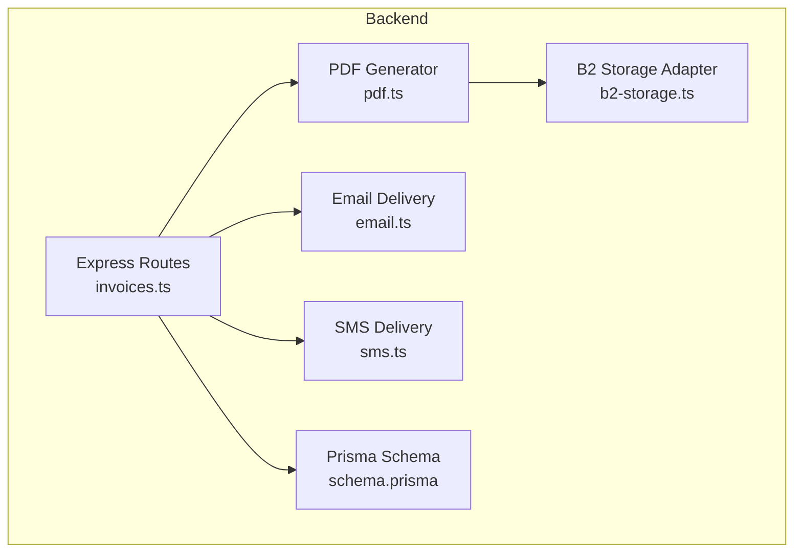
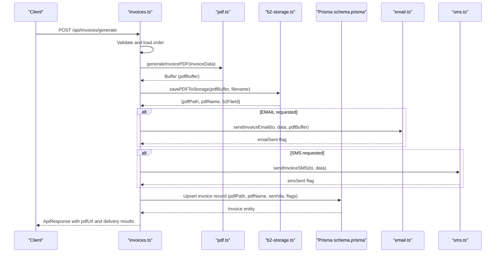
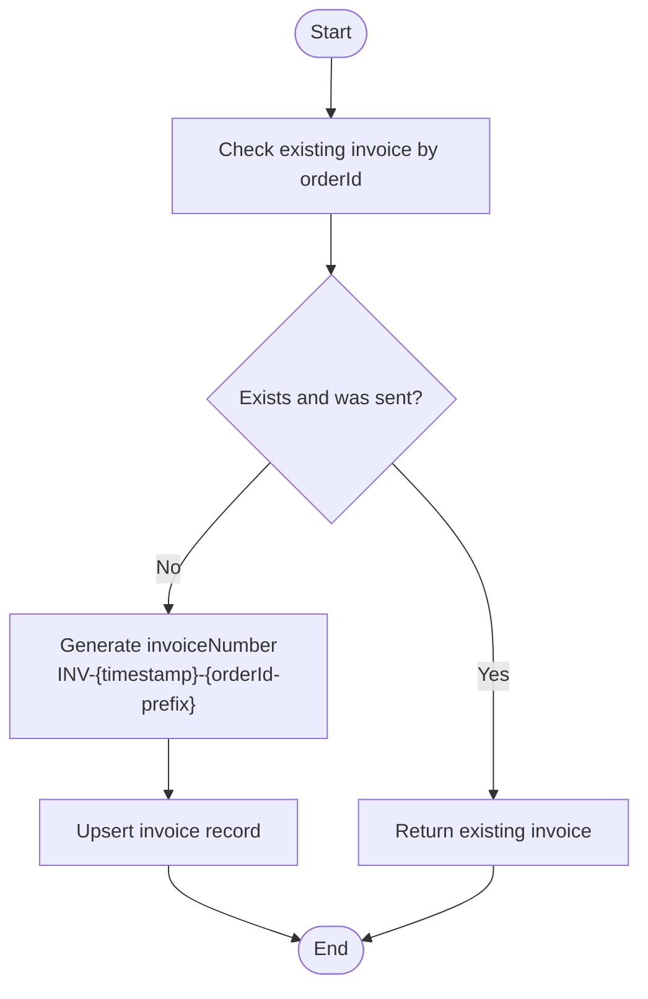
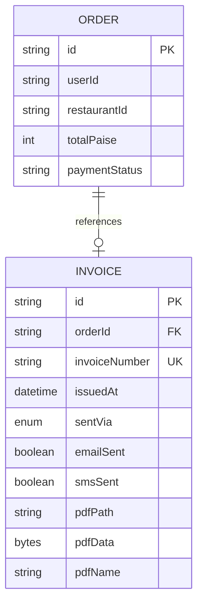
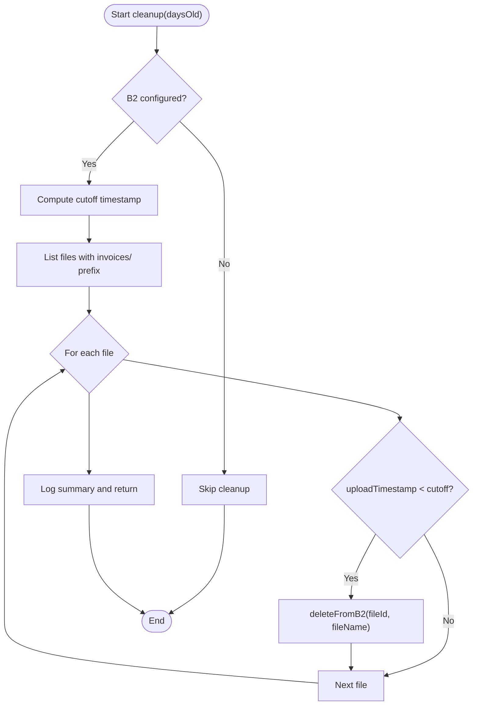
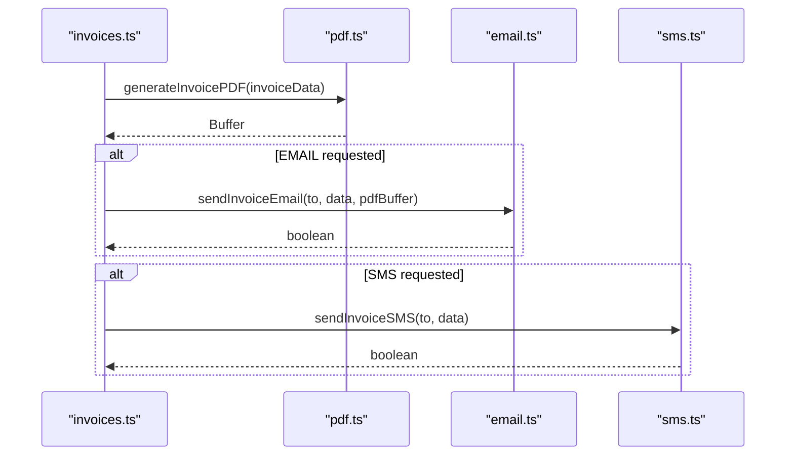
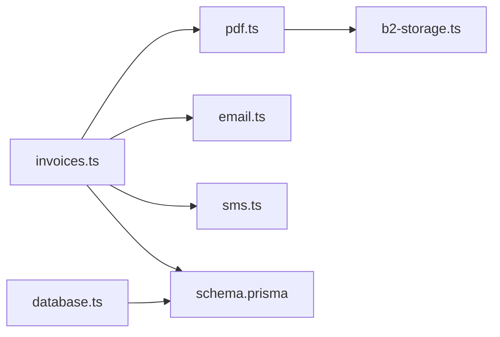

# File Storage Management

<cite>
**Referenced Files in This Document**
- [invoices.ts](file://restaurant-backend/src/routes/invoices.ts)
- [pdf.ts](file://restaurant-backend/src/lib/pdf.ts)
- [b2-storage.ts](file://restaurant-backend/src/lib/b2-storage.ts)
- [email.ts](file://restaurant-backend/src/lib/email.ts)
- [sms.ts](file://restaurant-backend/src/lib/sms.ts)
- [schema.prisma](file://restaurant-backend/prisma/schema.prisma)
- [database.ts](file://restaurant-backend/src/config/database.ts)
- [.env.example](file://restaurant-backend/.env.example)
- [render.yaml](file://restaurant-backend/render.yaml)
</cite>

## Table of Contents
1. [Introduction](#introduction)
2. [Project Structure](#project-structure)
3. [Core Components](#core-components)
4. [Architecture Overview](#architecture-overview)
5. [Detailed Component Analysis](#detailed-component-analysis)
6. [Dependency Analysis](#dependency-analysis)
7. [Performance Considerations](#performance-considerations)
8. [Troubleshooting Guide](#troubleshooting-guide)
9. [Conclusion](#conclusion)
10. [Appendices](#appendices)

## Introduction
This document describes the file storage and management system for generated invoices and documents. It covers directory structure under public/invoices, file naming conventions, persistence strategy, access controls, public download capabilities, cleanup mechanisms, integration with PDF generation and email/SMS workflows, security considerations, and performance optimization for large-scale storage.

## Project Structure
The system centers around:
- An Express route module that orchestrates invoice generation, delivery, and retrieval.
- A PDF generation library that produces invoice PDF buffers.
- A Backblaze B2 storage adapter that persists PDFs and generates public URLs.
- Email and SMS libraries for delivery notifications.
- A Prisma schema that models invoice records and their relations to orders.

**Diagram sources**
- [invoices.ts:1-599](file://restaurant-backend/src/routes/invoices.ts#L1-L599)
- [pdf.ts:1-293](file://restaurant-backend/src/lib/pdf.ts#L1-L293)
- [b2-storage.ts:1-281](file://restaurant-backend/src/lib/b2-storage.ts#L1-L281)
- [schema.prisma:208-222](file://restaurant-backend/prisma/schema.prisma#L208-L222)
- [email.ts:1-227](file://restaurant-backend/src/lib/email.ts#L1-L227)
- [sms.ts:1-131](file://restaurant-backend/src/lib/sms.ts#L1-L131)

**Section sources**
- [invoices.ts:1-599](file://restaurant-backend/src/routes/invoices.ts#L1-L599)
- [pdf.ts:1-293](file://restaurant-backend/src/lib/pdf.ts#L1-L293)
- [b2-storage.ts:1-281](file://restaurant-backend/src/lib/b2-storage.ts#L1-L281)
- [schema.prisma:208-222](file://restaurant-backend/prisma/schema.prisma#L208-L222)
- [email.ts:1-227](file://restaurant-backend/src/lib/email.ts#L1-L227)
- [sms.ts:1-131](file://restaurant-backend/src/lib/sms.ts#L1-L131)

## Core Components
- Invoice route controller: Validates requests, loads order data, generates PDFs, persists via B2, sends email/SMS, and updates the invoice record.
- PDF generator: Creates invoice PDF buffers with standardized layout and pricing.
- B2 storage adapter: Handles upload, download, listing, deletion, and public URL generation for invoice files.
- Email/SMS integrations: Send notifications with optional PDF attachments or text messages.
- Prisma model: Stores invoice metadata, delivery status, and optional local PDF data.

Key responsibilities:
- Automatic directory creation and file naming for local fallback.
- Cloud storage via Backblaze B2 with invoices/ prefix.
- Unique invoice number generation and conflict resolution.
- Cleanup of old files based on configurable retention.

**Section sources**
- [invoices.ts:22-241](file://restaurant-backend/src/routes/invoices.ts#L22-L241)
- [pdf.ts:36-186](file://restaurant-backend/src/lib/pdf.ts#L36-L186)
- [pdf.ts:190-225](file://restaurant-backend/src/lib/pdf.ts#L190-L225)
- [b2-storage.ts:76-122](file://restaurant-backend/src/lib/b2-storage.ts#L76-L122)
- [email.ts:31-61](file://restaurant-backend/src/lib/email.ts#L31-L61)
- [sms.ts:31-66](file://restaurant-backend/src/lib/sms.ts#L31-L66)
- [schema.prisma:208-222](file://restaurant-backend/prisma/schema.prisma#L208-L222)

## Architecture Overview
The invoice lifecycle integrates route handlers, PDF generation, cloud storage, and delivery channels.

**Diagram sources**
- [invoices.ts:22-241](file://restaurant-backend/src/routes/invoices.ts#L22-L241)
- [pdf.ts:36-186](file://restaurant-backend/src/lib/pdf.ts#L36-L186)
- [pdf.ts:190-225](file://restaurant-backend/src/lib/pdf.ts#L190-L225)
- [b2-storage.ts:76-122](file://restaurant-backend/src/lib/b2-storage.ts#L76-L122)
- [email.ts:200-227](file://restaurant-backend/src/lib/email.ts#L200-L227)
- [sms.ts:89-104](file://restaurant-backend/src/lib/sms.ts#L89-L104)
- [schema.prisma:208-222](file://restaurant-backend/prisma/schema.prisma#L208-L222)

## Detailed Component Analysis

### Directory Structure and Local Fallback
- Local storage writes PDFs to a dedicated invoices directory under the public folder.
- The directory is created automatically if missing.
- Public URL generation for local files uses a predictable path pattern.

Behavior highlights:
- Automatic creation of the invoices directory during write operations.
- Filename composition includes the invoice number and .pdf extension.
- Public URL returned for local mode is a relative path under /invoices/.

Operational note:
- The local fallback is implemented in the compiled distribution code and complements the primary B2 cloud storage strategy.

**Section sources**
- [pdf.ts:190-225](file://restaurant-backend/src/lib/pdf.ts#L190-L225)

### Cloud Storage with Backblaze B2
- All invoice PDFs are uploaded to B2 under a structured prefix for organization.
- Public URLs are generated either via a custom domain or B2’s native URL format.
- Authentication and bucket resolution are handled centrally with caching.

Key behaviors:
- Prefixes all uploads with invoices/.
- Generates public URLs using a custom domain if configured; otherwise uses B2’s file URL.
- Lists and deletes files for maintenance tasks.

Security and reliability:
- Uses application keys and bucket identifiers from environment variables.
- Centralized authentication caching avoids repeated authorizations.

**Section sources**
- [pdf.ts:190-225](file://restaurant-backend/src/lib/pdf.ts#L190-L225)
- [b2-storage.ts:76-122](file://restaurant-backend/src/lib/b2-storage.ts#L76-L122)
- [b2-storage.ts:128-144](file://restaurant-backend/src/lib/b2-storage.ts#L128-L144)
- [b2-storage.ts:43-67](file://restaurant-backend/src/lib/b2-storage.ts#L43-L67)
- [b2-storage.ts:31-38](file://restaurant-backend/src/lib/b2-storage.ts#L31-L38)

### File Naming Conventions and Uniqueness
- PDF filenames are derived from the invoice number with a fixed prefix and .pdf suffix.
- Invoice numbers are generated using a deterministic pattern combining a timestamp and a short order ID segment.
- Conflict resolution:
  - The database enforces unique constraints on orderId and invoiceNumber.
  - If an invoice already exists and was sent via delivery channels, the route returns the existing record instead of regenerating.

**Diagram sources**
- [invoices.ts:65-203](file://restaurant-backend/src/routes/invoices.ts#L65-L203)
- [schema.prisma:208-222](file://restaurant-backend/prisma/schema.prisma#L208-L222)

**Section sources**
- [invoices.ts:104-105](file://restaurant-backend/src/routes/invoices.ts#L104-L105)
- [invoices.ts:175-203](file://restaurant-backend/src/routes/invoices.ts#L175-L203)
- [schema.prisma:208-222](file://restaurant-backend/prisma/schema.prisma#L208-L222)

### Persistence Strategy: Database and Cloud
- Database fields capture delivery metadata and optional local PDF data.
- Cloud storage stores the canonical PDF with a public URL.
- The route updates the invoice record with cloud metadata after successful upload.

**Diagram sources**
- [schema.prisma:208-222](file://restaurant-backend/prisma/schema.prisma#L208-L222)
- [schema.prisma:162-193](file://restaurant-backend/prisma/schema.prisma#L162-L193)

**Section sources**
- [invoices.ts:175-203](file://restaurant-backend/src/routes/invoices.ts#L175-L203)
- [pdf.ts:190-225](file://restaurant-backend/src/lib/pdf.ts#L190-L225)
- [schema.prisma:208-222](file://restaurant-backend/prisma/schema.prisma#L208-L222)

### Access Controls and Public Downloads
- Public download capability is achieved via B2 public URLs.
- Custom domain support allows branded URLs if configured.
- Access control relies on route-level authentication and restaurant ownership checks.

Operational notes:
- The route validates that the requesting user owns the order and restaurant before generating or retrieving invoices.
- Public URLs are returned in API responses for clients to access PDFs.

**Section sources**
- [invoices.ts:244-287](file://restaurant-backend/src/routes/invoices.ts#L244-L287)
- [b2-storage.ts:128-144](file://restaurant-backend/src/lib/b2-storage.ts#L128-L144)

### Cleanup Mechanisms for Old Files
- A maintenance function lists invoice files in B2 and deletes those older than a configurable threshold.
- The function iterates through files, compares timestamps, and performs deletions.

**Diagram sources**
- [pdf.ts:258-293](file://restaurant-backend/src/lib/pdf.ts#L258-L293)
- [b2-storage.ts:216-246](file://restaurant-backend/src/lib/b2-storage.ts#L216-L246)
- [b2-storage.ts:187-209](file://restaurant-backend/src/lib/b2-storage.ts#L187-L209)

**Section sources**
- [pdf.ts:258-293](file://restaurant-backend/src/lib/pdf.ts#L258-L293)

### Integration with PDF Generation and Delivery Workflows
- PDF generation uses a standardized layout and pricing calculations.
- Email delivery attaches the PDF buffer directly.
- SMS delivery composes a concise message with invoice details.

**Diagram sources**
- [invoices.ts:130-172](file://restaurant-backend/src/routes/invoices.ts#L130-L172)
- [pdf.ts:36-186](file://restaurant-backend/src/lib/pdf.ts#L36-L186)
- [email.ts:200-227](file://restaurant-backend/src/lib/email.ts#L200-L227)
- [sms.ts:89-104](file://restaurant-backend/src/lib/sms.ts#L89-L104)

**Section sources**
- [invoices.ts:130-172](file://restaurant-backend/src/routes/invoices.ts#L130-L172)
- [email.ts:200-227](file://restaurant-backend/src/lib/email.ts#L200-L227)
- [sms.ts:89-104](file://restaurant-backend/src/lib/sms.ts#L89-L104)

### Security Considerations
- Environment-based configuration for B2 credentials and bucket identifiers.
- Optional custom domain for public URLs; otherwise B2’s native URL is used.
- Route-level authentication and restaurant ownership checks prevent unauthorized access.
- Email/SMS delivery requires presence of recipient contact details.

Recommendations:
- Restrict B2 application keys to least privilege.
- Use a custom domain with appropriate CDN/WAF protections.
- Store sensitive environment variables outside the repository.
- Validate and sanitize inputs for PDF generation.

**Section sources**
- [b2-storage.ts:13-26](file://restaurant-backend/src/lib/b2-storage.ts#L13-L26)
- [b2-storage.ts:43-67](file://restaurant-backend/src/lib/b2-storage.ts#L43-L67)
- [b2-storage.ts:128-144](file://restaurant-backend/src/lib/b2-storage.ts#L128-L144)
- [invoices.ts:244-287](file://restaurant-backend/src/routes/invoices.ts#L244-L287)
- [.env.example:1-53](file://restaurant-backend/.env.example#L1-L53)

### Backup Strategies
- Cloud-first approach: PDFs are persisted in B2; database holds metadata and optional binary data.
- Maintenance routine supports selective cleanup; backups are not implemented in code.
- Recommendation: Enable B2 versioning and cross-region replication for durability.

**Section sources**
- [pdf.ts:190-225](file://restaurant-backend/src/lib/pdf.ts#L190-L225)
- [pdf.ts:258-293](file://restaurant-backend/src/lib/pdf.ts#L258-L293)

## Dependency Analysis
The invoice route depends on PDF generation, B2 storage, email/SMS services, and Prisma for persistence.

**Diagram sources**
- [invoices.ts:1-12](file://restaurant-backend/src/routes/invoices.ts#L1-L12)
- [pdf.ts:1-4](file://restaurant-backend/src/lib/pdf.ts#L1-L4)
- [b2-storage.ts:1-2](file://restaurant-backend/src/lib/b2-storage.ts#L1-L2)
- [schema.prisma:208-222](file://restaurant-backend/prisma/schema.prisma#L208-L222)
- [database.ts:1-2](file://restaurant-backend/src/config/database.ts#L1-L2)

**Section sources**
- [invoices.ts:1-12](file://restaurant-backend/src/routes/invoices.ts#L1-L12)
- [pdf.ts:1-4](file://restaurant-backend/src/lib/pdf.ts#L1-L4)
- [b2-storage.ts:1-2](file://restaurant-backend/src/lib/b2-storage.ts#L1-L2)
- [schema.prisma:208-222](file://restaurant-backend/prisma/schema.prisma#L208-L222)
- [database.ts:1-2](file://restaurant-backend/src/config/database.ts#L1-L2)

## Performance Considerations
- Cloud storage offloads disk I/O and simplifies scaling.
- PDF generation occurs per request; consider caching or pre-generation for high volume.
- B2 listing and deletion operations scale with file count; batch processing and pagination are supported.
- Database queries use indexed fields (orderId, invoiceNumber) to minimize overhead.
- Environment configuration supports production logging and acceleration extensions.

[No sources needed since this section provides general guidance]

## Troubleshooting Guide
Common issues and resolutions:
- Missing B2 credentials or bucket configuration: Uploads fail; ensure environment variables are set.
- Public URL generation errors: Verify custom domain or bucket name configuration.
- Email/SMS failures: Check provider credentials and contact availability.
- Database connectivity: Confirm Prisma client initialization and connection logs.
- Cleanup routine not triggered: Verify B2 configuration and retention period.

**Section sources**
- [b2-storage.ts:13-26](file://restaurant-backend/src/lib/b2-storage.ts#L13-L26)
- [b2-storage.ts:128-144](file://restaurant-backend/src/lib/b2-storage.ts#L128-L144)
- [email.ts:31-61](file://restaurant-backend/src/lib/email.ts#L31-L61)
- [sms.ts:31-66](file://restaurant-backend/src/lib/sms.ts#L31-L66)
- [database.ts:44-62](file://restaurant-backend/src/config/database.ts#L44-L62)

## Conclusion
The system provides a robust, scalable solution for invoice PDF generation and delivery. It leverages B2 for durable, public-access storage, integrates seamlessly with email/SMS workflows, and maintains strong uniqueness guarantees via database constraints. Operational hygiene is supported by a configurable cleanup routine and environment-driven configuration.

[No sources needed since this section summarizes without analyzing specific files]

## Appendices

### Environment Variables
- B2 configuration: application key ID and key, bucket ID or bucket name, optional custom domain.
- Email/SMS providers: SMTP/Twilio credentials and phone number.
- Application settings: app name, base URL, rate limiting, encryption key, and API key.

**Section sources**
- [.env.example:1-53](file://restaurant-backend/.env.example#L1-L53)
- [render.yaml:1-13](file://restaurant-backend/render.yaml#L1-L13)