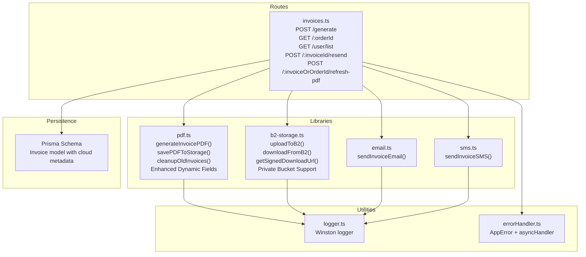
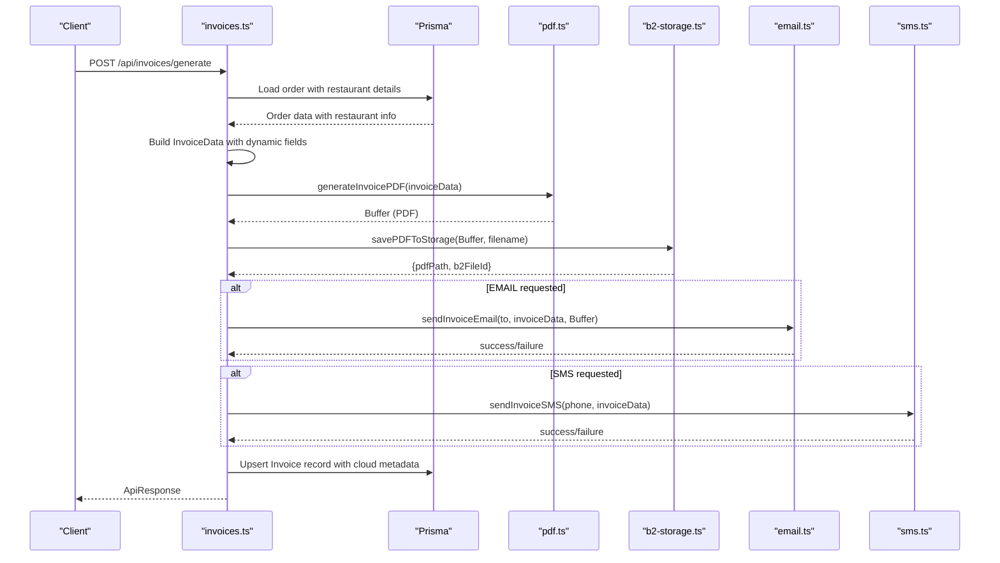
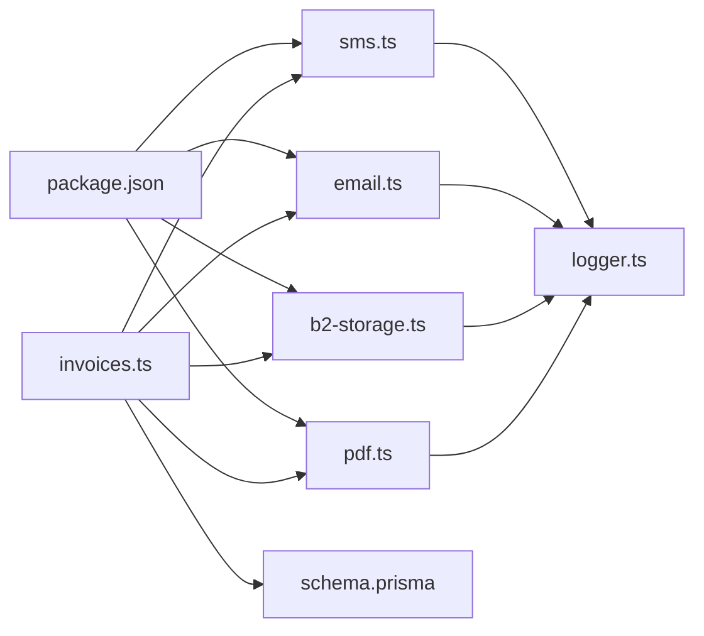

# PDF Invoice Generation

<cite>
**Referenced Files in This Document**
- [pdf.ts](file://restaurant-backend/src/lib/pdf.ts)
- [invoices.ts](file://restaurant-backend/src/routes/invoices.ts)
- [b2-storage.ts](file://restaurant-backend/src/lib/b2-storage.ts)
- [email.ts](file://restaurant-backend/src/lib/email.ts)
- [sms.ts](file://restaurant-backend/src/lib/sms.ts)
- [logger.ts](file://restaurant-backend/src/utils/logger.ts)
- [errorHandler.ts](file://restaurant-backend/src/middleware/errorHandler.ts)
- [schema.prisma](file://restaurant-backend/prisma/schema.prisma)
- [package.json](file://restaurant-backend/package.json)
- [api.ts](file://restaurant-backend/src/types/api.ts)
</cite>

## Update Summary
**Changes Made**
- Enhanced PDF generation with dynamic restaurant field support including multi-line address formatting
- Improved tax calculation handling with dynamic tax percentage calculation
- Enhanced B2 storage integration with private bucket support and signed URL generation
- Added conditional GST number display and dynamic tax label formatting
- Updated template structure to support enhanced restaurant information display

## Table of Contents
1. [Introduction](#introduction)
2. [Project Structure](#project-structure)
3. [Core Components](#core-components)
4. [Architecture Overview](#architecture-overview)
5. [Detailed Component Analysis](#detailed-component-analysis)
6. [Enhanced Features](#enhanced-features)
7. [Dependency Analysis](#dependency-analysis)
8. [Performance Considerations](#performance-considerations)
9. [Troubleshooting Guide](#troubleshooting-guide)
10. [Conclusion](#conclusion)

## Introduction
This document explains the enhanced PDF invoice generation system built with jspdf for receipt-style printing optimized for 80mm POS printers. The system now features dynamic restaurant field support, improved tax calculation handling, and enhanced B2 storage integration. It covers the template structure, styling, formatting, the InvoiceData interface, dynamic content rendering, totals computation, PDF buffer generation, cloud storage integration, cleanup of old invoices, error handling, logging integration, and performance considerations for high-volume generation.

## Project Structure
The enhanced invoice generation pipeline spans several modules with improved cloud storage capabilities:
- Route handler orchestrates invoice creation, validation, and delivery
- PDF generator builds the receipt-style PDF from structured data with dynamic restaurant fields
- Enhanced B2 storage integration provides cloud-based PDF management
- Email/SMS integrations deliver invoices via attachments or messages
- Prisma schema persists invoice records with cloud storage metadata
- Logger and error handlers provide robust diagnostics

**Diagram sources**
- [invoices.ts:21-241](file://restaurant-backend/src/routes/invoices.ts#L21-L241)
- [pdf.ts:37-259](file://restaurant-backend/src/lib/pdf.ts#L37-L259)
- [b2-storage.ts:76-124](file://restaurant-backend/src/lib/b2-storage.ts#L76-L124)
- [email.ts:200-227](file://restaurant-backend/src/lib/email.ts#L200-L227)
- [sms.ts:89-104](file://restaurant-backend/src/lib/sms.ts#L89-L104)
- [schema.prisma:208-222](file://restaurant-backend/prisma/schema.prisma#L208-L222)
- [logger.ts:50-56](file://restaurant-backend/src/utils/logger.ts#L50-L56)
- [errorHandler.ts:9-82](file://restaurant-backend/src/middleware/errorHandler.ts#L9-L82)

**Section sources**
- [invoices.ts:1-674](file://restaurant-backend/src/routes/invoices.ts#L1-L674)
- [pdf.ts:1-354](file://restaurant-backend/src/lib/pdf.ts#L1-L354)
- [b2-storage.ts:1-337](file://restaurant-backend/src/lib/b2-storage.ts#L1-L337)
- [email.ts:1-227](file://restaurant-backend/src/lib/email.ts#L1-L227)
- [sms.ts:1-131](file://restaurant-backend/src/lib/sms.ts#L1-L131)
- [schema.prisma:208-222](file://restaurant-backend/prisma/schema.prisma#L208-L222)
- [logger.ts:1-56](file://restaurant-backend/src/utils/logger.ts#L1-L56)
- [errorHandler.ts:1-82](file://restaurant-backend/src/middleware/errorHandler.ts#L1-L82)

## Core Components
- Enhanced InvoiceData interface defines the contract for building receipts with dynamic restaurant fields
- PDF generator creates a compact 80mm-wide, portrait-format receipt with multi-line address support
- Enhanced B2 storage layer provides cloud-based PDF management with private bucket support
- Cleanup routine removes stale invoices after a configurable retention period
- Delivery pipeline supports email (with PDF attachment) and SMS notifications
- Persistence stores invoice metadata and cloud storage references
- Logging and error handling ensure observability and resilience

**Section sources**
- [pdf.ts:16-45](file://restaurant-backend/src/lib/pdf.ts#L16-L45)
- [pdf.ts:53-217](file://restaurant-backend/src/lib/pdf.ts#L53-L217)
- [pdf.ts:221-256](file://restaurant-backend/src/lib/pdf.ts#L221-L256)
- [pdf.ts:319-354](file://restaurant-backend/src/lib/pdf.ts#L319-L354)
- [invoices.ts:118-149](file://restaurant-backend/src/routes/invoices.ts#L118-L149)
- [b2-storage.ts:76-124](file://restaurant-backend/src/lib/b2-storage.ts#L76-L124)
- [b2-storage.ts:267-302](file://restaurant-backend/src/lib/b2-storage.ts#L267-L302)
- [schema.prisma:208-222](file://restaurant-backend/prisma/schema.prisma#L208-L222)
- [logger.ts:50-56](file://restaurant-backend/src/utils/logger.ts#L50-L56)
- [errorHandler.ts:9-82](file://restaurant-backend/src/middleware/errorHandler.ts#L9-L82)

## Architecture Overview
The enhanced system follows a layered architecture with cloud storage integration:
- Express route validates requests and loads order data with restaurant information
- Business logic constructs InvoiceData with dynamic fields and invokes PDF generation
- PDF buffer is persisted to Backblaze B2 cloud storage with enhanced security
- Invoice metadata is stored in the database with cloud storage references
- Private bucket support enables secure PDF access with signed URLs

**Diagram sources**
- [invoices.ts:21-262](file://restaurant-backend/src/routes/invoices.ts#L21-L262)
- [pdf.ts:53-217](file://restaurant-backend/src/lib/pdf.ts#L53-L217)
- [pdf.ts:221-256](file://restaurant-backend/src/lib/pdf.ts#L221-L256)
- [b2-storage.ts:76-124](file://restaurant-backend/src/lib/b2-storage.ts#L76-L124)
- [email.ts:200-227](file://restaurant-backend/src/lib/email.ts#L200-L227)
- [sms.ts:89-104](file://restaurant-backend/src/lib/sms.ts#L89-L104)
- [schema.prisma:208-222](file://restaurant-backend/prisma/schema.prisma#L208-L222)

## Detailed Component Analysis

### Enhanced InvoiceData Interface and Required Fields
The enhanced InvoiceData interface now supports dynamic restaurant fields:
- **Restaurant identifiers**: restaurantName, restaurantAddress (multi-line support), restaurantCity, restaurantState, restaurantPhone, restaurantEmail, gstNumber, fssaiNumber
- **Transaction details**: invoiceNumber, orderDate, tableNumber, paymentMethod
- **Customer details**: customerName, customerEmail, customerPhone
- **Line items**: items[] with name, quantity, price, total
- **Financial totals**: subtotal, tax, taxPercent (dynamic tax percentage), total
- **Additional fields**: cashierName, paymentMethod

Rendering logic centers around:
- Receipt width of 80mm and dynamic height based on item count
- Centered headers with multi-line address support
- Conditional GST number display
- Dynamic tax label formatting with taxPercent support
- Enhanced footer with restaurant contact information

**Section sources**
- [pdf.ts:16-45](file://restaurant-backend/src/lib/pdf.ts#L16-L45)
- [pdf.ts:53-217](file://restaurant-backend/src/lib/pdf.ts#L53-L217)

### Enhanced Template Structure and Styling
The receipt template now supports enhanced dynamic content:
- Page format: portrait, 80mm width, adjustable height
- Typography: bold headers, normal body text, small footers
- Alignment: centered for headers, left-aligned for content, right-aligned for monetary values
- Layout blocks:
  - Header with restaurant branding and conditional GST number
  - Multi-line restaurant address with dynamic line wrapping
  - City and state information display
  - Restaurant contact details
  - Customer details section
  - Bill details (date, table, cashier, bill number)
  - Itemized rows with serial number, wrapped item name, quantity, price, amount
  - Totals summary with dynamic tax label formatting
  - Enhanced footer with restaurant contact and FSSAI license

Dynamic text wrapping ensures long restaurant addresses and item names fit within constrained column widths.

**Section sources**
- [pdf.ts:53-217](file://restaurant-backend/src/lib/pdf.ts#L53-L217)

### Enhanced Dynamic Content Rendering
- **Restaurant details**: multi-line address support with splitTextToSize for wrapping
- **Conditional fields**: GST number display only when available
- **Dynamic tax calculation**: taxPercent field enables customized tax labeling
- **Enhanced formatting**: city/state combination display, phone number formatting
- **Order metadata**: date, table number, cashier name, invoice number
- **Items**: derived from order.items with computed totals per item
- **Totals**: subtotal, tax (dynamic tax percentage), and grand total
- **Monetary values**: formatted to two decimal places
- **Text alignment and spacing**: optimized for compactness with enhanced readability

**Section sources**
- [invoices.ts:118-149](file://restaurant-backend/src/routes/invoices.ts#L118-L149)
- [pdf.ts:78-100](file://restaurant-backend/src/lib/pdf.ts#L78-L100)
- [pdf.ts:171-174](file://restaurant-backend/src/lib/pdf.ts#L171-L174)

### Enhanced PDF Buffer Generation and Cloud Storage
- **Buffer generation**: jspdf outputs a raw ArrayBuffer converted to Node.js Buffer
- **Cloud storage integration**: uploads to Backblaze B2 with invoices/ prefix for organization
- **Enhanced metadata**: returns structured metadata including B2 file IDs and public URLs
- **Private bucket support**: automatic detection and handling of private vs public buckets
- **Signed URL generation**: secure access to private bucket files with configurable expiration

**Section sources**
- [pdf.ts:199-208](file://restaurant-backend/src/lib/pdf.ts#L199-L208)
- [pdf.ts:221-256](file://restaurant-backend/src/lib/pdf.ts#L221-L256)
- [b2-storage.ts:76-124](file://restaurant-backend/src/lib/b2-storage.ts#L76-L124)
- [b2-storage.ts:267-302](file://restaurant-backend/src/lib/b2-storage.ts#L267-L302)

### Enhanced Cleanup Mechanism for Cloud Storage
- **Cloud-aware cleanup**: scans B2 storage for invoice files with invoices/ prefix
- **Enhanced filtering**: compares file upload timestamps against cutoff date
- **Cloud deletion**: deletes files from B2 storage using file IDs and names
- **Logging**: comprehensive audit trail with deletion counts and retention metrics
- **Error handling**: graceful degradation when B2 is not configured

**Section sources**
- [pdf.ts:319-354](file://restaurant-backend/src/lib/pdf.ts#L319-L354)
- [b2-storage.ts:189-211](file://restaurant-backend/src/lib/b2-storage.ts#L189-L211)
- [b2-storage.ts:218-252](file://restaurant-backend/src/lib/b2-storage.ts#L218-L252)

### Enhanced Delivery Pipeline: Email and SMS
- **Email**: generates HTML template with invoice details and attaches PDF buffer
- **SMS**: sends concise invoice summary via Twilio with enhanced error handling
- **Delivery tracking**: maintains sentVia methods and delivery flags in database
- **Resend capability**: supports invoice regeneration and re-delivery
- **Refresh functionality**: allows PDF regeneration and cloud storage refresh

**Section sources**
- [email.ts:66-195](file://restaurant-backend/src/lib/email.ts#L66-L195)
- [email.ts:200-227](file://restaurant-backend/src/lib/email.ts#L200-L227)
- [sms.ts:71-104](file://restaurant-backend/src/lib/sms.ts#L71-L104)
- [invoices.ts:348-496](file://restaurant-backend/src/routes/invoices.ts#L348-L496)
- [invoices.ts:498-641](file://restaurant-backend/src/routes/invoices.ts#L498-L641)

### Enhanced Persistence and Metadata
- **Enhanced Invoice model**: tracks orderId, invoiceNumber, sentVia methods, delivery flags, and cloud storage metadata
- **Cloud integration**: stores pdfPath, pdfData, pdfName, and b2FileId for cloud-managed invoices
- **Route handlers**: upsert invoice records with cloud storage references and delivery outcomes
- **Supports**: resends, refreshes, and cloud storage management by invoiceId or orderId

**Section sources**
- [schema.prisma:208-222](file://restaurant-backend/prisma/schema.prisma#L208-L222)
- [invoices.ts:195-224](file://restaurant-backend/src/routes/invoices.ts#L195-L224)
- [invoices.ts:348-496](file://restaurant-backend/src/routes/invoices.ts#L348-L496)
- [invoices.ts:498-641](file://restaurant-backend/src/routes/invoices.ts#L498-L641)

### Enhanced Error Handling and Logging
- **Centralized error handling**: wraps async operations and standardizes responses
- **Enhanced logging**: structured logs with timestamps, metadata, and cloud storage context
- **PDF generation**: includes contextual logs for debugging with enhanced error details
- **Cloud storage**: comprehensive logging for upload/download operations and cleanup
- **Delivery failures**: detailed error logging with actionable warnings for troubleshooting

**Section sources**
- [errorHandler.ts:9-82](file://restaurant-backend/src/middleware/errorHandler.ts#L9-L82)
- [logger.ts:50-56](file://restaurant-backend/src/utils/logger.ts#L50-L56)
- [pdf.ts:209-216](file://restaurant-backend/src/lib/pdf.ts#L209-L216)
- [pdf.ts:225-255](file://restaurant-backend/src/lib/pdf.ts#L225-L255)
- [pdf.ts:348-353](file://restaurant-backend/src/lib/pdf.ts#L348-L353)
- [b2-storage.ts:117-123](file://restaurant-backend/src/lib/b2-storage.ts#L117-L123)
- [b2-storage.ts:276-281](file://restaurant-backend/src/lib/b2-storage.ts#L276-L281)
- [email.ts:52-61](file://restaurant-backend/src/lib/email.ts#L52-L61)
- [sms.ts:58-66](file://restaurant-backend/src/lib/sms.ts#L58-L66)

## Enhanced Features

### Dynamic Restaurant Field Support
The system now supports comprehensive restaurant information display:
- **Multi-line address formatting**: restaurantAddress field supports addresses spanning multiple lines
- **Conditional field display**: GST number shown only when available
- **Enhanced contact information**: phone numbers, emails, and location details
- **Dynamic formatting**: city/state combinations and address line wrapping

**Section sources**
- [pdf.ts:78-99](file://restaurant-backend/src/lib/pdf.ts#L78-L99)
- [pdf.ts:171-174](file://restaurant-backend/src/lib/pdf.ts#L171-L174)
- [invoices.ts:123-131](file://restaurant-backend/src/routes/invoices.ts#L123-L131)

### Improved Tax Calculation Handling
Enhanced tax calculation with dynamic percentage support:
- **Dynamic tax percentage**: taxPercent field enables customized tax labeling
- **Automatic calculation**: tax percentage derived from order data when available
- **Flexible formatting**: tax label adapts based on taxPercent presence
- **Enhanced accuracy**: precise tax calculations with proper rounding

**Section sources**
- [pdf.ts:39-40](file://restaurant-backend/src/lib/pdf.ts#L39-L40)
- [pdf.ts:171-174](file://restaurant-backend/src/lib/pdf.ts#L171-L174)
- [invoices.ts:118-121](file://restaurant-backend/src/routes/invoices.ts#L118-L121)

### Enhanced B2 Storage Integration
Comprehensive cloud storage capabilities:
- **Private bucket support**: automatic detection and handling of private vs public buckets
- **Signed URL generation**: secure access to private files with configurable expiration
- **Enhanced metadata**: file IDs, upload timestamps, and content length tracking
- **Cloud cleanup**: automated removal of stale invoice files from cloud storage
- **Error handling**: graceful degradation when cloud storage is unavailable

**Section sources**
- [b2-storage.ts:257-259](file://restaurant-backend/src/lib/b2-storage.ts#L257-L259)
- [b2-storage.ts:267-302](file://restaurant-backend/src/lib/b2-storage.ts#L267-L302)
- [b2-storage.ts:319-336](file://restaurant-backend/src/lib/b2-storage.ts#L319-L336)
- [pdf.ts:319-354](file://restaurant-backend/src/lib/pdf.ts#L319-L354)

## Dependency Analysis
Enhanced external libraries and internal dependencies:
- **jspdf**: PDF generation engine with enhanced text wrapping
- **backblaze-b2**: Cloud storage with private bucket support and signed URL generation
- **nodemailer**: Email transport and templating
- **twilio**: SMS delivery with enhanced error handling
- **winston**: Structured logging with enhanced context
- **zod**: Request validation
- **prisma**: Database ORM and schema with cloud metadata support

**Diagram sources**
- [invoices.ts:1-13](file://restaurant-backend/src/routes/invoices.ts#L1-L13)
- [pdf.ts:1-11](file://restaurant-backend/src/lib/pdf.ts#L1-L11)
- [b2-storage.ts:1-2](file://restaurant-backend/src/lib/b2-storage.ts#L1-L2)
- [email.ts:1-2](file://restaurant-backend/src/lib/email.ts#L1-L2)
- [sms.ts:1-2](file://restaurant-backend/src/lib/sms.ts#L1-L2)
- [logger.ts:1-56](file://restaurant-backend/src/utils/logger.ts#L1-L56)
- [schema.prisma:208-222](file://restaurant-backend/prisma/schema.prisma#L208-L222)
- [package.json:18-45](file://restaurant-backend/package.json#L18-L45)

**Section sources**
- [package.json:18-45](file://restaurant-backend/package.json#L18-L45)
- [pdf.ts:1-11](file://restaurant-backend/src/lib/pdf.ts#L1-L11)
- [b2-storage.ts:1-2](file://restaurant-backend/src/lib/b2-storage.ts#L1-L2)
- [email.ts:1-2](file://restaurant-backend/src/lib/email.ts#L1-L2)
- [sms.ts:1-2](file://restaurant-backend/src/lib/sms.ts#L1-L2)
- [logger.ts:1-56](file://restaurant-backend/src/utils/logger.ts#L1-L56)
- [schema.prisma:208-222](file://restaurant-backend/prisma/schema.prisma#L208-L222)

## Performance Considerations
Enhanced performance considerations for cloud-integrated systems:
- **Batch generation**: For high-volume scenarios, consider queuing invoice generation and parallelizing I/O-bound tasks
- **Memory footprint**: jspdf buffers are held in memory; ensure adequate heap limits and monitor peak usage
- **Cloud I/O optimization**: Backblaze B2 provides scalable storage; consider CDN integration for public access
- **Caching strategies**: Reuse PDF buffers for resends and refreshes to avoid recomputation
- **Concurrency management**: Use worker threads or microservices to isolate heavy PDF workloads
- **Cloud storage optimization**: Implement proper cloud storage lifecycle policies and cleanup routines
- **Logging overhead**: Reduce log verbosity in production or switch to sampling to minimize I/O impact

## Troubleshooting Guide
Enhanced troubleshooting for cloud-integrated systems:
- **PDF generation fails**: Verify jspdf installation and availability, check InvoiceData completeness
- **Cloud storage failures**: Confirm B2 credentials, bucket configuration, and network connectivity
- **Private bucket issues**: Verify B2_BUCKET_PRIVATE setting and signed URL generation
- **Storage write failures**: Check B2 bucket permissions, file naming conventions, and upload quotas
- **Email delivery issues**: Ensure SMTP credentials and sender domain are configured
- **SMS delivery issues**: Confirm Twilio credentials and sender number
- **Cleanup not removing files**: Verify B2 configuration, file prefixes, and retention thresholds
- **Route errors**: Review validation schemas, Prisma queries, and cloud storage integration

**Section sources**
- [pdf.ts:209-216](file://restaurant-backend/src/lib/pdf.ts#L209-L216)
- [pdf.ts:225-255](file://restaurant-backend/src/lib/pdf.ts#L225-L255)
- [pdf.ts:348-353](file://restaurant-backend/src/lib/pdf.ts#L348-L353)
- [b2-storage.ts:117-123](file://restaurant-backend/src/lib/b2-storage.ts#L117-L123)
- [b2-storage.ts:276-281](file://restaurant-backend/src/lib/b2-storage.ts#L276-L281)
- [email.ts:52-61](file://restaurant-backend/src/lib/email.ts#L52-L61)
- [sms.ts:58-66](file://restaurant-backend/src/lib/sms.ts#L58-L66)
- [errorHandler.ts:22-76](file://restaurant-backend/src/middleware/errorHandler.ts#L22-L76)

## Conclusion
The enhanced PDF invoice generation system integrates a receipt-style jspdf template with robust cloud storage integration, dynamic restaurant field support, and improved tax calculation handling. The system now supports multi-line address formatting, conditional GST display, dynamic tax percentages, and secure cloud storage with private bucket support. It provides comprehensive delivery and persistence layers with enhanced operational safeguards including logging, cleanup, error handling, and cloud storage management. For high-volume deployments, consider asynchronous processing, caching strategies, and scalable cloud storage solutions to maintain responsiveness and reliability.