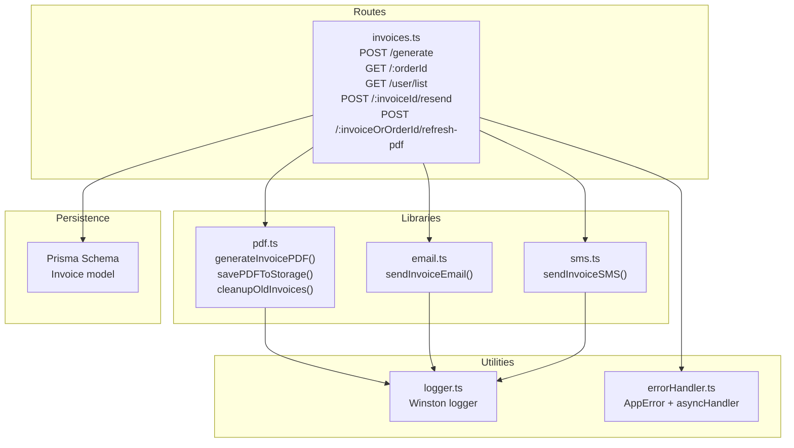
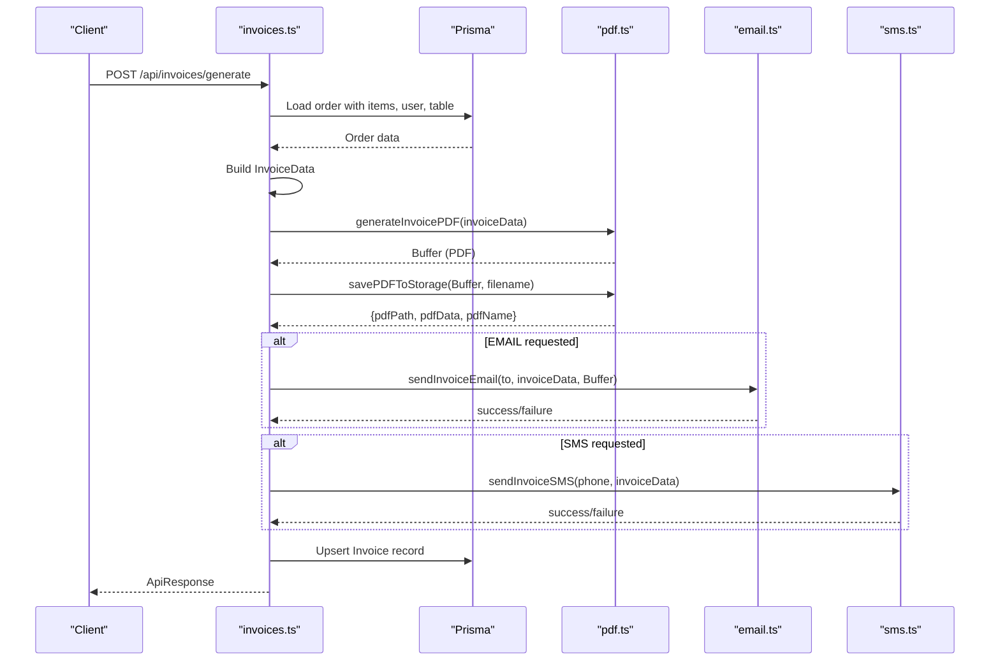
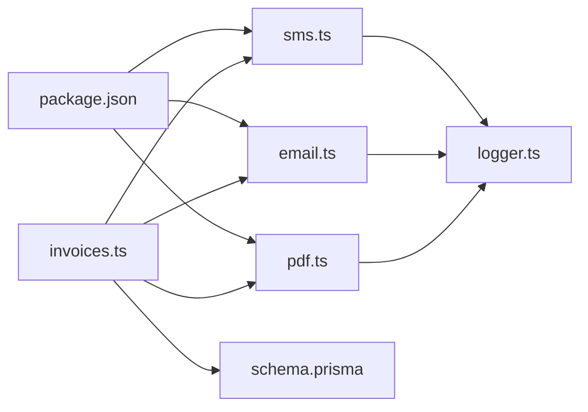

# PDF Invoice Generation

<cite>
**Referenced Files in This Document**
- [pdf.ts](file://restaurant-backend/src/lib/pdf.ts)
- [invoices.ts](file://restaurant-backend/src/routes/invoices.ts)
- [email.ts](file://restaurant-backend/src/lib/email.ts)
- [sms.ts](file://restaurant-backend/src/lib/sms.ts)
- [logger.ts](file://restaurant-backend/src/utils/logger.ts)
- [errorHandler.ts](file://restaurant-backend/src/middleware/errorHandler.ts)
- [schema.prisma](file://restaurant-backend/prisma/schema.prisma)
- [package.json](file://restaurant-backend/package.json)
- [api.ts](file://restaurant-backend/src/types/api.ts)
</cite>

## Table of Contents
1. [Introduction](#introduction)
2. [Project Structure](#project-structure)
3. [Core Components](#core-components)
4. [Architecture Overview](#architecture-overview)
5. [Detailed Component Analysis](#detailed-component-analysis)
6. [Dependency Analysis](#dependency-analysis)
7. [Performance Considerations](#performance-considerations)
8. [Troubleshooting Guide](#troubleshooting-guide)
9. [Conclusion](#conclusion)

## Introduction
This document explains the PDF invoice generation system built with jspdf for receipt-style printing optimized for 80mm POS printers. It covers the template structure, styling, formatting, the InvoiceData interface, dynamic content rendering, totals computation, PDF buffer generation, saving to the public/invoices directory, cleanup of old invoices, error handling, logging integration, and performance considerations for high-volume generation.

## Project Structure
The invoice generation pipeline spans several modules:
- Route handler orchestrates invoice creation, validation, and delivery
- PDF generator builds the receipt-style PDF from structured data
- Email/SMS integrations deliver invoices via attachments or messages
- Prisma schema persists invoice records
- Logger and error handlers provide robust diagnostics

**Diagram sources**
- [invoices.ts](file://restaurant-backend/src/routes/invoices.ts#L21-L241)
- [pdf.ts](file://restaurant-backend/src/lib/pdf.ts#L37-L259)
- [email.ts](file://restaurant-backend/src/lib/email.ts#L200-L227)
- [sms.ts](file://restaurant-backend/src/lib/sms.ts#L89-L104)
- [schema.prisma](file://restaurant-backend/prisma/schema.prisma#L190-L204)
- [logger.ts](file://restaurant-backend/src/utils/logger.ts#L50-L56)
- [errorHandler.ts](file://restaurant-backend/src/middleware/errorHandler.ts#L9-L82)

**Section sources**
- [invoices.ts](file://restaurant-backend/src/routes/invoices.ts#L1-L599)
- [pdf.ts](file://restaurant-backend/src/lib/pdf.ts#L1-L259)
- [email.ts](file://restaurant-backend/src/lib/email.ts#L1-L227)
- [sms.ts](file://restaurant-backend/src/lib/sms.ts#L1-L131)
- [schema.prisma](file://restaurant-backend/prisma/schema.prisma#L190-L204)
- [logger.ts](file://restaurant-backend/src/utils/logger.ts#L1-L56)
- [errorHandler.ts](file://restaurant-backend/src/middleware/errorHandler.ts#L1-L82)

## Core Components
- InvoiceData interface defines the contract for building receipts
- PDF generator creates a compact 80mm-wide, portrait-format receipt
- Storage layer writes PDFs to public/invoices for web access
- Cleanup routine removes stale invoices after a configurable retention period
- Delivery pipeline supports email (with PDF attachment) and SMS notifications
- Persistence stores invoice metadata and delivery status
- Logging and error handling ensure observability and resilience

**Section sources**
- [pdf.ts](file://restaurant-backend/src/lib/pdf.ts#L6-L29)
- [pdf.ts](file://restaurant-backend/src/lib/pdf.ts#L37-L187)
- [pdf.ts](file://restaurant-backend/src/lib/pdf.ts#L191-L224)
- [pdf.ts](file://restaurant-backend/src/lib/pdf.ts#L229-L259)
- [invoices.ts](file://restaurant-backend/src/routes/invoices.ts#L108-L128)
- [email.ts](file://restaurant-backend/src/lib/email.ts#L200-L227)
- [sms.ts](file://restaurant-backend/src/lib/sms.ts#L89-L104)
- [schema.prisma](file://restaurant-backend/prisma/schema.prisma#L190-L204)
- [logger.ts](file://restaurant-backend/src/utils/logger.ts#L50-L56)
- [errorHandler.ts](file://restaurant-backend/src/middleware/errorHandler.ts#L9-L82)

## Architecture Overview
The system follows a layered architecture:
- Express route validates requests and loads order data
- Business logic constructs InvoiceData and invokes PDF generation
- PDF buffer is persisted to public/invoices and optionally emailed/SMSed
- Invoice metadata is stored in the database with delivery flags

**Diagram sources**
- [invoices.ts](file://restaurant-backend/src/routes/invoices.ts#L21-L241)
- [pdf.ts](file://restaurant-backend/src/lib/pdf.ts#L37-L187)
- [pdf.ts](file://restaurant-backend/src/lib/pdf.ts#L191-L224)
- [email.ts](file://restaurant-backend/src/lib/email.ts#L200-L227)
- [sms.ts](file://restaurant-backend/src/lib/sms.ts#L89-L104)
- [schema.prisma](file://restaurant-backend/prisma/schema.prisma#L190-L204)

## Detailed Component Analysis

### InvoiceData Interface and Required Fields
InvoiceData encapsulates all information required to render a receipt:
- Business identifiers: fssaiNumber, gstNumber, restaurantName, restaurantAddress, restaurantPhone
- Transaction details: invoiceNumber, orderDate, tableNumber, paymentMethod
- Customer details: customerName, customerEmail, customerPhone
- Line items: items[] with name, quantity, price, total
- Financial totals: subtotal, tax, total

Rendering logic centers around:
- Receipt width of 80mm and dynamic height based on item count
- Centered headers and concise itemization with wrapped long item names
- Tax calculation and totals presentation
- Footer with FSSAI license number

**Section sources**
- [pdf.ts](file://restaurant-backend/src/lib/pdf.ts#L6-L29)
- [pdf.ts](file://restaurant-backend/src/lib/pdf.ts#L37-L187)

### Template Structure and Styling
The receipt template is designed for 80mm POS printers:
- Page format: portrait, 80mm width, adjustable height
- Typography: bold headers, normal body text, small footers
- Alignment: centered for headers, left-aligned for content, right-aligned for monetary values
- Layout blocks:
  - Header with restaurant branding and GST number
  - Customer details section
  - Bill details (date, table, cashier, bill number)
  - Itemized rows with serial number, wrapped item name, quantity, price, amount
  - Totals summary (subtotal, tax, grand total)
  - Footer with FSSAI license number

Dynamic text wrapping ensures long item names fit within a constrained column width.

**Section sources**
- [pdf.ts](file://restaurant-backend/src/lib/pdf.ts#L37-L187)

### Dynamic Content Rendering
- Customer details: rendered from order.user
- Order metadata: date, table number, cashier name, invoice number
- Items: derived from order.items with computed totals per item
- Totals: subtotal, tax (assumed 5%), and grand total
- Monetary values formatted to two decimal places
- Text alignment and spacing optimized for compactness

**Section sources**
- [invoices.ts](file://restaurant-backend/src/routes/invoices.ts#L108-L128)
- [pdf.ts](file://restaurant-backend/src/lib/pdf.ts#L116-L158)

### PDF Buffer Generation and Storage
- Buffer generation: jspdf outputs a raw ArrayBuffer converted to Node.js Buffer
- Storage: writes to public/invoices with a deterministic filename pattern
- Returns structured metadata for downstream delivery and persistence

**Section sources**
- [pdf.ts](file://restaurant-backend/src/lib/pdf.ts#L169-L178)
- [pdf.ts](file://restaurant-backend/src/lib/pdf.ts#L191-L224)

### File Saving and Public Access
- Directory: public/invoices under the working directory
- Filename: invoice-{invoiceNumber}.pdf
- Path returned for web access: /invoices/{filename}
- Data retained for optional re-sends and refreshes

**Section sources**
- [pdf.ts](file://restaurant-backend/src/lib/pdf.ts#L191-L224)

### Cleanup Mechanism for Old Invoices
- Scans the invoices directory
- Compares file modification time against a cutoff date
- Deletes files older than the specified retention window
- Logs counts and retention window for auditing

**Section sources**
- [pdf.ts](file://restaurant-backend/src/lib/pdf.ts#L229-L259)

### Delivery Pipeline: Email and SMS
- Email:
  - Generates HTML template with invoice details
  - Attaches PDF buffer as a downloadable file
  - Tracks delivery success/failure
- SMS:
  - Sends a concise invoice summary via Twilio
  - Handles missing credentials gracefully with warnings

**Section sources**
- [email.ts](file://restaurant-backend/src/lib/email.ts#L66-L195)
- [email.ts](file://restaurant-backend/src/lib/email.ts#L200-L227)
- [sms.ts](file://restaurant-backend/src/lib/sms.ts#L71-L84)
- [sms.ts](file://restaurant-backend/src/lib/sms.ts#L89-L104)

### Persistence and Metadata
- Invoice model tracks orderId, invoiceNumber, sentVia methods, delivery flags, and PDF metadata
- Route handlers upsert invoice records with delivery outcomes
- Supports resends and refreshes by invoiceId or orderId

**Section sources**
- [schema.prisma](file://restaurant-backend/prisma/schema.prisma#L190-L204)
- [invoices.ts](file://restaurant-backend/src/routes/invoices.ts#L175-L203)
- [invoices.ts](file://restaurant-backend/src/routes/invoices.ts#L328-L454)
- [invoices.ts](file://restaurant-backend/src/routes/invoices.ts#L457-L566)

### Error Handling and Logging
- Centralized error handling wraps async operations and standardizes responses
- Winston logger captures structured logs with timestamps and metadata
- PDF generation and storage include contextual logs for debugging
- Delivery failures are logged with actionable warnings

**Section sources**
- [errorHandler.ts](file://restaurant-backend/src/middleware/errorHandler.ts#L9-L82)
- [logger.ts](file://restaurant-backend/src/utils/logger.ts#L50-L56)
- [pdf.ts](file://restaurant-backend/src/lib/pdf.ts#L172-L186)
- [pdf.ts](file://restaurant-backend/src/lib/pdf.ts#L206-L223)
- [pdf.ts](file://restaurant-backend/src/lib/pdf.ts#L249-L258)
- [email.ts](file://restaurant-backend/src/lib/email.ts#L52-L61)
- [sms.ts](file://restaurant-backend/src/lib/sms.ts#L58-L66)

## Dependency Analysis
Key external libraries and internal dependencies:
- jspdf: PDF generation engine
- nodemailer: Email transport and templating
- twilio: SMS delivery
- winston: Structured logging
- zod: Request validation
- prisma: Database ORM and schema

**Diagram sources**
- [invoices.ts](file://restaurant-backend/src/routes/invoices.ts#L1-L13)
- [pdf.ts](file://restaurant-backend/src/lib/pdf.ts#L1-L4)
- [email.ts](file://restaurant-backend/src/lib/email.ts#L1-L2)
- [sms.ts](file://restaurant-backend/src/lib/sms.ts#L1-L2)
- [logger.ts](file://restaurant-backend/src/utils/logger.ts#L1-L56)
- [schema.prisma](file://restaurant-backend/prisma/schema.prisma#L190-L204)
- [package.json](file://restaurant-backend/package.json#L33-L43)

**Section sources**
- [package.json](file://restaurant-backend/package.json#L18-L44)
- [pdf.ts](file://restaurant-backend/src/lib/pdf.ts#L1-L4)
- [email.ts](file://restaurant-backend/src/lib/email.ts#L1-L2)
- [sms.ts](file://restaurant-backend/src/lib/sms.ts#L1-L2)
- [logger.ts](file://restaurant-backend/src/utils/logger.ts#L1-L56)
- [schema.prisma](file://restaurant-backend/prisma/schema.prisma#L190-L204)

## Performance Considerations
- Batch generation: For high-volume scenarios, consider queuing invoice generation and parallelizing I/O-bound tasks (PDF generation, file write, email/SMS)
- Memory footprint: jspdf buffers are held in memory; ensure adequate heap limits and monitor peak usage
- File system I/O: Write directly to a mounted persistent volume or CDN-backed storage for scalability
- Caching: Reuse PDF buffers for resends and refreshes to avoid recomputation
- Concurrency: Use worker threads or microservices to isolate heavy PDF workloads
- Logging overhead: Reduce log verbosity in production or switch to sampling to minimize I/O impact

[No sources needed since this section provides general guidance]

## Troubleshooting Guide
Common issues and resolutions:
- PDF generation fails:
  - Verify jspdf installation and availability
  - Check InvoiceData completeness (missing fields can cause rendering errors)
  - Inspect logs for detailed error context
- Storage write failures:
  - Confirm public/invoices directory permissions and disk space
  - Validate filename patterns and path construction
- Email delivery issues:
  - Ensure SMTP credentials and sender domain are configured
  - Check attachment encoding and size limits
- SMS delivery issues:
  - Confirm Twilio credentials and sender number
  - Validate recipient phone number format
- Cleanup not removing files:
  - Verify retention threshold and file modification times
  - Check filesystem permissions and path correctness
- Route errors:
  - Review validation schemas and Prisma queries
  - Confirm order payment status and ownership checks

**Section sources**
- [pdf.ts](file://restaurant-backend/src/lib/pdf.ts#L179-L186)
- [pdf.ts](file://restaurant-backend/src/lib/pdf.ts#L216-L223)
- [pdf.ts](file://restaurant-backend/src/lib/pdf.ts#L253-L258)
- [email.ts](file://restaurant-backend/src/lib/email.ts#L52-L61)
- [sms.ts](file://restaurant-backend/src/lib/sms.ts#L58-L66)
- [errorHandler.ts](file://restaurant-backend/src/middleware/errorHandler.ts#L22-L76)

## Conclusion
The PDF invoice generation system integrates a receipt-style jspdf template with robust delivery and persistence layers. It supports dynamic content rendering, precise formatting for 80mm POS printers, and operational safeguards such as logging, cleanup, and error handling. For high-volume deployments, consider asynchronous processing, caching, and scalable storage to maintain responsiveness and reliability.