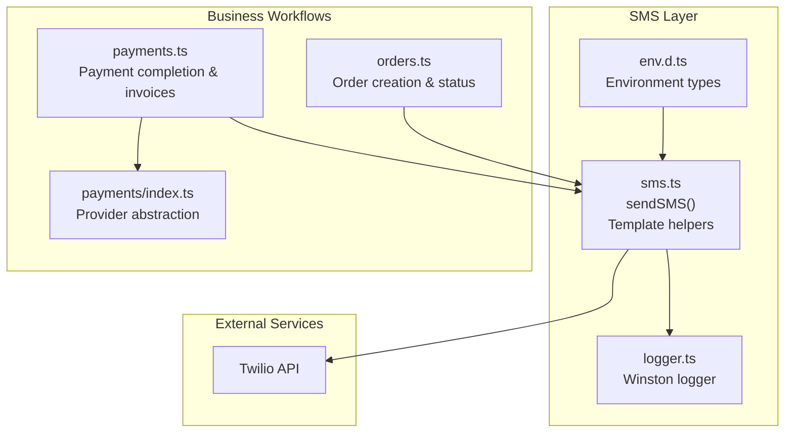
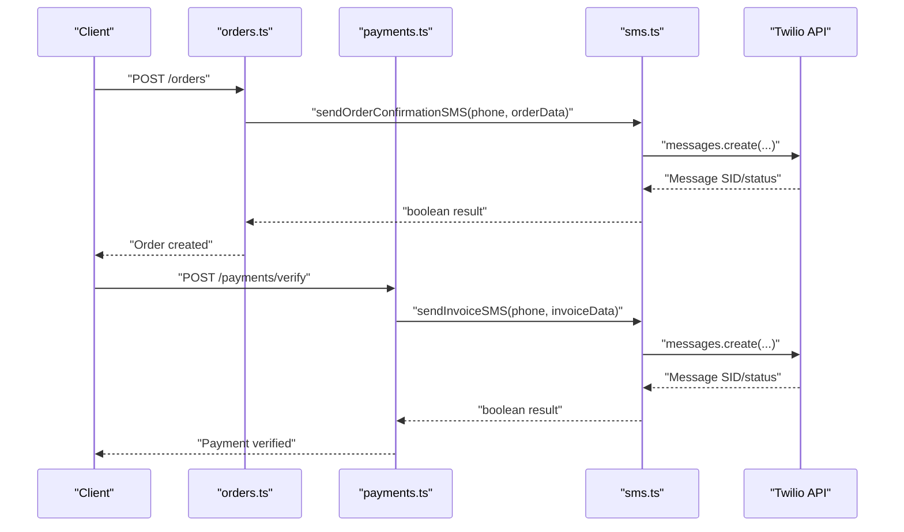
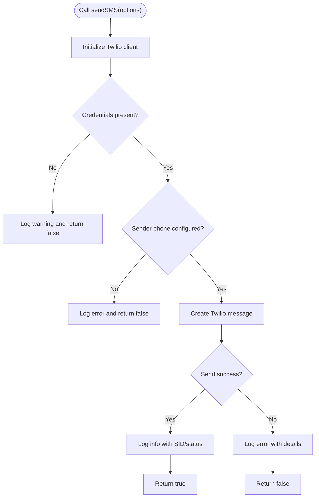
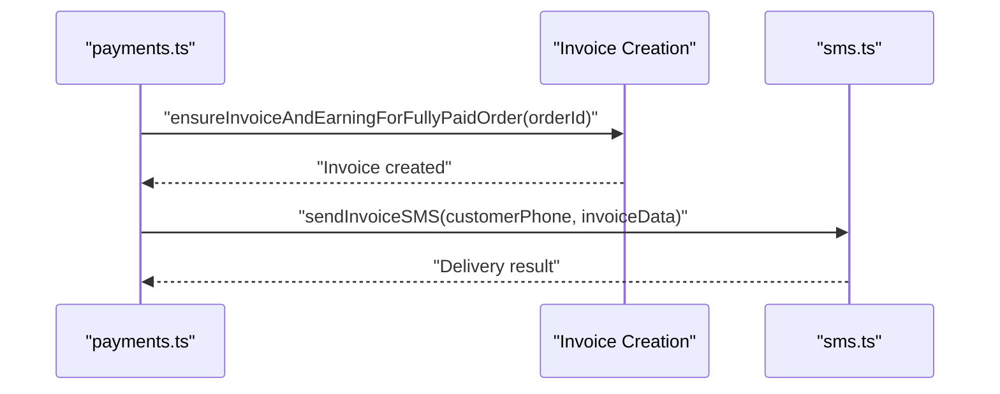
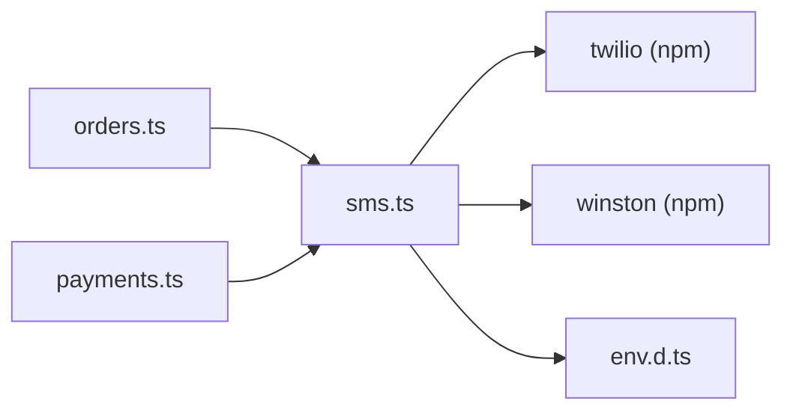

# SMS Notification System

<cite>
**Referenced Files in This Document**
- [sms.ts](file://restaurant-backend/src/lib/sms.ts)
- [env.d.ts](file://restaurant-backend/src/types/env.d.ts)
- [logger.ts](file://restaurant-backend/src/utils/logger.ts)
- [orders.ts](file://restaurant-backend/src/routes/orders.ts)
- [payments.ts](file://restaurant-backend/src/routes/payments.ts)
- [index.ts](file://restaurant-backend/src/lib/payments/index.ts)
- [package.json](file://restaurant-backend/package.json)
</cite>

## Table of Contents
1. [Introduction](#introduction)
2. [Project Structure](#project-structure)
3. [Core Components](#core-components)
4. [Architecture Overview](#architecture-overview)
5. [Detailed Component Analysis](#detailed-component-analysis)
6. [Dependency Analysis](#dependency-analysis)
7. [Performance Considerations](#performance-considerations)
8. [Troubleshooting Guide](#troubleshooting-guide)
9. [Conclusion](#conclusion)

## Introduction
This document describes the SMS notification system built on top of Twilio integration within the restaurant backend. It covers configuration, template generation, sending workflow, integration points with order and payment flows, error handling, logging, and operational best practices such as cost optimization and rate limiting.

## Project Structure
The SMS system is implemented as a reusable library module and integrated into order and payment workflows. Key locations:
- SMS library: `restaurant-backend/src/lib/sms.ts`
- Environment typings: `restaurant-backend/src/types/env.d.ts`
- Logging utility: `restaurant-backend/src/utils/logger.ts`
- Order lifecycle: `restaurant-backend/src/routes/orders.ts`
- Payment lifecycle: `restaurant-backend/src/routes/payments.ts`
- Payment provider abstraction: `restaurant-backend/src/lib/payments/index.ts`
- Dependencies: `restaurant-backend/package.json`

**Diagram sources**
- [sms.ts:1-131](file://restaurant-backend/src/lib/sms.ts#L1-L131)
- [env.d.ts:1-32](file://restaurant-backend/src/types/env.d.ts#L1-L32)
- [logger.ts:1-56](file://restaurant-backend/src/utils/logger.ts#L1-L56)
- [orders.ts:1-694](file://restaurant-backend/src/routes/orders.ts#L1-L694)
- [payments.ts:1-731](file://restaurant-backend/src/routes/payments.ts#L1-L731)
- [index.ts:1-124](file://restaurant-backend/src/lib/payments/index.ts#L1-L124)

**Section sources**
- [sms.ts:1-131](file://restaurant-backend/src/lib/sms.ts#L1-L131)
- [env.d.ts:1-32](file://restaurant-backend/src/types/env.d.ts#L1-L32)
- [logger.ts:1-56](file://restaurant-backend/src/utils/logger.ts#L1-L56)
- [orders.ts:1-694](file://restaurant-backend/src/routes/orders.ts#L1-L694)
- [payments.ts:1-731](file://restaurant-backend/src/routes/payments.ts#L1-L731)
- [index.ts:1-124](file://restaurant-backend/src/lib/payments/index.ts#L1-L124)
- [package.json:1-80](file://restaurant-backend/package.json#L1-L80)

## Core Components
- Twilio client initialization and lazy setup guarded by environment checks
- Unified send function with robust error logging
- Template generators for invoice and order confirmation messages
- Integration hooks in order and payment flows for automated notifications

Key capabilities:
- Validates Twilio credentials and sender phone number before sending
- Logs success and failure events with structured metadata
- Provides helper functions to generate localized, readable messages

**Section sources**
- [sms.ts:1-131](file://restaurant-backend/src/lib/sms.ts#L1-L131)
- [env.d.ts:16-18](file://restaurant-backend/src/types/env.d.ts#L16-L18)
- [logger.ts:1-56](file://restaurant-backend/src/utils/logger.ts#L1-L56)

## Architecture Overview
The SMS system is a thin wrapper around Twilio’s REST API. It exposes:
- A generic send function for arbitrary messages
- Specialized message builders for invoices and order confirmations
- Integration points in order creation and payment completion

**Diagram sources**
- [orders.ts:82-267](file://restaurant-backend/src/routes/orders.ts#L82-L267)
- [payments.ts:294-407](file://restaurant-backend/src/routes/payments.ts#L294-L407)
- [sms.ts:31-66](file://restaurant-backend/src/lib/sms.ts#L31-L66)

## Detailed Component Analysis

### Twilio Client Initialization and Send Workflow
The library initializes Twilio only once and guards against missing credentials. It validates the presence of the sender phone number and returns a boolean indicating success or failure. Structured logs capture message SID and status for traceability.

**Diagram sources**
- [sms.ts:31-66](file://restaurant-backend/src/lib/sms.ts#L31-L66)

**Section sources**
- [sms.ts:1-131](file://restaurant-backend/src/lib/sms.ts#L1-L131)

### Message Templates
- Invoice template: Includes customer name, invoice number, total amount, and restaurant name
- Order confirmation template: Includes customer name, order ID, total amount, table number, and restaurant name

These templates are designed for readability and automation, using fixed placeholders and consistent formatting.

**Section sources**
- [sms.ts:71-131](file://restaurant-backend/src/lib/sms.ts#L71-L131)

### Integration with Order Lifecycle
- New order creation triggers order confirmation SMS to the customer
- The order route emits real-time events after creation and status updates

Note: The current implementation sends order confirmation during order creation. If you need to send it upon explicit confirmation, adjust the integration point accordingly.

**Section sources**
- [orders.ts:82-267](file://restaurant-backend/src/routes/orders.ts#L82-L267)

### Integration with Payment Lifecycle
- Payment verification and cash confirmation can trigger invoice SMS when an invoice is generated
- Fully paid orders lead to invoice creation; invoice creation is the hook for sending invoice SMS

**Diagram sources**
- [payments.ts:61-166](file://restaurant-backend/src/routes/payments.ts#L61-L166)
- [payments.ts:390-407](file://restaurant-backend/src/routes/payments.ts#L390-L407)
- [sms.ts:89-104](file://restaurant-backend/src/lib/sms.ts#L89-L104)

**Section sources**
- [payments.ts:61-166](file://restaurant-backend/src/routes/payments.ts#L61-L166)
- [payments.ts:390-407](file://restaurant-backend/src/routes/payments.ts#L390-L407)
- [sms.ts:89-131](file://restaurant-backend/src/lib/sms.ts#L89-L131)

### International Number Support and Validation
- The current implementation does not include phone number validation or E.164 normalization
- To support international numbers, add validation and normalization prior to sending
- Consider using a library to parse and validate phone numbers before invoking Twilio

[No sources needed since this section provides general guidance]

### Error Handling and Logging
- Missing credentials or sender phone number disables SMS and logs warnings/errors
- Send failures are logged with error messages and recipient information
- Winston is used for structured logging with file and console transports

**Section sources**
- [sms.ts:31-66](file://restaurant-backend/src/lib/sms.ts#L31-L66)
- [logger.ts:1-56](file://restaurant-backend/src/utils/logger.ts#L1-L56)

### Retry Mechanisms and Delivery Tracking
- The library returns boolean outcomes but does not implement retries
- For production, consider implementing exponential backoff and idempotent message IDs
- Track delivery receipts via Twilio webhooks and update delivery status in your database

[No sources needed since this section provides general guidance]

### Cost Optimization and Rate Limiting
- Twilio pricing varies by destination; consider region-aware routing
- Implement per-phone rate limits to prevent abuse
- Use bulk sending APIs for high-volume scenarios and monitor spend

[No sources needed since this section provides general guidance]

### Fallback Mechanisms and Alternative Channels
- Email notifications are available in the codebase and can serve as a fallback channel
- Consider queue-based asynchronous delivery to decouple SMS from request-response cycles

**Section sources**
- [package.json:36-36](file://restaurant-backend/package.json#L36-L36)

## Dependency Analysis
The SMS library depends on:
- Twilio SDK for message creation
- Winston for logging
- Environment variables for credentials and sender phone number

**Diagram sources**
- [sms.ts:1-2](file://restaurant-backend/src/lib/sms.ts#L1-L2)
- [package.json:41-44](file://restaurant-backend/package.json#L41-L44)
- [env.d.ts:16-18](file://restaurant-backend/src/types/env.d.ts#L16-L18)
- [orders.ts:1-12](file://restaurant-backend/src/routes/orders.ts#L1-L12)
- [payments.ts:1-14](file://restaurant-backend/src/routes/payments.ts#L1-L14)

**Section sources**
- [sms.ts:1-131](file://restaurant-backend/src/lib/sms.ts#L1-L131)
- [package.json:18-44](file://restaurant-backend/package.json#L18-L44)
- [env.d.ts:16-18](file://restaurant-backend/src/types/env.d.ts#L16-L18)
- [orders.ts:1-12](file://restaurant-backend/src/routes/orders.ts#L1-L12)
- [payments.ts:1-14](file://restaurant-backend/src/routes/payments.ts#L1-L14)

## Performance Considerations
- Avoid synchronous blocking operations; keep SMS calls asynchronous
- Batch and deduplicate frequent updates to reduce redundant messages
- Monitor Twilio delivery status to avoid repeated sends for already-delivered messages

[No sources needed since this section provides general guidance]

## Troubleshooting Guide
Common issues and resolutions:
- Missing environment variables: Ensure Twilio credentials and sender phone number are set; the library logs warnings and returns false when missing
- Invalid sender phone number: Configure a valid Twilio sender number in the environment
- Network errors: Inspect logs for error messages and verify network connectivity
- Delivery failures: Use Twilio Console to review message status and troubleshoot carrier-specific issues

**Section sources**
- [sms.ts:31-66](file://restaurant-backend/src/lib/sms.ts#L31-L66)
- [logger.ts:1-56](file://restaurant-backend/src/utils/logger.ts#L1-L56)

## Conclusion
The SMS notification system provides a clean, extensible foundation for sending order confirmations and invoices via Twilio. By integrating with order and payment workflows, it enables timely customer communication. For production readiness, augment the implementation with phone number validation, retry logic, rate limiting, and webhook-driven delivery tracking.