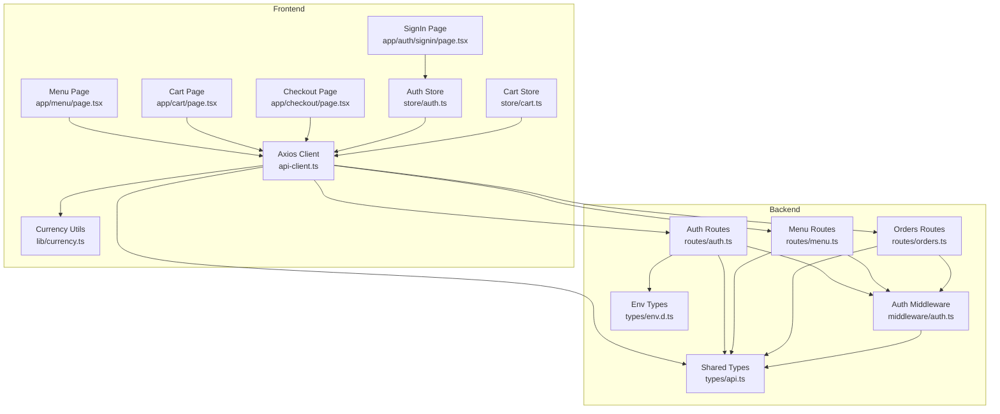
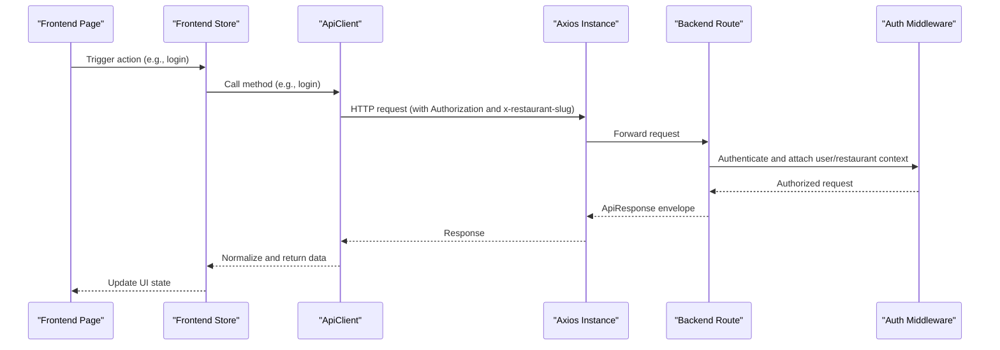
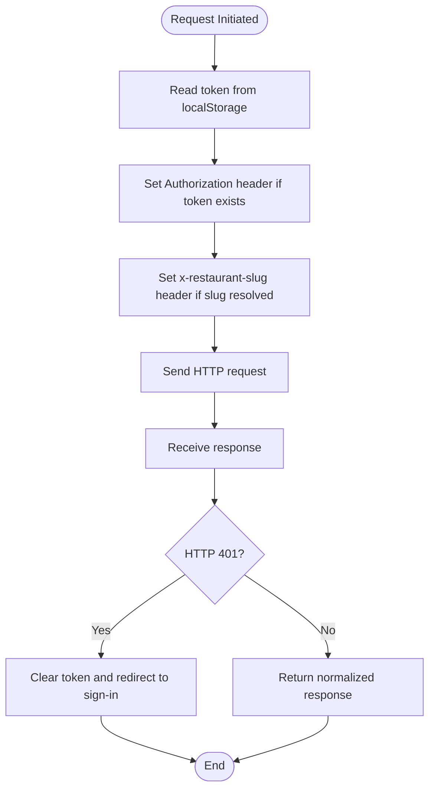
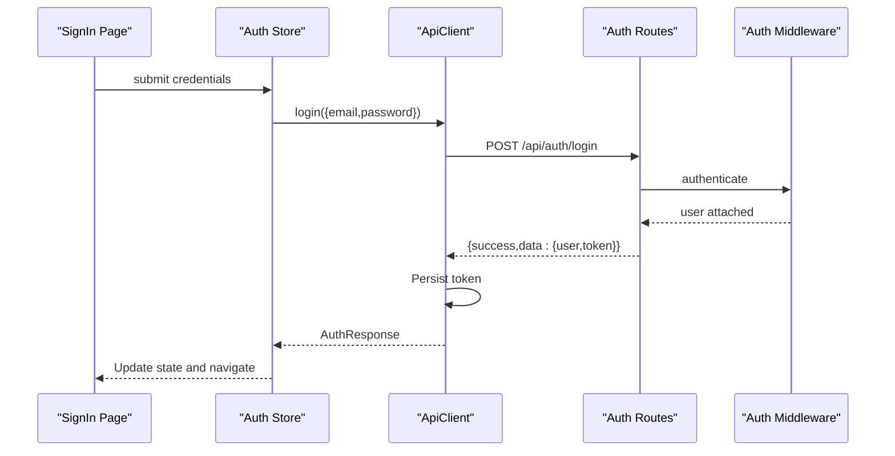
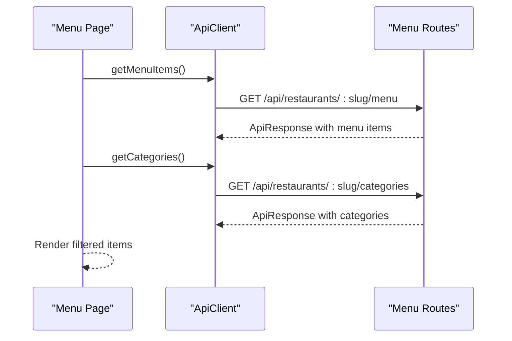
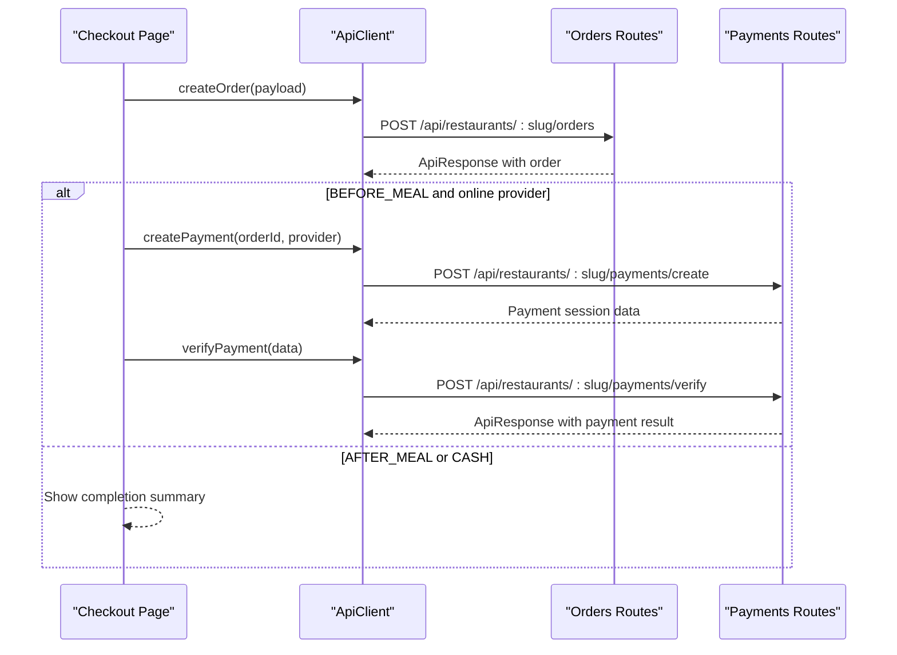
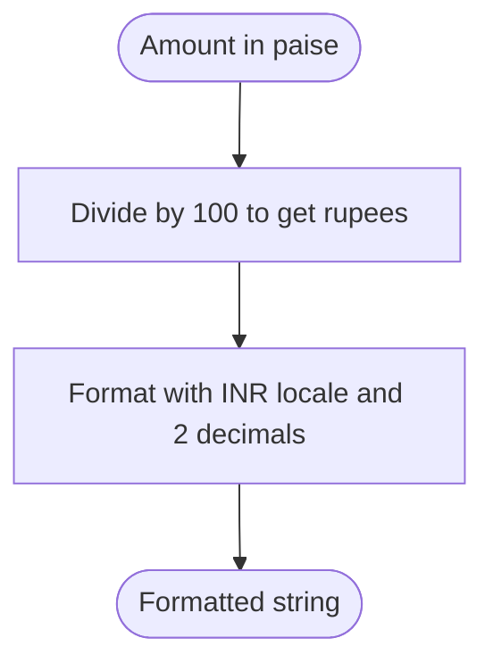
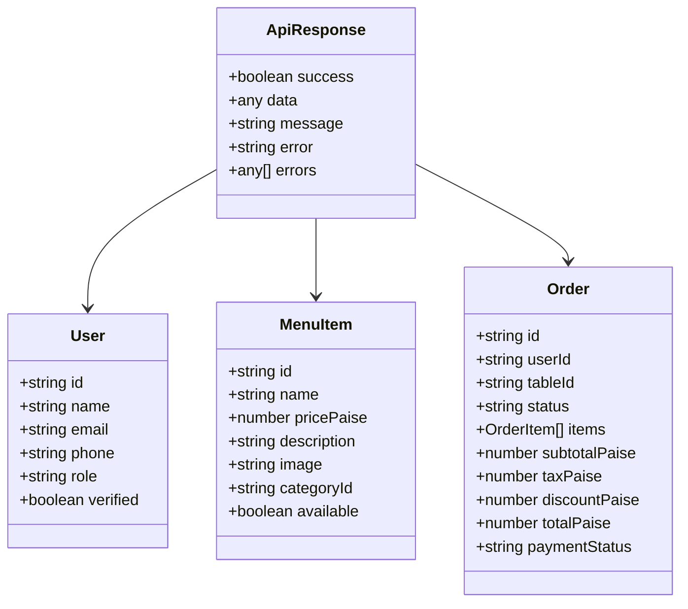
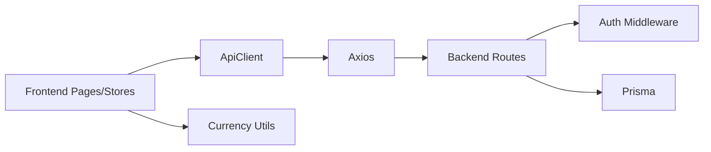

# API Integration

<cite>
**Referenced Files in This Document**
- [api-client.ts](file://restaurant-frontend/src/lib/api-client.ts)
- [currency.ts](file://restaurant-frontend/src/lib/currency.ts)
- [auth.ts](file://restaurant-frontend/src/store/auth.ts)
- [cart.ts](file://restaurant-frontend/src/store/cart.ts)
- [page.tsx (SignIn)](file://restaurant-frontend/src/app/auth/signin/page.tsx)
- [page.tsx (Menu)](file://restaurant-frontend/src/app/menu/page.tsx)
- [page.tsx (Cart)](file://restaurant-frontend/src/app/cart/page.tsx)
- [page.tsx (Checkout)](file://restaurant-frontend/src/app/checkout/page.tsx)
- [auth.ts (backend)](file://restaurant-backend/src/routes/auth.ts)
- [menu.ts (backend)](file://restaurant-backend/src/routes/menu.ts)
- [orders.ts (backend)](file://restaurant-backend/src/routes/orders.ts)
- [auth.ts (backend middleware)](file://restaurant-backend/src/middleware/auth.ts)
- [api.ts (backend types)](file://restaurant-backend/src/types/api.ts)
- [env.d.ts (backend types)](file://restaurant-backend/src/types/env.d.ts)
</cite>

## Table of Contents
1. [Introduction](#introduction)
2. [Project Structure](#project-structure)
3. [Core Components](#core-components)
4. [Architecture Overview](#architecture-overview)
5. [Detailed Component Analysis](#detailed-component-analysis)
6. [Dependency Analysis](#dependency-analysis)
7. [Performance Considerations](#performance-considerations)
8. [Troubleshooting Guide](#troubleshooting-guide)
9. [Conclusion](#conclusion)
10. [Appendices](#appendices)

## Introduction
This document explains how the DeQ-Bite frontend integrates with the backend APIs using an Axios-based client. It covers configuration (base URL, interceptors, timeouts), authentication token injection, tenant-aware routing, request/response normalization, currency formatting, and internationalization for monetary values. It also documents endpoint mapping, payload structures, response normalization, error handling strategies, and practical examples for authentication, menu retrieval, and order placement. Finally, it outlines caching, retry, and offline patterns and how frontend data models map to backend entities.

## Project Structure
The API integration spans two packages:
- Frontend (Next.js app) with an Axios-based client, stores, and pages.
- Backend (Express app) with route handlers, middleware, and shared types.

**Diagram sources**
- [api-client.ts:194-240](file://restaurant-frontend/src/lib/api-client.ts#L194-L240)
- [auth.ts:24-177](file://restaurant-frontend/src/store/auth.ts#L24-L177)
- [cart.ts:26-92](file://restaurant-frontend/src/store/cart.ts#L26-L92)
- [page.tsx (SignIn):10-32](file://restaurant-frontend/src/app/auth/signin/page.tsx#L10-L32)
- [page.tsx (Menu):13-86](file://restaurant-frontend/src/app/menu/page.tsx#L13-L86)
- [page.tsx (Cart):9-17](file://restaurant-frontend/src/app/cart/page.tsx#L9-L17)
- [page.tsx (Checkout):13-70](file://restaurant-frontend/src/app/checkout/page.tsx#L13-L70)
- [auth.ts (backend):10-390](file://restaurant-backend/src/routes/auth.ts#L10-L390)
- [menu.ts (backend):8-356](file://restaurant-backend/src/routes/menu.ts#L8-L356)
- [orders.ts (backend):9-694](file://restaurant-backend/src/routes/orders.ts#L9-L694)
- [auth.ts (backend middleware):7-75](file://restaurant-backend/src/middleware/auth.ts#L7-L75)
- [api.ts (backend types):107-114](file://restaurant-backend/src/types/api.ts#L107-L114)
- [env.d.ts (backend types):3-28](file://restaurant-backend/src/types/env.d.ts#L3-L28)

**Section sources**
- [api-client.ts:194-240](file://restaurant-frontend/src/lib/api-client.ts#L194-L240)
- [auth.ts:24-177](file://restaurant-frontend/src/store/auth.ts#L24-L177)
- [cart.ts:26-92](file://restaurant-frontend/src/store/cart.ts#L26-L92)
- [page.tsx (SignIn):10-32](file://restaurant-frontend/src/app/auth/signin/page.tsx#L10-L32)
- [page.tsx (Menu):13-86](file://restaurant-frontend/src/app/menu/page.tsx#L13-L86)
- [page.tsx (Cart):9-17](file://restaurant-frontend/src/app/cart/page.tsx#L9-L17)
- [page.tsx (Checkout):13-70](file://restaurant-frontend/src/app/checkout/page.tsx#L13-L70)
- [auth.ts (backend):10-390](file://restaurant-backend/src/routes/auth.ts#L10-L390)
- [menu.ts (backend):8-356](file://restaurant-backend/src/routes/menu.ts#L8-L356)
- [orders.ts (backend):9-694](file://restaurant-backend/src/routes/orders.ts#L9-L694)
- [auth.ts (backend middleware):7-75](file://restaurant-backend/src/middleware/auth.ts#L7-L75)
- [api.ts (backend types):107-114](file://restaurant-backend/src/types/api.ts#L107-L114)
- [env.d.ts (backend types):3-28](file://restaurant-backend/src/types/env.d.ts#L3-L28)

## Core Components
- Axios-based API client with:
  - Base URL from environment
  - Request interceptor injecting Authorization and tenant slug
  - Response interceptor handling 401 and redirecting to sign-in
  - Tenant-aware endpoint builder
  - Strongly typed methods for auth, menu, orders, payments, invoices, coupons, restaurants, offers, and generic helpers
- Currency utilities for INR formatting and conversion to paise
- Frontend stores for auth and cart state with persistence
- Pages orchestrating API calls and rendering responses

Key implementation references:
- Client initialization and interceptors: [api-client.ts:194-240](file://restaurant-frontend/src/lib/api-client.ts#L194-L240)
- Tenant slug resolution and header injection: [api-client.ts:206-222](file://restaurant-frontend/src/lib/api-client.ts#L206-L222)
- Generic API helpers: [api-client.ts:860-890](file://restaurant-frontend/src/lib/api-client.ts#L860-L890)
- Currency formatting: [currency.ts:1-12](file://restaurant-frontend/src/lib/currency.ts#L1-L12)
- Auth store actions: [auth.ts:24-177](file://restaurant-frontend/src/store/auth.ts#L24-L177)
- Cart store actions: [cart.ts:26-92](file://restaurant-frontend/src/store/cart.ts#L26-L92)

**Section sources**
- [api-client.ts:194-240](file://restaurant-frontend/src/lib/api-client.ts#L194-L240)
- [api-client.ts:860-890](file://restaurant-frontend/src/lib/api-client.ts#L860-L890)
- [currency.ts:1-12](file://restaurant-frontend/src/lib/currency.ts#L1-L12)
- [auth.ts:24-177](file://restaurant-frontend/src/store/auth.ts#L24-L177)
- [cart.ts:26-92](file://restaurant-frontend/src/store/cart.ts#L26-L92)

## Architecture Overview
The frontend communicates with the backend through a tenant-aware API. Requests include an Authorization header and an optional tenant slug header. Responses follow a consistent envelope with success/data/message/error fields. The backend enforces authentication and optional tenant membership via middleware.

**Diagram sources**
- [page.tsx (SignIn):18-32](file://restaurant-frontend/src/app/auth/signin/page.tsx#L18-L32)
- [auth.ts:33-55](file://restaurant-frontend/src/store/auth.ts#L33-L55)
- [api-client.ts:206-222](file://restaurant-frontend/src/lib/api-client.ts#L206-L222)
- [auth.ts (backend):104-158](file://restaurant-backend/src/routes/auth.ts#L104-L158)
- [auth.ts (backend middleware):7-75](file://restaurant-backend/src/middleware/auth.ts#L7-L75)
- [api.ts (backend types):107-114](file://restaurant-backend/src/types/api.ts#L107-L114)

## Detailed Component Analysis

### Axios Client Configuration and Interceptors
- Base URL: Resolved from environment variable with a fallback
- Headers: JSON content type and tenant slug propagation
- Timeout: 25 seconds
- Request interceptor:
  - Reads token from local storage
  - Injects Authorization: Bearer token
  - Injects x-restaurant-slug from path or selection
- Response interceptor:
  - On 401, clears token and navigates to sign-in

**Diagram sources**
- [api-client.ts:197-204](file://restaurant-frontend/src/lib/api-client.ts#L197-L204)
- [api-client.ts:206-222](file://restaurant-frontend/src/lib/api-client.ts#L206-L222)
- [api-client.ts:224-239](file://restaurant-frontend/src/lib/api-client.ts#L224-L239)

**Section sources**
- [api-client.ts:197-204](file://restaurant-frontend/src/lib/api-client.ts#L197-L204)
- [api-client.ts:206-222](file://restaurant-frontend/src/lib/api-client.ts#L206-L222)
- [api-client.ts:224-239](file://restaurant-frontend/src/lib/api-client.ts#L224-L239)

### Authentication Integration
- Frontend:
  - Auth store invokes client.login/register/getProfile
  - On success, token is persisted and user state updated
  - On 401 from backend, client clears token and redirects to sign-in
- Backend:
  - Routes validate credentials, hash passwords, and issue JWT tokens
  - Auth middleware verifies tokens and attaches user context

**Diagram sources**
- [page.tsx (SignIn):18-32](file://restaurant-frontend/src/app/auth/signin/page.tsx#L18-L32)
- [auth.ts:33-55](file://restaurant-frontend/src/store/auth.ts#L33-L55)
- [api-client.ts:332-339](file://restaurant-frontend/src/lib/api-client.ts#L332-L339)
- [auth.ts (backend):104-158](file://restaurant-backend/src/routes/auth.ts#L104-L158)
- [auth.ts (backend middleware):7-75](file://restaurant-backend/src/middleware/auth.ts#L7-L75)

**Section sources**
- [auth.ts:33-55](file://restaurant-frontend/src/store/auth.ts#L33-L55)
- [api-client.ts:332-339](file://restaurant-frontend/src/lib/api-client.ts#L332-L339)
- [auth.ts (backend):104-158](file://restaurant-backend/src/routes/auth.ts#L104-L158)
- [auth.ts (backend middleware):7-75](file://restaurant-backend/src/middleware/auth.ts#L7-L75)

### Menu Retrieval and Filtering
- Frontend:
  - Fetch categories and menu items concurrently
  - Apply category, search, and dietary filters
  - Add items to cart and format prices with currency utility
- Backend:
  - Enforce tenant context and availability
  - Validate category ownership and active status

**Diagram sources**
- [page.tsx (Menu):46-86](file://restaurant-frontend/src/app/menu/page.tsx#L46-L86)
- [api-client.ts:508-512](file://restaurant-frontend/src/lib/api-client.ts#L508-L512)
- [menu.ts (backend):29-60](file://restaurant-backend/src/routes/menu.ts#L29-L60)

**Section sources**
- [page.tsx (Menu):46-86](file://restaurant-frontend/src/app/menu/page.tsx#L46-L86)
- [api-client.ts:508-512](file://restaurant-frontend/src/lib/api-client.ts#L508-L512)
- [menu.ts (backend):29-60](file://restaurant-backend/src/routes/menu.ts#L29-L60)

### Order Placement and Payment Flow
- Frontend:
  - Build order payload with items, table, coupon, and payment provider
  - Place order or add items to an existing order
  - Handle payment steps based on restaurant policy
- Backend:
  - Validate items, table, coupon, and payment provider
  - Compute totals, taxes, discounts, and statuses
  - Emit real-time events on order updates

**Diagram sources**
- [page.tsx (Checkout):142-222](file://restaurant-frontend/src/app/checkout/page.tsx#L142-L222)
- [api-client.ts:595-609](file://restaurant-frontend/src/lib/api-client.ts#L595-L609)
- [orders.ts (backend):82-267](file://restaurant-backend/src/routes/orders.ts#L82-L267)
- [auth.ts (backend):104-158](file://restaurant-backend/src/routes/auth.ts#L104-L158)

**Section sources**
- [page.tsx (Checkout):142-222](file://restaurant-frontend/src/app/checkout/page.tsx#L142-L222)
- [api-client.ts:595-609](file://restaurant-frontend/src/lib/api-client.ts#L595-L609)
- [orders.ts (backend):82-267](file://restaurant-backend/src/routes/orders.ts#L82-L267)

### Currency Formatting and Internationalization
- Frontend:
  - Convert paise to rupees and format with INR locale
  - Round to two decimals
- Backend:
  - All monetary values are stored and computed in paise for precision

**Diagram sources**
- [currency.ts:1-12](file://restaurant-frontend/src/lib/currency.ts#L1-L12)

**Section sources**
- [currency.ts:1-12](file://restaurant-frontend/src/lib/currency.ts#L1-L12)
- [orders.ts (backend):10-36](file://restaurant-backend/src/routes/orders.ts#L10-L36)

### Data Models and Payload Normalization
- Frontend models:
  - Strongly typed interfaces for User, Restaurant, Menu, Order, etc.
  - ApiResponse envelope with success/data/message/error
- Backend models:
  - Shared types define entities and envelopes
- Normalization:
  - Client methods return response.data or throw on failure
  - Stores update state with normalized data

**Diagram sources**
- [api.ts (backend types):107-114](file://restaurant-backend/src/types/api.ts#L107-L114)
- [api-client.ts:12-183](file://restaurant-frontend/src/lib/api-client.ts#L12-L183)

**Section sources**
- [api.ts (backend types):107-114](file://restaurant-backend/src/types/api.ts#L107-L114)
- [api-client.ts:12-183](file://restaurant-frontend/src/lib/api-client.ts#L12-L183)

## Dependency Analysis
- Frontend depends on:
  - Axios client for HTTP
  - Stores for state management
  - Currency utilities for formatting
- Backend depends on:
  - Auth middleware for JWT verification
  - Prisma for data access
  - Zod for request validation

**Diagram sources**
- [api-client.ts:194-240](file://restaurant-frontend/src/lib/api-client.ts#L194-L240)
- [auth.ts (backend middleware):7-75](file://restaurant-backend/src/middleware/auth.ts#L7-L75)
- [orders.ts (backend):9-694](file://restaurant-backend/src/routes/orders.ts#L9-L694)

**Section sources**
- [api-client.ts:194-240](file://restaurant-frontend/src/lib/api-client.ts#L194-L240)
- [auth.ts (backend middleware):7-75](file://restaurant-backend/src/middleware/auth.ts#L7-L75)
- [orders.ts (backend):9-694](file://restaurant-backend/src/routes/orders.ts#L9-L694)

## Performance Considerations
- Timeout: 25 seconds to avoid hanging requests
- Concurrent requests: Fetch categories and menu items together on menu page
- Local caching: Use stores to minimize repeated network calls
- Precision: Work in paise to avoid floating-point errors
- Recommendations:
  - Implement optimistic UI for cart updates
  - Debounce search/filter operations
  - Use background sync for offline order drafts

[No sources needed since this section provides general guidance]

## Troubleshooting Guide
Common issues and remedies:
- Authentication errors:
  - 401 responses trigger automatic token clearing and navigation to sign-in
  - Verify JWT_SECRET is configured on backend
- Network failures:
  - Axios timeout at 25 seconds; implement retry with exponential backoff
  - Show user-friendly messages and allow retry
- Business logic errors:
  - Backend validates items, tables, coupons, and payment providers
  - Client surfaces error messages from ApiResponse.error
- Payment verification failures:
  - Client maps specific backend error messages to actionable feedback

**Section sources**
- [api-client.ts:224-239](file://restaurant-frontend/src/lib/api-client.ts#L224-L239)
- [auth.ts (backend middleware):40-44](file://restaurant-backend/src/middleware/auth.ts#L40-L44)
- [orders.ts (backend):160-168](file://restaurant-backend/src/routes/orders.ts#L160-L168)

## Conclusion
The API integration leverages a tenant-aware Axios client with robust interceptors, consistent response envelopes, and strong typing. Authentication is centralized via JWT with automatic header injection and 401 handling. Monetary values are consistently represented in paise and formatted for display. The frontend orchestrates flows for authentication, menu browsing, cart management, and order placement, while the backend enforces validation, computes totals, and emits real-time updates.

[No sources needed since this section summarizes without analyzing specific files]

## Appendices

### API Endpoint Mapping and Examples
- Authentication
  - POST /api/auth/login → login(credentials)
  - POST /api/auth/register → register(registrationData)
  - GET /api/auth/me → getProfile()
  - PUT /api/auth/change-password → changePassword(current, newPassword)
- Menu and Categories
  - GET /api/restaurants/:slug/menu → getMenuItems(categoryId?)
  - GET /api/restaurants/:slug/menu/:id → getMenuItem(id)
  - GET /api/restaurants/:slug/categories → getCategories()
- Orders
  - POST /api/restaurants/:slug/orders → createOrder(orderData)
  - POST /api/restaurants/:slug/orders/:id/items → addOrderItems(orderId, payload)
  - PUT /api/restaurants/:slug/orders/:id/status → updateOrderStatus(orderId, status)
  - PUT /api/restaurants/:slug/orders/:id/cancel → cancelOrder(orderId)
- Payments
  - POST /api/restaurants/:slug/payments/create → createPayment(orderId, provider?)
  - POST /api/restaurants/:slug/payments/verify → verifyPayment(paymentData)
  - GET /api/restaurants/:slug/payments/providers → getPaymentProviders()
  - GET /api/restaurants/:slug/payments/status/:orderId → getPaymentStatus(orderId)
- Invoices
  - POST /api/restaurants/:slug/invoices/generate → generateInvoice(orderId, methods[])
  - GET /api/restaurants/:slug/invoices/:id → getInvoice(orderId)
  - POST /api/restaurants/:slug/invoices/:id/resend → resendInvoice(invoiceId, methods[])
  - GET /api/restaurants/:slug/pdf/invoice/:id → downloadInvoicePdf(invoiceId)
  - POST /api/restaurants/:slug/invoices/:id/refresh-pdf → refreshInvoicePdf(invoiceId)

Example usage references:
- Authentication: [page.tsx (SignIn):18-32](file://restaurant-frontend/src/app/auth/signin/page.tsx#L18-L32), [auth.ts:33-55](file://restaurant-frontend/src/store/auth.ts#L33-L55)
- Menu retrieval: [page.tsx (Menu):46-86](file://restaurant-frontend/src/app/menu/page.tsx#L46-L86)
- Order placement: [page.tsx (Checkout):142-222](file://restaurant-frontend/src/app/checkout/page.tsx#L142-L222), [api-client.ts:595-609](file://restaurant-frontend/src/lib/api-client.ts#L595-L609)
- Payment flow: [page.tsx (Checkout):321-343](file://restaurant-frontend/src/app/checkout/page.tsx#L321-L343), [api-client.ts:381-440](file://restaurant-frontend/src/lib/api-client.ts#L381-L440)

**Section sources**
- [page.tsx (SignIn):18-32](file://restaurant-frontend/src/app/auth/signin/page.tsx#L18-L32)
- [auth.ts:33-55](file://restaurant-frontend/src/store/auth.ts#L33-L55)
- [page.tsx (Menu):46-86](file://restaurant-frontend/src/app/menu/page.tsx#L46-L86)
- [page.tsx (Checkout):142-222](file://restaurant-frontend/src/app/checkout/page.tsx#L142-L222)
- [api-client.ts:381-440](file://restaurant-frontend/src/lib/api-client.ts#L381-L440)
- [api-client.ts:595-609](file://restaurant-frontend/src/lib/api-client.ts#L595-L609)

### Caching, Retry, and Offline Patterns
- Caching:
  - Use stores to cache menu and categories
  - Invalidate on slug changes or explicit refresh
- Retry:
  - Implement exponential backoff for transient failures
  - Retry idempotent operations (e.g., order creation) after network errors
- Offline:
  - Persist cart items and draft orders
  - Sync on reconnection and resolve conflicts (e.g., availability changes)

[No sources needed since this section provides general guidance]