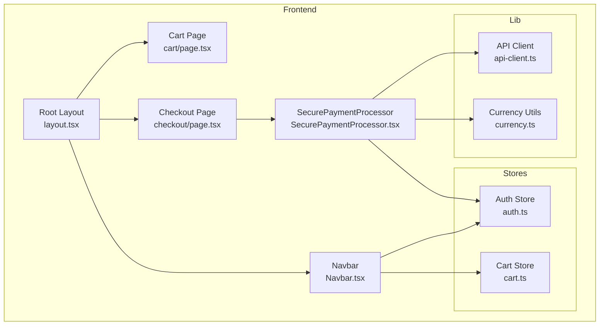
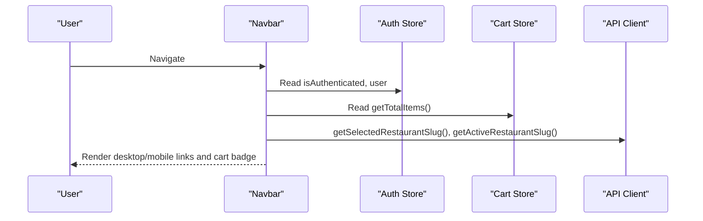
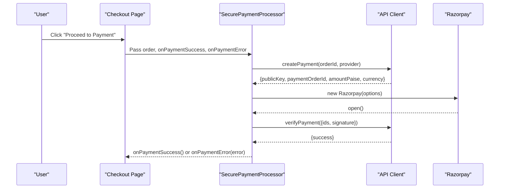
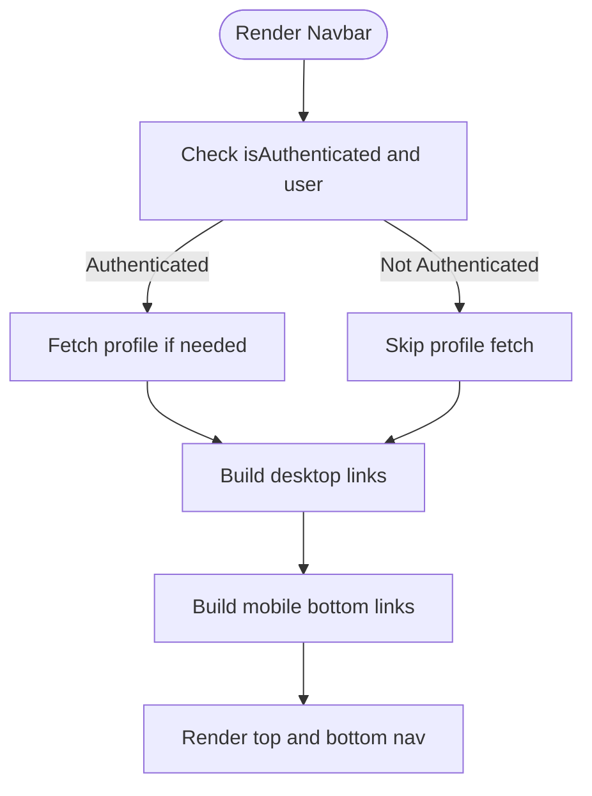
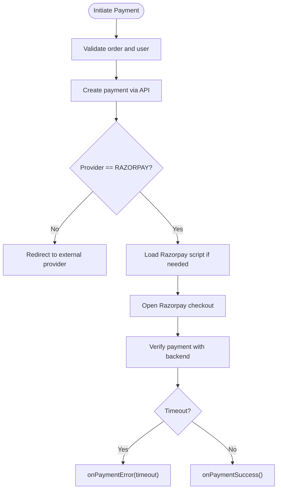
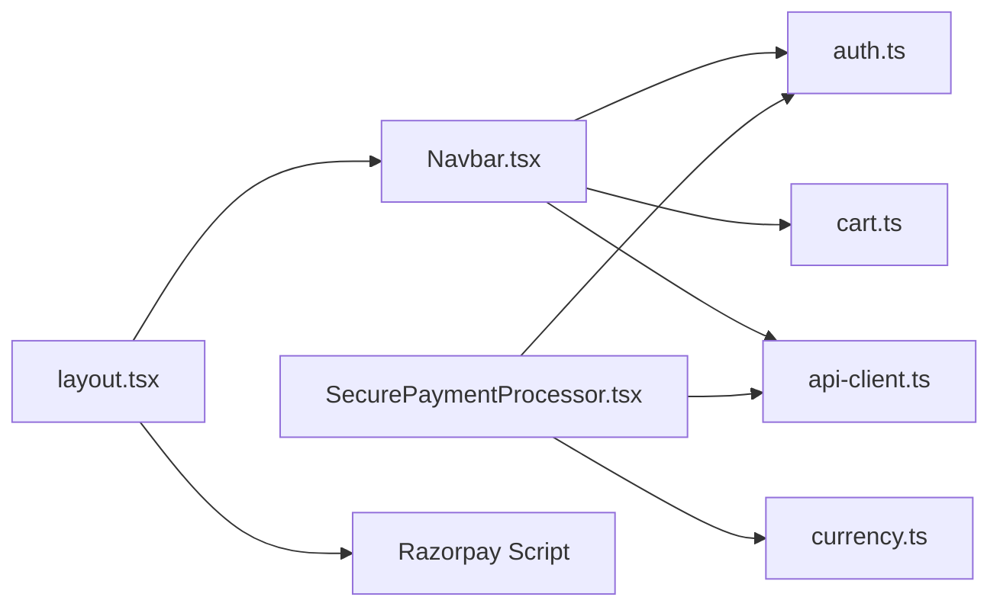

# Component Library

<cite>
**Referenced Files in This Document**
- [Navbar.tsx](file://restaurant-frontend/src/components/Navbar.tsx)
- [SecurePaymentProcessor.tsx](file://restaurant-frontend/src/components/SecurePaymentProcessor.tsx)
- [auth.ts](file://restaurant-frontend/src/store/auth.ts)
- [cart.ts](file://restaurant-frontend/src/store/cart.ts)
- [api-client.ts](file://restaurant-frontend/src/lib/api-client.ts)
- [currency.ts](file://restaurant-frontend/src/lib/currency.ts)
- [layout.tsx](file://restaurant-frontend/src/app/layout.tsx)
- [checkout/page.tsx](file://restaurant-frontend/src/app/checkout/page.tsx)
- [cart/page.tsx](file://restaurant-frontend/src/app/cart/page.tsx)
- [package.json](file://restaurant-frontend/package.json)
</cite>

## Table of Contents
1. [Introduction](#introduction)
2. [Project Structure](#project-structure)
3. [Core Components](#core-components)
4. [Architecture Overview](#architecture-overview)
5. [Detailed Component Analysis](#detailed-component-analysis)
6. [Dependency Analysis](#dependency-analysis)
7. [Performance Considerations](#performance-considerations)
8. [Troubleshooting Guide](#troubleshooting-guide)
9. [Conclusion](#conclusion)
10. [Appendices](#appendices)

## Introduction
This document describes the reusable UI component library for DeQ-Bite’s restaurant ordering platform. It focuses on two primary components:
- Navbar: A responsive navigation bar integrating authentication state, restaurant-aware routing, and mobile bottom navigation.
- SecurePaymentProcessor: A secure payment flow component that initializes Razorpay checkout, handles verification, and manages UX states during payment.

It explains component props, event handlers, composition patterns, context usage, styling customization, accessibility, testing strategies, and maintenance guidelines.

## Project Structure
The component library resides in the Next.js frontend under restaurant-frontend/src/components. Supporting stores and utilities are located under src/store and src/lib respectively. The Navbar is included globally via the root layout, while SecurePaymentProcessor is composed inside the checkout flow.

**Diagram sources**
- [layout.tsx:20-50](file://restaurant-frontend/src/app/layout.tsx#L20-L50)
- [Navbar.tsx:11-197](file://restaurant-frontend/src/components/Navbar.tsx#L11-L197)
- [cart/page.tsx:9-160](file://restaurant-frontend/src/app/cart/page.tsx#L9-L160)
- [checkout/page.tsx:13-557](file://restaurant-frontend/src/app/checkout/page.tsx#L13-L557)
- [SecurePaymentProcessor.tsx:72-347](file://restaurant-frontend/src/components/SecurePaymentProcessor.tsx#L72-L347)
- [auth.ts:24-177](file://restaurant-frontend/src/store/auth.ts#L24-L177)
- [cart.ts:26-92](file://restaurant-frontend/src/store/cart.ts#L26-L92)
- [api-client.ts:194-800](file://restaurant-frontend/src/lib/api-client.ts#L194-L800)
- [currency.ts:1-12](file://restaurant-frontend/src/lib/currency.ts#L1-L12)

**Section sources**
- [layout.tsx:20-50](file://restaurant-frontend/src/app/layout.tsx#L20-L50)
- [Navbar.tsx:11-197](file://restaurant-frontend/src/components/Navbar.tsx#L11-L197)
- [SecurePaymentProcessor.tsx:72-347](file://restaurant-frontend/src/components/SecurePaymentProcessor.tsx#L72-L347)
- [auth.ts:24-177](file://restaurant-frontend/src/store/auth.ts#L24-L177)
- [cart.ts:26-92](file://restaurant-frontend/src/store/cart.ts#L26-L92)
- [api-client.ts:194-800](file://restaurant-frontend/src/lib/api-client.ts#L194-L800)
- [currency.ts:1-12](file://restaurant-frontend/src/lib/currency.ts#L1-L12)

## Core Components
- Navbar
  - Purpose: Provides top and bottom navigation, cart badge, authentication actions, and restaurant-aware routing.
  - Key behaviors: Responsive desktop links, mobile bottom navigation, cart item count badge, conditional admin/kitchen links, and logout flow.
  - Stores used: Auth store for user and authentication state; Cart store for cart item count.
  - Utilities: API client for restaurant-aware paths and slug selection.
- SecurePaymentProcessor
  - Purpose: Manages secure payment flow with Razorpay, including order creation, checkout initialization, and verification.
  - Key behaviors: Dynamic provider selection, lazy script loading, verification timeout handling, and success/failure messaging.
  - Props: order, onPaymentSuccess, onPaymentError.
  - Stores/utilities: Auth store for user; API client for payment endpoints; currency formatter.

**Section sources**
- [Navbar.tsx:11-197](file://restaurant-frontend/src/components/Navbar.tsx#L11-L197)
- [SecurePaymentProcessor.tsx:66-76](file://restaurant-frontend/src/components/SecurePaymentProcessor.tsx#L66-L76)
- [auth.ts:24-177](file://restaurant-frontend/src/store/auth.ts#L24-L177)
- [cart.ts:26-92](file://restaurant-frontend/src/store/cart.ts#L26-L92)
- [api-client.ts:380-441](file://restaurant-frontend/src/lib/api-client.ts#L380-L441)
- [currency.ts:1-12](file://restaurant-frontend/src/lib/currency.ts#L1-L12)

## Architecture Overview
The Navbar integrates with Zustand stores and the API client to compute navigation links and badges. The SecurePaymentProcessor orchestrates backend payment creation, Razorpay checkout, and verification, emitting success/error callbacks to the parent checkout page.

**Diagram sources**
- [Navbar.tsx:11-197](file://restaurant-frontend/src/components/Navbar.tsx#L11-L197)
- [auth.ts:24-177](file://restaurant-frontend/src/store/auth.ts#L24-L177)
- [cart.ts:26-92](file://restaurant-frontend/src/store/cart.ts#L26-L92)
- [api-client.ts:266-303](file://restaurant-frontend/src/lib/api-client.ts#L266-L303)

**Diagram sources**
- [checkout/page.tsx:321-343](file://restaurant-frontend/src/app/checkout/page.tsx#L321-L343)
- [SecurePaymentProcessor.tsx:83-152](file://restaurant-frontend/src/components/SecurePaymentProcessor.tsx#L83-L152)
- [SecurePaymentProcessor.tsx:154-206](file://restaurant-frontend/src/components/SecurePaymentProcessor.tsx#L154-L206)
- [api-client.ts:380-441](file://restaurant-frontend/src/lib/api-client.ts#L380-L441)

## Detailed Component Analysis

### Navbar Component
- Responsibilities
  - Build desktop and mobile navigation menus based on authentication and user roles.
  - Compute cart item count and show badge on cart link.
  - Provide restaurant-aware routing helpers.
  - Handle logout and redirect to sign-in.
- Props and Composition
  - No props required; consumes stores and utilities internally.
  - Uses Next.js navigation hooks and Lucide icons.
- Responsive Behavior
  - Desktop: horizontal links with active state styling.
  - Mobile: bottom navigation bar with icons and badges, plus a profile link for authenticated users.
- Authentication Integration
  - Reads isAuthenticated, user, and calls getProfile if restaurantRole is missing.
  - Provides logout action that clears auth state and redirects.
- Mobile Menu Functionality
  - Mobile bottom navigation limits to four items; profile is handled separately in top bar.
  - Uses active state detection via pathname comparison.
- Styling and Accessibility
  - Uses Tailwind classes; focus-visible and active states for interactive elements.
  - Icons provide visual affordances; ensure sufficient contrast and label alternatives where needed.
- Usage Example
  - Included in root layout; no explicit usage required elsewhere.

**Diagram sources**
- [Navbar.tsx:21-25](file://restaurant-frontend/src/components/Navbar.tsx#L21-L25)
- [Navbar.tsx:40-60](file://restaurant-frontend/src/components/Navbar.tsx#L40-L60)
- [Navbar.tsx:64-193](file://restaurant-frontend/src/components/Navbar.tsx#L64-L193)

**Section sources**
- [Navbar.tsx:11-197](file://restaurant-frontend/src/components/Navbar.tsx#L11-L197)
- [auth.ts:95-115](file://restaurant-frontend/src/store/auth.ts#L95-L115)
- [cart.ts:78-84](file://restaurant-frontend/src/store/cart.ts#L78-L84)
- [api-client.ts:266-303](file://restaurant-frontend/src/lib/api-client.ts#L266-L303)

### SecurePaymentProcessor Component
- Responsibilities
  - Initiate secure payment via backend, initialize Razorpay checkout, and verify payment outcomes.
  - Manage loading, verifying, success, and failure states with user feedback.
- Props
  - order: Order object containing identifiers, totals, and table info.
  - onPaymentSuccess: Callback invoked upon successful verification.
  - onPaymentError: Callback invoked on failure or cancellation.
- Event Handlers
  - initiateSecurePayment: Creates payment, loads Razorpay script if needed, opens checkout.
  - handlePaymentSuccess: Verifies payment with backend and triggers success callback.
- Payment Flow
  - Backend creates payment and returns provider details.
  - Razorpay checkout is opened with prefilled customer details.
  - Verification race with timeout ensures robustness.
- Error Handling
  - Specific error messages for signature failures, not found, timeouts, and unsuccessful payments.
  - Cancellation handled via modal dismiss callback.
- Styling and Accessibility
  - Uses icons for status and security features; ensure readable labels and ARIA attributes where needed.
  - Disabled states during loading and verification.

**Diagram sources**
- [SecurePaymentProcessor.tsx:83-152](file://restaurant-frontend/src/components/SecurePaymentProcessor.tsx#L83-L152)
- [SecurePaymentProcessor.tsx:154-206](file://restaurant-frontend/src/components/SecurePaymentProcessor.tsx#L154-L206)
- [api-client.ts:380-441](file://restaurant-frontend/src/lib/api-client.ts#L380-L441)

**Section sources**
- [SecurePaymentProcessor.tsx:66-76](file://restaurant-frontend/src/components/SecurePaymentProcessor.tsx#L66-L76)
- [SecurePaymentProcessor.tsx:83-206](file://restaurant-frontend/src/components/SecurePaymentProcessor.tsx#L83-L206)
- [api-client.ts:380-441](file://restaurant-frontend/src/lib/api-client.ts#L380-L441)
- [currency.ts:1-12](file://restaurant-frontend/src/lib/currency.ts#L1-L12)

## Dependency Analysis
- Navbar depends on:
  - Auth store for user and authentication state.
  - Cart store for cart item count.
  - API client for restaurant-aware paths and slug resolution.
- SecurePaymentProcessor depends on:
  - Auth store for user details.
  - API client for payment creation and verification.
  - Currency utility for formatting amounts.
- Global inclusion:
  - Navbar is rendered in the root layout.
  - Razorpay script is preloaded in the root layout head.

**Diagram sources**
- [layout.tsx:20-50](file://restaurant-frontend/src/app/layout.tsx#L20-L50)
- [Navbar.tsx:11-197](file://restaurant-frontend/src/components/Navbar.tsx#L11-L197)
- [SecurePaymentProcessor.tsx:72-347](file://restaurant-frontend/src/components/SecurePaymentProcessor.tsx#L72-L347)
- [auth.ts:24-177](file://restaurant-frontend/src/store/auth.ts#L24-L177)
- [cart.ts:26-92](file://restaurant-frontend/src/store/cart.ts#L26-L92)
- [api-client.ts:194-800](file://restaurant-frontend/src/lib/api-client.ts#L194-L800)
- [currency.ts:1-12](file://restaurant-frontend/src/lib/currency.ts#L1-L12)

**Section sources**
- [layout.tsx:20-50](file://restaurant-frontend/src/app/layout.tsx#L20-L50)
- [Navbar.tsx:11-197](file://restaurant-frontend/src/components/Navbar.tsx#L11-L197)
- [SecurePaymentProcessor.tsx:72-347](file://restaurant-frontend/src/components/SecurePaymentProcessor.tsx#L72-L347)
- [auth.ts:24-177](file://restaurant-frontend/src/store/auth.ts#L24-L177)
- [cart.ts:26-92](file://restaurant-frontend/src/store/cart.ts#L26-L92)
- [api-client.ts:194-800](file://restaurant-frontend/src/lib/api-client.ts#L194-L800)
- [currency.ts:1-12](file://restaurant-frontend/src/lib/currency.ts#L1-L12)

## Performance Considerations
- Navbar
  - Uses memoized cart item count via store getter to avoid unnecessary re-renders.
  - Conditional profile fetch prevents redundant API calls.
- SecurePaymentProcessor
  - Lazy script loading avoids blocking initial render.
  - Timeout-based verification prevents hanging UI.
  - Disabled states during loading reduce accidental double-submissions.
- Recommendations
  - Consider caching restaurant slug and user roles to minimize repeated API calls.
  - Debounce or throttle navigation updates if dynamic slugs change frequently.

[No sources needed since this section provides general guidance]

## Troubleshooting Guide
- Navbar
  - If cart badge does not appear, verify getTotalItems returns a number and user is authenticated.
  - If restaurant-aware links are incorrect, check getActiveRestaurantSlug and withRestaurant helper.
- SecurePaymentProcessor
  - If payment fails immediately, inspect backend createPayment response and provider configuration.
  - If verification times out, ensure network connectivity and backend availability.
  - If Razorpay does not open, confirm the script is loaded and options are correctly formed.
- Global
  - If authentication state appears stale, ensure auth store persistence and token handling are intact.

**Section sources**
- [Navbar.tsx:11-197](file://restaurant-frontend/src/components/Navbar.tsx#L11-L197)
- [SecurePaymentProcessor.tsx:83-206](file://restaurant-frontend/src/components/SecurePaymentProcessor.tsx#L83-L206)
- [auth.ts:24-177](file://restaurant-frontend/src/store/auth.ts#L24-L177)
- [api-client.ts:380-441](file://restaurant-frontend/src/lib/api-client.ts#L380-L441)

## Conclusion
The Navbar and SecurePaymentProcessor components form the backbone of DeQ-Bite’s navigation and payment experiences. They integrate authentication, cart state, and backend APIs seamlessly, with responsive behavior and robust error handling. Following the composition patterns and best practices outlined here will help maintain and evolve these components effectively.

[No sources needed since this section summarizes without analyzing specific files]

## Appendices

### Component Props and Events Reference
- Navbar
  - No props required.
  - Consumes stores and utilities internally.
- SecurePaymentProcessor
  - Props:
    - order: Order object with id, totals, table, items, and optional paymentProvider.
    - onPaymentSuccess: () => void
    - onPaymentError: (error: string) => void

**Section sources**
- [SecurePaymentProcessor.tsx:66-76](file://restaurant-frontend/src/components/SecurePaymentProcessor.tsx#L66-L76)
- [Navbar.tsx:11-197](file://restaurant-frontend/src/components/Navbar.tsx#L11-L197)

### Usage Examples and Integration Patterns
- Navbar
  - Included automatically in the root layout; no explicit usage required.
- SecurePaymentProcessor
  - Integrated in the checkout page; receives order and callbacks from the parent.
  - Supports multiple payment providers; redirects for non-Razorpay providers.

**Section sources**
- [layout.tsx:20-50](file://restaurant-frontend/src/app/layout.tsx#L20-L50)
- [checkout/page.tsx:321-343](file://restaurant-frontend/src/app/checkout/page.tsx#L321-L343)
- [SecurePaymentProcessor.tsx:83-152](file://restaurant-frontend/src/components/SecurePaymentProcessor.tsx#L83-L152)

### Accessibility and UX Notes
- Navbar
  - Ensure keyboard navigation and focus indicators for links and buttons.
  - Provide aria-labels for icon-only links where helpful.
- SecurePaymentProcessor
  - Announce status changes (verifying, success, failed) to assistive technologies.
  - Provide clear error messages and retry options.

[No sources needed since this section provides general guidance]

### Testing Strategies and Storybook Integration
- Unit tests
  - Mock stores and API client to isolate component behavior.
  - Test navigation rendering under different auth and role states.
  - Test payment flow with mocked backend responses and timeouts.
- Storybook
  - Create stories for Navbar with different auth states and roles.
  - Create stories for SecurePaymentProcessor with various order states and error conditions.
- E2E tests
  - Validate end-to-end payment flow with a test provider mode if available.

[No sources needed since this section provides general guidance]

### Maintenance Guidelines
- Keep stores and utilities cohesive; avoid prop drilling by centralizing state.
- Centralize environment variables and configuration for payment providers.
- Regularly review and update dependencies to ensure security and compatibility.

[No sources needed since this section provides general guidance]